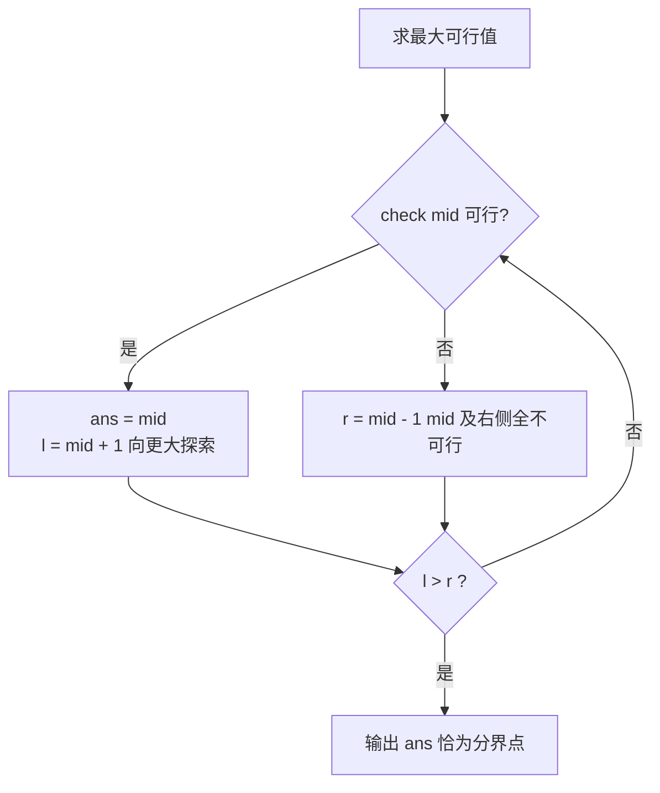

# 二分

## 零、知识地图

```text
二分
├── 1. 二分查找是什么（地基：中点砍半，O(log n)）
├── 2. 基础实现：闭区间写法（骨架：l<=r 配 mid±1 三件套）
├── 3. 二分答案思想（把「求最值」变成「猜一个值 + 验可行」）
├── 4. 通用模板与收缩方向（真则记 ans：最大 l 进、最小 r 退）
├── 5. check 函数设计方法论（判定器：一趟模拟 + 累计量 + 与限制比）
├── 6. 上下界怎么定（三问法：下界最宽松、上界最极端）
└── 7. 死循环防范与全流程实战 P2678（终止性法则 + 四件合体）
```

学习顺序：1 → 2 → 3 → 4 → 5 → 6 → 7。理由：1 是模型地基，2 是查找骨架与三件套纪律，3 把框架从数组搬到答案值域；4、5、6 是二分答案三大件（模板、check、定界），5、6 都依赖 4 的模板才有落点；7 整合全部，以 P2678 收束——没写熟 2 的骨架看不懂 4 的答案版，没想通 3 的单调性就理解不了 5 的 check 为什么合法。

## 一、为什么需要它

先看一道模板题（洛谷 P1873 砍树）：n 棵树排成一排，电锯的锯片定在高度 H，每棵树比 H 高的部分被砍下收走。要求砍下的木材总量至少 m 米，问 H 最大能定多高。最直接的想法是从高到低一个一个试 H：H=100 行不行？H=99 行不行？……每个候选高度要花 $O(n)$ 算一遍木材总量，而 H 的取值范围最高到 $10^9$——$10^9 \times 10^6 = 10^{15}$ 次操作，评测机会直接教你做人。

但这件事有个被浪费掉的信息：**H 越低，砍下的木材越多**。如果 H=100 时木材已经够用，那 H=99、H=98 全都够用；如果 H=100 不够，更高的 H 只会更不够。"够 / 不够"沿数轴连成两段，中间只有一个分界点——沿着这条单调性去猜，$10^9$ 次尝试立刻压缩成 30 次。**二分**，一套把"在单调空间里找分界点"从线性压到对数级的框架，是竞赛里性价比最高的算法思想之一。

本篇讲 7 个知识点：二分查找是什么、闭区间写法、二分答案思想、通用模板与收缩方向、check 设计方法论、上下界怎么定、死循环防范与 P2678 全流程实战。前三个是原理，中间三个是二分答案的三大件（模板、check、定界），最后一个是整合实战；顺序理由：没写熟查找骨架（知识点 2）就看不懂答案模板（知识点 4），没想通单调性（知识点 3）就理解不了 check 为什么合法（知识点 5）。

## 二、知识点逐讲（每个知识点一节，共 7 节）

### 1. 二分查找是什么

前置依赖：[[枚举与模拟]]（逐个试错的暴力基线）、[[尺取法]]（同属"利用有序性加速扫描"思想）
后续衔接：[[#2. 基础实现：闭区间写法]]（骨架落地）、[[#3. 二分答案思想]]（框架搬到答案值域）

**① 它解决什么问题**

**二分查找**在**有序**序列中定位目标：每次考察候选区间的中间元素，与目标比较后直接排除一半候选，直到找到或区间为空。它解决的核心问题是把线性逐个比对 $O(n)$ 压成 $O(\log n)$——$10^6$ 个元素只需约 20 次比较。性质：单次比较与排除 $O(1)$；整体查找 $O(\log n)$；前提是候选区间有序。

| 操作 | 复杂度 | 前提 | 返回值 |
|------|--------|------|--------|
| 单次比较与排除 | $O(1)$ | 候选区间有序 | 新区间 |
| 整体查找 | $O(\log n)$ | 数组有序（升序） | 目标下标或「不存在」 |
| 判存在（`binary_search`） | $O(\log n)$ | 有序 | bool |
| 要下标（`lower_bound`） | $O(\log n)$ | 有序 | 第一个 $\geq x$ 的位置 |

**② 直觉理解**

模型级类比（本篇贯穿）：**猜价格游戏**。主持人心里有个价格（目标），你每猜一个数，他只回答"高了"或"低了"——每句回答都排除掉一半价格区间。你必胜的策略就是每次报区间的**中点**：无论答案落在哪半边，剩下的一半都不超过原区间的一半。二分查找就是把这场游戏搬到有序数组上，"高了/低了"由 `a[mid]` 与目标的大小关系给出。

用具体数字跑一遍：有序数组 `[2, 5, 8, 11, 15, 19, 23]`（下标 0..6）查 15：

```text
第 1 轮：l=0, r=6, mid=3, a[3]=11 < 15 → 左半连同 11 排除，l=4
第 2 轮：l=4, r=6, mid=5, a[5]=19 > 15 → 右半连同 19 排除，r=4
第 3 轮：l=4, r=4, mid=4, a[4]=15 == 15 → 找到，返回 4
```

3 轮比较，$n=7$，$\lceil \log_2 7 \rceil = 3$，恰好打满上界。

**③ 原理与推导**

为什么每次都能安全地排除一半？升序数组里 `a[mid]` 与目标 tg 只有三种关系：(1) 相等——找到，结束；(2) `a[mid] > tg`——中点已偏大，而**右侧只会更大**（有序），右半全部排除，去左半找；(3) `a[mid] < tg`——对称地排除左半。排除的合法性完全依赖"有序"：无序数组里"右侧只会更大"不成立，排除一半就是扔掉可能藏有目标的一半。

复杂度依据：区间长度 $n \to n/2 \to n/4 \to \cdots \to 1$，每轮一次比较，共 $\lceil \log_2 n \rceil$ 轮。

设计动机（为什么问中点而不是别的位置）：候选区间长 $L$ 时，比较一次后留下的最坏情况是"目标所在一侧"的全部。取中点，两侧都不超过 $\lceil L/2 \rceil$；**任何别的分割点，都存在一侧更大**，最坏情况更差。取中点是最坏情况最优的问法。

**④ 代码演示**

排序已就绪时，STL 提供两个现成的二分工具（内部就是本节的框架）：

```cpp
// 前提：a[0..n-1] 已升序排序
bool ok = binary_search(a, a + n, 15);   // 只判存在：返回 true/false
int* p  = lower_bound(a, a + n, 15);     // 返回第一个 >= 15 的位置的指针
int idx = p - a;                          // 指针减首指针 = 下标；找不到时 idx == n
```

// 边界：lower_bound 找不到时返回尾后位置 n，用下标前先判断 idx < n
// 复杂度：两工具均 O(log n)

手写版骨架见知识点 2——先想清楚"为什么这样写"，再背模板。

**错误写法对照**

```diff
- 在无序数组上直接套二分  // 坑1：排除一半的推理失效，答案随机错
+ 二分前先问：数据有序吗（或先排序）  // 修复：排除的合法性来自有序
- 以为基础版返回第一个等于目标的下标  // 坑2：有重复元素时语义错
+ 要"第一个"用 lower_bound 或边界式改造  // 修复：基础版只保证"某一个"
- int mid = (l + r) / 2;  // 坑3：l+r 超 2^31-1 溢出为负，下标越界 RE
+ int mid = l + (r - l) / 2;  // 修复：先减后加不越界
```

**⑤ 典型应用**

- 力扣 704 二分查找（力扣）：本知识点的裸模板题，给定有序数组与目标，返回下标或 -1。
- 力扣 LCR 073 狒狒吃香蕉（力扣）：二分"速度"这个答案值，知识点 5 主讲。
- 自编迁移题（自编）：**降序**数组 `[23, 19, 15, 11, 8, 5, 2]` 中查 15，返回下标，不存在返回 -1。建议先独立做，再对照题解。

  题解：降序只是把"右侧只会更大"翻成"右侧只会更**小**"。常见错解：照抄升序方向——mid=3, a[3]=11 < 15 → `l=4`，接着越界返回 -1，错。纠正：`a[mid] < tg` 说明目标在值**更大**的一侧，降序数组里更大的值在**左**边，应 `r = mid - 1`；`a[mid] > tg` 才 `l = mid + 1`。重推：mid=3, 11 < 15 → r=2；mid=1, 19 > 15 → l=2；mid=2, a[2]=15 → 返回 2。改动的只有两个比较分支的方向，循环骨架不变——**有序方向决定比较方向，不影响框架**。

**⑥ 坑点与边界**

> [!caution]
> **【易错】** 忘写有序前提直接二分 → 排除一半的推理失效，答案随机错 → 二分前先问：数据有序吗。

> [!caution]
> **【易错】** 有重复元素时以为返回第一个 → 基础版返回「某一个」等于目标的位置 → 要第一个用 `lower_bound` 或知识点 2 的边界改造。

> [!caution]
> **【易错】** `mid = (l + r) / 2` 在大值域下溢出为负 → 用防溢出写法 `mid = l + (r - l) / 2`（知识点 2 详述）。

结论失效条件：数组无序、或要找的是"第一个满足某条件"而非"等于某值"时，本节框架需要改造。

> [!example]-
> **边界数据集（先自己跑一遍，再展开对照）**
> 1. 空输入：n=0 → l=0, r=-1，循环不执行返回 -1；lower_bound 返回尾后位置 idx==n==0，判 idx<n 为假 → 「不存在」。
> 2. 单元素：[7] 查 7 → mid=0 命中返回 0；查 3 → 7>3 → r=-1 退出返回 -1。
> 3. 全相同：[5,5,5] 查 5 → mid=1 命中返回 1——返回"某一个"，不保证第一个（第一个在下标 0），与 ⑥ 坑 2 呼应。
> 4. 严格递增：[2,5,8,11] 查 11 → mid=1(5<11)→l=2；mid=2(8<11)→l=3；mid=3 命中，3 轮返回 3。
> 5. 严格递减：[9,7,5,3] 查 5（升序模板直接套）→ mid=1(7>5)→r=0；mid=0(9>5)→r=-1 退出返回 -1——5 明明在下标 2，结果确定性为 -1：有序方向与比较方向必须匹配。
> 6. 极值：[1, 2147483647] 查 2147483647 → mid=1 命中返回 1；mid 用 l+(r-l)/2 计算无中间溢出。

收尾回扣：现在回到开场砍树问题——那里没有数组，但"H 越低木材越多"恰恰是答案值域上的"有序"，猜价格游戏照样能玩，这就是知识点 3 的事。

### 2. 基础实现：闭区间写法

前置依赖：[[#1. 二分查找是什么]]（排除的合法性来源）
后续衔接：[[#4. 通用模板与收缩方向]]（记录式改造）、[[#7. 死循环防范与全流程实战（P2678）]]（三件套约定的完整分析）

**① 它解决什么问题**

知识点 1 给了骨架的样子，本节把每一行的"为什么"钉死，回答三个疑问：为什么 `while` 带等号？为什么收缩用 `mid ± 1` 而不是 `mid`？为什么循环必然结束？这三问的答案合称**三件套**：`l <= r` 配 `mid ± 1`，是竞赛里最常用的**闭区间写法**——`l`、`r` 都是可以取到的候选位置。

| 模板字段 | 取值 | 语义 |
|---------|------|------|
| 初始化 | `l = 0, r = n - 1` | 候选闭区间（两端都是候选） |
| 循环条件 | `while (l <= r)` | 区间非空才继续 |
| 中点 | `mid = l + (r - l) / 2` | 防溢出（本节 ⑥） |
| 收缩 | `r = mid - 1` / `l = mid + 1` | mid 已比较过，必须排除 |
| 终止 | `l > r` | 区间为空，目标不存在 |

**② 直觉理解**

继续猜价格模型：闭区间 `[l, r]` 就是你**还相信答案在里面**的候选范围；`mid` 是这一轮的报价；`mid ± 1` 的含义是"这个数我刚问过、答案不是它，从候选里划掉"。带着等号循环（`l <= r`）是因为 `l == r` 时区间里还剩最后一个没问过的候选，必须再问一轮；等号去掉的时机是换成另一种区间约定（`r` 本身不算候选的左闭右开写法），两种约定各自自洽、不可混搭。

用具体数字跑一遍：`[2, 5, 8]` 查 5——l=0, r=2, mid=1, a[1]=5 命中返回 1。查 4——mid=1, 5 > 4 → r=0；mid=0, 2 < 4 → l=1 > r=0 退出，返回 -1。两轮出结果，不存在的判断同样高效。

**③ 原理与推导**

正确性靠一条**循环不变量**（资料未覆盖此名词，属补充）：每一轮开始时，要找的答案（若存在）始终在 $[l, r]$ 内。`a[mid] > tg` 时，mid 位置以及 mid 右侧**每个**位置都必然大于 tg（有序），它们的值全不等于 tg，连同 mid 一起排除后不变量仍成立；`a[mid] < tg` 同理排除左半。mid 本身已经比较过且不相等，留在区间里只会让区间无法真正缩小——这就是用 `mid ± 1` 而非 `mid` 的原因。

终止性论证（不跳步）：每轮结束后新区间端点严格越过 mid（`r = mid - 1` 时新区间右端 $\le mid-1 < mid \le$ 旧右端，`l = mid + 1` 对称），所以区间长度是严格递减的自然数列，必然降到 0（`l > r`）触发退出。这是知识点 7 死循环分析的根基。

设计动机：为什么竞赛默认闭区间而不是别的写法？因为闭区间的两端语义直观（"答案还可能在 [l, r] 里"），且 `while (l <= r)` 的写法在二分答案改造（知识点 4）后无需变动——`ans` 记录型二分与查找型二分共享同一套区间约定，少一次换脑。

**④ 代码演示**

```cpp
int bs(int a[], int n, int tg) {      // 在升序 a[0..n-1] 中查 tg
    int l = 0, r = n - 1;             // 闭区间：两端都是候选位
    while (l <= r) {                  // 区间非空
        int mid = l + (r - l) / 2;    // 防溢出写法
        if (a[mid] == tg) return mid; // 找到
        else if (a[mid] > tg) r = mid - 1;  // 右半连同 mid 排除
        else l = mid + 1;             // 左半连同 mid 排除
    }
    return -1;                        // 区间空：不存在
}
```

// 相对源文件（课件 4.1 第 2 页单行压缩版）的改动：仅排版展开与 mid 改防溢出写法，逻辑一致（两版本地实测等价）
// 边界：n=1 时 l=r=0，恰好一轮比较后退出
// 复杂度：O(log n)（知识点 1③）

**执行追踪表**

数据沿用 ② 节 `[2, 5, 8]`（升序，下标 0 起）两问——查 5 命中、查 4 不存在：

| 步骤 | 当前元素 | 结构状态 | 动作 | 结果 |
|------|---------|---------|------|------|
| 1 | l=0, r=2, mid=1, a[1]=5 | 闭区间 [0,2]（查 5） | 5 == 5，命中 | 返回下标 1 |
| 2 | l=0, r=2, mid=1, a[1]=5 | 闭区间 [0,2]（查 4） | 5 > 4，mid 连同右半排除 | r=0，区间 [0,0] |
| 3 | l=0, r=0, mid=0, a[0]=2 | 闭区间 [0,0] | 2 < 4，mid 连同左半排除 | l=1，区间 [1,0] 空 |
| 4 | — | l=1 > r=0 | while (l <= r) 不成立，退出 | 返回 -1 |

每轮区间严格缩小，4 步内终止——三件套纪律的机械体现。

**错误写法对照**

```diff
- while (l < r) { ... else r = mid - 1; }  // 坑1：l<r 与 mid±1 混搭，剩两元素时可能提前退出漏判，WA
+ while (l <= r) { ... else r = mid - 1; }  // 修复：一套约定写到底，l==r 时还剩最后一个候选要问
- if (a[mid] == tg) { /* 无 return */ }  // 坑2：命中不返回，继续循环死循环或覆盖答案
+ if (a[mid] == tg) return mid;  // 修复：命中分支立即返回
- int mid = (l + r) / 2;  // 坑3：l+r 超 2^31-1 溢出为负
+ int mid = l + (r - l) / 2;  // 修复：防溢出写法；值域 10^18 级时 l、r、mid 全换 long long
```

**⑤ 典型应用**

- 力扣 704 二分查找（力扣）：闭区间写法的直接落地。
- 力扣 LCR 073 狒狒吃香蕉（力扣）：其主程序正是把本节模板的"命中即返回"改造成"记录后收缩"（知识点 4 主讲）。
- 自编迁移题（自编）：有序数组 `[1, 3, 3, 3, 7]`，用闭区间写法查 3，你的模板返回哪个下标？再查 4，几轮退出？建议先独立做，再对照题解。

  题解：l=0, r=4, mid=2, a[2]=3 命中返回 2——返回"某一个" 3，恰好是中间那个，但**不保证是第一个**（若数组为 `[3, 3, 3, 3, 7]`，mid=2 仍返回 2 而第一个 3 在下标 0），要"第一个"用 `lower_bound`。查 4：mid=2, 3 < 4 → l=3；mid=3, 3 < 4 → l=4；mid=4, 7 > 4 → r=3 < l=4 退出，共 3 轮返回 -1。此题检验两点：命中即返回的语义、不存在时的轮次数感。

**⑥ 坑点与边界**

> [!caution]
> **【易错】** `while (l < r)` 配 `r = mid - 1` 混搭 → 区间剩两个元素时（l=r-1，mid=l）可能提前退出漏判 → 一套约定写到底：`l <= r` 必配 `mid ± 1`。

> [!caution]
> **【易错】** 找到后忘记 return 继续循环 → 死循环或覆盖答案 → 命中分支必须立即返回（或按知识点 4 记录后收缩）。

> [!caution]
> **【易错】** `mid = (l + r) / 2` 溢出 → $l+r$ 超过 $2^{31}-1 \approx 2.1 \times 10^9$ 时变负数 → 统一写 `l + (r - l) / 2`；值域 $10^{18}$ 级时 l、r、mid 全换 long long。

数据范围与类型上限：int 值域内本模板安全；累计量与乘法的溢出问题见知识点 5。结论失效条件：查"第一个 $\geq x$"时需改造成不返回的边界式写法，竞赛直接用 `lower_bound`。

> [!example]-
> **边界数据集（先自己跑一遍，再展开对照）**
> 1. 空输入：n=0 → l=0, r=-1，l>r 循环不执行，返回 -1（区间空即不存在）。
> 2. 单元素：n=1 → l=r=0，恰好一轮比较后退出（④ 边界注释的落实）。
> 3. 全相同：[3,3,3,3,7] 查 3 → mid=2 命中返回 2，而第一个 3 在下标 0——命中即返回的语义，要"第一个"用 lower_bound。
> 4. 严格递增：[2,5,8] 查 8 → mid=1(5<8)→l=2；mid=2 命中返回 2，2 轮。
> 5. 严格递减：[3,2,1] 查 1（升序模板直接套）→ mid=1(2>1)→r=0；mid=0(3>1)→r=-1 → 返回 -1——1 存在于下标 2 却报不存在，确定性错误。
> 6. 极值：l=0, r=2147483647 → mid = 0 + 2147483647/2 = 1073741823，防溢出写法安全；若写 (l+r)/2，在 l=1、r=2147483647 时 l+r=2147483648 溢出为负 → 防溢出写法统一规避。

收尾回扣：开场砍树问题里你不会写 `return mid`——因为没人告诉你答案是多少，你只知道每次猜完"行 / 不行"，这正是下一节二分答案要解决的事。

### 3. 二分答案思想

前置依赖：[[#1. 二分查找是什么]]（比较与排除的同构来源）
后续衔接：[[#4. 通用模板与收缩方向]]、[[#5. check 函数设计方法论]]（单调性是 check 合法的根基）

**① 它解决什么问题**

**二分答案**：当所求是「最大的可行值」或「最小的可行值」时，不直接计算答案，而是**猜一个值 x，用 check(x) 判断 x 是否可行，依据判定结果砍半答案区间**。课件 4.1 第 3 页的表述：「二分查找的应用（二分答案——猜答案）：假定一个解判断是否可行」；典型题型语为「最小化最大值 / 最大化最小值」。

| 要素 | 含义 | 来源例题 |
|------|------|---------|
| 答案区间 | 答案可能取到的值的范围 | P1873：H ∈ [0, 最大树高] |
| check(x) | 判定「x 可行吗」的函数 | P1873：砍到高度 x 木材量 ≥ m？ |
| 单调性 | x 可行 ⇒ 某一侧的值全可行 | 木材量随 H 增大而减少 |

**② 直觉理解**

猜价格游戏正式回到台前：**二分答案 = 在答案的数轴上玩猜价格**。主持人脑中的价格就是那道题的真实答案，你的每次报价就是猜的值 x，主持人的"高了/没高"就是 check(x) 的返回值——每句回答排除一整段答案区间。与数组查找的差别只有一个：回答不是免费的，要**你写一个函数算出来**。

用具体数字跑一遍（P1873 样例，n=5, m=20, 树高 4 42 40 26 46）：H=36 时砍得 $(42-36)+(40-36)+(46-36)=6+4+10=20 \geq 20$，可行；H=37 时 $5+3+9=17 < 20$，不可行。可行与不可行的分界点恰在 36——与样例答案一致。H=36 以下全可行（砍得更多），H=37 以上全不可行，两段各自连成一片。

**③ 原理与推导**

为什么「猜答案」是合法操作，不会漏掉正解？关键在单调性：以 P1873 为例，锯片高度 H 越高，砍下的木材越少；若 H=36 恰好够，则 H ≤ 36 全够、H ≥ 37 全不够。**可行域是答案区间上连成一片的一段（前缀或后缀），不可行域也是连成一片的**，两者之间存在唯一分界点——它就是所求的最值。在这样的区间上二分，与在有序数组上二分完全同构：check(x) 的真假就是「a[mid] 与 tg 的大小关系」的替身。

> [!important]
> **【重点】** 二分答案的合法性判据只有一条：**check 的结果关于答案值单调**（可行域连成一片）。拿到题先构造 check，再验证单调性，两者都成立才能二分。

反例看清判据的分量：若 check(x) 定义为「x 是质数」，则 x 取 2, 3, 5, 7, 11 时真、4, 6, 8, 9, 10 时假——真假沿数轴交错，可行域全是"洞"，砍半推理彻底失效，不能二分「最大的可行质数」。单调性不是形式，是砍半合法性的全部来源。

设计动机：为什么这类题值得二分？因为「最值 + 可行分界」结构在题目里极常见（最大锯高、最快速度、最大最短跳距），而"验证一个给定值"通常远比"直接求最值"简单——P1873 验证是 $O(n)$ 一趟加法，直接求却要对每个候选高度都算。二分答案把「求最值」的难题降维成「猜 + 验」的简单题再乘上 $\log$ 次数。

**④ 代码演示**

把猜价格游戏写成最小可运行程序，看清"报价—回答—砍半"三步的机械形态：

```cpp
#include <iostream>
using namespace std;
int main() {                     // 猜价格游戏：答案 73，范围 [0,100]
    int lo = 0, hi = 100, guess;
    while (lo <= hi) {
        guess = lo + (hi - lo) / 2;      // 每轮报中点
        if (guess == 73) { cout << "猜中：" << guess << endl; break; }
        if (guess < 73) lo = guess + 1;  // 回答"低了"：排除左半
        else hi = guess - 1;             // 回答"高了"：排除右半
    }
    return 0;
}
```

// 边界：7 轮内必中（$\lceil \log_2 101 \rceil = 7$）
// 复杂度：O(log 值域)；真实二分答案题里 `guess == 73` 换成 check(mid) 的真假

**错误写法对照**

```diff
- check(x) = 「x 是质数」，直接二分最大可行质数  // 坑1：真假沿数轴交错，可行域全是洞，砍半失效
+ 动笔前先证「x 可行 ⇒ 某一侧全可行」  // 修复：单调性是砍半合法性的唯一来源
- 求最小可行却写 if (check(mid)) l = mid + 1;  // 坑2：按"求最大"收缩，答案反向错
+ 求最小可行：if (check(mid)) { ans = mid; r = mid - 1; }  // 修复：先判题型再定方向（知识点 4）
- return sum > m;  // 坑3：题目是"至少 m"，恰好相等时判错
+ return sum >= m;  // 修复：逐字核对题目的 >= 与 >
```

**⑤ 典型应用**

- 洛谷 P1873 砍树（洛谷）：最大化锯片高度 H（本篇主线，知识点 4 逐轮手推）。
- 力扣 LCR 073 狒狒吃香蕉（力扣）：最小化吃香蕉速度 k。
- 洛谷 P2678 跳石头（洛谷）：最大化最短跳跃距离（知识点 7 全流程主讲）。
- 自编迁移题（自编，判断题）：以下三问哪些能用二分答案？(a) n 段电缆要切成 k 段等长，求最长能切多长；(b) n 个数里求最大的质数；(c) 运送 n 件货，船载重 w 一趟趟运，求最少趟数。建议先独立做，再对照题解。

  题解：(a) 能。长度越长能切出的段数越少（单调），check(x) =「按 x 切，段数 $\geq$ k」，可行域是前缀，求右端点——典型「最大化最小值」。(b) 不能。质数分布无单调性，check 真假交错（见 ③ 反例）。(c) 不能（按题面）。趟数由 w 直接决定，是单调函数求值，不是「最值 + 可行分界」；若反过来问「k 趟运完的最小载重 w」则能二分。识别心法：**二分答案二分的是被题目求的那个量**，别的量只能当 check 的材料。

**⑥ 坑点与边界**

> [!caution]
> **【易错】** 不验证单调性就二分 → 可行域有洞时砍半推理失效，答案随机错 → 动笔前先证「x 可行 ⇒ 某一侧全可行」。

> [!caution]
> **【易错】** 把「求最小可行」的题按「求最大可行」收缩 → 答案反向 → 先判题型再套模板（方向规则见知识点 4）。

> [!caution]
> **【易错】** check 里把「至少 m」写成「大于 m」→ 边界值恰好相等时判错 → 逐字核对题目的 $\geq$ 与 $>$。

边界与失效：check 不单调时二分答案直接失效；「最大化最小值 / 最小化最大值」两大题型语是识别信号。

> [!example]-
> **边界数据集（先自己跑一遍，再展开对照）**
> 1. 空输入：n=0、m=0（P1873 外推）→ check(x) 恒 sum=0 ≥ 0 真 → 可行域是全区间，答案=上界 r（分界点退到端点）。
> 2. 单元素：n=1, a=[10], m=5 → H=5 时砍 5≥5 真；H=6 时 4<5 假 → 分界点 5，可行域 [0,5] 连成一片。
> 3. 全相同：n=3, a=[4,4,4], m=6 → H=2 时 2+2+2=6≥6 真；H=3 时 3<6 假 → 答案 2，可行域是前缀。
> 4. 严格递增树高 a=[1,2,3], m=6 → 仅 H=0 可行（H=1 时 0+1+2=3<6 假）→ 答案 0，单调性仍成立，答案可取到下界。
> 5. 严格递减树高 a=[3,2,1], m=2 → H=1 时 (3-1)+(2-1)=3≥2 真；H=2 时 1<2 假 → 答案 1。
> 6. 极值：n=1e6 棵、树高 1e9、m=1 → 木材总量最坏 1e15 超 int，check 累计量必须 long long（知识点 5③）；H 本身在 [0,1e9] 内，二分约 30 轮。

收尾回扣：现在你能解决开场那个问题了——把「H 够不够」写成 check，木材量随 H 单调减，可行域是前缀，30 次猜测锁定分界点。但模板长什么样、往哪边收缩，是下一节的事。

### 4. 通用模板与收缩方向

前置依赖：[[#2. 基础实现：闭区间写法]]、[[#3. 二分答案思想]]
后续衔接：[[#5. check 函数设计方法论]]、[[#6. 上下界怎么定]]（模板的 check 与区间两大件）

**① 它解决什么问题**

三份例题代码共享同一套**二分答案模板**，与查找模板（知识点 2）的差别只有一处：命中不返回，而是**记录 ans 后继续收缩**，直到区间为空，ans 停在分界点上。本节解决两个问题：为什么要记录后收缩？两个题型（求最大可行 / 求最小可行）各往哪边收缩？

| 题型 | check(mid) 为真时的动作 | 收缩含义 | 例题 |
|------|----------------------|---------|------|
| 求最大可行值 | `ans = mid; l = mid + 1` | mid 可行 → 更大处找更优 | P1873、P2678 |
| 求最小可行值 | `ans = mid; r = mid - 1` | mid 可行 → 更小处找更优 | LCR 073 |
| check 为假（两题型通用） | 反向收缩（`r = mid - 1` 或 `l = mid + 1`） | mid 不可行 → 去另一侧 | — |

**② 直觉理解**

继续猜价格模型：check 可行时，你把 mid 记在**小本本**（ans 变量）上——"至少这个数是行得通的"——然后追问"还有更好的吗"：求最大就往高半区继续猜（`l = mid + 1`），求最小就往低半区继续猜（`r = mid - 1`）。游戏结束时（区间空了），小本本上记的就是最后一次"行得通"的报价，恰好是分界点。

用具体数字跑一遍（P1873 样例，l 从 0、r 从最大树高 46 出发，答案 36）：

| 轮 | l | r | mid | check（木材量） | 动作 |
|----|---|---|-----|---------------|------|
| 1 | 0 | 46 | 23 | $19+17+23+3=62 \geq 20$ 真 | ans=23, l=24 |
| 2 | 24 | 46 | 35 | $7+5+11=23 \geq 20$ 真 | ans=35, l=36 |
| 3 | 36 | 46 | 41 | $1+5=6 < 20$ 假 | r=40 |
| 4 | 36 | 40 | 38 | $4+2+8=14 < 20$ 假 | r=37 |
| 5 | 36 | 37 | 36 | $6+4+10=20 \geq 20$ 真 | ans=36, l=37 |
| — | 37 | 37 | — | l > r 退出 | 输出 36 |

（已通过本地编译验证：程序输出 36，与逐轮手推一致。）

**③ 原理与推导**

为什么记录后收缩而不是直接返回？check(mid) 为真只说明 mid **可行**，不说明 mid 是**最优**——可行域是一整段，mid 可能落在段中间。把 ans 更新为 mid，然后向着「更优」的方向砍半，区间耗尽时 ans 恰好走过分界点。

正确性论证（不跳步）：设分界点为 $x^*$（最大可行值情形，可行域 $(-\infty, x^*]$）。归纳两条不变量：ans 始终是已验证的可行值（每次更新都发生在 check 为真时），且 $x^*$ 始终在 $[l, r]$ 内——check 为真收缩 l 时，mid 可行 $\Rightarrow mid \leq x^*$，l 越不过 $x^*$；check 为假收缩 r 时，mid 不可行 $\Rightarrow mid > x^*$，r 收掉的全是 $x^*$ 右侧。循环结束时区间空，说明 $x^*$ 已被某轮 mid 取到并存入 ans——事实上最后一次 check 为真的 mid 正是 $x^*$ 本身。

设计动机：为什么模板必须带 ans 变量？查找的目标唯一（命中即答案），而二分答案的最优值在最后一轮才被"踩中"，中途的可行 mid 都可能被更优的取代——必须有个变量把当前已知的最优**存下来**，否则区间收缩过去就丢了。



文字版推导链：猜 mid → 可行则记下并向更优侧推进 → 不可行则整侧排除 → 区间收缩到空 → ans 停在可行域边界（分界点）上。

**④ 代码演示**

```cpp
int l = 0, r = /* 上界 */, mid, ans = -1;
while (l <= r) {
    mid = l + (r - l) / 2;          // 防溢出
    if (check(mid)) { ans = mid; l = mid + 1; }  // 求最大可行：向右压
    else r = mid - 1;
}
// ans 即答案（初始 -1 仅防「全程不可行」时未赋值）
```

// 边界：ans 初值要选「不可能取到的值」以便识别无解；求最小可行时两行动作对调（见 ① 表）
// 复杂度：O(log(值域) × check 代价)——P1873 为 O(n log maxH)

**错误写法对照**

```diff
- 求最小可行题抄了 if (check(mid)) { ans = mid; l = mid + 1; }  // 坑1：收缩方向反，答案错
+ if (check(mid)) { ans = mid; r = mid - 1; }  // 修复：口诀"最小可行，真则 r 退"
- if (check(mid)) l = mid + 1; else r = mid - 1;  // 坑2：ans 忘写，区间空后什么都拿不到
+ if (check(mid)) { ans = mid; l = mid + 1; }  // 修复：ans 与收缩成对出现
- int ans = 0;  // 坑3：0 可能是合法解（P1873 的 H=0），无解与"答案 0"混淆
+ int ans = -1;  // 修复：初值选值域外的哨兵
```

**⑤ 典型应用**

- 洛谷 P1873 砍树（洛谷）：求最大可行 H，模板第一行的直接应用（② 轨迹表，实测 36）。
- 力扣 LCR 073 狒狒吃香蕉（力扣）：求最小可行速度，check 为真时 `ans = mid; r = mid - 1`（实测 4）。
- 自编迁移题（自编，改错题）：下面是「最小可行值」题（求最小的速度 s 使得任务在时限 T 内完成）的模板，找出两处错误并改正：`while (l <= r) { mid = (l + r) / 2; if (check(mid)) { l = mid + 1; } else { ans = mid; r = mid - 1; } }`。建议先独立做，再对照题解。

  题解：错误一，收缩方向反了——最小可行题 check 为真应 `ans = mid; r = mid - 1`（向更小探索），为假才 `l = mid + 1`；错误二，ans 记在了不可行分支上——ans 必须记录**可行**的 mid，不可行的值不是答案候选。此外 `(l+r)/2` 在大值域下有溢出隐患，顺带改为 `l + (r - l) / 2`。改错训练的要点：把 ① 表格的两行动作背到条件反射。

**⑥ 坑点与边界**

> [!caution]
> **【易错】** 「求最小」抄了「求最大」的收缩方向 → 答案错 → 口诀：最大可行，真则 l 进；最小可行，真则 r 退。

> [!caution]
> **【易错】** `ans = mid` 忘写，只收缩 → 区间空后什么都拿不到 → ans 与收缩必须成对出现。

> [!caution]
> **【易错】** ans 初值用 0 且 0 是合法解 → 无解与「答案就是 0」混淆 → 初值选值域外的哨兵（-1 或 -0x3f3f3f3f）。

数据范围与边界：全程无可行解时 ans 保持初值，竞赛题一般保证有解，但初值别用 0（0 可能是合法答案，如 P1873 的 H=0）；值域很大（如 $10^{18}$）时轮数也只有约 60，但 mid 必须 long long。结论失效条件：收缩方向写反是「答案差 1」或「答案取到不可行值」的直接原因。

> [!example]-
> **边界数据集（先自己跑一遍，再展开对照）**
> 1. 空输入：不适用：模板片段无输入；外推 P1873 n=0、m=0 → check 恒真 → l 一路压到 r+1，ans=r（分界点=上界）。
> 2. 单元素：n=1, a=[10], m=5, 区间 [0,10] → mid=5 真 ans=5 l=6；mid=8 假 r=7；mid=6 假 r=5；l=6>r=5 退出，ans=5。
> 3. 全相同：a=[4,4,4], m=6, 区间 [0,4] → mid=2 真 ans=2 l=3；mid=3 假 r=2；退出 ans=2。
> 4. 严格递增：a=[1,2,3], m=6, 区间 [0,3] → mid=1: 0+1+2=3<6 假 r=0；mid=0: 6≥6 真 ans=0 l=1；退出 ans=0——ans 初值 -1 使「答案就是 0」可识别（呼应坑 3）。
> 5. 严格递减：a=[3,2,1], m=2, 区间 [0,3] → mid=1: 2+1=3≥2 真 ans=1 l=2；mid=2: 1<2 假 r=1；退出 ans=1。
> 6. 极值：值域 [0, 1e9] → mid 最大约 5e8，int 安全；值域 1e18 时轮数约 60 但 mid 必须 long long（④ 注释）。

收尾回扣：模板有了，但它能不能算对，全看 check 写得对不对——下一节把三道真题的 check 摆在一起对照。

### 5. check 函数设计方法论

前置依赖：[[#3. 二分答案思想]]、[[#4. 通用模板与收缩方向]]
后续衔接：[[#6. 上下界怎么定]]（下界须过 check 在 l 处的除零安全联动）、[[#7. 死循环防范与全流程实战（P2678）]]（双指针 check 实战）

**① 它解决什么问题**

check 是二分答案的**判定器**：输入猜的答案值 x，输出「x 可行吗」。课件 4.2 第 3 页原话：「judge 函数每个题有每个题的写法，但大体上的思想应该都是一样的——想办法检测这个解是不是合法」。三份源码给出三个范式：

| 例题 | check(x) 判什么 | 实现方式 | 复杂度 |
|------|---------------|---------|--------|
| P1873 砍树 | 高度 x 下木材量 ≥ m？ | 一趟累加 $\max(0, a_i - x)$ | $O(n)$ |
| LCR 073 狒狒 | 速度 x 下总耗时 ≤ h？ | 一趟累加 $\lceil a_i / x \rceil$ | $O(n)$ |
| P2678 跳石头 | 最短跳距 x 下移走 ≤ m 块？ | 双指针一趟数移走块数 | $O(n)$ |

**② 直觉理解**

check 的设计路径只有两问：**「如果答案真的是 x，题目会怎么进行」和「进行完拿什么和哪个限制比」**。三例直觉化：P1873——若锯片定在 x，每棵树贡献 $\max(0, a_i - x)$，累加后与 m 比；LCR 073——若速度为 x，每堆香蕉耗时 $\lceil a_i / x \rceil$（一小时吃不完得占整小时），累加后与 h 比；P2678——若最短跳距为 x，从起点逐石试探，间距不足就移走、够就跳过去，一趟数出移走块数与 m 比。共同结构：**一趟线性模拟 + 一个累计量 + 一个与限制值的比较**。

用具体数字跑一遍（LCR 073：piles = 3 6 7 11, h=8）：k=4 时 $\lceil 3/4 \rceil + \lceil 6/4 \rceil + \lceil 7/4 \rceil + \lceil 11/4 \rceil = 1+2+2+3 = 8 \leq 8$，可行；k=3 时 $1+2+3+4=10 > 8$，不可行。分界在 4，与样例答案一致。

**③ 原理与推导**

向上取整为什么必须先判余数：`a/k + 1` 在 a 恰好被 k 整除时多加 1（$\lceil 6/3 \rceil = 2$，而 6/3+1=3，错）；正确整数实现 `a/k + (a%k ? 1 : 0)`，源码 LCR 073 用的正是这个。这是"占整小时"语义（吃不完也得耗一小时）在代码上的落点。

「跑完再比」与「提前退出」的取舍（课件特别强调的设计动机）：P2678 的判定中途遇到累计量超限可以提前 return false（源码中被注释掉的 `//if(sum>m)return 0;`），**但不写它也是对的**——一趟跑完再比，正确性同样成立且更不容易写错边界；提前退出只是常数优化。课件保留注释版，是在教「先保正确，再谈常数」。

累计量为什么默认 long long：P1873 的木材总量最坏 $10^6$ 棵 × $10^9$ 米 $= 10^{15}$，LCR 073 的总耗时最坏 $10^{13}$ 小时级，int（上限约 $2.1 \times 10^9$）都装不下——两份源码都正确用了 long long，这不是巧合，是这类题的标配。另注意乘法溢出：`k * a[i]` 两个 int 相乘先溢出再赋给 long long 也晚了，左操作数必须先转型。

**④ 代码演示**

P1873 的 check（源文件 P1873.cpp，逻辑一致）：

```cpp
#define ll long long
int n, m;          // n 棵树，需要 m 米
int a[1000005];

bool check(int h) {
    ll sum = 0;                            // 累计量必须 ll；复杂度 O(n)
    for (int i = 1; i <= n; i++)
        if (a[i] - h > 0) sum += a[i] - h; // 不足 h 的树贡献 0
    return sum >= m;                       // 与限制比：「至少 m」是 >= 不是 >
}
```

// 相对源文件：无改动（源码即此写法）；手算 h=36 得 $6+4+10=20 \geq 20$ 真，h=37 得 $5+3+9=17$ 假

LCR 073 的 check（相对源文件的改动：补 `#include <vector>`——源文件缺失此头文件，原样编译不过（g++ 实测报 `'vector' was not declared`）；逻辑一致）：

```cpp
#include <vector>
bool check(vector<int>& piles, int k, int h) {
    long long t = 0;
    int n = piles.size();
    for (int i = 0; i < n; i++) {
        t += piles[i] / k;
        if (piles[i] % k) t++;             // 除不尽占整小时：向上取整
    }
    return t <= h;                         // 「时限内」是 <=
}
```

// 边界：k 的下界若从 0 起二分，`piles[i]/k` 除零 RE——源码把 l 定为 1 正是为此（知识点 6）
// 复杂度：O(n)

**错误写法对照**

```diff
- t += a[i] / k + 1;  // 坑1：a 恰被 k 整除时多加 1（6/3+1=3 而 ceil=2），总耗时虚高 WA
+ t += a[i] / k + (a[i] % k ? 1 : 0);  // 修复：先判余数再补 1
- return sum > m;  // 坑2：比较符抄错（>= 写成 >），边界解被误判
+ return sum >= m;  // 修复：对照题目"至少/至多"逐字核对
- int sum = 0; sum += a[i] - h;  // 坑3：1e6 棵 × 1e9 米 = 1e15 超 int，WA 且极难排查
+ ll sum = 0; sum += a[i] - h;  // 修复：累计量默认 long long，乘法左操作数先转型
```

**⑤ 典型应用**

- 洛谷 P1873 砍树（洛谷）：求和型 check 的范式（④ 第一段）。
- 力扣 LCR 073 狒狒吃香蕉（力扣）：计时型 check，向上取整是全题题眼（④ 第二段）。
- 洛谷 P2678 跳石头（洛谷）：双指针计数型 check，知识点 7 逐轮手推。
- 自编迁移题（自编）：n 台机器产能 $a_i$，限用 d 天，总产量至少 P。二分「每台机器开机天数 k」，写出 check(k)。建议先独立做，再对照题解。

  题解：机器 i 开 k 天产 $k \cdot a_i$，总产量 $\sum k \cdot a_i$ 随 k 单调增；产量「至少 P」意味着可行域是后缀 $[k^*, +\infty)$，这是**求最小可行 k**——check 真时 `ans = k; r = k - 1` 向左压。训练点有二：可行域方向（后缀求左端 vs 前缀求右端，收缩方向随之相反）与乘法溢出（`k * a[i]` 的左操作数先转 long long）：

```cpp
bool check(long long k) {          // 复杂度 O(n)
    long long total = 0;
    for (int i = 1; i <= n; i++) total += k * a[i];   // k 已是 ll，乘积不溢出
    return total >= P;
}
```

**⑥ 坑点与边界**

> [!caution]
> **【易错】** 向上取整写成 `a/k + 1`（整除时多加 1）→ 必须先判余数：`a/k + (a%k ? 1 : 0)`。

> [!caution]
> **【易错】** 比较符抄错（$\geq$ 写成 $>$）→ 恰好等于限制的边界解被误判 → 对照题目逐字核对。

> [!caution]
> **【易错】** 累计量用 int → 大数据 WA 而不是 RE，极难排查 → check 的累计量默认 long long，乘法先转型。

边界与失效：check 必须在**两端点**也正确——P1873 的 h=0（全砍）与 h=最大树高（几乎砍不到）都会被二分取到，逐行核对这些极端输入的行为。结论失效条件：check 里存在除法时，下界必须避开除零（与知识点 6 联动）。

> [!example]-
> **边界数据集（先自己跑一遍，再展开对照）**
> 1. 空输入：n=0 → 循环不执行：P1873 返回 0 ≥ m（仅 m=0 时真）；LCR 073 返回 0 ≤ h（真）。
> 2. 单元素：P1873 n=1, a=[10], m=10 → check(0): 10≥10 真；check(1): 9<10 假 → 分界 0（下界本身可行）。
> 3. 全相同：LCR 073 piles=[6,6], k=6, h=2 → 6/6=1 无余数不补 1，t=2≤2 真；k=3 → t=4>2 假 → 分界 6（验证整除不补 1）。
> 4. 严格递增：piles=[1,2,3], k=2 → ceil=1+1+2=4；h=4 真、h=3 假 → 分界 4。
> 5. 严格递减：piles=[3,2,1], k=3 → ceil=1+1+1=3，h=3 真；k=2 → ceil=2+1+1=4>3 假 → 分界 3。
> 6. 极值：a[i]=1e9、n=1e6 → 木材总量最坏 1e15、总耗时最坏 1e13 小时级，均超 int → 累计量 long long 是标配；k=1 时 piles[i]/1 无除零。

收尾回扣：现在你能解决开场问题里「每个候选高度要算一遍木材量」这一步了——一趟 $O(n)$ 加法就是 check，乘上 $\log$ 次猜测总共 $O(n \log \text{maxH})$，$10^{15}$ 次操作变成 $2 \times 10^7$。还差最后一件事：猜的范围从哪到哪。

### 6. 上下界怎么定

前置依赖：[[#4. 通用模板与收缩方向]]、[[#5. check 函数设计方法论]]
后续衔接：[[#7. 死循环防范与全流程实战（P2678）]]（区间 [1, s] 全流程使用）、[[质数筛法]]（主题链下一站）

**① 它解决什么问题**

二分答案的答案区间 $[l, r]$ 必须**把真实答案夹在中间**——区间错了，后面全错。三份源码给出三种定界来源，本节把它们归纳成一套可复用的「三问法」：

| 例题 | 下界 l | 上界 r | 定界依据 |
|------|--------|--------|---------|
| P1873 | 0（H=0 全砍，永远可行） | 读入时 `r = max(a[i])`（最高树，再高砍不到） | 题目物理意义 |
| LCR 073 | 1（每小时至少吃 1 根） | 读入时 `r = max(piles[i])`（一小时至多吃完一堆） | 题目约束 + 防除零 |
| P2678 | 1（最短跳距至少 1） | s（赛道全长，一步跳到头） | 题目物理意义 |

**② 直觉理解**

继续猜价格模型：答案区间就是你**告诉对手的报价范围**——范围定窄了，真实价格根本不在里面，游戏必输；定宽了，多猜几轮而已（$\log$ 级代价）。所以定界的直觉是两句话：下界问「最宽松能到多松」（P1873 的 H=0 锯片贴地、全部砍光），上界问「最极端需要多极端」（P2678 的跳距至多赛道全长，一步直达）。

用具体数字跑一遍（报警信号演示）：P1873 若上界误取 n=5（树的**个数**而不是**高度**），而真实分界在 36——二分在 [0, 5] 内转一圈，输出的"最大可行 H"必然是某个 $\leq 5$ 的被顶住的值，且**恰好等于你设的上界 5**。「输出恰好等于上界」就是答案被区间右端顶住的报警信号：分界点根本不在区间里，先查上界。

**③ 原理与推导**

「三问法」的完整推导：(1) 答案最小可能多小？——取题目允许的最宽松情形：P1873 的 0、LCR 073 的 1（题目规定每小时都吃，速度下限 1，同时避开 check 的除零——一举两得）、P2678 的 1。(2) 答案最大可能多大？——取物理极限：P1873 再高也无需超过最高树（更高砍不到任何木材，check 恒假，包含它无意义）、LCR 073 一小时吃完一堆后更快也不省时、P2678 起点到终点直达。(3) 区间端点本身必须可行吗？——不必强求，只要分界点落在 $[l, r]$ 内即可；但 l=r=max 这类「一眼值」常可直接心算验证（P1873 若 H=0 都凑不够 m 则无解）。

> [!important]
> **【重点】** 上下界不是背出来的，是从题目物理意义推出来的：下界问「最宽松能到多松」，上界问「最极端需要多极端」。宁可稍宽（多几轮二分，$\log$ 级代价），不可太窄（漏掉真实答案，直接错）。

设计动机：为什么 P1873 用 `r = max(a[i])` 而不是写死 $10^9$？写死也能过（多几轮），但 `max` 定界自带「为什么这是上界」的解释，且让「输出贴上界」这个报警信号（② 演示）保持有效——故意开大的上界会让真答案与顶界无法区分。

**④ 代码演示**

P1873 源码的定界（读入时同步取 max，一次遍历两件事）：

```cpp
int l = 0, r = 0;
for (int i = 1; i <= n; i++) { cin >> a[i]; r = max(r, a[i]); }  // 上界 = 最高树
```

// 边界：r 若写死 1e9 也能过（多 log 层），但 max 定界是「值域最小正确区间」的体现
// 相对源文件：无改动

**错误写法对照**

```diff
- int r = n;（把树的个数当高度上界）  // 坑1：答案量纲是值，区间夹不住真解
+ r = max(r, a[i]);（读入时同步取最大树高）  // 修复：上界取值的物理极限
- int l = 0;（LCR 073 速度下界取 0）  // 坑2：check 里 piles[i]/k 除零 RE
+ int l = 1;  // 修复：下界先过"check 在 l 处能否安全执行"一关
- 输出恰等于上界时直接提交  // 坑3：答案被右端顶住的报警信号被无视
+ 查上界是否设小（真分界点可能不在区间内）  // 修复：贴界即排查
```

**⑤ 典型应用**

- 洛谷 P1873 砍树（洛谷）：下界 0、上界最高树（物理意义型）。
- 力扣 LCR 073 狒狒吃香蕉（力扣）：下界 1（约束 + 防除零双职责）、上界最大堆。
- 洛谷 P2678 跳石头（洛谷）：下界 1、上界赛道全长（知识点 7 全流程使用）。
- 自编迁移题（自编，原型为力扣 410 分割数组的最大值 / 经典「 books 分配」）：n 本书排成一排分给 k 个人抄写，每人连续拿一段，求一种分法使「所有人中最厚的页数」最小。给二分的 l、r 与 check 的判定量。建议先独立做，再对照题解。

  题解：二分「最厚的页数上限 x」（最小化最大值）。下界 = 所有书页数的 max——x 至少要装下最厚那本，否则那本书永远无法归属，check 恒假；上界 = 总页数（一个人全拿的物理极限）。check(x)：贪心从头扫，当前段能塞就塞、塞不下换人，数用的人数 $\leq$ k 则可行。定界训练点：**合法的下限常常由数据本身（max）决定，不是 0 或 1**——这是三问法第 1 问的进阶形态。

**⑥ 坑点与边界**

> [!caution]
> **【易错】** 上界取「n」而不是「值域」→ 答案的量纲是**值**（高度/速度/距离），不是**个数** → 先问答案的单位。

> [!caution]
> **【易错】** LCR 073 下界取 0 → check 里 `piles[i]/k` 除零 RE → 下界先过一遍「check 在 l 处能不能安全执行」。

> [!caution]
> **【易错】** 输出恰等于上界不警觉 → 答案被区间右端「顶住」→ 这是贴界报警，查上界是否设小。

数据范围与类型联动：r 到 $10^9$ 级别时 `(l+r)` 逼近 int 上限（防溢出写法兜底）；$10^{18}$ 级别时 l、r、mid 全换 long long。结论失效条件：题目答案可能取到负值或非整数时，区间定义要先重新审视。

> [!example]-
> **边界数据集（先自己跑一遍，再展开对照）**
> 1. 空输入：n=0 → r 保持初值 0，区间 [0,0] → mid=0，check: sum=0≥m 仅 m=0 真 → 输出 0（贴上界，需人工核对是否真分界）。
> 2. 单元素：a=[10], m=5 → 区间 [0, max=10]，答案 5（知识点 4 已逐轮推过）。
> 3. 全相同：a=[10,10], m=1 → r=max=10，正确区间内答案 9；若误把 r 取成 n=2 → 输出 2 恰等于上界，"贴界报警"触发，提示上界设小。
> 4. 严格递增：a=[1,2,3], m=6 → r=max=3 夹住答案 0；下界 0 不可省（H=0 是唯一可行值，取 1 会漏解）。
> 5. 严格递减：a=[3,2,1], m=2 → r=max=3，答案 1（知识点 4 已推）；上界写死 1e9 也能过，只是多几轮。
> 6. 极值：树高 1e9 → r=1e9，(l+r) 最坏约 2e9 逼近 int 上限，防溢出写法 l+(r-l)/2 兜底；值域再高（1e18）则 l、r、mid 全换 long long。

收尾回扣：现在开场问题的三件套齐了——check（知识点 5）、模板与方向（知识点 4）、定界（本节）。把 P1873 三件合起来跑，输出的 36 已经是正确答案。最后一节处理唯一剩下的坑：这套代码在什么情况下会**停不下来**。

### 7. 死循环防范与全流程实战（P2678）

前置依赖：[[#4. 通用模板与收缩方向]]、[[#5. check 函数设计方法论]]、[[#6. 上下界怎么定]]
后续衔接：[[质数筛法]]、[[单调栈]]（主题链后续站点）

**① 它解决什么问题**

课件 4.2 第 4 页提醒「二分的代码注意细节的配合避免死循环：手推代码」，本节把它展开为两条终止性法则，并以 P2678（洛谷，一年一度的「跳石头」比赛：赛道长 s，n 块石头，最多移走 m 块，求**最短跳跃距离的最大值**）做全流程整合——定界、check、模板、防死循环四件事一次走完。

| 终止性要素 | 法则 | 违反后果 |
|-----------|------|---------|
| 区间收缩 | 每轮后 $[l, r]$ 长度严格减小（`mid ± 1`） | 死循环 |
| 中点计算 | `mid = l + (r - l) / 2`（防溢出） | 大值域答案错乱 |

**② 直觉理解**

死循环的机理用一句话说：区间缩到 $l == r$ 时 `mid == l == r`，若这轮收缩写成了 `r = mid`（而非 `mid - 1`），区间纹丝不动——同一个 mid 被反复计算，永不终止。就像猜价格游戏里你反复报同一个数：主持人每次都答"高了"，你却不把它从区间里划掉，游戏永远进行下去。防死循环的纪律由此而来：**循环条件、收缩动作、mid 归属三件套必须同属一个约定**——`l <= r` 配 `mid ± 1`（mid 比较过、被排除），`l < r` 配 `r = mid`（mid 未定、保留）；混搭即死循环。

课件说「手推代码」是第二道防线：写完后用小数据逐轮抄下 l、r、mid、check、ans 五列（知识点 4② 的轨迹表就是标准格式），任何一轮区间没变小，当场暴露。

**③ 原理与推导**

为什么混搭会出事（不跳步）：`while (l < r)` 的约定里 r 本身不算候选（答案在 $[l, r)$ 内），r 不需要被"比掉"，所以收缩用 `r = mid` 合法；此时若错配 `mid ± 1`，区间剩两个元素（l = r-1，mid = l）时 `r = mid - 1 = l - 1 < l`，最后一个候选没比过就退出，漏判。反过来，`l <= r` 的约定里 mid 已比较过必须排除，若错配 `r = mid`，就出现 ② 描述的 $l == r == mid$ 原地踏步。两套约定内部各自自洽、交叉即错——这是知识点 2⑥ 第一条坑的完整解释。

设计动机：为什么课件坚持「手推代码」而不只靠测试？因为死循环是**运行时才暴露**的错误，本地小数据可能恰好不触发（比如答案不在边界），评测机上才卡死；手推是静态检查，写完的当下就能发现区间没缩小。

**④ 代码演示**

P2678 完整实现（源文件 P2678.cpp，逻辑一致；check 是双指针模拟）：

```cpp
#include <iostream>
using namespace std;
int s, n, m;
int a[500005];

bool check(int mi) {                 // mi：假定的最短跳距；复杂度 O(n)
    int sum = 0;                     // 移走块数
    int now = 0, nex = 0;            // now：当前所站位置（下标），nex：试探下标
    while (nex < n) {                // n 已含终点（见 main）
        nex++;
        if (a[nex] - a[now] < mi) sum++;  // 跳不过去：移走，now 不动
        else now = nex;              // 跳得过去：站上去（now 更新！）
    }
    return sum <= m;                 // 跑完再比（知识点 5③ 的课件取向）
}

int main() {
    cin >> s >> n >> m;
    for (int i = 1; i <= n; i++) cin >> a[i];
    a[n + 1] = s;                    // 终点也当成一块石头，统一处理最后一段
    n++;
    int l = 1, r = s, mid, ans;      // 定界：下界 1，上界赛道全长（知识点 6）
    while (l <= r) {
        mid = l + (r - l) / 2;       // 防溢出
        if (check(mid)) { ans = mid; l = mid + 1; }  // 求最大可行：向右压
        else r = mid - 1;
    }
    cout << ans << endl;
    return 0;
}
```

// 相对源文件的改动：仅补注释与 mid 改防溢出写法，逻辑一致
// 边界：终点入数组（a[n+1]=s）让最后一段「终点前的距离」也走同一套判定，免特判
// 复杂度：O(n log s)

**执行追踪表**

数据沿用 ⑤ 节课件特殊数据 `s=8, n=3, m=1, 石头 2 4 7`（终点入数组后 a=[0,2,4,7,8]、n=4，区间 [1,8]）：

| 步骤 | 当前元素 | 结构状态 | 动作 | 结果 |
|------|---------|---------|------|------|
| 1 | l=1, r=8, mid=4 | 区间 [1,8] | check(4)：2<4 移、4≥4 站、7-4=3<4 移、8-7=1<4 移 → sum=3 | 假（3>1）→ r=3 |
| 2 | l=1, r=3, mid=2 | 区间 [1,3] | check(2)：2≥2 站、4-2=2≥2 站、7-4=3≥2 站、8-7=1<2 移 → sum=1 | 真（1≤1）→ ans=2, l=3 |
| 3 | l=3, r=3, mid=3 | 区间 [3,3] | check(3)：2<3 移、4≥3 站、7-4=3≥3 站、8-7=1<3 移 → sum=2 | 假（2>1）→ r=2 |
| 4 | l=3, r=2 | 区间空 | while (l <= r) 不成立，退出 | 输出 ans=2 |

三轮锁定分界点 2，与 ⑤ 逐轮手推及实测输出一致。

**错误写法对照**

```diff
- 手推 check 时 now 一直用旧值算 a[nex] - a[now]  // 坑1：判定整体错位，得出错误可行性（本篇 ⑤ 的真实教训）
+ 每轮把 now 显式抄进表格  // 修复：手推错与程序对撞，错在哪个变量一眼可见
- for (i=1..n) 读石头，终点不入数组  // 坑2：最后一段跳距漏判，边界答案错
+ a[n+1] = s; n++;  // 修复：终点当一块石头，统一走主循环
- while (l < r) { ... r = mid - 1; }  // 坑3：三件套混搭，死循环或漏解
+ while (l <= r) { ... r = mid - 1; }  // 修复：l<=r 必配 mid±1，一套到底
```

**⑤ 典型应用**

- 洛谷 P2678 跳石头（洛谷）：官方样例（s=25, n=5, m=2，石头 2 11 14 17 21）实测输出 4，与题目答案吻合。
- 课件 4.2 第 3 页特殊数据（s=8, n=3, m=1，石头位置 2 4 7）：完整手推如下——注意第四轮 now 的追踪，这是本题最易错处。

check(3)（x=3 可行吗，n 已含终点共 4 个位置）：

| 轮 | nex | a[nex] | now | a[nex]-a[now] | 动作 |
|----|-----|--------|-----|---------------|------|
| 1 | 1 | 2 | 0 | $2 < 3$ | 移走 2 号石，sum=1 |
| 2 | 2 | 4 | 0 | $4 \geq 3$ | now=2（站上位置 4） |
| 3 | 3 | 7 | 2 | $3 \geq 3$ | now=3（站上位置 7） |
| 4 | 4 | 8 | 3 | $1 < 3$ | 移走 7 号石，sum=2 |

$sum = 2 > m = 1$，check(3) = **假**。check(2)：四轮依次判断——间距 2、2、3 均 $\geq 2$ 全部站上（now 走到 1、2、3），最后一段 $8-7=1 < 2$ 移走 7 号石 sum=1，$sum = 1 \leq m = 1$，check(2) = **真**。分界点在 2，答案 2（已实测：程序对该数据输出 2）。

> [!warning]
> **【难点】** 本篇生成时的真实教训（验证记录）：验收者初推 check(3) 时，第 4 轮误用旧值 now=2 计算 $8 - 4 = 4 \geq 3$（漏看第 3 轮 $7-4=3 \geq 3$ 已把 now 推进到 3），得出「3 可行、答案应为 3」的错误结论；实测程序输出 2，逐轮复查才发现漏看 now 更新。**双指针 check 手推时，now 每轮的值必须显式抄在表格里**——这正是课件要求「手推代码」的原因：手推错与程序对撞，错在哪个变量一眼可见。

- 自编迁移题（自编，P2678 变体）：河道清障。河道长 L，n 个障碍物（位置递增），清除工具至多处理 k 个。船只需要从 0 划到 L，要求**任意连续两次停泊点间距不小于 d**（0 与 L 也是停泊点）。求最大的 d。建议先独立做，再对照题解。

  题解：与 P2678 完全同构——(1) 二分的量：最短停泊间距 d 对应最短跳距 x；(2) check 的累计量：需清除的障碍数对应需移走的石头数，与 k 对 m 比；(3) 终点处理：L 入位置数组对应 `a[n+1]=s`。check 只需换名：

```cpp
bool check(int d) {
    int cnt = 0, now = 0, nex = 0;
    while (nex < n) {
        nex++;
        if (a[nex] - a[now] < d) cnt++;   // 障碍太密：清掉，now 不动
        else now = nex;                    // 够宽：停上去
    }
    return cnt <= k;
}
```

变式训练的目的：把 P2678 从「背下来的题」变成「认得出的一类题」——题型语（最大化最小值）、定界（1 与 L）、check 结构（双指针数清除量）三项全部平移，即「同一模板换皮」。

**⑥ 坑点与边界**

> [!caution]
> **【易错】** check 里 now 忘更新（或手推漏看更新）→ 判定结果整体错位 → now 每轮显式抄表（⑤ 验证记录）。

> [!caution]
> **【易错】** 终点不入数组、最后一段跳距漏判 → 边界答案错 → `a[n+1]=s; n++;` 统一走主循环。

> [!caution]
> **【易错】** 三件套混搭（`l < r` 配 `mid ± 1` 或反之）→ 死循环或漏解 → ③ 的约定分析背牢。

数据范围与边界：P2678 的石头位置题目保证递增给出，check 的双指针依赖递增——若数据无序需先排序；m=0（一块都不能移）时答案就是原序列相邻距离的最小值，check 天然正确，无需特判。结论失效条件：区间端点与收缩动作一旦改动，必须回到 ③ 重新验证终止性。

> [!example]-
> **边界数据集（先自己跑一遍，再展开对照）**
> 1. 空输入：不适用：P2678 约束 n≥1；外推 n=0 → a[1]=s、n=1，check 从起点直达终点（s ≥ mi 恒真，sum=0≤m）→ 全程可行，答案 s。
> 2. 单元素：s=10, n=1, m=0, 石头位于 5 → 位置 [0,5,10]：check(5) 两段全 5≥5 站上 sum=0 真；check(6) 起需移走 sum≥1>0 假 → 答案 5（=min(5,5)，无块可移）。
> 3. 全相同（等距）：s=9, 石头 3、6, m=1 → 位置 [0,3,6,9]：check(3) 三段全 3≥3 站上 sum=0 真；check(4)：3<4 移、6-0=6≥4 站、9-6=3<4 移 → sum=2>1 假 → 答案 3（移哪一块最近距都是 3）。
> 4. 严格递增：官方样例 s=25, n=5, m=2, 石头 2 11 14 17 21 → 输出 4（笔记已实测吻合）。
> 5. 严格递减：不适用：P2678 保证石头位置递增给出，check 双指针依赖递增；数据乱序需先排序（⑥ 已说明）。
> 6. 极值：s=1e9, n=1, m=0, 石头位于 5e8 → check(5e8) 两段全站上 sum=0 真；check(5e8+1) 需移走 sum=1 假 → 答案 5e8；mid 用防溢出写法，int 内安全。

收尾回扣：现在你能完整解决开场那个问题了——check 一趟模拟（知识点 5）、模板向右压（知识点 4）、区间 [1, s]（知识点 6）、每轮 `mid ± 1` 保终止（本节），$10^{15}$ 的暴力变成 $O(n \log s)$ 的 30 轮游戏。二分的全套装备，到此齐备。

## 三、全篇坑点总表

| # | 坑 | 正解 |
|---|-----|------|
| 1 | 无序数组直接二分 | 先排序或确认数据有序（知识点 1③） |
| 2 | 三件套混搭（`l<=r` 配 `r=mid`） | 闭区间约定：`l<=r` 配 `mid±1`，一套到底（知识点 7③） |
| 3 | `mid=(l+r)/2` 溢出 | `mid = l + (r - l) / 2`（知识点 2⑥） |
| 4 | check 不单调就二分 | 先证可行域连成一片（知识点 3③） |
| 5 | 收缩方向反（求最小抄成求最大） | 「最大值真则 l 进，最小值真则 r 退」（知识点 4①） |
| 6 | `ans=mid` 忘写 | ans 与收缩成对出现（知识点 4⑥） |
| 7 | ans 初值用 0（0 可能是合法解） | 值域外哨兵：-1 或 -0x3f3f3f3f（知识点 4⑥） |
| 8 | 向上取整写 `a/k+1` | `a/k + (a%k ? 1 : 0)`（知识点 5③） |
| 9 | 比较符 $\geq$ 与 $>$ 抄错 | 逐字对照题目限制（知识点 5⑥） |
| 10 | check 累计量用 int | 默认 long long，乘法先转型（知识点 5③） |
| 11 | 上下界量纲错（把个数当值） | 上下界是值的量纲：高度/速度/距离（知识点 6①） |
| 12 | 输出恰等于上界不警觉 | 答案贴界报警，查上界是否设小（知识点 6②） |
| 13 | 双指针 check 漏看 now 更新 | 逐轮抄表：l/r/mid/check/now 五列（知识点 7⑤） |
| 14 | 终点不入数组，最后一段漏判 | `a[n+1]=s; n++;` 统一主循环（知识点 7④） |

## 四、总结与自测

- 二分是一套框架加一个单调方向：查找场景单调性藏在有序数组里，答案场景藏在「可行域连成一片」里；check 的真假就是大小比较的替身。
- 闭区间三件套：`l <= r` 配 `mid ± 1`，`mid = l + (r - l) / 2` 防溢出；循环不变量「答案始终在 $[l, r]$ 内」保证正确，区间长度严格递减保证终止。
- 二分答案三大件：模板（真则记 ans 并向更优侧压：最大 l 进、最小 r 退）、check（一趟模拟 + 累计量 + 与限制比；累计量默认 long long）、定界（下界最宽松、上界最极端，宁宽勿窄）。
- 模型级类比「猜价格游戏」贯穿全篇：报价是 mid，主持人的高/低是 check，砍半是收缩，小本本是 ans。
- P2678 双指针 check 手推的教训：now 每轮显式抄表，漏看一轮更新全盘皆错。
- 前置概念清单：有序数组与下标、while 循环与边界条件、函数与 bool 返回值、long long 与溢出、向上取整的整数实现、STL `binary_search` / `lower_bound`。

### 自测清单

- [ ] 能不看笔记复述二分查找与二分答案的同构关系（比较对象的差别）
- [ ] 能独立推导知识点 4③ 的正确性论证（ans 不变量 + 分界点必被踩中）
- [ ] 能默写二分答案模板并口答两个题型的收缩方向
- [ ] 能用「三问法」为任意二分答案题定上下界
- [ ] 能逐轮手推 P2678 特殊数据的 check(2) 与 check(3)，now 不漏一轮
- [ ] 能 AC 迁移题（河道清障，P2678 换皮）
- [ ] 能说出三件套混搭为什么死循环（知识点 7③ 的 l==r==mid 分析）

### 错题登记

| 题号 | 错因 | 正解要点 |
|------|------|---------|
| （学完后填写） | | |

## 五、语法糖对照表

| 语法 | 等价 C 写法 | 一句话用途 |
|------|------------|-----------|
| `binary_search(a, a + n, x)` | 手写 while 二分循环（知识点 2 骨架） | 只判存在，返回 bool |
| `lower_bound(a, a + n, x)` | 手写「第一个 ≥ x」边界式二分 | 返回第一个 ≥ x 位置的指针 |
| `p - a`（指针相减） | 循环里用 int 变量记下标 | 指针差即下标 |
| `vector<int>& piles` | `int piles[], int n`（引用传参免拷贝） | 传可变长数组 |
| `piles.size()` | 用 `int n` 变量记长度 | 取元素个数 |
| `cin >> a[i]` | `scanf("%d", &a[i]);` | 流式读入 |
| `cout << ans << endl` | `printf("%d\n", ans);` | 流式输出 |
| `#define ll long long` | `typedef long long ll;` | 长整型短别名 |
| `max(r, a[i])` / `min(r, a[i])` | `r > a[i] ? r : a[i]` | 取大 / 取小 |

---

## 附录（供验收，正文之外，不影响阅读）

### 附录 A　源文件覆盖对账

#### A-1 源文件提取表

**4.1二分.pptx（7 页）**：二分查找定义、流程与有序前提（页 1）；二分查找基础代码，闭区间 `while(l<=r)` 写法（页 2）；二分答案概念：猜答案、check 可行性、最小化最大值/最大化最小值（页 3）；P1873 砍树思路：二分 H、check 算木材量、注意 H 范围（页 4-5）；LCR 073 狒狒思路：二分速度、上下界 1 与最大堆、judge 计时（页 6-7）。

**4.2二分（下）.pptx（4 页）**：二分答案概念（与 4.1 页 3 重复，合并）；P2678 跳石头思路：二分最短跳跃距离、judge 数移走块数、特殊数据手推（页 2-3）；二分总结：求最值、最大化最小/最小化最大、枚举优化 logn；死循环细节提醒仅一句（页 4，展开于知识点 7）。

**P1873.cpp（源码）**：check 求和 + 闭区间二分完整实现（求最大可行 H）。

**LC LCR 073.cpp（源码）**：check 计时 + 二分（求最小可行速度）；源码缺 `<vector>` 头文件（处理见 A-3）。

**P2678.cpp（源码）**：check 双指针模拟 + 二分（求最大可行距离）；终点入数组技巧。

#### A-2 知识点总清单与依赖关系

合并去重后共 7 条，按学习先后顺序排列：

| 序号 | 知识点 | 一句话说明 |
|------|--------|-----------|
| 1 | 二分查找是什么 | 每次用中点把候选范围砍半，$O(\log n)$ 定位 |
| 2 | 基础实现：闭区间写法 | `l<=r` 循环、`mid±1` 收缩、循环不变量 |
| 3 | 二分答案思想 | 答案存在单调性时，把「求最值」变成「猜一个值 + 验可行」 |
| 4 | 通用模板与收缩方向 | ans 记录可行解；求最大可行向右压、求最小可行向左压 |
| 5 | check 函数设计 | 三道例题的 check 对照：求和、计时、数移走块数 |
| 6 | 上下界怎么定 | 从题目物理意义推边界：0 与最大树高、1 与最大堆、1 与赛道长 |
| 7 | 死循环防范与全流程实战 | 区间严格缩小保终止、mid 防溢出；P2678 完整手推 |

依赖关系：1 是模型地基（猜价格游戏由此引入）；2 是查找骨架与三件套纪律；3 把框架从数组搬到答案值域；4、5、6 是二分答案的三大件（模板、check、定界），5、6 都依赖 4 的模板才有落点；7 整合全部，以 P2678 收束。顺序理由：没写熟 2 的骨架看不懂 4 的答案版，没想通 3 的单调性就理解不了 5 的 check 为什么合法。

#### A-3 冲突登记

| 何处冲突 | 采信哪方 | 理由 |
|---------|---------|------|
| 课件 4.1 第 2 页的函数版 `bs`（单行压缩风格）与三份例题代码（main 内联 while 循环）结构不同 | 语义完全一致（同为闭区间写法），以例题代码风格展开讲解 | 函数版只是排版压缩；两版本地实测等价 |
| 4.2 第 1 页与 4.1 第 3 页内容重复（二分答案概念） | 合并讲一次（知识点 3） | 同一课件体系内的复习页，非分歧 |
| 源文件 LC LCR 073.cpp 缺 `#include <vector>`，原样编译不过（g++ 实测报 `'vector' was not declared`） | 笔记知识点 5④ 给修正版并注明改动；素材副本保持原样 | 素材缺陷处理惯例：笔记用修正版 + 注记 + 双登记；修正版已本地编译验证（样例输出 4） |
| 三份源码 `mid` 均写 `(l+r)/2`（未防溢出） | 笔记统一改注 `l + (r - l) / 2` 并逐处标注改动 | 防御性改动：P1873/P2678 值域内 `(l+r)` 实际不溢出，但写法统一到最佳实践，逻辑等价 |

无其他冲突。课件 4.2 第 3 页「特殊数据答案 2」曾疑与代码输出矛盾，实测确认课件正确（详见知识点 7⑤ 验证记录），不构成冲突。

### 附录 B　假设与缺口登记

- **假设清单**：假设学习者已掌握 C++ 基础语法、简单函数编写、int 溢出的存在性概念（用户未提供校准清单，按计算机专业低年级默认口径）。假设「二分答案」此前未系统学过（本篇从零讲）。
- **资料缺口（已补讲）**：死循环机理与三件套约定分析（课件 4.2 第 4 页仅一句提醒，展开于知识点 7③，标注属补充）；循环不变量（知识点 2③，资料未覆盖此名词，属补充）；mid 防溢出（源码均用 `(l+r)/2`，本篇统一改注并逐处标注，登记 A-3）。
- **读取缺口**：课件 4.1 第 2 页有 1 张图片（二分过程示意）未提取。建议贴图位置：知识点 2②（补原图辅助理解区间收缩），验收时从原课件截图补入。图片内容以文字推演替代，正文未依赖图片信息。
- **编译验证**：本篇全部核心代码已用 g++ -std=c++17 -O2（MinGW-W64 8.1.0）本地实测：P1873 官方样例输出 36、LCR 073（修正版）样例输出 4、P2678 官方样例输出 4、课件 4.2 第 3 页特殊数据（8 3 1 / 2 4 7）输出 2，逐字吻合；断言式统一验证程序（verify_binary.cpp，4 组 CHECK）全部 PASS。验证记录见对账总表执行日志。
- **手推验证记录**：P1873 二分轨迹 6 轮逐轮手推（知识点 4②）、LCR 073 计时手算 k=3/4（知识点 5②）、P2678 特殊数据 check(2)/check(3) 逐轮手推（知识点 7⑤）均与程序输出吻合；验收者初推 check(3) 曾错（漏看 now 更新），复盘保留为教学时刻。

### 附录 C　交付前自检清单

- [x] 附录 A 有逐份提取表；总清单 7 条 = 正文知识点小节 7 节，编号一一对应
- [x] 每个知识点六步齐全，以问题开场、以回扣收尾，无「只有定义没有推导」
- [x] 无未解释的新术语；无「显然 / 易得 / 略」
- [x] 全文无 emoji
- [x] 同一引用块只有一个主标签；callout 声明行独占一行；标题不跳级；表格 ≤ 6 列
- [x] 代码均为 C++17 可编译（已本地验证），例子用具体数字完整算过；代码改动已注明（mid 防溢出、补 vector 头文件）；迁移检验题已注明出处（自编 / 原型说明）
- [x] 关键结论已注明来源（课件页码 / 源文件名）
- [x] 头部 YAML frontmatter 五项齐全（tags / 优先级 / 掌握状态 / 来源 / 生成日期）
- [x] callout 只用五种类型、无折叠语法；公式均为 LaTeX 且配文字版结论
- [x] mermaid 1 个（≤3）且配文字版推导链
- [x] 无 `[[]]` 双链；知识点引用用编号回引（知识点 N）
- [x] 尾部「自测清单」与「错题登记」两节齐全
- [x] 性质已融入正文（知识点 1、5、6 ① 内含表）；推导含设计动机；类比均为模型级（猜价格游戏贯穿 1/2/3/4/6）
- [x] 工程痕迹全部在附录（对账 / 假设 / 自检），正文无验收类内容
