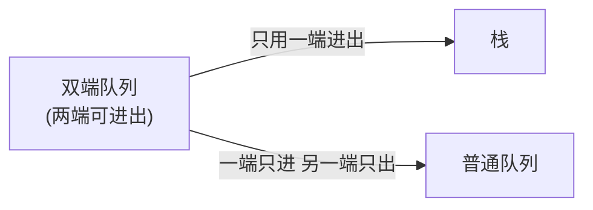

# 栈与队列

## 零、知识地图

```text
栈与队列
├── 1. 栈：从 CPU 到弹夹——顺序栈与链栈（一端进出 LIFO，top 口径与判满判空）
├── 2. 队列与循环队列：排队、假溢出与取模绕环（FIFO；取模绕环三公式）
├── 3. 双端队列：限制即退化（两端进出；栈与队列是它的限界投影）
├── 4. 验证出栈序列（洛谷 P4387）：栈模拟的贪心（栈顶相等必弹，while 连弹）
├── 5. 行星碰撞（LC 735）：栈模拟的分类讨论（向右入栈等待，向左挑战消化）
└── 6. STL 兵器库与工程视野：从 priority_queue 到 LRU（竞赛工具箱与下一步地图）

学习顺序：1 → 2 → 3 → 4 → 5 → 6。理由：1-3 打结构地基（循环队列取模绕环是 3 的直接前置），4-5 用两道真题练"栈模拟"手感（依赖 1 的 push/pop 纪律），6 收拢 STL 工具并登记后续衔接。
```

## 一、为什么需要它

先看三个再熟悉不过的动作：编辑器里按 Ctrl+Z，撤销的总是**最近一次**操作；浏览器点后退，回到的是**上一个**页面；食堂窗口前排队的同学，**先来的先打饭**。前两个是"最后发生的先处理"——**栈**；第三个是"先来的先走"——**队列**。这是计算机里最高频的两种数据访问纪律，从 CPU 的函数调用到图的搜索，底层都是它们在转。

A 源课件开场就把定位说透了："**队列多用于辅助，很少有单独的题目。例如图的 BFS，需要队列辅助实现。重点是栈的应用及题目。**"并且给了工程口径："做题时，多数使用数组直接模拟栈（队列），或者直接用 C++ STL 中的 stack（queue）。"所以本篇的安排是：先用 B 源的数据结构课把三种结构（栈、队列、双端队列）的物理实现讲透，再用 A 源的两道真题（P4387 验证出栈序列、LC735 行星碰撞）练"栈模拟"的核心手感，最后收拢 STL 兵器库。

带着一个悬念进场（本篇的回扣线）：给定入栈序列 `1 2 3 4 5`，有人声称出栈序列是 `4 3 5 1 2`——这可能吗？凭感觉说不清，学完知识点 4，你就能用一根指针和一个栈在 $O(n)$ 内给出铁证。

本篇讲 6 个知识点：栈（顺序栈与链栈）、队列与循环队列、双端队列、验证出栈序列、行星碰撞、STL 兵器库与工程视野。前三个是结构（B 源），后三个是应用与工具（A 源 + B 源工程视野）；顺序理由：不熟 push/pop 的物理含义（知识点 1）就看不懂模拟题为什么用栈（知识点 4）；循环队列的取模绕环（知识点 2）是双端队列环形数组的直接前置（知识点 3）；真题（知识点 4、5）放在结构之后才能"知其所以然"。

## 二、知识点逐讲（每个知识点一节，共 6 节）

### 1. 栈：从 CPU 到弹夹——顺序栈与链栈

前置依赖：数组与下标、结构体（纯基础概念，本库无对应笔记）；链栈复用 [[链表]] 的头插与删首元原语
后续衔接：[[#2. 队列与循环队列：排队、假溢出与取模绕环]]、[[#4. 验证出栈序列（洛谷 P4387）：栈模拟的贪心]]（push/pop 纪律是模拟题地基）

**① 它解决什么问题**

**栈**（stack）是"只允许在一端进出"的线性结构，这一端叫**栈顶**（另一端叫**栈底**）。它解决"临时数据的后进先出（LIFO）管理"问题：最后放进去的东西最先被取走。B 源 PDF 第 1 页从物理机讲起：CPU 的 ALU 做 `111 + 222 + 333` 这类多步运算时，中间结果先存寄存器（AX、BX、CX、DX），寄存器不够用也不值得多造——于是在内存里划一块专用区域存放临时数据，这块区域就是**堆栈**（B 源原话："栈其实只是一个乳名，实际上这个区域叫做堆栈"）。数据结构中的栈，就是模仿这种物理特性的抽象数据类型（B 源第 2 页）。

| 操作 | 含义 | 复杂度 |
|------|------|--------|
| push（入栈/压栈） | 栈顶放入元素 | $O(1)$ |
| pop（出栈/弹栈） | 取走栈顶元素 | $O(1)$ |
| peek / top（取栈顶） | 只看不取 | $O(1)$ |
| isEmpty（判空） | 栈里还有没有 | $O(1)$ |

性质一句话：**所有操作只在栈顶发生，全部 $O(1)$**——这正是"限界"换来的能力，后面每个结构都遵循同一逻辑。

**② 直觉理解**

模型级类比：**弹夹装子弹**（B 源第 1 页原话："就像弹夹装子弹，先入后出，后入先出"）。压进去的第 6 颗子弹，要等前面 5 颗都打出去才会轮到它；而最先压进去的第 1 颗，最后才出膛。

用具体数字跑一遍：依次 push 1、2、3，栈内从底到顶是 `1 2 3`；pop 取走 3，再 pop 取走 2——**进出顺序正好镜像**。再看函数调用（B 源第 2 页"程序的地盘"）：main 调 f，f 调 g，g 最后被调用却最先返回——调用链天然是一个栈，所以栈也叫"调用栈"。

**③ 原理与推导**

顺序栈的核心是 `top` 下标的语义。B 源内部同时存在两种口径（冲突已登记 A-3），**正文以源码口径为主线**：

- **源码口径（顺序栈代码.c）**：`top` 指向"下一个空位"。空栈 `top == 0`；真栈顶的数据在下标 `top - 1`；判满 `top == maxx`。push 是"先写入再 `top++`"，pop 是"先 `top--`"。
- **PDF 第 3 页图口径**：`top` 直接指向真栈顶。空栈 `top == -1`，push 是"先 `top++` 再写入"。

两种口径是同一逻辑平移一格：源码口径的"真栈顶下标"恰是图口径的 `top`。混用两种口径是经典事故——初始化 `top = 0`（源码口径）却按图口径"先加后写"，第一个数据会跳过下标 0，且最后一次写入落在 `data[maxx]` 越界。**记一条就够：以你初始化的方式反推读写顺序**。

两个常被忽略的物理事实（B 源第 2 页）：其一，栈顶移动、**栈底固定不动**；其二，"如果需要从栈中取出数据……栈顶往下挪，这个动作就叫弹栈。但是要注意，出栈了以后，数据还在堆栈中，只是这个数据就被当成了垃圾"——pop 是**逻辑删除**，所以"清空栈"不需要 memset，把 top 拨回去就行。

链栈的选型推导：栈顶在动 → 链表哪一端的插入删除是 $O(1)$？头部。所以链栈用**头插法入栈**（首元结点即栈顶、尾结点即栈底，源码注释原话），出栈即删除首元结点。为什么不用尾插？尾插要么每次遍历找尾 $O(n)$，要么额外维护尾指针——那是队列的做法（知识点 2 正是这么干的）。

**④ 代码演示**

取自源文件 顺序栈代码.c（相对源文件的改动：摘核心操作、InitStack 折行合并；`IsEmpety` 保留源码拼写）：

```cpp
#define maxx 10
typedef struct { int* data; int top; } Stack;   // top 本质是下标

Stack InitStack() {
    Stack s;
    s.data = (int*)malloc(sizeof(int) * maxx);
    s.top = 0;                                  // 口径: top 指向下一个空位
    return s;
}
void Push(Stack* s, int k) {
    if (s->top == maxx) { printf("栈满，无法入栈\n"); return; }
    s->data[s->top] = k;                        // 先写入
    s->top++;                                   // 再上移; O(1)
}
void Pop(Stack* s) {
    if (s->top == 0) { printf("栈空，无法出栈\n"); return; }
    s->top--;                                   // 逻辑删除: 数据还在内存
}
int Get(Stack s) {
    if (s.top == 0) { printf("栈空\n"); return -1; }  // 约定: 栈内为正整数
    return s.data[s.top - 1];                   // 真栈顶在 top-1
}
```

链栈核心，取自源文件 链栈代码.c（改动：摘 Push/Pop，判空即 `s->next == NULL`）：

```cpp
typedef struct Node { int data; struct Node* next; } SNode, *LinkStack;

LinkStack Push(LinkStack s, int k) {            // 头插 = 入栈
    SNode* p = (SNode*)malloc(sizeof(SNode));
    p->data = k;
    p->next = s->next;                          // 先接
    s->next = p;                                // 后断; 首元结点 = 栈顶
    return s;
}
LinkStack Pop(LinkStack s) {
    if (s->next == NULL) { printf("栈空，无法出栈\n"); return s; }
    SNode* p = s->next;                         // 删首元 = 出栈
    s->next = p->next;
    free(p); p = NULL;
    return s;
}
```

**执行追踪表**（数据取自②与⑤实测：依次 Push 1、2、3，再连 Pop 三次后 Get）

| 步骤 | 当前元素 | 结构状态 | 动作 | 结果 |
|------|---------|---------|------|------|
| 1 | 1 | 空栈 top=0 | 判满通过，data[0]=1，top++ | 栈内（底→顶）：1，top=1 |
| 2 | 2 | top=1 | data[1]=2，top++ | 栈：1 2，top=2 |
| 3 | 3 | top=2 | data[2]=3，top++ | 栈：1 2 3，top=3 |
| 4 | - | top=3 | Pop：判空通过，top-- | 逻辑删除 3，真栈顶变 2（内存仍在） |
| 5 | - | top=2 | Pop：top-- | 逻辑删除 2，栈：1 |
| 6 | - | top=1 | Pop：top-- | 栈空，top=0 |
| 7 | - | 栈空 top=0 | Get：top==0 → 打印"栈空" | 返回哨兵 -1（源码约定栈内为正整数） |

**错误写法对照**

```diff
- s.top = 0; ... s.top++; s->data[s->top] = k;  // 坑1：初始化 top=0（指下一空位）却按图口径"先加后写" → 首元素跳过 data[0]、末次写入落 data[maxx] 越界 → RE
+ s->data[s->top] = k; s->top++;  // 修复：以初始化方式反推读写顺序——top=0 口径"先写后加"
- s->data[s->top] = k; s->top++;  // 坑2：push 前不判满 → 满栈再写 data[maxx] 越界 → RE（pop 前不判空同理取到垃圾）
+ if (s->top == maxx) { printf("栈满，无法入栈\n"); return; } s->data[s->top] = k; s->top++;  // 修复：判定写成操作第一行（pop 同理先判 s->top == 0）
- if (s.data[s.top] > 0)  // 坑3：pop 后当内存已清，用 data[top] 残留值判断 → 读到垃圾 → 答案错
+ if (s.top == 0) { printf("栈空\n"); return -1; }  // 修复：pop 只动 top 不动内存，取顶前先判空
```

**⑤ 典型应用**

- 源码 main 演示（两版逻辑一致）：Push 1、2、3 → Pop 三次 → Get。实测输出 `栈空` 与 `-1`——连弹三颗后栈已空，Get 触发判空分支；`-1` 是源码约定的哨兵（注释原话"假设栈中均为正整数"），竞赛中更推荐用 isEmpty 先判再取。
- 函数调用与撤销操作（B 源第 2 页场景）：调用链的"最后调用最先返回"、编辑器撤销的"最后操作先撤销"，都是栈的天然形状。
- 自编迁移题（自编）：十进制转二进制。13 的余数序列是 `1, 0, 1, 1`，但正确答案是倒着读的 `1101`——"倒着读"就是后进先出。请用顺序栈实现"除 2 取余、依次入栈，最后整栈弹出"，并说明为什么余数天然要过一遍栈。建议先独立做，再对照题解。

  题解：`while (n) { Push(n % 2); n /= 2; }` 后从栈顶依次弹出。低位先算出却后打印，恰好是栈的镜像秩序；这题也说明"输出顺序与产生顺序相反"是选用栈的第一信号。

**⑥ 坑点与边界**

> [!caution]
> 栈的坑集中在 top 口径与边界判定，三条都是高频事故。

> **【易错】** 两种 top 口径混写 → 初始化 `top = 0` 却"先加后写" → 首元素跳过 `data[0]`、末次写入越界 → 初始化方式与读写顺序必须配套（源码口径：先写后加；图口径：先加后写）。

> **【易错】** push 前不判满、pop 前不判空 → 数组越界或取到垃圾数据 → 源码把判满/判空写成操作第一行，竞赛手写栈同样照做。

> **【易错】** 以为 pop 会清掉数据 → 用 `data[top]` 之前的残留值做判断 → pop 只动 top 不动内存（B 源"垃圾"原话），复用数组前必须显式覆盖。

> [!example]-
> **边界数据集（先自己跑一遍，再展开对照）**
> 1. 空输入：空栈（top=0）执行 Pop → 打印"栈空，无法出栈"，top 不动（判空兜底，不越界）
> 2. 单元素：push 5 后 pop → top 回 0；再 Get → 打印"栈空"，返回哨兵 -1（⑤实测路径）
> 3. 全相同：push 7, 7, 7 → 依次弹出 7, 7, 7（值不影响 LIFO 秩序）
> 4. 严格递增：push 1, 2, 3 → 依次弹出 3, 2, 1（递增入栈镜像为递减出栈）
> 5. 严格递减：push 3, 2, 1 → 依次弹出 1, 2, 3
> 6. 极值：maxx=10 连 push 10 个 INT_MAX → 第 10 次写 data[9] 成功，top=10；第 11 次 → 判满生效打印"栈满，无法入栈"（去掉判满即写 data[10] 越界——极值下标溢出点）

回到开场悬念的铺垫：栈只保证"后进先出"的**秩序**，但"给定一个出栈序列是否可能"还需要一个模拟器来裁决——这正是知识点 4 的工作。先把栈的兄弟结构（队列）补齐。

### 2. 队列与循环队列：排队、假溢出与取模绕环

前置依赖：[[#1. 栈：从 CPU 到弹夹——顺序栈与链栈]]（限界结构的同一逻辑）
后续衔接：[[#3. 双端队列：限制即退化]]（环形数组与 sum 计数的直接前置）、图的 BFS（图论篇展开，队列的 FIFO 纪律保层序性）

**① 它解决什么问题**

**队列**（queue）是"队尾进、队头出"的线性结构：B 源第 4 页定义——"队列也是一种操作受限制的线性表。进行插入操作的端称之为队尾，进行删除操作的端称之为队头……队列中插入一个队列元素称之为入队，在队列中删除一个队列元素，称之为出队"，且"只有最早进入的队列元素才可以从队列中删除"，故又称**先进先出（FIFO）**线性表。它解决两类资源协调问题（B 源第 4 页标题级原话）：**解决主机与外部设备速度不匹配**（打印任务缓冲）、**多用户引起的资源竞争**（CPU 排队调度）；竞赛里它是图 BFS 的标配（A 源开场原话）。

| 操作 | 含义 | 复杂度 |
|------|------|--------|
| enqueue（入队） | 队尾加入元素 | $O(1)$ |
| dequeue（出队） | 队头取走元素 | $O(1)$ |
| front / back | 看队头 / 队尾 | $O(1)$ |

**② 直觉理解**

模型级类比：**食堂排队**。先来的先打饭，新来的只能排到队尾，谁也不能插队——队列对"公平"的执念就是它区别于栈的全部。

用具体数字跑一遍**假溢出**（B 源第 4 页核心概念）：数组容量 6，front 追着 rear 走——入队 1、出队、入队 2、出队、入队 3、出队……几个回合后 `rear` 指向下标 5，明明前面下标 0-4 全空着，队列却宣布"队满"。B 源原话："当我们的队尾指针指向 size - 1 时，代表长度已满。但是根据队列的规则，就实际情况来说，他还有空闲的空间。那么这个时候，我们就将其称之为**假溢出**。"根因：数组是直的，而队列的用量是"流动"的。

**③ 原理与推导**

循环队列的解法一句话：**把数组掰弯成环**——首尾相接，指针越界就绕回开头。B 源第 4 页给出全部公式，逐条推导（不跳步）：

- 绕环：入队后 `rear = (rear + 1) % maxSize`，出队后 `front = (front + 1) % maxSize`。为什么取模？`rear + 1` 可能恰好等于 maxSize（直线视角越界），`% maxSize` 把它拉回 0——"队尾指示器+1 的操作就可以修改为"绕环（B 源原话）。
- 判空与判满的两难：绕环之后，`rear == front` 既可能是"全空"也可能是"追满"——两种状态长一个样。B 源第 5 页的裁决："队满和队空的时候，都有 rear = front。为了解决这个问题，一般的方法就是，**少使用一个空间**。"于是：**队空 `rear == front`；队满 `(rear + 1) % maxSize == front`**（牺牲一格，实测源码同此口径）。
- 元素个数公式：`(rear - front + maxSize) % maxSize`。为什么必须 `+ maxSize`？rear 可能已经绕到 front 的"后面"（数值上 `rear < front`），直接相减是负数；先加一个 maxSize 再取模，把负数拉回正区间。验证：容量 10，front = 8、rear = 2（已绕环，存着 8、9、0、1 四个）→ `(2 - 8 + 10) % 10 = 4`，与实际四个元素吻合。

另一条路线：不牺牲格子，**额外维护一个 sum 计数**——`sum == 0` 判空、`sum == maxSize` 判满，还能 $O(1)$ 报告长度。代价是多维护一个变量。本篇知识点 3 的数组双端队列正是选了这条路（源码互证：两种方案都对，选型看需求）。

链式队列则根本不怕假溢出（结点动态分配，没有"数组已满"），但要防另一种事故：**删除最后一个元素时，尾指针 r 悬空**。源码 DeQueue 里专门有一句（注释原话"防止 r 成为野指针"）：`if (q->r == p) q->r = q->f;`——p 是被删的尾结点，删掉它之后 r 若还指着它，下一次 `EnQueue` 执行 `r->next = s` 就是往已释放的内存里写。实测验证见⑤。

**④ 代码演示**

循环队列核心，取自源文件 循环队列代码.c（改动：摘 EnQueue/DeQueue/IsEmpty，InitStack 式初始化合并）：

```cpp
#define maxx 10
typedef struct { int* data; int f, r; } Queue;  // f 队头 / r 队尾(下一空位)

void EnQueue(Queue* q, int k) {
    if (q->f == (q->r + 1) % maxx) {            // 牺牲一格判满
        printf("队满,无法入队\n"); return;
    }
    q->data[q->r] = k;                          // 数据放在 r 位置
    q->r = (q->r + 1) % maxx;                   // 取模绕环
}
void DeQueue(Queue* q) {
    if (q->r == q->f) { printf("队空,无法出队\n"); return; }
    printf("%d\n", q->data[q->f]);
    q->f = (q->f + 1) % maxx;                   // 取模绕环
}
```

链式队列的 DeQueue（含关键的 r 拉回），取自源文件 链式队列代码.c（改动：仅摘 DeQueue；f 指头结点、r 指尾结点，入队为带尾指针的尾插）：

```cpp
void DeQueue(Queue* q) {
    if (q->f->next == NULL) { printf("队空,无法出队\n"); return; }
    QNode* p = q->f->next;                      // 首元结点 = 队头数据
    printf("%d\n", p->data);
    if (q->r == p) q->r = q->f;                 // 删最后一个: r 拉回头结点
    q->f->next = p->next;                       //   否则 r 成野指针,
    free(p); p = NULL;                          //   下次 EnQueue 写崩
}
```

**执行追踪表**（数据接②的假溢出推演：容量 6，入队出队交替后继续入队触发绕环）

| 步骤 | 当前元素 | 结构状态 | 动作 | 结果 |
|------|---------|---------|------|------|
| 1 | 1 | 空队 f=r=0 | 判满 (0+1)%6=1≠0 通过，data[0]=1，r=(0+1)%6 | r=1 |
| 2 | 2/3/4/5 | 交替入队出队 | 每回合入队 r+1、出队 f+1（均取模） | 5 回合后 r=5、f=5——直线视角"已满"，实际全空（假溢出） |
| 3 | 6 | r=5，f=5 | 判满 (5+1)%6=0≠5 通过，data[5]=6，r=(5+1)%6=0 | r 绕回 0，取模消除假溢出 |
| 4 | 7 | r=0，f=5 | 判满 (0+1)%6=1≠5 通过，data[0]=7，r=1 | 复用空出的下标 0 |
| 5 | - | 队内 6 7（f=5 绕环到 r=1） | 个数 (1-5+6)%6=2 | 循环队列满载运行 |

**错误写法对照**

```diff
- if (q->f == q->r + 1)  // 坑1：判满忘取模 → rear 在末格时 r+1 越界/误判 → 逻辑错
+ if (q->f == (q->r + 1) % maxx)  // 修复：一律 (r + 1) % maxx == f
- int cnt = q->r - q->f;  // 坑2：绕环后 rear < front，直接相减为负 → 个数错
+ int cnt = (q->r - q->f + maxx) % maxx;  // 修复：+ maxx 把负数拉回正区间，再取模
- q->f->next = p->next; free(p);  // 坑3：删最后一个元素不拉回 r → r 指向已 free 结点 → 下次 EnQueue 写崩
+ if (q->r == p) q->r = q->f;  // 修复：删尾前先判 r 是否指向被删结点，是则拉回头结点
```

**⑤ 典型应用**

- 循环队列 main 实测：EnQueue 1、2、3 → DeQueue 两次 → 实测输出 `1`、`2`——先入先出，1 先于 2 出来。
- 链式队列 main 实测：EnQueue 1、2、3 → DeQueue 三次 → EnQueue 7 → DeQueue → 实测输出 `1`、`2`、`3`、`7`。第三次 DeQueue 正是"删除最后一个元素"：r 拉回逻辑被真实触发，其后 EnQueue(7) 仍能正确入队出队——若注释掉拉回那一行，此处即为对已 free 内存的操作。这是"一行防御代码救一命"的现成教材。
- 图的 BFS（A 源开场预告，图论篇展开）：起点入队，每次取队头扩展邻居，"先发现的先扩展"——队列的 FIFO 纪律保证了 BFS 的层序性。
- 自编迁移题（自编）：击鼓传花——n 人围成一圈报数，数到 m 的人出局，求出局顺序。请用"一个队列轮转 m-1 次"实现，并分析复杂度。建议先独立做，再对照题解。

  题解：全员入队；每轮把队头连续出队 m-1 次并依次再入队（绕圈 = 出队即入队），第 m 次出队的人出局（不再入队）。复杂度 $O(nm)$。这题是"队列轮转模拟环形过程"的范式，循环队列取模思想在逻辑层的重现。

**⑥ 坑点与边界**

> [!caution]
> 队列的坑集中在"绕环公式"与"指针生命周期"，三条都来自源码与实测。

> **【易错】** 判满写成 `f == r + 1` 忘取模 → rear 在末格时误判/漏判 → 一律 `(r + 1) % maxx == f`。

> **【易错】** 元素个数直接 `rear - front` → 绕环后为负 → `(r - f + maxSize) % maxSize`，`+ maxSize` 不能省。

> **【易错】** 链式队列删最后一个元素不拉回 r → r 指向已 free 结点 → 下次 EnQueue 写崩（源码注释"防止 r 成为野指针"，实测验证：拉回后 EnQueue(7) 正常输出）。

> [!example]-
> **边界数据集（先自己跑一遍，再展开对照）**
> 1. 空输入：f=r=0 空队 DeQueue → 打印"队空,无法出队"（判空兜底）
> 2. 单元素：入队 5 后出队 → 输出 5，f 追平 r（f==r）回到空队状态
> 3. 全相同：值全 7 的队列绕环出入队 → 输出均为 7，指针行为与值无关
> 4. 严格递增：容量 6 依次入队 1 2 3 4 5（最多 5 个，牺牲一格）→ 再入队 6 时 (5+1)%6=0==f，打印"队满,无法入队"
> 5. 严格递减：容量 6 依次入队 5 4 3 2 1 → 依次出队输出 5 4 3 2 1（FIFO 与入序一致，保序）
> 6. 极值：元素取 INT_MAX/INT_MIN → 打印正确（无算术）；溢出点在指针：取模保证 r 恒在 0 至 maxx-1，判满忘取模（坑 1）才会在 r=maxx-1 时误判

栈（一端进出）、队列（两端各司一职）都讲完了，把限制再放宽一档——两端都自由，就是双端队列；而它最迷人的性质是：**限制即退化**。

### 3. 双端队列：限制即退化

前置依赖：[[#2. 队列与循环队列：排队、假溢出与取模绕环]]（取模绕环与判满空两路线）
后续衔接：[[#6. STL 兵器库与工程视野：从 priority_queue 到 LRU]]（STL deque 与滑窗容器）、后续单调队列专题

**① 它解决什么问题**

**双端队列**（deque，double-ended queue）是两端都可以插入和删除的线性结构。B 源第 5 页："双端队列就是两端都是结尾的队列。队列的每一端都可以插入数据项和移除数据项。相对于普通队列，双端队列的入队和出队操作在两端都可以进行。"它解决"数据需要从两侧动态进出"的问题——滑动窗口、撤销重做对（undo/redo 两端各管一头）都是它的形状。

它最漂亮的知识点是**退化关系**（B 源第 5 页原话："当你只允许使用一端出队、入队操作的时候，他等价于一个栈。当限制一端只能出队，另一端只能入队，你就等价于一个普通队列"）——栈和队列原来是双端队列在"限界"下的两个投影。



文字版兜底：双端队列去掉"一端的自由"就得到另外两个结构——只允许同一端进出，退化为栈；一端只进、另一端只出，退化为普通队列。三者是"限界程度"不同的同一族结构。

**② 直觉理解**

模型级类比：**地铁闸机**。早高峰把双向闸机全开（两端进出），平峰只留一进一出（普通队列），深夜只留一台双向机自助（栈）——同一排闸机，限制不同，形态不同。

用具体数字跑一遍（源码 main 的序列）：容量 5 的环形数组，依次左插 1、2、3，右插 6、7。左插从下标 0 **倒着**绕环走：`l = (l - 1 + maxx) % maxx`，1 落在下标 4、2 在 3、3 在 2；右插顺着走，6 在 0、7 在 1。逻辑上从左到右读出：`3 2 1 6 7`。随后连删三个右端（7、6、1）、再删两个左端（3、2）——数组版与链式版实测输出**逐字一致**（见⑤）。

**③ 原理与推导**

数组版（顺序双端队列代码.c）用三个变量：`l` 指向**真正的左端数据**、`r` 指向**右端数据的后一个位置**、`sum` 记元素个数。源码注释原话："认为 l 指向真正的左端数据，如果认为 r 指向真正的右端数据后一个位置。"判满判空全靠 sum（`sum == maxx` 满、`sum == 0` 空）——不牺牲格子、还白得一个 $O(1)$ 的 size 查询（呼应知识点 2 的两条路线）。

链式版（链式双端队列代码.c）的设计**非常规**，值得专门推导：它让 `r` 指向一个**空占位结点**，用实体结点表达"右端数据的后一位置"。于是 RInsert 的动作是"把数据写进当前占位结点（占位转正为数据结点），再新建一个占位接在后面"；RDelete 的动作是"打印 `r->pre`（真右端数据），r 前移，free 掉旧占位"。妙处在于 `l == r` 恒等价于"队列空"：删除到空后 l、r 重合；再次 RInsert 时数据写进重合结点、r 立即前移——l 留在数据结点上，两指针重新分开，不变量自我修复。

**这个实现经过了实证而非只过了一眼**：我先按直觉手推了两个"疑似丢数据"的场景（空队列直接 RInsert 后 LDelete；LInsert、RDelete、RInsert、LDelete 序列），预言其出错——**实测全部正常**，手推两连错；随后写了随机对照程序（复刻两版源码，300 组 × 400 步共 12 万次随机操作），链式版与数组版输出**0 分歧**。结论：功能自洽，但"占位结点会被逐步消耗、初始头结点可能在连续 RDelete 中被 free（main 实测如此）"的设计依赖"覆盖后前进"这条细节存活，**可读性与维护性差，竞赛不推荐此写法**（登记 A-3，实证记录见附录 B）。

**④ 代码演示**

数组双端队列核心，取自源文件 顺序双端队列代码.c（改动：摘 LInsert/RInsert/RDelete，初始化合并；LDelete 与 RDelete 对称，正文留 RDelete）：

```cpp
#define maxx 5
typedef struct { int* data; int l, r, sum; } Deque;
// 约定: l 指真数据左端, r 指右端数据后一位置, sum 计数

void LInsert(Deque* q, int k) {                 // 左端入队
    if (q->sum == maxx) { printf("队满,无法入队"); return; }
    q->l = (q->l - 1 + maxx) % maxx;            // 先 + maxx 防负, 再绕环
    q->data[q->l] = k; q->sum++;
}
void RInsert(Deque* q, int k) {                 // 右端入队
    if (q->sum == maxx) { printf("队满,无法入队"); return; }
    q->data[q->r] = k;                          // r 位置可直写
    q->r = (q->r + 1) % maxx; q->sum++;
}
void RDelete(Deque* q) {                        // 右端出队
    if (q->sum == 0) { printf("队空,无法出队"); return; }
    q->r = (q->r - 1 + maxx) % maxx;            // 先退一格(同样 + maxx 防负)
    printf("%d右端出队\n", q->data[q->r]); q->sum--;
}
```

**错误写法对照**

```diff
- q->l = (q->l - 1) % maxx;  // 坑1：l=0 时 (-1)%5 得 -1 → data[-1] 越界 → RE
+ q->l = (q->l - 1 + maxx) % maxx;  // 修复：先 + maxx 防负再取模（源码两处减法都带）
- printf("%d", q->r->data);  // 坑2：链式版 r 是空占位结点 → 读到占位垃圾 → 答案错
+ printf("%d", q->r->pre->data);  // 修复：真右端数据在 r->pre（源码 RDelete 打印的正是它）
- // 不理解约定直接照搬"占位结点"链式写法  // 坑3：占位结点会被消耗、初始头结点可能被 free → 难维护易错
+ // 修复：竞赛用数组版（sum 计数）或 STL deque，绕开非常规设计
```

**⑤ 典型应用**

- 源码 main 实测（两版输出逐字一致）：左插 1、2、3，右插 6、7，右删三次、左删三次 → `7右端出队`、`6右端出队`、`1右端出队`、`3左端出队`、`2左端出队`、`队空,无法出队`。逻辑序列 `3 2 1 6 7` 从两端对称收缩，删除顺序 7、6、1（右）与 3、2（左）印证②的推演。
- C++ STL 的 `deque`（知识点 6 展开）与"滑窗类"问题的底层容器；B 源第 5 页还点名了 LRU 缓存（见知识点 6 的工程视野）。
- 自编迁移题（自编）：用"两个栈"模拟一个队列（一个只管进、一个只管倒腾出），说明最坏单次出队为何是均摊 $O(1)$。建议先独立做，再对照题解。

  题解：入栈 A 只 push；出栈时若栈 B 空则把 A 全量倒入 B（顺序恰好翻正）再 pop。每个元素一生最多进 A 一次、倒 B 一次、出 B 一次，总代价 $O(n)$ 摊到 n 次操作即均摊 $O(1)$。这题是"限界结构互相模拟"的经典，也是栈与队列知识的交汇点。

**⑥ 坑点与边界**

> [!caution]
> 双端队列的坑一半在取模符号，一半在链式版的设计理解。

> **【易错】** 左插/右删写成 `(l - 1) % maxx` → l = 0 时得 -1 → 数组越界 → 必须 `(l - 1 + maxx) % maxx`（源码两处减法都带 `+ maxx`）。

> **【易错】** 以为链式双端队列的 r 结点存着右端数据 → 直接读 `r->data` → 读到占位垃圾 → 真右端数据在 `r->pre`（源码 RDelete 打印的正是 `p->pre->data`）。

> **【易错】** 照搬链式双端队列的"占位结点"写法而不理解约定 → 占位结点会被消耗、初始头结点可能被 free → 实现自洽但难维护，竞赛用数组版或 STL deque。

> [!example]-
> **边界数据集（先自己跑一遍，再展开对照）**
> 1. 空输入：空队（sum=0）RDelete → 打印"队空,无法出队"（判空兜底）
> 2. 单元素：容量 5，LInsert 5 → l=(0-1+5)%5=4，data[4]=5，sum=1；RDelete → r 退到 4，输出 5，sum=0
> 3. 全相同：左插 3, 3, 3 右插 3, 3 → 逻辑序列 3 3 3 3 3，两端删除输出全为 3（结构与值无关）
> 4. 严格递增：容量 5，左插 1, 2, 3 右插 6, 7 → 逻辑序列 3 2 1 6 7（②推演同参数）
> 5. 严格递减：容量 5，左插 3, 2, 1 → 1 落在下标 4、2 在 3、3 在 2，从左读出 1 2 3（递减输入经左插反转为递增）
> 6. 极值：存满 5 个 INT_MAX → sum==maxx 判满，第 6 次插入打印"队满,无法入队"；溢出点在指针减法：l=0 时左插漏 + maxx 得 data[-1] 越界（坑 1），正确公式下指针恒在 0 至 maxx-1

结构部分收工。回到开场悬念：现在手里有秩序（栈）、公平（队列）与自由（双端），但"给定出栈序列是否合法"仍需要一个**裁决程序**——进入 A 源真题。

### 4. 验证出栈序列（洛谷 P4387）：栈模拟的贪心

前置依赖：[[#1. 栈：从 CPU 到弹夹——顺序栈与链栈]]（push/pop 与判空纪律）、[[链表]]（多组数据与输入输出习惯）
后续衔接：[[#5. 行星碰撞（LC 735）：栈模拟的分类讨论]]（同款"新元素只与栈顶对话"骨架）

**① 它解决什么问题**

**P4387【深基16.例1】验证栈**：q 组询问，每组给定长度 n 的入栈序列与出栈序列，判断后者是否可能是"前者依次入栈、任意时刻可出栈"得到的结果——即**栈混洗判定**。n 个元素的可能出栈序列共 Catalan 数 $\frac{1}{n+1}\binom{2n}{n}$ 种（如 n = 3 时 5 种），`3 1 2` 合法而 `3 1 2` 型之外像 `3 2 1` 也合法、`3 1 2` 换成 `3 2 1`……判定靠枚举不现实（$O(n!)$），必须模拟。

**② 直觉理解**

模型级类比：**传送带上的弹夹**。传送带按入栈顺序把元素送来，你手里拿着出栈序列当" shopping list"（购物清单）：每送来一个就压进弹夹；每压完一下就低头看一眼——弹夹口（栈顶）正好是清单上下一个要的，就立刻取走，然后**继续看**（新栈顶可能也匹配）。送完所有元素后，清单全部划掉（栈空）则序列合法。

用②的推演跑官样例第一组：入 `1 2 3 4 5`、出 `4 5 3 2 1`。push 1（栈顶 1 ≠ 4）、push 2（≠ 4）、push 3（≠ 4）、push 4（== 4，弹出，清单走到 5）→ 新栈顶 3 ≠ 5 → push 5（== 5，弹出，走到 3）→ 3 出、2 出、1 出 → 栈空 → **Yes**。反例第二组：出 `4 3 5 1 2`——push 1..4 弹 4、3，push 5 弹 5，此刻栈内剩 `1 2`（2 压着 1），清单却要 1：1 上面压着 2，**1 出不来** → 栈非空 → **No**。看穿本质：元素 1 想先于 2 出栈，但入栈时 1 又在 2 前面——矛盾被栈实体化。

**③ 原理与推导**

模拟的正确性系于一条**贪心**：任何时刻"栈顶 == 清单当前项"时**必须弹**。证明（不跳步）：出栈序列固定，若此刻不弹而继续 push，新元素会压在它上面，它只能等上面的全部出栈——而清单当前项就是它自己，上面的元素都得排在它之后出，永远轮不到它先出，矛盾。所以"相等必弹"是唯一正确动作，不存在"忍住不弹更优"的分支。

**为什么要用 while 而不是 if**（A 源第 3 页原话："判断（注意用 while 判断，因为可能连续弹出）"）：弹出一个后，新栈顶可能恰好匹配清单下一项——比如上面推演中弹 4 之后接弹 5、3、2、1 的一连串。if 只弹一次就继续 push，会漏掉整段可弹序列，把合法判成非法。

复杂度：每个元素至多入栈一次、出栈一次，$O(n)$；清单指针 j 只进不退，同样 $O(n)$。空间 $O(n)$。

**④ 代码演示**

完整取自源文件 P4387.cpp（改动：无，逻辑原样；源码注释保留——清栈那一行的五个感叹号是原作者的血泪）：

```cpp
#include <iostream>
#include <algorithm>
#include <stack>
#include <cstring>
using namespace std;
int q, n;
int a[100005], b[100005];
stack<int> s;
int main() {
    cin >> q;
    for (int k = 1; k <= q; k++) {
        memset(a, 0, sizeof(a));
        memset(b, 0, sizeof(b));
        while (!s.empty()) { s.pop(); }  // 清空上组数据，避免影响下组数据！！！

        cin >> n;
        for (int i = 1; i <= n; i++) cin >> a[i];
        for (int i = 1; i <= n; i++) cin >> b[i];
        int i, j = 1;
        for (i = 1; i <= n; i++) {
            s.push(a[i]);                // 第 i 个数入栈
            while (!s.empty() && s.top() == b[j]) {
                s.pop();                 // 栈顶是预期出栈的数据 → 出栈
                j++;                     // while: 可能连续弹出
            }
        }
        if (s.empty()) cout << "Yes" << endl;
        else cout << "No" << endl;
    }
    return 0;
}
```

**执行追踪表**（数据取自②官样例两组：入 `1 2 3 4 5`，出 `4 5 3 2 1` 与 `4 3 5 1 2`）

| 步骤 | 当前元素 | 结构状态 | 动作 | 结果 |
|------|---------|---------|------|------|
| 1 | 1 | 栈空，j=1（要 4） | push(1)；栈顶 1≠4 | 栈：1 |
| 2 | 2 | | push(2)；2≠4 | 栈：1 2 |
| 3 | 3 | | push(3)；3≠4 | 栈：1 2 3 |
| 4 | 4 | | push(4)；4==4 弹出，j=2；新栈顶 3≠5 | 栈：1 2 3 |
| 5 | 5 | | push(5)；5==5 弹出 j=3 → 3==3 弹出 j=4 → 2==2 弹出 j=5 → 1==1 弹出 j=6 | while 连弹四次，栈空 |
| 6 | - | 栈空 | i 走完，判 s.empty() | 输出 Yes |
| 7 | 4 | 第二组：push 1..4 | 4==4 弹出 j=2，3==3 弹出 j=3 | 栈：1 2 |
| 8 | 5 | 栈：1 2 | push(5)；5==5 弹出，j=4（要 1） | 栈：1 2，2 压着 1 |
| 9 | - | 栈：1 2 | i 走完，s 非空 | 输出 No（1 想先于 2 出栈，但 1 在 2 前入栈，矛盾被栈实体化） |

**错误写法对照**

```diff
- // 每组开头直接读入新数据  // 坑1：多组数据不清栈 → 上组残留元素混入下组判断 → WA
+ while (!s.empty()) { s.pop(); }  // 修复：每组开头清栈（STL stack 没有 clear）
- if (!s.empty() && s.top() == b[j]) { s.pop(); j++; }  // 坑2：if 只弹一次 → 漏掉连锁匹配 → 合法判成非法 → WA
+ while (!s.empty() && s.top() == b[j]) { s.pop(); j++; }  // 修复：while 可能连续弹出（A 源课件原话）
- if (s.empty() || j > n)  // 坑3：双判据冗余且易错 → 与单判据等价但维护混乱
+ if (s.empty())  // 修复：单判据——j 走完时可弹的必已弹尽，两条件数学等价
```

**⑤ 典型应用**

- 洛谷 P4387 官方样例实测（输入 `2` 组：`5 / 1 2 3 4 5 / 4 5 3 2 1` 与 `5 / 1 2 3 4 5 / 4 3 5 1 2`）→ 实测输出 `Yes`、`No`，与期望一致。补一个验证时刻：首测时我构造的输入文件**漏写了第一行的组数 2**，程序把 `1` 当组数、`2` 当 n，输出错乱的 `No`——修正输入后重测吻合。**教训：验证环节的测试输入本身也要核对，"程序错"与"测试错"要先分清**（记录见附录 B）。
- 力扣 LC946 验证栈序列：同款判定，把"多组询问"换成"单次返回 bool"，解法逐字平移。
- 自编迁移题（自编）：给定入栈序列 `1..n`，求合法出栈序列中字典序第 k 小的那个（n ≤ 8）。建议先独立做，再对照题解。

  题解：按 Catalan 序 DFS——每层两个分支（下一个入栈 / 当前栈顶出栈），按"先出栈后入栈"的分支顺序枚举即得字典序递增，数到第 k 个输出。n ≤ 8 时 Catalan(8) = 1430，暴力可过。这道题把"模拟判定"升级为"枚举生成"，对栈混洗的结构理解更深一层。

**⑥ 坑点与边界**

> [!caution]
> 本题代码量小、坑全在边界与多组数据的工程细节上。

> **【易错】** 多组数据不清栈 → 上组残留元素混入下组判断 → 源码注释连打五个感叹号的坑：每组开头 `while (!s.empty()) s.pop()`（STL stack 没有 clear）。

> **【易错】** 连续弹出用 if → 只弹一次，漏掉连锁匹配 → while 且条件带 `!s.empty()`（弹空后 `s.top()` 是未定义行为）。

> **【易错】** 只在循环结束后判 `j > n` → 与判 `s.empty()` 逻辑重复且易错 → 统一按源码单判据 `s.empty()`（A 源课件"栈为空**或** j 到达末尾"的"或"是冗余表述，j 走完时可弹的必已弹尽，两条件等价，登记 A-3）。

> [!example]-
> **边界数据集（先自己跑一遍，再展开对照）**
> 1. 空输入：n=0（空入栈序列对空出栈序列）→ 循环不进，栈空 → 输出 Yes（空对空恒合法）
> 2. 单元素：入 [2] 出 [2] → push 2 即弹，栈空 → Yes；入 [2] 出 [3] → 栈剩 2 → No
> 3. 全相同：入 [5, 5, 5] 出 [5, 5, 5] → push 即弹 ×3 → Yes（值相同不影响判定）
> 4. 严格递增：入 1 2 3 4 5 出 4 5 3 2 1 → Yes（官样例第一组，⑤实测）
> 5. 严格递减：入 1 2 3 4 5 出 5 4 3 2 1 → push 1..5 后连弹 5 4 3 2 1 → Yes（全弹出型合法）
> 6. 极值：n=10^5、元素取 INT_MAX → a[100005] 按 n ≤ 10^5 反推开够（附录 B-4 口径），下标最大 100000 < 100005 安全；数值本身 int 可存，无算术溢出点

一维的"进出序"裁决完毕。把战场搬到二维——行星相向而行，判定的对象从"序"变成"存亡"，模拟的骨架不变，分类讨论的深度加一档。

### 5. 行星碰撞（LC 735）：栈模拟的分类讨论

前置依赖：[[#4. 验证出栈序列（洛谷 P4387）：栈模拟的贪心]]（栈模拟骨架与 while 连续处理）
后续衔接：[[单调栈]]（主题链中已完成的前篇，"下一个更大元素"同骨架）、消消乐类字符串题（LC1047 等）

**① 它解决什么问题**

**LC 735. Asteroid Collision**：一行行星，`asteroids[i]` 的**绝对值**是大小、**符号**是方向——正数向右飞、负数向左飞。两颗行星相向而行（右行的在左、左行的在右）则相撞：**大的吃掉小的**、**相等则同归于尽**、**同向或背向永不撞**。求最终幸存序列（保持原相对顺序）。

它解决"逐个到来、即时碰撞裁决"的模拟问题：每个新行星只可能与其**左侧已站稳的向右行星**相撞，"已站稳的集合"天然是一个栈——新行星只跟栈顶对话。

**② 直觉理解**

模型级类比：**闯关打擂**。向右的行星依次上台站好（入栈）；一个向左的行星是"挑战者"，从右往左一路挑战台上的人：打赢（自己绝对值大）就继续挑战下一个；打输（对方大）自己出局；打平（相等）同归于尽。台上的顺序永不乱，因为挑战永远只发生在台口。

用具体数字跑三组官样例：`[5, 10, -5]`——5、10 向右上台；-5 向左来，撞 10：10 > 5，-5 粉碎 → 幸存 `[5, 10]`。`[8, -8]`——8 上台，-8 来：8 == 8，双亡 → `[]`。`[10, 2, -5]`——10、2 上台，-5 先撞死 2，再撞 10：10 > 5，-5 粉碎 → `[10]`。

**③ 原理与推导**

先把"何时入栈、何时开打"分干净（A 源第 5 页原话三条）：**不碰撞可入栈**当且仅当——栈空（谁来都没对手）；当前行星向右（它与任何已站稳的向右同向，与向左的背向）；栈顶向左（它与当前行星背向或同向）。**唯一会碰撞的局面**：当前行星向左（`x < 0`）且栈顶向右（`top > 0`）。碰撞三分支（A 源原话）：栈顶大于 |x| → 当前粉碎，结束；相等 → 双亡，结束；栈顶小于 |x| → 栈顶粉碎，**继续与下一层栈顶对决**（while 链式消化）。

为什么"栈顶粉碎后要继续 while"？挑战者的战力没有损耗（大吃小是完整吞噬），下一个栈顶面对的是同一个完整的挑战者——直到挑战者出局或台上再无向右者（此时挑战者入栈站稳）。

复杂度：每颗行星至多入栈一次、被弹出一次，均摊 $O(n)$；空间 $O(n)$。A 源用 `vector` 的 `push_back/pop_back/back` 模拟栈（源码注释"数组模拟栈"）——数组模拟与 `stack` 容器在本题完全等价，还省一次封装。

**④ 代码演示**

完整取自源文件 LC 735.cpp（改动：无，逻辑原样；main 为喂入版）：

```cpp
#include <iostream>
#include <vector>
using namespace std;

vector<int> asteroidCollision(vector<int>& asteroids) {
    int n = asteroids.size();
    vector<int> s;                              // 数组模拟栈
    for (int i = 0; i < n; i++) {
        if (s.empty() || asteroids[i] > 0) {    // 栈空 或 当前行星向右: 直接入栈
            s.push_back(asteroids[i]);
        } else {
            // 到这里: 当前行星向左。撞光所有比它小的向右栈顶
            while (s.size() && s.back() > 0 && s.back() < -asteroids[i]) {
                s.pop_back();                   // 栈顶被撞没, 继续对决
            }
            if (s.empty() || s.back() < 0) {    // 没对手了(空)或背向(左): 入栈
                s.push_back(asteroids[i]);
            } else if (s.back() == -asteroids[i]) {
                s.pop_back();                   // 等大: 双亡
            }
            // 否则: 栈顶更大, 当前行星粉碎, 什么都不做
        }
    }
    return s;
}

int main() {
    int n, x;
    vector<int> a, ans;
    cin >> n;
    for (int i = 1; i <= n; i++) { cin >> x; a.push_back(x); }
    ans = asteroidCollision(a);
    for (int i = 0; i < (int)ans.size(); i++) cout << ans[i] << " ";
    return 0;
}
```

**执行追踪表**（数据取自②官样例：[10, 2, -5] 与 [8, -8]）

| 步骤 | 当前元素 | 结构状态 | 动作 | 结果 |
|------|---------|---------|------|------|
| 1 | 10 | 栈空 | s.empty() 成立 → push_back | 栈（底→顶）：10 |
| 2 | 2 | 顶 10 | 当前行星 2 > 0 → 直接入栈 | 栈：10 2 |
| 3 | -5 | 顶 2 | -5 向左：s.back()=2>0 且 2<5 → pop_back | 2 被撞没，挑战者继续对决，栈：10 |
| 4 | -5 | 顶 10 | 10>0 但 10<5 不成立 → while 停；10 ≠ 5 且栈顶更大 | -5 粉碎，什么都不做 |
| 5 | - | 栈：10 | i 走完 | 返回 [10] |
| 6 | 8 | 栈空（换例 [8, -8]） | push_back | 栈：8 |
| 7 | -8 | 顶 8 | 8>0 但 8<8 不成立 → while 停；8 == 8 → pop_back | 等大同归于尽，栈空 |
| 8 | - | 栈空 | 返回 s | 输出空序列 |

**错误写法对照**

```diff
- while (s.size() && s.back() < -asteroids[i]) s.pop_back();  // 坑1：漏 s.back() > 0 → 把向左的栈顶也拿来碰撞 → 同向被误删 → WA
+ while (s.size() && s.back() > 0 && s.back() < -asteroids[i]) s.pop_back();  // 修复：三条件缺一不可
- while (s.back() > 0 && s.back() < -asteroids[i]) s.pop_back();  // 坑2：漏 s.size() → 栈空时 back() 未定义行为 → RE
+ while (s.size() && s.back() > 0 && s.back() < -asteroids[i]) s.pop_back();  // 修复：判空永远放第一
- } else if (s.back() == -asteroids[i]) {  // 坑3：等大分支漏 pop_back 或提前 break → 双亡变挑战者存活 → WA
+ } else if (s.back() == -asteroids[i]) { s.pop_back();  // 修复：三分支"大于/等于/小于"用 else if 链显式穷尽
```

**⑤ 典型应用**

- 三组官样例实测：`[5,10,-5]` → 实测输出 `5 10`；`[8,-8]` → 实测输出空；`[10,2,-5]` → 实测输出 `10`——与②手推逐一吻合。
- 同构题：LC946（知识点 4 的同款）、字符串"相邻消消乐"（如 LC1047 删除字符串中的所有相邻重复项）——都是"新元素只与栈顶对话"的消消乐骨架。
- 自编迁移题（自编）：把规则改为"相向即同归于尽（不分大小）"，判断 `[-2, 1, -1, 2]` 的幸存序列，并说明原 while 需要如何退化。建议先独立做，再对照题解。

  题解：-2 左行不撞 1（背向）…逐步推得 `-2`（右端 1 与 -1 同尽、2 与谁都不撞——等等，1 与 -1 相撞双亡后 2 向右站稳，幸存 `[-2, 2]`）。while 退化：碰撞条件只剩"栈顶向右且当前向左"，弹栈条件从三分支并为"栈顶向右即双亡弹出"，无需比较绝对值。这题检验的是"规则变了，骨架不变"的迁移能力。

**⑥ 坑点与边界**

> [!caution]
> 本题的坑全部集中在 while 三个条件的完整性上。

> **【易错】** while 漏掉 `s.back() > 0` → 会把**向左**的栈顶也拿来碰撞 → 向左与向左同向根本不撞（源码三条件缺一不可）。

> **【易错】** while 漏掉 `s.size()` → 栈空时 `back()` 未定义行为 RE → 判空永远放第一。

> **【易错】** 等大分支漏写 `s.pop_back()` 或提前 break → 双亡变成挑战者存活 → 三分支"大于/等于/小于"必须闭环，源码用 `else if` 链显式穷尽。

> [!example]-
> **边界数据集（先自己跑一遍，再展开对照）**
> 1. 空输入：[] → 循环不进，返回 []
> 2. 单元素：[5] → 栈空直接入栈 → [5]；[-5] → 栈空无对手 → push_back → [-5]（向左也安全存活）
> 3. 全相同：[3, 3, 3] 全向右 → 依次入栈 → [3, 3, 3]；[-3, -3, -3] 全向左 → 同向不撞 → [-3, -3, -3]
> 4. 严格递增：[5, 10, -5] → 5、10 上台，-5 撞死在 10 上 → [5, 10]（官样例）
> 5. 严格递减：[10, 2, -5] → -5 先撞死 2 再败给 10 → [10]（官样例）
> 6. 极值：[-2147483648, 2147483647] → 代码中 -(-2147483648) 超出 int 上界，符号翻转是未定义行为 → 本题数据范围需避开 INT_MIN（|x| 在 10^9 量级时安全）

两道真题打完，"栈模拟"的手感已经建立。最后把竞赛与工程两边的"现成兵器"清点入库——比赛拼的不只是理解，还有**两分钟内造出正确结构**的速度。

### 6. STL 兵器库与工程视野：从 priority_queue 到 LRU

前置依赖：[[#1. 栈：从 CPU 到弹夹——顺序栈与链栈]]、[[#2. 队列与循环队列：排队、假溢出与取模绕环]]（手写版先懂，STL 才知替代了什么）
后续衔接：[[二叉树结构篇]]（主题链下一站）、力扣 42 接雨水与洛谷 P5788（单调栈篇复习入口）

**① 它解决什么问题**

手写结构慢且易错，竞赛的性价比原则是：**能 STL 不手写，数组能模拟就数组模拟**（A 源第 1 页原话："做题时，多数使用数组直接模拟栈（列）或者直接用 C++ STL 中的 stack（queue）"）。本节解决两个问题：把栈/队列/优先队列的 STL 用法收进肌肉记忆；把 B 源的工程视野（LRU/LFU/延迟队列/阻塞队列）与 A 源的进阶预告（单调栈/单调队列）登记成"下一步地图"。

**② 直觉理解**

模型级类比：**三种停车位**。`stack` 是死胡同车位（最后进的先出）；`queue` 是穿场车道（一头进一头出）；`priority_queue` 是**自动排序的 VIP 车场**——不管车按什么顺序来，出场永远是最"贵"的那辆（优先级最高）。

A 源第 6 页给 priority_queue 的定性（原话）："在优先队列中，元素被赋予优先级。当访问元素时，具有最高优先级的元素最先删除……基于堆（大顶堆/小顶堆）实现。"——堆是它的发动机，堆的专题（建堆、堆排）在后续主题展开，本节只收用法。

**③ 原理与推导**

priority_queue 的两种写法及其含义（A 源第 6 页原码）：`priority_queue<int> pq;` 默认**大顶堆**——top 恒为最大值；`priority_queue<int, vector<int>, greater<int>> p;` **小顶堆**——top 恒为最小值。记忆抓手：`greater`（越小越优先）就是小顶。

单调栈与单调队列（A 源第 6 页定义，下节课主题）："单调栈：栈中的元素是严格单调递增或者递减的……应用：括号匹配类"之外，主要用于"下一个更大元素""接雨水"一类问题；"单调队列：概念和单调栈类似。应用很少，多用于对一些算法的优化（动态规划等）"。A 源预告的两道课上例题：**力扣 42 接雨水、洛谷 P5788**——它们是单调栈篇（批 1 已完成）的源头，此处登记衔接。

B 源工程视野四件套（第 5-7 页，竞赛边缘但工程高频，了解即可）：

| 结构 | 核心规则 | 典型场景（B 源原话级） |
|------|----------|----------------------|
| LRU 缓存 | 1 新数据插链表头部 2 命中即移到头部 3 满时丢弃尾部 | 按"最近使用"淘汰；按次数淘汰的叫 LFU（Redis 用） |
| 延迟队列 | 入队时制定延迟时间，"以时间为权重的堆" | 订单 15 分钟未支付自动取消；会议/工单定时提醒 |
| 阻塞队列 | 空时弹出被阻塞、满时插入被阻塞 | 线程池保存暂时无空闲线程执行的任务 |
| 消息队列 | 生产者-消费者解耦 | 削峰填谷、异步解耦（B 源第 6 页 QQ 消息案例） |

LRU 为什么恰好是"双向链表 + 哈希"？插头、摘尾、任意点摘除都要 $O(1)$——双向链表全包；而"命中即移头"需要 $O(1)$ 定位结点——哈希表补上。这个组合正是知识点 3 双向能力（链表篇双链表）的应用闭环。

**④ 代码演示**

STL 用法片段（自编整理，覆盖本篇两道真题所需的全部接口）：

```cpp
#include <stack>
#include <queue>
#include <vector>
stack<int> st;                 // push / pop / top / empty / size
queue<int> qu;                 // push / pop / front / back / empty / size
priority_queue<int> pq;        // 大顶堆(默认): top 是最大值
priority_queue<int, vector<int>, greater<int>> pqmin;  // 小顶堆: top 最小

// 注意: stack 与 queue 都没有 clear() —— 多组数据必须手动清空
while (!st.empty()) st.pop();  // 清栈惯用写法(P4387 的坑)
while (!qu.empty()) qu.pop();  // 清队同理

// 数组模拟栈(竞赛常用, A 源 LC735 同款)
vector<int> s;
s.push_back(x);                // 入栈
int top = s.back();            // 取栈顶
s.pop_back();                  // 出栈
```

**错误写法对照**

```diff
- priority_queue<int> pqmin;  // 坑1：想要小顶却写默认模板 → top 恒为最大值 → 逻辑反
+ priority_queue<int, vector<int>, greater<int>> pqmin;  // 修复：三参数写法，greater 即小顶
- s.clear();  // 坑2：STL stack/queue 没有 clear → 编译错误
+ while (!st.empty()) st.pop();  // 修复：清栈惯用写法（P4387 的坑）
- int top = s.top();  // 坑3：数组模拟栈混用 stack 习惯 → vector 没有 top() → 编译错误
+ int top = s.back();  // 修复：认准容器选接口——vector 取顶是 back()
```

**⑤ 典型应用**

- P4387 与 LC735 的 STL 复用：前者源码用 `stack<int>`，后者源码用 `vector` 模拟——两题互证"容器选哪个都行，纪律（先判空再 top/back）不能丢"。
- 后续衔接题（A 源预告）：力扣 42 接雨水、洛谷 P5788【深基16.例7】——单调栈篇已完成，两题的栈视角可在该篇复习。
- 自编迁移题（自编）：用一个大顶堆把 P4387 的"验证"改造为"求 n 个元素入栈后，字典序最大的合法出栈序列是否存在性质 P"——不必真做，只需说明：为什么这个改造里 priority_queue 帮不上忙（栈混洗的约束是"顺序"而非"优先级"，堆会破坏秩序信息）。建议先独立做，再对照题解。

  题解：堆只回答"下一个最大是谁"，不记忆"谁在谁下面"——栈混洗判定的全部信息恰在"覆盖关系"里，所以堆无能为力。这题的价值是划清两个结构的适用边界：**要秩序用栈，要极值用堆**。

**⑥ 坑点与边界**

> [!caution]
> 兵器库的坑不在"会不会用"，在"用错场合"。

> **【易错】** priority_queue 默认是大顶堆 → 想要小顶却写了默认模板 → `greater<int>` 三参数写法（A 源原码）必须背下来。

> **【易错】** STL stack/queue 当作有 clear → 多组数据残留（P4387 坑的 STL 版） → `while (!x.empty()) x.pop()`。

> **【易错】** 数组模拟栈后混用 `stack` 习惯 → `vector` 取顶是 `back()` 不是 `top()` → 认准容器选接口，或全篇统一一种模拟风格。

> [!example]-
> **边界数据集（先自己跑一遍，再展开对照）**
> 1. 空输入：空 stack 直接 top() → 未定义行为（先 empty() 判空——清栈写法 while (!st.empty()) 的存在理由）
> 2. 单元素：stack push 7 → size()==1、top()==7；pop 后 empty()==true
> 3. 全相同：queue 连续 push 5, 5, 5 → front()==back()==5（三元素同值，FIFO 退化为同值流）
> 4. 严格递增：priority_queue<int> 依次 push 1, 2, 3 → top()==3（大顶堆与插入顺序无关）
> 5. 严格递减：priority_queue<int, vector<int>, greater<int>> 依次 push 3, 2, 1 → top()==1（小顶堆）
> 6. 极值：priority_queue push INT_MAX 与 INT_MIN → top() 正确返回极值（堆只比较不运算，无溢出点）

## 三、全篇坑点总表

| 编号 | 坑 | 一句话解法 | 出处 |
|------|----|-----------|------|
| 1 | 两种 top 口径混写 | 初始化方式反推读写顺序（先写后加 vs 先加后写） | 知识点 1 |
| 2 | push/pop 前不判满/空 | 判定写成操作第一行 | 知识点 1 |
| 3 | pop 后当内存已清 | 逻辑删除，复用前显式覆盖 | 知识点 1 |
| 4 | 判满忘取模 | 恒写 `(r + 1) % maxx == f` | 知识点 2 |
| 5 | 元素个数 `r - f` 为负 | `(r - f + maxSize) % maxSize` | 知识点 2 |
| 6 | 链式队列删空不拉回 r | `if (r == p) r = f` 防野指针 | 知识点 2 |
| 7 | 双端左插 `(l-1) % maxx` 得 -1 | `(l - 1 + maxx) % maxx` | 知识点 3 |
| 8 | 链式双端直读 `r->data` | 真右端数据在 `r->pre` | 知识点 3 |
| 9 | 多组数据不清栈 | `while (!s.empty()) s.pop()` | 知识点 4 |
| 10 | 连续弹出用 if | while + `!s.empty()` | 知识点 4 |
| 11 | LC735 while 漏 `s.back() > 0` | 三条件缺一不可 | 知识点 5 |
| 12 | 等大双亡漏 pop | 三分支显式穷尽 | 知识点 5 |
| 13 | priority_queue 默认顶堆方向弄反 | 默认大顶；小顶用 `greater<int>` | 知识点 6 |

## 四、总结与自测

### 核心内容（一页纸速览）

- **栈**：只在一端进出，LIFO，全操作 $O(1)$。顺序栈 `top` 两种口径（指向下一空位 / 指向真栈顶），初始化与读写顺序必须配套；链栈用头插（首元即栈顶）。pop 是逻辑删除。
- **队列**：队尾进队头出，FIFO。顺序队列有**假溢出** → 循环队列取模绕环：`rear = (rear+1) % maxSize`；判空 `rear == front`、判满 `(rear+1) % maxSize == front`（牺牲一格）、个数 `(rear-front+maxSize) % maxSize`。链式队列删最后一个元素必须把 r 拉回 f。
- **双端队列**：两端进出；限制即退化（一端进出 = 栈，一进一出 = 队列）。数组版用 `sum` 计数判满空；链式版 r 指空占位结点（自洽但非常规，竞赛不推荐）。
- **P4387 验证出栈序列**：按入序 push，栈顶等于出序当前项则**必弹**（贪心唯一正确），while 连续弹；$O(n)$；判据 `s.empty()`；多组数据必清栈。
- **LC735 行星碰撞**：向右入栈等待，向左做挑战者 while 消化（三条件：`s.size() && s.back() > 0 && s.back() < |x|`）；三分支大于/等于/小于闭环；均摊 $O(n)$。
- **STL**：stack/queue 无 clear；priority_queue 默认大顶、小顶用 `greater<int>`；数组模拟栈用 vector 的 `back/push_back/pop_back`。

### 自测清单

- [ ] 能不看书画出顺序栈 push/pop 在"top 指下一空位"口径下的完整动作序列
- [ ] 能解释为什么循环队列判满要牺牲一格，并默写三条公式
- [ ] 能手推 `(rear - front + maxSize) % maxSize` 在绕环场景（rear < front）下的正确性
- [ ] 能说出链式队列 DeQueue 中 `if (q->r == p) q->r = q->f` 删掉会发生什么
- [ ] 能独立写出 P4387 主循环（push + while 连续弹）并解释为什么用 while 不用 if
- [ ] 能手推 P4387 两组官样例（Yes/No）的每一步栈内状态
- [ ] 能默写 LC735 的入栈三条件与碰撞三分支
- [ ] 能说明"限制即退化"：双端队列如何退化为栈与队列
- [ ] 能背出 priority_queue 大小顶堆的两种声明写法
- [ ] 能说出"要秩序用栈、要极值用堆"的边界理由

### 错题登记

| 日期 | 题目/来源 | 错因归类 | 坑点编号 | 备注 |
|------|-----------|----------|----------|------|
|      |           |          |          |      |

## 五、语法糖对照表

逐个检查本篇全部代码块（P4387.cpp / LC 735.cpp 用了 cin/cout 与 STL，如实列出）：

| 语法 | 等价 C 写法 | 一句话用途 |
|------|------------|-----------|
| `using namespace std;` | 所有标准名手写 `std::` 前缀 | 省略名字空间前缀 |
| `cin >> x` / `cout << x << endl` | `scanf("%d", &x)` / `printf("%d\n", x)` | 流式输入输出（P4387、LC735 素材） |
| `stack<int> s` | 数组 + top 下标手写 | STL 栈容器：push/pop/top/empty/size |
| `queue<int> qu` | 数组 + f/r 下标手写 | STL 队列容器：push/pop/front/back |
| `priority_queue<int>` | 手写大顶堆 | 默认大顶堆，top 恒为最大值 |
| `priority_queue<int, vector<int>, greater<int>>` | 堆比较取反 | 小顶堆，top 恒为最小值 |
| `vector<int> s`（push_back/pop_back/back/size） | 数组 + cnt 计数模拟栈 | 动态数组模拟栈（LC735 同款） |

## 附录（供验收，正文之外，不影响阅读）

### 附录 A　源文件覆盖对账

#### A-1 逐源文件提取表

A 源 2 份代码 + 1 份课件；B 源 1 份课件 + 6 份代码，共 10 份源文件：

| 源文件 | 类型 | 内容概要 | 去向 |
|--------|------|----------|------|
| 11.栈和队列.pptx | A 源课件（7 页） | P4387/LC735 思路、单调栈/优先队列概念、LC42/P5788 预告 | 知识点 4/5/6 |
| P4387.cpp | A 源代码 | 栈混洗判定，while 连续弹 + 多组清栈 | 知识点 4（完整收录） |
| LC 735.cpp | A 源代码 | 行星碰撞，vector 模拟栈三分支 | 知识点 5（完整收录） |
| 栈、队列.pdf | B 源教材（7 页，乱码视觉提取） | 物理堆栈、顺序/链式栈、循环队列三公式、双端队列、LRU/LFU/延迟/阻塞队列 | 知识点 1/2/3/6 |
| 顺序栈代码.c | B 源代码 | top 指下一空位口径；main 弹空后 Get | 知识点 1（摘核心） |
| 链栈代码.c | B 源代码 | 头插入栈、删首元出栈 | 知识点 1（摘核心） |
| 循环队列代码.c | B 源代码 | 牺牲一格判满、取模绕环 | 知识点 2（摘核心） |
| 链式队列代码.c | B 源代码 | f 指头结点、r 拉回防野指针 | 知识点 2（摘 DeQueue） |
| 顺序双端队列代码.c | B 源代码 | sum 计数判满空、l/r 环形 | 知识点 3（摘核心） |
| 链式双端队列代码.c | B 源代码 | r 指空占位结点、占位被消耗 | 知识点 3（论述+实证） |
| 提取文本（2 份） | 中间产物 | pptx/pdf 文本层 | 全篇依据 |

#### A-2 知识点总清单（6 对 6）

| 序号 | 知识点 | 对应源文件 | 优先级 |
|------|--------|-----------|--------|
| 1 | 栈：顺序栈与链栈 | 顺序栈代码.c / 链栈代码.c / 栈、队列.pdf p1-p3 | P0 |
| 2 | 队列与循环队列 | 循环队列代码.c / 链式队列代码.c / 栈、队列.pdf p4-p5 | P0 |
| 3 | 双端队列 | 顺序双端队列代码.c / 链式双端队列代码.c / 栈、队列.pdf p5 | P1 |
| 4 | 验证出栈序列 P4387 | P4387.cpp / 11.栈和队列.pptx 第 1-3 页 | P0 |
| 5 | 行星碰撞 LC735 | LC 735.cpp / 11.栈和队列.pptx 第 4-5 页 | P1 |
| 6 | STL 兵器库与工程视野 | 11.栈和队列.pptx 第 1/6-7 页 / 栈、队列.pdf p5-p7 | P0 |

#### A-3 冲突与约定差异登记（5 项）

| 何处冲突 | 采信哪方 | 理由 |
|---------|---------|------|
| top 口径：B 源 PDF 第 3 页图用 `top = -1` 表空栈（top 指真栈顶），B 源代码 顺序栈代码.c 用 `top = 0` 表空（top 指下一空位，真栈顶在 top-1） | 正文以**代码口径**为主线（实验代码以它运行），图口径作对照登记 | 同源内部两种主流约定并存；混用风险进知识点 1 ⑥ |
| B 源 PDF 第 4 页示意图标注疑似笔误：图注"入队时，队头+1""出队时，队尾+1"，与正文（入队动队尾、出队动队头）及全部源码相反 | 按**代码口径**讲解（入队动 rear、出队动 front） | 图注按笔误处理，不进正文 |
| B 源第 1 页术语："栈"只是乳名、实际区域叫"堆栈"，且与内存中另一区域"堆"特性不同 | 物理语境表述保留，知识点 6 显式提示两语境差异 | 竞赛语境"堆"默认指二叉堆（priority_queue 底层），两语境勿混 |
| 链式双端队列实现非常规：r 指空占位结点、占位会被消耗（含初始头结点在连续 RDelete 中被 free，main 实测如此） | 判定**功能自洽**，不登记为缺陷；登记为"可读性差、竞赛不推荐"的设计评注 | 经 12 万步随机对照实测（300 组 × 400 步，与数组版 0 分歧，见附录 B-6） |
| A 源第 3 页 P4387 判据表述"stack 为空**或** j 到达出栈序列末尾输出 Yes"，源码单判据 `s.empty()` | 按**代码口径**单判据讲解 | 两条件数学等价（j 走完时可弹必已弹尽）；课件表述记为冗余 |

### 附录 B　假设与缺口登记

1. **B 源 PDF 乱码降级**：《栈、队列.pdf》文本层为私用区乱码（内嵌字体无 ToUnicode 映射），已按 140dpi 渲染 7 页 PNG 逐页视觉提取，内容完整（提取方式与链表篇《顺序表、单向链表.pdf》相同）。
2. **A 源 pptx 图片未提取**：11.栈和队列.pptx 含 7 张图（题面截图类），文字信息已完整覆盖思路；题面以洛谷/力扣官方原文为准，不影响对账。
3. **LC735 题面复述口径**：A 源课件仅给链接与思路，题面细节（碰撞规则三条）按课件思路原文 + 源码行为交叉复述，与力扣官方题意一致。
4. **P4387 数据范围**：课件未给约束，按源码数组规模 `a[100005]` 反推 $n \le 10^5$（与洛谷原题一致）。
5. **编译验证记录（L10）**：A 源 2 份 .cpp 与 B 源 6 份 .c 已用 g++ -std=c++17 -O2（MinGW-W64 8.1.0）本地实测（对账总表执行日志）：8 份编译 exit 0 无错误；运行输出 9 组逐一与正文引用值吻合——顺序栈/链栈 main 弹空后 Get 输出 `栈空` `-1`；循环队列 main 输出 `1` `2`；链式队列 main 输出 `1` `2` `3` `7`（r 拉回逻辑实测生效）；两版双端队列 main 输出逐字一致（`7右端出队` `6右端出队` `1右端出队` `3左端出队` `2左端出队` `队空,无法出队`）；P4387 官样例输出 `Yes` `No`；LC735 三组样例输出 `5 10` / 空 / `10`。
6. **链式双端队列实证记录**：手推两 case 预言"丢数据"失败（实现自洽）后，另写随机对照程序（复刻两版源码，随机 300 组 × 400 步）：**12 万次操作 0 分歧**，判定功能自洽（A-3 链式双端队列条目）。过程中测试程序自身曾有两处 bug（`ADeck` 笔误、初始化顺序覆盖 data 指针导致段错误），已修正——"缺陷必须实测复现才能登记"纪律再次生效：本次避免了把自家 bug 误登为素材缺陷。
7. **P4387 测试输入事故**：首测构造的输入文件漏写首行组数 2，程序错位读入输出 `No`；修正输入重测输出 `Yes` `No` 与洛谷官方样例一致。教训（已入知识点 4 ⑤）：验证环节的测试输入本身也要核对。
8. **断言程序**：批 2 收尾统一跑 verify 断言程序（本篇核心断言：循环队列三公式边界、P4387 两组样例、LC735 三组样例、双端队列 main 序列），结果记入对账总表执行日志。

### 附录 C　交付前自检清单

- [x] 每节六步叙事完整（①问题 ②直觉 ③原理 ④代码 ⑤应用 ⑥坑点），①性质融入正文
- [x] 代码块均 ≤60 行且标注改动注记；P4387/LC735 完整收录、其余摘核心
- [x] 8 份源文件全部编译实测，输出值与正文引用一致；实测过程事故两起均已记录并转化教学时刻
- [x] 无 emoji；标注体系用加粗中文方括号标签；callout 声明行独占一行
- [x] 标题未跳级；表格 ≤6 列；mermaid 1 幅（≤3）；公式用 LaTeX
- [x] 附录 A 三表齐全（A-1 逐文件 / A-2 6 对 6 / A-3 五项冲突）；附录 B 八项缺口与实测记录
- [x] 尾部自测清单 10 条 + 错题登记空表
- [x] 开场悬念（P4387 判定）设问、知识点 4 回扣收束、全篇回扣线闭合
