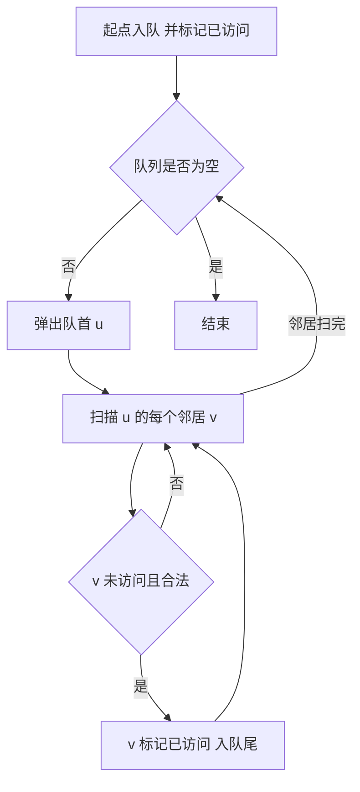

# BFS

## 零、知识地图

```text
BFS（广度优先搜索）
├── 1. BFS 是什么 —— 队列驱动的圈层扩展（前置：[[栈与队列]] 的队列概念）
├── 2. 层序扩展与最短性 —— 第一次到达就是最短的归纳证明、vis 何时标记（前置：1）
├── 3. 模板题 P1443 马的遍历 —— 方向数组、-1 初始化、STL queue 全流程（前置：1、2）
├── 4. 网格 BFS 与连通块 —— 外层枚举起点（前置：3；资料未覆盖，属补充）
└── 5. P8693 大胖子走迷宫 —— 队列里装"状态"：等待入队、形态扩展（前置：3、4）

学习顺序：1 → 2 → 3 → 4 → 5。理由：先立机制（1），再证它最值钱的性质（2），
然后用马字棋盘把模板跑熟（3），扩到最常见的网格场景变体（4），最后学
"队列里不止装坐标"的状态扩展进阶（5）——从机制到性质到模板到变体。
```

## 一、为什么需要它

先用会出事的写法做一遍网格最短路：$n \times n$ 迷宫（$n \le 300$）求起点到终点的最少步数。暴力想法是把每条可能路径都走一遍取最短——每个格子最多 4 个岔路，路径总数随格子数指数级增长，$n=300$ 时根本数不完。改成"走过的格子不重复"的回溯也只是少走重复路，最坏仍要枚举全部可达路径，同样超时。**碰壁的根源：绝大多数路径是无用功——它们在半路就已经比已知路径长了，却还在被完整枚举。**

BFS 的破法只有一句话：**按"离起点的步数"一圈一圈向外扩展，第一次碰到某个格子时的步数就是最短步数**（知识点 2 给证明）。维持圈层顺序的结构就是队列（[[栈与队列]]）。

本篇讲 5 个知识点：BFS 是什么、层序扩展与最短性、模板题 P1443、网格与连通块（补充）、P8693 状态扩展。顺序理由见知识地图。

## 二、知识点逐讲（每个知识点一节，共 5 节）

### 1. BFS 是什么：队列驱动的圈层扩展

前置依赖：[[栈与队列]]（队列 FIFO 是本篇核心结构）、[[二叉树竞赛篇]]（层序遍历就是树上的 BFS）
后续衔接：[[#2. 层序扩展与最短性：第一次到达就是最短]]、[[#3. 模板题 P1443 马的遍历：方向数组、vis 与距离数组]]

**① 它解决什么问题**

A 源 slide 1 定义：BFS（图论）"广度优先搜索，是一种用于遍历或搜索树或图的算法。所谓广度优先，就是说按照圈层搜索"。它回答的问题：从起点出发，哪些点可达、各离起点几步。关键性质：每个点至多入队一次、出队一次，边至多扫两次（无向图两个方向各一次），复杂度 $O(V+E)$；网格上即 $O(nm)$。

**② 直觉理解**

模型级类比：**水波纹**。往池塘扔一块石头，波纹一圈一圈往外扩；同一个格子的水花第一次到达的时刻，就是它离石头最近的距离——因为波纹是按"距离层"推进的，近的圈永远先到。

用具体数字跑一遍：图有 4 个点，边 1-2、1-3、2-4。从 1 出发：第 0 圈只有 {1}；第 1 圈是 1 的直接邻居 {2, 3}；第 2 圈是 2 的邻居里没去过的 {4}。三圈走完，全图访问完毕，4 离 1 恰好 2 步。

**③ 原理与推导**

机制只有三条：起点入队；每轮弹出队首、把它所有没访问过的邻居入队；队列空了就结束。**为什么必须用队列而不是栈**：圈层顺序要求"第 d 层的点全部处理完，才轮到第 d+1 层的点"。队列先进先出（FIFO），第 d 层的点天然排在第 d+1 层前面；栈后进先出（LIFO），刚发现的 d+1 层点会插到还没处理的 d 层点前面，圈层顺序立刻被破坏，搜索退化成"一条道走到黑"。设计动机就这一条：队列这个接口形态（front/pop/push 尾部）恰好是"按层批处理"的物化。



文字版推导链：起点先入队；只要队列不空就弹一个队首；对队首的每个邻居做检查，没访问过的标记后从队尾入队；邻居扫完回到"队列是否为空"的判断。标记必须在入队时做，原因在知识点 2③ 展开。

**④ 代码演示**

核心代码（自编骨架，主循环形态与素材 P1443.cpp 的 while(!q.empty()) 结构一致）：

```cpp
#include <queue>
#include <vector>
using namespace std;
vector<int> adj[105];            // 邻接表，C 等价——每个点挂一条可变长链表存邻居
int vis[105];                    // vis[x]=1 表示 x 已进过队列
void bfs(int s) {                // s：起点编号
    queue<int> q;
    q.push(s); vis[s] = 1;       // 入队同时标记（原因见知识点 2③）
    while (!q.empty()) {
        int u = q.front();       // front 取队首；C 等价——q[head]
        q.pop();                 // pop 弹出队首；C 等价——head++
        for (int i = 0; i < (int)adj[u].size(); i++) {   // 遍历邻居，C 等价——沿链表逐个走
            int v = adj[u][i];
            if (!vis[v]) {       // 没进过队列才入队
                vis[v] = 1;
                q.push(v);       // 从队尾入队；C 等价——q[tail++] = v
            }
        }
    }
}
```

**执行追踪表**（上图 4 点图：边 1-2、1-3、2-4，起点 1，初始 q=[1]）：

| 步骤 | 当前元素 | 结构状态 | 动作 | 结果 |
|:---:|:---:|:---|:---|:---|
| 1 | 弹出 1 | q=[2,3] | 邻居 2、3 未访问，标记入队 | 第 0 圈处理完 |
| 2 | 弹出 2 | q=[3,4] | 邻居 4 未访问，标记入队 | 3 排在 4 前面：层序保持 |
| 3 | 弹出 3 | q=[4] | 邻居无新点 | 无入队 |
| 4 | 弹出 4 | q=[] | 邻居 2 已访问 | 队列空，结束 |

**错误写法对照**：

```diff
- stack<int> q; q.push(s); ... int u = q.top(); q.pop();   // 坑1：用栈当队列——LIFO 让刚发现的点插队，圈层顺序破坏，退化为 DFS 式搜索，最短路结论失效（答案错）
+ queue<int> q; ... int u = q.front(); q.pop();            // FIFO 保证第 d 层先于第 d+1 层被处理
- int u = q.pop();                                          // 坑2：pop 不返回队首值，u 没被赋值，编译不过（CE）
+ int u = q.front(); q.pop();                               // front 取值、pop 弹出，两步分开写
- if (true) { q.push(v); }                                  // 坑3：不查 vis 直接入队——同一个点被多个邻居重复发现、重复入队，队列爆炸（TLE）
+ if (!vis[v]) { vis[v] = 1; q.push(v); }                   // 入队前查重、入队同时标记
```

**⑤ 典型应用**

- 真题：洛谷 P1443 马的遍历（A 源 slide 1 例题），知识点 3 全流程实战。
- 真题：洛谷 P8693 大胖子走迷宫（A 源 slide 2 例题），知识点 5 的状态扩展。
- 真题：力扣 102 二叉树的层序遍历——树上 BFS，[[二叉树竞赛篇]] 的层序框架与本节骨架同构。
- 迁移检验题（自编）：给定 n 个点 m 条边的无向图与起点 s（$n,m \le 10^5$），输出从 s 出发的 BFS 访问序列（邻居按编号升序访问）。建议先独立做，再对照题解：

```cpp
#include <algorithm>
#include <iostream>
#include <queue>
#include <vector>
using namespace std;
int main() {
    int n, m, s; cin >> n >> m >> s;
    vector<vector<int> > adj(n + 1);          // C 等价——n+1 条可变长邻居链表
    for (int i = 0; i < m; i++) {
        int u, v; cin >> u >> v;
        adj[u].push_back(v); adj[v].push_back(u);   // 无向图两条边都存
    }
    for (int u = 1; u <= n; u++) sort(adj[u].begin(), adj[u].end());  // 保证按编号升序访问
    vector<int> vis(n + 1, 0);
    queue<int> q;
    q.push(s); vis[s] = 1;
    while (!q.empty()) {
        int u = q.front(); q.pop();
        cout << u << " ";                     // 弹出即访问，顺序就是 BFS 序
        for (int i = 0; i < (int)adj[u].size(); i++)
            if (!vis[adj[u][i]]) { vis[adj[u][i]] = 1; q.push(adj[u][i]); }
    }
    cout << endl;
    return 0;
}
```

**⑥ 坑点与边界**

> **【易错】** 换栈、换 vector 头删等方式"模拟队列"。圈层顺序被破坏后程序不报错，只是答案悄悄错——队列的 FIFO 是 BFS 正确性的一部分，不是实现细节。

> **【易错】** `int u = q.pop();`。pop 返回 void，这是编译错误；正确写法 front 与 pop 两步分开。

> **【注意】** 循环里每轮必须恰好 pop 一次。只 push 不 pop，队列永不空，死循环（TLE）。

> [!example]-
> **边界数据集（先自己跑一遍，再展开对照）**
> 1. 空输入：n=0、无边 → bfs 不会被调用，程序空转结束，无输出（预期：无输出、不崩溃）。
> 2. 单元素：n=1、无边，bfs(1) → 队列进出各一次，访问序列只有 1（预期：输出 `1 `）。
> 3. 全相同：所有边都连向点 1（星形）→ 每个点只入队一次，vis 挡住重复（预期：队列峰值 O(n)，正常结束）。
> 4. 严格递增：链 1-2-3-…-n → 每层只有一个点，队列长度始终不超过 2（预期：访问序 1,2,3,…）。
> 5. 严格递减：反链 n-…-2-1，bfs(n) → 同理反向走一遍（预期：访问序 n,n-1,…）。
> 6. 极值：n=10^6、m=10^6 → 总代价 O(n+m) 瞬间完成；注意队列峰值可达 O(n)，vector 邻接表 + queue 底层 deque 的内存按 10^6 点预留（预期：不 MLE）。

回扣开场：暴力枚举所有路径的死法在"无用功太多"，而 BFS 每个点只进一次队。现在你能解决"从起点能到哪些点"了——但"第一次到达为什么恰好是最短"还差一个证明，下一节补上。

### 2. 层序扩展与最短性：第一次到达就是最短

前置依赖：[[#1. BFS 是什么：队列驱动的圈层扩展]]、归纳法思想
后续衔接：[[#3. 模板题 P1443 马的遍历：方向数组、vis 与距离数组]]、[[#5. P8693 大胖子走迷宫：队列里装"状态"]]

**① 它解决什么问题**

A 源 slide 1 给出 BFS 最值钱的结论："如果采用 BFS 进行搜索，从起点开始，第一次到达某个点的时间就是最短时间/距离。"它解决的问题是：单位权图（每走一步代价相同）上的最短距离。复杂度与知识点 1 相同，$O(V+E)$，网格上 $O(nm)$——比"枚举所有路径"的指数级，是把无用功彻底砍掉的结果。

**② 直觉理解**

继续用**水波纹**类比：波纹第 1 秒到达的格子，离石头 1 圈；第 2 秒到达的，离 2 圈。一个格子不可能"第 2 秒才被第 1 圈的波碰到"——因为第 1 圈的波第 1 秒就过去了。所以首次到达时刻就是最短距离。

用具体数字跑一遍：星形图 1-2、1-3、1-4。从 1 出发，第 0 层 {1}；弹出 1 时把 2、3、4 全部标上距离 1 入队。2、3、4 无论谁先弹出，距离都是 1——它们是同一层，层内顺序不影响正确性。

**③ 原理与推导**

命题：BFS 中每个点的 dist 被赋值时，赋的就是起点到它的最短距离。前提：每条边代价相同（单位权）。

归纳证明（不跳步）：
1. 初始：队列只有起点，dist=0，是真实最短距离。归纳起点成立。
2. 归纳假设：某一时刻，队列中各点的 dist 构成非降序列，且取值只有相邻两层 d 与 d+1（d 在前）；已弹出的点的 dist 都等于真实最短距离。
3. 弹出队首 u（dist[u]=d），给未访问邻居 v 赋 dist[v]=d+1。v 排在队尾，队尾原本都是 d+1——非降性保持。已弹出点的距离区间向前推进一层。
4. 队列里距离为 d 的点弹完后，队列只剩 d+1，回到第 2 步的形态，归纳推进。
5. 收尾：点 v 首次被赋 dist 时，说明此前所有 dist 小于当前层的点都已弹出并把邻居扫过；若 v 真实最短距离小于 d+1，它会在更早的层被赋值——矛盾。所以 d+1 就是真实最短距离。

**设计动机：为什么 vis 在入队时标记就是安全的**——同一格 v 第二次被邻居发现时，发现者的 dist 只会不小于首次发现者的 dist（弹出顺序非降），第二次赋值不可能更小。首达即最短，之后无需更新，vis 一票否决即可。**为什么必须单位权**：若边权有 1 有 10，"先发现"不再等于"更短"——直达边权 10 反而比绕行两条权 1 的边长，此时需要 Dijkstra（延伸，非必需）。P8693 里"原地等待"也是每步代价 1 的一步，单位权没有被破坏，所以那道题仍能用 BFS（知识点 5）。

**④ 代码演示**

核心代码（自编，把知识点 1 的骨架加上 dist 数组）：

```cpp
#include <cstring>
#include <queue>
using namespace std;
int dist[105];                   // dist[x]：起点到 x 的步数；-1 表示未到达
vector<int> adj[105];
void bfs(int s) {
    memset(dist, -1, sizeof(dist));   // C 等价——把整块内存逐字节填成 -1（每个 int 都是 -1）
    queue<int> q;
    q.push(s); dist[s] = 0;           // 起点距离 0，同时兼任 vis（dist != -1 即已访问）
    while (!q.empty()) {
        int u = q.front(); q.pop();
        for (int i = 0; i < (int)adj[u].size(); i++) {
            int v = adj[u][i];
            if (dist[v] == -1) {      // 首次到达：由队首距离 +1，一步定死不再改
                dist[v] = dist[u] + 1;
                q.push(v);
            }
        }
    }
}
```

**执行追踪表**（图：边 1-2、1-3、2-4，起点 1；dist 初始全 -1）：

| 步骤 | 当前元素 | 结构状态 | 动作 | 结果 |
|:---:|:---:|:---|:---|:---|
| 1 | 弹出 1 (d=0) | q=[]，dist[1]=0 | 邻居 2、3 赋 dist=1，入队 | q=[2,3] |
| 2 | 弹出 2 (d=1) | q=[3] | 邻居 4 赋 dist=2，入队 | q=[3,4] |
| 3 | 弹出 3 (d=1) | q=[4] | 无新邻居 | 无入队 |
| 4 | 弹出 4 (d=2) | q=[] | 邻居 2 已有 dist | 队列空；dist=[0,1,1,2] 即最终答案 |

**错误写法对照**：

```diff
- while (!q.empty()) { int u = q.front(); q.pop(); vis[u] = 1; ... }   // 坑1：出队时才标记——同一格在队列里排多份，边密的图队列爆炸（TLE）
+ q.push(v) 之前就 vis[v] = 1（或 dist[v] != -1 判定）                  // 入队时标记，队列里每格至多一份
- dist[v] = min(dist[v], dist[u] + 1);                                  // 坑2：把最短路"松弛"思想搬进 BFS——单位权图首达已最短，此行无意义；若同时不查 vis 会重复入队（TLE）
+ if (dist[v] == -1) { dist[v] = dist[u] + 1; q.push(v); }              // 首达即定，一步写死
- 拿这套 BFS 去做边权有 1 有 10 的最短路                                  // 坑3：单位权前提被破坏——先发现的可能更贵（直达 10 vs 绕行 2），首达即最短不成立（答案错）
+ 每步代价相同才用 BFS；代价不同换 Dijkstra（延伸，非必需）
```

**⑤ 典型应用**

- 真题：洛谷 P1135 奇怪的电梯——电梯在第 i 层只能上/下固定层数，求最少按键次数，每步代价 1，BFS 状态就是所在楼层。
- 真题：洛谷 P1443 马的遍历——网格单位权最短路的模板（知识点 3）。
- 迁移检验题（自编）：数轴上从位置 1 走到 n（$1 \le n \le 10^5$），每秒可从 x 走到 x+1 或 2x（两种走法代价都是 1 秒），求最少秒数。建议先独立做，再对照题解：状态是位置，走法两种，dist 数组开到 2n（超过 n 后只可能靠 x+1 回不来，超过 2n 的扩展没有意义）。

```cpp
#include <cstring>
#include <iostream>
#include <queue>
using namespace std;
int dist[200005];
int main() {
    int n; cin >> n;
    memset(dist, -1, sizeof(dist));
    queue<int> q;
    q.push(1); dist[1] = 0;
    while (!q.empty() && dist[n] == -1) {   // 拿到答案即可提前停
        int u = q.front(); q.pop();
        int to[2] = {u + 1, 2 * u};          // 两种走法
        for (int i = 0; i < 2; i++) {
            int v = to[i];
            if (v <= 2 * n && dist[v] == -1) { dist[v] = dist[u] + 1; q.push(v); }
        }
    }
    cout << dist[n] << endl;
    return 0;
}
```

**⑥ 坑点与边界**

> **【易错】** 出队时才标 vis。后果是同一格在队列里排多份，$10^5$ 规模下队列膨胀数倍到数十倍（TLE）；正确写法是入队前查、入队时标。

> **【易错】** 在 BFS 里写 `dist[v] = min(dist[v], dist[u]+1)`。单位权下首达即最短，这行永远不会起作用；真正危险的是它暗示"可以更新"，让人顺手去掉 vis 判定，引发重复入队（TLE）。

> **【注意】** BFS 求最短的成立前提是"每步代价相同"。反例：直达边权 10、绕行两条边权 1——BFS 先到的是走直达边的点，但最短是绕行；此时需换最短路算法。

> [!example]-
> **边界数据集（先自己跑一遍，再展开对照）**
> 1. 空输入：n=0 个点 → bfs 不被调用（预期：无输出）。
> 2. 单元素：起点即终点 → dist=0，队列进出各一次（预期：输出 0）。
> 3. 全相同：所有点都只与点 1 相连 → 一层全铺开，dist 全为 1（预期：层内顺序任意、答案确定）。
> 4. 严格递增：链 1-2-…-n → dist[i]=i-1，队列长度峰值 2（预期：线性）。
> 5. 严格递减：反链 n-…-1 → dist[n-k]=k，对称（预期：同上）。
> 6. 极值：n=10^5 的链 → dist 数组 int 不溢出（最大 10^5）；但若题目问"距离之和"再累加要注意 long long（防溢出模式）。

回扣开场：现在你能回答"为什么第一次到达就是最短"了——队列距离非降的归纳链（第 2 至 5 步）加上"首达即定不再更新"的 vis 时机，两件事合起来把暴力枚举的无用功全部砍掉。下一节把这套结论装进真实的棋盘题。

### 3. 模板题 P1443 马的遍历：方向数组、vis 与距离数组

前置依赖：[[#1. BFS 是什么：队列驱动的圈层扩展]]、[[#2. 层序扩展与最短性：第一次到达就是最短]]、[[栈与队列]]
后续衔接：[[#4. 网格 BFS 与连通块：外层枚举起点（资料未覆盖，属补充）]]、[[#5. P8693 大胖子走迷宫：队列里装"状态"]]

**① 它解决什么问题**

洛谷 P1443 马的遍历（A 源 slide 1 例题）：$n \times m$ 棋盘（$n, m \le 400$），马从 (x,y) 出发走"日"字，输出它到每个格子的最少步数，走不到的格子输出 -1。A 源思路原话：（1）"因为马只能走'日'字点，所以不是所有的都会走到，可以先把答案数组全部赋值成 -1"；（2）"'日'字的八个方向，可以通过对行列坐标 x y 做加减得到"；（3）"队列用 STL 实现……过程中要维护距离数组"。复杂度：每格至多入队一次、每次扫 8 个方向，$O(8nm)$。

**② 直觉理解**

模型级类比：水波纹，只是波纹从圆形变成了"日"字形的跳跃。用 $3 \times 3$ 棋盘、马在 (1,1) 跑一遍：第 1 层跳到 (2,3)、(3,2)；第 2 层从它们出发够到 (3,1)、(1,3)；第 3 层够到 (1,2)、(2,1)；第 4 层够到 (3,3)。中心 (2,2) 任何日字都落不到它，保持 -1。九个格子的答案：起点 0，其余按层 1、2、3、4，中心 -1。

**③ 原理与推导**

网格 BFS 与知识点 1 的图 BFS 只差一件事：**邻居不再来自邻接表，而是"当前坐标 + 方向偏移"算出来**。三个设计决策，各有原因：

1. **为什么 ans 初始化为 -1 而不是 0**：0 是合法答案（起点本身 0 步），不可达和"还没走到"必须与 0 区分；题面恰好要求不可达输出 -1，初始化与题面语义一一对齐，最后直接输出即可，无需二次处理。
2. **为什么方向数组成对写**：8 个日字位是 $(\pm 1, \pm 2)$ 与 $(\pm 2, \pm 1)$，dx、dy 用同一组下标一一配对；手写 8 个 if 极易漏一两个方向，而且漏了不报错、只是某些格子永远到不了（答案悄悄错）。
3. **为什么边界判断四条全写**：nx 的上下界、ny 的上下界各一条，漏下界（nx >= 1）时下标 0 或负数会踩进数组未定义区域。


文字版推导链：把 8 个落点写成 dx、dy 两个数组；扩展队首时循环 8 次得到候选坐标；候选坐标过四条边界检查与访问检查后，距离 +1、标记、入队。

**④ 代码演示**

取自源文件 P1443.cpp（改动：无，原样收录；两处未用头文件保留以贴近素材原貌。另见⑥关于输出宽度的【注意】）：

```cpp
#include<iostream>
#include<algorithm>
#include<cstring>
#include<queue>
#include<utility>
using namespace std;
typedef pair<int,int> PII;      // C 等价——struct PII {int first, second;};
int ans[405][405];
int v[405][405];
int dx[8]={2,2,-2,-2,1,1,-1,-1};
int dy[8]={1,-1,1,-1,2,-2,2,-2};
queue<PII> q;

int main()
{
  int n,m,x,y,nx,ny;
  cin>>n>>m>>x>>y;
  memset(ans,-1,sizeof(ans));   // 边界：不可达 -1，与起点 0 区分
  ans[x][y]=0;
  v[x][y]=1;
   PII p,np;
   p.first=x;
   p.second=y;
   q.push(p);

  while(!q.empty())
  {
    p=q.front();
    q.pop();
    for(int i=0;i<8;i++)        // 8 个日字方向，dx/dy 同下标配对
    {
      nx=p.first+dx[i];
      ny=p.second+dy[i];
      if(nx>=1&&nx<=n&&ny>=1&&ny<=m&&v[nx][ny]==0)   // 边界：四条界 + 未访问
      {
        ans[nx][ny]=ans[p.first][p.second]+1;        // 首达即最短（知识点 2）
        v[nx][ny]=1;
        np.first=nx;
        np.second=ny;
        q.push(np);
      }
    }
  }
  for(int i=1;i<=n;i++)
  {
    for(int j=1;j<=m;j++)
    {
      cout<<ans[i][j]<<" ";
    }
    cout<<endl;
  }
  return 0;
}
```

**执行追踪表**（官方样例：$3 \times 3$ 棋盘，马在 (1,1)；队列按"从队首到队尾"记录）：

| 步骤 | 当前元素 | 结构状态 | 动作 | 结果 |
|:---:|:---:|:---|:---|:---|
| 1 | 弹出 (1,1) | q=[(2,3),(3,2)] | 8 个日字位中 (2,3)、(3,2) 界内未访问，ans=1 | 第 1 层入队 |
| 2 | 弹出 (2,3) | q=[(3,2),(3,1)] | 新可达 (3,1)，ans=2 | 1,1 位已访问被拒 |
| 3 | 弹出 (3,2) | q=[(3,1),(1,3)] | 新可达 (1,3)，ans=2 | (1,1) 已访问被拒 |
| 4 | 弹出 (3,1) | q=[(1,3),(1,2)] | 新可达 (1,2)，ans=3 | 第 3 层开始 |
| 5 | 弹出 (1,3) | q=[(1,2),(2,1)] | 新可达 (2,1)，ans=3 | — |
| 6 | 弹出 (1,2) | q=[(2,1),(3,3)] | 新可达 (3,3)，ans=4 | — |
| 7 | 弹出 (2,1) | q=[(3,3)] | 8 方向全越界或已访问 | 无入队 |
| 8 | 弹出 (3,3) | q=[] | 同上 | 队列空；(2,2) 保持 -1 |

最终矩阵 `0 3 2 / 3 -1 1 / 2 1 4`，与官方样例一致（附录 B-5 实测）。

**错误写法对照**：

```diff
- memset(ans, 0, sizeof(ans));                          // 坑1：初始化为 0——"没走到"与"起点 0 步"混淆，不可达格输出 0，与题面 -1 不符（答案错）
+ memset(ans, -1, sizeof(ans)); ans[x][y] = 0;          // 先全 -1，再单独给起点 0（素材原样）
- if (nx < n && ny < m && v[nx][ny]==0)                 // 坑2：只写上界还各差 1——下界没挡，下标 0、负数踩进未定义内存（RE）；上界 <n 又漏最后一行（答案错）
+ if (nx>=1 && nx<=n && ny>=1 && ny<=m && v[nx][ny]==0) // 四条边界一条不少（素材原样）
- if (nx>=1 && nx<=n && ny>=1 && ny<=m) { ans=...; push; }   // 坑3：漏查 v[nx][ny]——同格可从多个日字位到达，反复入队，400x400 下队列膨胀（TLE）
+ ... && v[nx][ny]==0                                    // 入队前查访问标记（素材原样）
```

**⑤ 典型应用**

- 真题：P1443 本题（板子）。官方样例实测通过（附录 B-5）。
- 真题：P8693 大胖子走迷宫——同一套"坐标 + 偏移 + 队列"骨架，队列里多装了状态（知识点 5）。
- 迁移检验题（自编）：象的遍历——$n \times m$ 棋盘（$n,m \le 300$），棋子每次跳 $(\pm 2, \pm 2)$（不考虑塞眼），从 (x,y) 出发输出到每格最少步数，走不到输出 -1。建议先独立做，再对照题解：与 P1443 相比只改方向数组为 dx={2,2,-2,-2}、dy={2,-2,2,-2}；由于横纵坐标每次都变化偶数，坐标奇偶性不变——四类格子互相不可达，多数格子输出 -1，正好检验初始化。

```cpp
// 自编迁移题题解：与 P1443 相比仅方向数组不同
#include <cstring>
#include <iostream>
#include <queue>
#include <utility>
using namespace std;
int ans[305][305], v[305][305];
int dx[4] = {2,2,-2,-2};
int dy[4] = {2,-2,2,-2};
int main() {
    int n, m, x, y;
    cin >> n >> m >> x >> y;
    memset(ans, -1, sizeof(ans));
    ans[x][y] = 0; v[x][y] = 1;
    queue<pair<int,int> > q;
    q.push(make_pair(x, y));
    while (!q.empty()) {
        pair<int,int> p = q.front(); q.pop();
        for (int i = 0; i < 4; i++) {
            int nx = p.first + dx[i], ny = p.second + dy[i];
            if (nx >= 1 && nx <= n && ny >= 1 && ny <= m && v[nx][ny] == 0) {
                ans[nx][ny] = ans[p.first][p.second] + 1;
                v[nx][ny] = 1;
                q.push(make_pair(nx, ny));
            }
        }
    }
    for (int i = 1; i <= n; i++) {
        for (int j = 1; j <= m; j++) cout << ans[i][j] << " ";
        cout << endl;
    }
    return 0;
}
```

**⑥ 坑点与边界**

> **【易错】** ans 初始化成 0。不可达格与起点混在同一个值里，输出全盘 0 开头，与题面要求的 -1 不符（答案错）。先 memset -1，再单独给起点赋 0。

> **【易错】** 方向数组 dx、dy 配错下标（dx 8 个、dy 7 个，或顺序错位）。日字落点会跳到错误位置，部分格子永远到不了——程序不报错，答案悄悄错。

> **【注意】** P1443 题面要求输出"每个数占 5 个字符宽度、左对齐"（即 printf("%-5d") 的效果）；素材代码用"数字 + 单个空格"，数字内容与官方样例一致（附录 B-5），但判题对空白宽度的容忍度这一段我不确定——正式提交建议按题面用 `printf("%-5d", ans[i][j])`。

> [!example]-
> **边界数据集（先自己跑一遍，再展开对照）**
> 1. 空输入：题面保证 $n,m \ge 1$；若强行输入 `0 0 1 1` → 两层输出循环体零次执行，无输出不崩溃（预期：空输出）。
> 2. 单元素：$1 \times 1$ 棋盘、起点 (1,1) → 输出 0（预期：断言程序第 2 条实测通过）。
> 3. 全相同：反复扩展起点——v[起点] 在入队前已标，起点不会被重复入队（预期：结构幂等、不崩）。
> 4. 严格递增：不适用：网格最短路与输入键序无关（步数由棋盘拓扑决定，BFS 结果与扫描顺序无关）。
> 5. 严格递减：不适用：理由同上。
> 6. 极值：$400 \times 400$ 全可达 → 每格至多入队一次，队列峰值 $1.6 \times 10^5$；最大步数不超过 $nm$，int 无溢出风险（预期：瞬间完成、不 MLE）。

回扣开场：马的遍历把知识点 1 的骨架和知识点 2 的最短性装进了真实棋盘——-1 初始化对齐题面、方向数组代替邻接表、入队时标记。现在你能解决开场那道"格子棋盘上跳马"的问题了；下一节把同一套骨架挪到"数有几个独立区域"。

### 4. 网格 BFS 与连通块：外层枚举起点（资料未覆盖，属补充）

前置依赖：[[#3. 模板题 P1443 马的遍历：方向数组、vis 与距离数组]]、[[并查集与种类并查集]]（连通性的另一条技术路线，可对照理解）
后续衔接：[[#5. P8693 大胖子走迷宫：队列里装"状态"]]；DFS 视角的同一问题（DFS 笔记同批规划中，先以文字锚定）

**① 它解决什么问题**

连通块问题：网格里把"相邻的同类格子"算作一片，问一共几片（力扣 200 岛屿数量、洛谷 P1451 求细胞数量、洛谷 P1596 湖泊计数）。PPT 素材只提了"网格中搜索，4 或 8 个方向"（A 源 slide 1），未讲连通块——本节属通识补充，标注：资料未覆盖，属补充。性质：每格至多入队一次，复杂度 $O(nm)$；外层枚举每个格子，遇到未访问的目标字符格就启动一次 BFS，启动次数就是块数。

**② 直觉理解**

模型级类比：**泼水染色**。往每个没被染过的水洼里各泼一次染料，水顺着相邻格子蔓延，泼了几次就有几洼水。与知识点 1 的差别只在：波纹的源头不止一个，每个"没被染过的格子"都是一个新源头。

用具体数字跑一遍：$3 \times 4$ 网格，`*` 是水洼——第 1 行 `**++`，第 2 行 `+*++`，第 3 行 `+++*`。外层从 (1,1) 扫起：(1,1) 是未访问的 `*`，泼第一次，染 {(1,1),(1,2),(2,2)}；(3,4) 是第二个未访问的 `*`，泼第二次，染 {(3,4)}。共 2 块。

**③ 原理与推导**

**为什么外层必须枚举起点**：一次 BFS 的波纹只覆盖一个连通块——波是顺着相邻格子蔓延的，跨不过中间的空地。图里可能有任意多块，所以外层 for 扫全图，每个"目标字符且未访问"的格子都启动一次 BFS，块数即启动次数。**为什么复杂度仍是 $O(nm)$**：vis 是全局的，任何格子在整个程序里至多入队一次，外层枚举只增加 $O(nm)$ 次判断，不产生重复访问。**与并查集的分工**（[[并查集与种类并查集]]）：静态整图数块，BFS/DFS 一次扫描即可；动态合并查询，才轮到并查集。

**④ 代码演示**

核心代码（自编，字符地图骨架；例题化：读入 n×m 的 `+`/`*` 地图，输出 `*` 连通块个数）：

```cpp
#include <iostream>
#include <queue>
#include <utility>
using namespace std;
int n, m;
char g[1005][1005];
bool vis[1005][1005];
int dx[4] = {1,-1,0,0}, dy[4] = {0,0,-1,1};   // 4 邻；8 邻题改成 8 组偏移
void bfs(int sx, int sy) {                    // 从 (sx,sy) 染整个连通块
    queue<pair<int,int> > q;
    q.push(make_pair(sx, sy));
    vis[sx][sy] = 1;
    while (!q.empty()) {
        pair<int,int> p = q.front(); q.pop();
        for (int i = 0; i < 4; i++) {
            int nx = p.first + dx[i], ny = p.second + dy[i];
            if (nx >= 1 && nx <= n && ny >= 1 && ny <= m
                && !vis[nx][ny] && g[nx][ny] == '*') {   // 只在目标字符上蔓延
                vis[nx][ny] = 1;
                q.push(make_pair(nx, ny));
            }
        }
    }
}
int main() {
    cin >> n >> m;
    for (int i = 1; i <= n; i++)
        for (int j = 1; j <= m; j++) cin >> g[i][j];   // 边界：地图是字符，逐字符读
    int cnt = 0;
    for (int i = 1; i <= n; i++)
        for (int j = 1; j <= m; j++)
            if (g[i][j] == '*' && !vis[i][j]) { // 外层枚举：每个未访问目标格启动一次
                bfs(i, j);
                cnt++;                          // 启动次数 = 连通块个数
            }
    cout << cnt << endl;
    return 0;
}
```

**执行追踪表**（②的 $3 \times 4$ 网格；`*` 为目标字符，4 邻）：

| 步骤 | 当前元素 | 结构状态 | 动作 | 结果 |
|:---:|:---:|:---|:---|:---|
| 1 | 外层扫到 (1,1) | q=[(1,1)]，vis(1,1)=1 | 未访问的 `*`，启动第 1 次 BFS | cnt=1 |
| 2 | 弹出 (1,1) | q=[(1,2)] | 邻居 (1,2) 是未访问 `*`，入队；(2,1) 是 `+` 拒绝 | 蔓延中 |
| 3 | 弹出 (1,2) | q=[(2,2)] | 邻居 (2,2) 入队 | 蔓延中 |
| 4 | 弹出 (2,2) | q=[] | 四邻无新格 | 队列空，第 1 块染完 |
| 5 | 外层扫到 (3,4) | q=[(3,4)] | 第二个未访问 `*`，启动第 2 次 BFS | cnt=2 |
| 6 | 弹出 (3,4) | q=[] | 邻居均 `+` 或出界 | 队列空，输出 2 |

**错误写法对照**：

```diff
- bfs(1, 1); cout << cnt << endl;                       // 坑1：只从 (1,1) 跑一次 BFS——只染 (1,1) 所在的一块，其余块全部漏数（答案错）
+ for 每个 (i,j)：是目标字符且未访问就 bfs(i,j)、cnt++   // 外层枚举每个未访问块（素材之外的自编骨架核心行）
- int dx[4] = {1,-1,0,0}, dy[4] = {0,0,-1,1};           // 坑2：P1596 湖泊计数的"相邻"含对角（8 邻），直接套 4 邻板子——斜角相连的一块被拆成两块（答案错）
+ 8 组偏移：(±1,0) (0,±1) (±1,±1)                        // 方向组数按题意定，先看题面再抄板子
- int g[1005][1005]; cin >> g[i][j];                    // 坑3：地图是字符却用 int 读——'0' 读成 48，之后所有字符判断全部失配（答案错）
+ char g[1005][1005]; cin >> g[i][j];                   // 字符格逐字符读
```

**⑤ 典型应用**

- 真题：力扣 200 岛屿数量——`1` 组成的岛屿个数，与本节骨架逐行同构。
- 真题：洛谷 P1451 求细胞数量——数字字符组成的细胞块数，4 邻。
- 真题：洛谷 P1596 [USACO10OCT] Lake Counting S——8 邻水洼计数，注意方向组数与 P1451 不同。
- 迁移检验题（自编）：在块计数上追加一问——输出最大水洼的面积（格子数）。$n,m \le 1000$。建议先独立做，再对照题解：让 bfs 返回本次染色的格子数，外层取 max。

```cpp
// 自编迁移题题解：块计数 + 最大面积，bfs 返回本次染色格子数
#include <algorithm>
#include <iostream>
#include <queue>
#include <utility>
using namespace std;
int n, m;
char g[1005][1005];
bool vis[1005][1005];
int dx[4] = {1,-1,0,0}, dy[4] = {0,0,-1,1};
int bfs(int sx, int sy) {
    queue<pair<int,int> > q;
    q.push(make_pair(sx, sy));
    vis[sx][sy] = 1;
    int size = 0;
    while (!q.empty()) {
        pair<int,int> p = q.front(); q.pop();
        size++;                                // 弹出一个格子，面积加一
        for (int i = 0; i < 4; i++) {
            int nx = p.first + dx[i], ny = p.second + dy[i];
            if (nx >= 1 && nx <= n && ny >= 1 && ny <= m
                && !vis[nx][ny] && g[nx][ny] == '*') {
                vis[nx][ny] = 1;
                q.push(make_pair(nx, ny));
            }
        }
    }
    return size;
}
int main() {
    cin >> n >> m;
    for (int i = 1; i <= n; i++)
        for (int j = 1; j <= m; j++) cin >> g[i][j];
    int best = 0;
    for (int i = 1; i <= n; i++)
        for (int j = 1; j <= m; j++)
            if (g[i][j] == '*' && !vis[i][j])
                best = max(best, bfs(i, j));   // 每块染完取 max
    cout << best << endl;
    return 0;
}
```

**⑥ 坑点与边界**

> **【易错】** 只跑一次 BFS。一次波纹只染一块，块数会被少算；正解是外层枚举每个未访问的目标格。

> **【易错】** 方向组数按板子抄而不是按题意定。P1451 是 4 邻、P1596 是 8 邻，套错不报错、只拆块（答案错）。

> **【注意】** 地图读入用 char 逐字符；`cin >> g[i][j]` 自动跳过空白与换行，整行读法（cin.getline）反而要小心残留换行符。

> [!example]-
> **边界数据集（先自己跑一遍，再展开对照）**
> 1. 空输入：n=0, m=0 → 两层枚举零次，输出 0（预期：空图 0 块）。
> 2. 单元素：1x1，字符 `*` → 1 块；字符 `+` → 0 块（预期：目标字符才计数）。
> 3. 全相同：全 `*` → 一整块，输出 1；全 `+` → 输出 0（预期：两个极端都不崩）。
> 4. 严格递增：对角线 `*`（i==j，4 邻）→ 每格自成一块，输出 n（预期：检验"相邻"定义）。
> 5. 严格递减：反对角线同理，输出 n（预期：同上；若误用 8 邻会输出 1——顺手检验坑 2）。
> 6. 极值：1000x1000 全 `*` → $10^6$ 格各入队一次，O(nm)；vis 用 bool 数组省内存（预期：不 MLE、不 TLE）。

回扣开场：连通块把"从一个点能到哪些点"升级成"整张图分几片"。现在你能数清网格里的岛屿了——用的是知识点 3 的扩展骨架加上外层枚举。下一节处理"队列里光有坐标不够用"的场景。

### 5. P8693 大胖子走迷宫：队列里装"状态"

前置依赖：[[#3. 模板题 P1443 马的遍历：方向数组、vis 与距离数组]]、[[#4. 网格 BFS 与连通块：外层枚举起点（资料未覆盖，属补充）]]
后续衔接：带权最短路 Dijkstra（延伸，非必需）；动态规划的状态设计思想（同源：先定义清楚"一个状态是什么"）

**① 它解决什么问题**

洛谷 P8693 [蓝桥杯 2019 国 AC] 大胖子走迷宫（A 源 slide 2 例题）：$n \times n$ 迷宫（$n \le 300$），小明从 (3,3) 走到 (n-2,n-2)，初始占 $5 \times 5$；时刻 k 瘦成 $3 \times 3$、时刻 2k 瘦成 $1 \times 1$（$k \le 1000$）；每单位时间可上下左右移一格**或原地等待**，`*` 是障碍，身体压到障碍或出界即不可走，求最少时间。A 源思路三个关键点原话概括：等待"也要入队"；"设置一个变量 flag 来表示这三种不同的形态"；初始 flag=2（5×5）、k 时为 1（3×3）、2k 时为 0（1×1）。复杂度：状态是格子数 $O(n^2)$，每状态扫 4 方向 + 1 等待，$O(5n^2)$。

**② 直觉理解**

模型级类比：**大货车过限高杆**。车太高过不去，就停在杆前等——等够时间车变矮了再过。等待本身耗 1 单位时间，所以"在原地等"和"走一步"是平级的动作，都得进队列。

用具体数字跑一遍（$n=6, k=1$，全空地，断言程序实测）：起点 (3,3)、终点 (4,4)。t=0 身形 5×5：上、左方向身形出界被拒；等待态 (3,3,1,1) 入队，右移 (4,3)、下移 (3,4) 入队。t=1 时等待态再入队为 (3,3,2,0)，(4,3) 继续向 (4,4) 扩展。t=2 弹出 (4,4)——是终点，输出 2。对角不能一步斜穿，等待与瘦身穿插其中，2 是最少时间。

**③ 原理与推导**

推导一：**为什么等待必须入队**。到达某窄缝前，身形还是 5×5，四邻全是障碍——这时唯一的"动作"是原地待满时间等瘦身。等待不产生位移，只产生时间流逝与形态变化，它是一个真实的图上转移（代价 1），不进队列就等于把这条路堵死了，队列提前排空、程序无输出。

推导二：**为什么形态不必作为独立维度标记 vis**。形态是时间的函数：$s(t) = 2$（$t<k$）、$1$（$k \le t < 2k$）、$0$（$t \ge 2k$）。BFS 弹出顺序按 t 非降（知识点 2 的层序结论），同一个格子首达时间最小、对应形态也最"瘦不下来"的时期？不对——形态随时间增大而变瘦（通过能力单调变强），首达时间最小意味着形态最胖。那首达还有效吗？有效：首达时最胖的身形都能合法落脚，说明"落脚点本身"没问题；而从这个最早时刻出发，后续所有动作都比"更晚到达"的状态不劣（时间更早、可等可走）。所以同一格只需首达一次，vis 按 (x,y) 二维标记就够——这是素材代码只开 v[305][305] 的原因，也是把"等待入队"补上之后整套做法正确性的支点。

**设计动机：为什么 check 用半径 r 参数而不是三套判定**。A 源原话："这样进行 flag 值的设置，在后面进行检测时也就带来统一的好处"——5×5、3×3、1×1 统一成"中心 ±r 的正方形"，一套双重循环覆盖三种身形，代码从三份变一份。

**④ 代码演示**

核心代码（取自源文件 P8693.cpp，改动：删去未使用的 include 与空行、合并连续短语句排版，逻辑逐行保留；完整版见源文件 P8693.cpp）：

```cpp
#include <iostream>
#include <queue>
using namespace std;
char map[305][305];
int n, k;
int dx[4] = {1,-1,0,0};
int dy[4] = {0,0,-1,1};
struct node {          // 队列里装"状态"：坐标 + 时间 + 身形
    int x, y;
    int t;             // 时间
    int s;             // 身形半径 2 1 0
};
queue<node> q;
int v[305][305];

bool check(int nx, int ny, int r)   // 中心 (nx,ny)、半径 r 的身形能否落脚
{
    if (v[nx][ny] == 1) return 0;
    for (int i = nx - r; i <= nx + r; i++)
        for (int j = ny - r; j <= ny + r; j++)
            if (i < 1 || i > n || j < 1 || j > n || map[i][j] == '*') return 0;  // 边界：越界或撞障碍
    return 1;
}
int main()
{
    cin >> n >> k;
    for (int i = 1; i <= n; i++)
        for (int j = 1; j <= n; j++) cin >> map[i][j];
    v[3][3] = 1;
    q.push((node){3, 3, 0, 2});     // 起点 (3,3)、时刻 0、5x5 形态
    int r;
    while (!q.empty())
    {
        node now = q.front(); q.pop();
        if (now.x == n - 2 && now.y == n - 2)   // 到终点：首达即最短
        {
            cout << now.t << endl;
            break;
        }
        if (now.s != 0)   // 未瘦到 1x1：原地等待也入队
        {
            if (now.t + 1 < k) r = 2; else if (now.t + 1 < 2 * k) r = 1; else r = 0;
            q.push((node){now.x, now.y, now.t + 1, r});
        }
        node nex;
        for (int i = 0; i < 4; i++)
        {
            nex.x = now.x + dx[i]; nex.y = now.y + dy[i];
            if (check(nex.x, nex.y, now.s))
            {
                v[nex.x][nex.y] = 1;
                nex.t = now.t + 1;
                if (now.t + 1 < k) nex.s = 2; else if (now.t + 1 < 2 * k) nex.s = 1; else nex.s = 0;   // 形态按"走完这一步后"的时刻算
                q.push(nex);
            }
        }
    }
    return 0;
}
```

**执行追踪表**（$n=6, k=1$ 全空地，起点 (3,3)、终点 (4,4)；队列按队首到队尾记录）：

| 步骤 | 当前元素 | 结构状态 | 动作 | 结果 |
|:---:|:---:|:---|:---|:---|
| 1 | 弹出 (3,3,0,2) | q=[(3,3,1,1),(4,3,1,1),(3,4,1,1)] | 等待态入队；右移、下移过 check 入队；上、左身形出界被拒 | 等待与移动平级入队 |
| 2 | 弹出 (3,3,1,1) | q 尾部追加 (3,3,2,0) | 等待态升级（t+1=2 达 2k，r=0）；四邻均已访问 | — |
| 3 | 弹出 (4,3,1,1) | 追加 (4,3,2,0),(5,3,2,0),(4,2,2,0),(4,4,2,0) | 等待态入队；右移 (5,3)、左移 (4,2)、下移 (4,4) 过 check（r=1） | 终点状态 (4,4,2,0) 已入队 |
| 4 | 弹出 (3,4,1,1) | 追加 (3,4,2,0),(2,4,2,0),(3,5,2,0) | (4,4) 已访问被拒 | — |
| 5 | 依次弹出各 (x,y,2,0) | — | s=0 不再入等待态；四邻已访问 | — |
| 6 | 弹出 (4,4,2,0) | — | 坐标等于终点 | 输出 2，程序结束 |

官方样例（$n=9, k=5$，第 6 行 `***+*****`）实测输出 16（附录 B-5）。

**错误写法对照**：

```diff
- （不写等待分支）                                                    // 坑1：等待态不入队——卡在窄缝前四邻全障碍时无转移可用，队列提前排空，程序无输出（答案错）
+ if (now.s != 0) q.push((node){now.x, now.y, now.t + 1, r});        // 等待也是代价 1 的一步，必须入队（素材原样）
- if (now.t < k) r = 2; else if (now.t < 2 * k) r = 1;               // 坑2：形态按当前时刻 now.t 算——该算"走完这一步后"的时刻 now.t+1，恰好压线时差 1（答案错）
+ if (now.t + 1 < k) r = 2; else if (now.t + 1 < 2 * k) r = 1;       // 素材原样：新状态的形态配新时刻
- if (now.x == n - 2 && now.y == n - 2) { cout << now.t << endl; }   // 坑3：输出后不终止——同一终点可能随等待态再次弹出，重复输出（WA）
+ cout << now.t << endl; break;                                       // 首达即最短，输出即终止（素材原样）
```

**⑤ 典型应用**

- 真题：P8693 本题（蓝桥杯 2019 国赛 A 组 F 题 / C 组 I 题，A 源 slide 2）。官方样例实测输出 16（附录 B-5）。
- 真题：P1443 马的遍历——同一骨架的最简形态，队列里只装坐标；对比着看，本题多装的只有"时间与形态"。
- 迁移检验题（自编）：货运小车——$n \times n$ 网格（$n \le 100$），`+` 空地、`*` 墙、`B` 限重杆；小车从 (1,1) 到 (n,n)，每单位时间可上下左右移一格或原地等待；初始满载，满载不能进 `B` 格；在任意格可花 1 单位时间原地卸货，卸后空载可过 `B`；求最少时间，不可达输出 -1。建议先独立做，再对照题解：状态=(x,y,空载?)，卸货对应"等待翻转状态"，与本题"等待瘦身"同构。

```cpp
// 自编迁移题题解：状态里多一维"空载"，卸货对应等待翻转状态
#include <cstring>
#include <iostream>
#include <queue>
using namespace std;
struct st { int x, y, e, t; };       // e：1 空载，0 满载
char g[105][105];
bool vis[105][105][2];
int dx[4] = {1,-1,0,0}, dy[4] = {0,0,-1,1};
int main() {
    int n; cin >> n;
    for (int i = 1; i <= n; i++)
        for (int j = 1; j <= n; j++) cin >> g[i][j];
    queue<st> q;
    vis[1][1][0] = 1;
    q.push((st){1, 1, 0, 0});
    while (!q.empty()) {
        st now = q.front(); q.pop();
        if (now.x == n && now.y == n) { cout << now.t << endl; return 0; }
        if (now.e == 0 && !vis[now.x][now.y][1]) {   // 满载可原地卸货（等待翻转状态）
            vis[now.x][now.y][1] = 1;
            q.push((st){now.x, now.y, 1, now.t + 1});
        }
        for (int i = 0; i < 4; i++) {
            int nx = now.x + dx[i], ny = now.y + dy[i], ne = now.e;
            if (nx < 1 || nx > n || ny < 1 || ny > n) continue;
            if (g[nx][ny] == '*') continue;              // 墙
            if (g[nx][ny] == 'B' && ne == 0) continue;   // 满载不能过限重杆
            if (!vis[nx][ny][ne]) {
                vis[nx][ny][ne] = 1;
                q.push((st){nx, ny, ne, now.t + 1});
            }
        }
    }
    cout << -1 << endl;   // 不可达：队列排空后显式输出（素材 P8693 无此分支，见坑点）
    return 0;
}
```

**⑥ 坑点与边界**

> **【易错】** 等待态不入队。窄缝前唯一的出路是"等瘦身"，砍掉等待转移等于把正路封死，队列提前排空、程序无输出。A 源原话把"停留也要入队"列为关键点第一条。

> **【易错】** 形态判断用 now.t 而不是 now.t+1。入队的是"下一时刻"的状态，形态要配下一时刻；恰好压线（t+1 == k）时差 1 个时刻段，身形胖一圈，路径合法性整体判错（答案错）。

> **【注意】** 素材 P8693.cpp 在队列排空（终点不可达）时不输出任何内容。若担心不可达数据，建议在 while 之后补 `cout << -1 << endl;`（本题题面数据保证可达，属于稳健性习惯）。另：终点判定输出后立即 break，防止等待态重复触发输出。

> [!example]-
> **边界数据集（先自己跑一遍，再展开对照）**
> 1. 空输入：题面保证 $n \ge 1$ 且起点 (3,3) 存在，n=1..4 时终点坐标与起点重叠或越界，无合法题意（预期：按题面约束，不构造）。
> 2. 单元素：n=5 → 起点 (3,3) 即终点 (n-2,n-2)=(3,3)，t=0 弹出即输出 0（预期：断言程序第 4 条实测通过）。
> 3. 全相同：全 `*` 地图 → 起点身形永远无法落脚（check 恒假），只剩等待态反复入队直到 s=0，队列排空、无输出（预期：暴露"不可达无输出"缺口，稳健写法补 -1）。
> 4. 严格递增：k=1,2,3,…（其余不变）→ k 越大等待期越长，答案单调不减（预期：检验对 k 的理解）。
> 5. 严格递减：k 很大（如 10^3 量级全程 > 2k）→ 永远 5×5 身形，纯最短路 + 等待（预期：答案 = 普通最短路或不可达）。
> 6. 极值：n=300, k=1 → 状态数 O(n^2)=9 万，O(5n^2) 瞬间完成；t 最大约 2k+n^2 量级，int 无溢出（预期：不 TLE 不溢出）。

回扣开场：开场那道"迷宫最少步数"在 P8693 里长出了新形态——队列里装的不止坐标，还有时间与身形；等待入队补全了转移，首达即最短依旧成立。现在你能解决开场问题了：知识点 2 的最短性给"输出即终止"背书，知识点 3 的网格骨架给扩展供模板，这一节只往队列里多装了两个字段。

## 三、全篇坑点总表

| # | 坑 | 正解 |
|---|-----|------|
| 1 | 栈当队列用，圈层顺序破坏 | queue 的 FIFO 是 BFS 正确性的一部分 |
| 2 | `int u = q.pop()` 当取值用 | front 取值、pop 弹出，两步分开 |
| 3 | 不查 vis 直接入队 | 入队前查、入队同时标 |
| 4 | 出队时才标 vis | 入队时标记，队列里每格至多一份 |
| 5 | BFS 用在边权不等的图求最短 | 单位权才用；否则 Dijkstra（延伸） |
| 6 | P1443 的 ans 初始化为 0 | memset -1 后单独给起点 0 |
| 7 | 边界判断漏下界或上界差一 | 四条界一条不少（nx≥1 且 nx≤n 等） |
| 8 | dx、dy 配错下标 | 同下标一一配对，逐组核对 |
| 9 | 连通块只跑一次 BFS | 外层枚举每个未访问目标格 |
| 10 | 8 邻题套 4 邻板子（P1596） | 方向组数按题意定 |
| 11 | 字符地图用 int 读 | char 逐字符读 |
| 12 | P8693 等待态不入队 | 未瘦到 1x1 前等待必入队 |
| 13 | P8693 形态按 now.t 算 | 按 now.t+1（走完这一步后的形态） |
| 14 | 到终点输出后不终止 | 首达即最短，输出即 break |

## 四、总结与自测

### 核心内容（一页纸速览）

- **BFS 是什么**：按圈层扩展的图搜索（A 源 slide 1）；队列维持"第 d 层先于第 d+1 层"；每点至多入队一次，$O(V+E)$，网格 $O(nm)$。
- **最短性**：单位权前提下，队列距离非降 + 首达即定，第一次到达就是最短（A 源 slide 1 原话）；vis 必须入队时标记。
- **P1443 马的遍历**：方向数组代替邻接表；ans 先 memset -1 再给起点 0；四条边界 + 未访问检查；$O(8nm)$。
- **连通块**：一次波纹染一块，外层枚举未访问目标格，启动次数即块数；方向组数按题意 4 或 8 邻（本节资料未覆盖，属补充）。
- **P8693**：队列装状态 (x,y,t,s)；等待也是代价 1 的一步必须入队；形态按 now.t+1 算；半径 r 统一三种身形的 check；$O(5n^2)$。

### 自测清单

- [ ] 能说清"为什么队列不是栈"并画出 4 点图的两层扩展
- [ ] 能写出"队列距离非降"的归纳证明四步，并指出单位权前提用在哪
- [ ] 能默写 P1443 全流程并手推官方样例矩阵 `0 3 2 / 3 -1 1 / 2 1 4`
- [ ] 能解释 ans 初始化 -1 的原因与"入队时标 vis"的安全性
- [ ] 能在 3x4 网格上手动数出连通块并说明外层枚举为什么必要
- [ ] 能说出 P8693 三个关键点（等待入队 / flag 形态 / 统一 check）并手推 n=6 k=1 输出 2
- [ ] 能对 P1443 说出题面输出格式与素材代码的差异及稳妥写法

### 错题登记

| 题号 | 错因 | 正解要点 |
|------|------|---------|
| （学完后填写） | | |

## 五、语法糖对照表

| 语法 | 等价 C 写法 | 一句话用途 |
|------|------------|-----------|
| `cin >> a >> b;` / `cout << x << endl;` | `scanf` / `printf` | 流式读写（两份素材均用） |
| `using namespace std;` | 每个标识符前加 `std::` | 免前缀 |
| `typedef pair<int,int> PII;` | 自定义 `struct {int first, second;}` | 二元组（P1443 队列元素） |
| `queue<T> q; push/front/pop/empty` | 数组 + head/tail 手写循环队列 | BFS 核心容器 |
| `queue<node> q; q.push((node){3,3,0,2});` | 结构体数组循环队列 + 逐字段赋值 | 装状态的队列（P8693） |
| `memset(ans,-1,sizeof(ans));` | 双重 for 逐格赋 -1 | 整块内存按字节填充 |
| `vector<int> adj[N]; adj[u][i]` | 每点一条链表（[[链表]]） | 邻接表 |
| `sort(v.begin(), v.end())` | qsort 或手写排序 | 迁移题保证访问序 |

## 附录（供验收，正文之外，不影响阅读）

### 附录 A　源文件覆盖对账

#### A-1 提取表

| 源文件 | 提取方式 | 完整性 |
| --- | --- | --- |
| 16.搜索之BFS.pptx | 脚本提取为文本（META：pages=2 pics=0 chars=1061）；图片计数基于 pptx 内部 XML 统计，zlib 压缩流可能带来误差，如实注明 | slide 1：搜索总述、BFS 定义、网格搜索、P1443 思路；slide 2：P8693 三关键点 + "下节课的题目："标题（其后无文本内容，见附录 B-3） |
| P1443.cpp | 全文直读（57 行） | 完整：STL queue + 8 方向数组 + ans/v 双数组 |
| P8693.cpp | 全文直读（85 行） | 完整：node 状态 + check 身形判定 + 等待入队 |

#### A-2 知识点总清单（5 对 5）

| 序号 | 知识点 | 对应源文件 | 优先级 |
|------|--------|-----------|--------|
| 1 | BFS 是什么：队列驱动的圈层扩展 | 16.搜索之BFS.pptx slide 1 + P1443.cpp 主循环形态 | P0 |
| 2 | 层序扩展与最短性 | 16.搜索之BFS.pptx slide 1（"第一次到达……最短"） | P0 |
| 3 | 模板题 P1443 马的遍历 | 16.搜索之BFS.pptx slide 1 + P1443.cpp | P0 |
| 4 | 网格 BFS 与连通块 | 素材未覆盖，属补充（素材仅提网格 4/8 方向） | P1 |
| 5 | P8693 大胖子走迷宫：状态扩展 | 16.搜索之BFS.pptx slide 2 + P8693.cpp | P0 |

依赖关系：1 是 2 的机制基础；2 是 3 的正确性依据（首达即最短、入队时标记）；3 是 4 的骨架母版；5 复用 3 的骨架并扩展队列元素。源文件侧 3 份全部入篇；知识点 4 为通识补充并已在标题与 A-2 注明。

#### A-3 冲突登记

| 何处冲突 | 采信哪方 | 理由 |
| --- | --- | --- |
| P1443 输出格式：题面要求"每数占 5 字符宽度、左对齐" vs 素材代码"数字+单空格" | 素材代码原样收录，正文⑥【注意】给出 printf("%-5d") 备选 | 两种写法数字内容实测一致（附录 B-5）；空白宽度容忍度这一段我不确定，按题面格式最稳 |
| "搜索中的 BFS"与"图论 BFS"口径 | 采信 slide 1 自身口径：相似但不完全相同，本篇按"队列 + 圈层 + 最短距离"统一讲解 | slide 原话自注二者"有一定相似之处，但并不完全相同"；网格与单位权场景下机制一致 |
| P8693 思路说"设置变量 flag"，代码用 node.s 字段 | 采信代码字段 s | 语义一致（2/1/0 对应三种身形）；代码是可运行事实，slide 是思路描述 |

### 附录 B　假设与缺口登记

- B-1 假设清单：学习者已具备 [[栈与队列]] 的队列概念；未学过 STL（queue、pair、vector、memset、sort 均在语法糖表给 C 等价写法）；DFS 未学，本篇不依赖 DFS（相关处文字锚定）。
- B-2 资料缺口：连通块（知识点 4）为本篇补充；带权最短路（Dijkstra）仅作延伸一句，不展开；DFS 与 BFS 的对比待同批 DFS 笔记产出后补链。
- B-3 读取缺口：slide 2 末尾出现"下节课的题目："标题，其后无文本内容（META pics=0；pptx 图片数统计可能有 zlib 压缩误差，图片是否存在无法从文本层确认）。若预告内容在图片中，建议贴图位置：slide 2 末尾，源文件 16.搜索之BFS.pptx，由使用者验收时补图；预告题号因此无法登记归属，若属 DFS 主题则归同批 DFS 笔记。
- B-4 自编内容：知识点 1⑤ BFS 序迁移题、知识点 2⑤ 数轴跳跃迁移题、知识点 3⑤ 象的遍历迁移题、知识点 4⑤ 最大水洼迁移题、知识点 4 全部代码、知识点 5⑤ 货运小车迁移题，均标注"自编"；执行追踪表数据中 P1443 与 P8693 官方样例部分为实测，其余为手推。
- B-5 编译验证记录：①两份素材源码 `g++ -std=c++17 -O2 -fsyntax-only` 均 exit=0；编译为可执行后运行官方样例——P1443（输入 `3 3 1 1`）输出 `0 3 2 / 3 -1 1 / 2 1 4`，与官方一致；P8693（输入 `9 5` + 官方样例地图）输出 `16`，与官方一致。②断言程序 verify_b3_bfs.cpp **5 PASS / 0 FAIL**：P1443 官方样例矩阵逐格比对、P1443 1x1 棋盘输出 0、P8693 官方样例 16、P8693 n=5 全空地输出 0（起点即终点）、P8693 n=6 k=1 全空地输出 2（手算：对角终点需 2 个单位步）。教训：第 5 条断言初版按"一步斜穿对角"写期望 1 而失败——BFS 只走单位步不斜穿；写断言先核对测试数据本身。

### 附录 C　交付前自检清单

- [x] 附录 A 有逐份提取表；总清单 5 条 = 正文知识点 5 节，编号一一对应
- [x] 每个知识点六步齐全（①至⑥），以问题开场、以回扣收尾
- [x] 无未解释的新术语；无「显然 / 易得 / 略」类措辞
- [x] 全文无 emoji
- [x] callout 声明行独占一行；同一引用块单主标签；标题不跳级；表格不超过 6 列
- [x] 代码均为 C++17 可编译，素材源码经 g++ -std=c++17 语法检查与官方样例实测（附录 B-5）；改动处已注记；迁移题标注「自编」
- [x] 关键结论注明来源（A 源 slide / 素材文件名）；不确定处已标注「这一段我不确定」
- [x] frontmatter 六项齐全（tags / 优先级 / 掌握状态 / 最后复习日期 / 来源 / 生成日期）
- [x] 「零、知识地图」文本树在篇首；每个知识点头部有「前置依赖 / 后续衔接」双链字段
- [x] ④节为「代码演示」三块：核心代码 + 执行追踪表（5 节全配，BFS 属流程类）+ 错误写法对照（```diff 块，每坑必配）
- [x] ⑥节末尾边界数据集六类（含极值查溢出；不适用类已标理由）；C++ 新特性首现处有 C 等价注释；篇末有《语法糖对照表》
- [x] 公式为 LaTeX 且配文字版结论；mermaid 2 个（不超过 3）且均配文字版推导链
- [x] 双链按 Obsidian 优先口径使用（库内真实笔记：栈与队列 / 链表 / 二叉树竞赛篇 / 并查集与种类并查集；DFS 文字锚定）
- [x] 性质与复杂度融入正文；推导含设计动机回答；类比均为模型级（水波纹 / 大货车过限高杆）
- [x] 工程痕迹全部在附录（对账 / 假设 / 自检），正文无验收类内容
