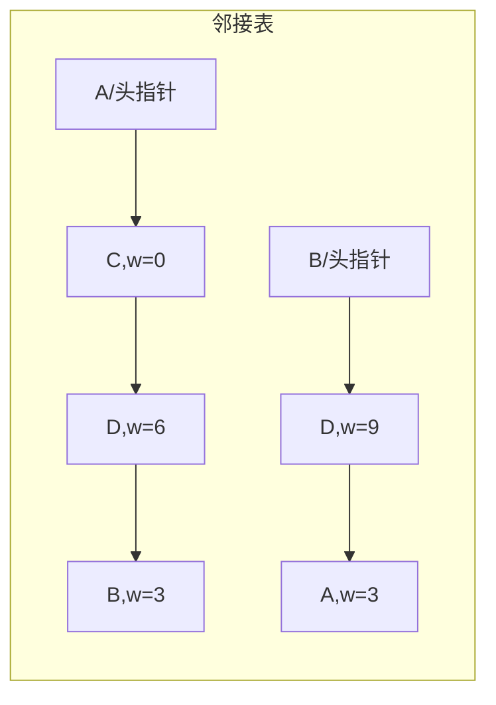

# 图的概念存储与遍历

## 零、知识地图

```text
图的概念存储与遍历
├── 1. 图是什么与基本术语 —— G=(V,E)、有向无向、度、路径与环、连通分量（前置：无）
├── 2. 邻接矩阵与邻接表 —— 两数组 vs 数组+链表，空间账与选型（前置：1、[[链表]]）
├── 3. 十字链表与多重邻接表 —— 入边链表 + 边结点共享（了解级）（前置：2）
├── 4. 链式前向星 —— 静态链表实现邻接表，竞赛建图主流（前置：2）
├── 5. 图的 DFS —— 一条路走到底，递归/栈（前置：2 或 4、[[栈与队列]]）
└── 6. 图的 BFS —— 按层扩散，队列（前置：2 或 4、[[栈与队列]]）

学习顺序：1 → 2 → 3 → 4 → 5 → 6。理由：先立概念语言（1），再解决"怎么存"（2），3 是 2 的结构延伸（了解即可），4 是 2 的竞赛替代品（重点），最后"怎么走遍"的两式（5、6）分别踩在递归与队列上。
```

## 一、为什么需要它

先看一个具体场景：$n$ 个城市、$m$ 条公路，问从首都出发能到达几座城。城市是"点"，公路是"边"——这种**多对多**的关系，线性表（一对一）和树（一对多）都装不下，必须用图（B 源概念 p1 原话："如果要描述多对多的复杂关系就需要图数据结构了"）。

第一道坎就是存：若开一个 $n \times n$ 的邻接矩阵，$n = 10^5$ 时仅 int 数组就要 $10^{10} \times 4$ 字节 = 40 GB——直接爆内存。而竞赛图的 $m$ 往往只有 $10^5$ 量级（稀疏图），40 GB 里 99.99% 都在存"没有边"。第二道坎是走：存好了，怎么把该到的点一个不漏地访问一遍，还不绕圈死循环？

本篇 6 个知识点：概念与术语（1）、邻接矩阵与邻接表（2）、十字链表与多重邻接表（3，了解级）、链式前向星（4，A 源重点）、DFS（5）、BFS（6）。顺序理由：会存才谈得上走，存法选型（2/4）决定遍历复杂度（5/6）。

## 二、知识点逐讲（每个知识点一节，共 6 节）

### 1. 图是什么与基本术语

前置依赖：无（一维/二维数组、struct 属 C 基础）
后续衔接：[[#2. 邻接矩阵与邻接表]]、[[#6. 图的 BFS]]（连通分量判定的另一条路）

**① 它解决什么问题**

B 源概念 p1 定义：图 $G$ 由两个集合组成，记为 $G = (V, E)$——$V$ 是顶点的有限非空集合（$|V|$ 表顶点数），$E$ 是 $V$ 中顶点偶对的有限集，偶对称为**边**（$|E|$ 表边数）。点代表事物，边代表事物间的联系，图就是描述"多对多"关系的数据结构。它解决的问题是：当对象之间不再是一对一（线性表）或一对多（树）时，如何统一建模。本知识点是概念语言，全篇后续存储与遍历都建立在它的术语上；性能账（复杂度）与存法强相关，在知识点 2 兑现。

**② 直觉理解**

模型级类比：**微信群**。每个人是一个点；谁和谁有"好友关系"，两点之间连一条边。一个人可以和很多人是好友（多对多），好友之间还可以互为好友（边可成环）——这两点正是树装不下的。

用具体数字跑一遍（样例图 1，来自邻接矩阵.c 注释样例，全篇沿用）：4 个点 A、B、C、D，5 条边 A-B(3)、A-D(6)、A-C(0)、B-D(9)、D-C(4)（括号内是权值）。数一数：A 连着 B、D、C，度是 3；D 连着 A、B、C，度也是 3；全图 5 条边，各点度之和 $3+3+2+2+2=12 = 2 \times 5$。

**③ 原理与推导**

术语按 B 源概念 p1-p6 逐个立起来（每条注来源）：

- **有向图 / 无向图**（p2）：边偶对有序是弧 $\langle i, j\rangle$（$V_i$ 弧尾、$V_j$ 弧头）；无序是边 $(i, j)$。一个图要么全有向要么全无向，不存在混合（混合图概念 B 源提及，竞赛少见）。
- **简单图**（p2）：无自环、无重边。竞赛题面通常保证简单图。
- **完全图**（p2-p3）：每两点间都有边。完全无向图 $n(n-1)/2$ 条边；完全有向图 $n(n-1)$ 条弧——因为每对点要互相各一条。自造 3 点验证：无向完全图 $3 \times 2 / 2 = 3$ 条（AB、AC、BC），有向完全图 $3 \times 2 = 6$ 条。
- **度 / 入度 / 出度**（p3）：无向图顶点的边数是度；有向图以该点为起点的弧数是出度、为终点的是入度。**度之和 = 2e**（p3 原话"度之和为 2e"）——为什么？每条无向边恰给两个端点各贡献 1 度，e 条边贡献 $2e$，没有重复也没有遗漏。有向图另有一条推论：入度之和 = 出度之和 = e（每条弧给一头加 1 入、给尾加 1 出）。
- **路径与路径长度**（p3）：顶点序列 $(i, i_1, \ldots, j)$，相邻点间都有边；长度 = 经过的边数。除起终点外顶点互不重复的路径是**简单路径**。
- **回路 / 环**（p3）：起终点相同的路径；起终点相同的简单路径是简单环。有向无环图（DAG，p2）：从任一点出发沿有向边走不回自身——后续"拓扑排序"（同批内容，此处文字锚定）专门处理它。
- **连通 / 连通分量**（p4）：两点间存在（间接）可达路径则连通；任意两点连通的图是连通图；非连通图的**极大**连通子图叫连通分量。"极大"的含义（p4 原话）：再加一个图外的点都会导致不再连通。有向图对应的概念是强连通图与强连通分量（p5，双向可达）。
- **生成树**（p6）：连通图的极小连通子图，含全部 $n$ 个点、恰 $n-1$ 条边。为什么恰好 $n-1$：$n$ 个点的连通图至少 $n-1$ 条边（从第一个点起每加一个点至少加一条边）；少一条必不连通，多一条必有环。p4 的"极小连通子图"四边形例子：4 点 4 边的四边形，去掉任一条边仍连通，故生成树是 4 点 3 边。
- **权与网**（p6）：边上的数值叫权（距离、代价），带权图也叫网。权可以是 0 或负数（p6 明说），这与存储编码直接相关（知识点 2 的 inf 坑）。
- **稀疏图 / 稠密图**（p6）：B 源口径：边数小于 $n \log n$ 称稀疏，反之稠密（B 源自己注明"说法比较多"，此处按 B 源记录）。
- 欧拉环路 / 哈密尔顿环路（p4）：经过每条边恰好一次 / 每个顶点恰好一次的环路。属了解概念，本篇不展开。

**④ 代码演示**

核心代码（摘自源文件邻接矩阵.c 的求度片段；改动：为独立可读补了变量声明与样例数组，逻辑逐行一致；完整建图见知识点 2④）：

```cpp
// 样例图 1：A=1 B=2 C=3 D=4；inf 表示无边
const int inf = 10001;
int g[5][5];
// 建图后（邻接矩阵.c：无向边对称赋值 g[xi][yi]=g[yi][xi]=w）
g[1][2]=g[2][1]=3; g[1][4]=g[4][1]=6; g[1][3]=g[3][1]=0;
g[2][4]=g[4][2]=9; g[4][3]=g[3][4]=4;
int d = 0, xi = 1;                  // 求 A（下标 1）的度
for (int j = 1; j <= 4; j++)
    if (g[xi][j] < inf) d++;        // 复杂度：O(n)——扫一遍第 xi 行
printf("%d\n", d);                  // 输出 3
```

**执行追踪表**（上段代码，逐 j 推演；判据是 `g[xi][j] < inf` 而非 `!= 0`）：

| 步骤 | 当前元素 | 结构状态 | 动作 | 结果 |
|:---:|:---:|:---|:---|:---|
| 1 | j=1 | g[1][1]=inf | 判 <inf？否 | 不计 |
| 2 | j=2 | g[1][2]=3 | 判 <inf？是 | d=1（邻点 B） |
| 3 | j=3 | g[1][3]=0 | 0<inf 是 | d=2（邻点 C，权 0 也是边） |
| 4 | j=4 | g[1][4]=6 | 判 <inf？是 | d=3（邻点 D） |
| 5 | 循环结束 | — | 输出 | 度=3 |

**错误写法对照**（对应⑥坑 1）：

```diff
- if (g[xi][j] != 0) d++;      // 坑：用 !=0 判有边——权为 0 的边 A-C(0) 被误判成无边，度算成 2（答案错）
+ if (g[xi][j] < inf) d++;     // 对：用"是否小于哨兵 inf"判有边；权 0 的边也能识别（断言 check6 实测）
```

**⑤ 典型应用**

- 真题：洛谷 P3367【模板】并查集——问"是否同群"就是问"是否连通"，连通分量语言与[[并查集与种类并查集]]讲的是同一件事（知识点 5 会从图遍历角度再看它）。题号真实。
- 真题：力扣 200 岛屿数量——"岛屿"就是连通分量，网格上的 1 格是点、相邻是边（知识点 5、6 的⑤都会再用它）。
- 迁移题（自编）：给 $n$ 与 $e$，问所有顶点度之和。答案 $2e$，一行公式，检验"度和 = 2e"是否内化。

**⑥ 坑点与边界**

> **【易错】** 有边判据写 `g[i][j] != 0`。带权图权 0 是合法边（B 源 p6 明说权可为小数、负数、0 语义上可自定），正确判据是 `< inf`，见④对照。

> **【易错】** 有向图求"度"只数出度。有向图度 = 入度 + 出度（B 源 p3），只数行（出度）会漏掉入度；矩阵里入度看列、出度看行（B 源存储 p2）。

> **【注意】** 完全图两条公式别混：无向 $n(n-1)/2$、有向 $n(n-1)$——差一个 2，来源是"无向一条边顶两条弧"。

> [!example]-
> **边界数据集（先自己跑一遍，再展开对照）**
> 1. 空输入：n=0——图不存在（B 源定义要求 V 非空），任何求度代码循环零次，无输出（预期：不崩、无输出）。
> 2. 单元素：n=1, e=0 → 度 0，度之和 0=2×0（预期：公式仍成立）。
> 3. 全相同：5 条边全是 A-B 重边 → 按简单图定义这不算合法输入；若题面允许多重图，A 的度按重数计为 10（预期：知道自己在哪种口径下做题）。
> 4. 严格递增：不适用——本知识点是概念与一行扫描，与键序无关。
> 5. 严格递减：不适用——理由同上。
> 6. 极值：n=100, e=4950（完全无向图 $100 \times 99/2$）→ 度之和 = 9900 = 2e，每个点度 99（预期：完全图公式与 2e 双验证）。

回扣开场：现在你有了描述"城市与公路"的完整术语——点、边、度、连通分量。下一个问题立刻出现：这些点边放进内存，怎么放？

### 2. 邻接矩阵与邻接表

前置依赖：[[#1. 图是什么与基本术语]]、[[链表]]（单链表头插）
后续衔接：[[#3. 十字链表与多重邻接表（了解级）]]、[[#4. 链式前向星：竞赛建图主流]]、[[#5. 图的 DFS]]、[[#6. 图的 BFS]]

**① 它解决什么问题**

B 源存储 p1 指出存储的根本困难："任意两个顶点之间都可能存在联系，因此无法以数据元素在内存中的物理位置来表示元素之间的关系（内存物理位置是线性的，图的元素关系是平面的）"，而纯多重链表又"浪费无法想像（各顶点度数相差太大时）"。两大主流解法（B 源存储 p1）：

- **邻接矩阵**：一维数组存顶点信息 + 二维数组 `arc[i][j]` 存边信息。查任意两点是否有边 O(1)；空间 $O(n^2)$。
- **邻接表**（Adjacency List）：顶点用一维数组存；每个顶点的所有邻接点构成一个单链表（B 源存储 p3"邻接点个数不确定，所以选择用单链表"）。空间 $O(n+m)$；枚举一个点的邻接点 O(deg)，但查"i 与 j 是否有边"要扫链表，最坏 O(n)。

这组复杂度对比就是选型依据：稠密图、频繁查边用矩阵；稀疏图（竞赛绝大多数场景）用表——$n = 10^5$、$m = 10^5$ 时矩阵 40 GB 必炸，邻接表只存 $2 \times 10^5$ 个边结点，约几 MB。

**② 直觉理解**

模型级类比：**点名册 vs 好友列表**。邻接矩阵是一张全班座位表，"A 和 B 认不认识"一查一个准（O(1)），代价是全班每个人都占一行一列——大部分人之间根本不认识（稀疏图的大片 inf）。邻接表是每人手机里一个好友列表：想看 A 认识谁，翻开 A 的列表顺着念；想知道"A 认不认识 B"却得从头念到尾。

用具体数字跑一遍：样例图 1（4 点 5 边带权）。矩阵形态是 4×4 对称阵（对角 inf），A 行是 `inf 3 0 6`；邻接表形态是 4 条链表，A 的链表从头到尾是 C→D→B（头插导致与输入顺序相反，见③）。

**③ 原理与推导**

矩阵三条性质（B 源存储 p1-p2）：无向图的矩阵是对称阵（$a[i][j]=a[j][i]$，每条边两头各记一次）；顶点 $V_i$ 的度 = 第 i 行（或列）元素之和（数有边个数）；带权图里矩阵存权、无边存"∞"（B 源 p3：一个大于所有权的数，代码里用哨兵 inf=10001，素材题面 $w \le 10000$）。有向图矩阵不对称：行为出、列为入，$V_1$ 的出度是第 1 行之和、入度是第 1 列之和（B 源存储 p2）。

邻接表为什么用**头插**？设计动机：插一条边若用尾插，得先走一遍链表找到尾，单次 O(deg)；头插只动两个指针，单次 O(1)——建 m 条边总共 O(m)，把省下的时间花在遍历时逆序读。头插的副作用是"链表顺序 = 输入顺序的逆序"，这在知识点 6 的 BFS 序列推演里直接可见。邻接表.c 的实现（malloc 版）逐边建结点、双向各插一次（无向边两记）。



文字版推导链：输入 5 条边按序头插——A-B 后 A 链是 [B]；A-D 后 A 链是 [D,B]；A-C 后 A 链是 [C,D,B]；此后 A 链不再变。所以最终 A 链 [C,D,B] 恰是 A 的三条边 (1,2)、(1,4)、(1,3) 的输入逆序。

**④ 代码演示**

核心代码一（邻接矩阵.c 摘核心，改动：去掉字符映射改用下标直输、保留对称赋值注释；完整版见源文件 邻接矩阵.c）：

```cpp
#include <stdio.h>
#define inf 10001
int n, m, g[105][105];
int main() {
    scanf("%d %d", &n, &m);
    for (int i = 1; i <= n; i++)
        for (int j = 1; j <= n; j++) g[i][j] = inf;   // 全初始化为"无边"
    for (int i = 1; i <= m; i++) {
        int x, y, w;
        scanf("%d %d %d", &x, &y, &w);
        g[x][y] = g[y][x] = w;   // 一条无向边 = 两条方向相反权值相同的有向边（素材原注释）
    }
    return 0;
}
```

核心代码二（邻接表.c 摘核心，改动：同上改为下标输入；链表结点用 malloc，与素材一致；完整版见源文件 邻接表.c）：

```cpp
typedef struct ENode {
    int adj;              // 邻接点下标
    int w;                // 边权
    struct ENode* next;
} ENode;
struct Graph {
    char data;            // 顶点数据
    ENode* first;         // 指向该点边链表（素材注释原话）
} g[105];
void addEdge(int xi, int yi, int w) {          // 头插一条 xi->yi
    ENode* e = (ENode*)malloc(sizeof(ENode));
    e->adj = yi; e->w = w;
    e->next = g[xi].first;   // 错：先写 g[xi].first=e 再取旧头，链会断——顺序不能反
    g[xi].first = e;         // 对：先接旧头，再改头指针
}
// 建无向图：addEdge(xi, yi, w); addEdge(yi, xi, w);  两个方向各插一次
// 复杂度：建图 O(n+m)；枚举 x 的邻点沿 first 链走 O(deg(x))
```

**执行追踪表**（样例图 1 邻接表头插建图，5 条边各插两向；只列变化点）：

| 步骤 | 当前元素 | 结构状态 | 动作 | 结果 |
|:---:|:---:|:---|:---|:---|
| 1 | 边 A-B 3 | 各链空 | 头插 B 到 A 链、A 到 B 链 | A:[B]，B:[A] |
| 2 | 边 A-D 6 | A:[B] | 头插 D 到 A 链、A 到 D 链 | A:[D,B]，D:[A] |
| 3 | 边 A-C 0 | A:[D,B] | 头插 C 到 A 链、A 到 C 链 | A:[C,D,B]，C:[A] |
| 4 | 边 B-D 9 | B:[A]，D:[A] | 头插 D 到 B 链、B 到 D 链 | B:[D,A]，D:[B,A] |
| 5 | 边 D-C 4 | D:[B,A]，C:[A] | 头插 C 到 D 链、D 到 C 链 | D:[C,B,A]，C:[D,A] |

**错误写法对照**（对应⑥坑 1、2）：

```diff
- addEdge(xi, yi, w);               // 坑1：无向图只插一个方向——B 的链表里永远找不到 A，遍历/遍历计数少一半边（答案错）
+ addEdge(xi, yi, w); addEdge(yi, xi, w);   // 对：无向边两向各插一次（素材原样）
- for (int j = 1; j <= n; j++) g[i][j] = inf;   // 坑2：只清了行，漏了无向图判度用列/对称性的场景……此句本身没错，真正的坑是漏初始化：
- // 忘记初始化，直接建图读 g[i][j]                    // 坑2（正确版）：局部数组未清零，g 里是随机值，<inf 判据随机成立（答案错）
+ for (i..n) for (j..n) g[i][j] = inf;              // 对：先全 inf 再建图（邻接矩阵.c 原样）
```

**⑤ 典型应用**

- 真题：力扣 200 岛屿数量——网格图本质是"每个格子向四邻连边"的隐式图，邻接表思想（只存有效邻居）是它省内存的关键。
- 真题：洛谷 P3367——并查集是"连通性的专用存储"，与邻接表是同一问题的两种解；本篇知识点 5 会把两者对上。
- 迁移题（自编）：读一个有向图，输出每个点的出度与入度。矩阵版：行和与列和各扫一遍 O(n²)；邻接表版：出度沿链数 O(deg)，入度要开 cntIn[] 数组建图时累加 O(n+m)——顺带练"逆邻接表"思想（B 源存储 p4 提出的方案）。

**⑥ 坑点与边界**

> **【易错】** 无向图只插单向边。后果：邻接表遍历只走得到一半的邻接关系，DFS/BFS 少访问点（答案错），见④对照坑 1。

> **【易错】** 矩阵/表不初始化就用。矩阵里没有"默认无边"，随机值会把 `< inf` 判据搅乱（答案错或 RE），见④对照坑 2；邻接表的 first 必须显式置 NULL（邻接表.c 原样做了）。

> **【注意】** 头插法让链表序 = 输入序的逆序。同一张图，输入边顺序不同，BFS/DFS 访问序列就不同——两份代码"答案都对但序列不同"时先查这里。

> [!example]-
> **边界数据集（先自己跑一遍，再展开对照）**
> 1. 空输入：n=0 → 建图循环零次，矩阵全 inf、表全 NULL（预期：结构合法的空图）。
> 2. 单元素：n=1, m=0 → 求度输出 0（预期：空链表 while 直接不进）。
> 3. 全相同：m 条边都是 A-B（重边）→ 矩阵 A-B 反复覆盖同一格仍 1 条边信息；邻接表 A 链长度 = m+1（预期：矩阵丢重数、表保重数——两者语义差异，做"多重图"题时靠表）。
> 4. 严格递增：边按 (1,2),(1,3),...,(1,n) 输入 → A 链恰为输入逆序 n-1 个结点（预期：验证头插逆序）。
> 5. 严格递减：边按 (1,n),...,(1,3),(1,2) 输入 → A 链恰为输入顺序（预期：逆序的逆序）。
> 6. 极值：n=100（素材上限）全连通 → 矩阵 101×101 无压力；若套用到 n=10^5（超出素材范围）矩阵 40 GB 崩——这正是知识点 4 存在的理由（预期：能算出这笔空间账）。

回扣开场：矩阵与表都能存图，但矩阵 40 GB 的账说明稀疏场景必须走链式。现在你能回答"怎么存不爆内存"——接下来看两套"了解级"结构补全数据结构课的版图，然后进入竞赛主角。

### 3. 十字链表与多重邻接表（了解级）

前置依赖：[[#2. 邻接矩阵与邻接表]]、[[链表]]
后续衔接：[[#4. 链式前向星：竞赛建图主流]]（竞赛用静态链表绕开本节的所有指针操作）

**① 它解决什么问题**

两个"邻接表补丁"，均为了解级（B 源存储 p5；A 源 slide 1 定调："代码操作复杂，且容易出现空指针、野指针的 bug"，竞赛不手写）：

- **十字链表**：邻接表管出边、逆邻接表管入边，两个都建才两头够用（B 源存储 p4-p5）。十字链表把二者合一：每条弧一个结点，同时挂在**弧尾的出边链表**和**弧头的入边链表**上——既容易找出边也容易找入边，出度入度都好求。创建图的时间复杂度与邻接表相同（B 源存储 p5 原话），即 $O(n+m)$，多花的只是每结点多两根指针的空间。
- **邻接多重表**：无向图里邻接表的一条边存两遍（A 的链里一个结点、B 的链里一个结点），要"给已访问的边打标记 / 删一条边"时得改两处，不方便（B 源存储 p5）。多重邻接表让**一条边只有一个结点**，两端各挂一次。

**② 直觉理解**

模型级类比：**快递驿站的两种台账**。十字链表：每个包裹（弧）贴两张标签——"从谁发出"（挂进寄件人的出件架）与"寄给谁"（挂进收件人的收件架）；想知道寄件人发了多少件、收件人收了多少件，各翻各的架。多重邻接表：一份合同（边）只打印一份，甲乙双方各用一枚夹子夹住同一份——改合同只改一处。

用具体数字跑一遍：样例图 1 是无向图，十字链表通常讲有向图，临时改用一条有向弧 A→B(3) 演示（追踪表见④）。A 的出件架挂上它（出度 +1），B 的收件架挂上它（入度 +1），同一个结点、两根链条。

**③ 原理与推导**

十字链表结点（十字链表.c 原结构）：`ENode{ w, taili(弧尾下标), tnext(弧尾的下一条出边), headi(弧头下标), hnext(弧头的下一条入边) }`；顶点结点带 `firstout` 与 `firstin` 两根头指针（十字链表.c L8-21）。为什么能同时给入度和出度：插入一条弧时结点被头插进两条独立链表，出边链沿 tnext 走、入边链沿 hnext 走，两条链长度分别就是出度、入度（十字链表.c L71-84 的两个 while）。多重邻接表结点（多重邻接表.c 原结构）：`ENode{ w, x, xnext, y, ynext }`，xnext 指向依附于 x 的下一条边、ynext 对称；遍历 x 的边链时按 `p->x == ai ? p->xnext : p->ynext` 选下一跳（多重邻接表.c L74-75）——同一条边从两端看"出口"不同，这是它一份边结点服务两个顶点的关键。

**④ 代码演示**

核心代码（十字链表.c 摘核心，改动：仅摘一条弧的插入与两度统计；完整版见源文件 十字链表.c）：

```cpp
typedef struct ENode {
    int w;                 // 边权
    int taili;             // 弧尾下标
    struct ENode* tnext;   // 弧尾的下一条出边（素材注释：构成出边链表）
    int headi;             // 弧头下标
    struct ENode* hnext;   // 弧头的下一条入边（素材注释：构成入边链表）
} ENode;
struct Graph {
    char data;
    ENode *firstout, *firstin;   // 出边链表头 / 入边链表头
} g[105];
// 插入弧 xi->yi 权 w（十字链表.c L53-64 逻辑）：
ENode* e = (ENode*)malloc(sizeof(ENode));
e->taili = xi; e->headi = yi; e->w = w;
e->tnext = g[xi].firstout; g[xi].firstout = e;   // 挂进弧尾出边链
e->hnext = g[yi].firstin;  g[yi].firstin  = e;   // 挂进弧头入边链
// 出度：沿 firstout 走 tnext 计数；入度：沿 firstin 走 hnext 计数
// 复杂度：建图 O(n+m)，同邻接表（B 源存储 p5）
```

**执行追踪表**（一条弧 A→B(3)，A=1 B=2，初始两架皆空）：

| 步骤 | 当前元素 | 结构状态 | 动作 | 结果 |
|:---:|:---:|:---|:---|:---|
| 1 | 弧 A→B 3 | firstout=NULL, firstin=NULL | 建 ENode{taili=1, headi=2, w=3} | 结点就绪 |
| 2 | 同上 | e.tnext 取旧头 | e.tnext=NULL; A.firstout=e | A 出边链:[e] |
| 3 | 同上 | e.hnext 取旧头 | e.hnext=NULL; B.firstin=e | B 入边链:[e] |
| 4 | 求出度 | 沿 A.firstout | tnext 走一步停 | outd=1 |
| 5 | 求入度 | 沿 A.firstin | 链空 | ind=0 |

**错误写法对照**（对应⑥坑 1）：

```diff
- e->tnext = g[yi].firstout; g[yi].firstout = e;   // 坑：出边链挂到了弧头 yi 上——查 yi 的出度会多出别人的弧，查 xi 的出度漏掉本弧（答案错）
+ e->tnext = g[xi].firstout; g[xi].firstout = e;   // 对：出边链挂弧尾、入边链挂弧头，两条链各司其职
```

**⑤ 典型应用**

- 场景（了解级）：有向图频繁出入度双向查询用十字链表；无向图频繁删边/边打标记用多重邻接表（B 源存储 p5 给出的原始动机）。
- 竞赛口径（A 源 slide 1）：这两套结构竞赛不手写，同需求用链式前向星 + 一根反向计数数组替代（知识点 4）；面试、期末考试考结构定义与画图。
- 迁移题：本知识点属了解级，不设迁移题（理由：竞赛无对应题型，动手价值在画结构图，见自测清单）。

**⑥ 坑点与边界**

> **【易错】** 出边链与入边链挂反顶点。见④对照；检查口诀：tnext 跟着 taili 走，hnext 跟着 headi 走。

> **【注意】** 多重邻接表遍历要"认边选出口"：`p->x == ai ? xnext : ynext`（多重邻接表.c L74-75），无脑走 xnext 会在结点另一端走进别人的边链（答案错）。

> [!example]-
> **边界数据集（先自己跑一遍，再展开对照）**
> 1. 空输入：m=0 → 两架皆空，出度入度全 0（预期：两个 while 都不进）。
> 2. 单元素：弧 A→A 自环 → 同一结点挂 A 的出边链与入边链（预期：出度=入度=1，结构不崩）。
> 3. 全相同：m 条同弧 A→B 反复插 → A 出链长 m、B 入链长 m（预期：头插不查重，链长按插入数）。
> 4. 严格递增 / 5. 严格递减：不适用——本节只关心链表挂接关系，与数值键序无关。
> 6. 极值：m=10^4 条弧全由 A 发出 → A 出链长 10^4，求出度走 10^4 步 O(m)（预期：不崩但线性；这正是"度维护在计数数组 O(1)"更优的原因）。

回扣开场：两套补丁把邻接表的"入边盲区"与"边操作盲区"补上了，代价是指针翻倍。竞赛嫌指针麻烦——下一节用纯数组做出同样的事。

### 4. 链式前向星：竞赛建图主流

前置依赖：[[#2. 邻接矩阵与邻接表]]、[[链表]]（理解"静态链表"这个类比）
后续衔接：[[#5. 图的 DFS]]、[[#6. 图的 BFS]]（全篇之后的存图主用形态）

**① 它解决什么问题**

A 源 slide 1 给出定位："刷题时常用的是邻接矩阵和邻接表变形（链式前向星）"，且邻接表等链式结构"涉及到指针指向，代码操作复杂，且容易出现空指针、野指针的 bug"，因此"对邻接表的代码实现进行改进（理论（存图的逻辑）不变）"。链式前向星 = **用静态链表（边集数组）实现的邻接表**（A 源 slide 3："实际上是用静态链表实现的邻接表"）。

复杂度总账：建图 $O(n + 2m)$（无向图边存两遍）；空间 $O(n + 2m)$——$n = 10^5$、$m = 10^5$ 时约几 MB，对比矩阵 40 GB；枚举 x 的所有出边 O(deg(x))。为什么竞赛爱它：全程无 malloc/free（结点就是数组下标）、无空指针野指针（A 源 slide 1 点名的 bug 源）、代码只有 6 行 add、缓存友好（数组连续）。

**② 直觉理解**

模型级类比：**行李寄存牌**。边按到达顺序领号（cnt 递增），每个点只挂"最新寄存的一张牌"（head[x]），每张牌背面写着"同一起点的上一张牌的号"（net）。想翻出 x 的所有出边：拿 head[x] 这张牌，顺着牌背的号一路翻到 -1（没有上一张）。新牌永远挂最前——这就是 A 源 slide 3 原话"模拟了头插法"。

用具体数字跑一遍（A 源 slide 2 的原始过程）：空图 head 全 -1。输入 1 2 5：建 0 号边{to=2, w=5}，`edge[0].net = head[1](-1)`，`head[1] = 0`；无向图再建反向边 1 号边{to=1, w=5}，`head[2] = 1`。再输入 1 4 3：建 2 号边，`edge[2].net = head[1](0)`，`head[1] = 2`——1 号点的牌链变成 2→0，与邻接表头插同构。

**③ 原理与推导**

两件套（A 源 slide 1-2）：(1) 边集数组 `edge[]`，每条边存 `to, w, next`（素材源码命名 net），"next 不再是指针，而是同起点的下一条边的编号（下标）"（A 源 slide 1 原话）；(2) 头结点数组 `head[]`，`head[x]` 存以 x 为起点的第一条边的下标，初始全 -1（A 源 slide 2："即认为没有边"）。

add 四步推导（链式前向星.cpp L20-32 原逻辑）：设新边编号 cnt——`e[cnt].to = y`（终点）、`e[cnt].w = wi`（权）、`e[cnt].net = head[x]`（接上旧链头）、`head[x] = cnt`（改挂新头）、`cnt++`。为什么顺序不能反：必须先取旧 head 存进 net，再覆盖 head——覆盖后就再也找不回旧链，这正是④对照坑 2。无向图每条边 add 两次（正反各一，链式前向星.cpp L53-54），故 e 数组要开 2m。遍历出边的标准循环：`for (int i = head[x]; i != -1; i = e[i].net)`——i 是边号不是点号，推进靠 net 不是 i++。

> **【补充】** 资料未覆盖，属补充：因为无向边成对存储（先正后反、编号相邻），竞赛还常用 `i ^ 1` 直接取反向边（0↔1、2↔3）。素材未提及，此处一句带过，不影响主线。

**④ 代码演示**

核心代码（取自源文件 链式前向星.cpp；改动：删去文件尾部注释掉的 vector 对照版与样例注释，摘 add 与遍历用 dfs，main 仅留建图；完整版见源文件）：

```cpp
#include <iostream>
#include <cstring>
using namespace std;
int n, m, cnt = 0;
int head[105];                 // head[x]：x 的第一条出边编号，-1 表示无
struct edge {
    int to;                    // 该边的终点
    int w;                     // 该边的权值
    int net;                   // 同起点的另一条边的下标（素材命名 net）
} e[10005];                    // 无向图开 2m：每条边存两次
void add(int x, int y, int wi) {           // x--wi->y
    e[cnt].to = y;
    e[cnt].w = wi;
    e[cnt].net = head[x];      // 先接旧链（错：先 head[x]=cnt 再取，旧链丢失）
    head[x] = cnt;             // 再挂新头（模拟头插法，素材原注释）
    cnt++;
}
bool v[105];
void dfs(int x) {              // 遍历用法（知识点 5 展开）
    if (v[x]) return;
    printf("%d ", x); v[x] = 1;
    for (int i = head[x]; i != -1; i = e[i].net)   // 枚举 x 所有出边
        dfs(e[i].to);
}
int main() {
    memset(head, -1, sizeof(head));   // 等价 C：for(i..n) head[i]=-1; 忘写则 head 全 0
    cin >> n >> m;                    // 等价 C：scanf("%d%d", &n, &m)
    for (int i = 1; i <= m; i++) {
        int x, y, wi;
        cin >> x >> y >> wi;
        add(x, y, wi); add(y, x, wi); // 无向边：正反各 add 一次（素材原样）
    }
    return 0;
}
```

**执行追踪表**（A 源 slide 2-3 的建图全程，边序 1-2 5 / 1-4 3 / 2-3 8 / 2-4 12 / 3-4 9，无向各存两遍）：

| 步骤 | 当前元素 | 结构状态 | 动作 | 结果 |
|:---:|:---:|:---|:---|:---|
| 1 | 输入 1 2 5 | head 全 -1 | 建 edge[0]{to=2,w=5}; net=-1; head[1]=0 | 点1 链:0 |
| 2 | 反向边 2 1 5 | — | 建 edge[1]{to=1,w=5}; net=-1; head[2]=1 | 点2 链:1 |
| 3 | 输入 1 4 3 | 点1 链:0 | 建 edge[2]{to=4,w=3}; net=head[1]=0; head[1]=2 | 点1 链:2→0 |
| 4 | 反向边 4 1 3 | — | 建 edge[3]; head[4]=3 | 点4 链:3 |
| 5 | 其余 3 条边 | cnt=4 | 同法建 edge[4..9] | cnt=10=2m |

**错误写法对照**（对应⑥坑 1、2、3）：

```diff
- int head[105];                   // 坑1：不初始化，全局数组 head 全 0——0 是合法边号，遍历从 0 号边错误出发且 e[i].net 走错链（答案错或死循环）
+ memset(head, -1, sizeof(head));  // 对：-1 才表示"没有边"（A 源 slide 2 原话）
- for (int i = head[x]; i != -1; i++) dfs(e[i].to);   // 坑2：推进写成 i++——i 是边编号不是点下标，乱序乱访（答案错）
+ for (int i = head[x]; i != -1; i = e[i].net) dfs(e[i].to);   // 对：沿 net 链推进
- add(x, y, wi);                   // 坑3：无向图只 add 一次——y 的链表里没有 x，反向遍历断路（答案错）
+ add(x, y, wi); add(y, x, wi);    // 对：正反各一次，e 数组开 2m
```

**⑤ 典型应用**

- 真题：力扣 200 岛屿数量（题号真实）——网格图可用前向星式"数组存边"思想改写，但更自然的写法见知识点 5⑤。
- 真题：洛谷 P3367——不是建图题，但其 10^5 规模正是"矩阵必炸、前向星轻松"的量级示范。
- 迁移题（自编）：用链式前向星存样例图 1，输出每个点所有出边（沿 head 链枚举）。建议先独立做，再对照题解：memset(head,-1)；5 条边各 add 两次共 cnt=10；对每个 x 跑 `for (i = head[x]; i != -1; i = e[i].net)` 输出 e[i].to 与 e[i].w。与知识点 2 邻接表的输出对比——两者邻接信息集合相同（断言 check1 实测一致），仅链序可能不同。

**⑥ 坑点与边界**

> **【易错】** head 忘初始化 -1。见④对照坑 1——这是 A 源 slide 2 特意写明"初始时 head[] 数组全部初始化为 -1"的原因。

> **【易错】** e 数组按 m 开而不是 2m。无向图边存两遍，m=10^4 时写到第 m+1 条就数组越界（RE）。

> **【注意】** 遍历循环里 i 是边编号。`i = e[i].net` 推进、`-1` 终止，与"点下标 +1/-1"的直觉完全无关（④对照坑 2）。

> [!example]-
> **边界数据集（先自己跑一遍，再展开对照）**
> 1. 空输入：m=0 → cnt=0，所有 head 保持 -1，任何遍历循环立刻结束（预期：空转不崩）。
> 2. 单元素：n=1, m=0 → 从 1 出发 dfs 输出 1（预期：head[1]=-1，for 不进）。
> 3. 全相同：m 条边全是 1-2 → 点 1 链长 m、点 2 链长 m（预期：重边按重数全存，遍历会重复走到——dfs 靠 v[] 去重）。
> 4. 严格递增：边 (1,2),(1,3),...,(1,k) → 点 1 链 k-1 条，枚举序为输入逆序（预期：与邻接表头插一致）。
> 5. 严格递减：边 (1,k),...,(1,2) → 点 1 链恰为输入顺序（预期：逆序的逆序）。
> 6. 极值：m=10000（素材 e[10005] 上限内）无向图 → 实际用 2m=20000 < 10005？否——**20000 > 10005，越界**（预期：发现素材数组按带权上限设计的边界，题面 m 更大时必须重开数组。这一段我不确定素材 10005 对应的题面 m 上限，按代码注释"n<100"与样例 m=5 推断为教学用小图，竞赛使用时按题面重算）。

回扣开场：现在你有了"无指针、6 行 add、几 MB 搞定 10^5 规模"的存图形态——本篇之后所有建图默认用它。图存好了，接下来解决"怎么走遍"。

### 5. 图的 DFS

前置依赖：[[#4. 链式前向星：竞赛建图主流]] 或 [[#2. 邻接矩阵与邻接表]]、递归（C 基础）、[[栈与队列]]（DFS 本质用栈）
后续衔接：[[二叉树竞赛篇]]（DFS 是树遍历的推广）、拓扑排序（同批，文字锚定）、[[#6. 图的 BFS]]

**① 它解决什么问题**

**深度优先搜索**（Depth First Search，DFS）：从起点出发，"访问该顶点，然后依次深度优先遍历它的每个未被访问的邻接顶点"（B 源遍历课件的步骤框架——该 PDF 文本层乱码，此句按可辨框架与 DFS.c 代码归纳，来源标注见 A-3 登记 2）。它解决"从一点出发把可达的点一个不漏走一遍"的问题，是求连通分量、路径枚举、迷宫搜索的底层引擎。复杂度（DFS.c L6 注释原话）：邻接矩阵存图 O(n²)——每层递归扫一整行；邻接表存图 O(n+m)——每个点进出递归一次、每条边被扫两次。为什么树不用打标记而图必须打：树没有环，图有环，不标记就会在环上无限递归（见④对照坑 1）。

**② 直觉理解**

模型级类比：**走迷宫**。沿一条通道一直走，走到岔口选一条没走过的钻进去；钻到底发现是死路（邻点全访问过），退回上一个岔口换下一条——"退回"就是递归返回。手里的粉笔（flag 数组）在每个路口画记号，画过的路口不再进。

用具体数字跑一遍（样例图 2：9 点 16 边，BFS.c/DFS.c 注释样例，编号 1..9 = A..I）：从 A 出发、邻点按编号递增走——A 的邻点 B、F，先 B；B 的邻点 A(已)、C、F、G、I，先 C；一路钻到 H（A→B→C→D→E→F→G→H），H 的邻点全已访问，回溯到 F、回溯到 D，D 还有未访问的 I，访问 I，再层层回溯结束。完整序列 `A B C D E F G H I`（断言 check4 实测一致）。

**③ 原理与推导**

递归结构推导（DFS.c L24-37）：`DFS(i)` 做三件事——访问（输出）、`flag[i]=1` 打标记、对每个满足 `g[i][j]==1 && flag[j]==0` 的 j 递归 `DFS(j)`。为什么先打标记再递归：进入递归前就必须让"我"对后续兄弟不可见，否则环会把自己再访问一次。为什么外层还要一个 for（DFS.c L56-62）：一次 DFS 只覆盖起点所在的连通分量，非连通图必须对每个未标记点再启动一次——"考虑到非连通图"（DFS.c 原注释）。与[[二叉树结构篇]]的先序遍历对照：把"访问、再递归每个孩子"换到图上，多出的唯一一件事就是 flag 过滤——树天然无环不需要它。

与[[栈与队列]]的关系：递归 DFS 的调用栈就是显式栈——每层递归是一个栈帧，回溯就是出栈（追踪表里看栈深变化）。

**④ 代码演示**

核心代码（取自源文件 DFS.c，改动：仅删除注释掉的无用 include 之外无——逐行原样；完整版见源文件 DFS.c）：

```cpp
#include <stdio.h>
int n, m;
char v[105];          // 顶点数组
int g[105][105];      // 邻接矩阵 g[i][j]=g[j][i]=1 存在 i----j（素材注释）
int flag[105];        // 标记某点有没有访问过
int Find(char x) {    // 字母 -> 下标（素材原样）
    int i = 0;
    for (i = 1; i <= n; i++) if (v[i] == x) break;
    return i;         // 注意：找不到时返回 n+1，调用方需保证输入合法（见知识点 2⑥）
}
void DFS(int i) {     // 对 i 点进行深度优先访问
    printf("%c ", v[i]);   // 访问
    flag[i] = 1;           // 打标记（防环上死循环）
    for (int j = 1; j <= n; j++)           // 找 i 的未被访问过的邻接点
        if (g[i][j] == 1 && flag[j] == 0)
            DFS(j);                        // 递归 = 隐式压栈
}
int main() {
    scanf("%d %d", &n, &m);
    getchar();
    for (int i = 1; i <= n; i++) scanf("%c", &v[i]);
    char x, y;
    for (int i = 1; i <= m; i++) {
        getchar();
        scanf("%c %c", &x, &y);
        int xi = Find(x), yi = Find(y);
        g[xi][yi] = g[yi][xi] = 1;         // 无向边对称
    }
    for (int i = 1; i <= n; i++)           // 考虑到非连通图（素材原注释）
        if (flag[i] == 0) DFS(i);
    return 0;
}
// 复杂度：矩阵版 O(n^2)（每层扫一整行）；换链式前向星枚举出边即 O(n+m)
```

**执行追踪表**（样例图 2 从 A 出发，邻点按编号递增；"栈"列是递归调用栈的当前链）：

| 步骤 | 当前元素 | 结构状态 | 动作 | 结果 |
|:---:|:---:|:---|:---|:---|
| 1 | DFS(A) | 递归栈:[A] | 输出 A；首个未访邻点 B | 压栈进 B |
| 2 | DFS(B) | 栈:[A,B] | 输出 B；A 已访，进 C | 栈:[A,B,C] |
| 3 | DFS(C) | 栈:[A,B,C] | 输出 C；进 D | 栈深 4 |
| 4 | DFS(D) | 栈深 4 | 输出 D；进 E | 栈深 5 |
| 5 | DFS(E) | 栈深 5 | 输出 E；进 F | 栈深 6 |
| 6 | DFS(F) | 栈深 6 | 输出 F；进 G | 栈深 7 |
| 7 | DFS(G) | 栈深 7 | 输出 G；进 H | 栈深 8 |
| 8 | DFS(H) | 栈深 8 | 输出 H；邻点全已访 | 回溯（出栈） |
| 9 | 回溯 F/D 层 | 栈:[A,B,C,D] | F、G 层无未访邻点，连退回 D | D 还有 I |
| 10 | DFS(I) | 栈:[A,B,C,D,I] | 输出 I；邻点全已访 | 层层回溯，结束 |

最终序列 A B C D E F G H I。第 9 步是 DFS 的灵魂：**回溯不是失败，是把"换一条岔路"交还给上一层的 for 循环**。

**错误写法对照**（对应⑥坑 1、2）：

```diff
- void DFS(int i) { printf("%c ", v[i]); for (j..n) if (g[i][j]==1) DFS(j); }   // 坑1：不打 flag——A-B 环上 A↔B 互相递归永不返回（RE/死循环）
+ void DFS(int i) { printf("%c ", v[i]); flag[i]=1; for (j..n) if (g[i][j]==1 && flag[j]==0) DFS(j); }   // 对：访问即标记 + 只进未标记点
- for (int i = 1; i <= n; i++) DFS(1);   // 坑2（示意）：非连通图只从 1 出发一次——其余分量的点永远不被访问（漏解）
+ for (int i = 1; i <= n; i++) if (flag[i]==0) DFS(i);   // 对：外层补启动，覆盖每个连通分量
```

**⑤ 典型应用**

- 真题：力扣 200 岛屿数量（题号真实）——对每个未访问的'1'格启动 DFS，启动次数即岛屿数；网格图是"隐式邻接表"（四邻即邻点），DFS 前进前把格子置 0 防 revisit。
- 真题：洛谷 P1605 迷宫（题号真实）——起点到终点路径计数，DFS 走到底计数后回溯，回溯前撤销标记（与本题区别：要枚举所有路径而非只访问一次，需"恢复现场"）。
- 迁移题（自编）：n 点 m 边无向图，求连通分量个数。建议先独立做，再对照题解：建图（前向星或矩阵），cnt=0，对每个 flag==0 的点启动 DFS 并 cnt++，输出 cnt。样例图 2 答案 1（连通），删去边 E-F 与 F-G 后答案 2——检验外层 for 的必要性。

**⑥ 坑点与边界**

> **【易错】** 忘打 flag。环上两邻点互相递归到栈溢出（RE），见④对照坑 1；"访问即标记"是图 DFS 与树遍历的唯一结构差异。

> **【易错】** 非连通图忘外层 for。只遍历了起点分量，答案少算分量数（答案错），见④对照坑 2。

> **【注意】** 递归深度 = 最深路径长度。B 源遍历课件（乱码）可辨出"DFS 递归深度与数据规模相关"的讨论字样，具体数字这一段我不确定；按通识：n=10^5 的链状图递归 10^5 层，默认 1MB 栈有溢出风险，改显式栈迭代版或加系统栈（竞赛惯例）。设计动机：这就是 BFS（知识点 6）与迭代 DFS 存在的理由之一。

> [!example]-
> **边界数据集（先自己跑一遍，再展开对照）**
> 1. 空输入：n=0 → 外层 for 零次，无输出（预期：不崩）。
> 2. 单元素：n=1, m=0 → DFS(1) 输出 A，无邻点递归（预期：序列 A）。
> 3. 全相同：m 条边全是 A-B → 第二次起 flag 已标，序列 A B（预期：重边不影响，flag 兜底）。
> 4. 严格递增：链 A-B-C-D-E（按 (1,2),(2,3),... 建）→ DFS 递归深度 5 = n（预期：递归栈达到最深形态）。
> 5. 严格递减：链 E-D-C-B-A 编号逆序建 → 从 A 出发仍 A-B-C-D-E（预期：矩阵版邻点按编号序，与输入序无关）。
> 6. 极值：n=10^5 链状图 → 递归 10^5 层爆栈风险（预期：小规模样例全过不代表大规模安全，规模意识即复杂度意识）。

回扣开场：DFS 把"能到几个城"变成了"递归 + 标记"的机械动作，栈替你记路。现在你能解决开场那个连通问题了；下一节换一种走法——不钻死胡同，一圈一圈向外扩。

### 6. 图的 BFS

前置依赖：[[#4. 链式前向星：竞赛建图主流]] 或 [[#2. 邻接矩阵与邻接表]]、[[栈与队列]]（循环队列）
后续衔接：无权最短路（同批，文字锚定）、拓扑排序（同批，文字锚定）

**① 它解决什么问题**

**广度优先搜索**（Breadth First Search，BFS）：从起点出发，先访问所有距离为 1 的邻点，再访问距离为 2 的点，逐层向外（B 源遍历课件 BFS 章节框架——乱码件，此归纳见 A-3 登记 2）。它解决两个问题：不漏访问全部可达点（与 DFS 同）；以及无权图的最短距离——**队列的 FIFO 保证先入队的点必先被扩展，层级严格递增**，这就是 BFS 求无权最短路的原因（复杂度与 DFS 相同：矩阵 O(n²)、邻接表 O(n+m)，BFS.c L51 注释原话）。BFS.c L64 注释还预留了 `dis[]`（初始化为无穷大，存距离）——把访问序升级成距离数组只差一行 `dis[t->adj] = dis[x] + 1`。

**② 直觉理解**

模型级类比：**湖面涟漪**。石头（起点）落水，波纹一圈圈扩散；每一圈就是"距起点恰好 k 步"的所有点。波前是一圈均匀推进的圆环——队列出一点、放进它的所有未访问邻居，队列天然维持"第 k 圈全排在第 k+1 圈前面"。

用具体数字跑一遍（样例图 2，邻接表头插链序）：A 出队后其链 [F,B]（头插逆序）→ F、B 入队；F 出队带出 G、E；B 出队带出 I、C；G 出队带出 H、D；此后 E、I、C、H、D 依次出队无新增。序列 `A F B G E I C H D`（断言 check3 实测一致）。注意它与 DFS 序列完全不同——**同一张图，访问序由"用什么结构记路"决定**。

**③ 原理与推导**

算法三步（B 源遍历课件 BFS 步骤框架，乱码件可辨骨架；细节与 BFS.c 对照）：1. 起点 v 入队并标记；2. 队非空时：出队 x，访问，把 x 的所有未标记邻点入队并标记；3. 重复 2 到队空。

**vis 为什么在入队时打而不是出队时打**（设计动机，BFS.c L98 注释"入队之后打标记"）：若出队才标记，同一点会被多个已出队邻居各入队一次，队列长度按入度放大，最坏 O(m) 倍膨胀（TLE）；入队即标记使每点至多入队一次，队列长度上界 n。为什么队列而不是栈：栈（DFS）是"后进先出"，刚发现的点立刻深挖，层序全乱；队列"先进先出"保证第 k 层的点全部出队处理完才轮到第 k+1 层——这是无权最短路正确性的根基。BFS.c 用循环队列（`(r+1) % maxx` 判满，L20-27），取模让数组首尾相接、空间复用。

**④ 代码演示**

核心代码（取自源文件 BFS.c；改动：仅摘 BFS 函数与队列关键段、删去建图重复段（与知识点 2④ 相同），逻辑逐行原样；完整版见源文件 BFS.c）：

```cpp
typedef struct {                 // 循环队列（BFS.c 原样）
    int data[100];               // 顶点下标入队
    int f, r;                    // 队首 / 队尾"指针"
} Queue;
void EnQueue(Queue* q, int i) {  // 入队
    if ((q->r + 1) % 100 == q->f) { printf("队满\n"); return; }
    q->data[q->r] = i;
    q->r = (q->r + 1) % 100;     // 取模循环
}
int DeQueue(Queue* q) {          // 出队，返回队首下标
    int s = q->data[q->f];
    q->f = (q->f + 1) % 100;
    return s;
}
int vis[105];                    // 标记有没有"入队过"（不是出队过）
void BFS(int p) {                // 从 p 点开始
    Queue q; q.f = q.r = 0;
    EnQueue(&q, p);
    vis[p] = 1;                  // 入队即标记（防重复入队）
    while (q.f != q.r) {         // 队非空
        int x = DeQueue(&q);
        printf("%c ", g[x].data);
        for (ENode* t = g[x].first; t != NULL; t = t->next)
            if (vis[t->adj] == 0) {
                EnQueue(&q, t->adj);
                vis[t->adj] = 1; // 入队之后打标记（BFS.c L98 原注释）
                // dis[t->adj] = dis[x] + 1;   // 升级为无权最短路（素材注释预留）
            }
    }
}
// main 里对每个 vis==0 的点启动 BFS（考虑非连通，BFS.c L139-146）——与 DFS 外层 for 同理
// 复杂度：邻接表 O(n+m)（BFS.c L51 原注释：矩阵版 O(n*n)）
```

**执行追踪表**（样例图 2 从 A 出发，邻接表头插链序；队列表 [队首..队尾]）：

| 步骤 | 当前元素 | 结构状态 | 动作 | 结果 |
|:---:|:---:|:---|:---|:---|
| 1 | 起点 A | 队:[A], vis[A]=1 | 入队即标记 | 就绪 |
| 2 | 出队 A | 队:[] | 输出 A；链序 F,B 未访 → 入队 | 队:[F,B] |
| 3 | 出队 F | 队:[B] | 输出 F；G,E 入队（另一 G 已标） | 队:[B,G,E] |
| 4 | 出队 B | 队:[G,E] | 输出 B；I,C 入队（G,A 已标） | 队:[G,E,I,C] |
| 5 | 出队 G | 队:[E,I,C] | 输出 G；H,D 入队 | 队:[E,I,C,H,D] |
| 6 | 出队 E | 队:[I,C,H,D] | 输出 E；F,H,D 全已标 | 队不变 |
| 7 | 出队 I | 队:[C,H,D] | 输出 I；全已标 | 队不变 |
| 8 | 出队 C | 队:[H,D] | 输出 C；全已标 | 队不变 |
| 9 | 出队 H | 队:[D] | 输出 H；全已标 | 队不变 |
| 10 | 出队 D | 队:[] | 输出 D；队空结束 | 序列 A F B G E I C H D |

**错误写法对照**（对应⑥坑 1、2）：

```diff
- int x = DeQueue(&q); vis[x] = 1;   // 坑1：出队才标记——同一点被多个邻居反复入队，队列膨胀最坏 O(m) 量级（TLE）
+ EnQueue(&q, t->adj); vis[t->adj] = 1;   // 对：入队即标记，每点至多入队一次（BFS.c L98）
- while (1) { int x = DeQueue(&q); ... }   // 坑2（示意）：循环不看队空——队空后 DeQueue 返回 -1，用 -1 当下标访问 g[-1]（RE）
+ while (q.f != q.r) { ... }               // 对：判空驱动（BFS.c 原样 isEmpty）
```

**⑤ 典型应用**

- 真题：力扣 200 岛屿数量（题号真实）——把 DFS 换成 BFS：每发现未访问'1'入队，队空即一座岛收工；两式同题不同构，正好对照练。
- 真题：无权最短路模板（自编示意）——n 点 m 边无权图求起点到各点最短步数：BFS.c 注释预留的 `dis[t->adj] = dis[x] + 1` 一行即得；这就是"无权图最短路 = BFS"的文字锚定（带权版 Dijkstra 属后续批次，此处文字锚定）。
- 迁移题（自编）：n×m 网格、'#'墙'.'通路，求左上到右下的最少步数。建议先独立做，再对照题解：格子编下标当点、四邻当边（隐式图不建图），BFS 首次到达终点的 dis 即答案；无解输出 -1。检验 vis 入队即标与 dis 递推两件事。

**⑥ 坑点与边界**

> **【易错】** 出队才打 vis 标记。队列被同一点重复灌入，规模放大（TLE），见④对照坑 1；记法：**BFS 的标记挂在"入队"动作上**。

> **【易错】** 循环不看队空。队空后继续 DeQueue 得 -1/垃圾值，拿去当下标就是 RE，见④对照坑 2。

> **【注意】** 非连通图要外层 for（BFS.c L139-146 原样做法）——一次 BFS 只覆盖一个连通分量，与 DFS 外层同理；漏写则只遍历起点分量。

> [!example]-
> **边界数据集（先自己跑一遍，再展开对照）**
> 1. 空输入：n=0 → 外层 for 零次，队从未使用（预期：无输出不崩）。
> 2. 单元素：n=1, m=0 → BFS(1) 输出 A 后队空（预期：序列 A）。
> 3. 全相同：m 条边全 A-B → B 至多入队一次（vis 兜底），序列 A B（预期：重边不炸队）。
> 4. 严格递增：链 A-B-C-D-E → 层序即链序 A B C D E，每层恰 1 点（预期：链状图 BFS=DFS 序列重合，两者才同）。
> 5. 严格递减：星形 A 连 B..F（按 (1,2),(1,3),... 建）→ BFS 序列 A 后全是 A 的邻点（预期：第 1 层 5 点全出队才轮到第 2 层——本题无第 2 层）。
> 6. 极值：n=10^5 星形 → 队列瞬时长度 10^5-1，循环队列 maxx=100 会"队满"丢点（预期：发现 BFS.c 队列 100 上限是教学规模，竞赛按 n 开队列数组）。

回扣开场：DFS 钻死角、BFS 扩涟漪，标记 + 记路结构（栈/队列）就是遍历的全部秘密。现在你能解决开场"首都可达几城"——DFS 数一遍或 BFS 扫一遍都行，而"最少几步"只有 BFS 的层序能答。

## 三、全篇坑点总表

| # | 坑 | 正解 |
|---|-----|------|
| 1 | 带权图用 `!=0` 判有边 | 判 `< inf`（权 0 也是边，知识点 1④） |
| 2 | 有向图求度只数出度 | 度 = 入度 + 出度；矩阵行出列入（知识点 1③） |
| 3 | 无向图建表/建星只存单向 | 正反各插一次，e 数组开 2m（知识点 2④/4④） |
| 4 | 矩阵 / 表不初始化就建图 | 矩阵全 inf、表 first=NULL、星 head=-1（知识点 2④/4④） |
| 5 | 头插 add 顺序反了 | 先 `e->next=旧头` 再 `head=新`（知识点 2③/4③） |
| 6 | 十字链表出入边链挂反顶点 | tnext 跟 taili、hnext 跟 headi（知识点 3④） |
| 7 | 前向星遍历写 `i++` 推进 | i 是边号：`i = e[i].net`（知识点 4④） |
| 8 | 图 DFS 忘打 flag | 访问即标记，防环上死循环（知识点 5④） |
| 9 | DFS/BFS 漏非连通外层 for | 对每个未标记点再启动一次（知识点 5④/6④） |
| 10 | BFS 出队才打 vis | 入队即标记，每点至多入队一次（知识点 6④） |

## 四、总结与自测

### 核心内容（一页纸速览）

- **图** = (V, E)，装"多对多"；度之和 = 2e；连通分量是"极大连通子图"；生成树 n 点 n-1 边（B 源概念 p1-p6）。
- **邻接矩阵**：查边 O(1)、空间 O(n²)、无向图对称；带权存权、无边存 inf（B 源存储 p1-p3）。
- **邻接表**：数组 + 链表，空间 O(n+m)，头插 O(1) 使链序 = 输入逆序（B 源存储 p3）。
- **十字链表 / 多重邻接表**（了解级）：前者出边入边双链合一、后者一条边一个结点；竞赛不手写（B 源存储 p5、A 源 slide 1）。
- **链式前向星**：静态链表实现的邻接表（A 源 slide 3）；head 存首条边号、net 存同起点下一条边号、初始 -1；建图 O(n+2m)，竞赛建图主流。
- **DFS**：递归（隐式栈）+ flag；矩阵 O(n²)、表 O(n+m)；外层 for 兜非连通。
- **BFS**：队列按层扩散；入队即 vis；无权最短路的根据是 FIFO 层序。

### 自测清单

- [ ] 能给样例图 1 手推每个点的度并验证度和 = 2e
- [ ] 能在纸上画出样例图 1 的邻接矩阵与头插邻接表（含链序 = 输入逆序）
- [ ] 能默写链式前向星 add 四步并解释"先接旧链再挂新头"的顺序原因
- [ ] 能手推样例图 2 的 DFS 序列（A B C D E F G H I）与 BFS 序列（A F B G E I C H D）
- [ ] 能说出 DFS 用栈 / BFS 用队列分别导致什么访问序差异
- [ ] 能指出"vis 出队才打"的事故机制并给出修法
- [ ] 能算出 n=10^5 时矩阵的空间账并据此选型

### 错题登记

| 题号 | 错因 | 正解要点 |
|------|------|---------|
| （学完后填写） | | |

## 五、语法糖对照表

| 语法 | 等价 C 写法 | 一句话用途 |
|------|------------|-----------|
| `cin >> n >> m;` / `cout << x;` | `scanf("%d%d",&n,&m);` / `printf("%d",x);` | 流式读写（链式前向星.cpp） |
| `using namespace std;` | 标识符前加 `std::` | 免前缀（.c 文件无此行） |
| `memset(head,-1,sizeof(head));` | `for(i..n) head[i]=-1;` | 整数组填同一字节值（-1 逐字节填即全 -1） |
| `vector<vector<int>> g; g[x].push_back(y);` | 定长数组 `int g[N][M]; g[x][cnt++]=y;` | 变长邻接表（链式前向星.cpp 注释对照版，本篇了解） |

## 附录（供验收，正文之外，不影响阅读）

### 附录 A　源文件覆盖对账

#### A-1 提取表

| 源文件 | 提取方式 | 完整性 |
| --- | --- | --- |
| 图的概念及重要术语.pdf | pymupdf 文本提取（6 页，META pics=8 chars=2666），存 提取文本\图的概念及重要术语.txt | 完整可读：G=(V,E)（p1）、简单/有向/无向/完全图（p2-3）、度与 2e（p3）、路径环（p3）、连通分量（p4）、欧拉/哈密尔顿（p4）、强连通（p5）、稀疏稠密/权网/生成树（p6）；个别字形为 OCR 变体不影响语义 |
| 图的存储.pdf | pymupdf 文本提取（6 页，pics=10 chars=2127），存 提取文本\图的存储.txt | 完整可读：存储动机（p1）、邻接矩阵三性质（p1-2）、带权 inf（p3）、邻接表（p3-4）、逆邻接表（p4）、十字链表（p5）、邻接多重表（p5-6）、边集数组（p6） |
| 图的遍历方式.pdf | pymupdf 文本提取（17 页，pics=15 chars=2857），存 提取文本\图的遍历方式.txt | **文本层乱码**（自定义字体缺映射）：仅可辨 DFS/BFS 全称、遍历步骤框架、访问标记字样、递归深度与规模讨论的字样、BFS 最短路主题字样；正文遍历内容按"可辨框架 + 源码 + 通识"补位，缺口见 B-3 |
| 18.图的存储之链式前向星.pptx | pymupdf 提取（3 slides，META pics=0 chars=1213），存 提取文本\18.图的存储之链式前向星.txt | 文本完整：5 种存图定位（slide 1）、head/edge 结构与建图过程（slide 1-2）、"静态链表实现的邻接表/模拟头插法"结论（slide 3）；注意 pics=0 与 slide 2 多处"如图所示"矛盾——pptx 图片计数疑有 zlib 误差，插图未随文本提取，缺口见 B-3 |
| 邻接矩阵.c | 全文直读（70 行，含样例注释） | 完整；带权无向图建矩阵 + 求度 |
| 邻接表.c | 全文直读（85 行） | 完整；malloc 邻接表头插 + 求度 |
| 十字链表.c | 全文直读（96 行） | 完整；出入边双链 + 出入度统计 |
| 多重邻接表.c | 全文直读（88 行） | 完整；边结点共享 + 认边选出口遍历 |
| BFS.c | 全文直读（173 行） | 完整；循环队列 + 邻接表 BFS + 非连通外层 |
| DFS.c | 全文直读（88 行） | 完整；矩阵 DFS + 非连通外层 |
| 链式前向星.cpp | 全文直读（115 行，尾部注释含 vector 对照版） | 完整；add/dfs/main + 注释版 vector 邻接表 |

#### A-2 知识点总清单（6 对 6）

| 序号 | 知识点 | 对应源文件 | 优先级 |
|------|--------|-----------|--------|
| 1 | 图的概念与术语 | 图的概念及重要术语.pdf p1-6 | P0 |
| 2 | 邻接矩阵与邻接表 | 图的存储.pdf p1-4 + 邻接矩阵.c + 邻接表.c | P0 |
| 3 | 十字链表与多重邻接表（了解级） | 图的存储.pdf p5-6 + 十字链表.c + 多重邻接表.c | P2（了解） |
| 4 | 链式前向星 | 18.图的存储之链式前向星.pptx slide 1-3 + 链式前向星.cpp | P0 |
| 5 | 图的 DFS | 图的遍历方式.pdf（乱码，框架）+ DFS.c + 链式前向星.cpp dfs | P0 |
| 6 | 图的 BFS | 图的遍历方式.pdf（乱码，框架）+ BFS.c | P0 |

依赖关系：1 是 2-6 的术语底座；2 是 3、4 的结构母体（3 是指针补丁、4 是静态化）；5、6 各依赖一种存法（2 或 4）并分别踩在栈、队列上。边集数组（图的存储.pdf p6）已并入知识点 4 讲（链式前向星的 edge[] 即其扩展，A 源 slide 1 同口径），不单列知识点。

#### A-3 冲突与约定差异登记（5 项）

| 何处冲突 | 采信哪方 | 理由 |
| --- | --- | --- |
| 建图主流口径：A 源 slide 1"刷题常用邻接矩阵和邻接表变形（链式前向星）"，链式结构"容易出空指针野指针 bug" vs B 源存储篇以邻接表为标准结构详讲、十字/多重链表为正规延伸 | 两者都要会，正文知识点 2 深讲邻接表逻辑、知识点 4 深讲前向星实现，并给选型账（空间/复杂度对照在 2① 与 4①） | 两者逻辑等价（断言 check1 实测同图邻接信息一致）；B 源教"为什么这样设计"，A 源教"竞赛怎么落地"；A 源对指针 bug 的批评针对实现手段而非存储逻辑 |
| 图的遍历方式.pdf 文本层乱码 vs DFS.c/BFS.c 可编译源码 | 采信源码 + 通识归纳遍历步骤，乱码件只取"可辨框架"并登记缺口（B-3） | 乱码属字体缺映射的提取缺陷；源码可编译可运行，且与乱码件可辨的"访问—邻点—重复"框架一致 |
| 前向星字段命名：A 源 slide 1 写 `next` vs 链式前向星.cpp 源码写 `net` | 正文采信源码 `net` | 同一字段同义（"同起点的下一条边的编号"，A 源 slide 1 原话）；源码可编译、slide 是幻灯片转述 |
| B 源概念 p1"称之为一条表（edge）" | 按语义采信"一条边（edge）" | "表"应为"边"的提取/排印误差，同句括注 edge 可证 |
| 稀疏图判定"边数小于 nlogn"（B 源 p6） | 采信 B 源口径并注明"说法比较多"（B 源自己已注明） | 通识无统一标准，正文不据此做任何推导，仅作背景 |

### 附录 B　假设与缺口登记

- B-1 假设清单：学习者已掌握 C 基础（数组、struct、指针、malloc、简单递归）与库内[[链表]]、[[栈与队列]]两篇（循环队列、头插法直接复用其结论）；[[二叉树结构篇]]的先序遍历仅在知识点 5③ 作对照引用。
- B-2 资料缺口（已补充，标"资料未覆盖，属补充"）：知识点 4③ 的 `i ^ 1` 取反向边技巧；知识点 5⑥ 的递归爆栈通识数字（B 源乱码件有相关讨论字样但数字不可辨，正文已标"这一段我不确定"）；知识点 6① 的无权最短路结论（B 源乱码件有主题字样、细节不可辨，按通识补充）。
- B-3 读取缺口：①图的遍历方式.pdf 全 17 页文本层乱码（字体缺映射），本篇未做视觉提取（素材目录无对应 PNG），遍历正文以 DFS.c/BFS.c（可编译可运行）为知识主据，乱码件仅取可辨框架；建议补做逐页视觉提取后再校对 B 源原始表述。②链式前向星.pptx 的 META pics=0 与 slide 2 多处"如图所示"矛盾（图片计数疑有 zlib 误差），slide 1-2 的结构示意图未随文本提取；正文对 head/edge 结构的描述以 slide 文字 + 链式前向星.cpp 双证，建议验收时补贴原图（18.图的存储之链式前向星.pptx slide 1-3 插图位置）。
- B-4 素材源码为教学小图规模（n<100），素材各数组上限（105/10005/队列 100）按题面推算，竞赛套用时按题面重开（知识点 4⑥ 极值条已演示这笔账）。
- B-5 编译验证与断言记录：①七份源码 g++ 语法检查全部 exit=0——邻接矩阵.c / 邻接表.c / 十字链表.c / 多重邻接表.c / BFS.c / DFS.c 按 C 语法编译（g++ -x c，仅一条"-std=c++17 对 C 无效"的无害警告），链式前向星.cpp 按 C++17 编译；②断言程序 verify_b3_graph.cpp **6 PASS / 0 FAIL**（compile/run exit=0）：同一样例图三种存储（矩阵/头插邻接表/前向星）邻接信息与度数两两对拍一致（check1/check2）；BFS 序列 A F B G E I C H D 与手工推演一致（check3）；DFS 序列 A B C D E F G H I 与手工推演一致（check4）；前向星 DFS 覆盖连通图全部 4 点（check5）；权 0 的边三种存储均识别为有边（check6）。

### 附录 C　交付前自检清单

- [x] 六步叙事：6 个知识点全部按 ①-⑥ 展开，无跳步
- [x] 源文件 11 份全覆盖（A-2），冲突与缺陷均登记（A-3 共 5 项）
- [x] 代码均取自素材原样或标明改动，摘录处注记"完整版见源文件 X"
- [x] 编译验证留痕（附录 B-5）：7 份源码全过 + 断言 6/6 PASS
- [x] 无 emoji、工程痕迹全在附录、自测清单可勾选
- [x] v3.1 新结构：知识地图 / 前置后续双链（库内真实笔记，未入库主题文字锚定）/ 代码演示三块（追踪表 6 张 + diff 对照 6 组）/ 边界数据集 6 组（折叠 callout）/ 语法糖表 / frontmatter 六项
- [x] 选型对照结论落正文（知识点 2① 与 4① 的空间/复杂度账），双源差异 A-3 登记
