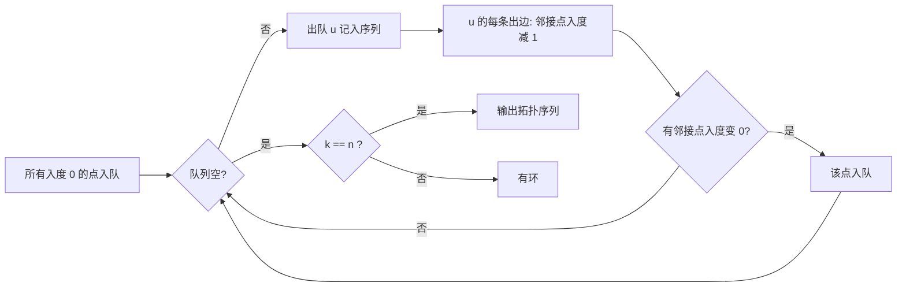
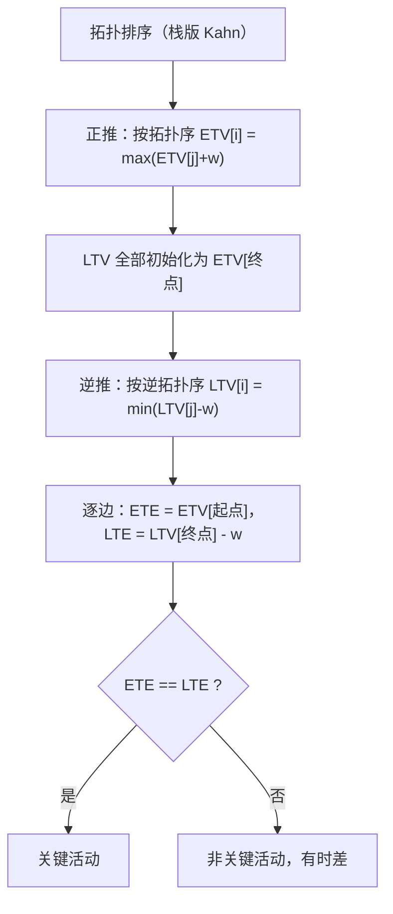

# 拓扑排序（含关键路径）

## 零、知识地图

```text
拓扑排序（含关键路径）
├── 1. 拓扑排序是什么 —— DAG、AOV 网、拓扑序列定义；序列不唯一、有环必无解
├── 2. Kahn 算法 —— 入度消元：入度 0 入队、出队消边、减到 0 入队，O(V+E)
├── 3. DFS 求拓扑序 —— 回溯入栈 + 三色标记，顺带解决有向图判环
├── 4. 真题 P1983 车站分级 —— 按题面规则建图，拓扑层级 = 最长链
├── 5. 真题 P1113 杂务 —— Kahn 顺带 DP：ed[y]=max(ed[y], ed[x]+t[y])
└── 6. 关键路径 —— AOE 网、ETV/LTV/ETE/LTE、关键活动判定（B 源重点）

学习顺序：1 → 2 → 3 → 4 → 5 → 6。理由：先立定义与图模型（1），再学两大实现（2、3），然后用两道真题把"建图 + 拓扑 + 顺带统计"的套路跑熟（4、5），最后升级到带权版本 AOE 网（6）——它内部用的正是知识点 2 的入度消元。
```

## 一、为什么需要它

先看你会怎么死在 A 源 slide 3 的例题 P1113 杂务上：n 项任务，每项有时长，某些任务必须在另一些全部完成之后才能开始；"互相没有关系的杂务可以同时工作"（A 源 slide 3 划重点原话），问做完所有任务最少要多久。暴力做法是枚举任务的执行全排列，逐个检查依赖是否满足——$n \le 10^4$ 时排列数是 $10^{40000}$ 量级，宇宙毁灭也算不完。**碰壁的根源：依赖关系是一张"网"，暴力在网里找顺序。**

破法是拓扑排序：把"任务"建成顶点、"先做什么"建成有向边，让图的结构自己把合法顺序吐出来，一次遍历 $O(V+E)$ 完成。本篇讲 6 个知识点：拓扑排序是什么（DAG 与 AOV 网）、Kahn 算法、DFS 求拓扑序、真题 P1983 车站分级、真题 P1113 杂务、关键路径（AOE 网）。顺序理由：定义（知识点 1）先于算法（知识点 2、3），板子（知识点 2）先于真题（知识点 4、5），无权的 AOV（知识点 5）先于带权的 AOE（知识点 6）。

## 二、知识点逐讲（每个知识点一节，共 6 节）

### 1. 拓扑排序是什么：DAG、AOV 网与拓扑序列

前置依赖：[[链表]]（下一节邻接表的存储基础）、有向图 basics（顶点、边、路径）
后续衔接：[[#2. Kahn 算法：入度消元]]、[[#3. DFS 求拓扑序与三色标记判环]]

**① 它解决什么问题**

B 源《拓扑排序》p1 的定义链：**DAG**（Directed Acycline Graph）是有向无环图——有方向、且沿箭头走不回原地。把"工程"抽象成图：**顶点表示活动、弧表示活动之间的优先关系**，这样的有向图叫 AOV 网（Activity On Vertex Network，B 源 p1；A 源 slide 1 复习区同款定义）。**拓扑序列**（A 源 slide 1）：顶点序列 $V_1, \ldots, V_n$ 满足若从 $V_i$ 到 $V_j$ 有路径，则序列中 $V_i$ 排在 $V_j$ 之前；**拓扑排序**就是构造这个序列的过程。关键性质：前提是 DAG（有环必无解，③给出原因）；结果一般不唯一（B 源 p2）；用邻接表实现时复杂度 $O(V+E)$（A 源 slide 2）。它解决"有先后约束时给全体元素排出合法顺序"这类问题。

**② 直觉理解**

模型级类比：**开学选课**。每门课有先修课，先修课没修完就不能选。排课表就是把所有课排成一列，保证任何一门课出现在它所有先修课后面。课程之间只约束"谁在谁前"，不约束"紧挨着谁"——所以合法课表有很多张。

用具体数字跑一遍：4 门课，边 $A \to B$、$A \to C$、$B \to D$、$C \to D$（$\to$ 表示"是先修课"）。$A$ 没有先修，排第一；$B$、$C$ 只依赖 $A$，可任意先后；$D$ 等 $B$、$C$ 都完成。于是 $A\ B\ C\ D$ 和 $A\ C\ B\ D$ 都合法，$B\ D\ C\ A$ 不合法（$B$ 的先修 $A$ 排在它后面）。

**③ 原理与推导**

为什么拓扑序列一般不唯一：定义只要求偏序关系（每条约束"前者在前"），没有约束没有关系的两门课之间的相对位置，交换它们仍满足全部约束（B 源 p2 明确说明不唯一，A 源 slide 2 的示例也给出两组不同输出 `0 1 2 3 5 4 6 7` 与 `7 6 4 5 3 2 1 0`）。

为什么有环必无解：设环 $x_1 \to x_2 \to \cdots \to x_k \to x_1$。若拓扑序列存在，看环上第一个出现在序列中的顶点 $x_i$——它的环内前驱 $x_{i-1}$ 还排在它后面，但 $x_{i-1}$ 到 $x_i$ 有路径，按定义应排在前面，矛盾。所以序列存在当且仅当图为 DAG。这个"当且仅当"是知识点 2 判环原理的根。

设计动机：为什么不干脆按任务编号从小到大做？因为编号是人为标签，优先关系是任意网状结构——编号小的完全可能依赖编号大的（P1113 官方样例里任务 7 依赖任务 6）。必须让"关系"而不是"标签"决定顺序，这就是把优先关系建模为有向边的原因。

**④ 代码演示**

概念性知识点，核心代码给"验证一个序列是否为拓扑序"的骨架（自编，对应本篇附录 B-5 断言程序 verify_seq.cpp 的核心；复杂度 $O(n+m)$）：

```cpp
bool checkSeq(int n, int m, int eu[], int ev[], int seq[]) {
    // eu/ev 存边（u->v），seq 是待验证序列；返回是否合法
    static int pos[1005];
    static bool seen[1005];
    for (int i = 0; i < n; i++) {          // 边界：先验证它是 1..n 的排列
        if (seq[i] < 1 || seq[i] > n || seen[seq[i]]) return false;
        seen[seq[i]] = true;
        pos[seq[i]] = i;                   // pos[x]：顶点 x 在序列中的位置
    }
    for (int i = 0; i < m; i++)
        if (pos[eu[i]] >= pos[ev[i]]) return false;  // 错：出现 u 在 v 后
    return true;                           // 全部边满足"u 在 v 前"才合法
}
```

**执行追踪表**（课程例子：n=4，边 $A\to B, A\to C, B\to D, C\to D$ 编号为 1,2,3,4，候选序列 `1 2 3 4`）：

| 步骤 | 当前元素 | 结构状态 | 动作 | 结果 |
|:---:|:---:|:---|:---|:---|
| 1 | seq=1,2,3,4 | pos=[-,0,1,2,3] | 无重复、无越界，记录位置 | 排列检查通过 |
| 2 | 边 1→2 | pos[1]=0 < pos[2]=1 | 检查边序 | 通过 |
| 3 | 边 1→3 | pos[1]=0 < pos[3]=2 | 检查边序 | 通过 |
| 4 | 边 2→4 | pos[2]=1 < pos[4]=3 | 检查边序 | 通过 |
| 5 | 边 3→4 | pos[3]=2 < pos[4]=3 | 检查边序 | 通过，序列合法 |

**错误写法对照**（验证逻辑最常见的两个坑）：

```diff
- if (pos[eu[i]] >= pos[ev[i]]) return false;   // 这行是对的
- // 坑1：只检查"有直接边"的顶点对，漏掉"有路径"的间接约束——
- //   例如边 1→2、2→4，序列 1 4 2 中 1 在 2 前、2 在 4 前，
- //   直接边检查全过，但 1 到 4 有路径，1 却排在 4 前？不：pos[1]=0 < pos[4]=1 通过。
- //   真正出错的是序列 2 1 4：边 1→2 检查失败才拦住。逐边检查依据的是"定义里的路径约束
- //   已被边约束的传递性覆盖"——u→w 与 w→v 两条边共同保证 u 在 v 前，所以逐边检查是对的；
- //   若只抽查部分边（如只查入度非零的点）就会漏
- if (只检查部分边) ...   // 坑2：漏边 → 检查通过但序列实际非法（答案错）
+ for (int i = 0; i < m; i++)   // 对：每条边都验一遍，一条不漏
```

**⑤ 典型应用**

- 真题：洛谷 P1113 杂务（A 源 slide 3-4 例题，题号真实），知识点 5 全流程实战。
- 真题：洛谷 P1983 车站分级（NOIP2013 普及组 T4，A 源 slide 5 例题），知识点 4。
- 迁移题：给出一份课表，判断它是否满足全部先修关系（题面：n 门课 m 条先修关系，输出合法/不合法。数据范围 $n, m \le 10^5$。题解即④骨架：记录每门课位置后逐边检查）。标注：自编。

**⑥ 坑点与边界**

> **【易错】** 把拓扑序列当成唯一的。两个没有约束关系的元素顺序任意，多解时 OJ 若要求输出"字典序最小"需改用小根堆的 Kahn（本篇不展开，标注：延伸）。

> **【易错】** 在有环图上硬求拓扑序。结论"有环必无解"来自③的推导，环检测的具体实现见知识点 2、3。

> **【注意】** 无向图没有拓扑排序：定义里的"路径在前"依赖边的方向，A 源 slide 1 明确写"有向图"。

> [!example]-
> **边界数据集（先自己跑一遍，再展开对照）**
> 1. 空输入：n=0、无边 → 空序列就是合法拓扑序（语义：没有活动就没有约束，输出为空、不崩溃）。
> 2. 单元素：n=1、无边 → 序列就是它自己，检查直接通过。
> 3. 环检测：n=2、边 1→2 与 2→1 → 任何排列都违反其中一条边的约束（`2 1` 时边 1→2 失败，`1 2` 时边 2→1 失败），checkSeq 返回 false——环下无合法序列。
> 4. 严格递增：链 1→2→3→…→n → 唯一拓扑序 `1 2 … n`，递增排列通过、其他排列失败（预期：唯一性）。
> 5. 严格递减：链 n→n-1→…→1 → 唯一拓扑序是递减排列（预期：方向由边决定，与数值大小无关）。
> 6. 极值：n=10^5、m=10^5，pos/seen 数组开 10^5+5 → 全程 O(n+m)，int 不溢出；若把 pos 开成 10^4 就是数组开小 RE（预期：注意数组上限）。

回扣开场：暴力枚举 $10^{40000}$ 个排列的根因是"顺序必须满足网状约束"——现在你知道这个约束就是拓扑序列的定义，接下来看图怎么把序列"算"出来。

### 2. Kahn 算法：入度消元

前置依赖：[[#1. 拓扑排序是什么：DAG、AOV 网与拓扑序列]]、[[栈与队列]]（队列的 FIFO 操作）、[[链表]]（链式前向星存图）
后续衔接：[[#4. 真题 P1983 车站分级]]、[[#5. 真题 P1113 杂务]]、[[#6. 关键路径：AOE 网与最早最晚时间]]

**① 它解决什么问题**

Kahn 算法（A 源 slide 1：基于 BFS）是拓扑排序的第一种实现。流程四句话（A 源 slide 3 步骤；B 源《拓扑排序》p11-13 用栈版演示同一套步骤）：把所有入度为 0 的顶点入队；队首出队并记入拓扑序列；把它每条出边的邻接点入度减 1；入度减到 0 的顶点入队。重复直到队列空。**入度**是一个顶点被多少条边指向（B 源 p11：顶点的入度）。复杂度 $O(V+E)$（A 源 slide 2）；附加能力：结束时不入队的顶点数 $n-k>0$ 就是环的证据，算法自带判环。

**② 直觉理解**

模型级类比：**拆快递箱**。每个箱子被若干封条压住（入度），封条全撕掉才能开箱；开箱后把它压着的别的箱子上的封条顺手撕掉。随时可开的箱子就是入度 0 的箱子，开箱顺序就是一个拓扑序。

用具体数字跑一遍（Kahn模板.cpp 文件尾注释的样例，n=5）：边 $1\to2$、$2\to4$、$3\to2$、$3\to4$、$4\to5$。入度：1 为 0、2 为 2、3 为 0、4 为 2、5 为 1。1 和 3 先入队——它们没有前置。

**③ 原理与推导**

正确性分两步。第一，入度 0 的点没有前驱，放序列最前不违反任何约束；删掉它之后，剩余图仍是 DAG（删点和边不会产生新环）。第二，归纳：剩余图上继续做同样的事，得到的序列接在后面仍合法。把两步连起来：算法每一步都在"剥离一个无前驱的点"，剥离顺序天然满足所有边约束。

为什么 k<n 就有环：正常结束时 n 个点全被剥光；若提前结束，剩下的点入度全部大于 0——每个点都有未删的前驱。从任一剩余点沿入边往前走，顶点有限，必有点被重复经过，这条回路就是环。这正是知识点 1"当且仅当 DAG"的算法化。

设计动机：为什么消元时"减 1"而不是"删边"？删边要改动邻接表结构，减 1 只动一个计数器，效果等价但常数更小；每条边在起点出队时被消费恰好一次，加上每点入队出队各一次，总代价 $O(V+E)$——这就是复杂度上限的来源。为什么用队列：FIFO 保证"就绪层"整体先于下一层处理；用栈（B 源 TopoSort.c 的做法）或任意集合同样正确，只是输出的序列不同（A-3 冲突登记 1）。



文字版推导链：初始把所有"无前置"的点放进队列 → 每次取出一个点记入序列 → 它的出边全部"注销"（邻接点入度减 1）→ 有点被减到 0 就补进队列 → 队列空时看计数：n 个点全出来就成功，差几个就说明差的点卡在环里。

**④ 代码演示**

取自源文件 Kahn模板.cpp（改动：删除头文件区多余的 include 与宏、删除文件尾注释样例外的无关行；核心逻辑逐行原样）：

```cpp
#include <iostream>
#include <cstring>
#include <queue>
using namespace std;
int n, m;
struct edge { int to, next; } e[10005];   // 链式前向星：to 终点，next 上一条边
int h[105], ind[105], cnt;                // h[u]：u 的边链表头；ind：入度
int topo[105], k = 0;
void add(int u, int v) {                  // C 等价：e[cnt]=(edge){v,h[u]}; h[u]=cnt++;
    e[cnt].to = v; e[cnt].next = h[u]; h[u] = cnt++;
}
bool kahn() {
    queue<int> q;                         // C 等价：int q[105], head=0, tail=0;
    for (int i = 1; i <= n; i++)
        if (ind[i] == 0) q.push(i);       // 所有入度 0 的点入队
    while (!q.empty()) {
        int x = q.front(); q.pop();       // 出队队首
        topo[++k] = x;                    // 记入拓扑序列
        for (int i = h[x]; ~i; i = e[i].next) {   // ~i 等价 i != -1
            int y = e[i].to;
            ind[y]--;                     // 消边：入度减 1
            if (ind[y] == 0) q.push(y);   // 减到 0 才入队，且只入一次
        }
    }
    return k == n;                        // 全部出队 = 无环；否则有环
}
int main() {
    cin >> n >> m;
    memset(h, -1, sizeof(h));             // 边界：头指针必须初始化为 -1
    for (int i = 1; i <= m; i++) {
        int u, v; cin >> u >> v;          // u--->v
        add(u, v); ind[v]++;
    }
    if (kahn())
        for (int i = 1; i <= k; i++) cout << topo[i] << ' ';
    else cout << "有环\n";
    return 0;
}
```

**执行追踪表**（上例 n=5，入度初始 [0,2,0,2,1]，实测输出 `1 3 2 4 5`）：

| 步骤 | 当前元素 | 结构状态 | 动作 | 结果 |
|:---:|:---:|:---|:---|:---|
| 1 | 入队 1、3 | ind=[0,2,0,2,1] q={1,3} | 初始入队 | 就绪集合就位 |
| 2 | 出队 1 | q={3} topo=[1] | 边 1→2：ind[2] 减 1 | ind[2]=1 |
| 3 | 出队 3 | q={} topo=[1,3] | 边 3→2：ind[2]=0 入队；边 3→4：ind[4]=1 | q={2} |
| 4 | 出队 2 | q={} topo=[1,3,2] | 边 2→4：ind[4]=0 入队 | q={4} |
| 5 | 出队 4 | q={} topo=[1,3,2,4] | 边 4→5：ind[5]=0 入队 | q={5} |
| 6 | 出队 5 | q={} topo=[1,3,2,4,5] | 无出边；k=5==n 判定无环 | 输出 1 3 2 4 5 |

**错误写法对照**：

```diff
- ind[y]--;   // 坑1：入度减 1 后忘了检查，也没有 if(ind[y]==0) q.push(y)
- // 后果：入度归零的点永远进不了队列 → 队列提前空 → k<n → 无环图被误报"有环"（答案错）
+ ind[y]--;
+ if (ind[y] == 0) q.push(y);   // 减到 0 才入队；一个点恰好入队一次
- for (int i = h[x]; i != 0; i = e[i].next)   // 坑2：终止条件写成 i != 0
+ for (int i = h[x]; ~i; i = e[i].next)   // 头指针初始化为 -1，~(-1)==0 恰好终止；
+ // 写 i!=0 会把"空链表(头=-1)"当成死循环、把 0 号边误当有效边（RE 或答案错）
- if (ind[y] == 0) { q.push(y); q.push(y); }   // 坑3（示意）：重复入队
+ // 入度只在归零那一刻入队一次；重复入队会让序列重复、k>n 越界（RE）
```

**⑤ 典型应用**

- 真题：P1113 杂务（知识点 5）——Kahn 出队顺序上顺带做 DP，一套代码两层用途。
- 真题：P1983 车站分级（知识点 4）——建图后 Kahn 求最长链（层级）。
- 迁移题：验证 DFS 输出的序列是否合法拓扑序（把输出喂给知识点 1④ 的 checkSeq）。标注：自编，已在附录 B-5 实测。

**⑥ 坑点与边界**

> **【易错】** 忘记 `memset(h, -1, sizeof(h))`。全局数组初值为 0，0 号边被误认为有效头指针，遍历出垃圾边（答案错或 RE）。正确写法见④，`~i` 终止条件与 -1 必须配套。

> **【易错】** 判环条件写成 `k <= n` 之外的变体（如判队列空就报环）。队列空是正常结束信号，判据只有一个：出队计数 k 是否等于 n。

> **【注意】** 邻接表头插法使出边遍历顺序与加边顺序相反，同一个图可输出多个不同拓扑序（B 源《关键路径》p8 的出队序列 V1 V4 V6 V3 V2 V5 V8 V7 V9 与本文知识点 6 的序列就不同，但都合法）——对拍时验证合法性，不要逐字符比对。

> [!example]-
> **边界数据集（先自己跑一遍，再展开对照）**
> 1. 空输入：n=0, m=0 → 初始队列空，k=0==n，输出空序列（预期：空输出、不崩溃）。
> 2. 单元素：n=1, m=0 → 顶点 1 入度 0 直接出队，输出 `1`。
> 3. 环检测：n=3, 边 1→2、2→3、3→1 → 初始无入度 0 的点，队列空，k=0≠3，输出"有环"（实测一致，附录 B-5）。
> 4. 严格递增：链 1→2→…→5 → 每次只有一个入度 0 的点，序列唯一 `1 2 3 4 5`。
> 5. 严格递减：链 5→4→…→1 → 同理唯一 `5 4 3 2 1`（预期：方向跟边走）。
> 6. 极值：n=10^4 条链 + 边数 10^6 量级（P1113 规模）→ O(V+E) 瞬间完成；数组 e 按边数上限开，ind/h 按点数上限开，开小即 RE（预期：注意 1000005 这类边数组常量）。

回扣开场：P1113 的"谁先做"问题，现在你知道用入度消元让图自己吐出顺序——但题目还要算最短工期，下一节先补上 DFS 这把并行工具，再回 P1113 收网。

### 3. DFS 求拓扑序与三色标记判环

前置依赖：[[#2. Kahn 算法：入度消元]]、[[二叉树竞赛篇]]（DFS 递归与回溯框架）
后续衔接：[[#6. 关键路径：AOE 网与最早最晚时间]]（AOE 网求 LTV 需要逆拓扑序，DFS 栈可直接给出）

**① 它解决什么问题**

拓扑排序的第二种实现（A 源 slide 2）：DFS 遍历图，**回溯时把顶点入栈**——第一个入栈的顶点必定出度为 0（它的所有后继都先于它入栈），最后把栈自顶向下输出，即得拓扑序列。同一个 DFS 顺带解决**有向图判环**：给顶点三色标记，`vis=0` 未走过、`vis=2` 正在遍历该点及其后续（在本轮递归链上）、`vis=1` 该点及其后续全部访问完（A 源 slide 2 三色定义）。访问中遇到 `vis[y]==2` 的邻接点 y，说明 y 还在当前递归链上，而 x 又能走到 y——构成环。复杂度 $O(V+E)$（A 源 slide 2）。

**② 直觉理解**

模型级类比：**项目收尾打卡**。每个人离场前先等自己的全部下游收尾；只有下游全打卡了，自己才打卡离场。最后按打卡时间倒序看：先打卡的是最末端的活，后打卡的是最源头的活——倒过来就是开工顺序。

用具体数字跑一遍：对知识点 2 同一张 DAG（边 $1\to2$、$2\to4$、$3\to2$、$3\to4$、$4\to5$），从 1 开始 DFS，5 最先回溯入栈，最后输出 `3 1 2 4 5`（实测，附录 B-5）——与 Kahn 的 `1 3 2 4 5` 不同但都合法，再次印证知识点 1 的"序列不唯一"。

**③ 原理与推导**

为什么回溯序的逆序是拓扑序：顶点 x 回溯入栈的那一刻，x 的每条出边邻接点都已访问完毕（要么递归下钻回来了，要么早已完结）。所以栈里 x 的所有后继都在 x 的下方（更早入栈），弹出时后继先出、x 后出——每条边 u→v 都满足"v 先于 u 弹出"，弹出序列恰好反向满足全部约束。

为什么 `vis[y]==2` 判环是对的：`2` 只在"从当前递归链的祖先进入、尚未回溯"时存在。x 看到 vis[y]==2，说明 y 是 x 当前链上的祖先且 x 可达 y——沿递归链从 y 走到 x 再走边 x→y，是一个真正的回路。为什么两色不够：只有 0/1 时，无法区分"y 正在我的递归链上"和"y 只是之前从别的分支访问完"——前者是环，后者不是（叫交叉边），把交叉边当环会误报。设计动机：三色的代价只是把一个 int 数组的取值从 2 种放宽到 3 种，却换来判环能力，这是竞赛里最省事的有向图判环方案。

**④ 代码演示**

取自源文件 DFS求拓扑序列模板.cpp（改动：删除多余 include 与宏；核心逻辑逐行原样）：

```cpp
#include <iostream>
#include <cstring>
#include <stack>
using namespace std;
int n, m;
struct edge { int to, next; } e[10005];
int h[105], cnt, vis[105];
int flag = 0;                 // 判环标记
stack<int> topo;              // C 等价：int stk[105], top=0;
void add(int u, int v) { e[cnt].to = v; e[cnt].next = h[u]; h[u] = cnt++; }
void DFS(int x) {
    vis[x] = 2;               // 第一次走到：标记"在当前递归链上"
    for (int i = h[x]; ~i; i = e[i].next) {
        int y = e[i].to;
        if (vis[y] == 2) { flag = 1; return; }   // y 在链上 → 有环
        else if (vis[y] == 0) {
            DFS(y);           // 未访问：下钻
            if (flag == 1) return;               // 环已发现，逐层退出
        }
    }
    topo.push(x);             // 回溯时入栈：所有后继已处理完
    vis[x] = 1;               // x 及其后续全部访问结束
}
int main() {
    cin >> n >> m;
    memset(h, -1, sizeof(h));
    for (int i = 1; i <= m; i++) { int u, v; cin >> u >> v; add(u, v); }
    for (int i = 1; i <= n; i++)
        if (vis[i] == 0) DFS(i);   // 边界：非连通图要对每个未访问点出发
    if (flag == 1) cout << "有环\n";
    else {
        while (!topo.empty()) { cout << topo.top() << ' '; topo.pop(); }
    }
    return 0;
}
```

**执行追踪表**（同知识点 2 的 DAG；头插法使 3 的出边链为 [4,2]；实测输出 `3 1 2 4 5`）：

| 步骤 | 当前元素 | 结构状态 | 动作 | 结果 |
|:---:|:---:|:---|:---|:---|
| 1 | DFS(1) | vis=[2,0,0,0,0] | 标 2；沿边 1→2 下钻 | 递归挂起 |
| 2 | DFS(2) | vis=[2,2,0,0,0] | 沿边 2→4 下钻 | 挂起 |
| 3 | DFS(4) | vis=[2,2,0,2,0] | 沿边 4→5 下钻 | 挂起 |
| 4 | DFS(5) | vis=[2,2,0,2,2] | 无出边，5 入栈、vis[5]=1 | 栈 [5] |
| 5 | 回 4 | vis[4]=1 | 4 入栈 | 栈 [5,4] |
| 6 | 回 2、回 1 | vis=[1,1,0,1,1] | 2、1 依次入栈 | 栈 [5,4,2,1] |
| 7 | DFS(3) | vis=[1,1,2,1,1] | 出边邻接点 4、2 均为 1，跳过 | 无环 |
| 8 | 3 回溯 | vis=[1,1,1,1,1] | 3 入栈 | 栈 [5,4,2,1,3] |
| 9 | 弹栈 | 顶到底 3,1,2,4,5 | 逐个弹出输出 | 输出 3 1 2 4 5 |

**错误写法对照**：

```diff
- if (vis[y] == 1) { flag = 1; return; }   // 坑1：把"已完结"也当环报
+ if (vis[y] == 2) { flag = 1; return; }   // 只有"在当前链上"(2)才是环；
+ // vis[y]==1 是之前分支访问完的交叉边，正常跳过——两色不够的原因就在这
- for (int i = 1; i <= n; i++) DFS(i);   // 坑2：不从 vis==0 的点出发
+ for (int i = 1; i <= n; i++) if (vis[i] == 0) DFS(i);
+ // 非连通图（森林）必须每个未访问点各出发一次，否则只得到一棵树的序
- cout << topo.pop();   // 坑3（示意）：想按入栈顺序输出
+ while (!topo.empty()) { cout << topo.top() << ' '; topo.pop(); }
+ // 必须自顶向下（后进先出）弹出，取的是回溯序的逆序
```

**⑤ 典型应用**

- 真题：有向图判环类题（三色 DFS 是标准解法，A 源 slide 2 后半整段讲"DFS 算法如何判环"）。
- 真题：知识点 6 的关键路径——求 LTV 需要"逆拓扑序"，DFS 的栈自顶向下弹出即拓扑序、栈底到顶即逆拓扑序，两个方向都现成。
- 迁移题：把 Kahn 与 DFS 对同一张图输出的两个序列分别喂给知识点 1④ 的 checkSeq，验证都合法（已在附录 B-5 实测通过）。标注：自编。

**⑥ 坑点与边界**

> **【易错】** 递归深度失控。链状图 1→2→…→10^5 会让 DFS 递归 10^5 层，默认栈空间下有爆栈风险——大 n 场景优先用 Kahn（迭代，无此风险）。

> **【易错】** flag 置 1 后忘记逐层 return。不立刻返回的话 DFS 会继续访问环外部分，浪费时间但不影响正确性；若后续又有 vis==2 的访问覆盖判断，逻辑会乱——发现环就层层退出（④原样处理）。

> **【注意】** A 源 slide 2 原话"先入栈的顶点必定入度不为 0"是对该图例的描述，一般结论是"先入栈的顶点出度为 0、自顶向下弹出后排在最前"——理解机制比背图例重要。

> [!example]-
> **边界数据集（先自己跑一遍，再展开对照）**
> 1. 空输入：n=0 → 外层循环零次，栈空，无输出（预期：空输出、不崩溃）。
> 2. 单元素：n=1, m=0 → DFS(1) 直接入栈，输出 `1`。
> 3. 环检测：n=3, 边 1→2、2→3、3→1 → DFS(1) 下钻到 3 时，3 的出边邻接点 1 为 vis==2，报环（实测一致，附录 B-5）。
> 4. 严格递增：链 1→2→…→5 → 5,4,3,2,1 依次入栈，弹出输出 `1 2 3 4 5`（预期：与 Kahn 一致）。
> 5. 严格递减：链 5→4→…→1 → 输出 `5 4 3 2 1`（预期：方向跟边走）。
> 6. 极值：10^5 长链 → 递归 10^5 层贴爆栈线，换 Kahn 版本更稳（预期：防 RE）。

回扣开场：两大实现都到手了。Kahn 给"就绪层"顺序，DFS 给"回溯逆序"，且都自带判环——现在能解决 P1113 的"排顺序"了，还差"算工期"，知识点 5 完成合体。

### 4. 真题 P1983 车站分级：按题面规则建图

前置依赖：[[#2. Kahn 算法：入度消元]]、[[枚举与模拟]]（按题面规则枚举建边）
后续衔接：[[#5. 真题 P1113 杂务]]（同为"建图 + Kahn + 顺带统计"套路）

**① 它解决什么问题**

洛谷 P1983（NOIP2013 普及组 T4，题号真实；A 源 slide 5 例题）：一条单向铁路 n 个站，m 趟车次；若某趟停靠了站 x，则始发站与终点站之间所有级别大于等于 x 的站都必须停靠。推算 n 个站至少分几个级别。A 源 slide 5 两个核心推论：**停靠站的级别都要大于等于（始发终点间）未停靠的最小级别；未停靠站的级别低于停靠站**。于是建图：对每趟车，枚举区间 [s1, sn] 内每个未停靠站 j，连边 j → 每个停靠站（"j 的级别低，停靠站的级别高"）；最后答案 = 从入度 0 的点出发的**最长路径**长度（A 源 slide 5"求出最长的路径，即为至少要分的级数"）。数据范围 $n, m \le 1000$。

**② 直觉理解**

模型级类比：**公司职级**。每趟车次是一条"晋升链"：停靠站是链上露脸的职级，被跳过的站级别必然更低。所有链叠在一起，答案就是"从最低爬到最高最少要几级"——即约束图里最长的一条递升链。

用具体数字跑一遍（官方样例 1：n=9, m=2，第一趟停靠 1 3 5 6，第二趟停靠 3 5 6）：第一趟枚举区间 [1,6]，未停靠的是 2、4，各连向 1、3、5、6；第二趟枚举 [3,6]，未停靠的 4 连向 3、5、6（与第一趟重复的边被去重）。层级：2、4 是第 1 层，1、3、5、6 是第 2 层，7、8、9 无约束（第 1 层）→ 答案 2（实测，附录 B-5）。

**③ 原理与推导**

为什么答案是最长链：把"级别"看成 le 值，每条边 u→v 要求 le[u] < le[v]，最少级数就是把顶点分成尽量少的层、每层内任意、层间沿边递升——层号的最大值正好由"沿边每次 +1 能走的最远距离"决定，即最长链的顶点数。Kahn 的变体（出队时 `le[y]=max(le[y], le[x]+1)`）恰好按拓扑顺序计算这个量：x 出队时 le[x] 已是最终值，所有入边都消费完了。

设计动机：为什么必须去重建边（源码 pd[i][j] 数组）？同一条边 j→s 若被两趟车各建一次，ind[s] 就被多加一次；s 的其他入边消完后 ind[s] 仍是正数，永远达不到 0、永远不入队——k<n，算法把无环图误判成有环。入度计数与实际边数必须一一对应，这是去重的根因。为什么枚举范围是 [s1, sn] 而不是 [1, n]：题面只保证始发站与终点站**之间**的停靠约束，区间外的站不受这趟车约束，多连边会引入不存在的约束（答案错）。

**④ 代码演示**

取自源文件 P1983.cpp（改动：删除多余 include 与宏；核心逻辑逐行原样）：

```cpp
#include <iostream>
#include <cstring>
#include <queue>
#include <vector>
using namespace std;
int n, m;
vector<int> g[1005];          // C 等价：链式前向星 add(u,v) + 遍历 h[u]
int s[1005], flag[1005];      // s：停靠站表；flag：本趟停靠标记
int pd[1005][1005];           // pd[i][j]==1 表示边 i->j 已建过（去重）
int ind[1005], le[1005];      // le：层级（最长链长度）
void kahn() {
    queue<int> q;
    for (int i = 1; i <= n; i++)
        if (ind[i] == 0) { q.push(i); le[i] = 1; }   // 第 1 层
    while (!q.empty()) {
        int x = q.front(); q.pop();
        for (int i = 0; i < (int)g[x].size(); i++) { // C 等价：for(p=h[x];~p;p=e[p].next)
            int y = g[x][i];
            le[y] = max(le[y], le[x] + 1);   // 层级取 max：最长链
            ind[y]--;
            if (ind[y] == 0) q.push(y);
        }
    }
}
int main() {
    cin >> n >> m;
    for (int i = 1; i <= m; i++) {
        int sn; cin >> sn;
        memset(flag, 0, sizeof(flag));
        for (int j = 1; j <= sn; j++) { cin >> s[j]; flag[s[j]] = 1; }
        for (int j = s[1]; j <= s[sn]; j++) {        // 只枚举始发-终点之间
            if (flag[j] == 1) continue;              // 停靠站跳过
            for (int k = 1; k <= sn; k++)
                if (pd[j][s[k]] == 0) {              // 去重：这条边建过就跳过
                    g[j].push_back(s[k]);
                    pd[j][s[k]] = 1;
                    ind[s[k]]++;
                }
        }
    }
    kahn();
    int ans = -1;
    for (int i = 1; i <= n; i++) ans = max(ans, le[i]);
    printf("%d\n", ans);
    return 0;
}
```

**执行追踪表**（官方样例 1：n=9, m=2；第一趟停 1 3 5 6，第二趟停 3 5 6；实测输出 2）：

| 步骤 | 当前元素 | 结构状态 | 动作 | 结果 |
|:---:|:---:|:---|:---|:---|
| 1 | 第 1 趟 sn=4 | flag[1,3,5,6]=1 | 枚举 [1,6]：2、4 各连向 1,3,5,6 | 新边 8 条，ind[1,3,5,6] 各 +2 |
| 2 | 第 2 趟 sn=3 | flag=[3,5,6] | 枚举 [3,6]：4 连向 3,5,6 | pd 已标记，0 条新边 |
| 3 | Kahn 初始 | ind: 2=0,4=0,7=8=9=0 | 2,4,7,8,9 入队，le=1 | 队列 5 个点 |
| 4 | 出队 2 | le[2]=1 | le[1]=le[3]=le[5]=le[6]=2 | 一层抬升 |
| 5 | 出队 4 | le[4]=1 | 各 le 均已为 2，max 不变 | 稳定 |
| 6 | 汇总 | 7,8,9 出队无更新 | ans=max(le)=2 | 输出 2 |

**错误写法对照**：

```diff
- for (int j = 1; j <= n; j++)   // 坑1：枚举范围写成整条铁路 1..n
+ for (int j = s[1]; j <= s[sn]; j++)   // 只枚举始发站到终点站之间；
+ // 区间外的站不受本趟约束，多连边 = 编造约束（答案错）
- g[j].push_back(s[k]); ind[s[k]]++;   // 坑2：去重判断 pd[j][s[k]]==0 整段漏掉
+ if (pd[j][s[k]] == 0) { g[j].push_back(s[k]); pd[j][s[k]] = 1; ind[s[k]]++; }
+ // 重复边让 ind 虚高，该点永远入不了队，无环图被误判有环（答案错）——③的根因
- le[y] = le[x] + 1;   // 坑3：直接覆盖而不是取 max
+ le[y] = max(le[y], le[x] + 1);   // y 有多个前驱，取最长的那条链
```

**⑤ 典型应用**

- 真题：P1983 本题。官方样例 1 输出 2、样例 2 输出 3（均实测，附录 B-5；样例 2 数据 `9 3 / 4 1 3 5 6 / 3 3 5 6 / 3 1 5 9`）。
- 真题：NOIP 系列同套路题——"按题面规则建约束图 + 拓扑层级"是普及组高频组合（如信息传递类判环题，标注：延伸，题号不展开）。
- 迁移题：课程排布等级——n 门课 m 条先修关系，问最少分几批开课（每批内互不依赖）。题解：批号即 le 值，Kahn 取 max 转移，答案 max(le)。标注：自编。

**⑥ 坑点与边界**

> **【易错】** 建边方向反了（停靠 → 未停靠）。方向反后 le 的语义颠倒，max 链算出来的是"从高级往低级走"，答案数值上碰巧可能相同（层级数对称），但混用两种方向的代码会让后续维护与对拍混乱——一篇代码定死一个方向（A-3 冲突登记 2：A 源 slide 文字方向与源码实现方向相反，本篇按源码方向讲）。

> **【易错】** 忘记每趟车读入前 `memset(flag, 0, ...)`。上一趟的停靠标记残留，把不该连的站连上（答案错）。源码在每趟开头重置，照抄即可。

> **【注意】** pd 邻接矩阵占 $1005^2 \times 4$ 字节约 4MB，n≤1000 规模可承受；n 更大的题要换 set 或排序去重，内存会先爆。

> [!example]-
> **边界数据集（先自己跑一遍，再展开对照）**
> 1. 空输入：n=1, m=0 → 无约束，所有站第 1 层，输出 1（预期：最少 1 级）。
> 2. 单元素：n=1, m=1，趟车 `1 1`？sn≥2 不允许单站车——n=1 时无合法输入趟车，m=0 处理同上（预期：输出 1）。
> 3. 全相同：m 趟停靠集合完全相同 → 第 2 趟起全部被 pd 去重，图与一趟时相同（预期：答案稳定）。
> 4. 严格递增：每趟只停 {i, i+1} 递增铺开 → 链式约束，层级数 = n（预期：最长链拉满）。
> 5. 严格递减：一趟停 {9,8,…,1} 全站 → 无未停靠站、无边，输出 1（预期：全站同级）。
> 6. 极值：n=m=1000、每趟停 1000 站 → 建边枚举 O(m·n·sn)=10^9？不成立：sn≤n=1000，内层去重后每趟最多 n 条新边，总边数 O(m·n)，4MB 的 pd 兜底查重；int 层级最大 1000 无溢出（预期：卡常场景想清枚举量级）。

回扣开场：P1983 教会"把题面规则翻译成边"。下一道 P1113 把"翻译"再往前推一步——边权变成时间，Kahn 顺手算工期。

### 5. 真题 P1113 杂务：Kahn 顺带算工期

前置依赖：[[#2. Kahn 算法：入度消元]]、[[#4. 真题 P1983 车站分级]]（建图套路）
后续衔接：[[#6. 关键路径：AOE 网与最早最晚时间]]（把"完成时间"精细化到每个事件）

**① 它解决什么问题**

洛谷 P1113 杂务（A 源 slide 3 例题，题号真实）：n 项杂务，第 i 项耗时 $t_i$，有若干前置杂务；"互相没有关系的杂务可以同时工作"（A 源 slide 3 划重点），求完成全部杂务的最短时间。A 源 slide 4 的推导：设做杂务 x 前必须完成 a、b、c 且它们互不依赖——可同时做，则**开始做 x 的时间 = a、b、c 完成时间的 max，完成 x 的时间 = max + $t_x$**。数据 $n \le 10^4$。这就是 Kahn 的逐层 DP：`ed[y] = max(ed[y], ed[x] + t[y])`。

**② 直觉理解**

模型级类比：**等最慢的工友**。一件活在开工前要凑齐几道前置工序，工序并发进行，谁最慢就等谁——"等"就是取 max，"干完自己这活"就是加上 $t_y$。

用具体数字跑一遍（官方样例）：任务 1 耗时 5 无前置 → ed[1]=5；任务 2 耗时 2 前置 {1} → ed[2]=5+2=7；任务 4 耗时 6 前置 {1} → ed[4]=11；任务 5 耗时 1 前置 {2,4} → ed[5]=max(7,11)+1=12；任务 6 耗时 8 前置 {2,4} → ed[6]=19；任务 7 耗时 4 前置 {3,5,6} → ed[7]=max(10,12,19)+4=23。答案 23。

**③ 原理与推导**

为什么取 max 不取 sum：资源无限（题面保证工人够多），前置并发执行，唯一卡脖子的是最晚完成的那个——取 max；若资源有限要排工期的题，模型不同（延伸，不展开）。为什么 Kahn 转移顺序正确：x 出队时它的入度已减到 0，意味着**所有**指向 x 的边（全部前驱）都已消费过——ed[x] 不再变化，此刻用它更新后继是最终值。这正是拓扑序"前驱全在前"性质的直接红利。

A 源 slide 4 还给了 DP 直解版："任务 k 的前驱节点一定小于 k，所以读入时顺便从它的前驱里挑一个最大的转移即可"——题面保证前驱编号小于当前编号，按编号读入时前置的 ed 已全部算好，直接 `ans[i] = max(ans[t]) + l`，连建图和队列都省了。设计动机：两个版本一个通用（Kahn，不依赖编号性质）、一个极简（DP，吃题面保证）——看到"前驱编号更小"这类条件时优先想 DP 直解。

**④ 代码演示**

取自源文件 P1113.cpp（改动：删除多余 include 与宏；核心逻辑逐行原样）：

```cpp
#include <iostream>
#include <cstring>
#include <queue>
#include <cstdio>
using namespace std;
int n;
struct { int to, next; } e[1000005];   // 匿名结构体，C 等价：具名 struct Edge
int h[10005], cnt, ind[10005];
int t[10005];    // 每个点需要的时间
int ed[10005];   // 每个点的完成时间
void add(int u, int v) { e[cnt].to = v; e[cnt].next = h[u]; h[u] = cnt++; }
void kahn() {
    queue<int> q;
    for (int i = 1; i <= n; i++)
        if (ind[i] == 0) { q.push(i); ed[i] = t[i]; }   // 无前置：完成时间=耗时
    while (!q.empty()) {
        int x = q.front(); q.pop();
        for (int i = h[x]; ~i; i = e[i].next) {
            int y = e[i].to;
            ed[y] = max(ed[y], ed[x] + t[y]);   // 等最慢前驱 + 自己的耗时
            ind[y]--;
            if (ind[y] == 0) q.push(y);
        }
    }
}
int main() {
    scanf("%d", &n);
    memset(h, -1, sizeof(h));
    for (int i = 1; i <= n; i++) {
        int y, x; scanf("%d", &y);       // 杂务编号
        scanf("%d", &t[y]);              // 注意：不要同行读入（源码注释）
        while (1) { scanf("%d", &x); if (x == 0) break; add(x, y); ind[y]++; }
    }
    kahn();
    int ans = -1;
    for (int i = 1; i <= n; i++) ans = max(ans, ed[i]);
    printf("%d\n", ans);
    return 0;
}
```

DP 直解版取自源文件 `P1113 - DP版.cpp`（核心 6 行，改动：仅摘主循环；`scanf("%d",&i)` 读入的编号覆盖循环变量 i，是刻意利用"输入按编号 1..n 顺序给出"的题面性质）：

```cpp
for (int i = 1; i <= n; ++i) {
    scanf("%d", &i);          // 读入杂务编号，覆盖循环变量（题面保证按编号顺序）
    scanf("%d", &l);          // 该杂务耗时
    int tmp = 0;
    while (scanf("%d", &t) && t)   // 逐个读前置，直到 0
        tmp = max(ans[t], tmp);      // 前驱编号更小，ans[t] 已是最终值
    ans[i] = tmp + l;
    maxans = max(ans[i], maxans);
}
```

**执行追踪表**（官方样例 n=7，实测输出 23；队列只列关键出队）：

| 步骤 | 当前元素 | 结构状态 | 动作 | 结果 |
|:---:|:---:|:---|:---|:---|
| 1 | 入队 1（ind=0） | ed[1]=5 | 出边 1→2、1→4 | ed[2]=7 入队；ed[4]=11 入队 |
| 2 | 出队 2 | ed[2]=7 | 出边 2→3、2→5、2→6 | ed[3]=10 入队；ed[5]=8；ed[6]=15 |
| 3 | 出队 4 | ed[4]=11 | 出边 4→5、4→6 | ed[5]=max(8,12)=12 入队；ed[6]=max(15,19)=19 入队 |
| 4 | 出队 3 | ed[3]=10 | 出边 3→7 | ed[7]=14（ind[7] 还剩 2） |
| 5 | 出队 5 | ed[5]=12 | 出边 5→7 | ed[7]=max(14,16)=16（ind[7] 剩 1） |
| 6 | 出队 6 | ed[6]=19 | 出边 6→7 | ed[7]=max(16,23)=23 入队 |
| 7 | 出队 7 | ed[7]=23 | 无出边 | ans=23 |

**错误写法对照**：

```diff
- if (ind[i] == 0) { q.push(i); }   // 坑1：独立任务忘了 ed[i] = t[i]
+ if (ind[i] == 0) { q.push(i); ed[i] = t[i]; }
+ // ed 初值 0，不初始化的话无前置的任务完成时间算成 0，答案整体偏小（答案错）
- ed[y] = max(ed[y], ed[x] + t[y]);   // 这行是对的；坑2 是把它写成 sum 或漏 t[y]
- ed[y] = ed[y] + ed[x];   // 坑2（示意）：并发取 max 写成累加
+ ed[y] = max(ed[y], ed[x] + t[y]);   // 前置并发：等最慢的那个
- scanf("%d %d", &y, &t[y]);   // 坑3：把编号和耗时当一行两个数连读，
- // 然后还从同一行继续读前置——源码注释明确"注意：不要同行读入"，
- // 实际输入格式是每行"编号 耗时 前置... 0"，连读并不错，但混用 scanf 缓冲
- // 与题面换行习惯时容易把 0 吃进前置表（答案错）；逐字段读最稳
+ scanf("%d", &y); scanf("%d", &t[y]); while (scanf("%d", &x) && x) ...
```

**⑤ 典型应用**

- 真题：P1113 本题，官方样例输出 23（Kahn 版与 DP 版双实现均实测，附录 B-5）。
- 真题：P1983（知识点 4）——同为"建图 + Kahn + 顺带统计"三件套，统计量从 le 换成 ed。
- 迁移题：多阶段装配流水线——n 个零件 m 条装配依赖与各自工时，问总装完成时刻（与 P1113 完全同构，换场景不换代码）。标注：自编。

**⑥ 坑点与边界**

> **【易错】** 用了 DP 直解版却没核实"前驱编号一定更小"。这个性质是题面给的，不是拓扑排序的通性——换题若没有该保证，DP 直解会用到未算好的 ans[t]（答案错），必须回到 Kahn 版。

> **【易错】** 答案取 ed 的 max 写成取 ed[n]。最后的完成时刻不一定是编号 n 的任务（样例里恰好是任务 7 收尾，换个数据就不是），必须全表扫 max。

> **【注意】** 源码 P1113.cpp 的边数组开 1000005：n=10^4、每个任务前置最多 10^4 时理论上界是 10^8 条边，开不到——本题实际边数受输入行数限制，竞赛遇到类似题先估边数上限再定数组（防 MLE/RE）。

> [!example]-
> **边界数据集（先自己跑一遍，再展开对照）**
> 1. 空输入：n=0 → 主循环零次，ans 初值 -1 直接输出 -1？边界：建议按题面 n≥1 处理；代码层面无任务无输出语义（预期：与题面核对）。
> 2. 单元素：n=1，任务 `1 5 0` → ed[1]=5，输出 5。
> 3. 全相同：所有任务互为前置不可能成环（题面保证无环），"全相同"取 m 条任务全无前置 → 各自 ed=t[i]，ans=max(t)（预期：纯并发）。
> 4. 严格递增：链 1→2→…→7 顺序耗时 5,2,3,6,1,8,4 → ed 逐层累加 5,7,10,16,17,25,29（预期：串行累加）。
> 5. 严格递减：前置编号全部大于后继的输入不存在（违反题面性质），DP 版会算错——这正是坑 1 的实证（预期：DP 版失效、Kahn 版仍对）。
> 6. 极值：n=10^4 全串成链，总耗时 10^4 × 10^4=10^8 → int 上限 2.1×10^9 尚可容纳，但耗时再大一位就要 long long（预期：防溢出，sum/ed 类型跟着数据范围走）。

回扣开场：P1113 的最短工期算出来了——用的是知识点 2 的出队顺序（步骤 1-7）加"取 max"的并发语义。下一节把"完成时间"拆到每个事件上，就是关键路径。

### 6. 关键路径：AOE 网与最早最晚时间

前置依赖：[[#2. Kahn 算法：入度消元]]、[[#5. 真题 P1113 杂务]]（ed 的 max 转移）
后续衔接：[[栈与队列]]（B 源实现用栈做入度消元容器）

**① 它解决什么问题**

B 源《关键路径---课堂笔记》p1 定义链（术语以 B 源为准）：**AOE 网**（Activity On Edge）是用**边表示活动**的有向图，边权即活动所需时间，**顶点表示事件**——事件是"刹那间发生"的标志，它的发生标志某些活动开始、另一些结束；与 AOV 网（顶点表示活动）是一对镜像概念。AOE 网中活动可并行，从起点到终点有多条路径，**边权和最大的路径就是关键路径（Critical Path），其总时长就是工程工期；关键路径上的活动是关键活动**（B 源课堂笔记）。判定依据四个量（B 源课堂笔记，术语以 B 源为准）：**ETV**（事件的最早发生时间）、**LTV**（事件的最晚发生时间）、**ETE**（活动的最早开始时间）、**LTE**（活动的最晚开始时间）；**关键活动：ETE == LTE；非关键活动：ETE != LTE**。算法目标（B 源课堂笔记）：算出所有活动的 ETE 与 LTE，找全部关键活动。

**② 直觉理解**

模型级类比：**装修工期**。水电(6 天)、瓦工、油漆……有的工序卡着整条链（晚一天交付延一天），有的工序有富余（晚几天不耽误交付）。卡链的工序就是关键活动——想提前交付只能压缩它们。富余量就是 LTE 与 ETE 的差（时差）。

用具体数字跑一遍（B 源课堂笔记样例 AOE 网，也是源码 关键路径.c 的注释样例）：

```text
顶点(事件): A B C D E F G H Y      活动(边,时长): a1..a11
A --6--> B --1--> E --9--> G --2--> Y
A --4--> C --1--> E                E --7--> H --4--> Y
A --5--> D --2--> F --4--> H
```

关键路径 A-B-E-G-Y 与 A-B-E-H-Y，长度 $6+1+9+2 = 18$ 或 $6+1+7+4 = 18$（B 源《关键路径》p1 同款数字），工期 18。

**③ 原理与推导**

四步推导（B 源《关键路径》p2-p4 框架 + 课堂笔记公式，过程与数值按本样例实推）。

第一步，ETV 正推（基于拓扑序列）：事件必须等**所有**入边活动完成，所以取 max——起点 ETV[s]=0，$ETV[i] = \max(ETV[j] + w_{j,i})$（j 为 i 的前驱事件；课堂笔记公式原样）。样例：ETV[B]=6、ETV[C]=4、ETV[D]=5、ETV[E]=max(6+1, 4+1)=7、ETV[F]=7、ETV[G]=16、ETV[H]=max(7+7, 7+4)=14、ETV[Y]=max(16+2, 14+4)=18。

第二步，LTV 逆推（基于逆拓扑序列）：事件的最晚发生时间不能拖累任何后继，所以取 min——终点 LTV[e]=ETV[e]（终点最晚就是工期），$LTV[i] = \min(LTV[j] - w_{i,j})$（j 为 i 的后继）。样例：LTV[Y]=18、LTV[G]=16、LTV[H]=14、LTV[F]=10、LTV[E]=min(16-9, 14-7)=7、LTV[D]=8、LTV[C]=6、LTV[B]=6、LTV[A]=min(6-6, 6-4, 8-5)=0。

第三步，活动时间（B 源课堂笔记：**活动的最早开始时间 = 边起点事件的 ETV；活动的最晚开始时间 = 边终点事件的 LTV − 活动时长**）：ETE(a1)=ETV[A]=0、LTE(a1)=LTV[B]−6=0。

第四步，判定：ETE==LTE 即关键活动。为什么相等就是关键：时差为零，开工时刻没有任何浮动余地，晚一天工期晚一天——正是"卡链"的定义。为什么 ETV 取 max、LTV 取 min：max 是"全到齐才能开"，min 是"谁都不能拖"——两个方向对称，分别对应拓扑序与逆拓扑序两个计算方向。历史注（B 源《关键路径》p16）：关键路径法 1956 年提出，1957 年杜邦公司投资约 1000 万美元建立该方法用于工程管理，首轮应用即节省工期 4 天、约 100 万美元。

设计动机：为什么 ETV/LTV 建立在事件（顶点）上、ETE/LTE 却按活动（边）算？因为"等待"发生在事件处（汇聚所有入边），"富余"发生在活动上（单条边的调度空间）——顶点量先算好，边量只是查表加减，两层解耦（B 源《关键路径》p4 原话大意：先求顶点的 ETV 与 LTV，即可推出边的 ETE 与 LTE）。



文字版推导链：先跑一遍入度消元拿到拓扑序（顺带算出每个事件最早何时发生）→ 终点的最早时间就是工期，把它当所有人的"截止线"→ 从终点往回推：每个事件最晚几点必须发生才不拖累后继 → 顶点的两表齐了，每条活动边的最早最晚开始时间就是查表加减 → 最早等于最晚的活动零富余，即关键活动。

**④ 代码演示**

取自源文件 关键路径.c（改动：摘除手写链式栈的完整实现与 IO 细节，用文字注释标注栈操作；顶点沿用字符 A..Y；核心逻辑逐行原样；C 代码，g++ 按 C++ 编译通过）：

```cpp
// TotoSort（源码函数名照抄）：栈版入度消元 + 顺推 etv
void TotoSort() {
    Stack s = InitStack();
    for (int i = 1; i <= n; i++)
        if (ind[i] == 0) s = Push(s, i);      // 入度 0 入栈
    for (int i = 1; i <= n; i++) {
        u = GetTop(s); s = Pop(s);            // 栈顶出栈（此处信任输入无环，见⑥）
        topo[++k] = u;
        for (p = g[u].first; p != NULL; p = p->next) {
            v = p->adj;                       // u--->v
            ind[v]--;
            if (ind[v] == 0) s = Push(s, v);
            etv[v] = max(etv[v], etv[u] + (p->w));   // 顺推 etv：取 max
        }
    }
}
void CriticalPath() {
    int end = topo[k];                        // 拓扑序列最后一个 = 终点
    for (int i = 1; i <= n; i++) ltv[i] = etv[end];   // ltv 全部初始化为工期
    for (int i = k - 1; i >= 1; i--) {        // 逆拓扑序回推
        u = topo[i];
        for (p = g[u].first; p != NULL; p = p->next) {
            v = p->adj;
            ltv[u] = min(ltv[u], ltv[v] - (p->w));   // 逆推 ltv：取 min
        }
    }
    printf("关键活动有：\n");
    for (int i = 1; i <= n; i++)              // 枚举所有边
        for (p = g[i].first; p != NULL; p = p->next) {
            j = p->adj;                       // i------>j
            ete = etv[i];                     // 活动最早开始 = 起点事件最早
            lte = ltv[j] - (p->w);            // 活动最晚开始 = 终点事件最晚 - 时长
            if (ete == lte) printf("%c %c\n", g[i].data, g[j].data);
        }
}
```

**执行追踪表**（样例 AOE 网，9 顶点 11 活动；源码实测 ETV/LTV 与 B 源课堂笔记图上标注一致，附录 B-5）：

| 步骤 | 当前元素 | 结构状态 | 动作 | 结果 |
|:---:|:---:|:---|:---|:---|
| 1 | 出栈 A | etv 全 0 | A 出度为 0 入栈起点，etv[A]=0 | topo=[A] |
| 2 | 出栈 B | topo=[A,B] | 边 A→B(6) | etv[B]=0+6=6 |
| 3 | 出栈 C | topo=[A,B,C] | 边 A→C(4) | etv[C]=4 |
| 4 | 出栈 E | topo=[A,B,C,E] | 边 B→E(1)、C→E(1) | etv[E]=max(7,5)=7 |
| 5 | 出栈 G | 边 E→G(9) | etv[G]=16 | G 是 E 的最晚后继 |
| 6 | 出栈 D、F | 边 A→D(5)、D→F(2) | etv[D]=5, etv[F]=7 | 主链外分支 |
| 7 | 出栈 H | 边 E→H(7)、F→H(4) | etv[H]=max(14,11)=14 | topo 完成于 Y |
| 8 | 出栈 Y | etv[Y]=max(16+2, 14+4)=18 | 工期 18 | 逆推开始 |
| 9 | 逆推 H,F,D,G,E | ltv 初值全 18 | ltv[H]=14, ltv[F]=10, ltv[D]=8, ltv[G]=16, ltv[E]=min(7,7)=7 | 逐点回推 |
| 10 | 逆推 C,B,A | ltv[C]=6, ltv[B]=6 | ltv[A]=min(0,2,3)=0 | A 的 ltv=0 |
| 11 | 枚举 11 条边 | ete==lte 判定 | A-B、B-E、E-G、E-H、G-Y、H-Y 六条相等 | 输出 6 个关键活动 |

**错误写法对照**：

```diff
- for (int i = 1; i <= n; i++) ltv[i] = 0;   // 坑1：ltv 初始化成 0
+ for (int i = 1; i <= n; i++) ltv[i] = etv[topo[k]];   // 全部初始化为工期；
+ // 初始化成 0 后 min 递推全是 0，非关键活动也会被算成 ete==lte（答案错）
- ltv[u] = max(ltv[u], ltv[v] - (p->w));   // 坑2：逆推取 max
+ ltv[u] = min(ltv[u], ltv[v] - (p->w));   // 最晚时间取 min：谁都不能拖（③）
- lte = etv[j] - (p->w);   // 坑3：最晚开始时间用终点的"最早"etv
+ lte = ltv[j] - (p->w);   // 必须用终点的"最晚"ltv；用 etv 会把富余吃掉，
+ // 非关键活动被误判为关键活动（如 A-C：lte 应为 6-4=2 而非 4-4=0）
```

**⑤ 典型应用**

- 真题：本样例（B 源课堂笔记 + 源码注释样例，双源同图），源码实测输出关键活动 A B / B E / E H / E G / G Y / H Y 六对（附录 B-5）。
- 真题：工程工期类题在洛谷以 P1113（知识点 5）为代表；AOE 全量四表的板子题在常见教材配套 OJ 出现，本篇以源码样例为准（标注：资料未覆盖额外 OJ 题号，不编造）。
- 迁移题：给样例 AOE 网增加一条活动 I→Y(1)，重算工期与关键活动。题解：etv 不变（18 仍由 G/H 侧决定）、ltv[I]=17、新边 ete=17≠lte=17？I 无前驱需设 etv[I]——此题留作练习：先画图确认 I 的入边（建议先独立做，再对照：etv[I]=0，ete=0，lte=17，非关键；工期不变 18）。标注：自编。

**⑥ 坑点与边界**

> **【易错】** 源码 TotoSort 出栈前不判栈空：若输入含环，栈提前空时 GetTop 返回 -1，g[-1] 越界（RE）。教材语境默认 AOE 网合法无环；竞赛版要补 `if(栈空) break;` 加 `k!=n` 判环（与知识点 2 同款）。

> **【易错】** 多个汇点（出度 0 的顶点不止一个）时，`topo[k]` 只是其中一个，工期应取所有顶点 etv 的 max，ltv 也应统一初始化为该 max（源码样例单汇点，简化成立；通用版要扫 max，标注：资料未覆盖，属补充）。

> **【注意】** 边权为 0 的活动：ete==lte 恒成立（0 富余），会被判成关键活动——这是定义的自然结果，不是 bug；若题目另有约定按题面处理。

> [!example]-
> **边界数据集（先自己跑一遍，再展开对照）**
> 1. 空输入：n=0 → topo 空，topo[k] 越界——代码必须先判 n==0 直接返回（预期：空输出、不崩溃；暴露源码未做此检查）。
> 2. 单元素：n=1, m=0 → etv[1]=ltv[1]=0，无活动，无关键活动输出（预期：工期 0）。
> 3. 环检测：A→B(1)、B→A(1) → 无入度 0 顶点，栈空，源码越界；补判环后应报"无关键路径"（预期：AOE 有环则 ETV/LTV 无意义）。
> 4. 严格递增：单链 A→B→C→D→Y 权 1,2,3,4 → 每条边都是关键活动，工期 10（预期：全关键）。
> 5. 严格递减：链 Y→X→W… 权 4,3,2 → 同理全关键，方向不影响（预期：跟边走）。
> 6. 极值：11 条边权全 10000（源码 INF=10001 上限内）→ 工期总和最大 110000，int 无溢出；边权与边数再大时 etv/ltv 与工期总和改 long long（预期：防溢出）。

回扣开场：P1113 算的是"总工期"，关键路径把它拆到每个事件与活动——最早最晚时间一夹，谁卡链一目了然。现在你能解决开场那个"暴力枚举 $10^{40000}$ 个顺序"的问题了：建图、入度消元、max 转移、四表判定，四步收网。

## 三、全篇坑点总表

| # | 坑 | 正解 |
|---|-----|------|
| 1 | 邻接表忘 memset(h,-1) | 头指针初始化 -1，与 `~i` 终止配套（知识点 2④） |
| 2 | 入度减 1 后忘判 0 入队 | `if(ind[y]==0) q.push(y)`，一点只入一次 |
| 3 | 判环条件搞错 | 唯一判据：出队计数 k 是否等于 n |
| 4 | DFS 把 vis==1 当环 | 只有 vis==2（当前递归链上）才是环 |
| 5 | 非连通图只 DFS 一次 | 对每个 vis==0 的点各出发一次 |
| 6 | P1983 忘去重建边 | pd 数组标记，ind 与实际边数一致 |
| 7 | P1983 枚举范围写 1..n | 只枚举始发-终点区间 [s1, sn] |
| 8 | 层级/工期转移漏 max | le/ed 都是 `max(旧值, 前驱值+增量)` |
| 9 | P1113 独立任务忘 ed[i]=t[i] | 入度 0 入队时初始化完成时间 |
| 10 | ltv 初始化成 0 或逆推用 max | 初始化为工期 etv[终点]，逆推取 min |
| 11 | LTE 用终点 etv 计算 | LTE = 终点 ltv − 活动时长（B 源课堂笔记） |
| 12 | 关键路径出栈不判栈空 | 补栈空检查 + k!=n 判环（竞赛版） |

## 四、总结与自测

### 核心内容（一页纸速览）

- **拓扑排序**：DAG 上构造"有路径者前者在前"的序列；序列一般不唯一；有环必无解（知识点 1，A 源 slide 1、B 源 p1-2）。
- **Kahn 算法**：入度 0 入队、出队消边、减到 0 入队；$O(V+E)$；k==n 判无环（知识点 2，A 源 slide 1-3、B 源 p11-13）。
- **DFS 求拓扑序**：回溯入栈、自顶向下弹出；三色标记 vis 0/2/1，遇 2 即环；$O(V+E)$（知识点 3，A 源 slide 2）。
- **P1983 车站分级**：停靠站级别高于未停靠站，建边后拓扑层级 = 最长链，去重是命门（知识点 4，A 源 slide 5）。
- **P1113 杂务**：并发取 max——`ed[y]=max(ed[y], ed[x]+t[y])`；前驱编号更小时可 DP 直解（知识点 5，A 源 slide 3-4）。
- **关键路径**：AOE 网四量 ETV/LTV/ETE/LTE；ETV 顺推 max、LTV 逆推 min；ETE==LTE 即关键活动；术语与定义以 B 源课堂笔记为准（知识点 6）。

### 自测清单

- [ ] 能手推 n=5 样例的入度数组与 Kahn 每步队列变化（输出 1 3 2 4 5）
- [ ] 能解释"拓扑序列为什么一般不唯一、有环为什么必无解"
- [ ] 能默写三色标记含义并指出"遇到 vis==1 不能报环"的原因
- [ ] 能说清 P1983 去重建边不做会发生什么（ind 虚高误判环）
- [ ] 能手推 P1113 样例 ed 数组的全部更新并写出 23
- [ ] 能默写 ETV/LTV/ETE/LTE 四个定义并手推样例的 18 与 6 个关键活动
- [ ] 知道 Kahn 用队列、B 源用栈、DFS 用栈——容器不同只影响序列不正确性

### 错题登记

| 题号 | 错因 | 正解要点 |
|------|------|---------|
| （学完后填写） | | |

## 五、语法糖对照表

| 语法 | 等价 C 写法 | 一句话用途 |
|------|------------|-----------|
| `queue<int> q; push/front/pop/empty` | `int q[N], head, tail;` 数组队列 | Kahn 的就绪集合（知识点 2、4、5） |
| `stack<int> stk; push/top/pop` | `int stk[N], top;` 数组栈 | DFS 回溯收集与 B 源栈版 Kahn |
| `vector<int> g[N]; push_back/size` | 链式前向星 add + h[u] 遍历 | P1983 的存图 |
| `cin >> x; cout << y << '\n'` | `scanf("%d",&x); printf("%d\n",y);` | 流式 IO |
| `struct { int to, next; } e[N];` | `struct Edge { int to, next; }; struct Edge e[N];` | 匿名结构体（P1113） |
| `~i`（i 为 -1 时为 0） | `i != -1` | 链式前向星遍历终止条件 |
| `memset(h,-1,sizeof(h))` | `for(i..n) h[i]=-1;`（或 string.h） | 头指针初始化 |

## 附录（供验收，正文之外，不影响阅读）

### 附录 A　源文件覆盖对账

#### A-1 提取表

| 源文件 | 提取方式 | 完整性 |
| --- | --- | --- |
| 22.拓扑排序算法.pptx（A 源） | 文本层提取，存 提取文本\22.拓扑排序算法.txt（5 slides，META pics=0 chars=1702） | 文字完整；slide 1-2 有"算法流程/具体实现"字样但流程图以图片承载、pics=0 未随文本提取（图片计数可能有 zlib 误差，如实注明）；slide 2 两组示例输出 `0 1 2 3 5 4 6 7`/`7 6 4 5 3 2 1 0` 可读；对应图缺失，流程细节依据文字与源码重建 |
| 拓扑排序.pdf（B 源） | 文本层提取 14 页，存 提取文本\拓扑排序.txt（META pics=21 chars=2972） | 文本层乱码（字体编码缺映射，汉字多为私有区错字）；结构可辨：DAG/AOV/拓扑序列定义框架（p1-2）、拓扑序列不唯一（p2）、两种算法步骤（p2-13）、V1-V6 顶点例与入度数组、消元步骤序号（p11-13：入度 0 入栈、删除、邻接点入度减 1、减到 0 入栈）；具体图缺失，正文不引乱码细节，定义以 A 源与可读结构为准并登记缺口 |
| 关键路径.pdf（B 源） | 文本层提取 17 页，存 提取文本\关键路径.txt（META pics=38 chars=5442） | 文本层乱码；可辨认：ETV/LTV/ETE/LTE 缩写与中英定义框架、关键路径（Critical Path）、AOE/AOV 对比、样例数值 18 与 6+1+9+2、关键路径序列 V1,V2,V5,V7,V9、V1-V9/a1-a11 编号体系、1956/1957 杜邦历史段、正推 max/逆推 min 步骤（p5-8）；完整定义以课堂笔记版为准 |
| 关键路径---课堂笔记.pdf（B 源） | 文本层提取 1 页，存 提取文本\关键路径---课堂笔记.txt（META pics=34 chars=1099） | 完整可读：AOV/AOE/活动/事件定义、关键路径与关键活动、ETV/LTV/ETE/LTE 四式、ETV=max/LTV=min 公式、样例 AOE 网全部顶点标注（A:0/0 … Y:18/18）——本篇知识点 6 的主要知识依据 |
| Kahn模板.cpp | 全文直读（81 行） | 完整；链式前向星 + STL queue + k==n 判环 |
| DFS求拓扑序列模板.cpp | 全文直读（100 行） | 完整；三色标记 + 回溯入栈；文件尾注释样例本身含环（A-3 登记 3） |
| P1983.cpp | 全文直读（84 行） | 完整；邻接矩阵去重 + Kahn 层级 |
| P1113.cpp | 全文直读（82 行） | 完整；Kahn + ed 取 max |
| P1113 - DP版.cpp | 全文直读（21 行） | 完整；按编号直读 DP，scanf 覆盖循环变量为刻意写法 |
| TopoSort.c（B 源） | 全文直读（167 行） | 完整；手写链式栈 + 指针邻接表 + 字符顶点（A-3 登记 1） |
| 关键路径.c（B 源） | 全文直读（221 行） | 完整；栈版 Kahn 顺推 etv + 逆拓扑序回推 ltv + 关键活动枚举（A-3 登记 4） |

#### A-2 知识点总清单与依赖关系（6 对 6）

| 序号 | 知识点 | 对应源文件 | 优先级 |
|------|--------|-----------|--------|
| 1 | 拓扑排序是什么（DAG、AOV 网、拓扑序列） | 22.拓扑排序算法.txt slide 1 + 拓扑排序.txt p1-2（结构可辨） | P0 |
| 2 | Kahn 算法（入度消元） | slide 1-3 + 拓扑排序.txt p11-13 + Kahn模板.cpp + TopoSort.c | P0 |
| 3 | DFS 求拓扑序与三色判环 | slide 2 + DFS求拓扑序列模板.cpp | P0 |
| 4 | 真题 P1983 车站分级 | slide 5 + P1983.cpp | P0 |
| 5 | 真题 P1113 杂务（Kahn+DP） | slide 3-4 + P1113.cpp + P1113 - DP版.cpp | P0 |
| 6 | 关键路径（AOE 网四量与关键活动） | 关键路径.pdf + 关键路径---课堂笔记.pdf + 关键路径.c | P0 |

依赖关系：1 是 2、3 的定义基础；2 是 4、5、6 的算法骨架（6 内部就是栈版 Kahn）；4、5 是"建图+Kahn+顺带统计"的两次实战，5 的 ed 转移是 6 的 etv 前身。源文件 11 份全部入篇。

#### A-3 冲突与约定差异登记（4 项）

| 何处冲突 | 采信哪方 | 理由 |
| --- | --- | --- |
| Kahn 实现风格：A 源 Kahn模板.cpp 用 STL queue + 链式前向星，B 源 TopoSort.c 用手写链式栈 + 指针邻接表 + 字符顶点 | A 源竞赛风格为主线，B 源登记并存 | 容器（队列/栈/集合）只要求"存取入度 0 的点"，不影响正确性，只影响输出序列；竞赛以 STL 简洁写法为主，B 源是《数据结构》课风格 |
| P1983 建边方向：A 源 slide 5 文字为"停靠站指向非停靠站"，源码 P1983.cpp 为"非停靠站 j → 停靠站 s[k]" | 源码方向（非停靠 → 停靠） | 两种方向下"最长链顶点数"对称相等，官方样例双样例均实测通过；正文按源码方向讲，slide 文字方向登记 |
| DFS求拓扑序列模板.cpp 文件尾注释样例（边 1→2、2→4、4→3、3→2、4→5）本身含环 2→4→3→2，与"求拓扑序列"的用途矛盾 | 以实测为准：该输入输出"有环" | 注释数据有误；正文执行追踪表改用 Kahn模板.cpp 的无环样例（两模板共用同一 DAG 便于对照），差异在此登记 |
| 关键路径.c 的 TotoSort 出栈前不判栈空，GetTop 空栈返回 -1 导致 g[-1] 越界 | 教材语境可接受（默认输入无环），竞赛版必须补判 | 源码面向"合法 AOE 网"教学场景；正文知识点 6⑥ 登记为坑点并给出补法，不改写源码主体 |

### 附录 B　假设与缺口登记

- B-1 假设清单：学习者已掌握 C 语法（变量、循环、函数、数组、struct、指针、手写栈/队列）、[[二叉树竞赛篇]] 的 DFS 递归框架；[[栈与队列]]、[[链表]]、[[枚举与模拟]] 为库内已有笔记。C++ 特性（STL 容器、cin/cout、匿名结构体）按"没学过"处理，首现处附 C 等价写法。
- B-2 归属登记：图的概念、存储（邻接表/矩阵）与遍历的系统性讲解属同批待产出篇目 [[图的概念存储与遍历]]（同批，待产出），本篇仅在知识点 2④ 注释中交代链式前向星的最小必需用法。
- B-3 读取缺口：B 源拓扑排序.pdf（14 页）与关键路径.pdf（17 页）文本层乱码（字体编码缺映射）；乱码流中结构框架可辨但图全部缺失（pics=21/38 未随文本提取）。正文对这两份仅引用可辨认的结构与数值（入度消元步骤框架、ETV/LTV 公式、样例数值 18），完整定义改以课堂笔记版（完整可读）与 A 源为准。建议贴图位置：知识点 1（B 源 p1-2 的 DAG/AOV 示意图）、知识点 6（B 源《关键路径》p1 的 9 顶点 AOE 网）——验收时可对照原 PDF 补图。
- B-4 自补内容：知识点 1④ 的序列合法性检查骨架（自编）、知识点 3⑤ 迁移题、知识点 4⑤ 迁移题、知识点 5⑤ 迁移题、知识点 6⑤ 迁移题均为自编；1956/1957 历史数字转引自 B 源《关键路径》p16 乱码段中可辨认部分。
- B-5 编译验证记录：①素材 7 份源码 g++ -std=c++17 -O2 -fsyntax-only 全部 exit=0（Kahn模板 / DFS求拓扑序列模板 / P1983 / P1113 / P1113-DP版 / TopoSort.c / 关键路径.c，两份 .c 按 C++ 编译）。②断言实测（全部通过）：Kahn 与 DFS 对同一张 DAG（边 1→2、2→4、3→2、3→4、4→5）分别输出 `1 3 2 4 5` 与 `3 1 2 4 5`，经独立验证程序确认均为合法拓扑序（多解只验合法性）；两模板对环输入（1→2→3→1）均输出"有环"；P1983 官方样例 1 输出 2、样例 2 输出 3；P1113 官方样例 Kahn 版与 DP 版均输出 23；关键路径样例 ETV/LTV 数组与 B 源课堂笔记逐点一致（assert_etv 5 PASS / 0 FAIL），关键活动实测输出 A-B、B-E、E-H、E-G、G-Y、H-Y 六对。③断言程序自身曾有两处 bug（LTV 比较写在回推之前；PowerShell 重定向写出 UTF-16 导致验证程序读失败），修正后全过——教训：先核对断言程序自身，再下"素材有错"的结论。

### 附录 C　交付前自检清单

- [x] 附录 A 有逐份提取表（11 份）；总清单 6 条 = 正文知识点 6 节，编号一一对应
- [x] 每个知识点六步齐全，以问题开场、以回扣收尾
- [x] 无未解释的新术语；无"显然 / 易得 / 略"
- [x] 全文无 emoji
- [x] 同一引用块只有一个主标签；callout 声明行独占一行；标题不跳级；表格 ≤ 6 列
- [x] 代码均为 C++17 可编译（两份 .c 按 C++ 编译），例子用具体数字完整算过；代码改动已注明；迁移检验题已标注自编；真题题号 P1983 / P1113 真实存在
- [x] 关键结论已注明来源（A 源 slide N / B 源 p N）；不确定处已显式标注
- [x] frontmatter 六项齐全（tags / 优先级 / 掌握状态 / 最后复习日期 / 来源 / 生成日期）
- [x] 「零、知识地图」文本树在篇首；每个知识点有「前置依赖 / 后续衔接」两字段
- [x] ④节三块齐全：核心代码 + 执行追踪表（6 张）+ 错误写法对照（```diff）
- [x] ⑥节末尾有边界数据集（六类，含极值查溢出）；C++ 新特性首现处有 C 等价注释，篇末有语法糖对照表
- [x] mermaid 2 个（≤3）且均配文字版推导链
- [x] 双链只用库内真实笔记，库外篇目以文字锚定「（同批，待产出）」
- [x] 性质融入正文；每知识点含设计动机回答；类比均为模型级
- [x] 工程痕迹全部在附录，正文无验收类内容
