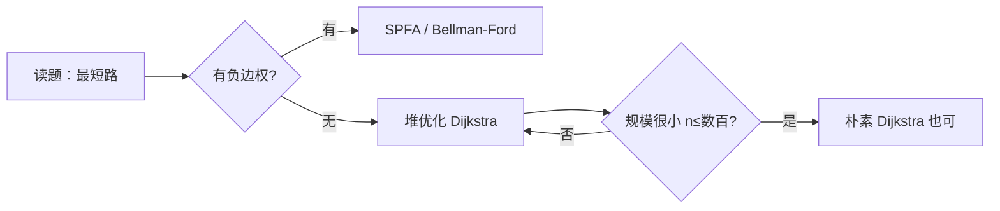

# 最短路选讲

## 零、知识地图

```text
最短路选讲（题型选讲篇：按"题型套路"组织，不是按算法罗列）
├── 1. 最短路五算法选型 —— 五算法复杂度与负权适用性对照 + 选型决策线（前置：图的概念存储与遍历、BFS）
├── 2. 建图变体：点权转边权 —— P8802 出差，隔离时间并入边权、终点减回（前置：知识点 1）
└── 3. 二分答案+最短路 —— P1462 通往奥格瑞玛的道路，最小化最大值、check 跑最短路（前置：知识点 1、二分）

学习顺序：1 → 2 → 3。理由：先选对工具（1），再学最轻量的建图变体（2），最后学双重算法嵌套（3）——工具、建图、嵌套，一级一个台阶。
```

## 一、为什么需要它

先用大概率碰壁的方式做一遍 P1462 通往奥格瑞玛的道路（洛谷）：每个城市有过路费，求"所经城市单次收费最大值"的最小值，还要带着血量走完。暴力做法是**枚举每一个可能的收费上界，每个上界跑一遍最短路看血量够不够**：$n \le 10^4$ 个城市最多 $10^4$ 个不同费用，一轮堆优化 Dijkstra 约 $O((n+m)\log n) \approx 6\times10^4 \times 17 \approx 10^6$ 次操作，总共 $10^{10}$ 量级，必超时。另一个极端是 P8802 出差：暴力 DFS 枚举所有进城路线，路径数是指数级，$n=1000$ 直接爆炸。

两个碰壁指向同一个缺口：**最短路的"套路"不在算法本身，而在"选型 + 改图 + 嵌套"三件事**。本篇讲 3 个知识点：五算法选型（先选对工具）、点权转边权（P8802，最轻量的建图变体）、二分答案+最短路（P1462，双重算法嵌套）。顺序理由：工具先于建图，建图先于嵌套。

## 二、知识点逐讲（每个知识点一节，共 3 节）

### 1. 最短路五算法选型：先选对工具，再谈套路

前置依赖：[[图的概念存储与遍历]]（邻接表、链式前向星）、[[BFS]]（无权图的退化情形）；Dijkstra 与 SPFA、Bellman-Ford 与负环的独立详解篇为同批素材（暂无双链，先文字锚定）
后续衔接：[[#2. 建图变体：点权转边权——P8802 出差]]、[[#3. 二分答案+最短路：最小化最大值——P1462]]、[[搜索优化]]（图上搜索的通用加速思想）

**① 它解决什么问题**

A 源 slide 1 一句话给出选型总账：最短路不是"一个算法"，而是"一组算法 + 一条选型决策线"。五算法关键性质（来源：21.最短路算法题目选讲.pptx slide 1）：

| 算法 | 复杂度 | 源数 | 负边权 | 负回路 |
|------|--------|------|--------|--------|
| Floyd | $O(\lvert V\rvert^3)$ | 多源 | 可以 | 不能 |
| Dijkstra | $O(\lvert V\rvert^2)$ | 单源 | 不能 | 不能 |
| Bellman-Ford | $O(\lvert V\rvert\lvert E\rvert)$ | 单源 | 可以 | 不能 |
| 堆优化 Dijkstra | $O((\lvert V\rvert+\lvert E\rvert)\log\lvert V\rvert)$ | 单源 | 不能 | 不能 |
| SPFA（队列优化 BF） | 最坏 $O(\lvert V\rvert\lvert E\rvert)$，常快 | 单源 | 可以 | 不能 |

文字版结论：Floyd 是全表（多源），其余是单列（单源）；负边权只有 Bellman-Ford 系（含 SPFA）能处理，任何算法都处理不了负回路。slide 1 的选型决策线原话：**权值非负：堆优化 Dijkstra → SPFA；有负边权：SPFA**。本知识点总复杂度意识：非负权图选堆优化 Dijkstra 有 $\log$ 保证，$n,m \le 10^5$ 量级稳定通过。

**② 直觉理解**

模型级类比：**出行选交通工具**。Floyd 是把全城任意两点的公交表全部算好（多源，一张全表）；Dijkstra 系是只算"从我家出发"的一列（单源）；负边权像"倒贴钱的路"——Dijkstra 的贪心逻辑认为"走出的每一步都不会后悔"，倒贴钱的路会让它后悔，所以负边权必须交给 Bellman-Ford 系。

用具体数字跑一遍：3 个城市，有向边 1→2 权 5、2→3 权 5、1→3 权 12。从 1 出发：直接走 1→3 花 12，但 1→2→3 只花 10。堆优化 Dijkstra 会先定 dis[2]=5，再用它把 dis[3] 从 12 松弛到 10——"中转更便宜"这个直觉就是松弛操作。

**③ 原理与推导**

为什么 Dijkstra 不能处理负边权：Dijkstra 每次把当前 dis 最小的未定点**定局**（以后不再改），前提是"边权非负时，绕更远的路不可能更短"。负边权破坏这个前提。反例：边 1→2 权 2、1→3 权 3、3→2 权 $-2$。Dijkstra 先定局 dis[2]=2；随后处理 3 时发现 3+(-2)=1 更短，但 2 已定局被跳过——输出 2，真实最短是 1。

为什么堆优化把 $O(\lvert V\rvert^2)$ 降到 $O((\lvert V\rvert+\lvert E\rvert)\log\lvert V\rvert)$：朴素版每轮线性扫全图找 dis 最小的点，$V$ 轮共 $O(\lvert V\rvert^2)$；堆版取最小只需 $\log\lvert V\rvert$，每条边至多触发一次入堆，共 $\lvert E\rvert$ 次——总账 $O((\lvert V\rvert+\lvert E\rvert)\log\lvert V\rvert)$。



文字版推导链：先判负边权（有则只能 Bellman-Ford 系）；无负权默认堆优化 Dijkstra（$\log$ 保证）；只有规模小到 $n \le$ 数百时朴素 $O(n^2)$ 版才值得写（代码更短）。

设计动机一：为什么竞赛默认"非负权先想堆优化 Dijkstra"？slide 1 对 SPFA 的评价是"时间复杂度玄学"——它最坏 $O(\lvert V\rvert\lvert E\rvert)$ 且可被构造数据卡满，而堆优化 Dijkstra 的 $\log$ 上限是证明过的硬保证。

设计动机二：为什么模板 INF 取 0x3f3f3f3f 而不是 INT_MAX？见知识点 3③ 的完整推导：INF 加上最大边权不溢出，且按字节 memset 方便。

**④ 代码演示**

核心代码——堆优化 Dijkstra 骨架（自编骨架，与源文件 P8802.cpp / P1462.cpp 中的 Dijkstra 逐行同构；两份源码均为此结构）：

```cpp
#include <cstring>
#include <queue>
using namespace std;
typedef pair<int,int> PII;   // C 等价：struct PII { int first, second; };
// priority_queue<PII,...,greater<PII>>：C 等价 = 手写数组堆，每次取 dis 最小者
priority_queue<PII, vector<PII>, greater<PII> > q;
int n, m, dis[100005], h[100005], cnt, flag[100005];
struct { int to, next, w; } e[200005];      // 链式前向星；无向图开两倍
void add(int u, int v, int w) {             // C 等价：e[cnt]={v,w,h[u]}; h[u]=cnt++;
    e[cnt].to = v; e[cnt].w = w;
    e[cnt].next = h[u]; h[u] = cnt++;
}
void Dijkstra(int s) {
    memset(dis, 0x3f, sizeof(dis));         // INF=0x3f3f3f3f，设计动机见③
    memset(flag, 0, sizeof(flag));
    dis[s] = 0;
    q.push(PII(0, s));                      // pair：(dis, 点号)，取堆顶即最小 dis
    while (!q.empty()) {
        int u = q.top().second; q.pop();
        if (flag[u]) continue;              // 过期条目：已被更小的 dis 定局过
        flag[u] = 1;                        // u 定局：非负权下 dis[u] 不再变小
        for (int i = h[u]; i != -1; i = e[i].next) {
            int v = e[i].to, w = e[i].w;
            if (dis[v] > dis[u] + w) {      // 松弛：经 u 到 v 更短
                dis[v] = dis[u] + w;
                q.push(PII(dis[v], v));     // 懒惰删除：旧条目留在堆里靠 flag 过滤
            }
        }
    }
}
```

**执行追踪表**（3 点小图：1→2 权 5、2→3 权 5、1→3 权 12，从 1 出发；dis 初始 [0,INF,INF]）：

| 步骤 | 当前元素 | 结构状态 | 动作 | 结果 |
|:---:|:---:|:---|:---|:---|
| 1 | 出堆 (0,1) | dis=[0,INF,INF] | u=1 定局，松弛出边 | dis[2]=5, dis[3]=12；堆含 (5,2),(12,3) |
| 2 | 出堆 (5,2) | dis=[0,5,12] | u=2 定局，松弛 2→3 | 5+5=10<12，dis[3]=10；堆含 (12,3),(10,3) |
| 3 | 出堆 (10,3) | dis=[0,5,10] | u=3 定局，无出边 | 堆空前再弹 (12,3) |
| 4 | 出堆 (12,3) | dis=[0,5,10] | flag[3]=1，丢弃（懒惰删除） | 无影响，结束 |

**错误写法对照**：

```diff
- while (!q.empty()) { int u = q.top().second; q.pop(); flag[u] = 1; ... }   // 坑1：出堆后不判 flag 就定局扩展——同一节点被多次扩展，复杂度退化（TLE 风险）
+ if (flag[u]) continue; flag[u] = 1;   // 先查后定：过期条目直接跳过
- int h[100005];                        // 坑2：h 是全局数组默认 0，链式前向星从 i=0 开始遍历会撞上真实边（遍历错边 → 答案错，甚至死循环）
+ memset(h, -1, sizeof(h));             // -1 是链终止符，初始化必须做
- priority_queue<PII> q;                // 坑3：默认大根堆，堆顶是 dis 最大的点——贪心方向整个反了（答案错）
+ priority_queue<PII, vector<PII>, greater<PII> > q;   // 小根堆：堆顶是 dis 最小
```

**⑤ 典型应用**

- 真题：洛谷 P8802 [蓝桥杯 2022 国 B] 出差（slide 1）——非负权，slide 原话"dijkstra 算法及 spfa 算法均能通过"，知识点 2 全流程实战。
- 真题：洛谷 P1462 通往奥格瑞玛的道路（slide 2）——check() 函数内部跑的就是本题骨架的堆优化 Dijkstra，知识点 3。
- 真题：洛谷 P4779【模板】单源最短路径（标准版）——非负边权单源最短路模板题，本题骨架加上读边与输出 dis 即完整题解，数据规模以题面为准。
- 迁移检验题（自编）：n 个公交站 m 条单向线路，票价非负，求 1 号站到各站最低票价。数据范围 $n \le 10^5$，$m \le 2\times10^5$，票价 $\le 10^4$；输入第一行 n m，随后 m 行 u v w；输出 n 个整数，不可达输出 2147483647。题解：有向图单侧 add；堆优化 Dijkstra 从 1 跑一遍；依次输出 dis[i]。总复杂度 $O((n+m)\log n)$，约 $3\times10^5 \times 17$，稳过。建议先独立做，再对照题解。

**⑥ 坑点与边界**

> [!caution]
> **【易错】** 负边权图误用 Dijkstra。后果：答案错。反例即③给出的 1→2 权 2、1→3 权 3、3→2 权 $-2$：Dijkstra 输出 dis[2]=2，正确答案 1。

> [!caution]
> **【易错】** 链式前向星 h 数组忘初始化为 -1。后果：从 0 号"边"开始遍历，撞上真实边，答案错或死循环。

> [!note]
> **【注意】** INF 与边权上限要匹配：本骨架 int 版的安全性依赖 0x3f3f3f3f + 最大边权 < $2^{31}$。边权上限更大时（如 $10^{18}$）必须换 long long 与对应 INF。

> [!example]-
> **边界数据集（先自己跑一遍，再展开对照）**
> 1. 空输入：n=2, m=0（无边）→ dis[2] 保持 0x3f3f3f3f，即"不可达哨兵值"（预期：不崩溃，不可达）。
> 2. 单元素：n=1, m=0 → dis[1]=0（预期：自己到自己距离 0）。
> 3. 全相同：3 点链，两条边权均为 0 → dis 全为 0（预期：零权边正常松弛，不死循环）。
> 4. 严格递增：链边权 1, 2 → dis[3]=1+2=3（预期：逐段累加）。
> 5. 严格递减：链边权 2, 1 → dis[3]=3（预期：与递增同值，顺序不影响）。
> 6. 极值：两条 $10^9$ 的边串成链 → 总距 $2\times10^9$ 超 int 表示的"真实路径"范围；本骨架因 INF 截断效应把该路径按不可达处理（机理与实测见知识点 3⑥ 与附录 B-5）——若题目答案真可能达到 $2\times10^9$，必须换 long long（预期：识别 int 版模板的能力边界）。

回扣开场：现在你能解决开场问题的一半——给 P1462 的 check() 选对引擎（堆优化 Dijkstra）。剩下一半是"图不是裸图怎么办"，下一节从最轻量的点权变体开始。

### 2. 建图变体：点权转边权——P8802 出差

前置依赖：[[#1. 最短路五算法选型：先选对工具，再谈套路]]（堆优化 Dijkstra 骨架）、[[图的概念存储与遍历]]（无向图双向存边）
后续衔接：[[#3. 二分答案+最短路：最小化最大值——P1462]]（同为"先改造图再跑最短路"）、[[枚举与模拟]]（数据规模小到 $10^3$ 时暴力与最短路的取舍意识）

**① 它解决什么问题**

洛谷 P8802 [蓝桥杯 2022 国 B] 出差（A 源 slide 1）：N 个城市 M 条双向路线各花时间 c，到达城市 i 后需隔离 $C_i$ 时间才能离开（城市 1 不隔离），求 1 到 N 的最短总时间，**到达 N 不计 N 的隔离**。slide 1 思路原话："直接在存图的过程中把两点间的权值改成原权值加上到达点的隔离时间即可"，且"本题的数据非常小，dijkstra 算法及 spfa 算法均能通过"。slide 2 两个细节："不需要计算 N 点的隔离时间，因此输出最短路径的时候记得减去 N 点的隔离时间"；"图为无向图，链式前向星开两倍空间"。

复杂度总账：题面约束 $1\le N\le 1000$、$1\le M\le 10000$，堆优化 Dijkstra $O((n+m)\log n)$ 约 $10^5$ 量级，轻松通过。这是"点权参与最短路"最轻量的处理方式——**把点权折进边权，模板一行不改**。

**② 直觉理解**

模型级类比：**进城税并入路费**。隔离时间是"进城要交的税"，把税直接算进通往这座城的路费里——路还是那条路，账合并了，最短路算法完全不用知道"税"的存在。

用具体数字跑一遍（官方样例）：4 城市隔离时间 $C=[5,7,3,4]$，路线 1-2(4)、1-3(5)、2-4(3)、3-4(5)。走 1→3→4：旅行 5+5=10，隔离 $C_3+C_4=3+4=7$，总 17；减去终点隔离 $C_4=4$（题面说到 N 不隔离），输出 **13**，与官方样例一致（附录 B-5 实测）。

**③ 原理与推导**

为什么挂在"到达点"而不是"出发点"：一条路径 $1=v_0 \to v_1 \to \cdots \to v_k=N$ 在"边 $(u,v)$ 权 $w+C_v$"的图上，代价展开为 $\sum w + \sum_{i=1}^{k} C_{v_i}$——隔离费恰好挂在每个"到达事件"上，起点自动不被隔离（没有边的到达点是起点作为第一站），终点隔离 $C_N$ 被多算，输出时减回即可。若挂在出发点（边权 $w+C_u$），代价变成 $\sum w + \sum_{i=0}^{k-1} C_{v_i}$——起点的隔离费被错误计入，终点反而没算，语义整体错位（④错误对照坑 3 用样例实测：输出 18 而非 13）。

**设计动机**：为什么要把点权折进边权，而不是给 Dijkstra 加"点权逻辑"？因为 Dijkstra 模板只认边权，改模板要在松弛、定局、初始化多处动手，出错面大；改建图只动 add 的一个参数，模板核心零改动。竞赛工程化原则：**能改建图就不改模板**。

**④ 代码演示**

取自源文件 P8802.cpp（改动：删去未使用的头文件 algorithm、climits、utility 与未使用的宏 `#define ll long long`，压缩空行；算法逻辑逐行原样）：

```cpp
#include <cstdio>
#include <cstring>
#include <queue>
using namespace std;
typedef pair<int,int> PII;
priority_queue<PII, vector<PII>, greater<PII> > q;
int n, m, c[1005];                 // c[i]：城市 i 的隔离时间（点权）
int flag[1005], dis[1005], h[1005], cnt = 0;
struct { int to, next, w; } e[20005];   // 无向图：开两倍空间（slide 2 细节）
void add(int u, int v, int w) {
    e[cnt].to = v; e[cnt].w = w;
    e[cnt].next = h[u]; h[u] = cnt++;
}
void Dijkstra(int s) {             // 与知识点 1 骨架同构
    int u, v, w;
    dis[s] = 0;
    PII now; now.first = dis[s]; now.second = s;
    q.push(now);
    while (!q.empty()) {
        now = q.top(); q.pop();
        u = now.second;
        if (flag[u] == 1) continue;
        flag[u] = 1;
        for (int i = h[u]; i != -1; i = e[i].next) {
            v = e[i].to; w = e[i].w;
            if (flag[v] == 0 && dis[v] > dis[u] + w) {
                dis[v] = dis[u] + w;
                q.push(PII(dis[v], v));
            }
        }
    }
}
int main() {
    scanf("%d %d", &n, &m);
    memset(h, -1, sizeof(h));
    memset(dis, 0x3f, sizeof(dis));
    for (int i = 1; i <= n; i++) scanf("%d", &c[i]);
    int u, v, w;
    for (int i = 1; i <= m; i++) {
        scanf("%d %d %d", &u, &v, &w);
        add(u, v, w + c[v]);       // 核心：到 v 的隔离时间并入边权
        add(v, u, w + c[u]);       // 对称：到 u 的隔离时间
    }
    Dijkstra(1);
    printf("%d\n", dis[n] - c[n]); // 终点不隔离：减回 c[n]
    return 0;
}
```

**执行追踪表**（官方样例：$C=[5,7,3,4]$，边权化后 1→3 为 8、2→4 为 7、3→4 为 9；dis 初始 [0,INF,INF,INF]）：

| 步骤 | 当前元素 | 结构状态 | 动作 | 结果 |
|:---:|:---:|:---|:---|:---|
| 1 | 出堆 (0,1) | dis=[0,INF,INF,INF] | u=1 定局，松弛出边 | dis[3]=5+3=8，dis[2]=4+7=11 |
| 2 | 出堆 (8,3) | dis=[0,11,8,INF] | u=3 定局，松弛 3→4 | dis[4]=8+(5+4)=17 |
| 3 | 出堆 (11,2) | dis=[0,11,8,17] | u=2 定局，松弛 2→4 | 11+7=18>17，不更新 |
| 4 | 出堆 (17,4) | dis=[0,11,8,17] | u=4 定局，堆空结束 | 输出 17-c[4]=17-4=13 |

**错误写法对照**：

```diff
- printf("%d\n", dis[n]);          // 坑1：忘减终点隔离时间——官方样例输出 17 而非 13（答案错，实测对照）
+ printf("%d\n", dis[n] - c[n]);   // 到达 N 不隔离，减回 c[n]
- scanf(...); add(u, v, w + c[v]); // 坑2：无向图只存单向——反向不可达的图答案错；且 e 只开 m 大小会越界（RE）
+ add(u, v, w + c[v]); add(v, u, w + c[u]);   // 双向各存一条，e 开 2m
- add(u, v, w + c[u]); add(v, u, w + c[v]);   // 坑3：挂到出发点——起点的隔离费被计入、终点的没算，官方样例输出 18 而非 13（答案错）
+ add(u, v, w + c[v]); add(v, u, w + c[u]);   // 挂到达点：起点免隔离、终点多算再减回
```

**⑤ 典型应用**

- 真题：P8802 出差（本题，蓝桥杯 2022 国赛 B 组 E 题）——隔离时间点权转边权的直接落地，官方样例实测输出 13（附录 B-5）。
- 真题：P1462 通往奥格瑞玛的道路——同样是点权参与，但点权（过路费）不进边权、进 check 的准入条件，是本套路的"对照组"，见知识点 3。
- 迁移检验题（自编）：n 城市 m 条双向路，路长 $w_i$，进城费 $f_i$，**起点不收费、终点收费**，总花费 = 路长之和 + 途经与终点城市的过路费，求 1 到 n 最少花费。数据范围 $n \le 1000$，$m \le 10^4$，$w \le 1000$，$f \le 200$。题解：与 P8802 唯一差别是**终点收费不减免**——add(u,v,w+f[v])、add(v,u,w+f[u]) 后直接输出 dis[n]，不减 f[n]。建议先独立做，再对照题解。

**⑥ 坑点与边界**

> [!caution]
> **【易错】** 输出忘减 c[n]。后果：答案错（样例级可复现：输出 17，正确 13）。

> [!caution]
> **【易错】** 无向图只存单向或 e 数组没开两倍。后果：部分图答案错 / 数组越界 RE（slide 2 原话提醒"链式前向星开两倍空间"）。

> [!note]
> **【注意】** n=1 的边界：源码会输出 dis[1]-c[1] = $-C_1$（负数），按题意"起点即终点、无需隔离"应为 0。这是模板套用的边界盲区，实测复现见附录 B-5，写题时对 n=1 特判。

> [!example]-
> **边界数据集（先自己跑一遍，再展开对照；标注"实测"的条目均已过断言程序）**
> 1. 空输入：n=2, m=0 → dis[2]=0x3f3f3f3f=1061109567，源码输出 1061109567-7=1061109560（源码行为：不判不可达直接减，输出巨大负路费感的无意义值——套模板遇 m=0 先判连通）。
> 2. 单元素：n=1, m=0, $C_1=5$ → 输出 -5（实测复现源码行为；按题意应为 0）。
> 3. 全相同：n=2, m=1, $C=[3,3]$，边 1-2 权 4 → 边权 7，输出 7-3=4（实测 4）。
> 4. 严格递增：n=3, m=2, $C=[1,2,3]$，链 1-2、2-3 各权 1 → (1+2)+(1+3)=7，输出 4（实测 4）。
> 5. 严格递减：n=3, m=2, $C=[3,2,1]$，链同上 → (1+2)+(1+1)=5，输出 4（实测 4）。
> 6. 极值：$C=200$、$w=1000$（题面上限）链两条 → (1000+200)+(1000+200)=2400，输出 2200（实测 2200；路径和上限约 $m\times1200\approx1.2\times10^7$，int 安全）。

回扣开场：P8802 的暴力 DFS 是指数级，现在你用"点权转边权 + 知识点 1 的 Dijkstra"把它压到 $10^5$ 量级。下一节把套路升级：图要按"二分出的条件"动态重建——双重算法嵌套。

### 3. 二分答案+最短路：最小化最大值——P1462

前置依赖：[[#1. 最短路五算法选型：先选对工具，再谈套路]]（堆优化 Dijkstra 作 check 引擎）、[[#2. 建图变体：点权转边权——P8802 出差]]（点权参与最短期第一种姿势）、[[二分]]（二分答案框架与单调判定）
后续衔接：Bellman-Ford 与负环（同批产出，先文字锚定）（被卡堆或需判负环时的另一条路）、[[并查集与种类并查集]]（P1396 营救的并查集解法视角）

**① 它解决什么问题**

洛谷 P1462 通往奥格瑞玛的道路（A 源 slide 2）：n 个城市 m 条双向公路，走公路扣血量 $c_i$，每城收费 $f_i$（含起终点），血量上限 b，血量扣到负数即死。求"所经过城市中**单次收费最大值**的最小值"；到不了输出 AFK。slide 2 思路原话："求'他所经过的所有城市中最多的一次收取的费用的最小值是多少'——**最小化最大值：二分**""二分的条件就是以当前值为最大值判断是否有一条路可以使得：每条边的收费都小于等于此值并且走到终点之后血量不会被扣光……check() 函数跑最短路"。

复杂度总账：$n \le 10^4$、$m \le 5\times10^4$、$f_i \le 10^9$，二分值域 $[\min f, \max f]$ 至多 $\log_2 10^9 \approx 30$ 轮，每轮一次堆优化 Dijkstra $O((n+m)\log n)$，总计约 $3\times10^7$，稳过。双重算法嵌套：**外层二分"目标"，内层最短路验"约束"**。

**② 直觉理解**

模型级类比：**口袋里带多少现金上路**。二分的是"单次收费的上限"——装作所有收费超过上限的城市不存在，问还能不能活着走到终点。上限越大越容易走到，上限越小越难——这就是可以二分的单调台阶。

用具体数字跑一遍（官方样例）：4 城市 $f=[8,5,6,10]$，血量 b=8，公路 2-1(2)、2-4(1)、1-3(4)、3-4(3)。二分区间 [5,10]：上界 7——起点收费 8>7，起点都进不去，不可行；上界 9——两条路都要经过城市 4（收费 10>9），被挡死，不可行；上界 10——走 1→2→4，扣血 2+1=3≤8，可行。答案 10，与官方样例一致（附录 B-5 实测）。

**③ 原理与推导**

推导"为什么能二分"：设 $\text{check}(x)$ 为"只经过 $f_i \le x$ 的城市且血量够，能否从 1 到 n"。x 放大时，允许通行的城市集合只增不减，原可行的路径仍可行——**check 随 x 单调**。于是答案呈台阶状：存在临界值 $X$，使 $x \ge X$ 全可行、$x < X$ 全不可行，二分查找台阶顶。

推导"为什么 check 用最短路"：上界 x 定下后，哪些城市能走已确定，剩下的唯一自由度是**血量**——血量消耗等于路径边权之和，最短路恰好最小化血量消耗，故 $\text{dis}[n] \le b$ 当且仅当存在活路（源码口径：血量扣到 0 尚可、扣到负数才死，与题面"降低至负数无法到达"一致；slide 2 "血量<=0就算死"的口头概括与之有出入，采信题面与源码，A-3 登记）。

**设计动机一**：为什么二分"收费"而不二分"血量"？目标是收费最小化，血量是约束——二分只能切"目标"那一维，check 负责"约束"那一维。反过来把血量当目标没有意义（血量越多越好，不是最小化问题）。

**设计动机二**：为什么先跑一次 check(INF) 判连通再二分？上界为无穷都不通，任何有限上界更不通，提前输出 AFK；若跳过这步，不可达图上二分会因 check 恒假而使 ans 停留在初始值 0，把"到不了"答成"最大收费 0"（④对照坑 1）。

**设计动机三**：源码 INF 取 0x3f3f3f3f 为何 int 不会溢出？松弛候选值 dis[u]+w 中，真实 dis 值严格小于 INF（入堆前提是新值比旧值小，旧值不超过 INF），故候选值 < 0x3f3f3f3f + $10^9 \approx 2.06\times10^9 < 2^{31}$，int 安全；代价是路径血量和超过 INF 的方案被按"不可达"截断，而 $b \le 10^9 < 0x3f3f3f3f$，被截断的路径本就活不到终点，判定不受影响（此机理经构造数据实测验证，附录 B-5）。

```mermaid
flowchart LR
    A[二分区间 l=min f, r=max f] --> B[mid=(l+r)/2]
    B --> C[check mid：f城市准入 + Dijkstra 算血量]
    C -->|dis n ≤ b 可行| D[ans=mid, r=mid-1 缩上界]
    C -->|不可行| E[l=mid+1 放宽上界]
    D --> F{l ≤ r ?}
    E --> F
    F -- 是 --> B
    F -- 否 --> G[输出 ans]
```

文字版推导链：二分区间取 [最小收费, 最大收费]（答案必是某个城市的收费）；每轮 mid 喂给 check；可行说明上界还能更省，收缩右端点并记 ans；不可行说明上界太紧，抬左端点；区间空时 ans 即台阶顶。

**④ 代码演示**

取自源文件 P1462.cpp（改动：删去未使用的头文件 algorithm、climits、utility 与宏 `#define ll`；now/next 中间变量内联进 push（源文件局部变量名 `next` 与 std::next 撞名，可编译但易踩雷）；压缩空行、注释为讲解新增；算法逻辑逐行一致，官方样例实测输出 10，附录 B-5）：

```cpp
#include <cstdio>
#include <cstring>
#include <queue>
using namespace std;
typedef pair<int,int> PII;
priority_queue<PII, vector<PII>, greater<PII> > q;
int n, m, b, f[10005], flag[10005], dis[10005], h[10005], cnt = 0;
struct { int to, next, w; } e[100005];      // 无向图：m≤5e4，开两倍
void add(int u, int v, int w) {
    e[cnt].to = v; e[cnt].w = w;
    e[cnt].next = h[u]; h[u] = cnt++;
}
bool Dijkstra(int s, int maxx) {            // check 引擎：上界 maxx 下的最短路
    if (maxx < f[s]) return false;          // 起点收费超上界：起点都进不去
    memset(dis, 0x3f, sizeof(dis));
    memset(flag, 0, sizeof(flag));
    dis[s] = 0;
    q.push(PII(0, s));
    while (!q.empty()) {
        int u = q.top().second; q.pop();
        if (flag[u]) continue;
        flag[u] = 1;
        for (int i = h[u]; i != -1; i = e[i].next) {
            int v = e[i].to, w = e[i].w;
            if (f[v] <= maxx && dis[v] > dis[u] + w) {   // v 收费≤上界才准入
                dis[v] = dis[u] + w;
                q.push(PII(dis[v], v));
            }
        }
    }
    return dis[n] <= b;                     // 血量剩余 b-dis[n]≥0 才算活到
}
int main() {
    scanf("%d %d %d", &n, &m, &b);
    memset(h, -1, sizeof(h));
    int l = 0x3f3f3f3f, r = -0x3f3f3f3f, u, v, w;
    for (int i = 1; i <= n; i++) {
        scanf("%d", &f[i]);
        if (f[i] > r) r = f[i];             // 二分上界 = 最大收费
        if (f[i] < l) l = f[i];             // 二分下界 = 最小收费
    }
    for (int i = 1; i <= m; i++) {
        scanf("%d %d %d", &u, &v, &w);
        if (u == v) continue;               // 自环对最短路无贡献，去重
        add(u, v, w); add(v, u, w);
    }
    if (!Dijkstra(1, 0x3f3f3f3f)) {         // 先判连通：上界无穷都到不了
        printf("AFK\n");
        return 0;
    }
    int mid = 0, ans = 0;
    while (l <= r) {
        mid = (l + r) / 2;
        if (Dijkstra(1, mid)) { ans = mid; r = mid - 1; }   // 可行：再省一点
        else l = mid + 1;                                   // 太紧：放宽
    }
    printf("%d\n", ans);
    return 0;
}
```

**执行追踪表**（官方样例：$f=[8,5,6,10]$，b=8；二分区间 [5,10]）：

| 步骤 | 当前元素 | 结构状态 | 动作 | 结果 |
|:---:|:---:|:---|:---|:---|
| 1 | mid=(5+10)/2=7 | l=5, r=10 | check(7)：起点 f[1]=8>7 被挡 | 不可行，l=8 |
| 2 | mid=(8+10)/2=9 | l=8, r=10 | check(9)：1→2→4 与 1→3→4 均在 f[4]=10>9 处被挡 | 不可行，l=10 |
| 3 | mid=10 | l=10, r=10 | check(10)：1→2→4 通行，扣血 2+1=3≤8 | 可行，ans=10, r=9 |
| 4 | l=10>r=9 | — | 循环结束 | 输出 10 |

**错误写法对照**：

```diff
- int ans = 0; while (l <= r) { ... } printf("%d\n", ans);   // 坑1：跳过连通性判定——不可达图上 check 恒假，ans 停在 0，把"到不了"答成"收费 0"（答案错）
+ if (!Dijkstra(1, 0x3f3f3f3f)) { printf("AFK\n"); return 0; }   // 先判连通再二分
- bool Dijkstra(int s, int maxx) { memset(dis, 0x3f, ...); ... }   // 坑2：删掉开头 if (maxx < f[s]) return false——起点收费超上界时照样从起点出发（答案错：官方样例上界 7 应不可行却可能误判可行）
+ if (maxx < f[s]) return false;   // 起点也要过收费闸门
- q.push(PII(v, dis[v]));          // 坑3：pair 两元素存反，堆顶变成"点号最小"而非 dis 最小（答案错 / TLE）
+ q.push(PII(dis[v], v));          // 第一元素是 dis，保证小根堆按 dis 取
```

**⑤ 典型应用**

- 真题：P1462 通往奥格瑞玛的道路（本题，slide 2）——官方样例实测输出 10（附录 B-5）。
- 真题：洛谷 P1396 营救——n 个区 m 条大道各有拥挤度，求 s 到 t 路径上**最大拥挤度最小**。同款"最小化最大值"：二分上界 + check 只走拥挤度≤上界的路（判连通即可，连最短路都不用）；它还有并查集解法（边按拥挤度排序、合并到 s、t 连通为止），呼应 [[并查集与种类并查集]]。
- 迁移检验题（自编）：n 个渡口 m 条双向水路各有海拔 $h_i$，涨水后海拔 $\le H$ 的路段才可通行，H 全程一致；求从 1 到 n 的最小可行 H，不可达输出 -1。数据范围 $n \le 1000$，$m \le 5000$，$1 \le h_i \le 10^9$。题解：check(H) 对海拔≤H 的边做 BFS/DFS 判 1、n 连通（本题不比路程长短，O(n+m) 的 BFS 足够）；H 越大可行边越多，check 单调，在 [1, 1e9] 上二分，总复杂度 $O((n+m)\log 10^9)$。建议先独立做，再对照题解。

**⑥ 坑点与边界**

> [!caution]
> **【易错】** 忘先判连通。后果：不可达图输出假答案 0 而非 AFK（④对照坑 1）。

> [!caution]
> **【易错】** check 里忘判起点收费。后果：起点收费超上界时算法照常从起点出发，可行域判断整体失真（④对照坑 2）。注意终点同样要过闸门——代码里 f[v] <= maxx 对 v=n 同样生效。

> [!note]
> **【注意】** 血量死亡边界有两种口径：slide 2 概括为"血量≤0 就死"，题面与源码为"扣到负数才死"（dis[n] ≤ b）。若遇到明确"扣到 0 即死"的题面，把 return dis[n]<=b 改成 dis[n]<b（A-3 登记 1）。

> [!example]-
> **边界数据集（先自己跑一遍，再展开对照；标注"实测"的条目均已过断言程序）**
> 1. 空输入：n=2, m=0, $f=[5,7]$，b=10 → 连通判定 dis[2]=INF>10 → 输出 AFK（实测 AFK；图类题的"空输入"= 无边不可达）。
> 2. 单元素：n=1, m=0, $f=[5]$，b=10 → 起点即终点，二分收敛到 5（实测 5；注意 ans 收敛值是起点收费）。
> 3. 全相同：n=2, m=1, $f=[7,7]$，边权 3，b=10 → 上界 7 起可行，二分收敛 7（实测 7）。
> 4. 严格递增：n=3, $f=[1,2,3]$，链 1-2、2-3，b=100 → 上界 2 时城市 3 被挡，收敛 3（实测 3）。
> 5. 严格递减：n=3, $f=[3,2,1]$，链同上 → 上界 2 时起点被挡，收敛 3（实测 3；起点必经，答案=起点收费）。
> 6. 极值：路径血量和 $3\times10^9$ > INF、b=$10^9$ 的构造图 → long long 版输出 AFK，int 版（源文件同款）实测同样输出 AFK——机理见③设计动机三：超 INF 的路径被按不可达截断，而 b<INF，判定不受影响（实测对照，附录 B-5）。

回扣开场：现在你能解决开场那个 P1462 了——用的是知识点 1 选出的堆优化 Dijkstra 当 check 引擎，知识点 3 的二分把 $10^4$ 次暴力枚举压成约 30 轮。选型、建图、嵌套三件事，在本题合龙。

## 三、全篇坑点总表

| # | 坑 | 正解 |
|---|-----|------|
| 1 | 负边权图用 Dijkstra | Bellman-Ford / SPFA（slide 1 决策线） |
| 2 | 出堆不判 flag 直接定局 | if (flag[u]) continue; 再定局 |
| 3 | 链式前向星 h 忘初始化 -1 | memset(h, -1, sizeof(h)) |
| 4 | 堆用默认大根堆 | greater<PII> 小根堆 |
| 5 | P8802 输出忘减 c[n] | dis[n]-c[n]，终点不隔离 |
| 6 | 边权挂到出发点而非到达点 | add(u,v,w+c[v])，起点免隔离 |
| 7 | 无向图只存单向 / e 没开两倍 | 对称 add 两条，e 开 2m |
| 8 | P1462 跳过连通判定 | 先 Dijkstra(1, INF) 判 AFK |
| 9 | check 忘判起点（终点）收费 | maxx<f[s] 提前 false；f[v]<=maxx 全员过闸 |
| 10 | 堆 pair 两元素存反 | PII(dis, 点号)，dis 在前 |

## 四、总结与自测

### 核心内容（一页纸速览）

- **五算法选型**：多源 Floyd $O(\lvert V\rvert^3)$；单源 Dijkstra 系不能负权、Bellman-Ford 系（含 SPFA）能负权不能负回路；决策线：非负 → 堆优化 Dijkstra $O((n+m)\log n)$，负权 → SPFA（slide 1）。
- **堆优化 Dijkstra 骨架**：小根堆取最小 dis + flag 定局 + 懒惰删除；复杂度 $O((n+m)\log n)$。
- **点权转边权（P8802）**：隔离时间并入到达点的入边（w+c[v]），起点自动免隔离，输出减 c[n]；能改建图不改模板。
- **二分答案+最短路（P1462）**：最小化最大值 → 二分收费上界；check = 上界准入 + 最短路验血量 dis[n]≤b；先判连通防假答案 0；总复杂度 $O(\log(\max f)\cdot(n+m)\log n)$。
- **INF=0x3f3f3f3f 的安全余量**：真实 dis < INF，候选值 dis[u]+w < INF+最大边权 < $2^{31}$，int 不溢出；超 INF 的路径被按不可达截断，b < INF 时判定不受影响（实测复现）。

### 自测清单

- [ ] 能默写五算法对照表并说清"负回路谁都不行"
- [ ] 能手推 3 点图 Dijkstra 的堆变化（含懒惰删除那一步）
- [ ] 能写出 P8802 的两条 add 并解释为什么挂在到达点
- [ ] 能手推 P1462 官方样例二分三步（7 不可行 / 9 不可行 / 10 可行）
- [ ] 能解释"先判连通"跳过时不可达图为什么输出假 0
- [ ] 能说清 dis[n]≤b 与 dis[n]<b 两种血量口径的差别与来源

### 错题登记

| 题号 | 错因 | 正解要点 |
|------|------|---------|
| （学完后填写） | | |

## 五、语法糖对照表

| 语法 | 等价 C 写法 | 一句话用途 |
|------|------------|-----------|
| `typedef pair<int,int> PII;` | `struct PII { int first, second; };` | 给二元组起短名（两份源码均用） |
| `priority_queue<PII, vector<PII>, greater<PII> > q;` | 手写数组堆，每次取最小 dis | 小根堆（O(log) 取最小） |
| `q.push(PII(a, b))` / `q.top().second` | 手动入堆 / 读堆顶成员 | 懒惰删除式入堆 |
| `struct { int to, next, w; } e[N];` | `struct E {...}; struct E e[N];` | 匿名结构体数组存边（两份源码均用） |
| `using namespace std;` | 每个标识符前加 `std::` | 免前缀 |
| `memset(dis, 0x3f, sizeof(dis))` | for 循环逐元素赋 0x3f3f3f3f | 按字节填充，O(n) 刷 INF |

## 附录（供验收，正文之外，不影响阅读）

### 附录 A　源文件覆盖对账

#### A-1 提取表

| 源文件 | 提取方式 | 完整性 |
| --- | --- | --- |
| 21.最短路算法题目选讲.pptx | pymupdf 提取文本层（META 统计 pages=2, pics=0, chars=831），存 素材\最短路选讲\提取文本\21.最短路算法题目选讲.txt | 完整：slide 1 五算法总览与选型线 + P8802 思路；slide 2 无向图两倍空间/终点减隔离细节 + P1462 思路。注：pics=0 为工具统计值，pptx 图片计数可能存在 zlib 统计误差，无法独立核实；提取文本中题号链接与"思路："行有重复（原片文本层伪影，按原样登记）；全片无"下节课预告"页 |
| P1462.cpp | 全文直读（108 行） | 完整：链式前向星 + check 式 Dijkstra(maxx) + 连通判定 + 二分 |
| P8802.cpp | 全文直读（83 行） | 完整：点权转边权 add(w+c[v]) + Dijkstra + 输出减 c[n] |

#### A-2 知识点总清单（3 对 3）

| 序号 | 知识点 | 对应源文件 | 优先级 |
|------|--------|-----------|--------|
| 1 | 最短路五算法选型与堆优化 Dijkstra 骨架 | 21.最短路算法题目选讲.pptx slide 1（五算法对照 + 选型线） | P0 |
| 2 | 建图变体：点权转边权（P8802 出差） | pptx slide 1（P8802 思路）+ slide 2（两倍空间/减 c[n]）+ P8802.cpp | P0 |
| 3 | 二分答案+最短路：最小化最大值（P1462） | pptx slide 2（P1462 思路）+ P1462.cpp | P0 |

依赖关系：1 是 2、3 的算法引擎（两份源码的 Dijkstra 与知识点 1 骨架逐行同构）；2 是 3 的对照（点权两种参与方式：进边权 vs 进 check 条件）。源文件侧 3 份全部入篇；PPT 中 Floyd / Bellman-Ford / SPFA 仅各一句总览，归入知识点 1 的对照表，不单独成节。

#### A-3 冲突登记

| 何处冲突 | 采信哪方 | 理由 |
| --- | --- | --- |
| 血量死亡边界：slide 2"边界应该是血量<=0就算死" vs 洛谷题面"血量降低至负数则无法到达"（对应代码 dis[n]<=b，扣到 0 尚活） | 题面与源码（dis[n] <= b） | 题面原文"降低至负数"明确 <0 才死；源码按此实现且通过官方样例；slide 是口头概括。若遇"扣到 0 即死"口径的题面，改为 dis[n] < b |
| 提取文本中"https://...P8802 思路："等行重复出现 | 按原样登记，不视为两个不同思路 | 文本层伪影（原片排版所致），内容一致 |
| slide 1 称 SPFA"时间复杂度玄学" | 保留原话并补充通识表述：最坏 O(VE)、可被构造数据卡满 | 无实质冲突，口语与书面语差异 |

### 附录 B　假设与缺口登记

- B-1 假设清单：学习者已学 [[图的概念存储与遍历]]、[[BFS]]、[[二分]]（库内在库笔记）；Dijkstra 与 SPFA、Bellman-Ford 与负环的独立详解篇属同批素材，本篇只承担"选型总览 + 实战嵌套"，算法内部证明（Dijkstra 归纳正确性、SPFA 判负环）留给同批独立篇。
- B-2 资料缺口：任务建议中的"最短路方案数与路径记录"知识点，素材（2 页 pptx + 两份源码）未覆盖、无题无码，按"源码没有的题不展开代码"原则不展开，登记为后续补充方向。PPT 无"下节课预告"页，无预告题号需登记归属。
- B-3 读取缺口：pptx 的 pics=0 统计可能存在 zlib 误差；若原片有未提取的配图，建议使用者在验收时对照原文件补图（源文件名 + 页码）。
- B-4 自编内容清单：知识点 1、2、3 的三道迁移检验题（公交站票价 / 过路费城市 / 洪水位渡口）均为自编；执行追踪表的小数据与边界数据集的自编数据均在附录 B-5 实测。P4779、P1396 题号真实存在，仅作题号引用与思路一行，未编造题面数据。
- B-5 编译验证记录：①两份源码 `g++ -std=c++17 -O2 -fsyntax-only` 全部 exit=0（P1462.cpp / P8802.cpp）；②断言程序 verify_b4_sel.cpp **14 PASS / 0 FAIL**：P1462 官方样例输出 10（二分 7 不可行 / 9 不可行 / 10 可行，与正文追踪表一致）、P8802 官方样例输出 13（与正文追踪表一致）；P1462 自编边界 6 条（无边 AFK、必经城收费卡上限 100、单点 5、费用全相同 7、递增链 3、递减链 3）；P8802 自编边界 5 条（n=1 复现源码输出 -5，按题意应为 0，套模板需特判；全相同 4、递增链 4、递减链 4、极值 2200）；③INF 截断对照实验：构造路径血量和 $3\times10^9$ > INF 的数据（b=$10^9$），long long 复刻版与 int 版（源文件同款）实测均输出 AFK，验证③设计动机三的机理（候选值不超 INF+1e9，无溢出，超 INF 路径按不可达截断且不影响判定）。

### 附录 C　交付前自检清单

- [x] 附录 A 有逐份提取表；总清单 3 条 = 正文知识点 3 节，编号一一对应
- [x] 每个知识点六步齐全，以问题开场、以回扣收尾，无"只有定义没有推导"
- [x] 无未解释的新术语；无"显然 / 易得 / 略"
- [x] 全文无 emoji
- [x] 同一引用块只有一个主标签；callout 声明行独占一行；标题不跳级；表格 ≤6 列
- [x] 代码均为 C++17 可编译（两份源码 -fsyntax-only 全过，断言程序 14/14 PASS）；例子用具体数字完整算过；代码改动已逐条注记；迁移检验题已注明自编；真题题号（P8802/P1462/P1396/P4779）真实存在
- [x] 关键结论已注明来源（slide 页码 / 源文件名）；不确定处已显式标注（pics 统计误差、SPFA 均摊复杂度）
- [x] 头部 YAML frontmatter 六项齐全（tags / 优先级 / 掌握状态 / 最后复习日期 / 来源 / 生成日期）
- [x] 「零、知识地图」文本树在篇首；每个知识点头部有「前置依赖 / 后续衔接」两字段
- [x] ④节为「代码演示」三块：核心代码 + 执行追踪表（3 张，五列）+ 错误写法对照（diff 块 ×3）
- [x] ⑥节末尾有边界数据集（六类折叠 callout，含极值；实测值见附录 B-5）；C++ 新特性首现处有 C 等价注释，篇末有《语法糖对照表》
- [x] 公式均为 LaTeX 且配文字版结论；mermaid 2 个且均配文字版推导链
- [x] 双链按 Obsidian 优先口径使用（前置/后续字段、知识地图用 `[[]]`；同批未入库篇目用文字锚定；外部链接未使用）
- [x] 性质已融入正文（五算法对照表、复杂度总账入①节）；推导含设计动机回答（每节 1-3 个）；类比均为模型级（交通工具 / 进城税 / 现金上路各一处）
- [x] 工程痕迹全部在附录（对账 / 假设 / 自检），正文无验收类内容
