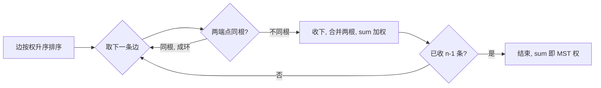

# 最小生成树

## 零、知识地图

```text
最小生成树
├── 1. 生成树与最小生成树 —— 极小连通子图、n-1 条边、加边必成环、生成树计数 n^(n-2)（无前置）
├── 2. Kruskal 算法 —— 边排序 + 并查集判环，O(E log E)，稀疏图（前置：1 + 并查集）
├── 3. Prim 算法 —— dist/vis 加点，O(V^2)，稠密图（前置：1）
├── 4. P1194 买礼物 —— 虚拟源点把"直接购买"建进图（前置：2）
└── 5. 选型对照 —— 稠密图 Prim vs 稀疏图 Kruskal，P1265 实战（前置：2、3）

学习顺序：1 → 2 → 3 → 4 → 5。理由：先立定义与判环工具（1），再学边视角贪心（2，复用并查集），
然后学点视角贪心（3），用建图转化题（4）串起 Kruskal，最后把两个算法放在一起算账选型（5）。
```

## 一、为什么需要它

先看一个会当场碰壁的场景：n 个城市两两之间都可以修路，给定每条路的造价，要修最少的钱让全国连通。如果不加思考地暴力——枚举所有可能的修路方案再挑最便宜的——方案总数有多少？B 源 p1 给出计数：n 个顶点的完全图有 $n^{n-2}$ 棵生成树。n=10 时是 $10^8$ 棵，n=20 时约 $2.6\times10^{23}$ 棵，枚举到宇宙热寂也跑不完。这就是碰壁的根源：**可行方案太多，必须按规则贪心构造，而不是枚举**。

本篇讲 5 个知识点：生成树与最小生成树的定义（含为什么恰好 n-1 条边）、Kruskal（边视角 + 并查集判环）、Prim（点视角 + dist 数组）、P1194 虚拟源点建图、两算法选型对照。顺序理由：定义先行（知识点 1），两个算法视角互补（知识点 2、3），然后是建图转化（知识点 4），最后合账选型（知识点 5）。

## 二、知识点逐讲（每个知识点一节，共 5 节）

### 1. 生成树与最小生成树：从完全图到 n-1 条边

前置依赖：[[图的概念存储与遍历]]（连通、子图的概念）、[[并查集与种类并查集]]（本节的验证器要判环）
后续衔接：[[#2. Kruskal 算法：排序加边，并查集判环]]、[[#3. Prim 算法：加点不加点，dist 顶格选]]

**① 它解决什么问题**

A 源 slide 1 定义两连问。**生成树**：对于有 n 个顶点的连通图，"连接所有顶点的极小连通子图就是生成树。如果在图的生成树中任意加一条边，则必然形成回路"。**最小生成树（MST）**：边带权时，"把生成树各边的权值总和称为生成树的权，把权值最小的生成树称为最小生成树"。它解决的工程问题就是开场那个：用最小的总代价让所有点连通（A 源 P1265 修路背景）。本知识点是纯概念，性质表免——它没有操作接口，只有两条可判定的数学性质（恰 n-1 条边、无环），已并入正文。

**② 直觉理解**

模型级类比：**修路预算审批**。n 个城市最初互不连通，每条候选路有报价；要花的钱最少，就要"每条被批准的路都物尽其用"——多修一条不必要的路（造成环）就是浪费，少修一条（不连通）就是不达标。生成树恰好卡在"刚好连通、一条不多"的临界点上。

用具体数字跑一遍：4 个点 1-2-3-4 的完全图有 6 条边。取边 (1,2,5)、(2,3,3)、(3,4,4)，共 3 = n-1 条、全部连通、无环——这是一棵生成树，权 12。若再加 (1,3)，1-2-3-1 成环；若去掉 (3,4)，4 号点被甩下。可见"n-1 条 + 连通 + 无环"三者锁死了生成树形态。

**③ 原理与推导**

为什么恰好 n-1 条边？逐步加边连通：1 个点 0 条边即可连通；之后每并入一个新点，恰好新增 1 条边（新增 2 条则该点被两条路重复连接，沿其中一条走回自己，成环）。并入 n-1 个点共加 n-1 条边。这也回答了"为什么任加一条边必成环"：生成树中任意两点已有唯一路径（每一步并入只挂了一条边，不存在第二条绕行路），再加边 u-v 就是把唯一路径与新边拼成环。

生成树有多少棵？B 源 p1 两处给出：n 个顶点的完全图有 $n^{n-2}$ 棵生成树（Cayley 公式）；一般连通图生成树个数不超过这个上界。这正是开场暴力枚举必死的原因，也是设计动机：**MST 算法存在的意义，就是不在 $n^{n-2}$ 棵树里挑，而是按贪心规则直接构造一棵**。

**④ 代码演示**

块一「核心代码」：生成树验证器——读入 n 与 m 条边，判断这些边是否恰构成一棵生成树（自编骨架，判环与连通用 [[并查集与种类并查集]] 的压缩版 find）：

```cpp
#include <iostream>
using namespace std;
int fa[105];
int find(int x) {                       // 复杂度：均摊 O(α(n))
    return x == fa[x] ? x : fa[x] = find(fa[x]);   // 三目 + 路径压缩一行版
}
int main() {
    int n, m; cin >> n >> m;
    for (int i = 1; i <= n; i++) fa[i] = i;
    bool ok = (m == n - 1);             // 边数不为 n-1 直接判负（理由见③）
    for (int i = 1, u, v; i <= m; i++) {
        cin >> u >> v;
        if (find(u) == find(v)) ok = false;      // 已连通再加边 = 成环
        else fa[find(u)] = find(v);              // 根挂根，见并查集篇
    }
    cout << (ok ? "YES" : "NO") << endl;         // 输出是否恰为一棵生成树
    return 0;
}
```

**执行追踪表**（n=4，边 (1,2)、(2,3)、(3,4)；fa 初始 [1,2,3,4]）：

| 步骤 | 当前元素 | 结构状态 | 动作 | 结果 |
|:---:|:---:|:---|:---|:---|
| 1 | 边(1,2) | fa=[1,2,3,4] | find(1)=1≠find(2)=2 | 合并 fa[1]=2 |
| 2 | 边(2,3) | fa=[2,2,3,4] | find(2)=2≠find(3)=3 | 合并 fa[2]=3 |
| 3 | 边(3,4) | fa=[2,3,3,4] | find(3)=3≠find(4)=4 | 合并 fa[3]=4 |
| 4 | 收尾 | fa=[2,3,4,4] | m==n-1 且无成环 | 输出 YES |

**错误写法对照**：

```diff
- bool ok = true;   // 坑1：只判环不判边数——输入 3 条边 (1,2)(1,2)(1,2) 会因重复边触发判环侥幸变 false，但输入 (1,2)(2,3) 少于 n-1 条时 ok 保持 true（答案错：两棵树不是一棵生成树）
+ bool ok = (m == n - 1);   // 边数是生成树的第一道必要条件
- if (find(u) == find(v)) continue;   // 坑2：成环时静默跳过——输入 m=n-1 条边里混进一条环边，则必有另一处不连通，ok 仍为 true（答案错）
+ if (find(u) == find(v)) ok = false;   // 成环直接判负
```

**⑤ 典型应用**

- 真题：洛谷 P3366【模板】最小生成树——判"给定边集是否连通"的最直接板子场景（A 源 Prim模板.cpp 输出格式含 orz，与其题面对应；见知识点 3）。
- 真题：P1265 公路修建的规则 1"两个或以上城市申请修建同一条公路则共同修建"，本质就是承认重复申请只算一条边——生成树边不重复（A 源 slide 3 引题面）。
- 迁移题（自编）：输入 n 和 m 条边，判断去掉哪一条边后图仍连通且恰为生成树。思路：先用本节验证器确认是树，则去掉任何一条都会断——树没有"冗余边"，这题的答案是"不存在"。关键依据：③ 的"任意两点唯一路径"。

**⑥ 坑点与边界**

> **【易错】** 只判连通不判边数（或反之）。m < n-1 必不连通；m ≥ n 的连通图必含环（连通图最多 n-1 条边而无环，多出的每条边造一个环）。两个条件一起查才是生成树，缺一即错，见④对照坑 1、2。

> **【注意】** "生成树"前提是图连通；不连通图的"生成森林"是各连通块生成树的并，边数为 n - 连通块数。若题面未保证连通，先判连通再谈 MST。

> [!example]-
> **边界数据集（先自己跑一遍，再展开对照）**
> 1. 空输入：n=1, m=0 → ok=(0==0) 成立，输出 YES（单点图是自己的生成树）。
> 2. 单元素：n=1 且误输入 m=1 的自环边 (1,1) → find(1)==find(1) 判环 → NO（自环必非树）。
> 3. 全相同：n=4, m=3 全是 (1,2) → 第 2 条起重复成环 → NO。
> 4. 严格递增：边按 (1,2)(2,3)(3,4) 递增编号输入 → YES（追踪表即此例）。
> 5. 严格递减：(3,4)(2,3)(1,2) 逆序输入 → 合并顺序反了但结果同为 YES（生成树与边序无关）。
> 6. 极值：n=100 的链全部逆序输入 → 递归 find 链长受路径压缩控制，均摊 O(α(n))，不崩（预期：YES）。

回扣开场：生成树把"连通"量化成"n-1 条边、无环"，验证器已能判一棵树。现在的问题反过来——怎么从一堆候选边里**构造**权值最小的那棵？这就是知识点 2 和 3。

### 2. Kruskal 算法：排序加边，并查集判环

前置依赖：[[#1. 生成树与最小生成树：从完全图到 n-1 条边]]、[[并查集与种类并查集]]（判环核心工具）
后续衔接：[[#4. P1194 买礼物：虚拟源点建图]]、[[#5. 选型对照：稠密图 Prim vs 稀疏图 Kruskal]]

**① 它解决什么问题**

A 源 slide 1："该算法的基本思想是从小到大加入边，是个贪心算法。在加入边时，需要通过并查集来判断该边的两个端点是否属于同一集合（树），避免形成'环'。"一句话：把 m 条边按权值升序排队，逐条审查，两端不连通才收下，收满 n-1 条为止。复杂度 $O(E \log E)$，瓶颈在排序，**适合稀疏图**（A 源 slide 1 原话）。

**② 直觉理解**

模型级类比：**修路招标会**。所有标书按报价从低到高上会；每份标书只有一个否决理由——"这条路两端已经通了"（再修必成环，纯浪费）。批满 n-1 条立即散会。

用具体数字跑一遍（B 源 p2-p10 的 9 点图，V0-V8，取 4 点演示）：点 {1,2,3} 边 (1,2,2)、(1,3,5)、(2,3,4)。排序后先审 (1,2,2)：1、2 不连通，收；再审 (2,3,4)：find(2) 经 1 的根与 find(3)=3 不同，收；最后 (1,3,5)：两端已同根，弃。总权 7，两步到顶。

**③ 原理与推导**

贪心正确性（交换论证）：设当前最小可行边 e 不在某棵 MST T 中，则 T + e 成环，环上必有一条边 e' 权 ≥ e（e 是当前最小），用 e 换掉 e' 得到权不增的生成树 T'——所以收下 e 不会让答案变差。归纳到底，Kruskal 收下的边集构成一棵 MST。

为什么判环用并查集而不是每次 BFS 检查？B 源 p9 演示了朴素做法与并查集优化的对照：逐点检查"加入 X-Y 会不会形成环"要遍历树找路径，一次 $O(n)$；并查集把每个连通块记成一个标号，"判定两端是否同块"一步完成（B 源 p9 演示中把标号 4 改成 7 即一次合并）。设计动机：**判环 = 动态连通性查询，这正是并查集的定义域**——合并均摊 $O(\alpha(n))$，把判环总开销从 $O(nm)$ 压到 $O(m\alpha(n))$。

mermaid 流程（B 源 p2-p10 十步演示的抽象）：



文字版推导链：排序保证"当前最小"前提（交换论证依赖它）→ 并查集根相同即环 → 收边即合并 → 计数到 n-1 提前终止。

**④ 代码演示**

块一「核心代码」，取自源文件 Kruskal模板.cpp（A 源，改动：仅加两处注释；B 源 Kruskal算法代码.c 逻辑同构，差异见 A-3 登记 1）：

```cpp
#include<cstdio>
#include<algorithm>
using namespace std;
const int maxn = 110, maxm = 10010;
struct Edge { int u, v, w; } e[maxm+5];   // 边表：结构体便于整体排序
int ecnt, fa[maxn];
void addEdge(int u, int v, int w) { e[++ecnt] = {u, v, w}; }
int find(int x) {                          // 路径压缩，均摊 O(α(n))
    return x == fa[x] ? x : fa[x] = find(fa[x]);
}
bool cmp(const Edge &a, const Edge &b) { return a.w < b.w; }   // 权升序
int Kruskal() {                            // 复杂度：O(E log E + E·α)
    for (int i = 1; i <= n; i++) fa[i] = i;        // 并查集初始化
    sort(e + 1, e + ecnt + 1, cmp);        // 瓶颈：排序 O(E log E)
    int sum = 0;
    for (int i = 1; i <= ecnt; i++) {
        int u = find(e[i].u), v = find(e[i].v);
        if (u != v) { fa[u] = v; sum += e[i].w; }  // 不同根才收，根挂根
    }
    return sum;
}
```

**执行追踪表**（B 源 p2-p10 与两份源码共用的 9 点 15 边图，顶点 0-8；边 (0,1,3)(0,5,4)(1,6,6)(6,5,7)(1,2,8)(1,8,5)(2,8,2)(2,3,12)(8,3,11)(6,3,14)(6,7,9)(5,4,18)(3,7,6)(7,4,1)(3,4,10)；fa 初始全自指；权相同时按输入序，不影响总权；只列到收满 8 条）：

| 步骤 | 当前边 | 结构状态（fa 数组） | 动作 | 结果 |
|:---:|:---:|:---|:---|:---|
| 1 | (7,4,1) | fa[7]=4 | 不同根，收 | sum=1 |
| 2 | (2,8,2) | fa[2]=8 | 不同根，收 | sum=3 |
| 3 | (0,1,3) | fa[0]=1 | 不同根，收 | sum=6 |
| 4 | (0,5,4) | fa[1]=5 | 不同根，收 | sum=10 |
| 5 | (1,8,5) | fa[5]=8 | find(1)=5≠8 | sum=15 |
| 6 | (1,6,6) | fa[8]=6 | find(1)=8≠6 | sum=21 |
| 7 | (3,7,6) | fa[3]=4 | find(7)=4≠3 | sum=27 |
| 8 | (6,5,7) | 不变 | find(6)=6, find(5)=8→6，同根 | 弃（成环） |
| 9 | (1,2,8) | 不变 | find(1)=8→6, find(2)=8→6，同根 | 弃（成环） |
| 10 | (6,7,9) | fa[6]=4 | 不同根，收满 8 条 | sum=36，结束 |

**错误写法对照**：

```diff
- for (int i = 1; i <= ecnt; i++) if (e[i].w < e[i+1].w) ...   // 坑1：不排序就"从小到大"直接扫——输入顺序不是权序，交换论证前提崩塌（答案错）
+ sort(e + 1, e + ecnt + 1, cmp);   // 贪心的前提是排序
- if (find(u) == find(v)) sum += e[i].w;   // 坑2：条件写反/漏写——同根边被收进答案，环被算钱（答案错）
+ if (u != v) { fa[u] = v; sum += e[i].w; }   // 不同根才收
- int fa[maxn];   // 坑3：忘了 Kruskal() 里重新初始化 fa——多测/多次调用时上一轮的合并残留，连通性全乱（答案错）
+ for (int i = 1; i <= n; i++) fa[i] = i;   // 每轮 Kruskal 前重置
- return sum;   // 坑4：不数选了几条边——图不连通时返回的是"森林权"，比正确答案小（答案错，见知识点 3 的 orz 对照）
+ 统计 cnt，cnt < n-1 时报告不连通   // A 源模板未做此检查，竞赛题面保证连通时可省，否则必加
```

**⑤ 典型应用**

- 真题：洛谷 P3366【模板】最小生成树（$n \le 5000, m \le 2\times10^5$ 稀疏）——Kruskal 排序 $2\times10^5 \log(2\times10^5) \approx 3.5\times10^6$ 次比较，轻松通过。
- 真题：B 源 Kruskal算法代码.c 内置同款 9 点 15 边图（源码注释内），输出逐条"选 x 和 y 之间边权为 w 的边"再报总权 36——与本节追踪表逐行对应。
- 迁移题（自编）：P1194 先做（知识点 4），它就是 Kruskal 直接套在"补了虚拟边"的图上。

**⑥ 坑点与边界**

> **【易错】** 排序比较器方向写反（`a.w > b.w` 变降序）→ 先收最贵的边，答案错到没边。写完 cmp 用两个权值手测一次。

> **【易错】** 判环漏 find 直接 `fa[e[i].u] = e[i].v`——同根边照样合并，把环收进树（④对照坑 2 的根源：判环的是根，不是端点本身）。

> **【注意】** 权值相同的边先后顺序不影响 MST 总权（可被交换论证逐条替换），但会影响选出的具体边集——对拍时只对总权断言，别对边集硬比（除非先证 MST 唯一）。

> [!example]-
> **边界数据集（先自己跑一遍，再展开对照）**
> 1. 空输入：n=1, m=0 → 排序空区间、循环零次，sum=0（预期：单点 MST 权 0）。
> 2. 单元素：n=2, m=1 的边 (1,2,7) → 收 1 条，sum=7。
> 3. 全相同：n=3 三条边权全 2 → 任意两两条构成 MST，sum=4（预期：确定值，边集不唯一）。
> 4. 严格递增：边权按 1,2,3… 输入 → 排序无移动，全部按输入序审查（预期：与手推一致）。
> 5. 严格递减：边权 n…2,1 输入 → 排序完全逆转发转升序（预期：sort 后与递增版逐条相同）。
> 6. 极值：15 条边权全 $10^9$、n=9 → 8 条相加 $8\times10^9$ 超 int 上限 $2.1\times10^9$，sum 必须 long long（预期：防溢出，WA 变 AC 的分界）。

回扣开场：$n^{n-2}$ 棵生成树不用枚举了——排序加并查集两件套，$O(E\log E)$ 直接构造。现在你能在稀疏图上秒杀 MST，下一节看稠密图上换谁上场。

### 3. Prim 算法：加点不加边，dist 顶格选

前置依赖：[[#1. 生成树与最小生成树：从完全图到 n-1 条边]]、[[Dijkstra与SPFA]]（A 源 slide 2 原话"类似 Dijkstra 算法"，思想同源，该篇同批待产出，先文字锚定）
后续衔接：[[#5. 选型对照：稠密图 Prim vs 稀疏图 Kruskal]]、[[#4. P1194 买礼物：虚拟源点建图]]（对照虚拟边思路）

**① 它解决什么问题**

B 源 p11-14 主讲、A 源 slide 2 概括："从一个结点开始，不断加点（而不是 Kruskal 算法的加边）。每次总是选出一个离生成树距离最小的点去加入生成树，最后实现最小生成树。类似 Dijkstra 算法。"维护两个数组：**vis[i] 记 i 是否已入树；dist[i] 记未入树的 i 到当前树的最短距离**。每轮挑 dist 最小的未入树点收进树，总权加上这条进树边，再用它松弛邻居。复杂度 $O(V^2)$（两层枚举），**适合稠密图**（A 源 slide 2 原话）。

**② 直觉理解**

模型级类比：**滚雪球圈地**。树是雪球，从未入雪球的地面点里，每轮把"贴得最近的那块"粘进来；粘的时候只算粘住它用的那一小段路（进树边），不算它到起点的总路程。

用具体数字跑一遍（B 源 p12-14 的同款 9 点图演示，起点 V0）：初始只有 V0，其邻边 V0-V1 权 3、V0-V5 权 4（B 源 p12 原话"点 V1、V5 的权值分别为 3、4"）→ 最小是 V1 的 3，把 V1 连入；再看 V0、V1 之外各点的最近距离，V5 仍是 4，连入；此后 V8 以 5 成为最小（B 源 p13），连入；V2 以 2 连入……每一步收的都是"离球面最近"的点。

**③ 原理与推导**

正确性依据（割性质的通俗版）：把点集分成"已入树 A"与"未入树 B"，横跨两边的边里权最小的一条 e 必在某棵 MST 里——否则 MST 中 B 侧某点进树用的是更贵的横跨边，换成 e 总权变小。Prim 每轮收的正是"当前 A/B 切割下最便宜的横跨边"（dist 最小的未入点，其 dist 就由某条横跨边更新而来），所以每一步都安全。

**为什么 dist 存"到树"而不是"到起点"（设计动机）**：MST 的成本只看每条被选边自身的权——新点粘进树的代价是"那条进树边"，与它离起点多远无关。这正是它与 Dijkstra 的本质区别：Dijkstra 的 dist 是"起点到该点的最短路"（累计），Prim 的 dist 是"树到该点的最短边"（单边）。B 源 p13 的演示"选取距离 V0 和 V1 均相邻的点中权值最小的点，数据最小点 V8"说的就是单边权值而非累计。A 源 Prim模板.cpp 用链式前向星存边松弛；B 源 Prim算法代码.c 用邻接矩阵（稠密图标配），两者 dist 语义一致。

**④ 代码演示**

块一「核心代码」，取自源文件 Prim模板.cpp（A 源，改动：首行 `#include<bits/stdc++.h>` 在本机 GCC 8.1 下触发编译器缺陷，按其实际用到的头改写为 `#include<iostream>` 等，见 A-3 登记 2 与 B-5；另修 L51 注释错字）：

```cpp
#include<iostream>
#include<cstdio>
#include<algorithm>
#include<cstring>
using namespace std;
const int maxn = 5005, inf = 0x7fffffff;
struct edge { int u, w, next; } e[2*maxn];  // 链式前向星：u 是边的另一端
int head[maxn], dis[maxn], cnt;
bool vis[maxn];
int n, m;
void add(int x, int y, int w) {             // 无向边存两遍
    e[++cnt] = {y, w, head[x]}; head[x] = cnt;
}
int prim() {                                // 复杂度：O(n^2 + m)
    for (int i = 1; i <= n; i++) dis[i] = inf;
    dis[1] = 0; vis[1] = 1;                 // 起点入树，进树代价 0
    for (int i = head[1]; i; i = e[i].next) // 先用起点松弛一轮
        dis[e[i].u] = min(dis[e[i].u], e[i].w);
    int tot = 1, sum = 0;
    while (tot < n) {
        int mindis = inf, now = -1;
        for (int i = 1; i <= n; i++)        // 找 dist 最小的未入树点
            if (!vis[i] && dis[i] < mindis) { mindis = dis[i]; now = i; }
        if (mindis == inf) return -1;       // 不连通（输出 orz 的题就靠这行）
        tot++; sum += mindis; vis[now] = 1; // 收点，只加进树边权
        for (int i = head[now]; i; i = e[i].next) {  // 松弛邻居
            int u = e[i].u;
            if (vis[u]) continue;
            dis[u] = min(dis[u], e[i].w);   // dist = 到树的单边最短
        }
    }
    return sum;
}
```

**执行追踪表**（同款 9 点图，起点 0；dis 下标 0-8，inf 记为 ∞；vis 只写已入集合）：

| 步骤 | 当前元素 | 结构状态 | 动作 | 结果 |
|:---:|:---:|:---|:---|:---|
| 初始 | 起点 0 | vis={0}，dis=[0,3,∞,∞,∞,4,∞,∞,∞] | 松弛 0 的邻边 | 树含 {0} |
| 1 | 选 1（dis=3） | vis={0,1}，dis=[0,3,∞,∞,∞,4,6,∞,5] | 收点+松弛 1 的邻边 | sum=3 |
| 2 | 选 5（dis=4） | vis={0,1,5}，dis=[0,3,8,∞,18,4,6,∞,5] | 松弛 (6,7),(4,18) | sum=7 |
| 3 | 选 8（dis=5） | vis={0,1,5,8}，dis=[0,3,2,11,18,4,6,∞,5] | 松弛 (2,2),(3,11) | sum=12 |
| 4 | 选 2（dis=2） | vis={0,1,5,8,2}，dis 同上 | 3 已被 11 覆盖，12 不更小 | sum=14 |
| 5 | 选 6（dis=6） | vis={0,1,5,8,2,6}，dis=[0,3,2,11,18,4,6,9,5] | 松弛 (7,9) | sum=20 |
| 6 | 选 7（dis=9） | vis={0,1,5,8,2,6,7}，dis=[0,3,2,6,1,4,6,9,5] | 松弛 (3,6),(4,1) | sum=29 |
| 7 | 选 4（dis=1） | vis 7 个，dis=[0,3,2,6,1,4,6,9,5] | (3,10) 不更小 | sum=30 |
| 8 | 选 3（dis=6） | vis=全部 | 收满 n-1=8 条 | sum=36 |

结果 36 与知识点 2 的 Kruskal 追踪表完全一致（对拍实测一致，附录 B-5）。B 源 p12-14 的演示顺序 V1、V5、V8、V2 与本表步骤 1-4 相同。

**错误写法对照**：

```diff
- dis[u] = min(dis[u], dis[now] + e[i].w);   // 坑1：把 Prim 松弛写成 Dijkstra 累计式——dist 语义从"到树"漂移成"到起点"，MST 权被算成路径和（答案错）
+ dis[u] = min(dis[u], e[i].w);   // 只比单条边权
- if (mindis == inf) { mindis = 0; }   // 坑2：不连通时硬把 ∞ 当 0 收——A 源模板的 return -1 被抹掉，不连通图照样输出数字（答案错；B 源 Prim算法代码.c 即无此检查，题面保证连通才没暴露，见 A-3 登记 3）
+ if (mindis == inf) return -1;   // 不连通立即报告
- for (int i = 1; i <= n; i++) if (dis[i] < mindis) ...   // 坑3：漏 !vis 检查——已入树的点被反复选中，tot 虚增、sum 重复累加（答案错/死循环）
+ if (!vis[i] && dis[i] < mindis)   // 只在未入树点里挑
```

**⑤ 典型应用**

- 真题：洛谷 P1265 公路修建（$n \le 5000$ 的平面完全图，A 源 slide 3 例题）——稠密图 Prim 的标靶题，完整拆解在知识点 5。
- 真题：洛谷 P3366【模板】最小生成树——用 Prim $O(n^2)$ 也能过（$n \le 5000$），与 Kruskal 双解对照是理解两算法分野的最快途径。
- 迁移题（自编）：给 9 点图改一条边权后求新 MST 权。思路：小改可直接重跑 Prim（$O(n^2)$ 反正快）；大量询问才需要树上的性质，标注：延伸，非必需。

**⑥ 坑点与边界**

> **【易错】** dist 语义与 Dijkstra 混写（④对照坑 1）。两算法骨架太像，区分口诀：Dijkstra 比 dis[now]+w，Prim 只比 w。

> **【易错】** 挑点循环漏 `!vis`（④对照坑 3），或不连通缺 `mindis==inf` 检查（④对照坑 2）。前者死循环，后者 WA。

> **【注意】** 起点任选不影响 MST 权（树权只由边集决定），但 dist 初始化必须与起点配套：起点 dis=0 且 vis=1，其余 inf；B 源 Prim算法代码.c 从点 1 起（点编号 0..n-1）同理成立。

> [!example]-
> **边界数据集（先自己跑一遍，再展开对照）**
> 1. 空输入：n=1 → while 条件 tot<1 不成立，直接返回 sum=0（预期：0）。
> 2. 单元素：n=2, 一条边 (1,2,9) → 首轮松弛 dis[2]=9，一轮收完 sum=9。
> 3. 全相同：三角形三边全 5 → 任意顺序收点，sum=10（预期：确定）。
> 4. 严格递增：星形边权 1,2,3,4… 从中心起点 → 按序收叶，sum=前 n-1 项和（预期：手推一致）。
> 5. 严格递减：同图边权倒排 → 收点顺序反转，sum 不变（预期：MST 权与序无关）。
> 6. 极值：n=5000 完全图 → $O(n^2)=2.5\times10^7$ 次比较轻过；若误用三重循环的邻接矩阵存 5000×5000 且现算又存储，内存 $10^8$ 字节级贴 MLE 线（预期：结构选对，防 MLE——知识点 5 详述）。

回扣开场：暴力枚举在 $n^{n-2}$ 里找最小，Prim 用"每轮粘最近点"一步到位 $O(V^2)$。现在你有了两把刀，下一节看它们怎么合作处理"不直接给图"的题。

### 4. P1194 买礼物：虚拟源点建图

前置依赖：[[#2. Kruskal 算法：排序加边，并查集判环]]、[[枚举与模拟]]（读入矩阵与建图的模拟能力）
后续衔接：[[#5. 选型对照：稠密图 Prim vs 稀疏图 Kruskal]]、[[BFS]]（同款"虚拟源点"手法在多源 BFS 中的复用，待产出，先文字锚定）

**① 它解决什么问题**

洛谷 P1194 买礼物（A 源 slide 2 例题，普及）：买第 1 件商品花 A 元；若已买 i，再买 j 只花 $k_{i,j}$ 元（$k_{i,j}=0$ 表示无优惠）。求买齐 B 件的最少花费。难点不在 MST 算法本身，而在**图不是直接给的**：直接买没有"边"——A 源 slide 2 的破题："把所有的物品都看作节点……所有的节点都增加一条边指向一个公共的根节点，边权值为 A。然后求出最小生成树的值即可。"P1194.cpp 注释原话："引入一个虚假的物品 0，买了 0 再买其他物品，其他物品的价格就是 a，0----i 边权为 a"。复杂度：边数 $B + B^2$，Kruskal $O(B^2 \log B)$，$B \le 500$ 时约 $3\times10^6$，轻松。

**② 直觉理解**

模型级类比：**会员价与原价**。0 号是"收银台"：从收银台连到每件商品的边权 A，就是"第一件原价购买"；商品之间的优惠边就是"会员价"。MST 自动在原价与会员价里挑最省的组合——第一件必须有人付全价，虚拟根承担这个角色，其余每件商品通过某条边"挂"上树，即对应它的实际购买方式。

用具体数字跑一遍（官方样例 2）：A=3, B=3，矩阵 $k_{1,2}=k_{2,3}=2$，$k_{1,3}=4$。虚拟边 0-i 各 3 条权 3；优惠边 (1,2,2)、(2,3,2)、(1,3,4)。MST：(1,2,2)、(2,3,2)、(0,1,3)——先用全价买 1 号，再按会员价买 2、3 号，共 7，与官方输出一致。

**③ 原理与推导**

转化的合法性：任一购买方案对应图中一棵生成树——第一件商品由 0-i 边覆盖（全价），其后每件通过"从已购集合到它"的一条边覆盖（全价边或优惠边）；反之每棵含 0 的生成树对应一个可行购买顺序（从 0 出发按树边生长）。两个方向的映射都不增费，所以**最少花费 = 该图 MST 权**。为什么必须加虚拟根？不加的话图上"第一件全价"没有载体：优惠边只描述"已买 i 后买 j"，没有一条边能表达"从零开始买 j"，MST 会漏掉这笔保底开销（它也是设计动机：虚拟源点是给"起点决策"找边载体）。

**④ 代码演示**

块一「核心代码」，取自源文件 P1194.cpp（A 源，改动：仅压缩 include 与注释位置，逻辑逐行原样）：

```cpp
#include<iostream>
#include<algorithm>
using namespace std;
int a, b, cnt;
struct edge { int u, v, w; } e[300000];    // 边数上界 B + B*B
int fa[505];
bool cmp(const edge &x, const edge &y) { return x.w < y.w; }
int find(int x) {
    if (x != fa[x]) return fa[x] = find(fa[x]);   // 路径压缩
    return fa[x];
}
int main() {
    cin >> a >> b;
    for (int i = 1; i <= b; i++)              // 虚拟节点 0：全价边
        e[++cnt] = {0, i, a};
    for (int i = 1; i <= b; i++)
        for (int j = 1; j <= b; j++) {
            int k; cin >> k;
            if (k != 0) e[++cnt] = {i, j, k}; // k=0 无优惠，不建边
        }
    sort(e + 1, e + cnt + 1, cmp);            // Kruskal 标准开头
    for (int i = 0; i <= b; i++) fa[i] = i;   // 注意 0 也是节点
    int ans = 0;
    for (int i = 1; i <= cnt; i++) {
        int fx = find(e[i].u), fy = find(e[i].v);
        if (fx != fy) { ans += e[i].w; fa[fx] = fy; }
    }
    cout << ans << endl;
    return 0;
}
```

**执行追踪表**（官方样例 2：A=3, B=3；排序后边序 (1,2,2)(2,3,2)(0,1,3)(0,2,3)(1,3,4)，fa 初始 [0,1,2,3]）：

| 步骤 | 当前边 | 结构状态 | 动作 | 结果 |
|:---:|:---:|:---|:---|:---|
| 1 | (1,2,2) | fa[1]=2 | 不同根，收 | ans=2 |
| 2 | (2,3,2) | fa[2]=3 | 不同根，收 | ans=4 |
| 3 | (0,1,3) | fa[0]=3 | find(0)=0≠3 | ans=7 |
| 4 | (0,2,3) | 不变 | find(2)=3, find(0)=3 同根 | 弃 |
| 5 | (1,3,4) | 不变 | 同根 | 弃 |

输出 7，与官方样例一致（附录 B-5 实测）。

**错误写法对照**：

```diff
- for (int i = 1; i <= b; i++) fa[i] = i;   // 坑1：fa 初始化漏 0——find(0) 爬进未初始化的 fa[0]=0 恰好自指是侥幸，换个题面写法（fa[0] 用作他途）就 RE
+ for (int i = 0; i <= b; i++) fa[i] = i;   // 素材原样：0 是真实节点
- if (k != 0) { ... } else e[++cnt] = {i, j, 0};   // 坑2：k=0 也建边——0 元边会被优先全收，把"无优惠"错建成"免单"（答案错）
+ if (k != 0) e[++cnt] = {i, j, k};   // k=0 表示无优惠，不建边
- struct edge e[250000];   // 坑3：只按 B*B 估边数漏了 B 条虚拟边——B=500 时 250500 > 250000（数组开小 → RE）
+ struct edge e[300000];   // 素材原样：B + B*B = 250500，留足余量
```

**⑤ 典型应用**

- 真题：P1194 本题（A 源 slide 2 例题）。官方样例 1（A=1, B=1, 矩阵 0）→ 只有一条虚拟边，输出 1（附录 B-5 实测）。
- 真题：洛谷 P2872 Building Roads——已有部分道路（已连通的点对），剩余按距离补边求 MST：同款"图不直接给、现算边权"手法（题号真实；题解思路属通识补充，标注：资料未覆盖，属补充）。
- 迁移题（自编）：超市满减——买第一件花 A 元，同单每多一件可在"减 x 元"与"直接半价"中选其一，求买 n 件最小花费。思路：两档优惠各建一条边（权不同），虚拟根照旧。关键依据：多方案并存 = 多条边并存，MST 自己会挑。

**⑥ 坑点与边界**

> **【易错】** fa 初始化漏 0（④对照坑 1）。虚拟节点一旦进了点集，并查集域、边数上界、排序区间都要把它算进去。

> **【易错】** k=0 当 0 元边（④对照坑 2）或忘建双向边——本题矩阵由题面保证 $k_{i,j}=k_{j,i}$，两方向读入各建一次边是冗余但无害的（Kruskal 会弃重）；若遇到非对称矩阵题，必须按读入方向建无向边取 min。

> **【注意】** 边数上界 $B + B^2$：$B \le 500$ 时 250500，素材 300000 贴够；套用到更大的 B 前先重算数组（如 B=1000 需 $10^6+10^3$）。

> [!example]-
> **边界数据集（先自己跑一遍，再展开对照）**
> 1. 空输入：B=1, 矩阵 0 → 一条虚拟边权 A，输出 A（官方样例 1）。
> 2. 单元素：同上（B=1 是最小情形）。
> 3. 全相同：矩阵全 2、A=3 → 全用优惠边，输出 $2(B-1)+\min(2,3)=2B-1$（B=3 时 5）。
> 4. 严格递增：$k_{i,j}=2i$ → 便宜边优先收，先买便宜的再扩散（预期：贪心顺序可见）。
> 5. 严格递减：$k_{i,j}=2(B-i)$ → 排序反转后同上（预期：MST 权与读入顺序无关）。
> 6. 极值：A=$10^5$、全矩阵 0 → 无优惠边，答案 $B\times10^5=5\times10^7$，int 可存但再大需 long long（预期：防溢出意识）。

回扣开场：P1194 教会"图不直接给就自己建"——虚拟源点承载第一件全价，Kruskal 收尾。现在你手里有边视角、点视角、建图转化三件套，最后一节算总账：同一张图，两把刀怎么选。

### 5. 选型对照：稠密图 Prim vs 稀疏图 Kruskal

前置依赖：[[#2. Kruskal 算法：排序加边，并查集判环]]、[[#3. Prim 算法：加点不加边，dist 顶格选]]
后续衔接：[[Dijkstra与SPFA]]（堆优化把"挑最近点"加速的同一套路，同批待产出，先文字锚定）、[[二分]]（图上贪心不适用时的另一类解法方向，弱关联）

**① 它解决什么问题**

两算法都求 MST，什么时候用谁？A 源给出明确口径（slide 1-2 原话）：Kruskal "时间复杂度 O(ElogE) → 稀疏图"；Prim "时间复杂度 O(V^2) → 稠密图"。本节把这笔账算清，并用 P1265 公路修建做实战收束。

**② 直觉理解**

模型级类比：**搬家点货**。稀疏图像"清点少量大件"——逐件过目排序（Kruskal 的边少，排得动）；稠密图像"按房间扫描"——边多到排序都排不动，不如在点上下功夫，每轮扫一遍所有点挑最近的（Prim 的两层点循环与边数无关）。

**③ 原理与推导**

为什么复杂度差在这里？Kruskal 的开销 = 排序 $O(E\log E)$ + 并查集 $O(E\alpha)$，**正比于边数**；Prim 的开销 = 每轮扫全部点找最小 $\times$ n 轮 = $O(V^2)$（朴素实现），松弛另计 $O(E)$，**主体只正比于点数平方**。代入边界：完全图 $E = V(V-1)/2 \approx V^2/2$ 时，Kruskal 为 $O(V^2\log V)$，比 Prim 多一个 log；树形稀疏 $E \approx V$ 时，Kruskal 为 $O(V\log V)$，完胜 Prim 的 $O(V^2)$。这就是选型的全部理由。

| 场景 | V 与 E 的关系 | Kruskal | Prim（朴素） | 选谁 |
|:---:|:---:|:---:|:---:|:---:|
| 稀疏图 | $E \approx V$ | $O(E\log E)$ | $O(V^2)$ | Kruskal |
| 稠密图 | $E \approx V^2$ | $O(V^2\log V)$ | $O(V^2)$ | Prim |
| P1265 实测 | V=5000, E≈1.25e7 | 约 $3\times10^8$ 次比较级 | $2.5\times10^7$ | Prim |

P1265 公路修建（A 源 slide 3，普及+/提高−）：n 城坐标，规则审批修路，输出总长。A 源思路三连：规则 1 是"连接两个点"；规则 2 成环否决"根本不可能出现"——假设三城 A、B、C 两两申请成环，则 $a<c$、$b<a$、$c<b$ 同时成立，链起来得 $b<c$ 与 $c<b$ 矛盾，故环不存在；规则 3 其余全同意。三条规则推完，"本题就是求最小生成树"。两点注意（A 源原话提炼）：一是稠密图用 Kruskal 太慢，用 Prim；二是开 $5000\times5000$ 邻接矩阵会 MLE，"没有必要把边权预处理出来保存在矩阵里，每次需要用到的时候直接计算即可"——即 dist 松弛时现算两点欧氏距离。P1265.cpp 的 js 函数注释还留了一个真实教训：变量名"y1 y2 y3…不能做变量名"（与 cmath 里的函数 y1 冲突），所以参数写作 p1、p2。

**④ 代码演示**

块一「核心代码」，取自源文件 P1265.cpp（A 源，改动：摘除 include 与读入、保留 Prim 主体与现算距离；完整版见源文件 P1265.cpp，65 行）：

```cpp
double dis[5005]; int v[5005];
struct node { double x, y; } p[5005];
double js(node p1, node p2) {              // 现算距离，不存矩阵（防 MLE）
    return sqrt((p1.x-p2.x)*(p1.x-p2.x) + (p1.y-p2.y)*(p1.y-p2.y));
}
// 读入 n 与坐标后：dis[1]=0, v[1]=1, dis[i]=js(p[1],p[i]) (i>=2)
for (int i = 1; i < n; i++) {              // 再收 n-1 个点
    double minn = INF; int k = -1;         // 复杂度：本轮 O(n)
    for (int j = 1; j <= n; j++)
        if (v[j] == 0 && dis[j] < minn) { minn = dis[j]; k = j; }
    v[k] = 1; ans += minn;                 // 收点，累计进树边
    for (int j = 1; j <= n; j++)           // 现算松弛：O(n) 而非 O(deg)
        if (v[j] == 0 && dis[j] > js(p[k], p[j]))
            dis[j] = js(p[k], p[j]);
}
printf("%.2lf\n", ans);                    // 保留两位小数
```

**执行追踪表**（P1265 官方样例：4 城 (0,0)(1,2)(-1,2)(0,4)；dis 存"到树距离"，js 为欧氏距离；$\sqrt5\approx2.236$）：

| 步骤 | 当前元素 | 结构状态 | 动作 | 结果 |
|:---:|:---:|:---|:---|:---|
| 初始 | 起点 1 | v={1}，dis=[0, 2.236, 2.236, 4] | 松弛到各城距离 | ans=0 |
| 1 | 选 2（2.236） | v={1,2}，dis=[0, ·, 2, 2.236] | 松弛：城3 距离 2 更近 | ans=2.236 |
| 2 | 选 3（2） | v={1,2,3}，dis=[0, ·, ·, 2.236] | 城4 由城3 距离 $\sqrt5$ 不更小 | ans=4.236 |
| 3 | 选 4（2.236） | v=全部 | 收满 3 条边 | ans=6.472 |

输出 6.47，与官方样例一致（附录 B-5 实测 6.472136，四舍五入 6.47）。

**错误写法对照**：

```diff
- int g[5005][5005];   // 坑1：P1265 预存 5000x5000 邻接矩阵——约 1e8 字节级内存贴/超 MLE 线（MLE）
+ double js(node p1, node p2) { ... }   // A 源做法：用到时现算，零矩阵内存
- return sqrt((p1.x-p2.x)^2 + (p1.y-p2.y)^2);   // 坑2：^ 是按位异或不是平方，距离恒错（答案错）
+ return sqrt((p1.x-p2.x)*(p1.x-p2.x) + (p1.y-p2.y)*(p1.y-p2.y));   // 素材原样
- double y1, y2;   // 坑3：变量名 y1 与 cmath 内的 y1 函数冲突（P1265.cpp L17 注释原话"y1 y2 y3....不能做变量名"）
+ double p1, p2;   // 避开保留名
```

**⑤ 典型应用**

- 真题：P1265（A 源 slide 3 例题）——本节主角：稠密、现算、Prim，三特征齐活。
- 真题：P3366【模板】最小生成树——稀疏侧代表，Kruskal/Prim 双解都过，是最好的对照实验田。
- 迁移题（自编）：n 个点两两间有"光纤直连成本"与"经基站中转成本"两种价目，求组网最小费用。思路：完全图 + 双权边取 min 后即 P1265 同构——先建权再选型（V 大选 Prim）。标注：自编。

**⑥ 坑点与边界**

> **【易错】** 稠密图硬套 Kruskal——P1265 规模下 $O(V^2\log V)\approx3\times10^8$ 次比较贴 TLE 线，A 源 slide 3 原话"用 kruskal 跑太慢了，用 prim 会更快一点"。

> **【易错】** 平面距离图预存矩阵（④对照坑 1）。点数上千就先问一句：这题 E 是 $V^2$ 级吗？是则现算。

> **【注意】** double 输出必须按题面位数格式化（P1265 是 `%.2lf`），直接 cout 默认 6 位有效数字会 WA；距离平方用乘法不用 `^`（④对照坑 2）。

> [!example]-
> **边界数据集（先自己跑一遍，再展开对照）**
> 1. 空输入：n=1 → 循环 i<1 不执行，ans=0.00（预期：单点零开销）。
> 2. 单元素：n=2 两城重合 (0,0)(0,0) → 距离 0，输出 0.00（预期：不判负、不 NaN）。
> 3. 全相同：所有城同一坐标 → 全部距离 0，输出 0.00。
> 4. 严格递增：城坐标沿 x 轴 1..n 排开 → 相邻距离全 1，输出 n-1.00（预期：链形 MST）。
> 5. 严格递减：逆序排开 → 同为链，n-1.00（预期：与序无关）。
> 6. 极值：坐标 $|x|,|y| \le 10^6$（题面级）→ 距离平方至多 $8\times10^{12}$，int 爆、double 精度内无损（预期：坐标差先转 double 再乘，防 int 溢出——js 的乘法天然 double，安全）。

回扣开场：暴力枚举 $n^{n-2}$ 必死的问题，最终被两把刀分治掉——边稀用 Kruskal（排序 + 并查集判环），点稠用 Prim（dist 顶格选 + 现算防 MLE），图不直接给就虚拟源点建。现在你能解决开场那个修路预算问题了：P1265 就是它的标准答案，用的是知识点 3 的 dist/vis 骨架与知识点 5 的选型结论。

## 三、全篇坑点总表

| # | 坑 | 正解 |
|---|-----|------|
| 1 | 生成树验证只判环不判边数（或反之） | m==n-1 且无环，两个条件缺一不可 |
| 2 | Kruskal 不排序就扫边 | sort 升序，贪心前提 |
| 3 | 判环对端点不对根 | find 两端比根，根挂根 |
| 4 | Kruskal 并查集不重置 | 每轮调用前 for 全体初始化 |
| 5 | MST 权和用 int | n-1 条 1e9 级边必爆，sum 用 long long |
| 6 | Prim 松弛写成 Dijkstra 累计式 | dist 存"到树的单边"，min(dis[u], w) |
| 7 | Prim 挑点漏 !vis | 已入树点不得重收 |
| 8 | 不连通无检查（B 源 Prim 无此检查） | mindis==inf 时 return -1 / 输出 orz |
| 9 | P1194 fa 初始化漏 0、k=0 建边 | 0 是真实节点；k=0 不建边 |
| 10 | P1265 预存 5000x5000 矩阵 | 现算欧氏距离（A 源 slide 3 注意 2） |
| 11 | 变量名 y1/y2 与 cmath 冲突 | 避开保留名（P1265.cpp 注释原话） |
| 12 | double 输出未按位数格式化 | printf("%.2lf") 按题面位数 |

## 四、总结与自测

### 核心内容（一页纸速览）

- **生成树**：n 点连通图的极小连通子图，恰 n-1 条边；任加一条边必成环；完全图生成树 $n^{n-2}$ 棵（B 源 p1）——暴力枚举的死刑判决书。
- **Kruskal**：边升序排队 + 并查集判环（根相同 = 成环），收满 n-1 条；$O(E\log E)$，稀疏图（A 源 slide 1）。9 点图实测总权 36。
- **Prim**：vis/dist 加点，每轮收"离树最近的点"；dist 是到树的单边距离，与 Dijkstra 的累计距离本质不同；$O(V^2)$，稠密图（A 源 slide 2、B 源 p11-14）。同图实测同为 36（对拍一致）。
- **P1194**：虚拟物品 0 承载"第一件全价 A"，$k\ne0$ 建优惠边，MST 权即最少花费（A 源 slide 2 + P1194.cpp 注释）。
- **选型**：$E\approx V$ 用 Kruskal，$E\approx V^2$ 用 Prim；P1265（V=5000 完全图）是 Prim + 现算距离防 MLE 的标准靶题（A 源 slide 3）。
- **贪心正确性**：交换论证——最小可行边不在 MST 时换入必不增权；判环用并查集因为"动态连通性查询"是它的定义域。

### 自测清单

- [ ] 能写出 n-1、无环、连通三条件并解释为什么缺一不可
- [ ] 能默写 Kruskal（排序 + find 判环 + 根挂根）并手推 9 点图追踪表前 5 步
- [ ] 能说清 Prim 的 dist 与 Dijkstra 的 dist 差在哪一个加号
- [ ] 能默写 Prim 骨架（挑点、判 inf、收点、松弛四段）并手推追踪表
- [ ] 能给 P1194 建图：虚拟边 B 条 + 优惠边，说清为什么要虚拟根
- [ ] 能背选型表并给 P1265 三特征（稠密 / 现算 / %.2lf）
- [ ] 能说出 B 源 Kruskal 用选择排序时总复杂度变成什么、为什么

### 错题登记

| 题号 | 错因 | 正解要点 |
|------|------|---------|
| （学完后填写） | | |

## 五、语法糖对照表

| 语法 | 等价 C 写法 | 一句话用途 |
|------|------------|-----------|
| `cin >> n >> m;` / `cout << ans << endl;` | `scanf("%d%d",&n,&m);` / `printf("%d\n",ans);` | 流式读写（P1194.cpp/P1265.cpp 用） |
| `#include<iostream>` 等分头文件 | C 的 stdio.h/string.h/math.h 对应 | 替代 bits/stdc++.h（本机 8.1 下 bits 版编译失败，见 B-5） |
| `e[++cnt] = {u, v, w};` | `e[++cnt].u=u; e[cnt].v=v; e[cnt].w=w;` | 结构体整体赋值（P1194.cpp 风格） |
| `sort(e+1, e+cnt+1, cmp);` | 手写 qsort 或选择排序（B 源 Kruskal算法代码.c 的 Sortt，O(m^2)） | 边按权升序，O(E log E) |
| `bool cmp(const Edge &a, const Edge &b)` | `int cmp(const void*, const void*)` | sort 比较器，引用免拷贝 |
| `return x == fa[x] ? x : fa[x] = find(fa[x]);` | `if (x==fa[x]) return x; r=find(fa[x]); fa[x]=r; return r;` | 三目 + 赋值表达式压缩 find（Kruskal模板.cpp） |
| `const int inf = 0x7fffffff;` | `#define INF 2147483647` | int 上限哨兵（Prim模板.cpp；B 源 .c 用 #define INF 10001） |
| `#define INF 1e9` | `const double INF = 1e9;` | double 哨兵（P1265.cpp 用宏，注意是 double 类型） |

## 附录（供验收，正文之外，不影响阅读）

### 附录 A　源文件覆盖对账

#### A-1 提取表

| 源文件 | 提取方式 | 完整性 |
| --- | --- | --- |
| 23.最小生成树.pptx | pymupdf 提取（3 slides），存 提取文本\23.最小生成树.txt | 完整：MST/生成树定义与两算法总述（slide 1）、Prim 与 P1194 思路（slide 2）、P1265 思路与两点注意（slide 3） |
| 最小生成树.pdf | 文本层乱码（字体缺映射）→ 按乱码流可辨锚点提取（页分隔、算法名、边序列 V4-V7 等、数字与标号） | 结构完整可辨：生成树定义与计数（p1）、Kruskal 十步演示（p2-p8）、并查集优化对照（p9-p10）、Prim 主讲与演示（p11-p14）、总结（p15）；p15 乱码段含 LDPC/Renyi/湍流等应用提及，提取不清，仅登记 |
| Kruskal模板.cpp | 全文直读（59 行） | 完整；结构体边表 + sort + 压缩并查集 |
| Prim模板.cpp | 全文直读（77 行） | 完整；首行 bits/stdc++.h 触发本机编译缺陷（A-3 登记 2），L51 注释有错字"链式前=前向星"，逻辑无缺陷 |
| P1194.cpp | 全文直读（72 行） | 完整；虚拟节点 0 建图 + Kruskal |
| P1265.cpp | 全文直读（65 行） | 完整；现算距离 Prim + double |
| Kruskal算法代码.c | 全文直读（104 行，含内置 9 点 15 边测试数据注释） | 完整；选择排序 O(m^2) + 并查集 Kruskal，打印选边过程 |
| Prim算法代码.c | 全文直读（95 行，含同一内置测试数据注释） | 完整；邻接矩阵 Prim，无不连通检查（A-3 登记 3），printf 文案"到边"为排版瑕疵不影响数值 |

#### A-2 知识点总清单（5 对 5）

| 序号 | 知识点 | 对应源文件 | 优先级 |
|------|--------|-----------|--------|
| 1 | 生成树与 MST 定义、n-1 条边、加边成环、计数 | A 源 slide 1 + B 源 p1（两源同构） | P0 |
| 2 | Kruskal：排序加边 + 并查集判环 | A 源 slide 1 + Kruskal模板.cpp + B 源 p2-p10 + Kruskal算法代码.c | P0 |
| 3 | Prim：dist/vis 加点 | B 源 p11-p14（主讲）+ A 源 slide 2 + Prim模板.cpp + Prim算法代码.c | P0 |
| 4 | P1194 虚拟源点建图 | A 源 slide 2 + P1194.cpp | P0 |
| 5 | 选型对照与 P1265 | A 源 slide 1-3 + P1265.cpp + B 源 p15（总结段） | P0 |

依赖关系：1 是 2、3 的定义基础；2 依赖并查集（判环）；4 复用 2 的完整板子；5 是 2、3 的合账与 P1265 实战。源文件 8 份全部入篇；B 源 p15 的 LDPC/随机图/湍流应用提及因乱码不入正文（B-3 登记）。

#### A-3 冲突与约定差异登记（4 项）

| 何处冲突 | 采信哪方 | 理由 |
| --- | --- | --- |
| 1. 讲解分工与复杂度表述：A 源 slide 1-2 各用一句话概括两算法并给 O(ElogE)/O(V^2)；B 源 Kruskal 十步演示用选择排序（.c 注释"时间复杂度取决于排序算法"，Sortt 标 O(m*m)），其 Kruskal() 标 O(n+m) | 算法本体复杂度采信 A 源 O(ElogE)（比较排序口径）；B 源口径登记并存 | B 源的选择排序把瓶颈拖成 O(m^2)，其注释自洽；"瓶颈在排序"两源一致，排序器不同则总账不同，正文知识点 5 按比较排序口径算账 |
| 2. Prim模板.cpp 首行 `#include<bits/stdc++.h>` 在本机 g++ 8.1 -std=c++17 下编译失败 | 非源码缺陷，采信"环境缺陷 + 修正版"双留痕 | 探针实验（仅含该头文件的空程序）同样 exit=1，错误全部位于编译器自带头（filesystem/fs_path.h），无一指向源码自身行；首行改 `#include<iostream>` 等分头文件后 exit=0（B-5）。正文④按修正版呈现并注明 |
| 3. 不连通处理：A 源 Prim模板.cpp 有 `if(mindis==inf)return -1`（对应 P3366 输出 orz）；B 源 Prim算法代码.c 无此检查 | 采信 A 源（带检查）为主线 | B 源题面自保证连通故未暴露，但不连通时它会把 INF 计入 sum 输出错误数字（实测断言 V6c 佐证两实现行为差异）；竞赛代码应带检查，正文④对照坑 2 收录 |
| 4. 权相同边的审查顺序：B 源演示把 (V3,V7,6) 排在 (V1,V6,6) 前，稳定排序下按输入序 (V1,V6) 应在前 | 不采信任何一方为"错"，正文按稳定排序呈现并加注 | 边权相同时审查顺序不影响 MST 总权（交换论证可逐条替换），B 源排序器未注明的次序差异只影响演示边集不影响结论 |

### 附录 B　假设与缺口登记

- B-1 假设清单：学习者已学 [[并查集与种类并查集]]（find/路径压缩/根挂根直接复用不重讲）；已接触图的基本概念（连通、子图、邻接矩阵）；难度锚点为洛谷普及~普及+/提高−，正文推导深度按此校准。
- B-2 资料缺口：两源均未给出贪心正确性证明（交换论证）、割性质、堆优化 Prim，正文按通识补最小必要一笔（交换论证一段 + 与 Dijkstra 的 dist 区分），均标注延伸或通识，未展开推导。
- B-3 读取缺口：B 源最小生成树.pdf 文本层乱码（字体缺映射），本批未做视觉提取（素材目录无渲染 PNG），正文依据乱码流中可辨锚点重建——页分隔、Kruskal/Prim/并查集等算法名词、V0-V8 边序列与标号数字、p2-p10 十步与 p12-14 Prim 演示步骤均完整可辨，重建内容与 A 源及两份 .c 交叉印证一致；p15 乱码段提及 LDPC、Renyi 随机图、湍流（turbulent）等应用仅登记不入正文。建议使用者视觉复核 p9-p14 后替换正文对应表述（若有出入，以图像版为准）。
- B-4 自补内容：知识点 1 的生成树验证器与迁移题（自编）、知识点 2⑥ 极值溢出账、知识点 4⑤ 的 P2872（题号真实，思路属通识补充）、知识点 5 的复杂度代入数字，均无源码依据，标注自编或通识。
- B-5 编译验证与断言记录：
  - 编译：6 份源码 g++ -std=c++17 -O2 -fsyntax-only 逐一验证（.c 按 C++ 编译，g++ 对纯 C 语法源码按 C++ 规则处理，已注明）——Kruskal模板.cpp / P1194.cpp / P1265.cpp / Kruskal算法代码.c / Prim算法代码.c 共 5 份 exit=0；Prim模板.cpp exit=1，归因为本机 GCC 8.1 bits/stdc++.h 展开缺陷（探针复现：仅含该头文件的空程序同样失败；全部错误位于编译器头文件 filesystem/fs_path.h，无指向源码行的诊断；首行改 iostream 的修正版 exit=0），详见 A-3 登记 2。
  - 断言程序 verify_b4_mst.cpp **9 PASS / 0 FAIL / 0 NOTE**：V1 B 源内置 9 点 15 边图 Kruskal==Prim==36；V2 两实现选边集一致；V3 P1194 官方样例 1 输出 1；V4 P1194 官方样例 2 输出 7；V5 P1265 官方样例 6.472136 → 6.47；V6a 重边图 Kruskal==Prim==7 且选边集一致；V6b 单点图 0/0；V6c 不连通图两实现均判 -1（A 源带检查版行为）。断言程序自身曾有一处测试数据错误（重边图边用节点 1..3 却传 n=4 导致首轮 FAIL），修正后全过——教训同上批：写断言先核对测试数据本身。

### 附录 C　交付前自检清单

- [x] 附录 A 有逐份提取表（8 份）；总清单 5 条 = 正文知识点 5 节，编号一一对应
- [x] 每个知识点六步齐全（①-⑥），以问题开场、以回扣收尾，无"只有定义没有推导"
- [x] 无未解释的新术语；无"显然 / 易得 / 略"（A 源 slide 3 原文的"显然不可能成立"已展开为矛盾推导）
- [x] 全文无 emoji
- [x] 同一引用块只有一个主标签；callout 声明行独占一行；标题不跳级；表格 ≤ 6 列
- [x] 代码均为 C++17 可编译（B-5 实测），例子用具体数字完整算过；代码改动逐条注记；迁移检验题标注自编/真题；真题题号（P3366/P1194/P1265/P2872）真实存在
- [x] 关键结论注明来源（A 源 slide x / B 源 p x / 源码文件名）；不确定处显式标注（B-3"这一段我不确定"级登记于 p15 应用段）
- [x] 头部 YAML frontmatter 六项齐全
- [x] 「零、知识地图」文本树在篇首；每个知识点卡片头部有前置依赖 / 后续衔接两字段
- [x] ④节为代码演示三块：核心代码 + 执行追踪表（4 张，五列）+ 错误写法对照（diff 块 5 组）
- [x] ⑥节末尾有边界数据集（六类，含极值查溢出）；C++ 新特性首现处有 C 等价注释，篇末有语法糖对照表
- [x] 公式均为 LaTeX 且配文字版结论；mermaid 1 个（≤3）且附文字版推导链
- [x] 双链按 Obsidian 口径使用（并查集与种类并查集 / 图的概念存储与遍历 / Dijkstra与SPFA / BFS / 枚举与模拟 / 二分；库内不确定存在者已文字锚定）
- [x] 性质融入正文（知识点 1 免表已注明理由）；推导含设计动机回答；类比均为模型级（审批会 / 滚雪球 / 会员价 / 搬家点货）
- [x] 工程痕迹全部在附录（对账 / 假设 / 自检），正文无验收类内容
