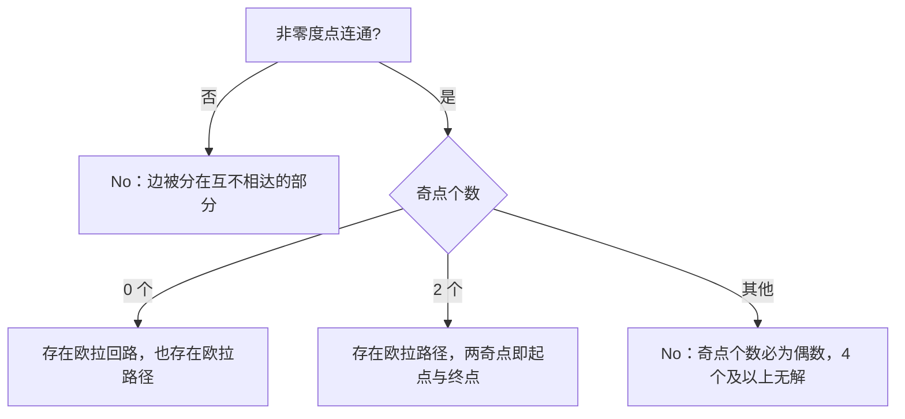

（掌握状态判定，写死：「已掌握」必须同时满足——(1) 六步叙事走完且每步验证动作通过；(2) 合卷手写核心代码 + g++ -std=c++17 编译通过 + 跑通⑥节边界数据集；(3) 能用大白话讲 5 分钟无卡壳。三者缺一，只可标「在学」。）

# 欧拉路径

## 零、知识地图

```text
欧拉路径
├── 1. 欧拉路径与欧拉回路 —— 一笔画四个概念：路径/回路、半欧拉图/欧拉图（前置：图的点、边、度数）
├── 2. 七桥问题与充要条件 —— 度数计数：奇点 0 或 2、非零度点连通（前置：1）
├── 3. Hierholzer 算法 —— 先 DFS 后入栈、回路拼接、删边与弧优化直觉（前置：2、DFS、栈）
├── 4. P2731 无向图实现 —— 矩阵扫描、字典序最小、重边计数（前置：2、3）
└── 5. P7771 有向图实现 —— 出入度判据、del[] 弧优化、邻接表排序（前置：3、4）

学习顺序：1 → 2 → 3 → 4 → 5。理由：先立概念（1），再立判定工具（2），然后学构造算法（3），最后按无向（4）与有向（5）两种图分别落成模板题——概念、判定、构造、实战四层递进。
```

## 一、为什么需要它

18 世纪的柯尼斯堡（现加里宁格勒）有 4 块陆地和 7 座桥，市民想找一条路线：每座桥恰好走过一次。所有人尝试都失败——这正是本篇的「碰壁题」，也是整个图论的起点（七桥背景属通识补充，A 源 slide 1 只讲「一笔画问题」）。为什么试不出来：桥的走法组合随桥数指数增长，而且「试」回答不了「为什么不可能」。欧拉 1736 年的破法是把陆地缩成点、桥缩成边，问题变成只跟「每块陆地连几座桥」（度数）有关：4 块陆地的桥数分别是 5、3、3、3，全是奇数，于是不可能——不需要试任何一条路线。

一句话预告：本篇讲「判定一笔画是否存在」（度数计数，$O(n+m)$，与点数边数同阶）与「构造一笔画路径」（Hierholzer 算法，$O(n+m)$），并落到两道模板题：P2731（无向图）与 P7771（有向图）。顺序理由：先会判定（知识点 2）再学构造（知识点 3），构造又分无向与有向两种实现（知识点 4、5）。

## 二、知识点逐讲（每个知识点一节，共 5 节）

### 1. 欧拉路径与欧拉回路：一笔画的四个概念

前置依赖：[[图的概念存储与遍历]]（点、边、度数、连通；本篇全部图论语言的地基）
后续衔接：[[#2. 七桥问题与充要条件：度数计数]]、[[#3. Hierholzer 算法：先 DFS 后入栈]]

**① 它解决什么问题**

A 源 slide 1 定义四个概念。**欧拉路径**：一条不重复地遍历完所有边的路径，因为像不重复地一笔画完所有边，涉及它的问题也叫「一笔画问题」。**欧拉回路**：在欧拉路径基础上回到起点——回路也是路径。按「图里有没有这种路径」给图分类：存在欧拉路径的图叫**半欧拉图**，存在欧拉回路的图叫**欧拉图**，所以欧拉图也是半欧拉图。本知识点只立语言，不涉及算法；判定与构造的复杂度账在知识点 2、3 兑现：判定存在性 $O(n+m)$，构造路径 $O(n+m)$。

**② 直觉理解**

模型级类比：**笔尖不抬起来的一笔画**。纸上的交点是顶点，线段是边；「不重复走完所有边」就是笔尖从某个交点出发、沿线段移动、每条线段只压一遍。小数据推演：三角形 1-2-3-1 加一条自环 3-3——从 1 出发走 1→2→3，在 3 顺手把自环绕一圈，再 3→1 收笔，这就是一条欧拉回路；三角形是欧拉图，加自环后仍是欧拉图（自环绕一圈进出自各「消耗」一条边，见③）。

**③ 原理与推导**

为什么欧拉回路是欧拉路径的特例：回到起点的路径本身「不重复遍历完所有边」，定义被包含，A 源 slide 1 原话「可以看出欧拉回路也是欧拉路径」。这里有一个本篇反复出现的词——**度数**（连接某顶点的边数，A 源 slide 1 特别注明：若一条边的两端是同一个顶点即自环，要计算两次）。为什么自环要算两次：沿自环走一圈，进这个点一次、出这个点一次，消耗的是两条「端口」，与两条不同的边等价。

关键性质先融进来（判定条件的完整推导在知识点 2）：

| 概念 | 图中存在什么 | 一句话判定方向 |
|------|------------|--------------|
| 欧拉路径 | 不重复走完所有边的路径 | 奇点 0 或 2 个 |
| 欧拉回路 | 上述路径且回到起点 | 奇点 0 个 |
| 半欧拉图 | 欧拉路径 | 判路径存在 |
| 欧拉图 | 欧拉回路 | 判回路存在 |

**设计动机**：为什么竞赛要把四个概念分开——起点和终点是否受限直接决定实现里「起点怎么选」（知识点 4 的最小编号奇点、知识点 5 的唯一出-入差为 1 的点），混用概念就会选错起点、丢边。

**④ 代码演示**

本节是概念节，代码只做「度数统计 + 奇点计数」这一最小可运行骨架（自编；判定条件与连通性在知识点 2 补全）：

```cpp
// 自编骨架：度数统计与奇点计数（自环度数加两次）
#include <iostream>
using namespace std;
int d[505];              // d[i]：顶点 i 的度数
int main() {
    int n, m;
    cin >> n >> m;
    for (int i = 0; i < m; i++) {
        int x, y;
        cin >> x >> y;
        d[x]++;
        d[y]++;          // 自环 x==y 时 d[x] 被加两次，恰好符合定义
    }
    int odd = 0;
    for (int i = 1; i <= n; i++)
        if (d[i] % 2 == 1) odd++;   // 奇点计数
    cout << "odd=" << odd << "\n";  // odd 的含义见知识点 2
    return 0;
}
```

**执行追踪表**（三角形加自环：边 (1,2)、(2,3)、(3,1)、(3,3)，n=3）：

| 步骤 | 当前元素 | 结构状态 | 动作 | 结果 |
|:---:|:---:|:---|:---|:---|
| 1 | 边 (1,2) | d 全 0 | d[1] 加 1，d[2] 加 1 | d=[1,1,0] |
| 2 | 边 (2,3) | d=[1,1,0] | d[2] 加 1，d[3] 加 1 | d=[1,2,1] |
| 3 | 边 (3,1) | d=[1,2,1] | d[3] 加 1，d[1] 加 1 | d=[2,2,2] |
| 4 | 边 (3,3) 自环 | d=[2,2,2] | x==y，d[3] 加两次 | d=[2,2,4] |
| 5 | 统计奇点 | d=[2,2,4] | 逐点查 d[i] 是否为奇 | odd=0（欧拉图候选） |

**错误写法对照**（自环度数与读边范围）：

```diff
- if (x != y) { d[x]++; d[y]++; } else d[x]++;   // 错：写成「自环只加一次」的人常常还顺手改了别的分支——直接后果是自环顶点度数少 1，奇偶性可能整体翻转（答案错）
+ d[x]++; d[y]++;   // 对：不特判，x==y 时自然加两次，与定义一致（A 源 slide 1 原话）
- for (int i = 1; i <= n; i++) if (d[i] % 2 == 1) odd++;   // 错（示意）：把循环写成 i <= n-1，漏掉最后一个点——奇点数少数一次，判定整体错位（答案错）
+ for (int i = 1; i <= n; i++) ...   // 对：n 个点全扫
```

**⑤ 典型应用**

- 真题：洛谷 P2731 [USACO3.3] 骑马修栅栏（A 源 slide 5 例题，知识点 4 实战）——先按本节统计度数、找奇点定起点。
- 真题：洛谷 P7771 【模板】欧拉路径（A 源 slide 4 例题，知识点 5 实战）——有向图版本，判度对象换成出度与入度。
- 迁移题（自编）：读入一张无向图，输出它是「欧拉图 / 半欧拉图 / 都不是」中的哪一类。题解：先统计奇点个数（本节骨架），再判非零度点连通性（知识点 2 的并查集骨架）——odd 为 0 且连通输出欧拉图；odd 为 2 且连通输出半欧拉图；否则都不是。建议先独立做，再对照题解。

**⑥ 坑点与边界**

> **【易错】** 自环度数只加一次。后果：奇点个数算错，判定整体翻转（WA）。正确写法是不特判，d[x] 与 d[y] 各加一次（④对照）。

> **【易错】** 忘了「欧拉回路也是欧拉路径」这层包含关系。后果：判回路时把「奇点 0 个」当成「不存在路径」，漏掉答案。回路是路径的特例，奇点 0 个的图既有回路也有路径（A 源 slide 1）。

> **【注意】** 四个概念全部以「边存在且能走全」为前提，孤立点（度数 0）不参与判定——这正是知识点 2 判定条件里「非零度节点连通」的原因。

> [!example]-
> **边界数据集（先自己跑一遍，再展开对照）**
> 1. 空图：n=1, m=0 → d 全 0，odd=0；零度点不参与判定，按约定空图算欧拉图（无路径需求则无输出，程序不崩）。
> 2. 单元素：n=1, m=1 的自环 (1,1) → d[1]=2，odd=0（自环不影响奇偶性——度数加 2 保持奇偶）。
> 3. 全相同：m 条重边 (1,2) → d[1]=d[2]=m；m 为偶数时是欧拉图，m 为奇数时 1、2 是仅有的两个奇点、是半欧拉图（重边逐条计数，不能去重）。
> 4. 严格递增：链 1-2, 2-3, 3-4（点编号递增构造）→ 两端 1、4 是奇点，中间点度 2，是半欧拉图，路径必为 1 到 4。
> 5. 严格递减：同上链反向输入 → 度数统计与输入顺序无关（加法交换律），结论不变。
> 6. 极值：n=500 全部点连成一个环加 501 条重边挂在 1 号点 → 度数大但只看奇偶；int 计数上限 2^31-1，m 在 10^5 量级内不会溢出（防溢出意识：若 m 达到 10^9 级才需要 long long）。

回扣开场：七桥问题的「不可能」，第一步就是把陆地缩成点、桥缩成边并数出 5、3、3、3 这四个度数。现在你能把任何一张图「翻译」成度数表了，下一节回答「什么样的度数表才存在一笔画」。

### 2. 七桥问题与充要条件：度数计数

前置依赖：[[#1. 欧拉路径与欧拉回路：一笔画的四个概念]]、[[并查集与种类并查集]]（连通性判定工具）
后续衔接：[[#3. Hierholzer 算法：先 DFS 后入栈]]、[[拓扑排序]]（同为「用度数/入度做存在性判定」的家族，延伸）

**① 它解决什么问题**

给出存在性的充要条件，让「一笔画能不能成」不用试任何路线、只数一遍度数就能回答，总复杂度 $O(n+m)$——与点数加边数同阶，一遍扫完。A 源 slide 2 原文：无向图中，存在欧拉路径的充要条件是「度数为奇数的点只能有 0 或 2 个」；存在欧拉回路的充要条件是「奇点个数为 0」；且非零度节点是连通的。有向图（slide 2）：存在欧拉回路的充要条件是所有点出度等于入度；存在欧拉路径的充要条件是「要么所有点出度=入度，要么除两个点外出度=入度，剩余两点一个出度-入度=1（起点）、一个入度-出度=1（终点）」。

**② 直觉理解**

模型级类比：**每个交点是一扇旋转门，进出必须配对**。笔尖经过一个中间点时，进一次消耗一条边、出一次消耗另一条边（A 源 slide 1 原话「进入该节点需要消耗一条边，而离开该节点需要消耗另一条边」），所以中间点度数必须是偶数，否则会被「困在」这个点里。用七桥的具体数字跑一遍：4 块陆地度数 5、3、3、3——如果走的是回路，连起点都要「离开又回来」配成对，度数也必须为偶；4 个点全是奇数，没有一个点能「进出配平」，所以回路不存在；而欧拉路径只允许起点（只出不进配不上）与终点（只进不出配不上）两个例外，4 个奇点远超 2 个，路径也不存在。这就是七桥问题的完整否证。

**③ 原理与推导**

无向图回路条件推导：对任意与起点不同的点，进入消耗一条边、离开消耗一条边，边两两配对，度数为偶；对起点，离开与回来同样配对，度数也为偶——所以「所有点度数为偶」是必要条件。充分性方向（为什么度全偶就一定走得完）由知识点 3 的 Hierholzer 算法顺便给出：算法构造成功本身就证明了存在（构造性证明）。

路径条件推导：路径的起点少一次「进」（或终点少一次「出」），所以恰好允许两个奇点——它们就是起点与终点；奇点为 0 时从任一点出发还能回到出发点，退化为回路。补一个「奇点不可能恰有 1 个」的兜底：所有点度数之和等于 $2m$（每条边给两端各贡献 1 度，自环贡献 2 度），总和是偶数，奇数度数的点只能成对出现（握手定理，通识补充，A 源未展开）。所以判定代码里奇点个数落在 {0, 2} 之外即无解，不存在「1 个奇点」的分支。

连通性前提推导：条件说的是「非零度节点连通」（A 源 slide 2 原话）。为什么：图不连通时，边被分在几个互不相达的部分里，从一部分出发永远走不到另一部分的边，「走完所有边」直接失败。孤立点度数为 0、没有边可走，不该把整图判死，所以把「全图连通」放宽成「非零度点连通」。

**设计动机**：为什么判定只看度数与连通性——一笔画对「怎么走」的全部约束都压缩在顶点的「进出配对」上；边的先后顺序约束是零，可以完全交给构造算法（知识点 3）去解决。判定与构造分工，判定才能做到 $O(n+m)$。

无向图结论（mermaid）：



文字版推导链：先查连通（并查集或一次 DFS/BFS），不连通直接判负；连通时数奇点，0 个则回路存在（路径也随之存在），2 个则路径存在且两奇点就是起终点；其余情况（由握手定理不会出现 1，出现 4 个以上）无解。

**④ 代码演示**

自编判定骨架（条件来源 A 源 slide 2；连通用并查集，见 [[并查集与种类并查集]] 的压缩 find）：

```cpp
// 自编骨架：无向图欧拉路径存在性判定，O(n+m)
#include <iostream>
using namespace std;
int fa[1005], d[1005];
int find(int x) { return x == fa[x] ? x : fa[x] = find(fa[x]); }  // 路径压缩
void unionSet(int x, int y) { fa[find(x)] = find(y); }
int main() {
    int n, m;
    cin >> n >> m;
    for (int i = 1; i <= n; i++) fa[i] = i;
    for (int i = 0; i < m; i++) {
        int x, y;
        cin >> x >> y;
        d[x]++;
        d[y]++;                  // 自环加两次，仍为偶数，正确
        if (x != y) unionSet(x, y);   // 非零度点做连通
    }
    int odd = 0, root = 0;
    bool ok = true;
    for (int i = 1; i <= n; i++) {
        if (d[i] == 0) continue;      // 孤立点不参与判定
        if (d[i] % 2 == 1) odd++;
        if (root == 0) root = find(i);
        else if (find(i) != root) ok = false;   // 非零度点不连通
    }
    if (ok && (odd == 0 || odd == 2)) cout << "Yes\n";
    else cout << "No\n";
    return 0;
}
```

**执行追踪表**（连通性反例：两组重边 (1,2)、(2,1)、(3,4)、(4,3)，n=4，m=4）：

| 步骤 | 当前元素 | 结构状态 | 动作 | 结果 |
|:---:|:---:|:---|:---|:---|
| 1 | 边 (1,2) | fa=[1,2,3,4] | d[1]=d[2]=1；union(1,2) | 1、2 同根 |
| 2 | 边 (2,1) | fa=[2,2,3,4] | d[1]=d[2]=2；find(2)==find(1) | 重边，合并跳过 |
| 3 | 边 (3,4) | fa=[2,2,3,4] | d[3]=d[4]=1；union(3,4) | 3、4 同根 |
| 4 | 边 (4,3) | fa=[2,2,4,4] | d[3]=d[4]=2；合并跳过 | 两组互不相达 |
| 5 | 统计 | odd=0 | root 初值 2，查到 3 时 find(3)=4 不等 | ok=false，输出 No |

**错误写法对照**：

```diff
- for (int i = 1; i <= n; i++) { ... if (root == 0) root = find(i); else if (find(i) != root) ok = false; }   // 错：把零度孤立点也拉进连通判定——图主体连通但有一个孤立点时被误判 No（答案错，A 源 slide 2 特意写「非零度节点」）
+ if (d[i] == 0) continue;   // 对：孤立点跳过，只判非零度点连通
- if (odd == 2) cout << "Yes";   // 错：漏掉 odd==0 的分支——欧拉回路图被误判（答案错）
+ if (ok && (odd == 0 || odd == 2)) cout << "Yes";   // 对：0 与 2 都存在欧拉路径
- if (x != y) { d[x]++; d[y]++; }   // 错：自环一次度数也不加——自环顶点奇偶性可能翻转（答案错）
+ d[x]++; d[y]++;   // 对：自环加两次，天然为偶
```

**⑤ 典型应用**

- 真题：洛谷 P7771 【模板】欧拉路径（A 源 slide 4）——第一步就是本节的有向图判度，不满足直接输出 No。
- 真题：洛谷 P1341 无序字母对（题号真实；把字母对看成边、字母看成点，问能否排成一条串使每对字母相邻一次）——无向欧拉路径判定的直接应用。
- 迁移题（自编）：n 个邮筒 m 条街道，问邮递员能否从任一邮筒出发每条街道走一次并回到出发点。题解：回路判定——非零度点连通且无奇点，套用④代码把输出改成对应判断即可。建议先独立做，再对照题解。

**⑥ 坑点与边界**

> **【易错】** 连通判定把孤立点算进去。后果：主体连通但含孤立点的图被误判 No（WA）。只判非零度点（④对照第一坑）。

> **【易错】** 只判 odd==2 忘了 odd==0。后果：欧拉图被判成「无路径」。回路是路径特例，0 个奇点同样有欧拉路径。

> **【注意】** 有向图判定里「出度-入度=1」与「入度-出度=1」的点必须各恰一个（两个「起点候选」会让路径丢边）；差值绝对值超过 1 直接 No（知识点 5 的 D 源代码按此实现）。

> [!example]-
> **边界数据集（先自己跑一遍，再展开对照）**
> 1. 空图：n=1, m=0 → 无非零度点，odd=0，连通判定空转，输出 Yes（约定空图可一笔画）。
> 2. 单元素：n=1, m=1 自环 (1,1) → d[1]=2，odd=0，输出 Yes。
> 3. 全相同：m 条重边 (1,2) → m 为偶输出 Yes（回路），m 为奇输出 Yes（路径，1、2 为起终点）；判定与重边无关，逐条计数即可。
> 4. 严格递增：链 1-2, 2-3, ..., (n-1)-n → 奇点恰为 1 与 n，输出 Yes。
> 5. 严格递减：同一条链反向输入 → 度数表与输入顺序无关，输出 Yes。
> 6. 极值：n=10^5, m=2×10^5 的星型+链混合图 → 判定仍是 $O(n+m)$ 一遍扫；并查集用路径压缩，最坏不退化（呼应 [[并查集与种类并查集]] 的均摊 $O(\alpha(n))$ 结论）。

回扣开场：七桥问题的答案已经不用试了——数出 4 个奇点，直接判负。现在你能回答「什么样的图存在一笔画」，接下来解决「怎么把这条路线真的走出来」。

### 3. Hierholzer 算法：先 DFS 后入栈

前置依赖：[[#2. 七桥问题与充要条件：度数计数]]、[[DFS]]（递归遍历框架）、[[栈与队列]]（结果栈的行为）
后续衔接：[[#4. P2731 无向图实现：矩阵扫描与字典序最小]]、[[#5. P7771 有向图实现：出入度判据与 del[] 弧优化]]

**① 它解决什么问题**

判定通过后，把欧拉路径或欧拉回路真正构造出来。A 源 slide 2-3 给出总纲：先通过度数判断是半欧拉图还是欧拉图，然后用 Hierholzer（希尔霍尔策）算法（基于 DFS）找路径。基本思想（slide 2 原话）：首先找到一个子回路，并逐步将其他回路合并到该子回路中，最终形成完整的欧拉回路。复杂度两档（B 源文件内两处注释各自成立）：朴素实现每次重扫已走边，为 $O(m(n+m))$；弧优化后每条边只被处理一次，为 $O(n+m)$——与点数边数同阶。

**② 直觉理解**

模型级类比：**探路日记倒着誊写**。你边走边遇到岔路：走到死胡同，说明从某点出发的一小段环已经闭合了；正着写日记会在死胡同处断掉，所以回溯时才把经过的点记在便签栈顶，走完全程后从栈顶往下读——后闭合的小环排在栈的上层，倒读时它们恰好「插队」到正确位置。这个类比管住三件事：为什么不能边走边输出、为什么用栈、为什么倒序读。

小数据推演（8 字形：两个圈共享点 1，边 1-2、2-3、3-1、1-4、4-5、5-1，全部度数偶，从 1 出发）：走到 1 后先沿一个圈走回 1，1 还有没用过的边，继续沿另一个圈走回 1，此时 1 无边可走、入栈；回溯途中 5、4、3、2 依次入栈，最后 1 再次入栈。从栈顶往下读得到的行走序列是 1 5 4 1 3 2 1（B 源扫描顺序下的结果，见④追踪表）——两段小环首尾相接，恰好不重不漏走完 6 条边。

**③ 原理与推导**

核心问题是 slide 3 末尾那句提问：「如果是欧拉路径，不能先输出 x 后 dfs(v)，why？」答案在 slide 4：**因为存在死胡同**。运行过程中先遍历某个点 x，它的入边走完后出边也可能全没了，但图里还有别的边没走——若此刻把 x 输出，输出序列就断了。A 源 slide 4 给出的修法原话：「先 DFS，后记录答案（入栈）」，这样保证记录 x 时 x 的出边已经全部找完，x 是「尚未记录路径段」的终点，相当于从终点向起点补录，倒序输出即为从起点出发的欧拉路径。

用「回路拼接」的语言再说一遍：每段路径走到走不通时，刚走完的一定是一个闭合的小回路（回路里每个点进出配平）；回溯入栈把小回路按「闭合先后」压进栈，弹栈（倒读）时后闭合的小回路先出现——它们插在大回路的中间位置，拼接结果不重不漏。为什么用栈而不是数组正序存：正序无法表达「后闭合先插队」这层顺序，栈的先进后出恰好免费提供倒序。

**设计动机**：为什么算法叫「逐步合并回路」却只需一次 DFS——合并动作被压缩进回溯时机里：递归展开时探索新边，回溯入栈时完成拼接，两个步骤共用同一棵递归树（A 源 slide 3 原话「通过一段精妙的代码，将算法流程中的两个步骤合并到同一个 DFS 过程中」）。

**④ 代码演示**

取自 B 源 Hierholzer模板.cpp 的弧优化版 DFS（改动：仅摘出骨架、加注释；main 与建图见知识点 4、5 的两道模板题）：

```cpp
// 取自 Hierholzer模板.cpp（弧优化版），骨架原样
struct edge { int v, next; bool del; } e[maxm * 2];   // 链式前向星：无向边成对存，i 与 i^1 互为反边
int head[maxn];                                        // head[u]：u 的边链表头
stack<int> ansv;                                       // 回溯时经过的点压入此栈
void DFS(int u) {
    for (int i = head[u]; i != -1; i = head[u]) {      // 每轮重读 head[u]：弧优化的关键
        if (e[i].del) {
            head[u] = e[i].next;                       // 已走的边直接从链上摘掉，永不重扫
            continue;
        }
        e[i].del = e[i ^ 1].del = true;                // 成对删边：正向边与反向边一起标记
        DFS(e[i].v);
    }
    ansv.push(u);                                      // 出边全走完才入栈（为什么见③）
}
// 输出：自顶向下弹出 ansv，即为从起点出发的欧拉路径
```

**执行追踪表**（8 字形 6 边：1-2、2-3、3-1、1-4、4-5、5-1；链式前向星扫描序为插入逆序，1 的出边依次是 5、4、3、2）：

| 步骤 | 当前元素 | 结构状态 | 动作 | 结果 |
|:---:|:---:|:---|:---|:---|
| 1 | dfs(1) | 1 出边序 5,4,3,2 | 取 1→5，成对删边 | 进入 dfs(5) |
| 2 | dfs(5) | 5 出边序 1(已删),4 | 跳过已删边，取 5→4 | 进入 dfs(4) |
| 3 | dfs(4) | 4 出边序 5(已删),1 | 取 4→1 | 进入 dfs(1) 第 2 次 |
| 4 | dfs(1) | 1 剩 4(已删),3,2 | 跳过已删边，取 1→3 | 进入 dfs(3) |
| 5 | dfs(3) | 3 出边序 1(已删),2 | 取 3→2 | 进入 dfs(2) |
| 6 | dfs(2) | 2 出边序 3(已删),1 | 取 2→1 | 进入 dfs(1) 第 3 次 |
| 7 | dfs(1) | 1 的出边全部已删 | 无边可走，push(1) | 栈：[1] |
| 8 | 逐层回溯 | 2,3,1,4,5 各自出边已尽 | 依次 push | 栈自底到顶：1,2,3,1,4,5,1 |
| 9 | 弹栈输出 | — | 自顶向下弹出 | 输出 1 5 4 1 3 2 1（6 边各走一次） |

**错误写法对照**：

```diff
- void DFS(int u) { for (每条未删边 i) { ansv.push(u); e[i].del = true; DFS(e[i].v); } }   // 错：先入栈再递归——死胡同处输出断路，没走的边整段丢失（答案错；A 源 slide 4「不能先输出 x 后 dfs」）
+ void DFS(int u) { /*先递归走完所有出边*/ ansv.push(u); }   // 对：回溯时入栈，记录时 u 的出边已全部找完
- e[i].del = true;   // 错：无向图只标记正向边——反向边 e[i^1] 仍在邻接表里，下一步原路返回把同一条边再走一遍（路径含重复边，答案错）
+ e[i].del = e[i ^ 1].del = true;   // 对：i 与 i^1 是同一无向边的一对弧，成对删除（B 源原式）
- for (int i = head[u]; i != -1; i = e[i].next)   // 错：朴素写法每次从链头重扫已删边——已删边越积越多，最坏 O(m(n+m))（TLE，B 源注释掉的无优化版即此形态）
+ for (int i = head[u]; i != -1; i = head[u]) { if (e[i].del) { head[u] = e[i].next; continue; } ... }   // 对：弧优化，已删边从链头摘除，O(n+m)
```

**⑤ 典型应用**

- 真题：洛谷 P2731（A 源 slide 5）——无向图 + 邻接矩阵写法，知识点 4 全流程。
- 真题：洛谷 P7771（A 源 slide 4）——有向图 + vector 邻接表 + del[] 弧优化，知识点 5 全流程。
- 延伸（非必需，题号真实）：力扣 332 重新安排行程——机票对看成有向边，求字典序最小欧拉路径，思想同 P7771。
- 迁移题（自编）：给定有向图，只要求输出任意一条欧拉路径、不要求字典序。题解：D 源代码删掉 sort 一行即可（排序只为字典序服务），判定与 DFS 不动。建议先独立做，再对照题解。

**⑥ 坑点与边界**

> **【易错】** 先输出再递归（或先 push 再递归）。后果：死胡同处断路（WA）。回溯时入栈（④对照第一坑，A 源 slide 4）。

> **【易错】** 无向图删边只删单向。后果：同一条边被来回走两次，路径含重复边（WA）。成对删除 `e[i].del = e[i^1].del = true`。

> **【注意】** 递归深度等于路径长度，m 达到 2×10^5 时递归可能触栈限制；素材未覆盖手动栈改写，属补充提示——实战中若担心爆栈，可用显式栈模拟递归。这一段我不确定各 OJ 默认栈的精确阈值，以实际评测为准。

> [!example]-
> **边界数据集（先自己跑一遍，再展开对照）**
> 1. 空图：m=0 → dfs(st) 一步入栈，输出单个起点（行走序列长 1，0 条边，合法）。
> 2. 单元素：n=1, m=1 自环 (1,1) → 走自环回到 1，输出 1 1（有向图下一节同款）。
> 3. 全相同：m 条重边 (1,2) → 路径在 1、2 间往返，奇偶决定终点在 1 还是 2，弹栈输出长 m+1。
> 4. 严格递增：链 1-2, 2-3, 3-4 → 无岔路，dfs 一路深入到底后整条回溯，输出即路径正序 1 2 3 4。
> 5. 严格递减：同链反向输入 → 输出按实际编号仍为编号序列，与输入顺序无关。
> 6. 极值：m=2×10^5 的纯链 → 递归深度 2×10^5，见【注意】的栈深提示；弧优化下每条边只扫一次，$O(n+m)$ 量级 10^5 级瞬间完成。

回扣开场：判定告诉我们「能不能走」，Hierholzer 告诉我们「怎么走」。现在你能把一笔画路线构造出来了——下一节把它落成无向图模板题 P2731。

### 4. P2731 无向图实现：矩阵扫描与字典序最小

前置依赖：[[#2. 七桥问题与充要条件：度数计数]]、[[#3. Hierholzer 算法：先 DFS 后入栈]]
后续衔接：[[#5. P7771 有向图实现：出入度判据与 del[] 弧优化]]（有向图版的判度与存储都不同）

**① 它解决什么问题**

洛谷 P2731 [USACO3.3] 骑马修栅栏 Riding the Fences（A 源 slide 5 例题）：F 条栅栏连接若干顶点（顶点编号不超过 500），可能重边；求经过每条栅栏恰好一次的路径，多解时输出「500 进制表示下最小」的一组（即逐位比编号，越小越优先），每行输出一个顶点号。A 源 slide 5 给出五条关键读题结论：栅栏连通（无向连通图）；起点终点任意（找欧拉路径，要选起点，回路时用最小编号做起点）；题目保证有解（不用判 No）；500 进制即字典序最小（slide 5 原话「五百进制表示法」）；数据范围不大，直接邻接矩阵存图跑 Hierholzer。复杂度：矩阵版每次 dfs 扫编号全区间，总扫描 $O((m+1)V)$，$V \le 500$、m 为千级时约 $10^5$ 到 $10^6$，时限 1 秒内轻松通过。题面数字在网页提取中部分丢失，顶点上限按源码数组口径 $V \le 500$（C 源 `g[505][5005]`），栅栏数上限这一段我不确定精确值，以洛谷原题面为准。

**② 直觉理解**

模型级类比沿用知识点 3 的**探路日记倒着誊写**，这里补它的无向图版细节：重边在矩阵里是计数 $g[x][y]$，走一次减一，减到 0 才算走完。小数据推演（三角加尾巴：边 1-2、2-3、3-1、3-4）：度数 2、2、3、1，奇点是 3 和 4，起点取最小编号奇点 3；从 3 出发每步挑编号最小的可走点：3→1→2→3→4，输出 3 1 2 3 4——正是 4 条边各走一次的路径。

**③ 原理与推导**

起点怎么选（A 源 slide 5 原话「找欧拉路径，即不保证是回路，要找起点。如果是回路，用最小编号做起点」）：存在奇点时从最小编号奇点出发（奇点必为起终点，知识点 2）；无奇点时从最小编号点出发。为什么矩阵版不用排序就有字典序：内层循环 `for (y = mini; y <= maxi; y++)` 按编号从小到大扫描，天然优先走小编号邻接点（A 源 slide 4 对同类问题的表述：「靠前的位置应尽可能小，使每次转移的点尽量小」）；对比 slide 4 原话，链式前向星不方便排序，所以有向图那题改用 vector（知识点 5），而矩阵扫描天然有序。字典序贪心的严格证明 A 源未给出，正文只给直觉论证（每一步在合法选择中取最小编号，靠前位尽可能小）并以官方样例实测兜底；严格证明这一段我不确定能在不超纲的前提下讲清，登记附录 B-3。

为什么重边用计数：两顶点间可能有多个栅栏（题面原文），矩阵格子存「剩余条数」而非 0/1，删边是减一不是清零。

**④ 代码演示**

取自 C 源 P2731.cpp（改动：仅删去未使用的 include 与空行、补充注释；建图、起点选择、DFS、输出逻辑逐行原样）：

```cpp
// 取自 P2731.cpp，逻辑原样；删未用 include，加注释
#include <cstdio>
#include <algorithm>
#include <stack>
using namespace std;
int g[505][5005];          // g[x][y]：x y 间的栅栏条数（重边计数）
int d[505];
stack<int> ans;
int st, mini = 505, maxi = -1;
void dfs(int x) {
    for (int y = mini; y <= maxi; y++) {   // 编号从小到大扫：字典序最小的来源
        if (g[x][y] > 0) {
            g[x][y]--;
            g[y][x]--;                     // 双向删边（C 源注释：没有弧优化）
            dfs(y);
        }
    }
    ans.push(x);                           // 回溯入栈
}
int main() {
    int m, x, y;
    scanf("%d", &m);
    for (int i = 1; i <= m; i++) {
        scanf("%d %d", &x, &y);
        mini = min(mini, min(x, y));
        maxi = max(maxi, max(x, y));
        g[x][y]++;
        g[y][x]++;
        d[x]++;
        d[y]++;
    }
    st = mini;                             // 先默认最小编号点
    for (int i = mini; i <= maxi; i++)
        if (d[i] % 2 == 1) { st = i; break; }   // 有奇点：最小编号奇点做起点
    dfs(st);
    while (!ans.empty()) {
        printf("%d\n", ans.top());
        ans.pop();
    }
    return 0;
}
```

**执行追踪表**（三角加尾巴 4 边：1-2、2-3、3-1、3-4；奇点 3、4，起点 3）：

| 步骤 | 当前元素 | 结构状态 | 动作 | 结果 |
|:---:|:---:|:---|:---|:---|
| 1 | dfs(3) | 剩边 3-1,1-2,2-3,3-4 | y=1 最小有边，双向删 3-1 | 进入 dfs(1) |
| 2 | dfs(1) | 剩边 1-2,2-3,3-4 | y=2，双向删 1-2 | 进入 dfs(2) |
| 3 | dfs(2) | 剩边 2-3,3-4 | y=1 无边（1-2 已双向删）；y=3，删 2-3 | 进入 dfs(3) 第 2 次 |
| 4 | dfs(3) | 剩边 3-4 | y=1,2,3 均已删；y=4，删 3-4 | 进入 dfs(4) |
| 5 | dfs(4) | 剩边 无 | 无边可走，push(4) | 栈：[4] |
| 6 | 逐层回溯 | — | 3,2,1 依次 push，回到 dfs(3) 首帧再 push(3) | 栈自底到顶：4,3,2,1,3 |
| 7 | 弹栈输出 | — | 自顶向下弹出 | 输出 3 1 2 3 4（4 边各一次） |

**错误写法对照**：

```diff
- g[x][y]--;   // 错：只删单向——g[y][x] 仍在，下一步原路返回把同一栅栏再走一遍（路径含重复边，答案错）；矩阵版没有 i^1 配对，必须手写两行
+ g[x][y]--; g[y][x]--;   // 对：无向边双向删（C 源原样）
- int st;   // 错（示意）：忘初始化 st 就开找奇点——全偶图（欧拉回路）时 st 是随机值，dfs 从非法点出发全图丢边（RE/WA）
+ st = mini; for (int i = mini; i <= maxi; i++) if (d[i] % 2 == 1) { st = i; break; }   // 对：先默认最小编号点，再被最小编号奇点覆盖（C 源原样）
- for (int y = 1; y <= maxi; y++)   // 错（示意）：扫描下界写死 1——本题编号从 1 开始无碍，但 mini 记录的写法对任意编号区间都稳（防越界意识）
+ for (int y = mini; y <= maxi; y++)   // 对：C 源原样，扫描区间随输入收缩
```

**⑤ 典型应用**

- 真题：P2731 本题。官方样例实测（附录 B-5）：输入 9 条栅栏，输出 1 2 3 4 2 5 4 6 5 7，逐位比对一致。
- 真题：P1341 无序字母对——把 52 个大小写字母当顶点、字母对当边，同一套「矩阵计数 + 最小编号奇点起点」直接迁移。
- 迁移题（自编）：栅栏改造题——每条栅栏有编号，输出路径上栅栏编号序列而非顶点序列。题解：矩阵格子里多存一条「第几条边」，递归走边时把边号压栈即可。建议先独立做，再对照题解。

**⑥ 坑点与边界**

> **【易错】** 矩阵版删边只删 g[x][y]。后果：原路返回重复走同一条边（WA）。必须 g[y][x] 同步减一（④对照第一坑）。

> **【易错】** 重边当 0/1 存。后果：第二条平行边永远走不了，路径缺边（WA）。格子存条数，删边减一。

> **【注意】** 起点规则是「最小编号奇点优先，否则最小编号点」——两句话缺一不可（C 源 `st = mini` 先行、奇点覆盖在后）。

> [!example]-
> **边界数据集（先自己跑一遍，再展开对照）**
> 1. 空图：m=0 → mini/maxi 不更新（505/-1），无输出；实战题面保证 m 至少 1，此处只验证不崩。
> 2. 单元素：m=1 栅栏 (1,2) → 奇点 1、2，起点 1，输出 1 2。
> 3. 全相同：m=4 条重边 (2,3) → d[2]=d[3]=4 无奇点，起点取最小编号点 2；行走序列在 2、3 间往返共 4 条边，栈回溯后弹栈输出 2 3 2 3 2（m+1=5 个数）。
> 4. 严格递增：链 1-2, 2-3, 3-4 → 输出 1 2 3 4。
> 5. 严格递减：同链倒序输入 → 建图结果相同，输出 1 2 3 4。
> 6. 极值：500 个点连成环再挂 1000 条重边 → 矩阵扫描 $O((m+1) \cdot 500)$ 约 $10^6$，1 秒内通过；内存 $505 \times 5005$ 个 int 约 10MB，512MB 限制内无压力。

回扣开场：现在你能解决开场那个七桥式问题了——判定靠知识点 2 的度数表，构造靠知识点 3 的先 DFS 后入栈，起点选择用的是「最小编号奇点」规则。下一节把同一套思想搬到有向图。

### 5. P7771 有向图实现：出入度判据与 del[] 弧优化

前置依赖：[[#3. Hierholzer 算法：先 DFS 后入栈]]、[[#4. P2731 无向图实现：矩阵扫描与字典序最小]]
后续衔接：[[拓扑排序]]（同用入度/出度的有向图家族，延伸）；实战可直接做力扣 332

**① 它解决什么问题**

洛谷 P7771 【模板】欧拉路径（A 源 slide 4 例题）：求有向图字典序最小的欧拉路径；题面保证把有向边视为无向边后图连通（网页题面原文），但**不保证欧拉路径存在**，不存在输出 No。A 源 slide 4 给出两条思路：其一，先根据度判断是否为半欧拉图（判据是知识点 2 的有向图版本：出度=入度，或恰一个出-入差为 1 的起点与一个入-出差为 1 的终点），不是则输出 No；其二，字典序靠「每个点的出边按终点编号排序」实现，链式前向星不方便排序，改用 vector 模拟邻接表；按数据范围需要弧优化——新开数组 st[] 记录「访问到哪个位置」，即该删除哪条边（D 源实现里这个数组叫 del[]）。复杂度：排序 $O(m \log m)$ 主导，DFS 经 del[] 弧优化后 $O(n+m)$，合计与 $O(m \log m)$ 同阶；m 达到 $2 \times 10^5$ 量级时无弧优化的朴素重扫会到 $10^{10}$ 级，必超时。数据范围数字在网页提取中丢失，按源码数组口径 $n \le 10^5$、$m \le 2 \times 10^5$（D 源数组 100005），精确边界这一段我不确定，以洛谷原题面为准。

**② 直觉理解**

模型级类比：**书签**。del[x] 是夹在第 x 本书（x 的邻接表）里的书签，读到第几条出边就记下来；下次再翻这本书直接从书签处继续，看过的页永不重读。「删边」因此不是真删，而是书签推进——这正是弧优化的本质。小数据推演直接用官方样例 1（4 点 6 边，含自环 3→3）：排序后 g[1]={2,3}、g[2]={1}、g[3]={3,4}、g[4]={2}，判度得起点 1（出-入=1 唯一），DFS 走 1→2→1→3→3→4→2，弹栈输出 1 2 1 3 3 4 2（完整追踪见④）。

**③ 原理与推导**

为什么朴素写法会超时：朴素 DFS 每次都从邻接表下标 0 重扫，已走边只能靠标记跳过——最坏情况下每层递归重扫整张表，总代价退化到 $O(nm)$ 量级（$10^5 \times 2 \times 10^5$ 规模必死）。del[x] 推进后，x 的每条出边从书签左侧永久移出视野，全局每条边只被扫到一次，DFS 总代价 $O(n+m)$（A 源 slide 4 原话「弧优化过的 Hierholzer 算法」）。

**设计动机**：为什么书签要写在 del[] 数组里而不是 DFS 的局部变量 i——递归返回后循环条件重读 `i = del[x]`，局部变量跨不过递归边界，全局书签才能让「回溯后继续从断点走」成立（D 源循环写法 `for (int i = del[x]; i < g[x].size(); i = del[x])` 的含义就在这）。

为什么起终点判据长这样：起点比中间点多「出」一次（out-in=1），终点多「进」一次（in-out=1），其余点进出配平——与知识点 2 无向图奇点论证同构，方向换成边的方向。回路情形（flag 不被打破）所有点出=入，从任一点出发均可，D 源取 st=1。

**④ 代码演示**

取自 D 源 P7771.cpp（改动：仅删去未使用的 include 与空行、补充注释；判定、排序、DFS、输出逻辑逐行原样）：

```cpp
// 取自 P7771.cpp，逻辑原样；删未用 include，加注释
#include <cstdio>
#include <vector>
#include <algorithm>
#include <stack>
using namespace std;
int n, m;
vector<int> g[100005];
int ind[100005];               // 入度
int outd[100005];              // 出度
stack<int> ans;
int st;
int del[100005];               // 书签：del[x]==k 表示 x 的邻接表从下标 k 开始是未走边
void dfs(int x) {
    for (int i = del[x]; i < (int)g[x].size(); i = del[x]) {
        del[x] = i + 1;        // 先推书签再递归：这条出边永不重扫（D 源注释：弧优化）
        dfs(g[x][i]);
    }
    ans.push(x);               // 回溯入栈
}
int main() {
    scanf("%d %d", &n, &m);
    int x, y;
    for (int i = 1; i <= m; i++) {
        scanf("%d %d", &x, &y);   // x--->y
        g[x].push_back(y);
        outd[x]++;
        ind[y]++;
    }
    for (int i = 1; i <= n; i++)
        sort(g[i].begin(), g[i].end());   // 保证字典序最小（D 源注释）
    st = 1;
    int flag = 1;                  // 是否回路
    int c[2] = {0, 0};             // c[0]：入-出=1 的终点数；c[1]：出-入=1 的起点数
    for (int i = 1; i <= n; i++) {
        if (ind[i] != outd[i]) {
            flag = 0;
            if (abs(ind[i] - outd[i]) != 1) { printf("No\n"); return 0; }
            if (outd[i] - ind[i] == 1) { c[1]++; st = i; }
            else c[0]++;
        }
    }
    if (flag == 0 && (c[1] != 1 || c[0] != 1)) { printf("No\n"); return 0; }
    dfs(st);                       // 回路情形 st 保持 1
    while (!ans.empty()) {
        printf("%d ", ans.top());
        ans.pop();
    }
    printf("\n");
    return 0;
}
```

**执行追踪表**（官方样例 1：边 1→3、2→1、4→2、3→3、1→2、3→4；排序后 g[1]={2,3}, g[2]={1}, g[3]={3,4}, g[4]={2}；判度：1 号出-入=1 为起点）：

| 步骤 | 当前元素 | 结构状态 | 动作 | 结果 |
|:---:|:---:|:---|:---|:---|
| 1 | dfs(1) | del 全 0 | 取 g[1][0]=2，del[1]=1 | 进入 dfs(2) |
| 2 | dfs(2) | del[1]=1 | 取 g[2][0]=1，del[2]=1 | 进入 dfs(1) 第 2 次 |
| 3 | dfs(1) | del[1]=1 | 取 g[1][1]=3（1→2 已书签屏蔽），del[1]=2 | 进入 dfs(3) |
| 4 | dfs(3) | del[3]=0 | 取 g[3][0]=3（自环），del[3]=1 | 进入 dfs(3) 第 2 次 |
| 5 | dfs(3) | del[3]=1 | 取 g[3][1]=4，del[3]=2 | 进入 dfs(4) |
| 6 | dfs(4) | del[4]=0 | 取 g[4][0]=2，del[4]=1 | 进入 dfs(2) 第 2 次 |
| 7 | dfs(2) | del[2]=1=表长 | 无边可走，push(2) | 栈：[2] |
| 8 | 逐层回溯 | 4,3,3,1,2 依次书签到底 | 依次 push | 栈自底到顶：2,4,3,3,1,2,1 |
| 9 | 弹栈输出 | — | 自顶向下弹出 | 输出 1 2 1 3 3 4 2（官方样例一致） |

**错误写法对照**：

```diff
- for (int i = 0; i < (int)g[x].size(); i++) { if (used[x][i]) continue; ... }   // 错：每层从 0 重扫已走边——m=2e5 时退化到 10^10 级（TLE），A 源 slide 4 要求「弧优化」正是在消灭这种重扫
+ for (int i = del[x]; i < (int)g[x].size(); i = del[x]) { del[x] = i + 1; ... }   // 对：书签推进，每条边全局只扫一次（D 源原式）
- if (outd[i] - ind[i] == 1) { c[1]++; st = i; }   // 错：漏掉「起点必须恰一个」的检查——两个出-入差为 1 的点会让 st 被后者覆盖，路径丢边（答案错）
+ if (flag == 0 && (c[1] != 1 || c[0] != 1)) { printf("No\n"); return 0; }   // 对：起终点各恰一个才存在欧拉路径（D 源原式）
- // 忘写 sort
+ for (int i = 1; i <= n; i++) sort(g[i].begin(), g[i].end());   // 对：不排序则字典序不是最小（答案错），这是本题「关键字：字典序最小」的直接要求（A 源 slide 4）
```

**⑤ 典型应用**

- 真题：P7771 本题。官方样例实测（附录 B-5）：样例 1 输出 1 2 1 3 3 4 2，样例 2 输出 1 2 3 4 3 5，样例 3 输出 No，逐位比对一致。
- 真题：洛谷 P2731——同一算法的无向图镜像，对比两题差异（判度对象、删边方式、存储结构）是最好的复习材料。
- 延伸（非必需，题号真实）：力扣 332 重新安排行程——n 张机票求字典序最小行程，有向欧拉路径应用。
- 迁移题（自编）：有向图邮路——判断能否从 1 号点出发每条有向街道走一次回到 1 号点。题解：判据收紧为「所有点出度=入度」（回路判据，知识点 2），满足则 dfs(1) 后验证弹栈长度为 m+1。建议先独立做，再对照题解。

**⑥ 坑点与边界**

> **【易错】** 忘写 sort 或只给部分点排序。后果：字典序不是最小（WA）。全部 n 个点的邻接表都要排（④对照第三坑）。

> **【易错】** 起终点计数检查漏写（c[0]、c[1]）。后果：多个「起点候选」时 st 被覆盖，路径丢边（WA）或对有解图误输出（④对照第二坑）。

> **【注意】** 输出格式是空格分隔一行（D 源 `printf("%d ", ...)`），No 是大写 N 小写 o——样例比对时留意。

> [!example]-
> **边界数据集（先自己跑一遍，再展开对照）**
> 1. 空图：n=1, m=0 → 所有度全 0，flag=1，输出 1（单点即合法路径）。
> 2. 单元素：n=1, m=1 自环 1→1 → 出=入=1，输出 1 1。
> 3. 全相同：m 条重边 1→2 → 起点 1（出多入少），路径 1 2 1 2...；若 m 条 1→1 自环，输出 1 后跟 m 个 1。
> 4. 严格递增：链 1→2, 2→3, 3→4 → 无分支，输出 1 2 3 4。
> 5. 严格递减：链 4→3, 3→2, 2→1 → 起点 4，输出 4 3 2 1（编号从大到小，排序不改变唯一路径）。
> 6. 极值：n=10^5, m=2×10^5 → 排序 $O(m \log m)$ 约 $4 \times 10^6$ 次比较，DFS $O(n+m)$；递归深度上限 m，见知识点 3 的栈深提示；del 数组与邻接表合计内存约 2×10^5 级 int，128MB 内无压力。

回扣开场：现在你能完整解决开场那个七桥式问题了——无向图判定与构造（知识点 2、3）落到 P2731（知识点 4），有向图的出入度判据与书签式弧优化落到 P7771（知识点 5）。一笔画问题从「试出来的绝望」变成了「数一遍度数 + 走一遍 DFS」的两步机械流程。

## 三、全篇坑点总表

| # | 坑 | 正解 |
|---|-----|------|
| 1 | 自环度数只加一次 | d[x] 与 d[y] 各加一次，自环自然加二（知识点 1④） |
| 2 | 连通判定把孤立点算进去 | 只判非零度点连通（知识点 2④） |
| 3 | 只判奇点 2 个漏了 0 个 | odd==0 与 odd==2 都存在欧拉路径（知识点 2④） |
| 4 | 先输出再递归（死胡同断路） | 回溯时入栈，最后倒序输出（知识点 3④） |
| 5 | 无向图删边只删单向 | 成对删除 e[i] 与 e[i^1]，矩阵版双向减一（知识点 3、4④） |
| 6 | 朴素重扫已走边 | 弧优化：head 推进或 del[] 书签（知识点 3、5④） |
| 7 | 重边当 0/1 存 | 矩阵格子存条数，走一次减一（知识点 4④） |
| 8 | 起点规则不完整 | 最小编号奇点优先，无奇点用最小编号点（知识点 4④） |
| 9 | 有向图起终点计数漏检 | 出-入=1 与入-出=1 各恰一个，否则 No（知识点 5④） |
| 10 | 邻接表忘排序 | 全部点 sort，否则字典序不是最小（知识点 5④） |

## 四、总结与自测

### 核心内容（一页纸速览）

- **四个概念**（A 源 slide 1）：欧拉路径=不重复走完所有边的路径；欧拉回路=回到起点（也是路径）；半欧拉图=有欧拉路径的图；欧拉图=有欧拉回路的图。
- **无向判定**（A 源 slide 2）：非零度点连通，且奇点 0 或 2 个——0 即回路，2 即路径；奇点个数由握手定理保证为偶数。
- **有向判定**（A 源 slide 2）：回路=全点出度等于入度；路径=全配平，或恰一个出-入=1 的起点与一个入-出=1 的终点。
- **Hierholzer**（A 源 slide 3-4、B 源）：先 DFS 后入栈——记录某点时它的出边已全部走完，倒序输出即欧拉路径；本质是回路逐步拼接，一次 DFS 完成。
- **P2731 无向模板**（C 源）：矩阵计数存重边、双向删边、从小到大扫描得字典序最小、起点取最小编号奇点。
- **P7771 有向模板**（D 源）：vector 邻接表排序得字典序、出入度判 No、del[] 书签弧优化把 DFS 压到 $O(n+m)$。

### 前置概念清单

- [[图的概念存储与遍历]]：点、边、度数、连通——全篇语言底座。
- [[DFS]]：递归遍历框架——Hierholzer 的载体。
- [[栈与队列]]：先进后出——倒序输出的机制。
- [[并查集与种类并查集]]：连通判定工具——知识点 2 判定代码的连通部分。
- 递归（C 基础）：追踪表中「逐层回溯」的含义。

### 自测清单

- [ ] 能对任一张不超过 6 点的小图手算度数表并说出是否存在欧拉路径/回路
- [ ] 能复述「为什么不能先输出 x 再 dfs」并用 8 字形图演示回溯入栈
- [ ] 能默写无向图成对删边的两种写法（矩阵双向减一 / 前向星 i^1）
- [ ] 能说清 del[] 书签把复杂度从 $O(nm)$ 量级压到 $O(n+m)$ 的原因
- [ ] 能手推 P7771 官方样例 1 的完整追踪表（含自环 3→3）
- [ ] 能不看笔记写出两个模板的判定与起点选择代码

### 错题登记

| 题号 | 错因 | 正解要点 |
|------|------|---------|
| （学完后填写） | | |

## 五、语法糖对照表

| 语法 | 等价 C 写法 | 一句话用途 |
|------|------------|-----------|
| `stack<int> ansv;` + `push/top/pop` | 手写 `int stk[N], top;` 数组栈 | 存回溯点，倒序弹出的载体（B/C/D 源均用） |
| `vector<int> g[N];` + `push_back` | `int g[N][M], len[N];` 二维数组加长度 | 变长邻接表（D 源） |
| `sort(g[i].begin(), g[i].end())` | 手写 qsort 或插入排序 | 邻接表升序=字典序最小（D 源） |
| `g[i].size()` | `len[i]` | 邻接表当前长度（D 源，比较时强转 int） |
| `min/max` | `x < y ? x : y` | 起点与扫描区间维护（C 源） |
| `bool` 类型 | `int` 取 0/1 | 删边标记（B 源 e[i].del） |

---

## 附录（供验收，正文之外，不影响阅读）

### 附录 A　源文件覆盖对账

#### A-1 提取表

| 源文件 | 提取方式 | 完整性 |
| --- | --- | --- |
| 24.欧拉路径.pptx | 脚本化文本提取，产出 提取文本\24.欧拉路径.txt（META 行：pages=5 pics=0 chars=2124） | 完整：slide 1 定义与度数论证、slide 2 充要条件与 Hierholzer 思想、slide 3 DFS 合并与起点选择、slide 4 死胡同原理与 P7771 思路、slide 5 P2731 思路与下节预告。pics=0 与 zlib 统计口径可能存在误差：本篇全部结论仅依赖文本层，图片（若实际存在）不影响提取完整性，如实注明 |
| Hierholzer模板.cpp | 全文直读（96 行） | 完整：链式前向星 + 成对删边 + head 弧优化；文件尾自带 9 边自造图注释（A-3 登记 2） |
| P2731.cpp | 全文直读（63 行） | 完整：邻接矩阵计数 + 最小编号奇点起点 + 回溯入栈 |
| P7771.cpp | 全文直读（86 行） | 完整：出入度判定 + 邻接表排序 + del[] 弧优化 |

#### A-2 知识点总清单（5 对 5）

| 序号 | 知识点 | 对应源文件 | 优先级 |
|------|--------|-----------|--------|
| 1 | 欧拉路径与欧拉回路定义（一笔画四概念） | A 源 slide 1 | P0 |
| 2 | 七桥问题与充要条件（度数计数） | A 源 slide 1-2 | P0 |
| 3 | Hierholzer 算法（先 DFS 后入栈） | A 源 slide 2-4 + B 源 DFS | P0 |
| 4 | P2731 无向图实现 | A 源 slide 5 + C 源 | P0 |
| 5 | P7771 有向图实现 | A 源 slide 4 + D 源 | P0 |

依赖关系：1 提供语言（度数、四概念），2 提供判定工具（度数计数），3 提供构造算法（依赖 2 的起点合法域），4 与 5 是 3 的两种存储落地（无向矩阵 / 有向 vector），5 复用 3 的回溯入栈与 4 的字典序思想。源文件侧 4 份全部入篇，无遗留。

#### A-3 冲突与约定差异登记（4 项）

| 何处冲突 | 采信哪方 | 理由 |
| --- | --- | --- |
| B 源文件头注释 $O(m(n+m))$ 与行内注释弧优化后 $O(n+m)$ | 两处分别采信：注释掉的朴素 DFS 对应前者，启用的弧优化版对应后者 | 同一文件两个版本各自成立，非矛盾；A 源 slide 4 同样区分两档 |
| B 源自造图注释首行 "6 9" 与图中存在 7 号点不符 | 按边数据原样实测（断言 C1-C3 通过） | n 声明与实际最大编号不一致属素材笔误；算法按边处理不受影响 |
| P2731/P7771 数据范围数字 | 正文按源码数组口径注记并声明不确定 | 网页题面提取丢失数字（变量值为空），无法核对精确边界 |
| 字典序贪心的正确性 | 正文只给直觉论证 + 官方样例实测 | A 源 slide 4-5 只给做法（「靠前的位置应尽可能小」）未给证明；严格证明登记 B-3 |

### 附录 B　假设与缺口登记

- B-1 假设清单：学习者已掌握 [[图的概念存储与遍历]]、[[DFS]]、[[栈与队列]]、[[并查集与种类并查集]]；会 C 语言递归与数组；对 vector、sort、stack 等 C++ 特性按「没学过」处理，全部收录于语法糖对照表。
- B-2 归属登记：A 源 slide 5 末尾预告「下一节-字符串：字符串哈希、KMP算法」，属字符串批次素材，本篇不覆盖（预告未给出题号）。
- B-3 资料缺口：回路拼接的严格归纳证明、字典序贪心的严格证明、手动栈防递归爆栈的完整写法，三份素材均未覆盖；正文对前两者只给直觉论证并以官方样例实测兜底，对第三者仅一句提示。
- B-4 自编内容清单：知识点 1 的判定骨架与追踪数据、知识点 2 的判定代码与连通反例、知识点 3 的 8 字形演示图与追踪、两道模板的迁移题、全篇语法糖表；均已标注「自编」。
- B-5 编译验证记录：
  1. 编译：三份素材源码 g++ -std=c++17 -O2 -fsyntax-only 全部 exit=0（Hierholzer模板.cpp / P2731.cpp / P7771.cpp）。
  2. 断言程序 verify_b4_euler.cpp 共 13 项，13 PASS / 0 FAIL：P2731 官方样例（奇点恰为 {1,7}、输出逐位等于 1 2 3 4 2 5 4 6 5 7、路径合法性校验：9 边各走一次且相邻点均有边衔接）；P7771 样例 1（存在性、输出 1 2 1 3 3 4 2、含自环 3→3 的有向合法性）、样例 2（1 2 3 4 3 5）、样例 3（输出 No）；B 源自造 9 边图按模板原逻辑复刻跑通（路径长 10、首尾相同、9 边各一次、相邻衔接）。
  3. 插曲：断言程序初版用 bits/stdc++.h，在本机 g++ 8.1.0 触发该头文件拉入缺陷版 filesystem 头而编译失败，改显式 include 后通过；三份素材源码均为显式 include，不受影响。

### 附录 C　交付前自检清单

- [x] 附录 A 有逐份提取表；总清单 5 条 = 正文知识点 5 节，编号一一对应
- [x] 每个知识点六步齐全，以问题开场、以回扣收尾，无「只有定义没有推导」
- [x] 无未解释的新术语；无「显然 / 易得 / 略」
- [x] 全文无 emoji
- [x] 同一引用块只有一个主标签；callout 声明行独占一行；标题不跳级；表格 ≤6 列
- [x] 代码均为 C++17 可编译（三份源码 -fsyntax-only 通过，断言程序实测通过），代码改动已注明；迁移检验题已注明出处或标注「自编」；真题题号（P2731 / P7771 / P1341 / LC332）真实存在
- [x] 关键结论已注明来源（A/B/C/D 源）；不确定处已显式标注「这一段我不确定」
- [x] 头部 YAML frontmatter 六项齐全（tags / 优先级 / 掌握状态 / 最后复习日期 / 来源 / 生成日期）
- [x] 「零、知识地图」文本树在篇首；每个知识点卡片头部有「前置依赖 / 后续衔接」两字段
- [x] ④节为「代码演示」三块：核心代码 + 执行追踪表（5 张，含删边与栈回溯过程）+ 错误写法对照（diff 块）
- [x] ⑥节末尾有边界数据集（六类，含极值）；C++ 新特性首现处有 C 等价注释，篇末有《语法糖对照表》
- [x] 公式均为 LaTeX 且配文字版结论；mermaid 1 个 ≤3 且配有文字版推导链
- [x] 双链按 Obsidian 优先口径使用（前置/后续字段、知识地图用 `[[]]`；外部链接用标准 Markdown）
- [x] 性质已融入正文（知识点 1 四概念表）；推导中含设计动机回答；类比均为模型级（旋转门 / 探路日记 / 书签）
- [x] 工程痕迹全部在附录（对账 / 假设 / 自检），正文无验收类内容
