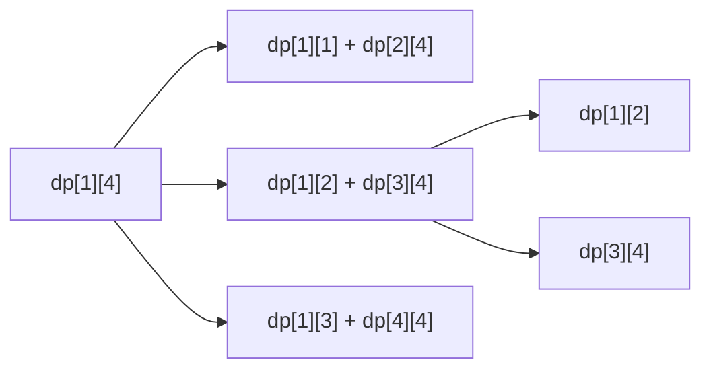

# 区间DP

## 零、知识地图

```text
区间DP
├── 1. 区间 DP 模板 —— 长度-左端点-分割点三重循环（为什么按长度枚举；复杂度 O(n^3)）
├── 2. P4170 涂色实战 —— 覆盖型转移：首尾同色"顺手一笔"、异色枚举分割点
├── 3. 环形区间 DP —— 断环为链：复制一倍 + n 个长度为 n 的窗口（资料未覆盖，属补充）
└── 4. 区间 DP 题型特征识别 —— 合并/覆盖型判定、无后效性、复杂度预算（资料未覆盖，属补充）

学习顺序：1 → 2 → 3 → 4。理由：先立三重循环骨架（1），用它实战第一道真题（2），再把骨架推广到环（3），最后回头回答"什么时候该用区间 DP"（4）——从骨架到实战到推广到判别。
```

## 一、为什么需要它

先用你大概率碰过壁的方式想 P4170 涂色（CQOI2007）：长度 $n \le 50$ 的木板，每次把一段连续格子涂成一种颜色，后涂覆盖先涂，求最少笔数。暴力做法是把"每一笔涂哪一段、涂什么颜色"当成搜索决策，从空白板出发 BFS/DFS——状态是整块木板的样子，最坏是字母表规模的 $|Σ|^n$ 量级（n=50 时是天文数字），搜索树直接爆掉。**碰壁的根源：涂色决策作用在"区间"上，而暴力没有利用"大区间的方案由小区间拼出来"这一结构。**

区间 DP 把这个结构直接写进状态：$dp[i][j]$ = 处理好区间 $[i,j]$ 的最优值，大区间由相邻两个子区间转移而来，总转移量只有 $O(n^3) = 1.25 \times 10^5$，瞬间完成。本篇讲 4 个知识点：三重循环模板（为什么按长度枚举）、P4170 实战、环形断链推广、题型特征识别。

## 二、知识点逐讲（每个知识点一节，共 4 节）

### 1. 区间 DP 模板：长度-左端点-分割点三重循环

前置依赖：[[线性DP]]（同批产出，先文字锚定：状态、转移、无后效性）、[[枚举与模拟]]（枚举顺序即复杂度的意识）
后续衔接：[[#2. P4170 涂色实战：首尾同色的顺手一笔]]、[[#3. 环形区间 DP：断环为链（资料未覆盖，属补充）]]

**① 它解决什么问题**

A 源 slide 1 定义：区间 DP 是"对于区间的一种动态规划"，把问题划分为若干子区间，通过状态与转移求每个子区间的最优解，最终得到整个区间的最优解。状态形态固定为 $dp[i][j]$ = 区间 $[i,j]$ 的最优值；大区间通常有多种合并方式，**枚举分割点** $k$，取最优。关键性质融入正文：状态数 $O(n^2)$，每个状态枚举分割点 $O(n)$，总复杂度 $O(n^3)$、空间 $O(n^2)$；前提是"大区间能拆成两个相邻子区间"，返回值一般是 $dp[1][n]$。

**② 直觉理解**

模型级类比：**先结小单，再拼大单**。把区间想成一摞待结算的账单：任何大区间的方案，"最后一次合并"必然把它切成左边一块和右边一块——所以想结算大单，必须先把所有更短的小单结清；而"切在哪"有多种选择，都要比价。这个类比同时管住两件事：为什么按长度从小到大算（小单先结），为什么枚举分割点（切法比价）。

用具体数字跑一遍（直线合并，代价 = 两段之和）：权值 $\{1,2,3\}$。$dp[1][1]=dp[2][2]=dp[3][3]=0$；长度 2：$dp[1][2]=0+0+3=3$，$dp[2][3]=0+0+5=5$；长度 3：$dp[1][3]=\min(k=1:\ 0+5+6=11,\ k=2:\ 3+0+6=9)=9$。整个填表是"从对角线向外扩"的过程。

**③ 原理与推导**

转移方程（A 源 slide 1"状态：dp[i][j] 表示 [i,j] 的最小消耗"）：$dp[i][j]=\min_{i \le k < j}\{dp[i][k]+dp[k+1][j]+cost(i,j)\}$。分割点 $k$ 的上界：$k$ 是左半区间的右端点，右半起点 $k+1$ 必须不超过 $j$，即 $k \le j-1$（A 源原话"分割点 k 是从 i 到 j-1，因为 k+1≤j"）。

为什么按长度枚举（设计动机核心）：$dp[i][j]$ 依赖的 $dp[i][k]$ 与 $dp[k+1][j]$ 都严格更短。反过来看双重循环为什么不行——若外层 $i$ 升序、内层 $j$ 升序，算 $dp[2][4]$ 时需要 $dp[3][4]$，而 $i=3$ 排在 $i=2$ 之后还没算，依赖断裂。**按长度分层后，算到长度 len 时，所有长度小于 len 的区间恰好全部就绪。** 等价写法：$i$ 降序、$j$ 升序，或记忆化搜索（[[搜索优化]]），核心都是"先短后长"。

依赖关系用图看（mermaid）：



文字版推导链：$dp[1][4]$ 的三个候选转移各需要"左半 + 右半"；无论切在哪，两半长度都小于 4；递归下去，所有依赖最终落在长度 1 的对角线上。按长度 1、2、3、4 填表，算到 $dp[1][4]$ 时需要的格子全部就绪——这就是三重循环的骨架来源。

**④ 代码演示**

自编通用骨架（以"合并代价 = 区间和"为例；A 源无通用代码，仅 P4170 特例，知识点 2 给全貌；求最大把 min 换 max）：

```cpp
#include <cstring>
#include <algorithm>
int n, w[105], s[105], dp[105][105];   // w：各位置权值；s：前缀和（cost 用）
// 消耗函数按题意替换：这里 cost(l,r) = s[r]-s[l-1]，是合并类最常见形态
void solve() {
    memset(dp, 0x3f, sizeof(dp));                 // 初值：0x3f 表示"尚未算出"（A 源：记得按题意给初值）
    for (int i = 1; i <= n; i++) dp[i][i] = 0;    // 边界：单格区间无需合并
    for (int len = 2; len <= n; len++)            // 第一重：区间长度，从短到长
        for (int i = 1; i + len - 1 <= n; i++) {  // 第二重：左端点，右端点不越界
            int j = i + len - 1;                  // 右端点由长度与左端点确定
            for (int k = i; k < j; k++)           // 第三重：分割点，k+1 必须 <= j
                dp[i][j] = std::min(dp[i][j],
                    dp[i][k] + dp[k+1][j] + s[j] - s[i-1]);   // 复杂度：合计 O(n^3)
        }
}
```

执行追踪表（n=3，w={1,2,3}，代价=区间和；填表顺序即"长度递增"）：

| 步骤 | 当前元素（区间） | 结构状态 | 动作 | 结果 |
|:---:|:---:|:---|:---|:---|
| 1 | len=1：[1,1] [2,2] [3,3] | 对角线 dp 值 = 0 | 边界初始化 | 单格无需合并 |
| 2 | [1,2] | dp[1][1]=0, dp[2][2]=0 | k=1：0+0+3 | dp[1][2]=3 |
| 3 | [2,3] | 同上结构 | k=2：0+0+5 | dp[2][3]=5 |
| 4 | [1,3] | dp[1][2]=3, dp[2][3]=5 | k=1：0+5+6=11；k=2：3+0+6=9 | dp[1][3]=9 |

错误写法对照（三重循环的三个典型坑）：

```diff
- for (int i = 1; i <= n; i++)
-     for (int j = i + 1; j <= n; j++)       // 坑1：外层 i 升序内层 j——算 dp[2][4] 需要 dp[3][4]，此时未算（依赖未就绪，答案错）
+ for (int len = 2; len <= n; len++)
+     for (int i = 1; i + len - 1 <= n; i++) // 按长度分层：算长区间时所有短区间已就绪
- for (int k = i; k <= j; k++)               // 坑2：k 取到 j——dp[k+1][j] 变成 dp[j+1][j] 的逆区间（读未初始化，答案错或 RE）
+ for (int k = i; k < j; k++)                // k 是左半右端点：k+1 <= j 即 k <= j-1（A 源原话）
- （整行漏写 for (int i = 1; i <= n; i++) dp[i][i] = 0;）   // 坑3：漏单格边界——min 永远从 0x3f 里挑，结果错
+ for (int i = 1; i <= n; i++) dp[i][i] = 0;               // 单元素区间是所有长区间的推导起点
```

**⑤ 典型应用**

- 真题：P1880 [NOI1995] 石子合并（环版，知识点 3 全流程实战）——本模板的"环上加强版"。
- 真题：P1063 [NOIP2006] 能量项链——相邻合并释放能量，断环为链后转移与模板同型（$n \le 100$，$O(n^3)$ 放得下）。
- 真题：P1220 关路灯——区间 DP 且决策带"位置"信息，状态要多一维（资料未覆盖，属补充，题号真实）。
- 迁移检验题（自编）：n 堆排成一行，每次合并相邻两堆，代价为两堆石子数之积，求最小总代价。数据 $n \le 100$，$a_i \le 100$。建议先独立做，再对照题解：状态与模板完全同构，$dp[i][j]=\min_k\{dp[i][k]+dp[k+1][j]+(s[k]-s[i-1])\times(s[j]-s[k])\}$，前缀和拆出两半各自的和；小数据 $\{1,2,3\}$：$dp[1][3]=\min(0+6+1\times5,\ 2+0+3\times3)=11$；复杂度 $O(n^3)$。

**⑥ 坑点与边界**

> **【易错】** 循环顺序写成 i 外层 j 内层升序。后果是依赖未就绪、答案错——见④对照坑 1；修复原理是"先短后长"。

> **【易错】** 初值与边界不配套。求 min 用 0x3f 占位、求 max 用 -0x3f，两者混用或漏初始化单格边界，min/max 就从错误地基出发（④对照坑 3）。

> **【注意】** 复杂度预算：$O(n^3)$ 适用于 $n \le 300$ 量级（$300^3 = 2.7 \times 10^7$）；$n$ 上千时需四边形不等式等 $O(n^2)$ 优化（延伸，非必需）。总代价若累加权值，注意溢出。

> [!example]-
> **边界数据集（先自己跑一遍，再展开对照）**
> 1. 空输入：n=0 → 三重循环全部零次执行（预期：无输出、不崩溃）。
> 2. 单元素：n=1 → len 循环从 2 起零次执行，答案直接取边界 dp[1][1]（预期：0）。
> 3. 全相同：w={5,5,5} → 任意分割点代价相同，dp[1][3]=15（预期：min 不挑拨，验证转移写全不漏）。
> 4. 严格递增：不适用：区间 DP 的状态是"区间端点"，与元素键值大小顺序无关，递增数据不触发新分支（键序检查属于二分/尺取类题）。
> 5. 严格递减：不适用：理由同上。
> 6. 极值：n=100、w 全取 10^9 → 总分约 10^9×100=10^11 超 int，前缀和与答案必须 long long（防溢出）；dp 数组 105×105 的 int 约 44KB，空间安全（预期：不溢出、不越界）。

回扣开场：暴力搜"每笔涂哪"是 $|Σ|^n$，区间 DP 用"大区间由小区间拼出"把规模压到 $O(n^3)$——现在你能回答"为什么涂色题该往区间上想"，下一步用真题 P4170 把模板落地。

### 2. P4170 涂色实战：首尾同色的顺手一笔

前置依赖：[[#1. 区间 DP 模板：长度-左端点-分割点三重循环]]
后续衔接：[[#3. 环形区间 DP：断环为链（资料未覆盖，属补充）]]、[[#4. 区间 DP 题型特征识别（资料未覆盖，属补充）]]

**① 它解决什么问题**

洛谷 P4170（CQOI2007，A 源 slide 1 链接给出）：木板初始无色，每次把一段连续格子涂成一种颜色，后涂覆盖先涂，求涂出目标串的最少次数。它是"覆盖型"区间 DP 的代表：$dp[i][j]$ = 涂出 $[i,j]$ 的最少笔数。复杂度：状态 $O(n^2)$、转移 $O(n)$，$n \le 50$（素材数组 a[55] 与题面规模一致）时总转移约 $1.25 \times 10^5$，无压力。

**② 直觉理解**

模型级类比：**画家的图层**。每一笔涂色是一层不透明薄膜，后盖先；求最少层数。首尾颜色相同时，"盖住两端的膜"可以延伸到整段——先铺一层底色把两端一次带上，中间的细节再往上盖，这就是"顺手一笔"。

用具体数字跑一遍（A 源 slide 1-2 的手推）：木板长 1 → 1 次。长 2：AA 两个区间同色合并，"涂一个区间时顺手把另一个格子也涂掉"，1 次；AB 要 2 次。长 3：ABA 只要 2 次——"涂其中一个 A 时顺手一次性把另一个 A 也涂了（即 AAA），然后再涂 B"，恰好等于长度 2 的区间"AB"的次数；AAB、BAA 是长度 2 + 长度 1 的合并，2 次；ABC 要 3 次。A 源结论："大区间的次数由小区间合并而来——区间 DP。"

**③ 原理与推导**

转移分两种情况（P4170.cpp 原式）：

$$dp[i][j]=\begin{cases}\min(dp[i+1][j],\ dp[i][j-1]) & a[i]=a[j] \\ \min_{i \le k < j}\{dp[i][k]+dp[k+1][j]\} & a[i] \ne a[j]\end{cases}$$

文字版结论：首尾同色时"缩一端"免费；首尾异色时枚举分割点取最小。

问一：为什么首尾同色能省一笔（设计动机）？取涂出 $[i+1,j]$ 的最优方案，看其中**最后一次覆盖位置 j 的那一笔**——它的颜色就是最终色 $s[j]=s[i]$。把这笔的左端延伸到 $i$：中间被它顺带盖过的位置，若最终颜色不同，后面必有更晚的笔再盖（这些笔不盖 $j$，但可以盖其他位置），方案合法且笔数不变。所以 $dp[i][j] \le dp[i+1][j]$；对称地 $dp[i][j] \le dp[i][j-1]$。这一段素材只给了"顺手涂"的结论性手推，完整推导属补充。

问二：为什么同色时不用枚举分割点？先有一条单调性：子区间不更难——把涂 $[i,k]$ 的方案砍掉对 $i$ 的覆盖，就是涂 $[i+1,k]$ 的方案，所以 $dp[i+1][k] \le dp[i][k]$。于是任何分割 $dp[i][k]+dp[k+1][j] \ge dp[i+1][k]+dp[k+1][j] \ge dp[i+1][j]$（后一步是 $[i+1,j]$ 的合法分割），min 已被"缩一端"覆盖，枚举 $k$ 不会更优。

用官方样例 RGBGR 手算验证：长度 2 全为 2；长度 3：$dp[1][3]=3$、$dp[2][4]=2$（G 与 G 同色）、$dp[3][5]=3$；长度 4：$dp[1][4]=3$、$dp[2][5]=3$；长度 5：$dp[1][5]$ 首尾同为 R，$\min(3,3)=3$——与官方输出一致（附录 B-5 实测）。

**④ 代码演示**

取自源文件 P4170.cpp（改动：删去多余 include 与空行、补关键行注释；算法逻辑逐行原样）：

```cpp
#include <cstdio>
#include <cstring>
#include <algorithm>
using namespace std;
char a[55];
int dp[55][55];
int n;
int main() {
    scanf("%s", a + 1);                        // 从下标 1 起读入，dp 下标同步 1-based
    n = strlen(a + 1);
    memset(dp, 0x3f, sizeof(dp));              // 初值：0x3f 表示"尚未算出"（A 源：记得按题意给初值）
    for (int i = 1; i <= n; i++) dp[i][i] = 1; // 边界：单格恰好一笔
    for (int len = 2; len <= n; len++)         // 长度递增：从短区间开始算
        for (int i = 1; i + len - 1 <= n; i++) {
            int j = i + len - 1;               // 右端点
            if (a[i] == a[j])                  // 首尾同色：顺手一笔，免费缩一端
                dp[i][j] = min(dp[i + 1][j], dp[i][j - 1]);
            else                               // 首尾异色：枚举分割点
                for (int k = i; k < j; k++)
                    dp[i][j] = min(dp[i][j], dp[i][k] + dp[k + 1][j]);
        }
    printf("%d\n", dp[1][n]);                  // 复杂度：O(n^3)，n<=50 约 1.25e5
    return 0;
}
```

执行追踪表（输入 AAB，长度递增填表全过程）：

| 步骤 | 当前元素（区间） | 结构状态 | 动作 | 结果 |
|:---:|:---:|:---|:---|:---|
| 1 | len=1：[1,1] [2,2] [3,3] | dp 对角线 = 1 | 单格各一笔 | 地基就绪 |
| 2 | [1,2]（AA） | a[1]==a[2] | 同色：min(dp[2][2], dp[1][1]) | dp[1][2]=1 |
| 3 | [2,3]（AB） | a[2]≠a[3] | 异色：k=2，dp[2][2]+dp[3][3]=2 | dp[2][3]=2 |
| 4 | [1,3]（AAB） | a[1]='A'≠a[3]='B' | k=1：1+2=3；k=2：1+1=2 | dp[1][3]=2，输出 2 |

错误写法对照（三个高频坑）：

```diff
- memset(dp, 0, sizeof(dp));                 // 坑1：初值清零——min 恒取 0，任意输入输出 0（答案错）；求最少必须"大数"占位
+ memset(dp, 0x3f, sizeof(dp));              // 素材原样：0x3f 表示未算出，且 0x3f+0x3f 不溢出 int
- if (a[i] == a[j]) dp[i][j] = dp[i + 1][j - 1];   // 坑2：同色缩两端——AA 读到空区间 0x3f、ABA 少算两端那一笔输出 1（答案错，正确为 2）
+ if (a[i] == a[j]) dp[i][j] = min(dp[i + 1][j], dp[i][j - 1]);   // 只缩一端，另一端由"顺手一笔"免费带上
- for (int k = i; k <= j; k++)               // 坑3：k 取到 j——dp[k+1][j] 越到区间外（读未初始化内存，答案错或 RE）
+ for (int k = i; k < j; k++)                // 分割点只能落在区间内部（k+1 <= j）
```

**⑤ 典型应用**

- 真题：P4170 本题。实测官方样例 AAAAA 输出 1、RGBGR 输出 3（附录 B-5）。
- 真题：力扣 664 奇怪的打印机——每次打印一段同色字符、后打覆盖先打，与 P4170 同型，转移同款（题号真实）。
- 迁移检验题（自编）：给定长度 $n \le 100$ 的小写字母串，每次可在任意位置插入一个字符，求最少插入多少个字符使其成为回文。输入一行字符串，输出一个整数。建议先独立做，再对照题解：$dp[i][j]$ 为把 $[i,j]$ 变成回文的最少插入数；$a[i]=a[j]$ 时两端已配对，$dp[i][j]=dp[i+1][j-1]$；否则 $dp[i][j]=\min(dp[i+1][j],\ dp[i][j-1])+1$（补齐左端或右端各一个字符）；边界 $dp[i][i]=0$，答案 $dp[1][n]$，复杂度 $O(n^2)$。小数据：AB 输出 1；ABA 本身是回文输出 0。

**⑥ 坑点与边界**

> **【易错】** 初值 memset 成 0。求最少的题初值必须是"大数"，否则 min 永远取 0（④对照坑 1，A 源特别提醒"要记得根据题意给上初值"）。

> **【易错】** 首尾同色写成同时缩两端 dp[i+1][j-1]。空区间与"两端那一笔"两处都会出错（④对照坑 2）；正确姿势是只缩一端。

> **【注意】** 读入与下标：素材用 scanf("%s", a+1) 从 1 起存、strlen(a+1) 取长，dp 下标全程 1-based，三处必须一致；混成 0-based 会在 a[i]==a[j] 的比较上错位。

> [!example]-
> **边界数据集（先自己跑一遍，再展开对照）**
> 1. 空输入：题面保证 1<=n<=50，不发生；若强行喂空串，strlen 为 0，循环零次（预期：不崩溃，无有效输出）。
> 2. 单元素："A" → dp[1][1]=1，输出 1（预期：单格恰好一笔）。
> 3. 全相同："AAAAA" → 官方样例 1，输出 1（预期：同色链式缩一端，全程只算 1 笔）。
> 4. 严格递增：不适用：字符串没有"递增"语义，区间 DP 只认端点相等性与分割点，不认键序。
> 5. 严格递减：不适用：理由同上。
> 6. 极值：n=50 且 50 格颜色两两不同（用 26 个字母循环排布）→ 无任何同色可"顺手"，退化为逐格一笔，输出 50；$O(n^3)=1.25\times10^5$ 瞬间完成（预期：上界内完成、答案等于不同色段数的理论值）。

回扣开场：现在你能解决开场那个"暴力搜索爆掉"的涂色题了——用的是知识点 1 的三重循环骨架，加上本节的"首尾同色缩一端"免费转移。

### 3. 环形区间 DP：断环为链（资料未覆盖，属补充）

前置依赖：[[#1. 区间 DP 模板：长度-左端点-分割点三重循环]]、[[#2. P4170 涂色实战：首尾同色的顺手一笔]]、[[前缀和与差分]]（区间和 O(1) 拆半）
后续衔接：P1063 能量项链（同套路换转移公式）、树形 DP（同批规划中，先文字锚定）

**① 它解决什么问题**

P1880 [NOI1995] 石子合并（环版）：n 堆石子围成一圈，每次只能合并**相邻**两堆，得分 = 两堆之和，求总得分的最大值与最小值。直线模板为什么失灵：环上"第一堆与最后一堆也相邻"，而且"从哪断开看这条链"本身是个决策，固定 dp[1][n] 只回答了一种断法。方案：**断环为链**——复制一份 $a[i+n]=a[i]$，在长 $2n$ 的链上做区间 DP，答案在所有长度为 $n$ 的窗口中汇总。复杂度：$O((2n)^3)=8n^3$，$n \le 100$ 时约 $8 \times 10^6$，无压力。

**② 直觉理解**

模型级类比：**项链剪一刀**。环难在"没有起点"；沿刀口剪开摆成链，而"剪在哪"有 n 种选法——恰好对应链上 n 个长度为 n 的窗口，逐个窗口算完再汇总。

用具体数字跑一遍（n=3，环 1-2-3）：三种断口的窗口分别是 {1,2,3}、{2,3,1}、{3,1,2}。最小分：{1,2,3} 先并 1+2=3 得 3 分，再 3+3=6 得 6 分，共 9；{2,3,1} 先 2+3=5，再 5+1=6，共 11；{3,1,2} 先 3+1=4，再 4+2=6，共 10。三窗口取 min 为 9、取 max 为 11——逐窗口枚举确实覆盖了所有合并方式。

**③ 原理与推导**

为什么复制一份就正确（设计动机）：合并 $n-1$ 次、每次消掉一个环隙，且被消掉的环隙两两不同（合并后该缝隙两侧已成同一堆，不会再"跨"它合并）——所以 $n$ 个环隙里总剩一个从没被跨过的，从那里断开，整个合并序列就是这个窗口内部的链式合并。于是"环上任意合并序列"都至少被一个窗口完整覆盖，对 $n$ 个窗口取 min/max 即得全局最优。

转移与直线版完全同构，只是区间和换用前缀和 $O(1)$ 取：

$$dp[i][j]=\underset{i \le k < j}{\min/\max}\{dp[i][k]+dp[k+1][j]\}+s[j]-s[i-1]$$

文字版结论：合并 $[i,j]$ 的总分 = 先并好两半的分数 + 最后一次并整段的 $s[j]-s[i-1]$。链上做完后，答案 $=\min/\max_{1 \le i \le n} dp[i][i+n-1]$。

```text
环:  1 - 2 - 3 - 4
     |           |
     +-----------+        断口有 n 个候选

链:  1 2 3 4 1 2 3 4     （a[i+n] = a[i]，长 2n）
     [1..4] [2..5] [3..6] [4..7]   ← n 个长度为 n 的窗口 = n 个断口
```

文字版推导链：复制一倍让"跨过原断口的相邻对"（如 4 与 1）在链上变成窗口内部的相邻对；每个长度为 n 的窗口恰好对应一种剪断位置；窗口只在链内合并，模板的三重循环原样可用。

**④ 代码演示**

自编补充实现（素材未覆盖环版；P1880 官方样例实测输出 43 与 54，附录 B-5）：

```cpp
#include <iostream>
#include <cstring>
#include <algorithm>
using namespace std;
int a[205], s[205], mn[205][205], mx[205][205];
int main() {
    int n; cin >> n;
    for (int i = 1; i <= n; i++) { cin >> a[i]; a[i + n] = a[i]; }  // 断环为链：复制一倍
    for (int i = 1; i <= 2 * n; i++) s[i] = s[i - 1] + a[i];        // 前缀和含复制段
    memset(mn, 0x3f, sizeof(mn));
    memset(mx, -0x3f, sizeof(mx));                 // min/max 双份，初值方向相反
    for (int i = 1; i <= 2 * n; i++) mn[i][i] = mx[i][i] = 0;       // 单堆：0 分
    for (int len = 2; len <= n; len++)             // 答案只来自长度恰为 n 的窗口
        for (int i = 1; i + len - 1 <= 2 * n; i++) {   // 右端点上界是 2n
            int j = i + len - 1;
            for (int k = i; k < j; k++) {
                mn[i][j] = min(mn[i][j], mn[i][k] + mn[k + 1][j]);
                mx[i][j] = max(mx[i][j], mx[i][k] + mx[k + 1][j]);
            }
            mn[i][j] += s[j] - s[i - 1];       // 复杂度：O((2n)^3)，n<=100 约 8e6
            mx[i][j] += s[j] - s[i - 1];
        }
    int amn = 0x3f3f3f3f, amx = -0x3f3f3f3f;
    for (int i = 1; i <= n; i++) {             // 汇总 n 个窗口 = n 个断口
        amn = min(amn, mn[i][i + n - 1]);
        amx = max(amx, mx[i][i + n - 1]);
    }
    cout << amn << "\n" << amx << endl;
    return 0;
}
```

执行追踪表（n=3，环 1-2-3，链 1 2 3 1 2 3，取最小分）：

| 步骤 | 当前元素（区间） | 结构状态 | 动作 | 结果 |
|:---:|:---:|:---|:---|:---|
| 1 | len=1：[i,i]，i=1..6 | mn[i][i]=0（含复制段） | 单堆零分初始化 | 地基就绪 |
| 2 | [1,2] | 1+2 | 相邻合并 | mn=mx=3 |
| 3 | [2,3] | 2+3 | 相邻合并 | mn=mx=5 |
| 4 | [3,4] | 3+1 | 链上"跨原断口"的相邻对 | mn=mx=4 |
| 5 | [1,3]（窗口 1） | dp[1][2]=3, dp[2][3]=5 | k=1：0+5+6=11；k=2：3+0+6=9 | mn=9, mx=11 |
| 6 | [2,4]（窗口 2） | dp[2][3]=5, dp[3][4]=4 | k=2：0+4+6=10；k=3：5+0+6=11 | mn=10, mx=11 |
| 7 | [3,5]（窗口 3） | dp[3][4]=4, dp[4][5]=3 | k=3：0+3+6=9；k=4：4+0+6=10 | mn=9, mx=10 |
| 8 | 汇总 i=1..3 | 三窗口齐全 | min(9,10,9)、max(11,11,10) | 输出 9 与 11 |

错误写法对照：

```diff
- for (int i = 1; i + len - 1 <= n; i++)      // 坑1：断环后仍只扫到 n——跨过断口的窗口全部丢失（答案错）
+ for (int i = 1; i + len - 1 <= 2 * n; i++)  // 链长 2n，右端点上界是 2n
- for (int len = 2; len <= 2 * n; len++)      // 坑2：长度扫到 2n——"绕两圈"的区间是无意义状态，白算一倍（浪费；窗口汇总仍取 len=n）
+ for (int len = 2; len <= n; len++)          // 答案只来自长度恰为 n 的窗口
- for (int i = 1; i <= n; i++) mn[i][i] = 0;  // 坑3：只初始化前 n 个单堆——复制段 dp 值还是 0x3f，窗口一跨进去就错（答案错）
+ for (int i = 1; i <= 2 * n; i++) mn[i][i] = mx[i][i] = 0;   // 复制段同样是合法单堆
```

**⑤ 典型应用**

- 真题：P1880 本题。实测官方样例（n=4，4 5 9 4）输出 43 与 54（附录 B-5）。
- 真题：P1063 [NOIP2006] 能量项链——项链是环，断环为链后 $dp[i][j]=\max_k\{dp[i][k]+dp[k+1][j]+a[i]\cdot a[k+1]\cdot a[j+1]\}$，窗口汇总同款（题号真实，资料未覆盖，属补充）。
- 迁移检验题（自编）：n 堆围成圈，每次合并相邻两堆代价为两堆之和，只求最小总代价（$n \le 100$，$a_i \le 10^4$）。输入两行：n 与 n 个整数；输出最小总代价。建议先独立做，再对照题解：就是 P1880 的"只留 mn"版——断环为链、前缀和、长度枚举、n 个窗口汇总取 min；与 P1880 唯一差别是删掉 mx 分支。

**⑥ 坑点与边界**

> **【易错】** 链上循环上界仍写 n。断环为链后一切以链长 2n 为准：右端点上界 2n（坑 1）、单堆初始化到 2n（坑 3），两处漏掉都是答案错。

> **【易错】** 前缀和只算到 n。窗口用 $s[j]-s[i-1]$ 时 $j$ 会取到 $n$ 之后，前缀和必须把复制段一起累加，否则跨断口的窗口和全错。

> **【注意】** 窗口起点 $i$ 只枚举到 $n$：长度为 $n$ 的窗口在长 $2n$ 的链上有 $n$ 个，正好一一对应 $n$ 个断口，多枚举是重复计算。

> [!example]-
> **边界数据集（先自己跑一遍，再展开对照）**
> 1. 空输入：题面保证 n>=1，不发生；n=0 时循环零次（预期：无输出）。
> 2. 单元素：n=1 → 环上仅一堆，无需合并，len 循环零次，窗口 [1,1] 值为 0（预期：输出 0 与 0）。
> 3. 全相同：4 堆各 1 → 无论怎么并总分相同，3 次合并 2+2+4=8（预期：min=max=8，验证断口枚举不引入偏差）。
> 4. 环拆链（对应"严格递增"）：环 1 2 3 4 顺时针递增 → 不同断口窗口答案不同，逐窗口汇总才有意义（预期：与手推一致；此时"递增"提供了区分断口的锚点）。
> 5. 环拆链反向（对应"严格递减"）：环 4 3 2 1 → 与递增环转一圈同构，结果相同（预期：环无方向偏好，两版输出一致）。
> 6. 极值：n=100、权值取题面上限 → 总分约 100 堆 × 单堆上限 × 合并层数，先估算是否超 int，必要时前缀和与 dp 全换 long long（预期：按题面预算不溢出）。

回扣开场：直线模板卡在"环没有起点"，断环为链把"起点选择"变成 n 个窗口的枚举——现在你能把知识点 1 的骨架原样搬到任何环形合并题上。

### 4. 区间 DP 题型特征识别（资料未覆盖，属补充）

前置依赖：[[#1. 区间 DP 模板：长度-左端点-分割点三重循环]]、[[搜索优化]]（记忆化搜索视角）、[[前缀和与差分]]（反例对照）
后续衔接：树形 DP 与状压 DP（同批规划中，先文字锚定）、[[尺取法]]（"区间统计"类题的正解家族）

**① 它解决什么问题**

拿到题先回答"要不要上区间 DP"。三个特征同时满足才上：(1) 操作或代价天然定义在**一段连续区间**上；(2) 大区间的答案能按"最后一次操作/最后一个分割"拆成**两个相邻子区间**且互不干扰（无后效性）；(3) $n \le$ 几百，$O(n^3)$ 的复杂度预算放得下（$300^3 = 2.7 \times 10^7$）。反例对照：静态区间和查询是 [[前缀和与差分]] 的事，"和最大的一段"是 [[尺取法]] 的事——它们的标志是**统计**；区间 DP 的标志是**合并或覆盖**这类"把区间改写掉"的动作。

**② 直觉理解**

模型级类比：**分账的账本**。暴力分治枚举每个分割点像"每页重新手抄一遍账"，同一区间被反复手抄；区间 DP 像"每个区间只记一行账，之后查表"。重叠子问题越多，记账省得越多。

用具体数字跑一遍（无记忆化的暴力递归枚举合并顺序，直线合并）：设调用数 $C(l,r)$，单格 $C=1$，$C(l,r)=1+\sum_k(C(l,k)+C(k+1,r))$。逐个算：$C(1,2)=3$，$C(1,3)=9$，$C(1,4)=27$——恰有 $C(1,n)=3^{n-1}$（归纳：$C(1,n)=1+2\sum_{j=1}^{n-1}C(1,j)$）。n=20 时 $3^{19} \approx 1.2 \times 10^9$ 次调用，超时；而不同的区间只有 $O(n^2)=190$ 个——这就是"重叠子问题"的账。

**③ 原理与推导**

判定流程三问：一问"最后一次操作发生在哪"——若能描述为"把 $[l,r]$ 从某处切开"或"覆盖整段"，满足特征 1、2；二问"两半的最优解合起来还是不是整段最优"——若是，无后效性成立；三问"状态够不够"——若最优解还依赖过程信息（如最后一步从左还是从右进来，P3205 合唱队就需要这个方向信息），单一 $[l,r]$ 不够，要加维。

设计动机：**状态 = 区间的全部必要历史**。若历史里只有"这一段已被处理"一件事，$dp[l][r]$ 就够；还要记别的，就把它显式加进状态维度——漏加维度是本类题最隐蔽的错源。

**④ 代码演示**

自编对照骨架（直线石子合并：暴力递归 vs 记忆化；同一转移，差别只在查表）：

```cpp
#include <cstring>
#include <algorithm>
int n, s[105], memo[105][105];         // s：前缀和
int brute(int l, int r) {              // 无记忆化：每次全量重算
    if (l == r) return 0;
    int best = 0x3f3f3f3f;
    for (int k = l; k < r; k++)        // 决策：最后一次合并的左半是 [l,k]
        best = std::min(best, brute(l, k) + brute(k + 1, r) + s[r] - s[l - 1]);
    return best;                       // 调用数 3^(n-1)：n=20 约 1.2e9 次（TLE）
}
int dfs(int l, int r) {                // 记忆化：同一区间只算一次
    if (l == r) return 0;
    if (memo[l][r] != -1) return memo[l][r];       // 查表：重叠子问题
    int best = 0x3f3f3f3f;
    for (int k = l; k < r; k++)
        best = std::min(best, dfs(l, k) + dfs(k + 1, r) + s[r] - s[l - 1]);
    return memo[l][r] = best;          // 复杂度：状态 O(n^2) × 决策 O(n) = O(n^3)
}
```

执行追踪表（n=4，brute(1,4) 与 dfs(1,4) 的调用对照）：

| 步骤 | 当前元素 | 结构状态 | 动作 | 结果 |
|:---:|:---:|:---|:---|:---|
| 1 | brute(1,4) | 无记忆化表 | 枚举 k=1,2,3，子调用 1+9+3+9+1 | 共 27 次调用 |
| 2 | brute(1,2)、brute(2,3) | 同上 | 各自再展开 | 同型子问题被反复手算 |
| 3 | dfs(1,4) | memo 全 -1 | 首算 10 个区间状态各一次 | 共 10 次调用 |
| 4 | 再查 dfs(1,2) | memo 已填 | 查表直接返回 | O(1) 命中 |

错误写法对照：

```diff
- if (l == r) return 0;（之后直接递归）       // 坑1：漏写查表行——重叠子问题全重算，n=20 就 3^19 约 1.2e9 次调用（TLE）
+ if (memo[l][r] != -1) return memo[l][r];   // 同一区间只算一次
- memset(memo, 0, sizeof(memo));              // 坑2：用 0 当"未算"标记——合法答案 0 恰好存在（dp[i][i]=0），查表判断失真（答案错）
+ memset(memo, -1, sizeof(memo));             // -1 才能当"未算"标记
- return best;                                // 坑3：算了不写表——下次照样重算，记忆化退化回指数级（TLE）
+ return memo[l][r] = best;                   // 算完立刻入表
```

**⑤ 典型应用**

- 真题：P4170 涂色——覆盖型（特征 1、2 由"后涂覆盖先涂"提供），n≤50 复杂度宽裕。
- 真题：P1880 石子合并——合并型 + 环（特征 1、2、3 全满足，外加断环为链）。
- 真题：P3205 [HAOI2009] 合唱队——插入型，最优解依赖"最后插入方向"，验证③"状态要加维"的判据（题号真实，资料未覆盖，属补充）。
- 迁移检验题（自编，判别训练）：判断下面 4 个场景是否区间 DP，并说理由。建议先独立做，再对照题解：(A) 涂色覆盖求最少笔数；(B) 静态数组多次询问区间和；(C) 环上相邻合并求最小总分；(D) 滑动窗口最大值。题解：A 是（覆盖型，本篇知识点 2）；B 不是（无合并动作，前缀和 O(1) 回答）；C 是（合并型 + 断环为链，本篇知识点 3）；D 不是（统计型，单调队列解决，见 [[单调栈]] 家族）。

**⑥ 坑点与边界**

> **【易错】** 把"区间统计"当区间 DP。区间和、区间最值查询没有"改写区间"的动作，上区间 DP 是把 O(1)/O(log n) 的问题做成 O(n^3)（方向性错误）。

> **【易错】** 无后效性漏判。最优解若依赖"过程信息"（方向、已用次数）而不加维，min/max 取到的不是真最优——P3205 合唱队就是反例，必须加"最后方向"一维。

> **【注意】** 复杂度预算先行：n 的上限决定要不要 O(n^3)。n≤300 稳、n≤500 勉强（常量要小）、n 上千须换优化或换模型——先算预算再动手。

> [!example]-
> **边界数据集（先自己跑一遍，再展开对照）**
> 1. 空输入：判别训练题无输入；实现题中 n=0 通常被题面保证排除（预期：不发生）。
> 2. 单元素：n=1 时合并/涂色类答案都是边界值（0 或 1）（预期：直接返回边界，不进循环）。
> 3. 全相同：全同元素常使各分割点同分（预期：min/max 不挑拨，验证转移写全不漏）。
> 4. 严格递增：对合并/覆盖型不构成新分支（区间 DP 不依赖键序）；仅对"区间最值+分割"类可作手算锚点（预期：不作为主测试维度）。
> 5. 严格递减：不适用：理由同上。
> 6. 极值：n=1 与 n=500 的预算预演：500^3=1.25e8，常量小的 O(n^3) 能过、内层再套循环必炸（预期：先算预算再动手）。

回扣开场：现在你能在读题 30 秒内判断"这道题是不是区间 DP"——用①的三特征与⑤的真题清单对照，不再把暴力搜索硬灌进涂色题。

## 三、全篇坑点总表

| # | 坑 | 正解 |
|---|-----|------|
| 1 | 外层 i 升序内层 j，依赖未就绪 | 按长度分层，先短后长（知识点 1④） |
| 2 | 分割点 k 取到 j，dp[k+1][j] 成逆区间 | k 从 i 到 j-1（知识点 1③） |
| 3 | 漏单格边界 dp[i][i] | len=1 的对角线是所有转移的地基 |
| 4 | 求最少初值 memset 成 0 | 用 0x3f 占位（知识点 2④） |
| 5 | 同色缩两端 dp[i+1][j-1] | 只缩一端，另一端"顺手一笔"免费（知识点 2③） |
| 6 | 断环后循环上界仍是 n | 链长 2n：右端点与单堆初始化都到 2n（知识点 3④） |
| 7 | 前缀和只累加到 n | 复制段一起累加，跨断口窗口才正确 |
| 8 | 窗口起点枚举超过 n | 长度为 n 的窗口共 n 个，一一对应断口 |
| 9 | 记忆化漏查表或不写表 | 查表 + return memo[l][r]=best（知识点 4④） |
| 10 | "未算"标记用 0 而合法值含 0 | 用 -1 作未算标记 |
| 11 | 区间统计题误上区间 DP | 先验"合并/覆盖"动作，统计类走前缀和/尺取 |

## 四、总结与自测

### 核心内容（一页纸速览）

- **区间 DP 模板**：$dp[i][j]$ 由相邻两半 $dp[i][k]+dp[k+1][j]$ 转移；三重循环"长度→左端点→分割点"；按长度枚举的原因是依赖全在更短区间（A 源 slide 1）；复杂度 $O(n^3)$、空间 $O(n^2)$。
- **P4170 涂色**：首尾同色免费缩一端 $\min(dp[i+1][j],dp[i][j-1])$（"顺手一笔"），异色枚举分割点；初值 0x3f、单格 1；官方样例 AAAAA→1、RGBGR→3 实测通过。
- **环形断链**：复制一倍成 $2n$ 长链，$n$ 个长度为 $n$ 的窗口对应 $n$ 个断口；$n-1$ 次合并恰剩一个未跨环隙保证覆盖（补充，P1880 实测 43/54）。
- **题型识别**：区间上操作 + 可拆两半 + $n \le$ 几百三特征；过程信息要加维（合唱队）；统计类题走前缀和与尺取。
- **记忆化与递推等价**：先短后长的填表顺序 = 记忆化搜索的计算顺序；无记忆化调用数 $3^{n-1}$。

### 前置概念清单

1. 线性 DP 的状态与转移（[[线性DP]]，同批产出）——区间 DP 是其二维区间版。
2. 无后效性——"两半最优合起来就是整体最优"的前提。
3. 前缀和（[[前缀和与差分]]）——区间和 $O(1)$ 拆半，合并类代价的标配。
4. 记忆化搜索（[[搜索优化]]）——递推的等价写法与查表意识。
5. 递归与调用栈（C 基础）——知识点 4 暴力递归对照的地基。

### 自测清单

- [ ] 能默写三重循环骨架并解释"为什么按长度枚举"（含 dp[2][4] 反例）
- [ ] 能手推 w={1,2,3} 直线合并的 dp 表（追踪表四步）
- [ ] 能解释"首尾同色缩一端"的两条推导方向（延伸最后一笔 + 子区间单调性）
- [ ] 能手推 AAB 填表得 2，并说出 RGBGR=3 的来历
- [ ] 能说清断环为链"复制一倍 + n 个窗口"为什么覆盖所有合并方式
- [ ] 能背出三个典型坑：初值 0x3f、k 到 j-1、同色只缩一端
- [ ] 能用三特征在 30 秒内判别"涂色/合并/统计"三类题
- [ ] 能算出无记忆化递归 n=20 的调用数量级（3^19）

### 错题登记

| 题号 | 错因 | 正解要点 |
|------|------|---------|
| （学完后填写） | | |

## 五、语法糖对照表

| 语法 | 等价 C 写法 | 一句话用途 |
|------|------------|-----------|
| `cin >> n;` / `cout << x << "\n";` | `scanf("%d",&n);` / `printf("%d\n",x);` | 流式读写（P1880 补充实现用） |
| `using namespace std;` | 每个标识符前加 `std::` | 免前缀 |
| `std::min(a,b)` / `std::max(a,b)` | `(a<b?a:b)` 手写或宏 | 取最值（P4170/P1880 均用） |
| `memset(dp,0x3f,sizeof(dp))` | for 循环逐格赋 0x3f3f3f3f | 整块数组置初值（string.h，C 已有） |

## 附录（供验收，正文之外，不影响阅读）

### 附录 A　源文件覆盖对账

#### A-1 提取表

| 源文件 | 提取方式 | 完整性 |
| --- | --- | --- |
| 28.区间动态规划.pptx | pymupdf 提取（3 slides，pics=0，chars=1045），存 素材\区间DP\提取文本\28.区间动态规划.txt | 基本完整：定义与核心思路（slide 1）、P4170 手推（slide 1-2）、预告题号（slide 2 末尾）；slide 3 仅 [META] 统计行无正文。pics=0 由提取工具统计，可能有 zlib 误差，若原件含图需人工核对贴图 |
| P4170.cpp | 全文直读（45 行） | 完整：memset 0x3f + 同色缩一端 + 异色枚举 k，逐行可读 |

#### A-2 知识点总清单（4 对 4）

| 序号 | 知识点 | 对应源文件 | 优先级 |
|------|--------|-----------|--------|
| 1 | 区间 DP 模板（三重循环与按长度枚举） | 28.pptx slide 1（定义/枚举顺序/k 范围）+ P4170.cpp（实现） | P0 |
| 2 | P4170 涂色实战（首尾同色顺手一笔） | 28.pptx slide 1-2（手推）+ P4170.cpp | P0 |
| 3 | 环形区间 DP：断环为链 | 素材未覆盖，属补充（P1880/P1063 题号真实） | P1 |
| 4 | 区间 DP 题型特征识别 | 素材未覆盖，属补充 | P1 |

依赖关系：1 是 2、3 的骨架（同一三重循环，转移公式逐题替换）；2 是 1 的第一道实战并引入"覆盖型"转移变体；3 是 1 的环形推广（骨架不变、枚举范围放大）；4 回收前三者的判别经验。源文件侧 2 份全部入篇，补充知识点已显式标注。

#### A-3 冲突与约定差异登记（4 项）

| 何处冲突 | 采信哪方 | 理由 |
| --- | --- | --- |
| A 源 slide 1"一般是找最少消耗" vs 通识（也可求最大，如 P1880 双问） | 采信通识并在知识点 1④ 注明"求最大把 min 换 max" | 同一框架换算子即可，课件只描述了常见情形，非对立表述 |
| A 源 slide 2 的"顺手涂"只有结论性手推，无完整论证 | 采信课件结论，完整两条推导标"属补充"（知识点 2③ 问一问二） | 结论与推导不冲突；补足"为什么"属防跳跃要求 |
| slide 2 末尾"洛谷：P1048 P1616"与区间 DP 主题无关 | 判定为下节课预告（两题均为完全背包），不入正文 | 与本篇知识点无依赖；登记附录 B-2 归属线性 DP 批次 |
| 断言程序首版用 bits/stdc++.h 在本机 MinGW 8.1 编译失败 | 改显式 include 后通过，教训登记 B-5 | 工具链已知缺陷，与素材无关 |

### 附录 B　假设与缺口登记

- B-1 假设清单：假设学习者已掌握线性 DP 的状态/转移概念（[[线性DP]] 为同批产出，若尚未建好请先文字锚定阅读）；假设学习者已会 C 的递归与数组（知识点 4 的暴力递归依赖）。
- B-2 PPT 预告题号登记：28.pptx slide 2 末尾"洛谷：P1048 采药、P1616 疯狂的采药"——完全背包主题，归线性 DP 批次素材，本篇不覆盖。
- B-3 资料缺口：环形区间 DP、题型特征识别、P4170 转移的完整推导、复杂度证明均为素材未覆盖的补充内容，正文已逐处标注；补充用真题 P1880/P1063/P1220/P3205 与力扣 664 题号真实，其中 P1880 补充实现已实测。
- B-4 读取缺口：slide 3 无正文内容（仅 [META] pages=3 pics=0 chars=1045 统计行）；pics=0 可能存在 zlib 统计误差，若课件含图，建议贴图位置为"slide 2 的 P4170 手推示意"处，源文件 28.区间动态规划.pptx，由使用者验收时补图。
- B-5 编译验证记录：①素材源码 P4170.cpp 经 g++ -std=c++17 -O2 -fsyntax-only 语法检查 exit=0；②补充实现 P1880 断环为链版编译并运行官方样例（4 / 4 5 9 4）输出 43 与 54，exit=0；③断言程序 verify_b5_idp.cpp **1097 PASS / 0 FAIL**：P4170 官方样例 AAAAA→1、RGBGR→3；手推锚点 AAB→2、ABC→3、ABA→2；dp 与 BFS 暴力对拍（长度 1~6、字母表 {A,B,C} 全量枚举 1092 组）全部一致。④工程教训：断言程序首版用 bits/stdc++.h，MinGW 8.1（GCC 8.1.0）下拉入 filesystem 头触发已知编译错，改显式 include 后通过——教训：验证代码用最朴素的头文件集合，先试编译再批量断言。

### 附录 C　交付前自检清单

- [x] 六步叙事：4 个知识点全部按①-⑥展开，以问题开场、以回扣收尾
- [x] 源文件 2 份全覆盖（A-1、A-2），总清单 4 条 = 正文 4 节，冲突与缺陷登记（A-3 共 4 项）
- [x] 代码实现取自素材原样（P4170.cpp）或标明自编（模板骨架、P1880 补充版、对照骨架），改动处逐条注记
- [x] 编译验证留痕（B-5）：P4170 语法检查通过 + P1880 样例实测 + 断言 1097/1097 PASS
- [x] 无 emoji、无"显然/易得/略"、工程痕迹全在附录、自测清单可勾选
- [x] v3.1 新结构：知识地图 / 前置后续双链 / 代码演示三块（追踪表 4 张 + 对照块 4 组）/ 边界数据集（六类含不适用理由）/ 语法糖表 / frontmatter 六项 / 不确定处标注"属补充"
