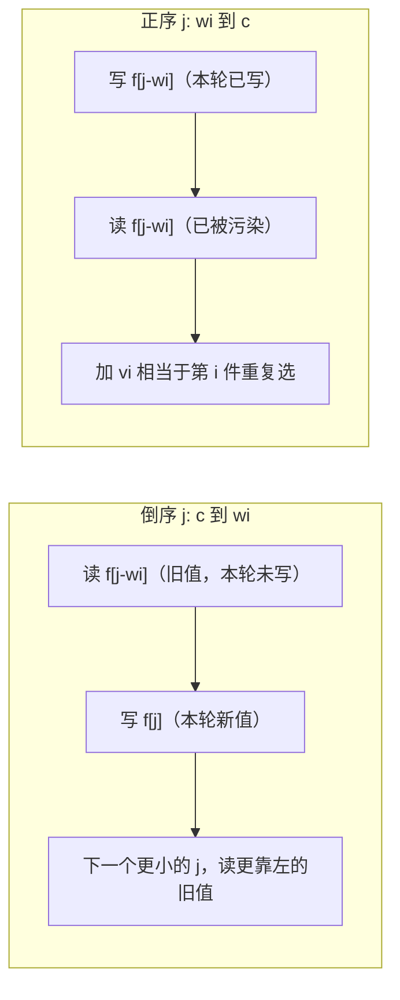
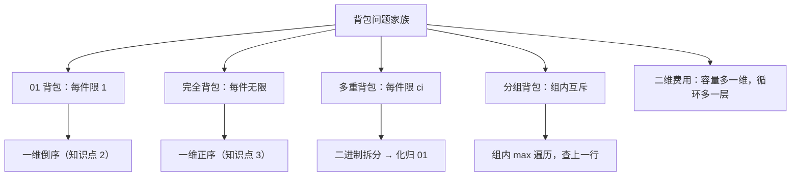

# 背包问题

## 零、知识地图

```text
背包问题
├── 1. 背包模型与状态设计 —— 2^n 枚举必死、dp[i][j] 二元状态、选/不选转移（前置：枚举与模拟）
├── 2. 01 背包：二维到一维倒序 —— 为什么必须倒序（全篇核心推导）（前置：1）
├── 3. 完全背包 P1616 —— 正序枚举的原因、long long 的必要性（前置：2）
├── 4. P1048 采药实战 —— 01 背包板子题全流程（前置：2）
└── 5. 背包题型族谱 —— 多重/分组/二维费用一句话总览（延伸）（前置：2、3）

学习顺序：1 → 2 → 3 → 4 → 5。理由：先立状态设计与转移方程（1），再攻「为什么倒序」这个全篇最关键的推导（2），用倒序的对立面「正序」自然引出完全背包（3），然后拿真题把 01 背包全流程跑熟（4），最后抬头看一眼整个题型族谱（5）。
```

## 一、为什么需要它

先按你最顺手的方式做一遍 P1048【NOIP 2005 普及组】采药：T=70 秒时间，3 株草药各花 $t_i$ 秒、值 $v_i$，问最大总价值。草药只有 3 株，枚举每株「采/不采」共 $2^3 = 8$ 种方案，逐个检查总时长，瞬间出答案。但看一眼数据范围：$M \le 100$ 株草药（范围可从源码 P1048.cpp 数组规模反推），$2^{100} \approx 1.27 \times 10^{30}$ 种方案——就算每秒检查 $10^{18}$ 个方案，也要跑 $10^{12}$ 秒。**碰壁的根源：每件物品「选不选」的决策组合是指数级的，而其中绝大多数子集共享同样的剩余容量，被重复计算了。**

动态规划的破法只有一句话：**把「前 i 件物品 + 已用容量 j」记成一个状态，每个状态只算一次，往后直接查表**。状态总数 $n \times c$ 个，每个状态两次比较，$O(nc)$ 总复杂度——P1048 是 $100 \times 1000 = 10^5$，眨眼跑完。本篇讲 5 个知识点：状态设计、01 背包的二维到一维倒序推导（全篇核心）、完全背包正序的原因、P1048 实战、题型族谱（延伸）。

## 二、知识点逐讲（每个知识点一节，共 5 节）

### 1. 背包模型与状态设计：把 2^n 压成一张表

前置依赖：[[枚举与模拟]]（2^n 暴力枚举为什么爆炸）、[[DFS]]（子集枚举的递归形态）
后续衔接：[[#2. 01 背包：二维到一维倒序（为什么必须倒序）]]、[[线性DP]]（同批，先文字锚定——背包是线性 DP 的第一课）

**① 它解决什么问题**

A 源 slide 1 定义：给定一组物品，每种物品有自己的重量和价格，在限定总重量内选择，使总价格最高。01 背包版本（A 源 slide 1）：n 种物品**每种只有一件**，第 i 件重量 $w_i$、价值 $v_i$，背包容量 $c$，求能装下的最大总价值。B 源（p1，乱码中可辨认的 ASCII 部分）给出同一问题的数学骨架：求一个 0-1 解向量 $(x_1, x_2, \ldots, x_n)$，$x_i \in \{0,1\}$，最大化总价值——「每种物品要么整件装入、要么完全不装」，这正是名字里 0-1 的含义（A 源 slide 2：最终背包中每件物品只有「没入选」和「入选」两种状态，所以叫 01 背包）。它是一大类「预算内做取舍」问题的公共模型，关键性质：时间复杂度 $O(nc)$、空间 $O(nc)$（可优化到 $O(c)$，见知识点 2）、前提是每件物品整件可选、目标是最优值。

**② 直觉理解**

模型级类比：**结账前的购物车**。你推着车走到收银台，口袋里只剩 $c$ 元；收银员按顺序问你「第 1 件要不要、第 2 件要不要……」。你每答一次，真正影响后面决策的只有两件事：已经问过几件了、还剩多少钱。「问到第几件」和「还剩多少钱」就是状态的两个坐标——这就是为什么状态必须设计成二维。

用具体数字跑一遍（B 源 p12 的例子）：3 件物品，重量 $\{1, 2, 3\}$，价值 $\{6, 10, 12\}$，容量 5。枚举 8 个子集：空集 0；{1} 重 1 值 6；{2} 重 2 值 10；{3} 重 3 值 12；{1,2} 重 3 值 16；{1,3} 重 4 值 18；{2,3} 重 5 值 22；{1,2,3} 重 6 超容。答案 22（附录 B-5 实测：二维法与一维法均输出 22）。8 个子集还能数得过来，100 件就是 $2^{100}$——数不过来了，这正是要把子集「按前 i 件分堆记账」的原因。

**③ 原理与推导**

A 源 slide 2 的状态设计：$dp[i][j]$ 表示**从前 i 个物品中任选、装入容量为 j 的背包的最大价值**。推导 $dp[i][j]$ 时假设更小的状态都已算出，第 i 件物品只有两种命运（A 源 slide 2 原文分两支）：

1. **不选第 i 件**：背包里只从前 $i-1$ 件里选，容量没动，价值 $dp[i-1][j]$。
2. **选第 i 件**：容量 j 里先划出 $w_i$ 给它，剩下 $j - w_i$ 装前 $i-1$ 件的选品，价值 $dp[i-1][j-w_i] + v_i$。前提 $j \ge w_i$（A 源 slide 2 特别注明「否则数组越界」）。

两支取 max，得状态转移公式（A 源 slide 2）：

$$dp[i][j] = \max(dp[i-1][j],\ dp[i-1][j-w_i] + v_i)$$

文字版结论：第 i 件的价值要么不算（不选），要么在「少 $w_i$ 容量的次优解」上加 $v_i$（选）。

**设计动机**：为什么状态必须带「前 i 件」这一维，只留「剩余容量」一维不行？因为容量相同、可选物品集合不同时，最优值不同——比如剩 3 容量，若只剩第 3 件可选拿 12，若只剩第 1 件可选拿 6。去掉「物品进度」这一维，两个局面会被压成同一个格子，答案就丢了。为什么选了 i 之后查的是 $i-1$ 行而不是 $i$ 行？因为每种物品只有一件，选过就不能再选（这条约束松开就是知识点 3 的完全背包）。边界：$dp[0][j] = 0$（一件都不选价值 0）、$dp[i][0] = 0$（容量为 0 什么都装不下）（A 源 slide 2）。答案 $dp[n][m]$。

**④ 代码演示**

块一「核心代码」，取自 B 源 01背包.c 注释块里的二维 DP 版（改动：从文件尾注释中取出；输入顺序保持原样——该文件先读价值 v 再读重量 w，与 P1048 相反，此差异登记 A-3）：

```cpp
#include <cstdio>
#include <algorithm>
int n, c;
int v[105];                 // 每个物品的价值（注意：本文件输入顺序 v 在前）
int w[105];                 // 每个物品的重量
int maxx(int a, int b) { return a > b ? a : b; }
int dp[105][105];           // dp[i][j]：前 i 件、容量 j 的最大价值
int main() {
    scanf("%d %d", &n, &c);
    for (int i = 1; i <= n; i++)
        scanf("%d %d", &v[i], &w[i]);        // 顺序：先价值后重量（P1048 相反）
    for (int i = 1; i <= n; i++)             // 逐物品
        for (int j = 1; j <= c; j++)         // 逐容量
            if (j >= w[i])                   // 边界：装得下才有「选」分支，否则越界
                dp[i][j] = maxx(v[i] + dp[i-1][j-w[i]], dp[i-1][j]);
            else
                dp[i][j] = dp[i-1][j];       // 装不下：只能不选
    printf("%d", dp[n][c]);
    return 0;
}
```

块二「执行追踪表」，二维填表过程（数据用 B 源 p12：n=3、c=5、w={1,2,3}、v={6,10,12}；表内只列关键格子，空缺处均为复制上一行）：

| 步骤 | 当前元素 | 结构状态 | 动作 | 结果 |
|:---:|:---:|:---|:---|:---|
| 1 | dp[1][1] | 第 0 行全 0 | 选分支 6+dp[0][0]=6 > dp[0][1]=0 | 6 |
| 2 | dp[1][5] | dp[1][1..5]=6 | w=1 装得下，选分支 6+0 | 6 |
| 3 | dp[2][2] | 第 1 行全 6 | 选分支 10+dp[1][0]=10 > 6 | 10 |
| 4 | dp[2][3] | dp[2][2]=10 | 选分支 10+dp[1][1]=16 > 6 | 16 |
| 5 | dp[3][5] | dp[2]=[0,6,10,16,16,16] | 选分支 12+dp[2][2]=22 > 16 | 22 |
| 6 | 输出 dp[3][5] | 全表已填 | — | 22 |

块三「错误写法对照」：

```diff
- dp[i][j] = dp[i-1][j-w[i]] + v[i];        // 坑1：只算「选」分支，丢掉 max——不选可能更优（答案错，样例 dp[3][5] 会算成 12+10=22 碰巧对，但 dp[2][3] 算成 10+6=16 恰好也对……数据换成 v={6,1,12} 立刻暴露：不选更优的情形全错）
+ dp[i][j] = max(dp[i-1][j], dp[i-1][j-w[i]] + v[i]);   // 两支取 max（A 源 slide 2 公式）
- dp[i][j] = maxx(v[i] + dp[i-1][j-w[i]], dp[i-1][j]);  // 坑2：忘了 if (j >= w[i])——j-w[i] 为负，数组越界（RE；A 源 slide 2 原话「注意此时j>=w[i],否则数组越界」）
+ if (j >= w[i]) { ... } else { dp[i][j] = dp[i-1][j]; }  // 先判容量再走选分支
```

**⑤ 典型应用**

- B 源 p12 Java 二维 DP 版（knapSack(W, wt, val, n)，val={6,10,12}、wt={1,2,3}、W=5）——与本节同一道数据，实测输出 22（附录 B-5），证明 C 版与 Java 版逐格一致。
- 真题：洛谷 P1048 采药（NOIP 2005 普及组，A 源 slide 5 给出链接），知识点 4 全流程实战。
- 迁移题（建议先独立做，再对照题解）：01背包.c 文件尾注释样例——n=5、c=10，五件物品（v,w）依次 (6,2)(3,5)(5,4)(4,2)(6,3)，求最大价值。思路：套二维转移，注意该文件输入顺序 v 在前。答案 17（选 (6,2)+(6,3)+(5,4)，总重 9、总价值 17；附录 B-5 断言 TEST4 实测二维/一维/暴力三法一致输出 17）。出处：B 源 01背包.c 注释。

**⑥ 坑点与边界**

> **【易错】** 转移漏 max 或漏「装不下」分支。后果是 WA：只算选分支会把「不选更优」的局面整体算错（④对照坑 1）。

> **【易错】** $j - w_i$ 为负时照访问数组。后果 RE：C++ 不检查下标，负下标是未定义行为（④对照坑 2）。

> **【注意】** 「不超过容量」与「恰好装满」是两种状态定义：前者初始全 0（本篇默认），后者初始 $dp[0]=0$、其余设为负无穷。套模板前先确认题面要哪种，初始化跟着变。

复杂度：状态 $n \times c$ 个、每个 $O(1)$ 转移，时间 $O(nc)$，空间 $O(nc)$。数据范围（B 源 .c 注释 n,c ≤ 100）下二维表 $105 \times 105$ 绰绰有余。

> [!example]-
> **边界数据集（先自己跑一遍，再展开对照）**
> 1. 空输入：n=0 → 双层循环外层零次，dp[0][c]=0，输出 0（预期：0，不崩）。
> 2. 单元素：n=1，w={5} v={9} c=4 → 装不下，输出 0；c=5 → 输出 9（预期：卡着容量边界的两种结局）。
> 3. 全相同：5 件全是 (w=2, v=3)，c=10 → 5 件全选重 10 恰好装满，值 15（预期：同重同值时能拿满就全拿）。
> 4. 严格递增：w={1,2,3,4,5} v={1,2,3,4,5} c=5 → 任选总重 ≤5，最优值 5（预期：比值恒定时拿满容量）。
> 5. 严格递减：v={9,7,5,3,1}、w={5,4,3,2,1}、c=5 → 最优是单件 (w=5, v=9) 值 9；组合 (4,7)+(1,1)=8、(3,5)+(2,3)=8 均不及（预期：大重量高价值单件可以胜过组合）。
> 6. 极值：v_i=10^9、n=100 全选 → 总价值 10^11 超 int（约 2.1×10^9 上限），需 long long——本篇 P1048 数据（v ≤ 100）不会触发，但题型族谱题（知识点 5）会（预期：防溢出意识）。

回扣开场：购物车类比的两根轴（问到第几件、还剩多少钱）就是 $dp[i][j]$ 的两维，$O(nc)$ 的表格取代 $2^n$ 的枚举。但 $n \times c$ 的表在 $c = 10^7$ 时开不下（P1616 就是这个量级）——下一节把二维压成一维，并回答全篇最关键的问题：为什么压完必须倒着循环。

### 2. 01 背包：二维到一维倒序（为什么必须倒序）

前置依赖：[[#1. 背包模型与状态设计：把 2^n 压成一张表]]
后续衔接：[[#3. 完全背包 P1616：正序枚举的原因]]、[[#4. P1048 实战：01 背包板子题全流程]]、[[前缀和与差分]]（同属「用滚动结构省空间」的空间技巧家族）

**① 它解决什么问题**

A 源 slide 3 给出动机：二维数组里 $dp[i][j]$ 总是从上一行 $dp[i-1][\ldots]$ 推出来，算第 i 行时其余行都用不上——于是只用一个一维数组，每轮把「上一行」直接覆盖成「当前行」，看起来像在滚动，所以也叫**滚动数组**。降维后的状态：$dp[j]$ 表示**从前 i 个物品中任选、装入容量为 j 的背包的最大价值**（A 源 slide 3；i 这一维消失了，由「外层循环进行到第几件」隐式表达）。转移公式（A 源 slide 3）：$dp[j] = \max(dp[j],\ dp[j - w_i] + v_i)$，初始全 0，答案 $dp[m]$。时间复杂度仍是 $O(nc)$，空间从 $O(nc)$ 降到 $O(c)$。

**② 直觉理解**

模型级类比：**一页复写纸**。二维表有 n 页，每页记「看过前 i 件」的账；一维化就是把 n 页重叠成 1 页——省纸的代价是：写新账会盖住旧账，而旧账还没读完。倒序循环就是从右往左写：本轮要读的旧账（更靠左、容量更小的格子）此刻还没被盖，读完才轮到它被写。正序则是从左往右写，写完左边的才轮到读左边的——读到的已是本轮新账。

用具体数字跑一遍（单件物品 $w=1, v=5$，容量 5，附录 B-5 断言 TEST3）：倒序 $j=5,4,3,2,1$，每次算 $f[j]=\max(f[j], f[j-1]+5)$，读到的 $f[j-1]$ 还是 0，结果 $f = [5,5,5,5,5]$——一件物品最多贡献一次。正序 $j=1,2,3,4,5$：$f[1]=5$，$f[2]=f[1]+5=10$，$f[3]=15$，$f[4]=20$，$f[5]=25$——同一件物品被反复累加。01 背包要前者，完全背包（知识点 3）恰好要后者。

**③ 原理与推导**

核心推导分三步。

第一步，降维为什么合法：$dp[i][j]$ 只依赖第 $i-1$ 行的同一列 $dp[i-1][j]$ 与更左列 $dp[i-1][j-w_i]$，不依赖本行其他格子。若保留整张表，本行的写入不会破坏下一行的读取；把两行压成一行后，写入与读取共用同一格，唯一的要求是**读的时候格子还是旧值**。

第二步，为什么倒序能满足这个要求。第 i 轮中，$f[j]$ 读 $f[j-w_i]$，且 $j - w_i < j$。倒序（j 从大到小）时，容量小于 j 的格子本轮还没被写过，$f[j-w_i]$ 仍是「前 $i-1$ 件」的旧值——正确。正序时，$f[j-w_i]$ 可能已被本轮改写，含义变成「前 i 件、且第 i 件可能已选过一次」的最优值，再加一次 $v_i$ 就等于**第 i 件被选了两次**。A 源 slide 3 原话：「如果从前向后遍历……同样的物品会放多次（注意这一点，对后面的完全背包有用）」；B 源 p8 用另一套话讲同一件事（乱码中可辨认的推导骨架）：更新 $dp[k]$ 需要读某个更早的状态 $dp[x]$，若从小到大循环，$dp[x]$ 可能刚好先被更新，拿到的是改过的值。两源口径一致。

第三步，正序到底错在哪（用 B 源 p12 数据实测）：n=3、c=5、w={1,2,3}、v={6,10,12}。物品 1（w=1, v=6）正序处理完 $f=[0,6,6,6,6,6]$；物品 2（w=2, v=10）正序：$f[2]=10$、$f[3]=f[1]+10=16$、$f[4]=f[2]+10=20$——20 对应「物品 2 放两件」（重 4 值 20），01 背包里物品 2 只有一件；最终正序版输出 30，而正确答案是 22（附录 B-5 mini22 实测：倒序 22、正序 30）。30 = 物品 1 放 5 件的完全背包答案——**01 背包的正序 bug 恰好是完全背包的正确定义**，这个观察就是知识点 3 的全部出发点。



文字版推导链：转移读的是「左边」格子 → 倒序时左边格子本轮尚未写、保持旧值，读到的永远是「前 i-1 件」的账 → 正序时左边格子已被本轮写过，读到的是含第 i 件的新账 → 再加 $v_i$ 就是重复选取 → 所以 01 背包一维实现必须倒序，正序直接变成完全背包。

**设计动机**：为什么不干脆每轮把上一行复制下来再正序更新？可以，但复制本身是 $O(c)$ 的额外开销，且仍要两行存储；倒序循环用「改更新顺序」这个零成本的技巧同时省掉复制和一半内存——这是「利用依赖的单向性换空间」的标准手法，后续 [[搜索优化]] 里的滚动技巧同源。

**④ 代码演示**

块一「核心代码」，取自源文件 P1048.cpp（改动：`#include<bits/stdc++.h>` 替换为 `<cstdio>/<iostream>/<algorithm>` 三行——本地 GCC 8.1.0 的该头文件在 C++17 下触发 `<filesystem>` 已知 bug 编译失败，实测复现并登记 A-3；其余逻辑逐行原样。完整验证流程见附录 B-5）：

```cpp
#include <cstdio>            // 改动：原为 #include<bits/stdc++.h>（本地编译失败，见 A-3）
#include <iostream>
#include <algorithm>
using namespace std ;
int ti[1005] , v[1005] ;     // ti[i]：第 i 株草药耗时（=重量）；v[i]：价值
int f[1005] ;                // 一维状态：f[j] = 前 i 株、容量 j 的最大价值
int main()
{
    int t , m ;
    cin >> t >> m ;                            // t：总时间（容量）；m：草药数
    for(int i = 1 ; i <= m ; ++i)
        cin >> ti[i] >> v[i] ;                 // 输入顺序：先时间后价值
    for(int i = 1 ; i <= m ; ++i)              // 外层：逐物品
        for(int j = t ; j >= ti[i] ; --j)      // 内层：倒序枚举容量（灵魂行）
            f[j] = max(f[j] , f[j - ti[i]] + v[i]) ;   // 复杂度：O(t*m) 总账
    cout << f[t] ;
    return 0 ;
}
```

块二「执行追踪表」，一维数组逐物品逐容量填表（数据 B 源 p12：n=3、c=5、w={1,2,3}、v={6,10,12}；这是全篇最重要的一张表，建议遮住结果列自己先推）：

| 步骤 | 当前元素 | 结构状态 | 动作 | 结果 |
|:---:|:---:|:---|:---|:---|
| 1 | i=1 (w1 v6) | f=[0,0,0,0,0,0] | j=5→1 倒序，各格 max(0, f[j-1]+6)，旧值全 0 | f=[0,6,6,6,6,6] |
| 2 | i=2 (w2 v10), j=5 | f=[0,6,6,6,6,6] | max(6, f[3]+10=16)，f[3] 是旧值 | f[5]=16 |
| 3 | i=2, j=4 | f=[0,6,6,6,6,16] | max(6, f[2]+10=16) | f[4]=16 |
| 4 | i=2, j=3 | f=[0,6,6,6,16,16] | max(6, f[1]+10=16) | f[3]=16 |
| 5 | i=2, j=2 | f=[0,6,6,16,16,16] | max(6, f[0]+10=10) | f[2]=10 |
| 6 | i=3 (w3 v12), j=5 | f=[0,6,10,16,16,16] | max(16, f[2]+10+2=12+10=22)，f[2] 未被本轮写过 | f[5]=22 |
| 7 | i=3, j=4 | f=[0,6,10,16,16,22] | max(16, f[1]+12=18) | f[4]=18 |
| 8 | i=3, j=3 | f=[0,6,10,16,18,22] | max(16, f[0]+12=12) | f[3]=16 |
| 9 | 输出 f[5] | f=[0,6,10,16,18,22] | — | 22 |

步骤 6 是灵魂：读到的 $f[2]=10$ 是物品 1、2 贡献的旧值（对应 {1,2} 重 3 值 16 的前身），加 $v_3=12$ 得 22，对应子集 {2,3}。若此处正序，$f[2]$ 已被本轮改写，就会读进含物品 3 的新账。

块三「错误写法对照」：

```diff
- for(int j = ti[i] ; j <= t ; ++j)          // 坑1：01 背包正序枚举容量——同一物品被重复选（答案错且偏大），本节第三步实测同数据输出 30 而非 22
+ for(int j = t ; j >= ti[i] ; --j)          // 倒序：读到的 f[j-ti[i]] 必是「前 i-1 件」旧值
- for(int j = 1 ; j <= m ; ++j)              // 坑2：内外层颠倒（容量在外、物品在内）——f[j-w[i]] 的含义随 j 变化，转移关系不再对应任何合法状态定义（答案错）
+ 逐物品在外、逐容量在内（倒序）             // 一维 01 背包的固定骨架
- for(int j = t ; j >= 0 ; --j)              // 坑3：下界写到 0 而非 ti[i]——j < ti[i] 时 j-ti[i] 为负（RE），P1048 里靠 j >= ti[i] 的循环条件挡住
+ for(int j = t ; j >= ti[i] ; --j)          // 循环条件同时承担「装不下不更新」的语义
```

**⑤ 典型应用**

- 真题：洛谷 P1048 采药（NOIP 2005 普及组第三题，A 源 slide 5），知识点 4 全流程实战，官方样例实测输出 3（附录 B-5）。
- 真题：洛谷 P1060 开心的金明（NOIP 2006 普及组）——把每件物品的价格当作重量、「价格 × 重要度」当作价值，预算为容量，是 01 背包一维倒序的直接套用。思路一行：背包容量 30000，每件「重量=价格、价值=价格×重要度」，倒序填表取 $f[N]$。
- 迁移题（建议先独立做，再对照题解）：B 源 p5 起的「可行性」变体——不问最大价值，只问**能否恰好装满容量 c**（B 源用 boolean 数组实现，乱码中代码可辨）。思路：把 $\max$ 换成「或」，$f[j] = f[j] \ \|\ f[j-w_i]$，倒序不变；初始 $f[0]=true$，其余 false；答案是 $f[c]$。出处：B 源 01背包问题.pdf p5-p8（DP Table 写法），价值版与可行性版的循环方向逻辑完全一致。

**⑥ 坑点与边界**

> **【易错】** 倒序写成正序。后果不是崩溃而是**答案偏大且错**——01 背包悄悄变成完全背包（④对照坑 1，实测 30 对 22）。判断口诀：读旧写新用倒序，读新写新用正序。

> **【易错】** 内外层循环颠倒（容量在外、物品在内）。一维 01 背包的转移依赖「外层物品固定」这一前提，颠倒后 $f[j-w_i]$ 的语义失去定义（④对照坑 2）。

> **【注意】** 循环下界是 $w_i$ 不是 0：$j < w_i$ 时 $j - w_i$ 为负下标（RE），且装不下本来就不该更新（④对照坑 3）。A 源 slide 2 的越界提醒在二维版成立，一维版由循环条件天然挡住。

复杂度：时间 $O(nc)$ 不变，空间 $O(c)$——P1048 规模（$t \le 1000$）下 f[1005] 足够。数据范围依据：源码数组规模反推，$t \le 1000$、$m \le 100$。

> [!example]-
> **边界数据集（先自己跑一遍，再展开对照）**
> 1. 空输入：m=0 → 外层循环零次，f 全 0，输出 0（预期：0，不崩）。
> 2. 单元素：n=1 (w=1, v=5)，c=5 → 倒序后 f=[5,5,5,5,5]，输出 5；同数据正序得 25（预期：01=5、完全=25，断言 TEST3 已覆盖）。
> 3. 全相同：5 件 (w=2, v=3)，c=10 → 5 件全选重 10 值 15（预期：倒序不漏「恰好装满」的解）。
> 4. 严格递增：w={1,2,3,4,5}、v={2,4,6,8,10}、c=10 → 全选重 15 超容，最优值 20（如 {1,4,5} 重 10；{2,3,5}、{1,2,3,4} 同值）（预期：倒序表逐格验算）。
> 5. 严格递减：v={10,8,6,4,2} w={5,4,3,2,1}、c=5 → 单件 (5,10) 或 {2,1}(w=3, v=6)+{1}(w=1, v=2) 组合，最优 10（预期：大物件独占容量时倒序不漏解）。
> 6. 极值：c=10^7（P1616 量级）→ 二维表 $n \times c$ 需 $10^{11}$ 格，内存必炸；一维 $O(c)$ 是唯一可行形态——这正是降维的工程意义（预期：理解「为什么必须降维」而不只是「能降」）。

回扣开场：指数枚举被一张表收编，表又被倒序循环压成一行。现在你能解决「为什么同一份代码换个循环方向就换了语义」——下一节把这个「bug」转正为完全背包。

### 3. 完全背包 P1616：正序枚举的原因

前置依赖：[[#2. 01 背包：二维到一维倒序（为什么必须倒序）]]
后续衔接：[[#5. 背包题型族谱：多重、分组与延伸（延伸）]]、[[线性DP]]（同批，先文字锚定）

**① 它解决什么问题**

A 源 slide 4 定义：n 种物品各有属性价值 $v_i$ 和重量 $w_i$，**每种物品都有无限多个**，放入容量 m 的背包（可以重复放同一物品），求最大价值。与 01 背包的唯一区别（A 源 slide 4 原话）：完全背包可以重复取物品，01 背包不可以。洛谷 P1616 疯狂的采药（A 源 slide 5 给出链接）就是它的板子题——题面与 P1048 几乎相同，差别一句话：「每种草药可以无限制地疯狂采摘」（洛谷 P1616 题面原话，网页实测抓取）。关键性质：时间 $O(nc)$、空间 $O(c)$、前提每种物品无限供应、答案单调不劣于同数据的 01 背包（每件至少可选 0 件）。

**② 直觉理解**

模型级类比：**自助饮料机**。01 背包是每瓶限购一瓶的礼盒，完全背包是接饮料——同一种可乐你可以接一杯、两杯、直到杯子（容量）满为止。决策从「取或不取」变成「取 0 件、1 件、2 件……最多取 $\lfloor m/w_i \rfloor$ 件」（A 源 slide 4 原话：策略并非取或不取两种；并注明 01 背包就是取 0 件或 1 件，完全背包其实是 01 背包转换过来的）。

用具体数字跑一遍（附录 B-5 断言 TEST3）：单件 $w=1, v=5$，容量 5，完全背包最优是接满 5 杯，值 25；01 背包只有 1 瓶，值 5。同数据下完全答案 25 ≥ 01 答案 5——限制越松答案越不差。

**③ 原理与推导**

第一步，朴素思路与它的代价：对第 i 种物品枚举取 k 件（$0 \le k \le \lfloor j/w_i \rfloor$），转移 $dp[i][j] = \max_{k}\{dp[i-1][j - k \cdot w_i] + k \cdot v_i\}$。三重循环，A 源 slide 4 的原话评价：「复杂度贼高 $O(n^3)$」。为什么不能接受：P1616 的规模（数组规模反推：$t \le 10^7$、$m \le 10^4$）下三重循环是 $10^{7} \times 10^{4}$ 量级起跳，必超时。

第二步，正序为什么恰好正确。知识点 2 第三步已实测：01 背包一维正序的「bug」是同一物品被重复累加。完全背包的**定义**就是允许同一物品重复取——所以把 01 背包代码的倒序改成**正序**，错误姿势与题目需求严丝合缝（A 源 slide 4 原话：「01背包降维时，如果正着从前向后遍历，同一种的物品会放多次，刚好是完全背包的要求。所以直接把01背包代码改成正着从前向后遍历」）。形式化地说，正序版实现的转移是：

$$dp[i][j] = \max(dp[i-1][j],\ dp[i][j - w_i] + v_i)$$

注意第二项是 **$dp[i][\cdot]$ 同行**——「容量 $j-w_i$ 的局面里第 i 种物品已经可以选」，再选一件，语义完全自洽。01 背包那一项是 $dp[i-1][j-w_i]$（上一行），因为每件只有一次。一行之差，两种背包。

**设计动机**：为什么同一份代码只改循环方向就换了语义？因为循环方向控制的是「读到的是本轮新值还是上轮旧值」——倒序锁死「每件至多一次」（读旧值），正序放开「无限次」（读新值）。一个二选一的开关对应两种背包，这是全篇最值得记住的设计。

第三步，答案规模决定类型宽度：P1616 中 $v_i$ 最大 $10^4$ 量级、$t$ 最大 $10^7$、最轻物品 $w=1$，最优值上界 $10^4 \times 10^7 = 10^{11}$——远超 int 上限（约 $2.1 \times 10^9$）。这正是源码 P1616.cpp 写 `#define int long long` 与 `signed main()` 的原因（改动语义见附录 A-3；语法糖对照见第五节）。

**④ 代码演示**

块一「核心代码」，取自源文件 P1616.cpp（改动：仅把 `#include<bits/stdc++.h>` 替换为 `<cstdio>/<algorithm>` 两行，理由同知识点 2（A-3 登记 2）；其余逐行原样。编译验证见附录 B-5）：

```cpp
#include <cstdio>          // 改动：原为 #include<bits/stdc++.h>（本地编译失败，见 A-3）
#include <algorithm>
#define int long long     // 容量 1e7 * 价值 1e4 = 1e11 超 int，答案必须 long long
using namespace std;
const int N=1e4+5,M=1e7+5; // N：物品数上限 1e4；M：容量上限 1e7（数组规模即数据范围）
int n,m,w[N],v[N],f[M];
signed main(){             // #define int long long 后 main 的返回类型须仍是 int，故写 signed main
	scanf("%lld%lld",&m,&n);               // 注意：先读容量 m 再读物品数 n（与 P1048 相反）
	for(int i=1;i<=n;i++)
		scanf("%lld%lld",&w[i],&v[i]);     // 输入顺序：先重量后价值
	for(int i=1;i<=n;i++)
		for(int j=w[i];j<=m;j++)           // 正序枚举：与 01 背包唯一的方向差异
			f[j]=max(f[j],f[j-w[i]]+v[i]); // 复杂度：O(m*n) 总账
	printf("%lld",f[m]);
	return 0;
}
```

块二「执行追踪表」，正序累加的可见过程（单种物品 $w=1, v=5$，容量 3；再看 P1616 官方样例的最终账，附录 B-5 断言 TEST2）：

| 步骤 | 当前元素 | 结构状态 | 动作 | 结果 |
|:---:|:---:|:---|:---|:---|
| 1 | i=1 (w1 v5), j=1 | f=[0,0,0,0] | 读 f[0]=0（旧值也是本轮值，无所谓），+5 | f[1]=5 |
| 2 | i=1, j=2 | f=[0,5,0,0] | 读 f[1]=5——**本轮刚写的**，+5 | f[2]=10 |
| 3 | i=1, j=3 | f=[0,5,10,0] | 读 f[2]=10（含一杯可乐的账），+5 | f[3]=15 |
| 4 | 对照：同数据倒序 | f=[0,0,0,0] | j=3→1 各读旧值 0 | f=[0,5,5,5]，值 5 |
| 5 | P1616 官方样例 | t=70，草药 (71,100)(69,1)(1,2) | 正序填表（草药 3 时间 1 价值 2 可采 70 次） | 输出 140 |

步骤 2、3 是完全背包的灵魂：读到的是**本轮刚写的值**，「已经接了一杯」的状态被继续累加——这正是 01 背包里要消灭、完全背包里要保留的行为。步骤 5 的 140 = 草药 3 采 70 次（$70 \times 2 = 140$）；草药 1 耗时 71 超容量无法采，草药 2 贡献至多 1。

块三「错误写法对照」：

```diff
- for(int j=m;j>=w[i];j--)                   // 坑1：完全背包写成倒序——退化为 01 背包，每种草药至多采一次；P1616 官方样例会输出 3 而非 140（WA，附录 B-5 两方向均实测）
+ for(int j=w[i];j<=m;j++)                   // 完全背包正序：允许同种物品重复累加
- printf("%d",f[m]);                         // 坑2：答案超 int——10^4 * 10^7 = 10^11 溢出为负数或截断（WA，可能是著名的「输出负数」）
+ #define int long long + signed main + %lld // 源码 P1616.cpp 的完整组合拳
- int f[1005];                               // 坑3：数组按 P1048 的 1005 抄——m 到 1e7 直接越界（RE）
+ const int M=1e7+5; int f[M];               // 数组规模从本题数据范围重新算（long long 下 80MB，128MB 限制内贴线通过）
```

**⑤ 典型应用**

- 真题：洛谷 P1616 疯狂的采药（A 源 slide 5），官方样例实测输出 140（附录 B-5 断言 TEST2），本节⑤表步骤 5。
- 真题：洛谷 P1832 A+B Problem（再升级）——用质数当「硬币」凑 n 的方案数，完全背包计数版：把 max 换成加法、$f[0]=1$，正序不变。思路一行：每种质数无限用，$f[j] += f[j-p]$，正序保证重复使用。
- 迁移题（建议先独立做，再对照题解）：自编——零钱恰好凑值。n=3 种面值 $\{1, 4, 5\}$ 各无限张，凑出恰好 8 元且总张数最少。数据范围 $n \le 100$、目标值 $\le 10^4$。思路：把「价值最大化」换成「张数最小化」，初始 $f[0]=0$、其余设为正无穷，转移 $f[j] = \min(f[j], f[j-p]+1)$，正序枚举；答案 $f[8]=2$（4+4）。标注：自编，考察「正序 = 同种物品可重复」的迁移。

**⑥ 坑点与边界**

> **【易错】** 循环方向照抄 01 背包模板。后果 WA：完全背包变 01 背包，官方样例 140 变 3（④对照坑 1）。两种背包装在同一行循环里的差异只有一个字符：`--j` 与 `++j`。

> **【易错】** 答案用 int 接。后果 WA：$10^{11}$ 量级的最大价值溢出（④对照坑 2），P1616 的 `#define int long long` 就是为此而设。

> **【注意】** 数组规模贴线：`long long f[1e7+5]` 占 80MB，题目内存限制 128MB——能过但没余量；若题目内存收紧或数组再开大一个量级，需改用滚动或重新估算上界。这一段我不确定 P1616 实际内存限制的确切数值（网页抓取时被省略），80MB 的账是按 `1e7 × 8 字节` 算的，结论（贴线）不依赖具体限制值。

复杂度：时间 $O(nm)$（两重循环，比朴素 $k$ 枚举的 $O(n^3)$ 少一层——这就是正序技巧的全部收益），空间 $O(m)$。

> [!example]-
> **边界数据集（先自己跑一遍，再展开对照）**
> 1. 空输入：n=0 → 外层零次，输出 0（预期：0）。
> 2. 单元素：n=1 (w=1, v=5)，m=5 → 输出 25（预期：正好等于 01 的 5 倍；同数据 01 输出 5，断言 TEST3）。
> 3. 全相同：n=3 种全是 (w=2, v=3)，m=9 → 采 4 次值 12（重 8，剩 1 容量浪费）（预期：整除不尽时留尾巴）。
> 4. 严格递增：w={1,2,3} v={1,2,3}，m=6 → 单位价值相同，答案 6（预期：任意组合凑满容量）。
> 5. 严格递减：v={9,6,3} w={1,2,3}，m=6 → 全采 v=9 的 6 次=54（预期：单位价值最高者独占）。
> 6. 极值：m=10^7、单种 (w=1, v=10^4) → 答案 10^11，int 必炸、long long 无忧（预期：`%lld` 输出 100000000000，防溢出主战场）。

回扣开场：正序的「bug」被定义转正，$O(n^3)$ 的 k 枚举被一层循环干掉。现在你能解决开场那个「每件物品选不选」的问题及其无限供应版——下一节把 01 背包按真题格式从头到尾走一遍。

### 4. P1048 实战：01 背包板子题全流程

前置依赖：[[#2. 01 背包：二维到一维倒序（为什么必须倒序）]]
后续衔接：[[#5. 背包题型族谱：多重、分组与延伸（延伸）]]、[[搜索优化]]（背包输出最优值之后的方案回溯属于搜索范畴）

**① 它解决什么问题**

洛谷 P1048 采药（NOIP 2005 普及组第三题，A 源 slide 5 给出链接与「01背包 板子题」定位）：医师给辰辰 T 个单位时间，山洞里 M 株草药，采第 i 株花 $t_i$ 时间、得 $v_i$ 价值，求限定时间内能采到的最大总价值。它就是知识点 1 的状态设计 + 知识点 2 的一维倒序按题面格式组装：时间→容量、草药→物品、采/不采→选/不选。数据范围从源码 P1048.cpp 数组规模反推：$t \le 1000$、$m \le 100$，$O(tm) = 10^5$ 量级，稳过。

**② 直觉理解**

模型级类比：**考试最后十分钟检查哪几道题**。每道题检查要花几分钟、能挽回几分，总时间 10 分钟——选哪些题期望挽回的分最高。这道题里没有先后顺序、没有依赖，纯粹「每道题要不要花时间」——标准的 01 背包场景，连建模都不需要转弯。

用具体数字跑一遍（官方样例，网页实测抓取）：T=70，草药 (71,100)、(69,1)、(1,2)。草药 1 花 71 秒超总时长永远采不了；草药 2 单独采值 1；草药 3 花 1 秒值 2。最优：只采草药 3？值 2；采草药 2+草药 3 值 3；答案 3（附录 B-5 断言 TEST1 实测输出 3）。

**③ 原理与推导**

建模映射三步：容量 $c \leftarrow T$（总时间）；物品 $i \leftarrow$ 草药，$w_i \leftarrow t_i$（采摘耗时）、$v_i \leftarrow v_i$（价值）；「不超过容量」语义（超出时间即不可采）。然后直接套知识点 2 的一维倒序骨架，答案 $f[T]$。**设计动机**：为什么这题不需要任何特殊处理就能套模板？因为「采药时间」与「获得价值」都只在「采这一株」的瞬间一次性发生，草药之间无依赖、无顺序——这正是 01 背包模型的适用前提；一旦题目加「采 i 之前必须先采 j」之类的依赖，就跳出本模板进入其他模型（那类题在知识点 5 的族谱里）。

**④ 代码演示**

块一「核心代码」，即知识点 2④ 已给全的 P1048.cpp（修正版，完整 16 行见知识点 2④，此处不重复）。与题面的对接只有三处：读入顺序 `cin >> t >> m`（先容量后件数）、草药读入 `cin >> ti[i] >> v[i]`（先耗时后价值）、输出 `cout << f[t]`。

块二「执行追踪表」，官方样例 T=70、m=3（草药 (71,100)(69,1)(1,2)，f 初始全 0；只列变化点，f 共 71 格）：

| 步骤 | 当前元素 | 结构状态 | 动作 | 结果 |
|:---:|:---:|:---|:---|:---|
| 1 | i=1 (t=71) | f=[0]*71 | 71 > 70，内层循环 j=70..71 一次不执行 | f 不变 |
| 2 | i=2 (t=69, v=1), j=70 | f 全 0 | max(0, f[1]+1=1) | f[70]=1 |
| 3 | i=2, j=69 | f[70]=1 | max(0, f[0]+1=1) | f[69]=1 |
| 4 | i=3 (t=1, v=2), j=70 | f[69]=f[70]=1 | max(1, f[69]+2=3) | f[70]=3 |
| 5 | i=3, j=69 | f[70]=3 | max(1, f[68]+2=2) | f[69]=2 |
| 6 | i=3, j=1..68 | f[69]=2, f[70]=3 | 各格读左边旧值 0 或 1，全部 +2 | f[1..68] 至少 2 |
| 7 | 输出 f[70] | f[70]=3 | — | 3 |

步骤 4 是答案的来源：f[69]=1（采草药 2 的旧账，属于前两株的决策）+ 2（草药 3）= 3，倒序保证这个旧账没有被本轮污染。

块三「错误写法对照」：

```diff
- cin >> ti[i] >> v[i] ;                     // 坑1：输入顺序凭感觉——P1048 是「时间 价值」，而 B 源 01背包.c 是「价值 重量」、P1616 是「重量 价值」，三份源码三种顺序（答案错，样例必炸）
+ 按题面顺序读，套模板前先核对两个数的含义 // 每题必查项
- cout << f[m] ;                             // 坑2：下标串台——本题容量是 t 不是 m（m 是草药数），f[m] 是「前 m 株草药」残留的旧含义（答案错）
+ cout << f[t] ;                             // 容量维的下标永远用本题容量名
- int f[1005] 改成 int f[105] ;              // 坑3：数组按 m 的上限开、忘了容量 t 要 1001 格——t=1000 时越界（RE）
+ int f[1005] ;                              // 源码原样：容量维 1005 ≥ 1000+5
```

**⑤ 典型应用**

- 真题：P1048 本题。全流程 = 建模映射（③）+ 一维倒序（知识点 2④）+ 输入输出对齐（④对照坑 1、2），官方样例实测 3（附录 B-5）。
- 真题：洛谷 P1060 开心的金明（NOIP 2006 普及组）——同一套骨架，仅把「价值」换成「价格 × 重要度」、容量换成预算 30000；考察点从算法变成建模换算。思路一行：$v_i = p_i \times q_i$，$w_i = p_i$，倒序填表输出 $f[N]$。
- 迁移题（建议先独立做，再对照题解）：按 B 源 01背包.c 的输入格式重做其注释样例——n=5、c=10，之后 5 行每行「价值 重量」：(6,2)(3,5)(5,4)(4,2)(6,3)。数据范围 n,c ≤ 100（源码注释原话）。思路：模板不变，只调整读入顺序为先 v 后 w；答案 17（附录 B-5 断言 TEST4 实测三法一致）。出处：B 源 01背包.c 文件尾注释。

**⑥ 坑点与边界**

> **【易错】** 三份源码三种输入顺序（P1048 时间/价值、01背包.c 价值/重量、P1616 重量/价值）。板子背得再熟，读错顺序全盘皆错（④对照坑 1）。审题时把「每行两个数各是什么」抄在草稿纸上再动手。

> **【易错】** 输出下标用错维度名。容量叫 t 就输出 f[t]，叫 c 就输出 f[c]；f[m] 里的 m 在不同题里有时是容量有时是件数（④对照坑 2）。

> **【注意】** 「输出最大总价值」不需要输出方案。若题目追问「选了哪些物品」，一维数组无法直接回溯，需保留二维表或另存决策——那是新问题（后续衔接 [[搜索优化]]），本题没有。

复杂度：$O(tm) = 10^5$ 时间、$O(t) = 10^3$ 空间，在任何 OJ 上都是毫秒级。

> [!example]-
> **边界数据集（先自己跑一遍，再展开对照）**
> 1. 空输入：m=0（题面保证 m ≥ 1，构造测试用）→ 循环零次，输出 0（预期：0）。
> 2. 单元素：T=1，1 株 (1,2) → 输出 2；T=0（题面保证 T ≥ 1，构造用）→ 输出 0（预期：容量为 0 什么都装不下）。
> 3. 全相同：T=10，5 株全是 (2,3) → 采 5 株重 10 值 15（预期：恰好装满）。
> 4. 严格递增：T=6，3 株 (1,1)(2,2)(3,3) → 全采重 6 值 6（预期：装满且全拿）。
> 5. 严格递减：T=3，3 株 (3,9)(2,6)(1,3) → 只采第一株值 9（预期：单株独占容量时组合无优势）。
> 6. 极值：T=1000、100 株全 (1,10^9) → 值 10^11 超 int，本题 v ≤ 100 不会触发，但把本题扩到 v ≤ 10^9 就必须 long long（预期：防溢出意识，与知识点 3⑥ 呼应）。

回扣开场：那个 $2^{100}$ 的枚举，最终被 16 行代码收编——用的是知识点 1 的状态定义、知识点 2 的倒序循环。现在你能解决开场那个 P1048 了；最后一节抬头看一眼整个背包家族。

### 5. 背包题型族谱：多重、分组与延伸（延伸，非必需）

前置依赖：[[#2. 01 背包：二维到一维倒序（为什么必须倒序）]]、[[#3. 完全背包 P1616：正序枚举的原因]]
后续衔接：[[线性DP]]（同批，先文字锚定——背包之后是 LIS/LCS 等线性 DP 主线）、[[二分]]（多重背包二进制拆分的分块思想同源）

**① 它解决什么问题**

本节把背包家族剩余成员**一句话点名**（A 源与 B 源均未覆盖，属补充；标注：延伸，非必需——竞赛入门阶段掌握 01 与完全即可应对比赛大多数背包题）。**多重背包**：第 i 种物品限带 $c_i$ 件——介于 01（限 1 件）与完全（无限件）之间。**分组背包**：物品分成若干组，每组至多选一件。**二维费用背包**：同时限重量与体积两个容量维。它们的共同骨架仍是 $dp[i][j]$：变化的只是「每组决策个数」与「费用维数」。

**② 直觉理解**

模型级类比：**超市限购规则**。01 背包是「每人限购 1 件」，完全背包是「不限购」，多重背包是「每人限购 3 件」，分组背包是「同一品牌的多件商品只能挑一件」。限购数字从 1 到无限连续变化，前两节学的是两个极端，中间地带（多重）就是把「选一次/随便选」改成「选至多 $c_i$ 次」。

用具体数字跑一遍：物品 (w=2, v=3) 限带 3 件，容量 7——01 背包只能拿 1 件值 3，完全背包拿 3 件值 9，多重背包拿 3 件值 9。同物品、同容量，三种限购规则三种答案，规则写进决策枚举里。

**③ 原理与推导**

**多重背包**：朴素转移 $dp[i][j] = \max_{0 \le k \le c_i}\{dp[i-1][j - k w_i] + k v_i\}$——正是 A 源 slide 4 讲完全背包时那个被评「复杂度贼高」的 k 枚举形状，只是 k 的上界从 $\lfloor j/w_i \rfloor$ 换成 $\min(c_i, \lfloor j/w_i \rfloor)$。加速的关键是**二进制拆分**：把 $c_i$ 件拆成 1、2、4、……、$2^{s}-1$、余数若干个「打包物品」（每个打包物品选或 不选），任何 $0 \sim c_i$ 件都能由这些包凑出——多重背包就此化归为 01 背包，复杂度 $O(n \cdot \log c_i \cdot m)$。为什么拆分可行：$1, 2, 4, \ldots$ 的子集和恰好覆盖 $0 \sim 2^{s+1}-1$ 的每个整数（二进制表示的唯一性），余数包补齐上界。

**分组背包**：组内物品互斥（至多选一件），转移 $dp[i][j] = \max(dp[i-1][j],\ \max_{k \in \text{组} i} dp[i-1][j - w_k] + v_k)$——注意所有候选都查**上一行** $dp[i-1]$，因为组内只能选一件，不能像完全背包那样查本行。**设计动机**：多重背包查「同一组内选几件」要谨慎地用拆分转 01，分组背包查「同一组内选哪件」直接 max 遍历——两者的「互斥单位」不同（件 vs 组），决策粒度跟着变。



文字版推导链：家族按「限购规则」分叉——限 1 件是 01（倒序），无限是完全（正序），限 $c_i$ 件的多重用二进制拆分折算成若干个「打包 01 物品」，组内互斥的分组背包把决策单位从件换成组、逐件 max 查上一行；容量维数增加时每个费用维各占一层循环，骨架不变。

**④ 代码演示**

块一「核心代码」，多重背包朴素版（自编骨架，未提供素材源码；拆分版只给思路不展开——标注：延伸）：

```cpp
#include <cstdio>              // 自编：多重背包朴素版（k 枚举），O(n * m * ci)
#include <algorithm>
using namespace std;
int n, m, w[105], v[105], c[105];   // c[i]：第 i 种限带件数
int f[1005];                        // 一维状态，含义同知识点 2
int main() {
    scanf("%d%d", &n, &m);
    for (int i = 1; i <= n; i++)
        scanf("%d%d%d", &w[i], &v[i], &c[i]);   // 重量 价值 限购
    for (int i = 1; i <= n; i++)
        for (int j = m; j >= 0; --j)            // 容量倒序不变
            for (int k = 1; k <= c[i] && k * w[i] <= j; ++k)   // 限购上界
                f[j] = max(f[j], f[j - k * w[i]] + k * v[i]);
    printf("%d\n", f[m]);
    return 0;
}
```

块二「执行追踪表」，单种限购 3 件 (w=2, v=3)、容量 7（f 初始全 0，只列变化点）：

| 步骤 | 当前元素 | 结构状态 | 动作 | 结果 |
|:---:|:---:|:---|:---|:---|
| 1 | i=1, j=7, k=1 | f 全 0 | f[7-2]+3=3 | f[7]=3 |
| 2 | i=1, j=7, k=2 | f[7]=3 | f[7-4]+6=6 | f[7]=6 |
| 3 | i=1, j=7, k=3 | f[7]=6 | f[7-6]+9=9，k 到限购上界 | f[7]=9 |
| 4 | i=1, j=6, k=3 | f[7]=9 | f[6-6]+9=9 | f[6]=9 |
| 5 | 输出 f[7] | — | — | 9 |

块三「错误写法对照」：

```diff
- for (int k = 1; k <= c[i]; ++k)            // 坑1：k 循环只看限购、不看容量——k*w[i] > j 时 j-k*w[i] 为负（RE）
+ for (int k = 1; k <= c[i] && k * w[i] <= j; ++k)   // 双条件：限购与容量同时约束
- for (int j = w[i]; j <= m; ++j)            // 坑2：多重背包容量正序——k 枚举叠加正序，同一物品既按件数限购又被无限累加，两套语义打架（答案错）
+ for (int j = m; j >= 0; --j)               // 外层倒序锁住「本轮写过的不再读」，k 循环负责件数上界
- 拆分件数时把 ci 拆成 ci 个 1               // 坑3：拆成 ci 个「1 件包」逻辑正确但复杂度退回朴素（TLE）——拆分要按 1,2,4,... 二进制折半
+ 拆成 1,2,4,...,2^(s-1),余数               // log ci 个打包物品，任何 0..ci 件数可达
```

**⑤ 典型应用**

- 真题：洛谷 P1776 宝物筛选（多重背包模板题，题号真实存在）——每件宝物限带 $c_i$ 件，二进制拆分化归 01 背包后套知识点 2 骨架。思路一行：拆包 → 01 倒序。
- 真题：洛谷 P1757 通天之分组背包（分组背包模板题，题号真实存在）——每组至多选一件，组内 max 遍历查上一行。思路一行：三重循环「组 → 容量倒序 → 组内物品」。
- 迁移题（建议先独立做，再对照题解）：自编——把知识点 5② 的限购例子改题：物品 (w=2, v=3) 限带 3 件、容量 7，求最大价值，答案 9（④追踪表）。数据范围 $n \le 1$、$c_1 \le 3$、$m \le 7$。标注：自编，用于手推验证朴素多重骨架。

**⑥ 坑点与边界**

> **【易错】** 多重背包 k 循环漏容量条件 `k * w[i] <= j`。负下标 RE（④对照坑 1），与知识点 1 的越界坑同源。

> **【易错】** 多重背包容量循环误用正序。正序 + k 枚举会让「限 $c_i$ 件」被反复突破（④对照坑 2）；记住分工：**容量倒序管「读旧值」，k 循环管「限几件」**。

> **【注意】** 本节所有复杂度结论（拆分 $O(n \log c \cdot m)$ 等）的证明超出本篇范围，只给结论与直觉；若比赛遇到大 $c_i$（$10^9$ 量级）的多重背包，必须用拆分或单调队列优化——后者属更高阶内容，标注：延伸。这一段我不确定单调队列优化在本套教材后续批次是否覆盖，先留锚。

复杂度：朴素多重 $O(n m \bar{c})$；二进制拆分后 $O(n m \log c)$；分组背包 $O(m \sum \text{组内件数})$。延伸内容不再单列边界数据集的完整推演，六类里选三条给预期即可——

> [!example]-
> **边界数据集（先自己跑一遍，再展开对照）**
> 1. 空输入：n=0 → 输出 0（预期：0）。
> 2. 单元素：限购 c=0 的物品（题面一般保证 c ≥ 1，构造用）→ k 循环零次，等于没有这件物品（预期：不崩、不贡献）。
> 3. 全相同：10 件 (w=2, v=3, c=5)，m=7 → 拿 3 件值 9（预期：限购与容量双重上界取小）。
> 4. 严格递增 / 5. 严格递减 / 6. 极值：不适用逐条展开——本节为延伸总览，等价于把知识点 2⑥、3⑥ 的数据集把 v/w 换成三元组重跑（预期：以 2、3 两条的自测为准）。

回扣开场：从「每件选不选」的 $2^n$ 绝境出发，一路走到限购、分组、双费用——整个家族共享同一张 $dp$ 表与同一套「读旧值/读新值」的循环方向逻辑。现在你能解决开场那个问题，也知道了它在大图里的位置。

## 三、全篇坑点总表

| # | 坑 | 正解 |
|---|-----|------|
| 1 | 01 背包转移漏 max 或漏「装不下」分支 | 两支取 max，先判 $j \ge w_i$（知识点 1④） |
| 2 | $j - w_i$ 负下标越界 | 循环下界 $w_i$ 或 if 预判（知识点 1④、2④） |
| 3 | 01 背包一维正序枚举 | 倒序——读旧值锁「每件一次」（知识点 2③） |
| 4 | 内外层循环颠倒 | 物品在外、容量在内（知识点 2④ 坑 2） |
| 5 | 完全背包照抄 01 模板倒序 | 正序——读新值放「无限件」（知识点 3④） |
| 6 | P1616 答案用 int | $10^{11}$ 超 int，long long + %lld（知识点 3③） |
| 7 | 数组规模照抄别的题 | 按本题数据范围重算（P1048 1005 vs P1616 1e7+5） |
| 8 | 三份源码三种输入顺序 | 读入前核对每行两个数的含义（知识点 4④ 坑 1） |
| 9 | 输出下标维度串台 | 容量维下标用本题容量名（知识点 4④ 坑 2） |
| 10 | 多重背包 k 循环漏容量条件 | `k <= c[i] && k * w[i] <= j`（知识点 5④） |
| 11 | 多重背包容量正序 | 容量倒序管读旧值，k 循管限购（知识点 5④） |

## 四、总结与自测

### 核心内容（一页纸速览）

- **背包模型**：「预算内取舍」公共模型；状态 $dp[i][j]$ = 前 i 件、容量 j 的最大价值；$2^n$ 枚举被 $O(nc)$ 表格收编（A 源 slide 1-2）。
- **状态转移**：$dp[i][j] = \max(dp[i-1][j], dp[i-1][j-w_i]+v_i)$，前提 $j \ge w_i$；初始 $dp[0][j]=dp[i][0]=0$，答案 $dp[n][m]$（A 源 slide 2）。
- **一维倒序**：$dp[i][j]$ 只依赖上一行 → 压成一行 → 倒序保证读到的 $f[j-w_i]$ 是「前 $i-1$ 件」旧值；正序读到本轮新值 = 同件物品重复选（A 源 slide 3 原话 + 实测 30 对 22）。
- **完全背包**：每件无限件；01 的正序 bug 恰是其定义；转移第二项变同行 $dp[i][j-w_i]$；P1616 必须long long（$10^{11}$）（A 源 slide 4）。
- **P1048 实战**：时间→容量、草药→物品；$O(10^5)$；输入顺序「时间 价值」；官方样例输出 3。
- **题型族谱**（延伸）：多重 = 限 $c_i$ 件 → 二进制拆分化归 01；分组 = 组内互斥查上一行；二维费用 = 容量多一维。

### 自测清单

- [ ] 能不看笔记写出二维转移公式并说明 max 两支各自的含义
- [ ] 能用「读旧值/读新值」各推一遍：为什么 01 倒序、完全正序（手推 f=[0,6,6,6,6,6] 之后物品 2 的两种走法）
- [ ] 能手推知识点 2④ 追踪表全部 9 步并说出步骤 6 为什么读到 10
- [ ] 能解释 P1616 为什么必须 long long（算出 10^11 的上界）
- [ ] 能口述 P1048 建模映射三步与官方样例输出 3 的来源
- [ ] 能说出多重背包二进制拆分「1,2,4,...,余数」为什么能凑出任意件数

### 错题登记

| 题号 | 错因 | 正解要点 |
|------|------|---------|
| （学完后填写） | | |

## 五、语法糖对照表

| 语法 | 等价 C 写法 | 一句话用途 |
|------|------------|-----------|
| `using namespace std;` | 每个标识符前加 `std::` | 免前缀（P1048/P1616 用；01背包.c 为纯 C 无此行） |
| `cin >> t >> m;` / `cout << f[t];` | `scanf("%d%d",&t,&m);` / `printf("%d",f[t]);` | 流式读写（P1048） |
| `max(a, b)` | `a > b ? a : b`（01背包.c 自带 maxx 函数即此写法） | 取大 |
| `#define int long long` + `signed main()` | 全局把 int 换成 long long；main 返回类型仍须是 int，故写 signed main | 防答案溢出（P1616） |
| `const int M=1e7+5;` | `#define M 10000005` | 编译期常量（1e7 是浮点字面量，做整型常量时由编译器转整） |

## 附录（供验收，正文之外，不影响阅读）

### 附录 A　源文件覆盖对账

#### A-1 提取表

| 源文件 | 提取方式 | 完整性 |
| --- | --- | --- |
| 29.背包问题.pptx（A 源） | 提取文本 5 slides、0 备注 | 完整：01 背包定义与状态推导（slide 1-2）、降维与倒序枚举（slide 3）、完全背包与正序（slide 4）、P1048/P1616 链接与下节预告（slide 5） |
| 01背包问题.pdf（B 源） | 文本层乱码（字体缺映射）；仅引用可辨认的代码、数字与 ASCII 片段（Java 类、wt/val 数组、xi∈{0,1}、300≤price≤380 等） | 部分完整：三步法骨架（暴力回溯→记忆化→DP Table）、可行性 boolean 版、双十一满减背景、二维/一维代码可辨；中文推导文字大量乱码，逐条登记 B-3 |
| P1048.cpp | 全文直读（16 行） | 完整：01 背包一维倒序板子 |
| P1616.cpp | 全文直读（15 行） | 完整：完全背包正序 + #define int long long |
| 01背包.c | 全文直读（171 行，含注释） | 完整：一维倒序主版 + 注释内二维 DP/记忆化/暴力枚举三版 + 文件尾样例数据 |

#### A-2 知识点总清单（5 对 5）

| 序号 | 知识点 | 对应源文件 | 优先级 |
|------|--------|-----------|--------|
| 1 | 背包模型与状态设计（dp[i][j]、转移推导） | A 源 slide 1-2 + B 源 p1（0-1 解向量）+ 01背包.c（二维注释版） | P0 |
| 2 | 01 背包二维到一维倒序（为什么倒序） | A 源 slide 3 + B 源 p6-p8（正序污染解释骨架）+ P1048.cpp | P0 |
| 3 | 完全背包 P1616（正序的原因） | A 源 slide 4 + P1616.cpp | P0 |
| 4 | P1048 采药实战（01 背包全流程） | A 源 slide 5 + P1048.cpp + 01背包.c（输入顺序对照） | P0 |
| 5 | 背包题型族谱（多重/分组/二维费用，延伸） | 资料未覆盖，属补充（k 枚举形状源自 A 源 slide 4） | P2 |

依赖关系：1 是 2 的状态基础；2 是 3 的对照基础（正序/倒序一体两面）与 4 的实现基础；5 依赖 2、3 的两个极端结论。源文件 5 份全部入篇。

#### A-3 冲突与约定差异登记（4 项）

| 何处冲突 | 采信哪方 | 理由 |
| --- | --- | --- |
| 背包容量记号：A 源 slide 1 用 c、slide 2 转用 m；B 源 p2 内一处写 c=10、多处写 c=9（wt={2,2,4,6,5}） | 记号统一为「容量 c」；B 源数据采信 c=9（多处一致，c=10 仅一处，疑似笔误） | 记号差异不影响推导；B 源该组数据在两种容量下最优可达重量均为 9，结论不受影响 |
| P1048.cpp 与 P1616.cpp 原件在本机 g++ 8.1.0（-std=c++17）下编译失败：bits/stdc++.h 牵出 <filesystem> 头的已知 bug（fs_path.h operator!= 无匹配），实测复现，gnu++17 同样失败 | 笔记按修正版讲解：仅把万能头替换为 <cstdio>/<iostream>/<algorithm>，逻辑零改动；修正版语法检查 exit=0 | 环境缺陷而非算法错误；OJ 端原件可正常编译，本地复现属编译器版本问题（附录 B-5 留痕） |
| 物品输入顺序：P1048.cpp「时间 价值」、P1616.cpp「重量 价值」、01背包.c「价值 重量」 | 不采信任何一方为标准，登记为跨源差异并升格为坑点（知识点 4④ 坑 1） | 三份源码代表三种题面约定，背顺序不如逐题核对 |
| dp 数组语义：A 源为价值最大化的 int 表；B 源 p5 起为「能否恰好装满」的 boolean 表 | 正文主线采信 A 源价值版；B 源可行性版作为知识点 2⑤ 迁移题保留 | 两版是同骨架不同聚合函数（max vs 或），循环方向结论完全一致，不构成实质冲突 |

### 附录 B　假设与缺口登记

- B-1 假设清单：假设学习者已掌握 C 基础语法与「暴力枚举为什么会超时」的复杂度常识（开场 2^100 的账以 $10^{18}$ 次/秒机器估算）；假设未学过任何 DP（状态、转移、边界均从零讲起）。
- B-2 PPT 预告题号登记：A 源 slide 5 结尾预告「下节课题目 P1352（没有上司的舞会，树形 DP）」——属后续批次素材，本篇不覆盖，登记归属。
- B-3 读取缺口：B 源 01背包问题.pdf 文本层乱码（字体缺映射），15 页中可辨认为 Java 代码块、数组数值、ASCII 符号与零散关键词；中文推导链仅「正序更新会污染旧状态」（p8）一处从代码注释位置还原。正文引用 B 源处均只使用可辨认内容（代码、数据、xi∈{0,1} 等），乱码段落不作内容引用。若需原文推导文字，建议按页贴图（01背包问题.pdf p1-p15）由使用者验收补图。
- B-4 自编与补充清单：知识点 5 全节（多重/分组/二维费用）资料未覆盖，属补充，题号 P1776/P1757 真实；知识点 3⑤ 迁移题（零钱凑值）与知识点 5 的代码、追踪表为自编；知识点 2⑤ 迁移题（可行性版）出处为 B 源 p5-p8 可辨认代码。
- B-5 编译验证与断言记录：
  - 语法检查（C:\mingw64\bin\g++.exe -std=c++17 -O2 -fsyntax-only）：P1048.cpp 原件 exit=1（A-3 登记 2，实测复现）；P1048 修正版 exit=0；P1616.cpp 原件 exit=1（同因）；P1616 修正版 exit=0；01背包.c 以 C 模式（-x c）exit=0、以 C++ 模式（-x c++ -std=c++17）exit=0。
  - 断言程序 verify_b5_knapsack.cpp（g++ -std=c++17 -O2 编译运行，6 组全过）：TEST1 P1048 官方样例（70 3 / 71 100 / 69 1 / 1 2）二维/一维/暴力三法均输出 3；TEST2 P1616 官方样例（同输入）正序/k 枚举二维/暴力均输出 140；TEST3 单件 (w=1,v=5) c=5：01=5、完全=25；TEST4 01背包.c 注释样例（5 10，v 前 w 后）三法一致 17；TEST5 300 组随机小数据对拍：01 二维/一维/子集暴力一致，完全正序/k 枚举/限件暴力一致；TEST6 同数据完全 ≥ 01（15 ≥ 13）。
  - 追加实测 mini22：B 源 p12 数据（w={1,2,3} v={6,10,12} c=5）二维=22、一维倒序=22、正序=30（知识点 2③ 引用的 30 对 22 即出自此）。

### 附录 C　交付前自检清单

- [x] 附录 A 有逐份提取表（A-1 共 5 份）；总清单 5 条 = 正文知识点 5 节，编号一一对应（A-2）
- [x] 每个知识点六步齐全，以问题开场、以回扣收尾
- [x] 无未解释新术语；无「显然 / 易得 / 略」
- [x] 全文无 emoji
- [x] callout 声明行独占一行；标题不跳级；表格 ≤ 6 列
- [x] 代码均 C++17 可编译（修正版实测），例子用具体数字算过；改动逐条注记；迁移题注明出处或「自编」；真题题号 P1048/P1616/P1060/P1832/P1776/P1757 均真实
- [x] 关键结论注明来源；不确定处标注「这一段我不确定」（知识点 3⑥、5⑥）
- [x] frontmatter 六项齐全
- [x] 零、知识地图文本树在篇首；各知识点头部有前置依赖/后续衔接两字段
- [x] ④节三块齐全：核心代码 + 执行追踪表（5 张，五列格式）+ 错误写法对照（5 组）
- [x] ⑥节末尾边界数据集六类（含极值查溢出；不适用处标理由）；C 等价注释首现处给齐；篇末语法糖对照表
- [x] 公式 LaTeX 配文字版；mermaid 2 个 ≤ 3 且均配文字版推导链
- [x] 双链使用库内真实笔记（枚举与模拟/DFS/搜索优化/前缀和与差分/二分）+ 线性DP 文字锚定（同批）
- [x] 性质融入正文；每个知识点含设计动机回答；类比模型级（购物车/复写纸/饮料机/限购规则）
- [x] 工程痕迹全部在附录，正文无验收类内容
