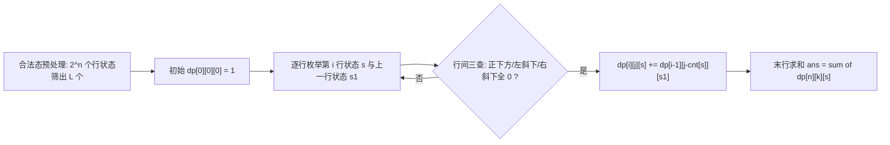

# 状压DP

## 零、知识地图

```text
状压DP
├── 1. 位运算工具箱 —— 掩码读写位、去掉最右的 1、数 1、行内无相邻 1 检查（前置：C 位运算基础，库内无独立笔记，本篇自讲最小集）
├── 2. 状态压缩思想 —— 一行棋盘压成一个二进制数、编码与解码、状态总数 2^n（前置：1）
├── 3. P1896 互不侵犯 —— 合法态预处理 + 行间三查 + dp[i][j][s] 递推（前置：1、2、递推 DP）
└── 4. 状压 DP 适用条件 —— n≤20 判据、审题信号、时间与内存双账（前置：2、3）

学习顺序：1 → 2 → 3 → 4。理由：先备齐操作整数的位级工具（1），再建立"集合变整数"的核心抽象（2），然后用真题把完整套路跑通（3），最后回到"什么时候才轮到它"的判据（4）——工具、抽象、实战、边界。
```

## 一、为什么需要它

先用你大概率碰过壁的方式做一遍 P1896 [SCOI2005] 互不侵犯：$n \times n$ 棋盘放 $k$ 个国王，谁也不能在谁的八邻域内（含斜向），数方案数。暴力逐格枚举每个格子放或不放，n=9 时是 $2^{81} \approx 2.4 \times 10^{24}$ 种放法；换成"逐行决定、行内再逐格"的排列类枚举，20 列规模也有 $20! \approx 2.4 \times 10^{18}$，同样必死。碰壁的根源：**状态里藏着一个集合，枚举在按元素逐个排列。** 状压 DP 的破法只有一句话：**把一整行（或一个集合）压成一个二进制整数，让"集合"直接当 DP 状态。** n=20 时状态总数 $2^{20} \approx 10^6$，乘上每状态 20 次转移约 $2 \times 10^7$ 次操作，从 $10^{18}$ 量级掉到 $10^7$ 量级（A 源 slide 1、3）。

本篇讲 4 个知识点：位运算工具箱、状态压缩思想、P1896 全流程、适用条件判据。顺序理由：工具（知识点 1）先于抽象（知识点 2），实战（知识点 3）先于判据（知识点 4）。

## 二、知识点逐讲（每个知识点一节，共 4 节）

### 1. 位运算工具箱：操作一个数的二进制位

前置依赖：C 语言位运算基础（&、|、<<、>>、~）——库内暂无位运算独立笔记，最小集在本节①自讲；递推计数（数 1 的循环）
后续衔接：[[#2. 状态压缩思想：一整行棋盘压成一个数]]、[[#3. P1896 互不侵犯：合法态预处理与行间转移]]

**① 它解决什么问题**

状压 DP 的状态是一个整数，但语义是"若干个 0/1 事件的集合"（A 源 slide 1：8 枚硬币的正反结果，用一个 8 位二进制数完全表示，共 $2^8 = 256$ 个状态）。于是一切集合操作都要落到**位运算**上：查某一位、改某一位、数有几个 1、判断"有没有两个 1 相邻"。复杂度总账先给出：六件套每个操作 O(1)，数 1 的循环 O(1 的个数)，都不破坏原状态值——为什么必须"不破坏"？因为 DP 转移里同一个状态值要被反复读取、作为数组下标使用，任何读操作都不能改写它。

最小集（A 源 slide 2 的规律，C 位运算回顾）：$1 \& x = x$，$0 \& x = 0$（与 1 相与保原值，与 0 相与清零）；$1 \| x = 1$，$0 \| x = x$（或 1 置 1，或 0 保原值）。这两条就是"掩码读写位"的全部原理。

**② 直觉理解**

模型级类比：**配电箱的一排闸刀**。每个闸刀只有开/关两态，整排闸刀的开关图案就是"状态"；掩码是一张打了孔的模板，按上去只看到（只改到）孔位对应的闸刀——`1<<(i-1)` 就是"只在第 i 个位置开孔"的模板。

用具体数字跑一遍（A 源 slide 4 的那行棋盘）：一行 6 格，王放在第 1、3、6 格，二进制写作 101001，十进制 41。问"第 4 格有没有王"：造模板 $1<<3 = 8$（二进制 1000），$41 \& 8 = 0$，没有王——一次与运算出答案。

**③ 原理与推导**

六件套逐条推导（A 源 slide 2 技巧 1-4，另两条为 P1896.cpp 实际用到的数 1 与行内检查）：

1. **判断第 i 位是不是 1**：`((1 << (i-1)) & x) > 0`。掩码只有第 i 位是 1，按位与时其余位全被清成 0；结果非 0 当且仅当 x 的第 i 位是 1。为什么用"结果 > 0"而不是"结果 == 1"？因为与的结果要么是 0 要么恰好等于掩码 $2^{i-1}$，不一定是 1。
2. **第 i 位置 1**：`x | (1 << (i-1))`。或上掩码把该位强制变 1，其余位由 $0 \| x = x$ 保原值。为什么用按位或不用加法？该位已是 1 时加法会进位破坏高位（坑点见④）。
3. **第 i 位清 0**：`x & ~(1 << (i-1))`。`~` 按位取反，掩码变成"只有第 i 位是 0"的反模板，与运算把该位清 0、其余位由 $1 \& x = x$ 保原值。
4. **去掉最靠右的 1**：`x & (x-1)`。减 1 会把最右的 1 变 0、它右边的所有 0 变 1（借位），与原数相与后恰好只消掉这一个 1。例：$41 = 101001_2$，$40 = 101000_2$，$41 \& 40 = 101000_2 = 40$。
5. **数 1 的个数**：反复 `x = x & (x-1)` 直到 0，每次消掉一个 1，循环次数就是 1 的个数。B 源 P1896.cpp L21-25 用的是 `s1 % 2 == 1` 计数后 `s1 /= 2` 的除 2 逐位读法——除 2 等价于右移一位、`%2` 等价于读最低位，两种写法语义相同；素材特意先 `s1 = s` 拷贝副本再循环，为什么？因为循环会不断改写 s1，直接用 s 会把状态值本身破坏掉。
6. **行内无相邻 1 检查**：`(s & (s<<1)) == 0`（B 源 L16）。若 s 有相邻的两个 1（第 i、i+1 位），左移后第 i 位的 1 正好对齐到第 i+1 位，与结果非 0；反之恒为 0。这就是后面 P1896"一行内国王不能左右相邻"的位运算表达。

状态展开的二进制示意（以 41 为例）：

```text
s       = 1 0 1 0 0 1   （41，王在第 1、3、6 格）
s << 1  = 1 0 1 0 0 1 0 （82，整体左移一格）
s & (s<<1) = 0           （错位相与无公共 1 -> 行内无横向相邻的王，合法）
```

**④ 代码演示**

六件套的最小实现（自编骨架，逐条对应 A 源 slide 2 技巧与 B 源 P1896.cpp L16、L21-25）：

```cpp
// 位运算六件套（C 等价说明：本块全部为 C 语法，与 C99 完全兼容）
bool testBit(int x, int i) {                    // 技巧1：第 i 位（最低位记为第 1 位）是否为 1
    return ((1 << (i - 1)) & x) > 0;            // 结果非 0 即该位为 1；复杂度 O(1)
}
int setBit(int x, int i) { return x | (1 << (i - 1)); }     // 技巧2：第 i 位置 1（按位或，防进位）
int clearBit(int x, int i) { return x & ~(1 << (i - 1)); }  // 技巧3：第 i 位清 0
int dropLowest(int x) { return x & (x - 1); }               // 技巧4：去掉最靠右的 1
int popcount(int x) {                           // 数 1 的个数；复杂度 O(1 的个数)
    int c = 0;
    while (x) { x = dropLowest(x); c++; }       // 每循环一次消掉一个 1
    return c;
}
bool rowOK(int s) {                             // B 源 L16：行内无相邻 1 的自反检查
    return ((s & (s << 1)) == 0) && ((s & (s >> 1)) == 0);
}
// 技巧5（A 源 slide 2 只给思想，公式为通识补充）：枚举 s 的所有非空子集
// for (int s1 = s; s1; s1 = (s1 - 1) & s) { /* s1 依次取到 s 的每个非空子集 */ }
```

**执行追踪表**（对 41 = 101001 逐个操作，掩码与中间值全部展开）：

| 步骤 | 当前元素 | 结构状态 | 动作 | 结果 |
|:---:|:---:|:---|:---|:---|
| 1 | x=41 (101001) | 原值不动 | 掩码 1<<3=8 (1000)，41&8=0 | 第 4 位无王，返回 0 |
| 2 | x=41 (101001) | 原值不动 | 掩码 1<<4=16 (10000)，41&16=16 | 第 5 位有王，返回非 0 |
| 3 | x=41 (101001) | 原值不动 | x-1=40 (101000)，41&40 | 得 40 (101000)，最右的 1 消失 |
| 4 | x=40 (101000) | 40 | 40-1=39 (100111)，40&39 | 得 32 (100000)，又消一个 1 |
| 5 | x=41 (101001) | 副本 s1=41 | 41&40 得 40，40&39 得 32，32&31 得 0，共 3 轮 | popcount(41)=3 |
| 6 | s=41 (101001) | 原值不动 | 41&82=0 且 41&20=0 | rowOK(41)=true，行合法 |

**错误写法对照**：

```diff
- if (s & s << 1 == 0)   // 坑1：漏括号——== 的优先级高于 &，实际算的是 s & ((s<<1)==0)，即"左移后非 0 就把整个表达式变成 s&0"，逻辑全错（WA 且极难察觉）
+ if ((s & (s << 1)) == 0)   // B 源 L16 原样：按位与先算，再与 0 比较
- x + (1 << (i - 1))   // 坑2：置 1 用加法——该位已是 1 时进位破坏高位，状态值错（WA）
+ x | (1 << (i - 1))   // 按位或置 1 不进位
- while (s) { if (s % 2 == 1) cnt++; s /= 2; }   // 坑3：直接在状态 s 上循环——s 被除 2 改光，后续转移拿到的是 0（WA）
+ int s1 = s; while (s1) { ... s1 /= 2; }   // B 源 L20 原样：先拷贝副本，原状态保住
```

**⑤ 典型应用**

- 真题：P1896 互不侵犯（B 源，知识点 3 全流程）——合法态筛用 rowOK（L16），数王数用 %2 循环（L21-25）。
- 真题：P2704 [NOI2001] 炮兵阵地——同样的行内检查思想，攻击距离为 2，条件换成 `(s & (s<<2)) == 0` 且需记忆上两行（题号真实，标注：资料未覆盖，属补充）。
- 迁移检验题（自编）：对 x=41 求三个值：testBit(41,4)、clearBit(41,4)、dropLowest(41)。建议先独立做，再对照题解。题解：$41 = 101001_2$，第 5 位（掩码 16）是 1，故 testBit(41,4) 为真；clearBit(41,4) = 41 & ~16 = 100001 二进制 = 33；dropLowest(41) = 41 & 40 = 40。三步全部只动目标位，其余位不变——这正是掩码的设计动机。

**⑥ 坑点与边界**

> **【易错】** 位运算与比较混写不加括号。`==`、`<` 的优先级都高于 `&`、`|`，`s & s<<1 == 0` 与 `(s & (s<<1)) == 0` 是两个完全不同的表达式，见④坑 1。g++ 对此会告警，告警信息必须当回事。

> **【易错】** 数 1 时直接改写状态本身。素材用 `s1 = s` 拷贝副本规避；用 `x & (x-1)` 循环同样要拷贝，否则原状态被销毁。

> **【注意】** 位编号约定要全篇统一：素材 slide 2 说"最低第 1 位"（掩码 `1<<(i-1)`），编码棋盘时通常第 i 列对应掩码 `1<<(i-1)` 或 `1<<i`，选一种写法贯穿全篇，混用必然错位。

> [!example]-
> **边界数据集（先自己跑一遍，再展开对照）**
> 1. 空输入：x=0 → testBit(0,i)=0、popcount(0)=0、dropLowest(0)=0&(-1)=0（0 与全 1 相与仍是 0，预期：全部幂等不崩）。
> 2. 单元素：x=1 → popcount(1)=1、dropLowest(1)=0、rowOK(1)=true（预期：3）。
> 3. 全相同：x=全 1（int 32 位） → popcount=32、rowOK=false（预期：有相邻 1，判非法）。
> 4. 严格递增：x=1,3,7,15（位数递增） → popcount 依次 1,2,3,4，rowOK 对 3 起恒 false（预期：规律一致）。
> 5. 严格递减：x=2^k 形（100...0） → popcount 恒 1、rowOK 恒 true（预期：单比特永无相邻）。
> 6. 极值：i=30 时掩码 1<<29 正常；i=31 时 1<<30 仍正；但 1<<31 在 int 下溢出为负（有符号左移溢出，未定义行为）——处理第 31 位及以上改用 unsigned 或 long long（预期：不碰有符号溢出）。

回扣开场：逐格枚举的 $2^{81}$ 里，"一行怎么放"被拆成了 81 次独立判断；现在你能用一个整数 + rowOK 一次判完一整行了——下一步是把"一行"真正当作一个状态来用。

### 2. 状态压缩思想：一整行棋盘压成一个数

前置依赖：[[#1. 位运算工具箱：操作一个数的二进制位]]、[[枚举与模拟]]（枚举总量与复杂度意识）
后续衔接：[[#3. P1896 互不侵犯：合法态预处理与行间转移]]、[[#4. 状压 DP 适用条件：n≤20 判据与审题信号]]

**① 它解决什么问题**

状态压缩（A 源 slide 1、3）：把一串只有 0/1 两态的单元（棋盘一行、硬币一排）用一个二进制整数表示，"状压状压，就是把一种状态压缩成一个数"。它解决两个问题：一是**存储**，一行 n 格从 n 个变量变成 1 个 int；二是**可计算**，DP 状态必须能当数组下标、能整体比较、能整体赋值——这是为什么压成"整数"而不是别的结构：数组下标只能是整数，整数的相等比较与赋值都是一条指令。复杂度口径同步给出：状态总数 $2^n$，编码/解码各 O(n)，后续一切 DP 的开销都从 $2^n$ 这个底数上长出来。

**② 直觉理解**

模型级类比：**一排电灯开关的面板编号**。面板上 n 个开关的图案共有 $2^n$ 种，给每种图案发一个唯一编号（就是把图案当二进制数读出来）；以后谈论"第 41 号图案"就是在谈论一整排开关的状态，不需要逐个开关复述。

用具体数字跑一遍（A 源 slide 4 的例子）：一行 6 格，王在第 1、3、6 格，逐格写作 1,0,1,0,0,1；连起来看成二进制 101001，十进制 41。反过来，41 的二进制展开逐位读回，就是这行棋盘的完整摆放。一个数，双向无损。

**③ 原理与推导**

编码公式：第 i 格（从 0 数起）对应掩码 $2^i$（即 `1<<i`），$s = \sum_{cell_i = 1} 2^i$。文字版结论：放了王的格子按各自位权相加，就是这行的状态数。

为什么 n 不能太大：状态总数是 $2^n$，DP 数组要按它开下标，int 的 32 个位里实际可用的状态宽度约 20 到 30 位（A 源 slide 3 用条件 (2)：状态要能装进 int/long 这类基本类型）。这解释了状压题的数据范围长相——总有一维小得反常（P1896 的 $n \le 9$，TSP 的 $n \le 20$），知识点 4 展开成判据。

解码公式：读第 i 格就是 `(s >> i) & 1`——先右移把目标位送到最低位，再与 1 相与。为什么先移位再与？因为与运算只能读最低位那一档的对齐信息，移位是"把想看的位对准读数口"。

**④ 代码演示**

编码与解码演示（自编，机制取自 A 源 slide 4 的 101001 转 41 例子；cin/cout 为首个 C++ 特性，C 等价写法见注释）：

```cpp
#include <iostream>                      // C 等价：#include <stdio.h>
using namespace std;                     // C 等价：每个标识符前加 std::（或直接用 printf/scanf）
int main() {
    int n = 6;
    int cell[6] = {1, 0, 1, 0, 0, 1};    // A 源 slide 4 的布局：王在第 1、3、6 格
    int s = 0;
    for (int i = 0; i < n; i++)          // 编码：第 i 格 -> 掩码 1<<i
        if (cell[i]) s = s | (1 << i);   // 置位用按位或（坑：加法会进位）
    cout << s << "\n";                   // 输出 41（C 等价：printf("%d\n", s);）
    for (int i = 0; i < n; i++)          // 解码：逐位读回
        cout << ((s >> i) & 1);          // 输出 100101（低位在前，与编码位序一致）
    cout << "\n";
    return 0;
}
```

**执行追踪表**（编码过程，cell = {1,0,1,0,0,1}，逐格推进到 41）：

| 步骤 | 当前元素 | 结构状态 | 动作 | 结果 |
|:---:|:---:|:---|:---|:---|
| 1 | cell[0]=1 | s=0 (000000) | s 与 1<<0=1 按位或 | s=1 (000001) |
| 2 | cell[1]=0 | s=1 (000001) | 跳过 | s=1 |
| 3 | cell[2]=1 | s=1 (000001) | s 与 1<<2=4 按位或 | s=5 (000101) |
| 4 | cell[3]=0 | s=5 (000101) | 跳过 | s=5 |
| 5 | cell[4]=0 | s=5 (000101) | 跳过 | s=5 |
| 6 | cell[5]=1 | s=5 (000101) | s 与 1<<5=32 按位或 | s=41 (101001) |

**错误写法对照**：

```diff
- for (int i = 0; i < n; i++) s += cell[i] << (i - 1);   // 坑1：位号错位——最低格应对应掩码 1<<0，写成 1<<(i-1) 后整行状态整体错一位，与下一行做冲突检查时全部对不齐（WA）
+ for (int i = 0; i < n; i++) if (cell[i]) s |= 1 << i;   // 第 i 格对应掩码 1<<i，位序全篇统一
- int s = 0, t = 0; for (...) { t = s; s |= 1 << i; }   // 坑2（虚构示意）：想"回退"状态而手工拷贝——多此一举，且容易漏拷
+ 置位/清位都走 setBit/clearBit 这类不改语义的原地操作   // 状态转移要可逆时用清位即可，不需要备份
```

**⑤ 典型应用**

- 真题：P1896 互不侵犯（B 源）——"一行一个状态"的直接应用，行状态总数 $2^n$，n=9 时 512 个。
- 真题：P1879 [USACO06NOV] Corn Fields G——行状态编码 + 地形限制（状态必须与当行可用地图按位与后无冲突），套路与 P1896 只差一个掩码（题号真实，标注：资料未覆盖，属补充）。
- 迁移检验题（自编）：8 枚硬币（A 源 slide 1 场景）某次结果是"正反正反正反正反"，把它编码成整数，再解码验证。建议先独立做，再对照题解。题解：以正面为 1，第 i 枚对应掩码 $2^{i-1}$，$s = 1 + 4 + 16 + 64 = 85$（二进制 01010101）；解码逐位 `(s>>i)&1` 读回 1,0,1,0,1,0,1,0，与原结果一致。状态总数 $2^8 = 256$，与 slide 1 的口径相同。

**⑥ 坑点与边界**

> **【易错】** 位序约定前后不一致。编码时第 0 格放最低位、比较两行冲突时却按"第 1 位是第 1 格"理解，斜向检查全部错位。对策：位序约定写进注释，全篇只用一种。

> **【易错】** 误以为压缩节省了时间。压缩的直接收益是"集合可当整数参与 DP"（可下标、可比、可整体转移）；时间账要看状态总数 $2^n$ 与转移代价，n 大了一样死（知识点 4 的主题）。

> **【注意】** 同一行的状态数是 $2^n$ 而不是 n：n=9 时是 512 个状态、不是 9 个。数组开 `dp[...][1<<n]`，开成 `dp[...][n]` 是新手高发 RE。

> [!example]-
> **边界数据集（先自己跑一遍，再展开对照）**
> 1. 空输入：全 0 行 → s=0，rowOK(0)=true（预期：空状态是合法态，cnt=0）。
> 2. 单元素：n=1 的行 → 状态集 {0,1} 共 2 个（预期：$2^1$）。
> 3. 全相同：全 1 行 n=9 → s=511，rowOK(511)=false（预期：被合法态筛淘汰，不进入 DP）。
> 4. 严格递增：n=1..9 逐档放宽 → 状态数 2,4,8,...,512（预期：每加一列翻倍）。
> 5. 严格递减：把 41 的位倒序读 → 100101 = 37（预期：与 41 是两个不同状态，位序约定必须固定）。
> 6. 极值：n=30 → $2^{30} \approx 10^9$ 个状态，逐个枚举已不可行（预期：此宽度放弃直接状压，这正是知识点 4 判据的来源）。

回扣开场：一行棋盘从 81 次逐格判断变成一个可下标的整数 41。现在你能解决"集合怎么当 DP 状态"这个问题了——下一节把行与行之间的约束也用位运算管起来，跑通 P1896 全题。

### 3. P1896 互不侵犯：合法态预处理与行间转移

前置依赖：[[#1. 位运算工具箱：操作一个数的二进制位]]、[[#2. 状态压缩思想：一整行棋盘压成一个数]]、递推 DP（线性 DP（同批产出，暂以文字锚定））
后续衔接：[[#4. 状压 DP 适用条件：n≤20 判据与审题信号]]、[[搜索优化]]（合法态预筛即"剪掉非法分支"的静态版）

**① 它解决什么问题**

洛谷 P1896 [SCOI2005] 互不侵犯（A 源 slide 4 给出题意与链接）：$n \times n$ 棋盘放 $k$ 个国王，使每个国王的九宫格内没有其他国王，求方案数。数据 $1 \le n \le 9$，$0 \le k \le n^2$。解法骨架（A 源 slide 4-7）：一行一个二进制状态，`dp[i][j][s] = 前 i 行放完、第 i 行状态为 s、共用 j 个国王的方案数`。复杂度总账：合法态预处理 O($2^n$)；DP 主体 O($n \cdot L^2 \cdot k$)，其中 L 是一行合法状态数（n=9 时实测 L=89，远小于 $2^9=512$），内存 $15 \times 105 \times 1005$ 个 long long 约 12.7MB——全部在时限与内存限制内。

**② 直觉理解**

模型级类比：**阅兵方阵逐排检查**。每排的站姿（哪些位置站人）先单独审查一遍（合法态预处理），不合格的排法永远不上场；然后一排一排往下传，传的时候只检查"这一排和上一排会不会互相动手"——再往前排的站姿已无关，因为国王只攻击相邻两排。

用具体数字跑一遍（官方样例 n=3, k=2，手算）：3×3 共 9 格，任选 2 格放王有 $C_9^2 = 36$ 种；其中八邻域相邻的对子有横向 $3 \times 2 = 6$、纵向 6、斜向 $2 \times 2 \times 2 = 8$，共 20 个；$36 - 20 = 16$，与官方输出一致（实测见附录 B-5）。

**③ 原理与推导**

**行内约束**（A 源 slide 6-7）：一行之内国王不能左右相邻，即状态 s 无相邻 1，条件 `(s & (s<<1)) == 0`（知识点 1 的 rowOK）。

**行间约束**（A 源 slide 5-6）：上一行状态 s1 的王会攻击当前行状态 s 的正下方、左斜下、右斜下三个位置，逐个位运算化：

```text
正下方：s1 = 101001, s = 001001 ->  s & s1        = 001001 非 0，冲突
右斜下：s1 = 101001, s = 010010 ->  (s<<1) & s1   = 100100 非 0，冲突（先左移对齐再查）
左斜下：s1 = 101001, s = 010010 ->  (s>>1) & s1   = 010100 非 0，冲突（先右移对齐再查）
合法要求：三个与结果全为 0。
```

文字版推导链：正下方两位同列，直接与；斜向差一列，把 s 左移或右移一格把斜位对齐成正位再与；三查全 0 说明 s1 的每个王在 s 里都没有可攻击对象，转移合法。

**状态转移**（A 源 slide 7-8）：第 i 行放状态 s 时新用掉 `cnt[s]` 个国王——为什么新增王数恰是 s 里 1 的个数？因为本行的王只由本行状态决定，s 有几个 1 就放几个王；于是留给前 i-1 行的国王数是 `j - cnt[s]`，得递推式

$$dp[i][j][s] \mathrel{+}= dp[i-1][j - cnt[s]][s1]$$

文字版结论：第 i 行以状态 s 收尾、共 j 王的方案数，从"上一行以任一兼容状态 s1 收尾、共 j-cnt[s] 王"的所有方案累加而来。初始 `dp[0][0][0] = 1`（A 源 slide 8：0 行 0 王，唯一方案是"什么都不放"）——为什么它是 1？空方案是计数的单位元，所有方案链都从它出发逐行生长；漏掉它则全表为 0。答案为 $\sum_s dp[n][k][s]$（末行取遍合法状态）。

**设计动机**：为什么先预处理合法态、DP 时只在合法态之间转移？若直接枚举 $2^n \times 2^n$ 对状态，n=9 时是 26 万对，其中大量行内就非法的废状态；先筛出 L 个合法态（n=9 时 L=89，该数按斐波那契数列增长），DP 内层降为 $L^2 = 7921$ 对——把"永远不合法"的组合在进 DP 前就剪掉，这是用一遍 O($2^n$) 预处理换 DP 常数的典型设计。

行间转移全流程：



文字版：预处理把 L 个合法态存进 ok 数组并算好各自的 cnt；DP 从空状态出发，逐行在合法态对之间做三查转移并累计王数；n 行扫完，把第 n 行所有合法状态的答案求和输出。

**④ 代码演示**

取自源文件 P1896.cpp（改动：删去未使用的 include<cstdio>、include<vector>；缩进与注释排版调整；逻辑逐行原样。另注：素材为单次运行，cnt/dp 未清零是安全的；若把 main 改写成函数复用必须补清零——附录 B-5 有此教训）。完整版见源文件 P1896.cpp。

```cpp
#include <iostream>                      // C 等价：#include <stdio.h>
using namespace std;                     // C 等价：标识符前加 std::
int n, k;
long long ok[1005], cnt[1005];           // ok[l]=s：第 l 个合法行状态；cnt[s]：状态 s 的王数
int num = 0, s1;
long long dp[15][105][1005];             // dp[i][j][s]：前 i 行放完、第 i 行状态 s、共用 j 王的方案数

int main() {
    cin >> n >> k;                       // C 等价：scanf("%d%d", &n, &k);
    for (int s = 0; s < (1 << n); s++) {                       // 合法态预处理：枚举 2^n 个行状态
        if (((s & (s << 1)) == 0) && ((s & (s >> 1)) == 0)) {  // 行内自反检查（知识点 1 rowOK）
            num++;
            ok[num] = s;
            s1 = s;                      // 副本：数 1 的循环会改写 s1，不能动 s
            while (s1) {
                if (s1 % 2 == 1) cnt[s]++;   // %2 读最低位，等价于 (s1&1)
                s1 /= 2;                     // 除 2 等价于右移一位
            }
        }
    }
    dp[0][0][0] = 1;                     // 边界：0 行 0 王，唯一空方案（A 源 slide 8）
    int s;
    for (int i = 1; i <= n; i++)         // 枚举当前放第 i 行
        for (int l = 1; l <= num; l++) { // 枚举第 i 行合法状态
            s = ok[l];
            for (int r = 1; r <= num; r++) {                   // 枚举第 i-1 行合法状态
                s1 = ok[r];
                if (((s & s1) == 0) && (((s << 1) & s1) == 0) && (((s >> 1) & s1) == 0)) {   // 行间三查
                    for (int j = 0; j <= k; j++)               // 枚举已用国王数
                        if (j - cnt[s] >= 0)                   // 边界：前 i-1 行王数不能为负
                            dp[i][j][s] += dp[i - 1][j - cnt[s]][s1];
                }
            }
        }
    long long ans = 0;
    for (int i = 1; i <= num; i++) ans += dp[n][k][ok[i]];     // 答案：末行取遍合法状态求和
    cout << ans << endl;                 // C 等价：printf("%lld\n", ans);（long long 用 %lld）
    return 0;
}
```

**执行追踪表一：合法态筛**（n=3，s 从 0 扫到 7，`1<<n` = 8）：

| 步骤 | 当前元素 | 结构状态 | 动作 | 结果 |
|:---:|:---:|:---|:---|:---|
| 1 | s=0 (000) | ok={} | 0&0=0 且 0&0=0，无相邻 1 | 入 ok[1]=0，cnt[0]=0，num=1 |
| 2 | s=1 (001) | ok={0} | 1&2=0 且 1&0=0 | 入 ok[2]=1，cnt[1]=1，num=2 |
| 3 | s=2 (010) | ok={0,1} | 2&4=0 且 2&1=0 | 入 ok[3]=2，cnt[2]=1，num=3 |
| 4 | s=3 (011) | ok={0,1,2} | 3&6=2 非 0，第 1、2 位相邻 | 淘汰 |
| 5 | s=4 (100) | ok={0,1,2} | 4&8=0 且 4&2=0 | 入 ok[4]=4，cnt[4]=1，num=4 |
| 6 | s=5 (101) | ok={0,1,2,4} | 5&10=0 且 5&2=0 | 入 ok[5]=5，cnt[5]=2，num=5 |
| 7 | s=6 (110) | ok={0,1,2,4,5} | 6&12=4 非 0 | 淘汰 |
| 8 | s=7 (111) | ok={0,1,2,4,5} | 7&14=6 非 0 | 淘汰 |

**执行追踪表二：DP 转移**（n=2, k=1：合法态 0(00)、1(01)、2(10)，cnt 为 0、1、1；兼容对只有不共享、不斜邻的组合，如 1 与 2 斜邻互斥）：

| 步骤 | 当前元素 | 结构状态 | 动作 | 结果 |
|:---:|:---:|:---|:---|:---|
| 1 | i=1, s=0(00) | dp[0][0][0]=1 | 与 s1=0,1,2 全兼容，j=0 | dp[1][0][0]=1 |
| 2 | i=1, s=1(01) | dp[1][0][0]=1 | s1 取 0,2；j=1 扣 cnt[1]=1 | dp[1][1][1]=1 |
| 3 | i=1, s=2(10) | dp[1][1][1]=1 | s1 取 0,1；j=1 扣 cnt[2]=1 | dp[1][1][2]=1 |
| 4 | i=2, s=0(00) | dp[1][1][1]=dp[1][1][2]=1 | 全兼容；j=1 承接上一行 1 王 | dp[2][1][0]=2 |
| 5 | i=2, s=1(01) | dp[1][0][0]=1 | s1 取 0,2；j=1 扣 cnt[1]=1 | dp[2][1][1]=1 |
| 6 | i=2, s=2(10) | dp[1][0][0]=1 | s1 取 0,1；j=1 扣 cnt[2]=1 | dp[2][1][2]=1 |
| 7 | 汇总 | dp[2][1][0,1,2]=2,1,1 | ans 累加三种末行状态 | 输出 4 |

（输出 4 与断言程序实测 n=2,k=1 的 4 一致，附录 B-5。）

**错误写法对照**：

```diff
- if (s & s << 1 == 0)   // 坑1：优先级陷阱——== 高于 &，合法态判错，整张 DP 表建立在废状态上（WA）
+ if (((s & (s << 1)) == 0) && ((s & (s >> 1)) == 0))   // B 源 L16 原样：括号齐全
- if (((s & s1) == 0)) { ... }   // 坑2：行间只查正下方——斜向相邻的两个王互不检查，官方样例可能侥幸、对抗数据必错（WA）
+ if (((s & s1) == 0) && (((s << 1) & s1) == 0) && (((s >> 1) & s1) == 0)) { ... }   // B 源 L39 原样：三查缺一不可
- dp[i][j][s] += dp[i - 1][j - cnt[s]][s1];   // 坑3：漏 j-cnt[s]>=0 判断——j 小于本行王数时下标为负（RE）
+ if (j - cnt[s] >= 0) dp[i][j][s] += dp[i - 1][j - cnt[s]][s1];   // B 源 L43 原样
- int ans = 0;   // 坑4：答案用 int——n=9、k=13 时方案数 57647295377，约为 int 上限的 27 倍（WA，输出截断值）
+ long long ans = 0;   // B 源原样：dp 与 ans 全用 long long（峰值实测见附录 B-5）
```

**⑤ 典型应用**

- 真题：P1896 本题（B 源 + A 源 slide 3 链接）——④即完整题解，官方样例输出 16 实测通过（附录 B-5）。
- 真题：P1879 [USACO06NOV] Corn Fields G——在 P1896 上加"地形掩码"：状态 s 还须满足 `s & 地图行 == s`（只能放在可用格上），其余不变（题号真实，标注：资料未覆盖，属补充）。
- 真题：P2704 [NOI2001] 炮兵阵地——攻击距离 2，行内条件换成 `(s & (s<<2)) == 0`，且 DP 需同时记住上两行状态（题号真实，标注：资料未覆盖，属补充）。
- 迁移检验题（自编）：1×n 的走廊里摆 k 个装饰灯，任意两灯不相邻（左右），求方案数。数据范围：$1 \le n \le 50$，$1 \le k \le 25$；输入一行 n k，输出方案数。建议先独立做，再对照题解。题解：这是 P1896 去掉行间约束、去掉斜向的退化版，单行即可完成——令 `f[i][j]` 为前 i 格放 j 灯且第 i 格放灯的方案数，`f[i][j] = sum(f[i-2][j-1])`（第 i 格放灯则第 i-1 格必空）；答案为 `sum over i of f[i][k]`。小数据验证：n=3,k=2 时方案只有"第 1、3 格"一种；n=4,k=2 时为 {1,3},{1,4},{2,4} 共 3 种。本题另有插空法闭式 $C_{n-k+1}^{k}$：$C_2^2 = 1$、$C_3^2 = 3$，与 DP 一致，可互为对拍。

**⑥ 坑点与边界**

> **【易错】** 行间漏查斜向。只写 `(s & s1) == 0` 查正下方，左斜下、右斜下的冲突全部漏判（④坑 2）——国王是八方向攻击，位运算三查一个不能少。

> **【易错】** 边界与类型双雷。`j - cnt[s] >= 0` 漏判是 RE，`ans` 用 int 是 WA（峰值 5.7×10^10）；两处素材都写对了，抄板子时最容易被自己"精简"掉。

> **【注意】** 合法态数 L 的增长是斐波那契式的（长度 n 的无相邻 1 串），不是 $2^n$ 也不是 n：n=9 时 L=89（实测）。估算复杂度用 L 而不用 $2^n$，否则会把能过的题误判成超时。

> [!example]-
> **边界数据集（先自己跑一遍，再展开对照）**
> 1. 空输入/退化：k=0 → 输出 1（全不放也是方案；实测 n=9,k=0 输出 1）。
> 2. 单元素：n=1,k=1 → 1；n=1,k=2 → 0（一格放不下两王，实测）。
> 3. 全相同：每行状态全 0 的转移链全程只有 1 条 → k=0 时答案 1（预期：空状态链是唯一通路）。
> 4. 全冲突：n=2,k=2 → 0（2×2 任意两格都在彼此八邻域内，含斜向；实测。本条期望值曾被我误手算成 2，被独立暴力对拍纠正——国王斜向也攻击）。
> 5. 严格递增：n=2 固定，k 依次取 0,1,2 → 输出 1,4,0（预期：方案数关于 k 单峰，先增后减）。
> 6. 极值：n=9,k=13 为全题峰值 57647295377（实测，超 int 上限约 27 倍，long long 必备）；n=9,k=81 → 0（实测，81 王全放必相邻）。

回扣开场：逐格的 $2^{81}$ 被"一行一状态 + 合法态预筛 + 行间三查"压成了 $n \cdot L^2 \cdot k$。现在你能解决开场那个 P1896 了——用的是知识点 1 的 rowOK（预处理）、知识点 2 的行状态编码（转移）、以及本节的 dp[0][0][0]=1 与三查递推。

### 4. 状压 DP 适用条件：n≤20 判据与审题信号

前置依赖：[[#2. 状态压缩思想：一整行棋盘压成一个数]]、[[#3. P1896 互不侵犯：合法态预处理与行间转移]]、[[枚举与模拟]]（数据范围反推算法的审题习惯）
后续衔接：[[DFS]]（搜索+剪枝是状压之外的指数级备胎）、[[二分]]（审题决策卡里并列的信号判据）

**① 它解决什么问题**

拿到题先回答"该不该状压"，再动手写。判据（A 源 slide 3 使用条件 (1)(2) 归纳）：**存在一维规模 n≤20 左右、且该维每个单元只有 0/1 两态（或可归约为两态集合）**。时间账：$2^{20} = 1048576 \approx 10^6$，乘上每状态 20 次左右转移约 $2 \times 10^7$，时限内；n=23 起估算操作量越过 $10^8$ 线，n=25 以上基本判死。内存账同理：$2^{20}$ 个 long long 约 8MB，$2^{25}$ 个 int 已 128MB。复杂度本质：状压 DP 是指数复杂度算法（A 源 slide 1："它其实是暴力的算法"），只服务小规模问题。

**② 直觉理解**

模型级类比：**钱包厚度决定记账方式**。只有 20 件物品时，你可以给"每件拿不拿"的每种组合开一个账户（$2^{20}$ 个账户勉强记下）；物品有 30 件时账户数 $10^9$，账本本身比题目还大——这时必须换记账逻辑（搜索剪枝、贪心、多项式 DP）。

用具体数字跑一遍：n=20 的旅行商暴力枚举城市排列是 $20! \approx 2.4 \times 10^{18}$ 条路径，每条算一遍 $10^{-9}$ 秒也要 7 万多年；状压成"已访问城市集合"，状态 $2^{20} \approx 10^6$ 个、每状态 20 次转移，约 $2 \times 10^7$ 次操作，毫秒到秒级。同样的题，判据换算法，差 $10^{11}$ 倍。

**③ 原理与推导**

为什么 $2^n$ 能过而 $n!$ 不能：排列枚举在数"顺序"，n 个元素的顺序有 n! 种；而 DP 的子问题只关心"哪些已选、当前在哪"这类**集合摘要**，同一个集合里无论元素以什么顺序进来，摘要相同、子问题相同——这就是子问题重叠，重叠让 n! 坍缩成 $2^n$。设计动机层面的结论：状压 DP 的状态设计要点是**把"过程顺序"从状态里赶出去，只留集合形状**；若你发现状态里还藏着排列顺序，说明状态设计冗余，复杂度会虚高 n! 倍。

审题信号（决策卡）：数据范围出现"某一维 ≤20/16/9"这类反常小值；状态天然是"每单元两态"（放/不放、选/不选、到达/未到达）；问的是方案数、最值、可行性这类可递推的量。三者齐备，状压 DP 上桌。

**④ 代码演示**

判据演示程序（自编）：打印各 n 档的状态总数与估算操作量，让"可行/超线"从数字里长出来，而不是背结论：

```cpp
#include <iostream>                      // C 等价：#include <stdio.h>
using namespace std;
int main() {
    long long st = 1;                    // st = 2^n
    for (int n = 1; n <= 26; n++) {
        st *= 2;
        long long ops = st * n;          // 估算：每状态 n 次转移（以行间转移类为例）
        cout << "n=" << n
             << " 状态=" << st
             << " 操作~" << ops
             << (ops <= 100000000 ? " 可行" : " 贴线或超时") << "\n";
    }
    return 0;                            // C 等价：printf 逐行打印即可
}
```

**执行追踪表**（判据刻度，演示程序口径：估算操作 = $2^n \times n$，以 $10^8$ 为可行线）：

| n | 2^n（状态数） | 估算操作 | 判定 | 典型题目参照 |
|:---:|:---:|:---:|:---:|:---|
| 9 | 512 | 约 4.6×10^3 | 可行 | P1896（n≤9） |
| 16 | 65536 | 约 1.0×10^6 | 可行 | 棋盘类常见上限 |
| 20 | 1048576 | 约 2.1×10^7 | 可行 | P1171 售货员（n≤20） |
| 22 | 4194304 | 约 9.2×10^7 | 贴线 | 需压常数 |
| 23 | 8388608 | 约 1.9×10^8 | 超线 | 改算法或剪枝 |
| 26 | 67108864 | 约 1.7×10^9 | 超线 | 状压出局 |

**错误写法对照**：

```diff
- if (n <= 30) 用状压 DP;   // 坑1：判据照抄"int 有 32 位"——n=30 时 2^30 约 10^9 状态，每状态哪怕 O(1) 也超时（TLE）
+ if (n <= 20) 用状压 DP;   // 2^20 约 10^6，乘转移量后 10^7 量级，时限内
- static int dp[1 << 25];   // 坑2：按 2^n 直接开数组——n=25 时 2^25 个 int 约 128MB，超多数题目内存上限（MLE）
+ 按"合法状态数"开（如 P1896 的 ok[] 把 512 压到 89）或滚动数组降维
- 看到 100x100 网格就放弃状压   // 坑3：判据对象搞错——状压的是"某一维"的宽度，行数走线性循环，是否可行看列数与有效状态数
+ 判据落在被压缩那一维：列数小（如 ≤20）就值得状压逐行转移
```

**⑤ 典型应用**

- 真题：P1896（n≤9）——判据的"小 n"端，合法态预筛进一步把 512 压到 89（本篇知识点 3）。
- 真题：P1171 售货员的难题——TSP，n≤20，状态"已访问城市集合"，$O(n^2 \cdot 2^n)$，是判据的"标准 n=20"端（题号真实，标注：资料未覆盖，属补充）。
- 迁移检验题（自编）：对以下三题判断能否状压并给理由。建议先独立做，再对照题解。题解：(a) 12 个任务的子集覆盖——n=12，$2^{12}=4096$ 状态，能，且绰绰有余；(b) 30 城市旅行商——$2^{30} \approx 10^9$，不能，需改用分支限界或近似；(c) 100×100 网格但每行只有 6 个可用格——行数 100 走线性循环，被压的维度是列，列宽 100 太大，但若只有 $10^6$ 个有效状态可离散化则可行（此条标注：这一段我不确定通用结论，实际取决于状态能否离散枚举，竞赛中少见，作存疑记录）。

**⑥ 坑点与边界**

> **【易错】** 把"总规模"当成判据对象。P1896 的棋盘 9×9=81 格，但状压的是一行的 9 列（$2^9=512$），81 不进指数；反过来，20×20 的棋盘列数 20 才是状压上限所在（④坑 3）。

> **【易错】** 只算时间不算内存。n=25 时 $2^{25}$ 个 int 已 128MB，时间还没判死的题先死在内存；合法态数、滚动数组是两个常规降压手段。

> **【注意】** n≤20 是量级判据不是铁律：转移代价小的题（每状态 O(1)）n=22 可过，转移重的题（每状态 O(n^2)）n=20 也要掂量；最终以"状态数 × 单状态转移量"的乘积为准。

> [!example]-
> **边界数据集（先自己跑一遍，再展开对照）**
> 1. 空输入：n=0 → $2^0=1$，只有空集一个状态（预期：DP 表退化为 1 项）。
> 2. 单元素：n=1 → 2 个状态，任何 DP 毫秒级（预期：判据永远放行）。
> 3. 全相同：同一 n 反复评估 → 判定结果不变（预期：判据是纯函数，可放心重复调用）。
> 4. 严格递增：n=1..26 逐档评估 → 估算操作量单调上涨，n=23 处越过 $10^8$ 线（演示程序口径，预期：可行档与超线档分界清晰）。
> 5. 严格递减：n 从 26 逐档回评 → 结论对称（预期：分界点仍是 22/23）。
> 6. 极值：n=20 主战场，$2^{20}=1048576$；内存侧 $2^{20}$ 个 long long 约 8MB，而 $2^{25}$ 个 int 已 128MB（预期：先内存后时间，两账都算）。

回扣开场：开场那道"逐行枚举 20 列、$20! \approx 2.4 \times 10^{18}$ 必死"的题，现在你能用判据在 30 秒内识别它该走状压、并把开销算到 $2 \times 10^7$——用的是本节的 $2^{20} \approx 10^6$ 刻度表与"集合摘要替排列"的原理。

## 三、全篇坑点总表

| # | 坑 | 正解 |
|---|-----|------|
| 1 | 位运算与比较混写漏括号（s & s<<1 == 0） | (s & (s<<1)) == 0，g++ 告警必须当回事（知识点 1④） |
| 2 | 置位用加法 | 按位或置 1，防进位（知识点 1④） |
| 3 | 数 1 循环直接改写状态本身 | 先拷贝副本（B 源 s1 = s 原样） |
| 4 | 位序约定前后不一 | 第 i 格对应 1<<i 之类写进注释，全篇统一（知识点 2⑥） |
| 5 | DP 数组按 n 而非 2^n 开 | dp[...][1<<n]（知识点 2⑥） |
| 6 | 行间只查正下方漏斜向 | 三查：s&s1、(s<<1)&s1、(s>>1)&s1 全 0（知识点 3④） |
| 7 | 漏 j-cnt[s]>=0 判断 | 负下标 RE，B 源 L43 原样补判 |
| 8 | 方案数用 int | 峰值 5.7×10^10，dp 与 ans 全 long long（知识点 3⑥） |
| 9 | 漏 dp[0][0][0]=1 | 空方案是计数单位元，漏掉全表为 0（知识点 3③） |
| 10 | 判据对象搞错（总格数进指数） | 判据落在被压缩那一维的宽度（知识点 4⑥） |

## 四、总结与自测

### 核心内容（一页纸速览）

- **位运算六件套**：掩码读位 `1<<(i-1)`、置 1 用或、清 0 用 `&~`、去最右 1 用 `x&(x-1)`、数 1 循环（先拷副本）、行内无相邻 1 用 `(s&(s<<1))==0`（A 源 slide 2 + B 源 L16）。
- **状态压缩**：一串 0/1 单元压成一个整数；编码 $\sum 2^i$、解码 `(s>>i)&1`；收益是"集合可当下标、可比、可整体转移"，状态总数 $2^n$。
- **P1896 套路**：合法态预处理（O($2^n$) 筛出 L 个，n=9 时 89）→ 行间三查（正下、左斜下、右斜下全 0）→ `dp[i][j][s] += dp[i-1][j-cnt[s]][s1]` → 末行求和；初始 `dp[0][0][0]=1`，答案 peak 超 int 必须 long long。
- **复杂度**：P1896 总账 O($n \cdot L^2 \cdot k$)，n=9 时约 $9 \times 89^2 \times k$，实测通过；内存约 12.7MB。
- **适用判据**：存在一维 ≤20、单元两态、问方案数/最值/可行性；$2^{20} \approx 10^6$，n=23 起越 $10^8$ 线；时间内存两账都算。

### 前置概念清单

- C 位运算（&、|、~、<<、>>）：知识点 1 全部工具的地基，本篇自讲最小集。
- 二进制与十进制互转：状态编码/解码（知识点 2）。
- 枚举与复杂度估计：$2^n$、$20!$、$10^8$ 线的量级感（知识点 1②、4②）。
- 递推 DP（线性 DP，同批产出）：dp 表逐阶段生长的形态，P1896 是"行"阶段递推。
- 洛谷题面阅读：输入输出格式与数据范围（P1896 全流程）。

### 自测清单

- [ ] 能不看书写出 rowOK(s) 并解释为什么 `(s&(s<<1))==0` 等价于"无相邻 1"
- [ ] 能把"王在第 1、3、6 格"编成 41 并解码回来
- [ ] 能写出 P1896 行间三查的三条表达式并各配一个冲突例子
- [ ] 能手推 n=3 的合法态筛（5 个合法态：0,1,2,4,5）
- [ ] 能说清 dp[0][0][0]=1 为什么必须是 1、漏掉后果是什么
- [ ] 能说出 n=9 时方案数峰值 5.7×10^10 并据此解释 long long 的必要性
- [ ] 能对一道新题用"一维≤20 + 两态 + 递推量"三信号判断是否状压
- [ ] 能手算 n=2,k=1 的 DP 转移表并得出 4

### 错题登记

| 题号 | 错因 | 正解要点 |
|------|------|---------|
| （学完后填写） | | |

## 五、语法糖对照表

| 语法 | 等价 C 写法 | 一句话用途 |
|------|------------|-----------|
| `cin >> n >> k;` | `scanf("%d%d", &n, &k);` | 流式读入（B 源全程使用） |
| `cout << ans << endl;` | `printf("%lld\n", ans);` | 流式输出；long long 配 %lld |
| `using namespace std;` | 标识符前加 `std::` | 免前缀（.cpp 素材用；纯 C 无此行） |
| `long long` | C89 无对应，C99 起同名词法 | 64 位整数，方案数峰值 5.7×10^10 必备 |

---

## 附录（供验收，正文之外，不影响阅读）

### 附录 A　源文件覆盖对账

#### A-1 提取表

| 源文件 | 提取方式 | 完整性 |
| --- | --- | --- |
| 31.状压动态规划.pptx | pymupdf 提取（8 slides，0 pics，3076 chars），存 素材\状压DP\提取文本\31.状压动态规划.txt | 完整：位运算与状压定义（slide 1-2）、适用条件与 P1896 链接（slide 3）、行状态编码与状态设计（slide 4）、行间冲突位运算推导（slide 5-6）、转移方程与行内约束（slide 7）、初始与答案（slide 8）。图片数统计可能有 zlib 误差；slide 4-6 提到的棋盘配图未随文本保留，但其位运算推导以文字完整给出，讲解自足（读取缺口见附录 B-3） |
| P1896.cpp | 全文直读（59 行） | 完整：合法态预处理 + 数王数 + 三维 DP + 末行求和；含少量行注释；单次运行无输入校验 |

#### A-2 知识点总清单（4 对 4）

| 序号 | 知识点 | 对应源文件 | 优先级 |
|------|--------|-----------|--------|
| 1 | 位运算工具箱（读位/置位/清位/去最低 1/数 1/行内检查） | 31.状压动态规划.pptx slide 2 + P1896.cpp L16、L21-25 | P0 |
| 2 | 状态压缩思想（一行一个二进制数） | 31.状压动态规划.pptx slide 1、3、4 | P0 |
| 3 | P1896 互不侵犯（合法态预处理与行间转移） | 31.状压动态规划.pptx slide 4-8 + P1896.cpp | P0 |
| 4 | 状压 DP 适用条件（n≤20 判据） | 31.状压动态规划.pptx slide 1、3（通识展开标注见 B-4） | P0 |

依赖关系：1 是 2 的操作层（压成整数后一切操作靠位运算）；2 是 3 的状态层（行状态进 DP 表）；3 是 4 的实证层（判据由 P1896 与 TSP 的量级对照归纳）。源文件侧 2 份全部入篇。

#### A-3 冲突与约定差异登记（4 项）

| 何处冲突 | 采信哪方 | 理由 |
| --- | --- | --- |
| 状态命名：slide 4-7 用 S1/S2（S1 为上一行、S2 为当前行），P1896.cpp 用 s/s1（s 为当前行、s1 为上一行/副本） | 采信代码命名 | 正文以代码变量 s（当前行）、s1（上一行）推导，PPT 语义一致仅字母互换；登记以防读者对照时混淆 |
| 行内检查写两条：(s&(s<<1))==0 与 (s&(s>>1))==0 | 保留素材双写并注明等价 | 二者数学等价（存在相邻 1 时两个与结果同时非 0），双写属保险写法，登记为冗余而非冲突 |
| slide 2 技巧 5"枚举子集"只给思想未给公式 | 正文补通识公式 `s1 = (s1-1) & s` 并标注"资料未覆盖，属补充" | 素材该条无公式（可能原为配图，提取文本 pics=0）；公式为公认通识 |
| slide 7 在"新增王数 = 本行 1 的个数"处直接给结论（原文用跳步式措辞衔接） | 正文按不跳步纪律补全推导 | 素材原文措辞跳步；补全理由：王由本行状态唯一决定，故新增王数即该状态的 1 个数 |

### 附录 B　假设与缺口登记

- B-1 假设清单：假设学习者已会 C 位运算记号（&、|、~、<<、>>）；假设未学过 GCC 内建 `__builtin_popcount`（正文一律用素材的 %2 循环或 x&(x-1) 循环，内建不作要求）；假设已接触递推 DP 的"阶段-状态-转移"框架（线性 DP 同批产出，本篇先文字锚定）。
- B-2 预告题号登记：素材无"下节课预告"页；slide 3 末尾含洛谷 P1896 链接，已作为正文例题处理，无遗留预告题号。
- B-3 读取缺口：slide 4-6 的棋盘与攻击范围配图未随提取文本保留（META pics=0，图片数统计可能有 zlib 误差）。建议贴图位置：知识点 2②（棋盘布局图）与知识点 3③（攻击范围图），源文件 31.状压动态规划.pptx 第 4-6 页，由使用者验收时补图。正文以 text 文本块的二进制示意覆盖了同等推导信息。
- B-4 资料缺口与补充：子集枚举公式（slide 2 技巧 5 无公式，通识补充）；合法态数按斐波那契增长的结论（通识）；P1879、P2704、P1171 三道真题的延伸提法（题号真实，资料未覆盖）；知识点 4 的判据演示程序与迁移题、知识点 1/2 的自编骨架与迁移题为自编。
- B-5 编译验证记录：①素材源码 P1896.cpp 经 g++ -std=c++17 -O2 -fsyntax-only 检查 exit=0 无警告；②断言程序 verify_b5_zhuangya.cpp 全过：官方样例 n=3,k=2 输出 16；小数据 n=1,k=1 得 1、n=1,k=2 得 0、n=1,k=0 得 1、n=2,k=1 得 4、n=2,k=2 得 0；n=1..4 全部 k 与独立暴力枚举对拍 ALL PASS；③补充探测：n=9 合法态 89 个，方案数峰值在 k=13 处为 57647295377（超 int 上限约 27 倍），n=9,k=0 得 1、k=81 得 0。教训两条：其一，把素材 main 函数化复用时 cnt[] 未清零，首轮假 FAIL，修正后全过——断言程序自身先要正确；其二，断言期望值 n=2,k=2 曾误手算为 2（漏了国王斜向攻击），独立暴力与正确手算均给 0——断言数据本身也要独立验算。

### 附录 C　交付前自检清单

- [x] 附录 A 有逐份提取表；总清单 4 条 = 正文知识点 4 节，编号一一对应
- [x] 每个知识点六步齐全（①-⑥），以问题开场、以回扣收尾，无"只有定义没有推导"
- [x] 无未解释的新术语；无跳过推导的措辞
- [x] 全文无 emoji
- [x] 同一引用块只有一个主标签；callout 声明行独占一行；标题不跳级；表格 ≤6 列
- [x] 代码均为 C++17 可编译（P1896.cpp 语法检查 exit=0；断言程序与演示程序同轮编译运行通过）；例子用具体数字完整算过；代码改动已注明；迁移题已注明出处或标注"自编"；真题题号真实
- [x] 关键结论已注明来源；不确定处已显式标注"这一段我不确定"（知识点 4⑤(c) 条）
- [x] frontmatter 六项齐全（tags / 优先级 / 掌握状态 / 最后复习日期 / 来源 / 生成日期）
- [x] 零、知识地图文本树在篇首；每个知识点头部有前置依赖 / 后续衔接两字段
- [x] ④节为代码演示三块：核心代码 + 执行追踪表（知识点 3 配两张：合法态筛 + DP 转移）+ 错误写法对照（diff 块）
- [x] ⑥节末尾边界数据集六类（含极值查溢出）；C++ 特性首现处有 C 等价注释，篇末有语法糖对照表
- [x] 公式为 LaTeX 且配文字版结论；mermaid 1 个且配文字版推导链
- [x] 双链按 Obsidian 口径使用（库内真实笔记 [枚举与模拟]、[搜索优化]、[DFS]、[二分]；同批未产出笔记以文字锚定）
- [x] 性质融入正文；推导含设计动机回答；类比均为模型级（模板打孔 / 面板编号 / 阅兵逐排 / 钱包记账）
- [x] 工程痕迹全部在附录（对账 / 假设 / 自检），正文无验收类内容
