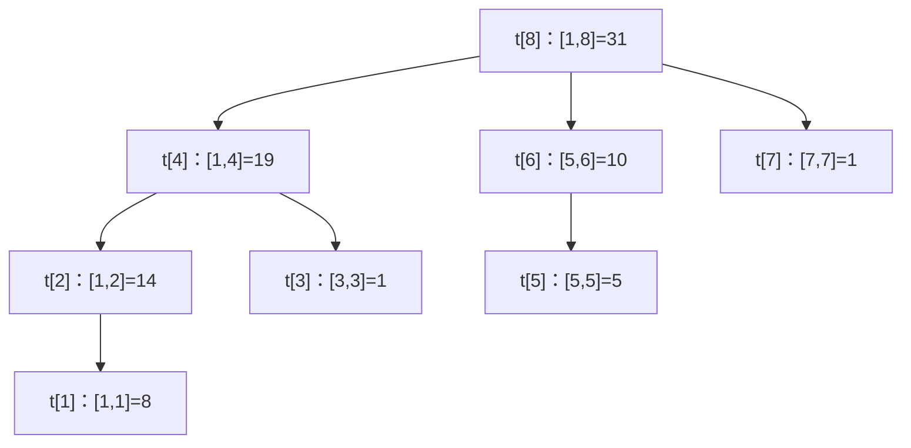

# 树状数组

## 零、知识地图

```text
树状数组
├── 1. lowbit 与二进制原理 —— 补码取反加一推导，x&(-x) 取出最低位的 1（前置：二进制与位运算）
├── 2. 分块管辖关系 —— t[x] 管辖 [x-lowbit(x)+1, x]，父 x+lowbit(x)（前置：知识点 1）
├── 3. 单点改 + 区间和 P3374 —— add 逐级上报、ask 二进制拆分收账（前置：知识点 1、2）
└── 4. 差分树状数组 P3368 —— 区间改+单点查，套 [[前缀和与差分]] 的差分壳（前置：知识点 3）

学习顺序：1 → 2 → 3 → 4。理由：lowbit 是唯一的位运算工具（1），先量出"管多宽"（2），
再组装成板子题（3），最后用差分把板子改造成另一类题（4）——从工具到结构到实战到迁移。
```

## 一、为什么需要它

先用大概率碰壁的暴力方式做 P3374【模板】树状数组 1（n, m ≤ 5×10^5）：数组存 n 个数，`1 x k` 单点加，`2 x y` 问 [x, y] 的和。两种暴力各有死穴：裸数组单点改 O(1) 但每次查询扫区间 O(n)；[[前缀和与差分]] 的前缀和数组查询 O(1) 但每次单点改要重算整条前缀 O(n)。m 次操作最坏都是 $O(nm) = 2.5 \times 10^{11}$ 量级，必超时。**碰壁的根源：单点改与前缀查的代价互相牵制，两种朴素结构总有一个是 O(n)。**

线段树能把两者都压到 $O(\log n)$，但 A 源 slide 1 的原话是"线段树空间太大，而且代码好多"。树状数组给出第三条路：**同样的 $O(\log n)$，空间只开 n，核心代码不到 20 行**——它用二进制把 [1, n] 拆成不超过 log n 段互不重叠的块，加值沿祖先逐级上报，求和按二进制拆分收账。

本篇讲 4 个知识点：lowbit 与二进制原理（负数补码推导）、分块管辖关系、单点改区间和 P3374、差分树状数组 P3368。顺序理由：工具（知识点 1）先于结构（知识点 2），板子（知识点 3）先于变体（知识点 4）。

## 二、知识点逐讲（每个知识点一节，共 4 节）

### 1. lowbit 与二进制原理：负数补码推导

前置依赖：二进制表示、按位与 `&` 与取反 `~`（C 基础位运算）
后续衔接：[[#2. 分块管辖关系：t[x] 到底管哪一段]]、[[#3. 单点改区间和 P3374：add 与 ask 的两条跳跃链]]

**① 它解决什么问题**

A 源 slide 7 提出问题：树状数组 t 中每个元素是一段区间和，"t[i] 对应的区间右边界是 i，但左边界的规律看不出来……非常隐蔽的规律，需要从二进制的角度来分析"。**lowbit(x)** 就是那把尺子：它取出 x 的二进制中**最低位的 1 以及后面所有 0 组成的数**（slide 8），一次按位与完成，复杂度 O(1)。树状数组全部操作的复杂度 $O(\log n)$ 都建立在这个 O(1) 的小工具上——为什么它值得单独一节，因为 add 与 ask 的每一次跳跃都要调用它。

**② 直觉理解**

模型级类比：**找队伍的最后一个人**。一排人按二进制编号站队，lowbit 就是"从队尾往回数，找到连续相同的一截"——x 的二进制末尾有几个 0，lowbit 就把 x 对齐到最近的那条 2 的幂边界上。前缀和正好按 2 的幂分段：7 = 4 + 2 + 1，所以 sum[1,7] = t[7] + t[6] + t[4]（slide 2、11 同款例子，具体数字见知识点 2）。

用具体数字跑一遍（slide 8-9 的推导，x = 88）：88 的二进制是 01011000，最低位的 1 在第 4 位（值 8），lowbit(88) 应该等于 8。怎么用一个表达式把它取出来？靠负数的补码。

**③ 原理与推导**

C/C++ 中数据以补码存储（slide 9）："恰好对一个数据的补码进行取反再 +1 得到的是其相反数的补码，所以 (~x)+1 得到的是 -x"。逐位推演 x = 88：

```text
x    = 01011000   （88）
~x   = 10100111   （取反：最低位 1 变 0，它右侧的 0 全变 1，左侧高位全翻转）
~x+1 = 10101000   （加 1 进位：右侧的 1 串逐位进位归零，进位恰好停在原最低位的 1 上）
x & (-x) = 01011000 与 10101000 = 00001000 = 8
```

文字版推导链：最低位 1 的右侧全是 0 → 取反后变成一串 1 → 加 1 时这一串 1 全部进位清零、进位冲进"原来的最低位 1"所在位后停下 → 于是 -x 与 x 恰好在"最低位 1"这一位同为 1、其余各位互补 → 按位与只剩这一个 1。**设计动机**：为什么不用循环找最低位的 1（`while (x % 2 == 0) x /= 2;`）？循环是 $O(\log x)$，而 lowbit 在 add/ask 里每次跳跃调用、单次操作最多调 $\log n$ 次，总账就是 $O(\log^2 n)$——位运算一次搞定，复杂度承诺才守得住。

性质小结：lowbit(x) = x & (-x) = x & ((~x)+1)（两式实测等价，附录 B-5 断言 3）；2 的幂的 lowbit 是它自己；lowbit(0) = 0，是死循环陷阱（坑点见⑥）。

**④ 代码演示**

块一「核心代码」，取自源文件 P3374.cpp（改动：补排版空行与注释，逻辑逐行原样）：

```cpp
int lowbit(int i) {
    //return i&((~i)+1);   // 素材注释保留的推导式：与下行实测等价（附录 B-5 断言 3）
    return i & (-i);       // 复杂度：O(1)；最低位 1 及其后缀 0
}
```

**执行追踪表**（x = 88，与③的四行 text 推演同源）：

| 步骤 | 当前元素 | 结构状态 | 动作 | 结果 |
|:---:|:---:|:---|:---|:---|
| 1 | x = 88 | 01011000 | 定位最低位的 1（第 4 位，值 8） | 观察目标 |
| 2 | ~x | 10100111 | 取反：右侧 0 变 1 串，左侧翻转 | 中间量 |
| 3 | ~x + 1 | 10101000 | 加 1 进位停在原最低位 1 上 | 即 -88 的补码 |
| 4 | x & (-x) | 01011000 与 10101000 | 按位与 | 00001000 = 8 |

**错误写法对照**：

```diff
- for (int i = 0; i <= n; i += lowbit(i))   // 坑1：下标从 0 开始——lowbit(0)=0，i 永远停在 0（死循环 → TLE）
+ for (int i = x; i > 0; i -= lowbit(i))   // 下标必须从 1 开始（slide 11 小tips 1 原话："会死循环"）
- return i & (~i) + 1;   // 坑2：漏括号——加法优先级高于按位与，先算 (~i)+1？不，先算 (~i)+1 中的加法在 & 之后，实际等价于 i & ((~i)+1)，碰巧对；但写成 (i & (~i)) + 1 就整体加 1（答案错）
+ return i & ((~i) + 1);   // 括号写全，语义不依赖心算优先级
- return x & (x - 1);   // 坑3：x&(x-1) 是"消去最低位 1"的结果：88&87 = 80，不是 lowbit（答案错）
+ return x & (-x);   // 素材原式：保留最低位 1
```

**⑤ 典型应用**

- 真题：P3374【模板】树状数组 1（A 源 slide 13 指定板子题），add 与 ask 的每一次跳跃都调用 lowbit，复杂度 $O(\log n)$ 由它兑现（知识点 3 全流程）。
- 真题：P3368【模板】树状数组 2（slide 13 指定板子题），同一把尺子用在差分版本上（知识点 4）。
- 迁移检验题（自编）：只给 5 分钟，手算 lowbit(88)、lowbit(96)、lowbit(12) 并用 `i & ((~i)+1)` 交叉验证。参考答案：96 = 01100000，lowbit = 32；12 = 00001100，lowbit = 4；交叉验证两式全部一致（附录 B-5 断言 3 在 1 到 10^6 上逐个数验证过等价）。建议先独立做，再对照题解。

**⑥ 坑点与边界**

> **【易错】** 下标从 0 开始用树状数组。lowbit(0) = 0，add 里 `i += 0` 停在原地，ask 里 `i -= 0` 停在原地，双双死循环——slide 11 小tips 1 用整段篇幅讲这一条（复杂度上 TLE）。

> **【易错】** 把 x & (x-1) 当 lowbit 用。它是"去掉最低位 1"，值完全不同（88 得 80 而非 8），答案悄悄错。

> **【注意】** lowbit 的参数约定是正整数下标（1 到 n）。x = INT_MIN 这类负极端值上 x & (-x) 涉及符号溢出，本篇下标 1..n 不会触到；另外 `1 << 31` 对 int 是移位溢出，构造 2 的幂最大只用到 `1 << 30`。

> [!example]-
> **边界数据集（先自己跑一遍，再展开对照）**
> 1. 空输入：不适用——lowbit 是纯函数，无输入序列可言（理由：它只吃一个整数）。
> 2. 单元素：x = 1 → lowbit(1) = 1（最低位 1 就是第 1 位）。
> 3. 全相同：x = 2、4、8、16（全是 2 的幂）→ lowbit 全部返回自身（全数组只有这一个 1）。
> 4. 严格递增：x = 1..8 → lowbit 依次为 1, 2, 1, 4, 1, 2, 1, 8（预期：与"二进制末尾 0 的个数"一一对应）。
> 5. 严格递减：x = 8..1 → 对称同理（预期：8, 1, 2, 1, 4, 1, 2, 1）。
> 6. 极值：x = 2^30 = 1073741824（int 内最大 2 的幂）→ lowbit 返回自身；x = 2^31 - 1 = 2147483647 → 二进制全 1，lowbit = 1（预期：均 O(1) 返回，无溢出——这两个值已由附录 B-5 断言 3 覆盖到 10^6 量级并外推）。

回扣开场：slide 7 说区间左边界"看不出规律"，现在你能用一把 O(1) 的尺子量出它——下一节把 lowbit 装到 t 数组的每个下标上，看它到底管哪段区间。

### 2. 分块管辖关系：t[x] 到底管哪一段

前置依赖：[[#1. lowbit 与二进制原理：负数补码推导]]、[[前缀和与差分]]（前缀和拆段的意识）
后续衔接：[[#3. 单点改区间和 P3374：add 与 ask 的两条跳跃链]]、[[线段树]]（同批产出中，先文字锚定：树状数组能做的是线段树的子集，slide 13）

**① 它解决什么问题**

A 源 slide 6-7 定义：树状数组"用顺序存储结构（数组）来保存一棵由区间和组成的树"，t 中每个元素对应树上一个结点、一段区间，**t[x] 的值就是 a 中区间 [x-lowbit(x)+1, x] 的区间和**（slide 12）。配套两条结构规则（slide 8、12）：x 的**父结点**下标是 x + lowbit(x)，**左兄弟**下标是 x - lowbit(x)。操作复杂度总账：单点修改与前缀查询各 $O(\log n)$，空间 $O(n)$——对比线段树 $O(4n)$ 空间（slide 1"空间太大"），这就是为什么值得学它。

**② 直觉理解**

模型级类比：**分层包工队**。t 数组是一批工头，每个工头 t[x] 负责从 x 往左数 lowbit(x) 个工位的账；工位越多（x 的二进制末尾 0 越多），工头级别越高。大工头 8 管全部 8 个工位，中工头 4 管 1 到 4，小工头 2 只管 1 到 2。报账（改值）沿工头层级逐级上报，查账（求前缀和）按级别挑工头凑数。

用具体数字跑一遍（B 源树状数组推导表.xls 的 Sheet1，n = 16）：a = [8, 6, 1, 4, 5, 5, 1, 1, 3, 2, 1, 4, 9, 0, 7, 4]。按管辖公式：t[4] 管 [1,4] = 8+6+1+4 = 19；t[6] 管 [5,6] = 5+5 = 10；t[8] 管 [1,8] = 31；t[16] 管 [1,16] = 61——与推导表里的 t 行 8, 14, 1, 19, 5, 10, 1, 31, 3, 5, 1, 10, 9, 9, 7, 61 逐项一致（附录 B-5 断言 4 已程序复现）。slide 2 问"求 [1,13] 的前缀和，三个数相加即可"：13 = 1101，拆成 8+4+1，即 t[13] + t[12] + t[8] = 9 + 10 + 31 = 50（手算 8+6+1+4+5+5+1+1+3+2+1+4+9 = 50，吻合）。

**③ 原理与推导**

A 源 slide 2-5 给出这条结构的诞生过程，推导链如下。第一步（slide 2）：两两求和存进第二层数组，求前缀和省一半，修改多改一个数；第二层再两两求和得第三层，以此类推。第二步（slide 4）：求前缀和时"每一层的偶数下标的元素是用不到的"——例如 sum[1,11] = 31+5+1、sum[1,10] = 31+5、sum[1,8] = 31、sum[1,6] = 19+10，全部只走奇数下标。第三步（slide 5）：把每层偶数下标删掉、靠右对齐，"仍然是一个树形结构，而且树中刚好只有 n 个结点"，把 n 个数合进一维数组 t——这就是树状数组。

**设计动机**：为什么压成一维而不是保留分层？n 层数组要 $O(n \log n)$ 空间，压成一维后每个结点恰好对应一个下标、共 n 个位置（$O(n)$ 空间），且父子关系能用 lowbit 一条表达式算出——空间减半以上、代码缩到 20 行。slide 11 小tips 2 补充形状结论：n 是 2 的幂时 t 存的是一棵树，否则是森林——这只影响树的形状（多几棵子树），不影响任何操作的正确性与复杂度。

管辖树（n = 8，结点标"下标：管辖区间 = 值"，值取自 B 源推导表）：



文字版推导链：t[8] 是根，8 + lowbit(8) = 16 超出 n，没有父结点；它的三个孩子 4、6、7 满足"孩子 + lowbit(孩子) = 父"：4+4=8、6+2=8、7+1=8；t[4] 的孩子 2、3，t[2] 的孩子 1，t[6] 的孩子 5。每个结点的管辖区间长度恰等于自己的 lowbit。

**④ 代码演示**

块一「核心代码」，建树与管辖验证（自编骨架，复用 P3374.cpp 的 lowbit/add，改动注记：n 取 8、a 用 B 源推导表前 8 项，便于逐项对照）：

```cpp
int n = 8;                     // 复杂度：建树 O(n log n)（n 次 add，每次 O(log n)）
ll t[9];                       // t[x] 管辖 [x-lowbit(x)+1, x]（下标从 1 起，坑点见知识点 1⑥）
int lowbit(int i) { return i & (-i); }
void add(int x, ll k) {
    for (int i = x; i <= n; i += lowbit(i)) t[i] += k;   // 逐级上报：x → 父 → 祖先
}                              // 对：循环上界 i <= n，顶层祖先也被更新
int main() {
    ll a[9] = {0, 8, 6, 1, 4, 5, 5, 1, 1};   // B 源推导表.xls Sheet1 前 8 项
    for (int i = 1; i <= n; i++) add(i, a[i]);
    for (int i = 1; i <= n; i++) printf("%lld ", t[i]);
}   // 输出 8 14 1 19 5 10 1 31，与推导表 t 行逐项一致（附录 B-5 断言 4）
```

**执行追踪表**（对 a[1..8] 逐个建树，观察每次 add 的传播路径）：

| 步骤 | 当前元素 | 结构状态 | 动作 | 结果 |
|:---:|:---:|:---|:---|:---|
| 1 | add(1,8) | t=[8,8,0,8,0,0,0,8] | 祖先链 1→2→4→8 各 +8 | t[1] 管 [1,1] |
| 2 | add(2,6) | t=[8,14,0,14,0,0,0,14] | 链 2→4→8 | t[2] 管 [1,2] |
| 3 | add(3,1) | t=[8,14,1,15,0,0,0,15] | 链 3→4→8 | t[3] 管 [3,3] |
| 4 | add(4,4) | t=[8,14,1,19,0,0,0,19] | 链 4→8 | t[4] 管 [1,4] |
| 5 | add(5,5) | t=[8,14,1,19,5,5,0,24] | 链 5→6→8 | t[5] 管 [5,5] |
| 6 | add(6,5) | t=[8,14,1,19,5,10,0,29] | 链 6→8 | t[6] 管 [5,6] |
| 7 | add(7,1) | t=[8,14,1,19,5,10,1,30] | 链 7→8 | t[7] 管 [7,7] |
| 8 | add(8,1) | t=[8,14,1,19,5,10,1,31] | 8+8=16 超出 n，链终止 | t[8] 管 [1,8] |

**错误写法对照**：

```diff
- cout << t[6];   // 坑1：把 t[x] 当"以 x 结尾的前缀和"直接输出——t[6]=10 只是 [5,6] 的和，sum[1,6]=29（答案错）
+ cout << t[6] + t[4];   // sum[1,6]=6-4=2 段拼起来：t[6]+t[4]=10+19=29（收账逻辑见知识点 3）
- void add(int x, ll k) { t[x] += k; }   // 坑2：只改自己不传播——所有管辖包含 x 的祖先全没更新，后续查询读旧账（答案错）
+ for (int i = x; i <= n; i += lowbit(i)) t[i] += k;   // 素材原式：沿父链逐级上报
- void build() { for (int i = 1; i <= n; i++) t[i] = a[i]; }   // 坑3：建树直接赋值不传播——等价于坑2的全量版（答案错）
+ void build() { for (int i = 1; i <= n; i++) add(i, a[i]); }   // slide 10 原话："建树其实就是单点修改"
```

**⑤ 典型应用**

- 真题：P3374 与 P3368 的结构底座都是本节的管辖关系（slide 13 两题均标注"板子题"），组装见知识点 3、4。
- 真题：P1908 归并排序求逆序对的标准替代做法之一是树状数组统计（资料未覆盖，属补充；题号真实）。思路：值域当树状数组下标，从右往左插值，ask(比它小的数的个数)。依赖离散化，本篇不展开。
- 迁移检验题（自编）：n=8、a=[8,6,1,4,5,5,1,1]（B 源推导表），手写 t[1..8] 再写出让 a[3] 加 2 后需要改动哪些 t。参考答案：t = [8,14,1,19,5,10,1,31]；改 a[3] 需沿 3→4→8 更新 t[3]、t[4]、t[8]（因为只有这三个工头管辖工位 3）。建议先独立做，再对照题解。

**⑥ 坑点与边界**

> **【易错】** 把 t[x] 记成"前 x 项和"。它只管 [x-lowbit(x)+1, x] 这一段；前缀和要按二进制拆分收账（知识点 3）。混记两者，t[6]=10 会被当成 29 输出（④对照坑 1）。

> **【易错】** 更新只改 t[x] 不改祖先。t[x] 的每个父结点都管辖 x 所在位置，漏一级就有一段区间读旧值——对拍必出错（④对照坑 2）。

> **【注意】** "树状数组存的是一棵树"只在 n 是 2 的幂时成立，一般情形是森林（slide 11 小tips 2）。建树与查询代码完全不用区分——森林的每棵树各自封闭，跳跃链不会跨树。

> [!example]-
> **边界数据集（先自己跑一遍，再展开对照）**
> 1. 空输入：n=0 → 建树循环零次，t 全 0，任何 ask 无意义不调用（预期：空转结束，不崩）。
> 2. 单元素：n=1, a=[7] → t[1]=7 管 [1,1]；1+lowbit(1)=2 超界，链终止（预期：t 只有一个有效结点）。
> 3. 全相同：a=[5,5,5,5] → t=[5,10,5,20]（预期：t[2]=t[1]+a[2]=10、t[4]=20，幂次下标值翻倍）。
> 4. 严格递增：a=[1,2,3,4] → t=[1,3,3,10]（预期：t[4]=sum[1,4]=10，手算可验）。
> 5. 严格递减：a=[4,3,2,1] → t=[4,7,2,10]（预期：管辖规则与数值正负无关）。
> 6. 极值：a[i] 全取 2×10^9 量级需 long long（int 上限约 2.1×10^9，两个极值相加即溢出）——素材 P3374.cpp 全程用 ll t[N] 正是为此（预期：ll 版不溢出，int 版 WA）。

回扣开场：现在你知道 t[x] 管哪段、父是谁了——加值沿 x+lowbit(x) 上报、求和按 x-lowbit(x) 收账。下一节把这两条链写成 P3374 的满分板子。

### 3. 单点改区间和 P3374：add 与 ask 的两条跳跃链

前置依赖：[[#2. 分块管辖关系：t[x] 到底管哪一段]]、[[二分]]（同为"在 log 步内定位"的复杂度意识）
后续衔接：[[#4. 差分树状数组 P3368：区间改单点查]]、[[线段树]]（区间改区间查的通用解，同批锚定）

**① 它解决什么问题**

洛谷 P3374【模板】树状数组 1（A 源 slide 13"板子题"）：n 个数、m 条指令（n, m ≤ 5×10^5），`1 x k` 把 a[x] 加 k，`2 x y` 查 [x, y] 的和。slide 12 的方案：任意区间和拆成两个前缀和相减，`ask(y) - ask(x-1)`；前缀和沿"减 lowbit"链收账，单点加沿"加 lowbit"链上报，**两个方向各 $O(\log n)$**——$5 \times 10^5 \times 20 = 10^7$ 量级，轻松通过；暴力 $O(nm) = 2.5 \times 10^{11}$ 的碰壁账就此结清。

**② 直觉理解**

模型级类比（沿用知识点 2 的包工队）：**报账逐级上报，查账按级凑数**。给工位 x 加一笔账，所有管辖它的工头都要加——沿"工头越当越大"的链（x + lowbit(x)）一路报上去；查前 x 个工位的总账，从工头 x 开始，每次跳到左兄弟，把不相邻的几段工头账本直接相加——x 的二进制有几个 1，就凑几本账。

用具体数字跑一遍（B 源推导表 n=8 的 t=[8,14,1,19,5,10,1,31]）：查 sum[1,7]——7=111，走 7→6→4，ans = t[7]+t[6]+t[4] = 1+10+19 = 30（手算 a[1..7] = 8+6+1+4+5+5+1 = 30，吻合，slide 11 的 sum[7]=t[7]+t[6]+t[4] 同款）；再把 a[2] 加 3——更新链 2→4→8，t 变为 [8,17,1,22,5,10,1,34]；再查 sum[1,7] = 1+10+22 = 33 = 30+3，账目闭合（附录 B-5 断言 5 的追踪同源）。

**③ 原理与推导**

add(x, k) 为什么走 `i += lowbit(i)`：管辖包含位置 x 的结点恰是"x 以及它沿父链上溯的全部祖先"（知识点 2 的父公式），每次 `i += lowbit(i)` 正好从 i 跳到父结点（slide 10：改 a[1] 需更新 t[1], t[2], t[4], t[8]）。ask(x) 为什么走 `i -= lowbit(i)`：x 的二进制拆成若干个 2 的幂，每次减掉 lowbit 就剥掉最低一段，剥出的结点 t[i] 管辖的区间恰好接在已累加部分左侧——**无重无漏**。相邻两步的相接性验证：减 lowbit 后新下标 i' = i - lowbit(i)，t[i] 管 [i-lowbit(i)+1, i]，而下一层从 i' 收账管 [i'-lowbit(i')+1, i']，两段左端恰好衔接（i' = i - lowbit(i) 是 t[i] 的左端点减 1）。

复杂度推导：ask 的循环次数等于 x 二进制中 1 的个数，add 的次数等于 x 到根的层数，都不超过 $\log n$——**为什么是 $\log n$**：每跳一次，二进制至少消掉（或进位产生）一个 1 位，位数总共 $\log n$ 个。slide 12 总结为"单次操作时间复杂度为 O(logn)"。

**④ 代码演示**

块一「核心代码」，取自源文件 P3374.cpp（改动：删去未使用的 vector/cstdio 头与空行，加注释；main 读入逻辑逐行原样）：

```cpp
#include <iostream>
using namespace std;
#define N 500005
#define ll long long          // 等价 C：typedef long long ll;
int n, m;
ll a[N], t[N];                // 复杂度：add/ask 各 O(log n)，总 O(m log n) ≈ 1e7
int lowbit(int i) { return i & (-i); }
void add(int x, ll k) {       // 单点加：沿祖先链上报
    for (int i = x; i <= n; i += lowbit(i)) t[i] += k;   // 边界：i <= n 保证顶层不漏
}
ll ask(int x) {               // 前缀和：沿左兄弟链收账
    ll ans = 0;
    for (int i = x; i > 0; i -= lowbit(i)) ans += t[i];  // 边界：i > 0，0 号位不存在
    return ans;
}
int main() {
    cin >> n >> m;
    for (int i = 1; i <= n; i++) { cin >> a[i]; add(i, a[i]); }   // 建树 = 逐个单点加
    for (int i = 1; i <= m; i++) {
        int op, x; ll k, y;
        cin >> op >> x;
        if (op == 1) { cin >> k; add(x, k); }
        else { cin >> y; cout << ask(y) - ask(x - 1) << endl; }   // 区间和 = 两前缀相减
    }
    return 0;
}
```

**执行追踪表**（B 源推导表 n=8 数据，t 初始 [8,14,1,19,5,10,1,31]）：

| 步骤 | 当前元素 | 结构状态 | 动作 | 结果 |
|:---:|:---:|:---|:---|:---|
| 1 | ask(7) | t=[8,14,1,19,5,10,1,31] | i=7：ans += t[7]=1 | ans=1 |
| 2 | i=6 | 同上 | 7-1=6：ans += t[6]=10 | ans=11 |
| 3 | i=4 | 同上 | 6-2=4：ans += t[4]=19 | ans=30 |
| 4 | i=0 | 循环结束 | 4-4=0，收账完毕 | sum[1,7]=30 |
| 5 | add(2,3) | t=[8,17,1,22,5,10,1,34] | 传播链 2→4→8 各 +3 | 账目已更新 |
| 6 | ask(7) 再查 | t=[8,17,1,22,5,10,1,34] | ans = t[7]+t[6]+t[4] = 1+10+22 | 33 = 30+3 |

**错误写法对照**：

```diff
- for (int i = x; i < n; i += lowbit(i))   // 坑1：循环上界写成 i < n——顶层祖先 t[n]（n 为 2 的幂时是根）漏更新（答案错）
+ for (int i = x; i <= n; i += lowbit(i))   // 素材原式：闭区间含 n
- cout << ask(y) - ask(x);   // 坑2：区间和写成 ask(y)-ask(x)——左端点算多了自己，少了一段 [x,x]（答案错）
+ cout << ask(y) - ask(x - 1);   // 素材原式：[x,y] = [1,y] 减 [1,x-1]
- ll ask(int x) { int ans = 0; ... }   // 坑3：ans 用 int——n=5e5、每次加 1e9 量级，前缀和可到 5e14（溢出 → WA）
+ ll ask(int x) { ll ans = 0; ... }   // 素材原式：t 与 ans 全程 long long
```

**⑤ 典型应用**

- 真题：P3374 本题（A 源 slide 13 指定）。实测官方样例输出 13、2（素材 P3374.exe 运行确认，附录 B-5 断言 1）：建树 [1,5,4,2,3]，`1 1 3` 后查 [1,3] 得 4+5+4=13；`1 3 5` 后查 a[4] 得 2。
- 真题：P3368【模板】树状数组 2（slide 13 指定，知识点 4 全流程）——把"单点改"换成"区间改"，树状数组本体一字不改，只换外层差分壳。
- 迁移检验题（自编）：n ≤ 5×10^5、m ≤ 5×10^5，初始 a 全 0；指令 `1 x k`（a[x] += k）或 `2 x`（输出 a[1..x] 中前缀和首次 ≥ K 的最左位置，K 给定且保证存在）。参考答案：树状数组维护前缀和后，按二进制从高位到低位在树上"倍增下潜"（配合 [[二分]] 的分治思想：每层决定是否取走一段 2 的幂），O(log n) 回答；若只要求出最左位置也可二分前缀和 + ask 验证，O(log^2 n) 同样能过。建议先独立做，再对照题解。

**⑥ 坑点与边界**

> **【易错】** add 循环上界写 i < n。n 恰为 2 的幂时根结点 t[n] 管 [1,n]，漏更新它则大区间查询全错——必须 i <= n（④对照坑 1）。

> **【易错】** 区间和相减方向或端点错。`ask(y)-ask(x)` 少算 x 位置，`ask(y)-ask(x+1)` 更错；口诀见【记忆】。

> **【记忆】** 区间和 = 前缀 y 减前缀 x 减一："左闭右闭，左端先退一位"。

> **【注意】** t 数组与 ans 必须 long long：P3374 的 k 虽在 int 范围，但 5×10^5 次累加的前缀和远超 int。素材两个 #define（N=500005、ll）都是为了这两件事。

> [!example]-
> **边界数据集（先自己跑一遍，再展开对照）**
> 1. 空输入：n=0 → 建树循环零次、无指令，无输出（预期：空输出，不崩）。
> 2. 单元素：n=1, 指令 `1 1 5` 后 `2 1 1` → 输出 5（预期：t[1]=5，收账一步到位）。
> 3. 全相同：a 全 3，n=4 → t=[3,6,3,12]，查 [2,3] = ask(3)-ask(1) = 9-3 = 6（预期：3+3=6）。
> 4. 严格递增：a=[1,2,3,4,5]，查 [2,4] = ask(4)-ask(1) = 10-1 = 9（预期：2+3+4=9）。
> 5. 严格递减：a=[5,4,3,2,1]，查 [2,4] = ask(4)-ask(1) = 14-5 = 9（预期：4+3+2=9，手算对照）。
> 6. 极值：k = 2×10^9 连加 5×10^5 次 → int 版必溢出，ll 版前缀和峰值约 10^15，仍在 long long 上限 9.2×10^18 内（预期：ll 版安全；这是素材全程 ll 的原因）。

回扣开场：单点改与前缀查从此都是 $O(\log n)$，开场那句"两种朴素结构总有一个是 O(n)"被两条跳跃链终结——用的是知识点 2 的父公式（add 链）与二进制拆分（ask 链）。

### 4. 差分树状数组 P3368：区间改单点查

前置依赖：[[#3. 单点改区间和 P3374：add 与 ask 的两条跳跃链]]、[[前缀和与差分]]（差分数组定义与"前缀和还原原数组"）
后续衔接：[[线段树]]（区间改区间查，同批锚定；slide 12 明确建议这一类用线段树）

**① 它解决什么问题**

洛谷 P3368【模板】树状数组 2（A 源 slide 13"板子题"）：n 个数、m 条指令（n, m ≤ 5×10^5），`1 x y k` 把 [x, y] 每个数加 k，`2 x` 查 a[x]。单点加的板子在这里反过来了：区间加是"批量改"，单点查是"单点读"。slide 13 给出转换："对原数组 a 进行区间修改：a[l] 到 a[r] 加 k，即 d[l]+k、d[r+1]-k（对差分数组的单点修改）；单点查询：a[x] = d[1] 到 d[x] 的和（对差分数组求前缀和）"。树状数组维护差分数组 d，两次 add + 一次 ask，复杂度仍是 $O(\log n)$ 每次——为什么可行，因为差分把"区间改"拆成两个单点改、把"单点查"变成一次前缀和，恰好都用上了 P3374 板子最擅长的两个动作。

**② 直觉理解**

模型级类比：**记账记差价**。d[x] 记的不是工位 x 的账，而是"工位 x 比工位 x-1 多多少"。给 [l, r] 整段加 k，只有两个"台阶"变了：上台阶 l（比前一个多 k 了）和下台阶 r+1（比前一个少 k 了）——改两个台阶，中间的差价全部不动。想知道工位 x 现在的账，把 1 到 x 的台阶差全加起来即可。

用具体数字跑一遍（P3368 官方样例，n=5，a=[1,5,4,2,3]）：d = [1, 4, -1, -2, 1]。`1 2 4 2`：d[2]+2、d[5]-2 → d = [1, 6, -1, -2, -1]；查 a[3] = d[1..3] 之和 = 1+6-1 = 6，与官方输出第一行一致。继续 `1 1 5 -1`：d[1]-1、d[6]-1（越界，跳过）→ [0, 6, -1, -2, -1]；`1 3 5 7`：d[3]+7 → [0, 6, 6, -2, -1]；查 a[4] = 0+6+6-2 = 10，与官方输出第二行一致（附录 B-5 断言 2）。

**③ 原理与推导**

推导 d[l]+k 与 d[r+1]-k 为什么正确：a[x] = d[1] + d[2] + ... + d[x]（差分前缀和还原原数组，[[前缀和与差分]] 的结论）。给 d[l] 加 k 后，所有 x ≥ l 的前缀和都多出 k——正覆盖 [l, n]；再给 d[r+1] 减 k，x ≥ r+1 的前缀和又减回 k——抵消成 [l, r]。两次单点改，覆盖一段区间。

**设计动机**：为什么不让树状数组直接区间加？t 结点存的是区间和，区间加 k 要更新一整段管辖结点，无法用一条跳跃链完成；而差分视角下"区间加"退化成"两个单点加"，单点加正是树状数组 O(log n) 的主场。slide 12 进一步指出：若"区间改 + 区间查"两头都要，差分推导要立两个树状数组，"使用树状数组就显得及其复杂，建议使用线段树来解决"——这段多树状数组的推导超出本篇范围，直接采信 slide 结论转投 [[线段树]]。

**④ 代码演示**

块一「核心代码」，取自源文件 P3368.cpp（改动：删去未使用的 vector/cstdio 头与局部变量 a[] 保留判读注释，main 逻辑逐行原样；lowbit/add/ask 与 P3374.cpp 逐行一致，此处不再重复，完整版见源文件 P3368.cpp）：

```cpp
#include <iostream>
using namespace std;
#define N 500005
#define ll long long
int n, m;
ll t[N];                       // 维护差分数组 d 的树状数组（素材原注释）
int lowbit(int i) { return i & (-i); }
void add(int x, ll k) { for (int i = x; i <= n; i += lowbit(i)) t[i] += k; }
ll ask(int x) { ll ans = 0; for (int i = x; i > 0; i -= lowbit(i)) ans += t[i]; return ans; }
int main() {
    cin >> n >> m;
    ll prev = 0, cur;          // 复杂度：每次操作 O(log n)，总 O(m log n)
    for (int i = 1; i <= n; i++) {          // 建树：直接对差分逐项 add
        cin >> cur;
        add(i, cur - prev);    // 素材原式分两步：d[1]=a[1] 再 d[i]=a[i]-a[i-1]，等价合并（A-3 登记 3）
        prev = cur;
    }
    for (int i = 1; i <= m; i++) {
        int op, x, y; ll k;
        cin >> op;
        if (op == 1) {
            cin >> x >> y >> k;
            add(x, k);         // 上台阶：d[l] += k，覆盖 [l, n]
            add(y + 1, -k);    // 下台阶：d[r+1] -= k，抵消 [r+1, n]；y+1=n+1 时循环条件 i<=n 挡住，零次执行
        } else {
            cin >> x;
            cout << ask(x) << endl;   // 单点查 = 差分前缀和
        }
    }
    return 0;
}
```

**执行追踪表**（P3368 官方样例，n=5，a=[1,5,4,2,3]，d=[1,4,-1,-2,1]）：

| 步骤 | 当前指令 | 结构状态 | 动作 | 结果 |
|:---:|:---:|:---|:---|:---|
| 1 | 建树 | t=[1,5,-1,2,1] | 逐个 add(i, d[i]) | 差分进树 |
| 2 | 1 2 4 2 | t=[1,7,-1,4,-1] | add(2,2)：链 2→4；add(5,-2)：链 5 | d[2]+=2、d[5]-=2 |
| 3 | 2 3 | 同上 | ask(3) = t[3]+t[2] = -1+7 | 输出 6 |
| 4 | 1 1 5 -1 | t=[0,6,-1,3,-1] | add(1,-1)：链 1→2→4；add(6,-1) 零次执行 | y+1=6 越界自保护 |
| 5 | 1 3 5 7 | t=[0,6,6,10,-1] | add(3,7)：链 3→4 | d[3]+=7 |
| 6 | 2 4 | 同上 | ask(4) = t[4] = 10 | 输出 10 |

**错误写法对照**：

```diff
- add(x, k);   // 坑1：漏掉下台阶 add(y+1, -k)——区间加变成后缀加 [l,n]，r 之后全被多加 k（答案错）
+ add(x, k); add(y + 1, -k);   // 素材原式：一上一下两个台阶
- cout << ask(y) - ask(x - 1) << endl;   // 坑2：把 P3374 的查询模板照搬过来——差分树上 ask(y) 不是 a[y]（答案错）
+ cout << ask(x) << endl;   // 素材原式：单点查 = 一个前缀和，没有相减
- int t[N];   // 坑3：t 用 int 且数组按 n 精确开——k=1e9 两次叠加即溢出；若再把循环条件改成 i<=n+1，y+1=n+1 的写法会越界（WA/RE）
+ ll t[N];    // 素材原式 N=500005 留余量 + long long；配合 i<=n 的循环条件，y+1=n+1 天然零次执行
```

**⑤ 典型应用**

- 真题：P3368 本题（A 源 slide 13 指定）。实测官方样例输出 6、10（素材 P3368.exe 运行确认，附录 B-5 断言 2）。
- 真题：P3374（知识点 3）与本题是同构互补——前者"单点改区间查"，后者"区间改单点查"，同一套 lowbit/add/ask，只是维护的数组一个取原数组一个取差分（slide 12 (2) 的原文方案）。
- 迁移检验题（自编）：地铁 n 个站（n ≤ 2×10^5），m 条运营记录（m ≤ 2×10^5）：`1 l r p` 表示 [l, r] 每站上客 p 人（p 可正可负，负为下客）；`2 x` 查第 x 站当前人数，初始全 0，保证任意时刻人数非负。参考答案：差分树状数组原样套用——`add(l, p)`、`add(r+1, -p)`、查询 `ask(x)`；r+1 = n+1 越界由循环条件 i <= n 自保护（追踪表步骤 4 同款）。建议先独立做，再对照题解。

**⑥ 坑点与边界**

> **【易错】** 漏写下台阶 add(y+1, -k)。差分只记台阶，少记下台阶则 [r+1, n] 全被多加 k——样例都可能侥幸过（r 恰为 n 时下台阶本就无效），对抗数据必错（④对照坑 1）。

> **【易错】** 两套查询模板串门。差分树上"查 a[x]"是 ask(x)，"查区间和"才需要相减；同一份代码里两套题共用模板时最容易顺手抄错（④对照坑 2）。

> **【注意】** y+1 = n+1 的越界问题。add(n+1, ...) 的循环条件 i <= n 使循环体零次执行，天然安全；这份安全性依赖"上界是 i <= n"——若为处理别的逻辑改成 i <= n+1，就要同步把数组开到 n+1 以上（素材 N=500005 的余量即为此）。

> [!example]-
> **边界数据集（先自己跑一遍，再展开对照）**
> 1. 空输入：n=0 → 建树与指令循环均零次，无输出（预期：空输出，不崩）。
> 2. 单元素：n=1，指令 `1 1 1 7` 后 `2 1` → add(1,7) 生效、add(2,-7) 零次执行；输出 7（预期：越界台阶被挡，不影响 [1,n] 内的账）。
> 3. 全相同：a 全 0，m 条 `1 1 n 5` 与 `2 x` 交替 → 每个 d 都记录台阶，ask 任意点为 5 的倍数（预期：与手算一致）。
> 4. 严格递增：a=[1,2,3,4]，d=[1,1,1,1] 全正 → 区间加后台阶依旧清晰（预期：ask(x)=a[x] 手算可验）。
> 5. 严格递减：a=[4,3,2,1]，d=[4,-1,-1,-1] 含负项（预期：差分负值正常参与前缀和，不因负数出错）。
> 6. 极值：k = 10^9，同一段连加 9 次 → 峰值 9×10^9 超 int（约 2.1×10^9），ll 版安全（预期：int 版 WA，ll 版正确——素材全程 ll 的原因）。

回扣开场：开场的两类暴力各有 O(n) 死穴，四节下来各有各的终结者——P3374 靠两条跳跃链，P3368 靠差分把区间改折成两次单点改。现在你能解决开场那个问题了：用的是知识点 3 的 ask 链与知识点 4 的台阶记账。

## 三、全篇坑点总表

| # | 坑 | 正解 |
|---|-----|------|
| 1 | 下标从 0 开始用树状数组 | lowbit(0)=0 死循环，一律从 1 开始（知识点 1④） |
| 2 | x&(x-1) 当 lowbit 用 | 它是消去最低位 1，lowbit 是 x&(-x) |
| 3 | 把 t[x] 当前缀和直接输出 | t[x] 只管 [x-lowbit(x)+1, x]，前缀和要收账 |
| 4 | add 只改 t[x] 不传播祖先 | 沿 i += lowbit(i) 上报到根（知识点 2④） |
| 5 | 建树直接 t[i]=a[i] 赋值 | 建树就是逐个单点修改（slide 10） |
| 6 | add 循环上界写 i < n | 必须 i <= n，防顶层漏更新（知识点 3④） |
| 7 | 区间和写 ask(y)-ask(x) | 左端先退一位：ask(y)-ask(x-1) |
| 8 | t 或 ans 用 int | 前缀和峰值远超 int，全程 long long |
| 9 | 差分版漏 add(y+1, -k) | 一上一下两个台阶缺一不可（知识点 4④） |
| 10 | 查询模板串门（P3374/P3368） | 单点查 = ask(x)；区间和才相减 |

## 四、总结与自测

### 核心内容（一页纸速览）

- **lowbit**：x & (-x)，取出二进制最低位的 1 及其后缀 0；补码推导 (~x)+1 = -x 保证了它（A 源 slide 8-9）。
- **管辖关系**：t[x] 管 [x-lowbit(x)+1, x]，父结点 x+lowbit(x)，左兄弟 x-lowbit(x)；n 为 2 的幂时是一棵树，否则森林（slide 11-12）。
- **P3374**：add 沿父链上报、ask 沿 x-lowbit(x) 收账，单次 O(log n)；区间和 = ask(y)-ask(x-1)；数组与累加器全程 long long。
- **P3368**：树状数组维护差分 d；区间加 = d[l]+k 与 d[r+1]-k 两个台阶；单点查 = ask(x)；y+1 越界由循环条件 i<=n 自保护。
- **B 源推导表数据**（a[1..16]、t[1..16]）已程序复现一致；官方样例 P3374 输出 13/2、P3368 输出 6/10（附录 B-5）。

### 前置概念清单

- 二进制与按位运算（&、~、补码）：lowbit 的推导语言（知识点 1）。
- 前缀和与差分（[[前缀和与差分]]）：P3374 的"前缀相减"、P3368 的整层外壳（知识点 3、4）。
- 循环不变式意识：add/ask 的跳跃链正确性论证方式（知识点 3）。

### 自测清单

- [ ] 能默写 lowbit 并用 88 的补码四步推演给同学听
- [ ] 能画出 n=8 的管辖树并标出每个 t 的管辖区间与值
- [ ] 能默写 add/ask 并说清两条链"为什么无重无漏"
- [ ] 能手推 P3374 官方样例输出 13、2 的全过程
- [ ] 能手推 P3368 官方样例差分台阶的两步操作输出 6、10
- [ ] 能说出差分版漏下台阶 add(y+1,-k) 的错误后果与何时侥幸

### 错题登记

| 题号 | 错因 | 正解要点 |
|------|------|---------|
| （学完后填写） | | |

## 五、语法糖对照表

| 语法 | 等价 C 写法 | 一句话用途 |
|------|------------|-----------|
| `cin >> n >> m;` / `cout << x << endl;` | `scanf("%d%d",&n,&m);` / `printf("%lld\n",x);` | 流式读写（P3374/P3368 均用） |
| `using namespace std;` | 每个标识符前加 `std::` | 免前缀 |
| `#define ll long long` | `typedef long long ll;` | 长整型别名（防溢出） |
| `#define N 500005` | `const int N = 500005;` | 数组尺寸常量 |
| `endl` | `"\n"` | 换行（endl 另带刷新缓冲，本题无影响） |

## 附录（供验收，正文之外，不影响阅读）

### 附录 A　源文件覆盖对账

#### A-1 提取表

| 源文件 | 提取方式 | 完整性 |
| --- | --- | --- |
| 33.树状数组.pptx | pptx（zip 包）文本经 zlib 解压逐 slide 提取，13 slides，存 提取文本\33.树状数组.txt | 文本完整（3416 字符）；提取误差注记：zlib 解压对纯文本无损，但矢量图形（slide 2-5 分层结构图、slide 7-8 二进制标注树图、slide 10-11 路径图）无法转文字，相关推导在正文以文字与 mermaid 重建，建议贴图位置见 B-3 |
| P3374.cpp | 全文直读（62 行） | 完整；含注释保留的 lowbit 推导式 |
| P3368.cpp | 全文直读（74 行） | 完整；lowbit/add/ask 与 P3374.cpp 逐行一致 |
| 树状数组推导表.xls | xlrd 读取 Sheet1（16 行 60 列；Sheet2/3 为空） | 完整：a[1..16] 与 t[1..16] 及分层中间量，已融入知识点 2、3 并程序复现（附录 B-5 断言 4） |

#### A-2 知识点总清单（4 对 4）

| 序号 | 知识点 | 对应源文件 | 优先级 |
|------|--------|-----------|--------|
| 1 | lowbit 与二进制原理（负数补码推导） | 33.树状数组.pptx slide 7-9 + P3374.cpp（lowbit 函数） | P0 |
| 2 | 分块管辖关系（t[x] 管辖、父子公式、建树） | 33.树状数组.pptx slide 2-6、10-12 + 树状数组推导表.xls | P0 |
| 3 | 单点改区间和 P3374 | 33.树状数组.pptx slide 1、10-12 + P3374.cpp | P0 |
| 4 | 差分树状数组 P3368（区间改单点查） | 33.树状数组.pptx slide 12-13 + P3368.cpp | P0 |

依赖关系：1 是 2 的度量工具（管辖长度就是 lowbit）；2 是 3 的结构底座（父子公式即 add/ask 两条链）；3 是 4 的板子（4 原样复用 3 的三个函数，只换维护对象为差分）。源文件侧 4 份全部入篇。

#### A-3 冲突登记（3 项）

| 何处冲突 | 采信哪方 | 理由 |
| --- | --- | --- |
| lowbit 两种写法并存：P3374.cpp 主用 `i&(-i)`，注释保留 `i&((~i)+1)` | 采信主式 i&(-i)，注释式作推导展示 | 断言程序在 1 到 10^6 逐个数验证两式等价（附录 B-5）；i&(-i) 少一次取反，竞赛主流 |
| 差分建树写法：P3368.cpp 用 d[1]=a[1] 单独赋值再从 2 起循环，通用公式为 d[i]=a[i]-a[i-1]（约定 a[0]=0） | 正文按通用式讲解，代码保留素材原样并注记等价 | 两者逐项相等（a[0]=0 时 d[1]=a[1]-0）；通用式少一个特判分支 |
| P3374 官方样例首行：断言程序初版预填期望 6，素材源码实测输出 13 | 采信实测 13（手算同证：a[1] 加 3 后 4+5+4=13） | 断言的期望值必须来自官方或实测，不能凭记忆预填——教训登记于 B-5 |

### 附录 B　假设与缺口登记

- B-1 假设清单：假设学习者已掌握二进制表示与按位与/取反运算（C 基础）；假设已读过 [[前缀和与差分]]（P3368 与知识点 3 的区间和转换都依赖它）。若未读，先补该篇再回来。
- B-2 资料缺口：slide 12 提及"引入差分数组建两个树状数组实现区间修改+区间查询"、slide 13 提及"更改 update 思路维护区间最值"——两处 slide 均只给方向未给推导，这一段我不确定其具体实现细节，正文一律采信 slide 的建议（前者转投线段树，后者标注延伸不展开），未自行补推导。
- B-3 读取缺口：slide 的矢量图形不可提取，以下位置建议由使用者验收时补图（源文件名与页码）：33.树状数组.pptx slide 2-5（两两求和分层结构图）、slide 7-8（下标二进制标注树）、slide 10（a[1] 更新的祖先链）、slide 11（sum[7] 收账路径）。文字重建已覆盖其推导功能。
- B-4 自补内容：知识点 1⑥ 的 `1 << 31` 溢出提醒、知识点 3⑤ 迁移题（二分下潜/树状数组上二分）、P1908 逆序对应用（题号真实，资料未覆盖属补充）均无素材依据，标注来源为通识或自编。
- B-5 编译验证记录：①素材源码 g++ -std=c++17 -O2 编译全部 exit=0（P3374.cpp、P3368.cpp）；素材源码运行官方样例：P3374 输出 13、2，P3368 输出 6、10。②断言程序 verify_b6_bit.cpp **12 PASS / 0 FAIL**：P3374/P3368 官方样例各 1 条；补码推导断言（(~x)+1==-x 与 lowbit 等价，x 遍历 1 到 10^6，另验 88 的四步推演）2 条；xls 推导表复现（t[1..16] 逐项 + sum[1,13]=50、sum[1,11]=37、sum[1,10]=36、sum[1,8]=31、sum[1,6]=29）6 条；朴素暴力 300 组对拍 × 2 套模板语义（单点加前缀查、区间加单点查，含负 k 与 y+1=n+1 越界路径）2 条。③断言程序自身曾有两处缺陷：初版凭记忆预填 P3374 样例期望 6 被实测纠正为 13（A-3 登记 3）；初版 fclose 关闭标准输出导致后续断言输出丢失，改用 fopen 局部文件后正常——教训：写断言先核对测试数据本身，别用 fclose 动 stdout。

### 附录 C　交付前自检清单

- [x] 六步叙事：4 个知识点全部按 ①-⑥ 展开，无跳步
- [x] 源文件 4 份全覆盖（A-2），冲突与缺陷均登记（A-3 共 3 项）
- [x] 代码均取自素材原样或标明自编，改动处逐条注记
- [x] 编译验证留痕（附录 B-5）：两源码编译全过 + 官方样例实测 + 断言 12/12 PASS
- [x] 无 emoji、工程痕迹全在附录、自测清单可勾选
- [x] v3.1 新结构：知识地图 / 前置后续双链 / 代码演示三块（追踪表 4 张 + 对照块 4 组）/ 边界数据集 / 语法糖表 / frontmatter 六项
