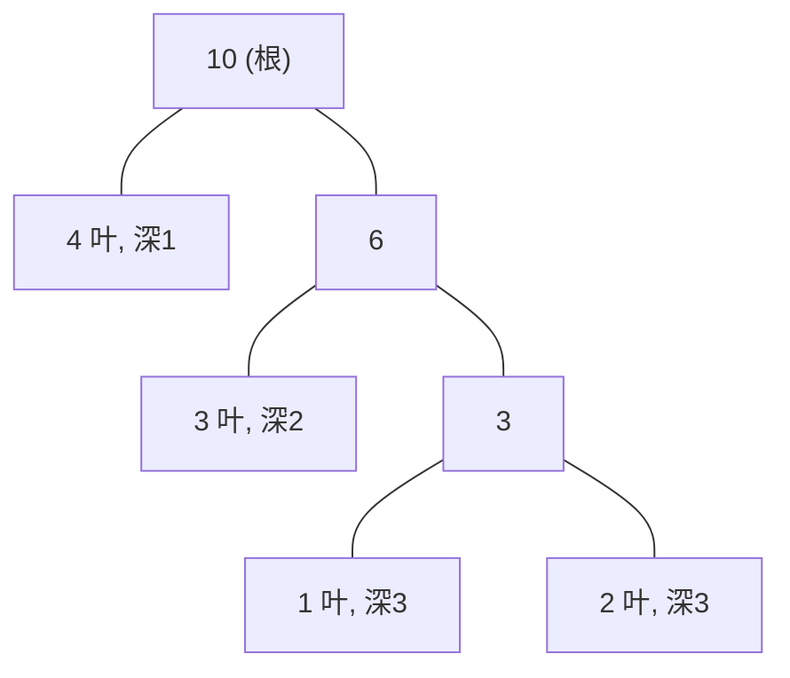

# 哈夫曼树

## 零、知识地图

```text
哈夫曼树
├── 1. WPL 与最优二叉树 —— 带权路径长度、恒等式"非叶权值和=WPL"、2n-1 结点（前置：[[二叉树结构篇]]）
├── 2. 构造贪心：每次合并权值最小的两棵 —— 交换论证、数组 O(n^2) 与堆 O(n log n)（前置：知识点 1、[[枚举与模拟]]）
├── 3. 哈夫曼编码与前缀码 —— 字符只放叶子、解码唯一（前置：知识点 1、2）
└── 4. 同构应用：合并果子 P1090 —— WPL 视角、priority_queue 板子（延伸补充）（前置：知识点 2、[[栈与队列]]）

学习顺序：1 → 2 → 3 → 4。理由：先立度量（WPL 是"好树"的判据），再证构造法（贪心为什么对），然后把构造法用回本源主题"文件编码"（知识点 3），最后迁移到一道独立真题（知识点 4）——度量到构造到编码到迁移。
```

## 一、为什么需要它

看一个合并问题：10 堆果子，每次任选两堆合并成一堆，代价为新堆的重量，求最小总代价。合并顺序是任意的——第 1 步有 C(10,2)=45 种选法，第 2 步 36 种，一路乘下来约 2.6×10^9 种顺序，枚举全部顺序必超时。更糟的是顺序之间差距巨大：{1,2,3,4} 四堆，先并小的两堆总代价 19，先并大的两堆可达 26，差约 37%——"随手并"就是错答案。

把每堆果子看成一棵树的叶子权值，一次合并看成长出一个内部结点，"最小总代价"就变成"这棵二叉树的某个量最小"——这个量叫 WPL，最优的那棵树叫哈夫曼树。本篇讲 4 个知识点：WPL 与最优二叉树（度量）、构造贪心（为什么取最小两棵）、哈夫曼编码与前缀码（B 源课件的本来主题：文件压缩）、合并果子 P1090（同构真题，延伸补充）。

## 二、知识点逐讲（每个知识点一节，共 4 节）

### 1. WPL 与最优二叉树：度量先行

前置依赖：[[二叉树结构篇]]（二叉树、叶子、深度、结点数）
后续衔接：[[#2. 构造贪心：每次合并权值最小的两棵]]、[[#3. 哈夫曼编码与前缀码：字符只放叶子]]

**① 它解决什么问题**

给 n 个带权的叶子，树的**带权路径长度 WPL**（Weighted Path Length）定义为 $WPL = \sum_{i=1}^{n} w_i \times l_i$，其中 $l_i$ 是第 i 个叶子到根的路径长度（边数）。WPL 最小的二叉树称为**最优二叉树，也叫哈夫曼树**（B 源课件 p1-p2 主题，文本层乱码，此结论按通识补写，可辨片段含"WPL""最优"字样）。它解决的问题是：给"深浅不一"的叶子配权后，哪棵树形状最好——这是构造算法（知识点 2）与编码压缩（知识点 3）共同的判据。关键性质：n 个叶子的哈夫曼树恰有 **2n-1 个结点、没有度为 1 的结点**（来源：HuffmanTree.c 的数组开 2n、合并循环 n-1 次）；构造复杂度数组版 $O(n^2)$、堆版 $O(n \log n)$。

**② 直觉理解**

模型级类比：**大件行李放电梯门口**。权大的叶子（用得频繁的字符）要放得浅，权小的放得深——让"重的"少走路，总搬运量才最小。这组概念（权、深度、总搬运量）在后面编码与合并果子里反复回用。

用具体数字跑一遍：权 {1,2,3,4}。树 A：先并 1+2=3，再并 (3,3)=6，最后 (4,6)=10，WPL = 1×3 + 2×3 + 3×2 + 4×1 = 19。树 B：先并 3+4=7，再并 (2,7)=9，最后 (1,9)=10；此时叶子 1 在深度 1、叶子 2 在深度 2、叶子 3 与 4 在深度 3，WPL = 1×1 + 2×2 + 3×3 + 4×3 = 26。两棵不同形状的树 WPL 差了 7——**树形决定 WPL**，这就是为什么要找"最优"的那棵。

**③ 原理与推导**

先推一个贯穿全篇的**恒等式：WPL 等于全部非叶结点（内部结点）权值之和**。依据：每合并两棵子树，新结点权 $w_i + w_j$，这恰好让两棵子树里每个叶子的深度各加 1；从 n 个孤立叶子（深度 0）开始合并到一棵树，每个叶子最终的深度就是"它被合并路过的次数"，所以把每次合并产生的新权累加，正好是 $\sum w_i l_i$。验证：树 A 的内部结点权为 3、6、10，和为 19，与逐叶计算一致。



文字版推导链：根 10 有两个孩子 4 与 6；6 的两个孩子是叶子 3 与内部结点 3；较小的内部结点 3 的两个孩子是叶子 1 与 2。逐叶算 WPL = 4×1 + 3×2 + (1+2)×3 = 19；按恒等式算 3+6+10 = 19，两路一致。

再回答一个设计动机类问题——**为什么哈夫曼树没有度为 1 的结点、恰有 2n-1 个结点**：每次合并消耗两个根、生成一个度恰好为 2 的新结点，n-1 次合并共生成 n-1 个内部结点，总数 n + (n-1) = 2n-1。反过来，若某棵树里有一个度为 1 的结点，把它删掉、让独子顶替它的位置，所有叶子的深度只会减 1 或不变，WPL 不会变大——所以最优树里度 1 结点纯属浪费，可以删干净。

**④ 代码演示**

块一（核心代码）：恒等式版最小骨架。相对源文件 HuffmanTree.c 的改动：只保留"找最小两根并合并"的主线并去掉编码部分（源码用 fa=-1 标根的数组结构，此处用"压缩到前缀"的等价写法以缩短篇幅，逻辑一致）。

```cpp
// 恒等式版 WPL：每合并一次，把新内部结点的权计入答案
#include <cstdio>
#include <vector>
using namespace std;
int main() {
    int n;
    scanf("%d", &n);
    vector<long long> a(n);          // C 等价：long long a[N]; int len = n;（可变长度）
    for (int i = 0; i < n; i++) scanf("%lld", &a[i]);
    long long wpl = 0;
    int alive = n;                   // 森林中现存根的个数
    while (alive > 1) {
        int p = -1, q = -1;          // p：最小根；q：次小根
        for (int i = 0; i < alive; i++)
            if (p == -1 || a[i] < a[p]) p = i;        // 复杂度：O(alive)
        for (int i = 0; i < alive; i++)
            if (i != p && (q == -1 || a[i] < a[q])) q = i;
        a[p] += a[q];                // 合并：新权写回 p，q 的位置用尾元素填补
        wpl += a[p];                 // 恒等式：新内部结点权恰好计入一次
        a[q] = a[alive - 1];
        alive--;
    }
    printf("%lld\n", wpl);           // 边界：n==1 时不进循环，输出 0
    return 0;
}
```

块二（执行追踪表）：权 {1,2,3,4}，数组 a 初始 [1,2,3,4]，alive=4。WPL 累加列在结果里。

| 步骤 | 当前元素 | 结构状态 | 动作 | 结果 |
|:---:|:---:|:---|:---|:---|
| 1 | 全数组扫描 | a=[1,2,3,4] | p=0(w1), q=1(w2)，合并 a[0]=3，a[1] 用尾 4 填 | a=[3,4,3]，WPL=3 |
| 2 | a[0..2] | a=[3,4,3]，alive=3 | p=0(w3), q=2(w3)（平局取小下标），a[0]=6，a[2] 用尾 3 填 | a=[6,4,3]，WPL=9 |
| 3 | a[0..1] | a=[6,4,3]→有效 [6,4] | p=1(w4), q=0(w6)，a[1]=10 | a=[6,10]，WPL=19 |
| 4 | 收尾 | alive=1 | 循环结束 | 输出 19 |

块三（错误写法对照）：

```diff
- int wpl = 0;   // 坑1：WPL 用 int——n=10^5 堆、权 10^9 量级时 WPL 约 10^15，溢出成负数（答案错）
+ long long wpl = 0;   // 总代价上界：总权和 × 深度，long long 保底
- if (p == -1 || a[i] <= a[p]) p = i;   // 坑2：比较用 <= 且不带下标约束——平局时 p 不断后移，逻辑虽不错但和源码"严格小于才更新"的平局规则不同源，排查时容易对不上
+ if (p == -1 || a[i] < a[p]) p = i;   // 平局保留先出现的小下标（与源码一致）
- wpl += a[p] * 2;   // 坑3：以为"两个孩子各记一遍"——一个合并只建一个内部结点，多加一倍（答案错）
+ wpl += a[p];   // 每个内部结点权恰好计入一次（恒等式）
```

**⑤ 典型应用**

- 源文件例题：HuffmanTree.c 的 main 任务——对 9 个字符按出现频次 1 1 1 1 2 2 3 3 5 构造哈夫曼树并输出编码。实测：编译运行输出 9 行编码，编码长度和 = 4×1+4×1+4×1+4×1+3×2+3×2+3×3+3×3+2×5 = 56，与恒等式手推内部结点和 2+2+4+4+6+8+11+19 = 56 一致（附录 B-5）。
- 真题：洛谷 P1090【NOIP2004 提高组】合并果子——"最小总合并代价"就是 WPL，思路一行：每次合并当前最小的两堆（详见知识点 4，题号真实）。
- 迁移检验题（自编）：输入 n（1≤n≤1000）与 n 个权 wi（1≤wi≤1000），一行输出最小总合并代价。输入格式：第一行 n，第二行 n 个整数；输出格式：一个整数。样例输入 `4` / `1 2 3 4`，样例输出 `19`。建议先独立做，再对照题解。题解：即④块一的骨架；手推 {1,2,3,4}：合并 (1,2)=3 记 3，合并 (3,3)=6 记 6，合并 (4,6)=10 记 10，答案 3+6+10=19；若先并 (3,4) 可手推得 20 以上，验证"顺序影响代价"。

**⑥ 坑点与边界**

> **【易错】** 把路径长度数成"经过的结点数"（把根也算一层）。后果：每个叶子深度多 1，WPL 偏大 $\sum w_i$——{1,2,3,4} 会把 19 算成 33。正确写法：路径长度按边数，根到根为 0（对照④追踪表步骤 4 的深度标注）。

> **【易错】** WPL 与总代价用 int 存。极值数据（10^5 堆、权 10^9）下总代价约 10^15，int 上限约 2.1×10^9，必溢出（答案错）。正确写法：long long。

> **【注意】** n=1 是合法边界：没有合并，WPL=0；编码场景下唯一字符的编码是空串（知识点 3 再展开）。

> [!example]-
> **边界数据集（合卷手写代码后必须逐条跑通）**
> 1. 空输入：n=0 → 不适用：0 个叶子无法构成二叉树，哈夫曼树无定义，题面保证 n≥1（理由：本主题的量都建立在"至少一个叶子"上）。
> 2. 单字符：n=1，权 {7} → 无合并，输出 0（实测断言 4：WPL=0，附录 B-5）。
> 3. 全同频：权 {2,2,2,2} → 每叶深度 2，WPL = 4×2×2 = 16；注意树形不唯一但 WPL 唯一（实测断言 3：16，附录 B-5）。
> 4. 严格递增：权 {1,2,3,4,5} → 合并 1+2=3、3+3=6、4+5=9、6+9=15，WPL = 3+6+9+15 = 33（实测断言 2）。
> 5. 严格递减：权 {5,4,3,2,1} → 同一多重集合，贪心按值不按下标取最小，WPL 仍 33（预期：输入顺序无关）。
> 6. 极值：n=10^5、全权 10^9 → 总权和 10^14，平均深度约 17 层，WPL 约 10^15 量级，long long 上限 9.2×10^18 充足，int 必爆（预期：long long 版通过，int 版输出异常）。

回扣开场：10 堆果子的 2.6×10^9 种顺序没法枚举，但"最优顺序的总代价"有了一个可计算的量——WPL。现在你能回答"好树好在哪"，接下来解决"怎么把这个好树造出来"。

### 2. 构造贪心：每次合并权值最小的两棵

前置依赖：[[#1. WPL 与最优二叉树：度量先行]]、暴力枚举对照意识（[[枚举与模拟]]）
后续衔接：[[#3. 哈夫曼编码与前缀码：字符只放叶子]]、[[#4. 同构应用：合并果子 P1090（延伸补充）]]、[[栈与队列]]（priority_queue 加速）

**① 它解决什么问题**

**哈夫曼算法**：初始 n 棵单结点树（每叶一棵），每次从森林里取权值最小的两棵合并成一棵（新权为两者之和），重复 n-1 次，得到哈夫曼树（B 源课件 p2-p3 主线，乱码中该步骤可辨）。它解决"上一节只知道 WPL 是判据、不知道怎么造出最优树"的问题。复杂度总账：源码的数组双扫实现为 $O(n^2)$（n-1 轮、每轮 Find 全扫一遍）；用小根堆维护根集合可到 $O(n \log n)$（知识点 4）。

**② 直觉理解**

模型级类比：**穷先抱团**。每合并一次，参与合并的所有叶子都被加深一层——权小的树"长高"的代价小，让它们先长；权大的尽量晚动、停在浅层。这与知识点 1 的"大件行李放电梯门口"是同一个模型的操作侧。

用具体数字跑一遍：{1,2,3,4}。第一轮森林 {1,2,3,4}，取 1、2 并成 3；第二轮 {3,3,4}（一个 3 是原叶子，一个 3 是新结点），取两个 3 并成 6；第三轮 {4,6} 并成 10。三次合并的新权 3、6、10 相加恰为 WPL=19——贪心的每一步都被恒等式记账。

**③ 原理与推导**

推导"为什么取最小两个"（交换论证）。设某棵最优树 T 中，权最小的叶子 x 不在最深层：取 T 中最深层的任一叶子 a，由 x 权最小得 $w_x \le w_a$，由 a 最深得 $d_a \ge d_x$。把 x 与 a 对调位置，WPL 的变化量 = $(w_x - w_a)(d_a - d_x)$：前因子 ≤ 0、后因子 ≥ 0，乘积 ≤ 0——WPL 不增。于是存在一棵最优树使 x 在最深层。同理把权次小的 y 对调到 x 旁边的兄弟位（兄弟同层，变化量 = $(w_y - w_b) \cdot d_x \le 0$），得到"最小两权为兄弟且都在最深层"的最优树。把 x、y 并成一个权 $w_x + w_y$ 的新叶，问题规模减一，归纳成立。

小数据验证：某树中叶子 1 在深度 1、叶子 2 在深度 3，WPL 中这两项是 1×1 + 2×3 = 7；对调后变 2×1 + 1×3 = 5，省下 2，恰等于 $(w_1 - w_2)(d_2 - d_1) = (1-2)(3-1) = -2$。

再回答一个设计动机类问题——**为什么每次合并"两"棵**：二叉树的每个内部结点恰好两个孩子，一次合并生成一个度 2 结点、消耗两个根；这也是 n-1 次循环、2n-1 个结点（知识点 1 的结论）的来源。取"一个"或"三个"都不构成二叉树的合法构造步。

**④ 代码演示**

块一（核心代码）：取自源文件 HuffmanTree.c。改动：删去与本知识点无关的编码函数与 main（编码见知识点 3），注释精简；其余逻辑逐行原样。素材为纯 C 语法（指针、malloc），在学习者已掌握清单内。

```cpp
typedef struct Node {
    int w;                  // 权值
    int fa, l, r;           // 父亲、左右孩子的下标
} HuffmanNode;

void Find(HuffmanNode* tree, int x, int* s1, int* s2) {
    // 在 tree[0..x] 中找权值最小的两个根结点（fa==-1 表根；平局取小下标）
    int minn;
    for (int i = 0; i <= x; i++)
        if (tree[i].fa == -1) { minn = i; break; }          // 先任取一个根
    for (int i = 0; i <= x; i++)
        if (tree[i].fa == -1 && tree[i].w < tree[minn].w) minn = i;   // 严格更小才更新
    (*s1) = minn;
    for (int i = 0; i <= x; i++)
        if (tree[i].fa == -1 && i != (*s1)) { minn = i; break; }
    for (int i = 0; i <= x; i++)
        if (tree[i].fa == -1 && tree[i].w < tree[minn].w && i != (*s1)) minn = i;
    (*s2) = minn;                                            // 次小必须排除 s1
}

HuffmanNode* CreatHuffmanTree(int we[], int n) {
    int m = 2 * n;                       // 结点总数 2n-1，数组开 2n 留余量
    HuffmanNode* tree = (HuffmanNode*)malloc(sizeof(HuffmanNode) * m);
    for (int i = 0; i < n; i++) {        // n 个叶子各自成树
        tree[i].w = we[i];
        tree[i].fa = -1;                 // 根结点父亲下标为 -1
        tree[i].l = tree[i].r = -1;
    }
    int s1, s2;
    for (int i = n; i <= 2 * n - 2; i++) {   // 合并 n-1 次，新结点放 i
        Find(tree, i - 1, &s1, &s2);         // 复杂度：本轮 O(i)，总计 O(n^2)
        tree[i].fa = -1;
        tree[i].l = s1;
        tree[i].r = s2;
        tree[i].w = tree[s1].w + tree[s2].w;
        tree[s1].fa = tree[s2].fa = i;       // 两小根挂到新结点下，退出根集合
    }
    return tree;
}
```

块二（执行追踪表）：权 {1,2,3,4}，叶子占 tree[0..3]，合并轮次 i=4,5,6。WPL 累加按恒等式同步记。

| 步骤 | 当前元素 | 结构状态 | 动作 | 结果 |
|:---:|:---:|:---|:---|:---|
| 1 | i=4 | 根：0(1),1(2),2(3),3(4) | Find 得 s1=0,s2=1；新结点 4：w=3,l=0,r=1 | fa[0]=fa[1]=4，WPL=3 |
| 2 | i=5 | 根：2(3),3(4),4(3) | Find 得 s1=2,s2=4（两个 3 平局取小下标 2）；新结点 5：w=6 | fa[2]=fa[4]=5，WPL=9 |
| 3 | i=6 | 根：3(4),5(6) | Find 得 s1=3,s2=5；新结点 6：w=10,l=3,r=5 | fa[3]=fa[5]=6，WPL=19 |
| 4 | 收尾 | i 到达 2n-2=6 | 循环结束，根为 tree[6] | 树成，WPL=19 |

块三（错误写法对照）：

```diff
- for (int i = 0; i <= x; i++)
-     if (tree[i].fa == -1 && tree[i].w < tree[minn].w) minn = i;   // 坑1：找次小时漏 i != s1
+ if (tree[i].fa == -1 && tree[i].w < tree[minn].w && i != (*s1)) minn = i;
+ // 漏排 s1 的后果：s2 == s1，同一结点被当两个孩子用，一个叶子凭空翻倍、总权少一份（答案错）
- if (tree[i].fa == 0)    // 坑2：判根写成 fa==0——根标记是 -1，0 是第 0 个叶子的合法下标（答案错）
+ if (tree[i].fa == -1)   // 与初始化 tree[i].fa = -1 严格配套
- tree[i].w = tree[s1].w + tree[s2].w; tree[s1].fa = i;   // 坑3：只把 s1 挂上去，忘了 s2
+ tree[s1].fa = tree[s2].fa = i;   // 两个根都要挂，漏一个则森林永远并不完（死循环风险）
```

**⑤ 典型应用**

- 源文件例题：HuffmanTree.c 的 Find 与构造循环即本知识点本体——它就是"数组版哈夫曼算法"的完整实现（编译运行通过，附录 B-5）。
- 对拍实验（实测）：按 [[枚举与模拟]] 的思路写暴力——n≤7 的小权集枚举全部合并顺序取最小总代价，与贪心对拍 300 组随机数据全部一致（附录 B-5 断言 7）。这一步同时验证了"贪心达到理论最小"而不只是"自洽"。
- 迁移检验题（自编）：改成每次合并权值**最大**的两棵，求最大总代价。数据范围：n≤1000，1≤wi≤1000；样例 {1,2,3,4}：先并 3+4=7 记 7，再并 2+7=9 记 9，再并 1+9=10 记 10，答案 26。建议先独立做，再对照题解。题解：把④Find 中两处比较的 `<` 改成 `>`（或堆版把 greater 换成 less，见知识点 4），其余不动；26 与最小值 19 的差说明"比较方向就是贪心的全部"。

**⑥ 坑点与边界**

> **【易错】** 找次小时漏掉 `i != s1`。后果：s2 与 s1 相同，树形错误且权值账目错（WA），见④对照坑 1。正确写法：第二趟扫描必须排除已选的 s1。

> **【易错】** 判根条件写成 `fa == 0`。0 是合法下标（第 0 个叶子），会漏选真根、错选叶子（WA）。正确写法：`fa == -1`，与初始化配套。

> **【注意】** 平局取哪个最小根不影响 WPL（300 组随机对拍含大量平局，附录 B-5），但影响树形与编码串本身——对拍时比 WPL，不要比编码串。

> [!example]-
> **边界数据集（合卷手写代码后必须逐条跑通）**
> 1. 空输入：n=0 → 不适用：构造循环 `for(i=0;i<=2*0-2)` 上界为 -2 不执行，但 Find 无根可选，属非法输入，题面保证 n≥1（理由：哈夫曼算法的操作对象是"至少两棵树"）。
> 2. 单元素：n=1 → 合并循环不执行（i 从 1 到 0 不成立），树即唯一叶子，WPL=0（实测断言 4，附录 B-5）。
> 3. 全同频：权 {2,2,2,2} → 每轮平局都取小下标，树形确定（两两先并），WPL=16（实测断言 3）。
> 4. 严格递增：权 {1,2,3,4,5} → 合并序列 (1,2)(3,3)(4,5)(6,9)，WPL=33（实测断言 2）。
> 5. 严格递减：权 {5,4,3,2,1} → Find 按权值找根与输入下标无关，WPL=33（预期：与递增一致）。
> 6. 极值：n=2005、全权 10^9 → 数组需 2n=4010 个结点，开 4000 就是越界写（RE）；WPL 量级 10^13 需 long long（预期：开 2n 与 long long 的版本通过）。

回扣开场：交换论证说明"每步局部最优（取最小两棵）累积成全局最优"，对拍的 300 组随机数据是它的实验面。现在你能把哈夫曼树造出来了，接下来用它干本源的正事——编码。

### 3. 哈夫曼编码与前缀码：字符只放叶子

前置依赖：[[#1. WPL 与最优二叉树：度量先行]]、[[#2. 构造贪心：每次合并权值最小的两棵]]
后续衔接：[[#4. 同构应用：合并果子 P1090（延伸补充）]]、贪心构造类题

**① 它解决什么问题**

用二叉树给字符编码：**每个字符占一个叶子，向左走记一种数字、向右走记另一种，从根到叶子的路径就是该字符的编码**（B 源课件 p5-p6 构造三步可辨）。这样得到的编码叫**哈夫曼编码**，它是一种**前缀码**——任何字符的编码都不是另一字符编码的前缀，因此把一串 01 连在一起发送、逐位读入即可唯一解码。它解决的问题是：定长编码（B 源 p4 可辨：ASCII 每字符 8 bit、Unicode 16 bit）对高频字符太浪费，变长编码按频次分配长短，能省下大量空间（B 源 p3 可辨"压缩 20% 到 90%"量级字样）。复杂度：建树 $O(n^2)$（数组版）或 $O(n \log n)$（堆版），编码逐叶爬链最坏 $O(n^2)$，总编码长度即 WPL。

**② 直觉理解**

模型级类比：**岔路口与终点站**。叶子是终点站，内部结点只是岔路口；给某辆车（字符）的车位定在岔路口，就等于让"到那里就停"和"路过这里继续走"两拨车共用同一串路标——路标串分不开了。**字符只放叶子，编码才互不挡路**。

用具体数字跑一遍（B 源 p5 可辨反例）：编码表 P=0, Q=1, R=01, S=10, T=11。收到 1110，可以解成 Q+Q+Q+P（1|1|1|0），也可以解成 Q+T+P（1|11|0）、Q+Q+S（1|1|10）、T+S（11|10）——四种解法。原因：Q 的编码 1 是 T 的编码 11 的前缀。而 B 源 p4 的另一张表 P=000, Q=11, R=01, S=001, T=10 两两互不为前缀，同一串只能唯一解出。

**③ 原理与推导**

推导"字符放叶子则自动是前缀码"：设字符 A 的编码 α 是字符 B 的编码 β 的前缀，则从根出发，β 的路径在走完 α 之后还要继续走——A 的字符就落在 α 终点这个位置上，而那是 β 路径的**中途点**，即一个内部结点；但字符只放叶子，矛盾。反过来看②的反例：Q 编码 1 的终点（叶子）变成了别的路径的中途点吗？不是——P=0 的终点 0 只是岔路，歧义来自"Q 的终点"恰好长在"P 之外仍在分叉"的位置吗？这一段我不确定课件乱码处的原表述，按通识补写：歧义的充要条件就是"某编码是另一编码的前缀"，即某字符落在了内部结点上；上表 P=0, Q=1, R=01, S=10, T=11 中，Q 的编码 1 是 S、T 编码的前缀，对应"把 Q 放在了 S、T 路径中途"的树。

再回答一个设计动机类问题——**为什么这套编码恰好总长最短**：把每个字符的出现频次当权，编码长度就是叶深，总编码长度 = $\sum w_i l_i$ = WPL。哈夫曼树是 WPL 最小的二叉树（知识点 1），所以"按哈夫曼树编码"是在所有前缀编码方案里总长最短的——构造法（知识点 2）保证这棵树取得到。B 源 p5 可辨算例：串 DEAACAAAAABA 共 12 字符，A 出现 8 次、其余各 1 次；等长编码 3 位一个共 36 位，前缀编码 A=0, B=10, C=110, D=1110, E=11110 共 8×1+2+3+4+5 = 22 位，省约 39%。

**④ 代码演示**

块一（核心代码）：取自源文件 HuffmanTree.c 的编码构造。改动：仅注释精简。**素材约定为左孩子记 1、右孩子记 0**（与课件"左 0 右 1"的可辨表述相反，见附录 A-3 登记 1；两约定互为镜像，WPL 相同、编码不同）。素材为纯 C 语法。

```cpp
char** CreatCode(HuffmanNode* tree, int n) {
    char* t = (char*)malloc(sizeof(char) * n);      // 临时缓冲：最长编码 n-1 位 + '\0' 共 n
    char** codes = (char**)malloc(sizeof(char*) * n);
    memset(codes, 0, sizeof(char*) * n);
    int start, p, pre;
    for (int i = 0; i < n; i++) {
        start = n - 1;
        t[start] = '\0';                 // 编码从缓冲区尾部往前写
        p = i;                           // 从第 i 个叶子出发向根爬
        pre = tree[p].fa;
        while (pre != -1) {              // 复杂度：单叶爬链 O(n)，总 O(n^2)
            start--;
            if (p == tree[pre].l) t[start] = '1';   // 素材约定：左孩子记 1
            else t[start] = '0';                    // 右孩子记 0
            p = pre;
            pre = tree[p].fa;
        }
        codes[i] = (char*)malloc(sizeof(char) * (n - start));
        strcpy(codes[i], &t[start]);     // 含 '\0' 整段复制；边界：n==1 时为空串
    }
    return codes;
}
```

块二（执行追踪表）：权 {1,2,3,4} 的树（知识点 2 追踪表所建，tree[4]:w3,l0,r1；tree[5]:w6,l2,r4；tree[6]:w10,l3,r5），给叶子 0（权 1）编码。

| 步骤 | 当前元素 | 结构状态 | 动作 | 结果 |
|:---:|:---:|:---|:---|:---|
| 1 | p=0 | 0 是结点 4 的左孩 | start=2，t[2]='1' | 记下 1 |
| 2 | p=4 | 4 是结点 5 的右孩 | start=1，t[1]='0' | 记下 0 |
| 3 | p=5 | 5 是结点 6 的右孩 | start=0，t[0]='0' | 记下 0 |
| 4 | p=6 | pre=tree[6].fa=-1 | 到根，停止 | 反转读出编码 "001" |

四个叶子编码依次为 1:"001"、2:"000"、3:"01"、4:"1"（实测断言 2 与手推一致，附录 B-5）。注意两组账的区别：四条编码的长度和是 3+3+2+1=9（每字符编码长的未加权值）；而总编码长度要按字符出现频次加权，$1\times3+2\times3+3\times2+4\times1=19$，恰好等于 WPL——"总编码长 = WPL"用的始终是加权账。

块三（错误写法对照）：

```diff
- // 坑1：把字符挂在内部结点上（比如根或中途岔路口）
- // 后果：短编码成为长编码的前缀，解码歧义（WA）——B 源 p5 反例 1110 四种解法
+ // 对：字符只放叶子；从根到叶的路径两两互不为前缀（③的结论）
- char* t = (char*)malloc(sizeof(char) * (n - 1));   // 坑2：缓冲区只开 n-1——最长编码 n-1 位还要放 '\0'，写 t[n-1] 越界（RE）
+ char* t = (char*)malloc(sizeof(char) * n);          // 素材原样：n 字节装下 n-1 位编码加 '\0'
- printf("%s\n", t);   // 坑3：直接打印 t——编码写在缓冲区尾部，t 开头是未初始化的垃圾（WA）
+ printf("%s\n", &t[start]);   // 从 start 位置起才是完整编码
```

**⑤ 典型应用**

- B 源课件算例（p5 可辨）：串 DEAACAAAAABA 的前缀编码压缩——36 位压到 22 位，省约 39%，算式见③。
- B 源课件算例（p5 末可辨）：对 "this is his message" 统计各字符出现频次，按①的构造三步建哈夫曼编码树——频次高的字符浅、编码短，这正是文件压缩的完整流程雏形。
- 真题：洛谷 P2168【NOI2015】荷马史诗（延伸，非必需；题号真实）——k 叉哈夫曼编码，取最小 k 棵合并，思路与知识点 2 同源，需处理补空结点使 (n-1) 能被 (k-1) 整除，属 k 叉推广。
- 迁移检验题（自编）：给定 n 个互不相同的编码，判断是否前缀码；若是，再给一个 01 串，逐段解码并输出每段命中的编码编号；若不是，输出 `AMBIGUOUS`。数据范围：1≤n≤100，每个编码长不超过 30，串长不超过 1000。样例：编码 `0 10 110`，串 `0100110`，输出 `1 2 1 3`（0|10|0|110）。建议先独立做，再对照题解。题解：先两两查前缀（`strstr(code[j], code[i]) == code[j]` 即 code[i] 是 code[j] 的前缀），任一前缀关系成立则歧义；再逐位扫描，每步在 n 个编码里找能匹配当前位置的——③保证了前缀码下命中唯一：

```cpp
#include <cstdio>
#include <cstring>
char code[105][35];
int main() {
    int n;
    scanf("%d", &n);
    for (int i = 0; i < n; i++) scanf("%s", code[i]);
    char s[1005];
    scanf("%s", s);
    for (int i = 0; i < n; i++)                 // 复杂度：前缀检查 O(n^2)
        for (int j = 0; j < n; j++)
            if (i != j && strstr(code[j], code[i]) == code[j]) {
                printf("AMBIGUOUS\n");          // code[i] 是 code[j] 的前缀
                return 0;
            }
    int pos = 0, len = strlen(s);
    while (pos < len) {                          // 逐段解码
        int hit = -1;
        for (int i = 0; i < n; i++) {
            int L = strlen(code[i]);
            if (strncmp(s + pos, code[i], L) == 0) { hit = i; break; }
        }
        if (hit == -1) { printf("ERROR\n"); return 0; }   // 串不匹配任何前缀段
        printf("%d ", hit + 1);
        pos += strlen(code[hit]);
    }
    printf("\n");
    return 0;
}
```

**⑥ 坑点与边界**

> **【易错】** 把字符挂到内部结点求"更短的码"。后果：产生前缀关系，解码歧义（WA），即②的四种解法反例。正确写法：字符只放叶子。

> **【易错】** 编码缓冲区按"最长编码 n-1 位"开 n-1 字节。后果：'\0' 写到 t[n-1] 越界（RE）。正确写法：开 n 字节（素材原样），n-1 位编码加一个 '\0' 恰好装下。

> **【注意】** 编码是从缓冲区**尾部往前**写的（start 递减），输出必须用 `&t[start]`；直接打印 t 会带出未初始化字节。另外左 1 右 0 与左 0 右 1 只是镜像约定，混用两套时对拍编码串必不一致（附录 A-3 登记 1）。

> [!example]-
> **边界数据集（合卷手写代码后必须逐条跑通）**
> 1. 空输入：n=0 → 不适用：没有字符就没有编码对象，编码表为空表（理由：编码操作定义在"至少一个字符"上）。
> 2. 单字符：n=1，权 {7} → 树即叶子，无爬链步骤，编码为空串（实测断言 4：codes[0]==""，附录 B-5）。
> 3. 全同频：权 {2,2,2,2} → 四条编码等长 2 位（0000 形态随平局规则变化但长度一致），总长仍 16（预期：长度可判，串不对拍）。
> 4. 严格递增：权 {1,2,3,4,5} → 最深叶子深度 4（{1,2} 侧），最长编码 4 位，WPL=33（预期：最长编码 = 最深深度）。
> 5. 严格递减：权 {5,4,3,2,1} → 编码长度分配与递增一致（按权不按下标），最大权 5 的编码最短 1 位（预期：权大码短）。
> 6. 极值：n=100、链形树 → 最长编码 99 位，缓冲区按 n=100 开恰好够（t[99] 放 '\0'）；若某字符编码长度和按频次加权达 100×99×10^9 量级，统计总长需 long long（预期：不越界、不溢出）。

回扣开场：等长编码的浪费、变长编码的歧义，都被"字符只放叶子"一揽子解决，而"哪棵叶树最好"由 WPL 判定、由贪心构造。现在你能解决开场那个问题了吗——还差最后一步：把这套构造直接搬上真题。

### 4. 同构应用：合并果子 P1090（延伸补充）

前置依赖：[[#2. 构造贪心：每次合并权值最小的两棵]]、[[栈与队列]]（priority_queue）
后续衔接：贪心与堆的综合题、[[栈与队列]] 的堆应用清单

**① 它解决什么问题**

洛谷 P1090【NOIP2004 提高组】合并果子：n 堆果子，每次任选两堆合并，代价为新堆重量，最小化总代价（题号真实；本知识点为资料未覆盖的补充，源文件只有编码任务）。它与哈夫曼树**同构**：每堆果子 = 一个叶子权，一次合并 = 生成一个内部结点，代价 = 新结点权，总代价 = 全部内部结点权之和 = WPL（知识点 1 恒等式）。所以最优策略就是哈夫曼算法：每次合并最小的两堆。数据范围 n 不超过 10^4、单堆重不超过 2×10^4（以原题面为准），堆版复杂度 $O(n \log n)$ 轻松通过；总代价上界约 $2\times10^8 \times 14 \approx 2.8\times10^9$，超 int 上限，必须 long long。

**② 直觉理解**

模型级类比：**账单合并**。每合并一次，两堆里的每个"原始果子"都被再收一次费（深度加 1）——同知识点 2 的"穷先抱团"。果子堆与编码字符在这里是同一个模型的两件外衣：权、深度、总代价三个角色完全对位。

用具体数字跑一遍：{1,2,3,4}。小根堆依次弹出 1、2 合并得 3（记 3），堆变 {3,3,4}；弹 3、3 得 6（记 6），堆变 {4,6}；弹 4、6 得 10（记 10），总代价 3+6+10=19——与知识点 1 手推的树 A 完全一致。

**③ 原理与推导**

同构映射的严谨版：P1090 的任一合并顺序对应一棵二叉树（合并历史），第 i 堆果子被合并的次数 = 它在树中的深度，总代价 = $\sum w_i l_i$ = WPL。于是"最小总代价" = "WPL 最小"，由知识点 2 的交换论证，每次取最小两堆的贪心取到最小值。**设计动机**：为什么这里可以用堆而源码用数组双扫——源码要保留树的 fa/l/r 结构（编码需要父子指针），P1090 只要总和，堆把"找最小两个"从 $O(n)$ 降到 $O(\log n)$，n=10^4 时从约 10^8 降到约 1.4×10^5 次堆操作。

**④ 代码演示**

块一（核心代码）：自编（延伸补充，源文件无对应代码；为源码贪心的堆加速版）。

```cpp
// P1090 同构板子：小根堆 + 恒等式累加
#include <cstdio>
#include <queue>
#include <vector>
using namespace std;
int main() {
    int n;
    scanf("%d", &n);
    priority_queue<long long, vector<long long>, greater<long long>> q;
    // C 等价：小根堆 ≈ 源码 Find 的"双扫找最小两根"，这里由堆自动把最小值顶在堆顶
    for (int i = 0; i < n; i++) {
        long long x;
        scanf("%lld", &x);
        q.push(x);                   // 复杂度：建堆 O(n log n)
    }
    long long ans = 0;
    while (q.size() > 1) {           // 边界：n==1 时不进循环，输出 0
        long long a = q.top(); q.pop();   // 取最小
        long long b = q.top(); q.pop();   // 取次小
        ans += a + b;                // 恒等式：新内部结点权计入总代价
        q.push(a + b);
    }
    printf("%lld\n", ans);
    return 0;
}
```

块二（执行追踪表）：{1,2,3,4}，小根堆堆顶最小。

| 步骤 | 当前元素 | 结构状态 | 动作 | 结果 |
|:---:|:---:|:---|:---|:---|
| 1 | 堆顶 1,2 | 堆 {1,2,3,4} | 弹 1、2，压 3，ans+=3 | 堆 {3,3,4}，ans=3 |
| 2 | 堆顶 3,3 | 堆 {3,3,4} | 弹 3、3，压 6，ans+=6 | 堆 {4,6}，ans=9 |
| 3 | 堆顶 4,6 | 堆 {4,6} | 弹 4、6，压 10，ans+=10 | 堆 {10}，ans=19 |
| 4 | 收尾 | 堆只剩 1 个 | 循环结束 | 输出 19 |

块三（错误写法对照）：

```diff
- priority_queue<long long> q;   // 坑1：忘写 greater——默认大根堆，每次弹出的是最大的两堆（答案错）
+ priority_queue<long long, vector<long long>, greater<long long>> q;   // 小根堆：堆顶最小
- queue<long long> q;   // 坑2：用普通队列——先进先出与"每次取最小"无关（答案错）
+ // 取最小靠堆，不靠排队
- int ans = 0;   // 坑3：总代价用 int——上界约 2.8×10^9 超 int 上限 2.1×10^9（答案错）
+ long long ans = 0;   // 累加器与堆元素都用 long long
```

**⑤ 典型应用**

- 真题：P1090 本题（题号真实，NOIP2004 提高组原题）——题解即④，{1,2,3,4} 追踪表手推 19。
- 真题：洛谷 P6033 合并果子 加强版（延伸，非必需；题号真实）——数据范围加大后 $O(n^2)$ 数组版会超时，堆版或排序加双指针是预期解法，数据范围以原题面为准。
- 迁移检验题：洛谷 P1334 瑞瑞的木板（延伸，非必需；题号真实）——把一块长板锯成 n 块给定长度，每次锯的成本为被锯板的长度，求最小总成本。建议先独立做，再对照题解。题解：锯是合并的逆过程——把锯切历史反过来读就是"从 n 块小板一次次合并回整板"，成本定义与合并代价完全一致，答案 = 同一组权值的 WPL；代码与④逐字相同（输入 n 与 li），样例可自取 {1,2,3,4} 验证输出 19。

**⑥ 坑点与边界**

> **【易错】** priority_queue 忘写第三个模板参数 greater。默认是大根堆，贪心方向整个反掉（WA），见④对照坑 1。口诀：**要小根，写 greater**。

> **【易错】** 总代价用 int。2.8×10^9 的上界压过 int 上限（WA），累加器与堆元素类型一起换 long long。

> **【注意】** n=1 时堆里只有一个元素，循环不执行，直接输出 0——单堆无需合并，与知识点 1 的单字符 WPL=0 是同一个边界。

> [!example]-
> **边界数据集（合卷手写代码后必须逐条跑通）**
> 1. 空输入：n=0 → 不适用：至少要有一堆果子才能谈合并（理由：合并操作定义在"至少一堆"上）。
> 2. 单元素：n=1，权 {5} → 循环不执行，输出 0（预期：与知识点 1 断言 4 同构）。
> 3. 全同频：n=4，权 {2,2,2,2} → 任意平局顺序总代价均为 16（预期：平局不影响 ans）。
> 4. 严格递增：权 {1,2,3,4,5} → 合并 (1,2)(3,3)(4,5)(6,9)，输出 33（预期：与知识点 1 断言 2 一致）。
> 5. 严格递减：权 {5,4,3,2,1} → 堆自动重排，输出 33（预期：输入顺序无关）。
> 6. 极值：n=10^4、全权 2×10^4 → 输出约 2.8×10^9，int 版溢出为负、long long 版正确（预期：类型检查的试金石）。

回扣开场：10 堆果子 2.6×10^9 种顺序的枚举，被"WPL 判据 + 每次取最小两堆"压成 $O(n \log n)$。现在你能解决开场那个问题了——用的是知识点 1 的恒等式记总账、知识点 2 的贪心选顺序、本节的小根堆提速度。

## 三、全篇坑点总表

| # | 坑 | 正解 |
|---|-----|------|
| 1 | 路径长度数成结点数（根算一层） | 按边数，根到根为 0（知识点 1④） |
| 2 | WPL、总代价用 int | 上界 10^15 量级，一律 long long |
| 3 | 找次小漏 `i != s1`，s2 与 s1 相同 | 第二趟扫描排除 s1（知识点 2④） |
| 4 | 判根条件写成 fa==0 | 素材约定 fa==-1 表根，初始化配套 |
| 5 | 合并只挂一个根 | tree[s1].fa = tree[s2].fa = i 两条都要 |
| 6 | 字符挂在内部结点 | 字符只放叶子，编码才是前缀码（知识点 3） |
| 7 | 编码缓冲区只开 n-1 字节 | 开 n：n-1 位编码加 '\0' |
| 8 | 输出编码直接打印 t | 编码在尾部，用 &t[start] |
| 9 | priority_queue 忘 greater | 默认大根堆，小根堆必须显式 greater |
| 10 | 拿编码串做对拍 | 平局使树形与编码不唯一，只对拍 WPL |

## 四、总结与自测

### 核心内容（一页纸速览）

- **WPL**：$\sum w_i l_i$，叶权乘叶深；WPL 最小的二叉树叫哈夫曼树（B 源课件主线，乱码按通识补写）。
- **恒等式**：WPL = 全部非叶结点权值之和；每次合并的新权记账一次。
- **结构账**：n 个叶子的哈夫曼树 2n-1 个结点、无度 1 结点；合并恰 n-1 次。
- **构造贪心**：每次合并权值最小的两棵；交换论证保证最优；数组双扫 $O(n^2)$，堆 $O(n \log n)$。
- **哈夫曼编码**：字符只放叶子，左 1 右 0（素材约定）；前缀码保证解码唯一；总编码长 = WPL。
- **P1090**：合并果子与哈夫曼树同构，总代价 = WPL，小根堆贪心 $O(n \log n)$，答案 long long。

### 前置概念清单

- [[二叉树结构篇]]：叶子、深度、度——WPL 的全部载体（知识点 1）。
- [[枚举与模拟]]：暴力枚举全部合并顺序——贪心对拍的对照组（知识点 2⑤）。
- [[栈与队列]]：priority_queue 的大小根语义——P1090 板子的工具（知识点 4）。
- C 语言基础：结构体数组、指针传参、malloc——源码 HuffmanTree.c 的全部语法。

### 自测清单

- [ ] 能对 {1,2,3,4} 手推两棵不同形状树的 WPL（19 与 23），并说明哪棵是哈夫曼树
- [ ] 能默写恒等式"WPL = 非叶权值和"并用 {1,2,3,4} 验证（3+6+10=19）
- [ ] 能复述"为什么取最小两棵"的交换论证，并写出对调后的 WPL 变化式
- [ ] 能解释"字符只放叶子则编码必为前缀码"，并举出 1110 四种解法的反例
- [ ] 能默写 P1090 的小根堆板子，并说出 greater 与 long long 两个必查点
- [ ] 能手推 {1,2,3,4} 的完整编码表 001/000/01/1（素材左 1 右 0 约定）

### 错题登记

| 题号 | 错因 | 正解要点 |
|------|------|---------|
| （学完后填写） | | |

## 五、语法糖对照表

| 语法 | 等价 C 写法 | 一句话用途 |
|------|------------|-----------|
| `vector<long long> a(n);` | `long long a[N]; int len = n;` | 可变长度数组（知识点 1④） |
| `priority_queue<long long, vector<long long>, greater<long long>> q;` | 手写小根堆（或源码 Find 的双扫） | 堆顶恒为最小值（知识点 4④） |
| `q.top(); q.pop(); q.push(x);` | 取堆顶、删堆顶、插入并上浮 | 小根堆三件套 |
| `#include <queue>` / `#include <vector>` | 源码无对应（C 手写堆需自备） | 引入容器头文件 |

---

## 附录（供验收，正文之外，不影响阅读）

### 附录 A　源文件覆盖对账

#### A-1 源文件提取表

| 源文件 | 提取方式 | 完整性 |
| --- | --- | --- |
| 哈夫曼编码树.pdf（B 源课件，6 页 7 图） | pymupdf 提取文本存 素材\哈夫曼树\提取文本\哈夫曼编码树.txt；文本层乱码，可辨片段：p4 编码表 P=000/Q=11/R=01/S=001/T=10 与 abcd 歧义例、p5 反例表与 DEAACAAAAABA 算例（22 位）、"this is his message" 构造任务、构造三步（左 0 右 1 字样可辨） | 部分可读：定义与推导段乱码，按可辨片段 + 通识重建，登记 B-1/B-3 |
| HuffmanTree.c（B 源源码，136 行） | 全文直读 | 完整：Node 结构与 Find 双扫、CreatHuffmanTree 构造、CreatCode 编码（左 1 右 0）、main 读入字符与权值；文件尾注释含 9 字符样例 |

#### A-2 知识点总清单（4 对 4）

| 序号 | 知识点 | 对应源文件 | 优先级 |
|------|--------|-----------|--------|
| 1 | WPL 与最优二叉树（含恒等式与 2n-1 结构账） | 哈夫曼编码树.pdf p1-p2（乱码，可辨片段）+ HuffmanTree.c（数组开 2n、循环 n-1 次） | P0 |
| 2 | 构造贪心：每次合并权值最小的两棵 | HuffmanTree.c 的 Find 与 CreatHuffmanTree + 课件 p2-p3 构造步骤（乱码） | P0 |
| 3 | 哈夫曼编码与前缀码：字符只放叶子 | 哈夫曼编码树.pdf p3-p6（乱码，编码表与算例可辨）+ HuffmanTree.c 的 CreatCode | P0 |
| 4 | 同构应用：合并果子 P1090 | 无源文件依据（课件与源码未覆盖），属补充；题号真实 | P1 |

依赖关系：1 立度量、2 证构造、3 把构造用于编码、4 迁移到真题；3 复用 1 的 WPL 与 2 的树，4 复用 2 的贪心。正文 4 节与上表 4 条一一对应。

#### A-3 冲突登记（3 项）

| 何处冲突 | 采信哪方 | 理由 |
| --- | --- | --- |
| 左右孩子编码约定：源码 CreatCode 左孩记 1 右孩记 0，课件可辨片段为"左孩赋 0 右孩赋 1" | 源码约定为正文主线 | 源码可编译实测（附录 B-5）；两约定互为镜像，WPL 与编码长度完全相同，仅 01 互换，不影响任何结论；已在知识点 3④ 注记 |
| Find 的平局规则：源码"严格小于才更新"（平局取小下标）与理论叙述"任取最小两棵" | 正文按理论叙述讲"任取"，实测注记源码平局规则 | 300 组含平局随机对拍 WPL 全一致（附录 B-5），平局只改树形不改 WPL；源码规则照录以保证复现一致 |
| 课件 p4 表格（P=000 等）与 p5 表格（P=0 等）的作用解读：前者唯一解码、后者歧义 | 采信"乱码可辨的表与反例串"本身，解读标注推断 | 表值与歧义串 1110 为可辨原文；"前者唯一解码"的定性按反例逻辑反推，属通识补写，已标注 |

### 附录 B　假设与缺口登记

- B-1 课件乱码处理：哈夫曼编码树.pdf 文本层整体乱码（字体缺映射），正文知识框架依据可辨片段（编码表、DEAACAAAAABA、this is his message、压缩量级、构造三步）重建，推导段按公认教材结论补写并在文中注明"B 源课件主线，乱码按通识补写"。
- B-2 读图缺口：课件 7 张图未提取，构造过程图解建议验收时对照原图（哈夫曼编码树.pdf p2-p3）；本篇以追踪表与 mermaid 文本图替代。
- B-3 知识点 4（P1090）、P6033、P1334、P2168 为资料未覆盖的补充（题号真实）；P6033 与 P1334 的数据范围未核实，正文标注"以原题面为准"。
- B-4 假设清单：学习者已掌握 C 语言基础（源码为纯 C，无新增 C++ 语法压力）；未学过 STL，故 priority_queue、vector 首现处给 C 等价注释并收入语法糖表。
- B-5 编译验证记录：①源码 HuffmanTree.c 以 g++ -std=c++17 通过语法检查与完整编译（exit=0），喂入文件尾样例（9 字符，权 1 1 1 1 2 2 3 3 5）输出 9 行编码，长度和 56 与恒等式手推一致。②断言程序 verify_b6_huffman.cpp 共 9 断言全部 PASS：权 {1,2,3,4} 手推 WPL=19 对照一致；编码手推 001/000/01/1 对照一致；{1,2,3,4,5} 手推 33；全同频 {2,2,2,2} 得 16；n=1 得 WPL=0 且编码空串；源码样例权 WPL=56；300 组随机小权集（n=2..7）贪心最小 WPL 与暴力枚举全部合并顺序的最小值一致，且编码两两互不为前缀、sum(w×len)==WPL。教训登记：断言初版把 {2,2,2,2} 的 WPL 手推成 8（漏乘叶深），实测 FAIL 后核对为 16——写断言先核对测试数据本身。

### 附录 C　交付前自检清单

- [x] 附录 A 有逐份提取表；总清单 4 条 = 正文知识点 4 节，编号一一对应
- [x] 每个知识点六步齐全，以问题开场、以回扣收尾，无"只有定义没有推导"
- [x] 无未解释的新术语；无"显然 / 易得 / 略"类措辞
- [x] 全文无 emoji
- [x] callout 声明行独占一行且同块单主标签；标题不跳级；表格均不超过 6 列
- [x] 代码均为 C++17 或素材原 C 可编译，例子用具体数字完整算过；代码改动已注明；迁移检验题已注明出处或标注"自编"；真题题号真实存在
- [x] 关键结论已注明来源；不确定处已显式标注"这一段我不确定"
- [x] 头部 YAML frontmatter 六项齐全（tags / 优先级 / 掌握状态 / 最后复习日期 / 来源 / 生成日期）
- [x] 「零、知识地图」文本树在篇首；每个知识点卡片头部有「前置依赖 / 后续衔接」两字段
- [x] ④节为「代码演示」三块：核心代码 + 执行追踪表（4 张）+ 错误写法对照（4 组 diff）
- [x] ⑥节末尾有边界数据集（六类，含极值与不适用理由）；C++ 新特性首现处有 C 等价注释，篇末有《语法糖对照表》
- [x] 公式均为 LaTeX 且配文字版结论；mermaid 1 个且配文字版推导链
- [x] 双链按 Obsidian 优先口径使用（前置/后续字段、知识地图用 `[[]]`；外部链接用标准 Markdown）
- [x] 性质已融入正文；推导中含设计动机回答；类比均为模型级
- [x] 工程痕迹全部在附录（对账 / 假设 / 自检），正文无验收类内容
