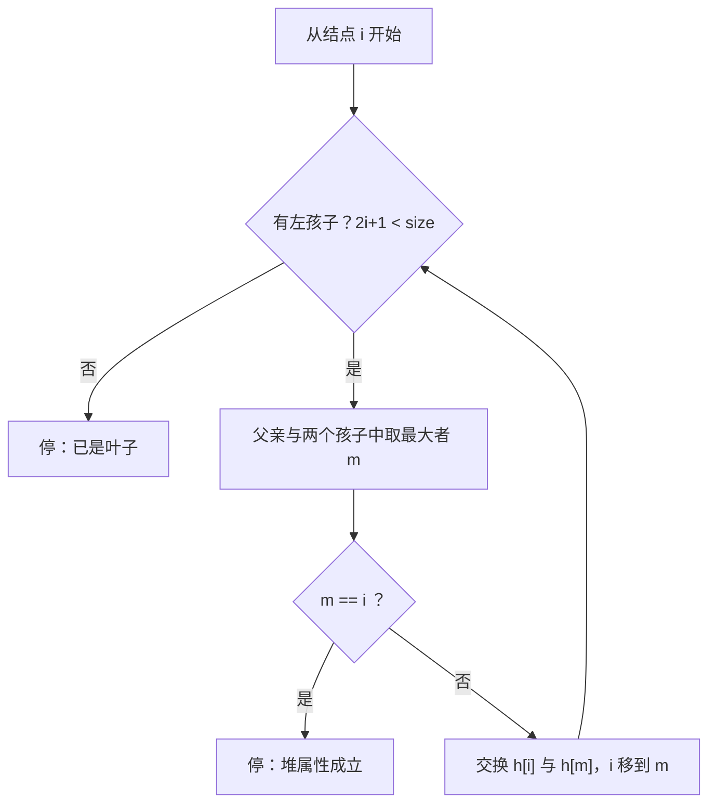

# 二叉堆

## 零、知识地图

```text
二叉堆
├── 1. 完全二叉树形态与数组下标公式 —— 数组能存树的合法性来源（前置：[[二叉树结构篇]] 顺序存储）
├── 2. 上浮与下沉：插入与弹出的引擎 —— 一切堆操作的积木（前置：1）
├── 3. 自底向上建堆为什么是 O(n) —— n/2 倒序下沉与求和推导（前置：2；资料未覆盖，属补充）
└── 4. 应用：priority_queue 与堆优化 Dijkstra —— 兵器库里的发动机（前置：2、3）

学习顺序：1 → 2 → 3 → 4。理由：先立"数组为什么能存树"（1），再学两个方向的基本操作（2），
然后回答"批量建堆为什么不亏"（3），最后接上竞赛兵器库（4）——从形态到操作到批量到实战。
```

## 一、为什么需要它

先看一个大概率碰过壁的场景：n = 10^5 个任务排着队，每次要取**优先级最高**的执行，期间还会不断插入新任务（m = 10^5 次插入）。暴力做法是每次线性扫一遍找最大——单次 O(n)，取加插合计 $O(n^2)$，约 $2 \times 10^{10}$ 次比较，必超时；改成"先排序再动态插入"更亏——每插一个补排一次，$O(n \log n)$ 比扫一遍还贵。**碰壁的根源：'取最值'与'动态插入'互相矛盾。**

二叉堆的破法（B 源 p1）：把数据组织成一颗完全二叉树，让最大值（或最小值）永远坐在根上——插入 $O(\log n)$、取顶 $O(1)$、弹顶 $O(\log n)$，总量级 $O((n+m)\log n) \approx 2 \times 10^6$，轻松通过。本篇讲 4 个知识点：数组存树的公式（1）、上浮与下沉（2）、建堆为什么 $O(n)$（3）、兵器库应用（4）。

## 二、知识点逐讲（每个知识点一节，共 4 节）

### 1. 完全二叉树形态与数组下标公式

前置依赖：[[二叉树结构篇]]（完全二叉树、顺序存储）
后续衔接：[[#2. 上浮与下沉：插入与弹出的引擎]]、[[线段树]] / [[树状数组]]（同为完全形态的数组存储，延伸）

**① 它解决什么问题**

树形结构通常靠指针定位父子，但指针又费内存又对缓存不友好。堆的答案（B 源 p2 属性 1 原话大意）：**"二叉堆必定是一颗完全二叉树。二叉堆的此属性也决定了它们适合存储在数组当中。"**——完全形态保证结点按层连续编号、中间无空洞，于是父与孩子的位置可以纯靠下标算出来，一个指针都不用存。定位公式的复杂度全部是 $O(1)$：知道了下标 i，父与孩子的下标一步算出，这是后面所有操作的出发点。

**② 直觉理解**

模型级类比：**按层发门牌**。完全二叉树每层从左到右住满，门牌号（数组下标）连续无空洞；门牌算术随之成立——知道你的门牌 i，父母的门牌就是 $(i-1)/2$，左孩子 $2i+1$、右孩子 $2i+2$（B 源 p2 存储表）。不需要"邻居表"（指针），门牌本身就是地址。

用具体数字跑一遍（B 源 p2 的图）：数组 `[10,15,20,45,50]`——值 45 住在下标 3，父 $(3-1)/2 = 1$ 是 15；值 15 的两个孩子是 $2 \times 1+1 = 3$、$2 \times 1+2 = 4$，即 45 与 50。和图上的树逐一对上。

**③ 原理与推导**

为什么完全形态是前提：若中间有空洞，下标不连续，"孩子位置 = 父位置推算"会落到空洞上，公式作废。B 源 p1 给出形态的递归定义：去掉最后一层是满二叉树、且最后一层从左到右排列的是完全二叉树；满二叉树（每个非叶结点度数为 2）必然完全。

0-based 公式的推导（B 源 p2 表）：第 d 层有 $2^d$ 个位置，前 d 层共 $2^d - 1$ 个，所以第 d 层占据下标 $[2^d-1,\ 2^{d+1}-2]$。对下标 i：它与相邻下标共享父结点（第 k 个父结点的两个孩子占两个连续下标），把 i 减 1 再除以 2，恰好把"两个孩子"折回同一个父——$parent(i) = (i-1)/2$（C 整数除法自动截断）。左孩子 $2i+1$、右孩子 $2i+2$ 反向同理。B 源 p1 还有一套 1-based 公式（父 $i/2$、孩子 $2i$、$2i+1$），两套因编号起点不同而相差一个偏移，本质一致（冲突登记见 A-3 第 1 条）；本篇主线 0-based，因为 B 源 p2 存储表与 p3-p7 全部操作例都按 0-based 推演。**设计动机**：公式刻意设计成纯算术——省掉指针域、缓存连续，且 $(i-1)/2$ 不需要特判 i 的奇偶。

**④ 代码演示**

定位公式的自编实现（素材无代码，依据 B 源课件 p1-p2 描述自编）：

```cpp
// 自编实现，依据 B 源课件描述（素材无代码：09 二叉堆.pdf 全文无程序清单）
int parent(int i) { return (i - 1) / 2; }   // 边界：仅 i > 0 时调用；i==0 是根
int left(int i)   { return 2 * i + 1; }     // 左孩子（B 源 p2 存储表）
int right(int i)  { return 2 * i + 2; }     // 右孩子，可能不存在
bool isLeaf(int i, int n) { return 2 * i + 1 >= n; }   // 边界：n 为当前结点总数
```

**执行追踪表**（数组 `[10,15,20,45,50]`，n=5，逐下标代入公式）：

| 步骤 | 当前元素 | 结构状态 | 动作 | 结果 |
|:---:|:---:|:---|:---|:---|
| 1 | i=0（值 10） | [10,15,20,45,50] | 根无父；left=1，right=2 | 孩子 15、20 |
| 2 | i=1（值 15） | 同上 | parent=(1-1)/2=0；left=3 | 父 10，左孩子 45 |
| 3 | i=3（值 45） | 同上 | parent=(3-1)/2=1；2*3+1=7>=5 | 父 15，是叶子 |
| 4 | i=4（值 50） | 同上 | parent=(4-1)/2=1；2*4+1=9>=5 | 父 15，是叶子 |

**错误写法对照**：

```diff
- int parent(int i) { return i / 2; }          // 坑1：0-based 直接除 2——i=2 时算出父 1，但 2 的父是 0（答案错）；这是把 1-based 公式错套到 0-based
+ int parent(int i) { return (i - 1) / 2; }    // 0-based：先减 1 再除（B 源 p2 表）
- bool isLeaf(int i, int n) { return i > n / 2; }   // 坑2：n=6 时 i=3 有左孩子 7>=6 是叶子，却被判成非叶（答案错，后续会越界访问）
+ bool isLeaf(int i, int n) { return 2 * i + 1 >= n; }   // 判据回归定义：没有左孩子即叶子
```

**⑤ 典型应用**

- 堆本体的存储（本篇主线）：B 源 p2 存储表就是堆数组的全部约定，getMin 取 `arr[0]`（B 源 p3）。
- 延伸，非必需：[[线段树]]、[[树状数组]]、[[哈夫曼树]] 的数组存储都复用同一套"完全形态 + 下标算术"，学会本节等于一把钥匙开三把锁。
- 迁移题（自编）：n=10 的完全二叉树顺序存储，写出下标 6 的父与孩子。题解：父 $(6-1)/2 = 2$；孩子 $13, 14$，均 $\ge 10$ 不存在——下标 6 是叶子（$2 \times 6+1 = 13 \ge 10$）。

**⑥ 坑点与边界**

> **【易错】** 两套编号公式混用：B 源 p1 是 1-based（父 i/2），p2 是 0-based（父 (i-1)/2）。同一份代码里混写，父与孩子全部错位（答案错）。A-3 第 1 条已登记，正文全线 0-based。

> **【易错】** 判叶写 `i > n/2`。n=6 时下标 3 满足 $2 \times 3+1 = 7 \ge 6$，是叶子，但 $3 > 3$ 不成立被判成内部结点，后续取孩子下标越界（RE）。判据必须回归定义。

> **【注意】** `parent(0)` 在 C 里算出 $(0-1)/2 = 0$（负数截断向零），返回它自己。任何使用父下标的地方都要先用 `i > 0` 挡住根，否则逻辑上是"根的父是根自己"。

> [!example]-
> **边界数据集（先自己跑一遍，再展开对照）**
> 1. 空输入：n=0 → 无结点，公式无从使用，程序应空转结束（预期：无输出、不崩溃）。
> 2. 单元素：n=1 → 仅下标 0，既是根又是叶子（2*0+1=1>=1）；parent 不可调用（预期：isLeaf(0,1) 为真）。
> 3. 全相同键：[7,7,7,7] → 公式只看下标不看键值，定位结果与键值无关（预期：定位正确；此类对公式不构成压力，不适用）。
> 4. 严格递增/递减：同上理由，下标公式与数值序无关（不适用，理由同第 3 条）。
> 5. 极值：n 取数组上限 10^6 时最大孩子下标约 2*10^6+1，int 安全；真正要防的是 n 声称 10^6 而数组只开 10^5（数组开小 → RE）。

回扣开场：门牌算术立住了——知道下标就能 O(1) 定位父子。现在你能解释"堆为什么敢用数组存树"，接下来解决"插进来、弹出去时如何只动一条路径"。

### 2. 上浮与下沉：插入与弹出的引擎

前置依赖：[[#1. 完全二叉树形态与数组下标公式]]
后续衔接：[[#3. 自底向上建堆为什么是 O(n)（资料未覆盖，属补充）]]、[[#4. 应用：priority_queue 与堆优化 Dijkstra]]

**① 它解决什么问题**

插入一个数、弹出堆顶之后，堆属性（大根堆：父不小于孩子）可能被局部破坏，需要调整。B 源 p3 原话大意：移除最小元素之后需要对堆进行调整使其依旧维持其属性，"一般将调整的过程称为堆化（heapify）"。堆化有两个方向：**向上**（尾部新元素比父大，B 源 p4 称"向上回溯"）与**向下**（堆顶换入的元素不够格）。操作总账：取顶 $O(1)$、插入 $O(\log n)$、弹顶 $O(\log n)$、按下标改键 $O(\log n)$——对数来源是树高 $\lfloor \log_2 n \rfloor$，每层至多一次比较加一次交换；B 源 p7 也明确写了"删除一个结点的时间复杂度也是 O(log n)"。

**② 直觉理解**

模型级类比：**公司晋升与降职**。上浮：新人业绩碾压顶头上司，就互换职位，一路比到董事长（根）为止；下沉：临时顶班者不够格，与两个下属里**最能打的那位**比，输了降一层。两条规则管住插入、弹顶、改键三类场景——晋升/降职的判定标准始终是"和直属上下级比"，不越级。

用具体数字跑一遍（B 源 p6 的例子，小顶堆）：`[10,15,20,45,50,30]` 插入 9——9 比父 20 小，交换；9 到 i=2 再比父 10，交换；9 到根，停。B 源 p3-p4 的弹顶例：删 10 后尾元素 50 补顶，50 与左孩子 15 交换、再与 45 交换，落到叶子，堆恢复。

**③ 原理与推导**

下沉（大根堆）的完整判定流程：



文字版推导链：下沉每步只问两句话——"还有没有孩子"与"我是不是三人中最大"；没有孩子（叶子）直接停，有孩子就比一遍，最大是自己则停，否则与最大的孩子换位后在新位置重复同样两问。每层一次比较加一次交换，树高 $\log_2 n$，所以下沉 $O(\log n)$。

推导两个设计决策。**为什么弹出要"尾元素补顶"**：若直接挖掉堆顶，数组中间留洞，完全形态破坏、下标公式失效（知识点 1 的前提塌了）；尾补顶保持完全形态，代价只是一次下沉。**为什么必须与"较大的孩子"换**：与较小的孩子交换，等于把不够大的值放在了上面，堆属性当场再次被破坏；选较大者才能保证换完之后"父 ≥ 两个新房客"成立。上浮方向无此问题——父亲只有一个，没得挑。

**④ 代码演示**

核心代码（自编实现，依据 B 源课件描述；B 源全篇以小顶堆演示，本篇按竞赛默认的大根堆实现，比较方向对调——冲突登记见 A-3 第 2 条）：

```cpp
// 自编实现，依据 B 源课件描述（素材无代码：09 二叉堆.pdf 全文无程序清单）
#include <cstdio>

int h[1000005];   // 堆数组（大根堆：每个结点 >= 它的两个孩子）
int n = 0;        // 当前元素个数；堆顶恒为 h[0]（B 源 p2：根元素用 arr[0] 表示）

void swapNode(int i, int j) { int t = h[i]; h[i] = h[j]; h[j] = t; }

void siftUp(int i) {                        // 上浮：比父大就换（B 源 p4"向上回溯"）
    while (i > 0) {                         // 边界：i==0 是根，没有父结点
        int p = (i - 1) / 2;                // 父结点下标（B 源 p2 存储表）
        if (h[p] >= h[i]) break;            // 判停必须带等号：全相同键时零交换
        swapNode(p, i);                     // 复杂度：每上一层换一次，最多 log2(n) 层
        i = p;
    }
}

void siftDown(int i, int size) {            // 下沉：不够格就压回去（B 源 p3-p4 heapify）
    while (2 * i + 1 < size) {              // 边界：有左孩子才可能下沉
        int l = 2 * i + 1, r = 2 * i + 2;   // 左右孩子下标（B 源 p2 存储表）
        int m = i;                          // 三人中最大者的下标
        if (h[l] > h[m]) m = l;
        if (r < size && h[r] > h[m]) m = r; // 边界：右孩子可能不存在（2i+2 可能越界）
        if (m == i) break;                  // 自己已是最大，堆属性成立
        swapNode(i, m);
        i = m;
    }
}

void push(int x) { h[n] = x; siftUp(n); n++; }   // 插入：放尾再上浮，O(log n)
void popTop() {                                  // 弹出堆顶，O(log n)
    h[0] = h[n - 1];                             // 尾元素补顶，保住完全二叉树形态
    n--;                                         // 先缩规模，再下沉
    siftDown(0, n);                              // B 源 p3 称这一步为"堆化 heapify"
}
int top() { return h[0]; }                       // 取顶 O(1)（B 源 p3 getMin）
```

**执行追踪表之一（上浮 swap 链）**：依次 push 10、15、20、45、50：

| 步骤 | 当前元素 | 结构状态 | 动作 | 结果 |
|:---:|:---:|:---|:---|:---|
| 1 | push 10 | [10] | i=0 是根，无需上浮 | [10] |
| 2 | push 15 | [10,15] | i=1，父 10<15，换 | [15,10] |
| 3 | push 20 | [15,10,20] | i=2，父 15<20，换 | [20,10,15] |
| 4 | push 45 | [20,10,15,45] | i=3 换 10，i=1 换 20，两步链 | [45,20,15,10] |
| 5 | push 50 | [45,20,15,10,50] | i=4 换 20，i=1 换 45，两步链 | [50,45,15,10,20] |

**执行追踪表之二（下沉 swap 链）**：对 [50,45,15,10,20] 执行 pop：

| 步骤 | 当前元素 | 结构状态 | 动作 | 结果 |
|:---:|:---:|:---|:---|:---|
| 1 | 堆顶 50 | [50,45,15,10,20] | 尾元素 20 补顶，n=5 变 4 | [20,45,15,10] |
| 2 | 20（i=0） | 同上 | 左 45、右 15，较大 45>20，换 | [45,20,15,10]，i=1 |
| 3 | 20（i=1） | 同上 | 左 10，右不存在，10<20 不换 | 停，堆恢复 |

（两表的终态均已由断言程序实测核对，附录 B-5。）

**错误写法对照**：

```diff
- if (h[r] > h[m]) m = r;                       // 坑1：不判 r < size 就取右孩子——最后一层缺右孩子时越界读数组（RE）
+ if (r < size && h[r] > h[m]) m = r;           // 先判存在性再比大小（边界：右孩子可能没有）
- int m = l; if (r < size && h[r] > h[l]) m = r;
- if (h[m] > h[i]) { swapNode(i, m); }          // 坑2：只挑出孩子中较大者，却不和 i 自己比——i 明明最大还硬换（答案错）
+ int m = i; if (h[l] > h[m]) m = l; if (r < size && h[r] > h[m]) m = r;
+ if (m == i) break;                            // 三人取最大，最大是自己才停
- void popTop() { h[0] = h[n - 1]; siftDown(0, n); }   // 坑3：忘 n--——尾元素补顶后自己还留在堆里，多算一个（答案错）
+ void popTop() { h[0] = h[n - 1]; n--; siftDown(0, n); }   // 先缩规模再下沉
```

**⑤ 典型应用**

- B 源 p7 应用二（原话"使用二叉堆，可以实现一个高效的优先队列"）：优先队列的发动机就是本节的 push/top/pop，STL 封装见知识点 4。
- B 源 p7 应用一：堆排序——建堆后反复 pop，取顶序列即降序（大根堆），$O(n \log n)$。
- 迁移题（自编）：数据流中随时查询当前最大值——操作 `1 x` 插入、`2` 输出最大值，$n \le 2 \times 10^5$，$x \in [-10^9, 10^9]$。题解：push / top 各一行，总复杂度 $O(n \log n)$；对比"每来一个数全量重排"的 $O(n^2 \log n)$，这正是开场碰壁点的最小复现。建议先独立做，再对照题解。

**⑥ 坑点与边界**

> **【易错】** 下沉不判右孩子存在性（坑 1）。最后一层缺右孩子时数组越界（RE），且这一错误在 n 小的样例上常常侥幸不崩，对抗数据必炸。

> **【易错】** 判停比较丢等号：`if (h[p] > h[i]) break` 写成严格大于，全相同键时每次插入都白换到根（无谓 $O(\log n)$ 开销，极端数据 TLE 风险）。判停必须是 `>=`（实测：全 42 的 1000 进 1000 出，带等号零交换，附录 B-5）。

> **【注意】** 弹顶前必须判空：对空堆执行 top/pop 是未定义行为。B 源 p3-p7 的操作例全部以非空堆为前提，这一前提在竞赛代码里要自己用 `n > 0` 兑现。

> [!example]-
> **边界数据集（先自己跑一遍，再展开对照）**
> 1. 空堆弹出：n=0 时调 popTop → 未定义行为；正确写法先判 `n > 0`（预期：走判空分支，不崩溃）。
> 2. 单元素：push(7) 后 popTop → h[0]=h[0] 自补自，n=0，siftDown(0,0) 循环条件 1<0 不成立直接停（预期：安全清空，实测通过）。
> 3. 全相同键：连推 1000 个 42 再全弹 → 判停带等号，零交换、幂等（预期：弹出序列全为 42）。
> 4. 严格递增：push 1..n → 每个数上浮到根，最坏情形 $O(n \log n)$——这正是知识点 3 要解决的问题（预期：堆合法但交换多）。
> 5. 严格递减：push n..1 → 每个数落在尾部不动，$O(1)$/个（预期：几乎零交换）。
> 6. 极值：INT_MAX / INT_MIN 入堆 → int 存得下、比较不溢出；但"堆内求和"类应用必须 long long（知识点 4 坑 3）。

回扣开场：插入与弹出只动一条路径，$O(\log n)$ 到手。现在你能解决开场那个"动态取最值"问题的单步操作了——还差两件事：批量初始化（知识点 3）与兵器库封装（知识点 4）。

### 3. 自底向上建堆为什么是 O(n)（资料未覆盖，属补充）

前置依赖：[[#2. 上浮与下沉：插入与弹出的引擎]]
后续衔接：[[#4. 应用：priority_queue 与堆优化 Dijkstra]]、[[线段树]]（自底向上建树同构，延伸）

**① 它解决什么问题**

手里已有 n 个乱序数，要把它们整体变成堆。逐个 push 的总代价 $O(n \log n)$；而"数组搬进来 + 从最后一个非叶结点倒序下沉"的做法只要 $O(n)$。B 源未讲建堆（全篇从空堆开始逐个插入），本节按通识补充推导。复杂度结论：建堆交换总数不超过 $2n$，是严格线性；这是堆排序（B 源 p7 应用一）第一步能便宜做完的原因。

**② 直觉理解**

模型级类比：**自底向上逐层验收**。叶子（下标 n/2 起）是毛坯单间——单结点天然是堆，一个都不用动；从最底层的"包工头"（最后一个非叶结点）开始逐个验收，验收任何结点时它的两棵子树**已经**是合格的堆，一次下沉就能安家。逐个 push 则相当于"每来一个人全楼重新排位"，把同样的工作重复做了 $\log n$ 遍。

用具体数字跑一遍：数组 `[10,15,20,45,50,30]`（n=6，内部结点 0、1、2）倒序下沉，四次交换后得到 `[50,45,30,10,15,20]`——全过程见④追踪表。

**③ 原理与推导**

推导 $O(n)$：设树高为 H。高度为 h 的结点至多 $2^{H-h}$ 个（第 $H-h$ 层满员时），每个下沉至多 h 步，总交换数

$$\sum_{h=0}^{H} 2^{H-h} \cdot h \le 2^{H+1} \le 2n$$

文字版结论：绝大多数结点住在底层、高度小、几乎不用动，只有少数顶层结点才付 $\log n$ 的代价；按"人数乘单价"加权求和，被 2 的幂稀释成线性。对比逐个 push：最坏情形每个元素从叶上浮到根，$O(\log n)$/个，总计 $O(n \log n)$。

为什么必须**倒序**：倒序保证下沉任何结点时两棵子树都已是堆，"取较大孩子换"的判定才有效；正序做，下层还不是堆，判定基础不存在，结果可能根本不是堆——④错误写法对照坑 1 给了实测反例。

**④ 代码演示**

核心代码（自编实现，依据 B 源课件描述；建堆过程课件未讲，属通识补充）：

```cpp
// 自编实现，依据 B 源课件描述（素材无代码；建堆本身课件未覆盖，属通识补充）
void buildHeap(int a[], int k) {               // a：原始数组（0..k-1），就地建大根堆
    for (int i = 0; i < k; i++) h[i] = a[i];   // 搬进堆数组
    n = k;
    for (int i = n / 2 - 1; i >= 0; i--)       // 最后一个非叶结点 = 尾元素 n-1 的父 = (n-2)/2 = n/2-1（n 为偶时）
        siftDown(i, n);                        // 复杂度：总交换数 <= 2n（推导见③）
}
```

**执行追踪表（建堆 n/2 倒序配表）**：对 [10,15,20,45,50,30] 执行 buildHeap，i 从 2 倒序到 0：

| 步骤 | 当前元素 | 结构状态 | 动作 | 结果 |
|:---:|:---:|:---|:---|:---|
| 1 | i=2（值 20） | [10,15,20,45,50,30] | 左孩子 30>20，换 | [10,15,30,45,50,20] |
| 2 | i=1（值 15） | 同上 | 左 45、右 50，较大 50>15，换 | [10,50,30,45,15,20] |
| 3 | 15 落到 i=4 | [10,50,30,45,15,20] | i=4 是叶子，停 | 该子树成堆 |
| 4 | i=0（值 10） | 同上 | 与 50 换、落 i=1 再与 45 换 | [50,45,30,10,15,20]，交换共 4 次 |

（终态与交换计数已由断言程序实测核对：swaps=4，附录 B-5。）

**错误写法对照**：

```diff
- for (int i = 0; i < n / 2; i++) siftDown(i, n);   // 坑1：正序下沉——沉到中途时子树还不是堆，判定失效。实测 [1..6] 得 [3,5,6,4,2,1]，根 3 < 左孩子 5，根本不是堆（答案错）
+ for (int i = n / 2 - 1; i >= 0; i--) siftDown(i, n);   // 倒序：保证下沉时子树已合格。同数据实测 [6,5,3,4,2,1]，合法堆
- for (int i = n / 2; i >= 0; i--) siftDown(i, n);   // 坑2：起点写 n/2——0-based 下标 n/2 已是叶子（2*(n/2)+1 >= n），空跑无害，但暴露对"最后一个非叶结点 = n/2-1"没吃透
+ for (int i = n / 2 - 1; i >= 0; i--) siftDown(i, n);   // 尾元素 n-1 的父结点恰是 n/2-1
- printf("%d ", h[i]);                              // 坑3：建堆后直接按数组顺序输出——大根堆数组只保证父 >= 子，横向无序（答案错）
+ while (n > 0) { printf("%d ", top()); popTop(); }   // 反复弹出才是有序输出
```

**⑤ 典型应用**

- B 源 p7 应用一堆排序的第一步：$O(n)$ 建堆 + $n$ 次 pop 得降序，总 $O(n \log n)$。
- 真题：洛谷 P1177【模板】排序（$n \le 10^5$，题号真实；素材未覆盖此题，属补充举例）——堆排序可以通过，建堆用本节 $O(n)$ 版。
- 迁移题（自编）：n 个数只求最大值。题解：$O(n)$ 建堆 + 一次 top，总 $O(n)$；逐个 push 则 $O(n \log n)$——建堆最直接的收益。

**⑥ 坑点与边界**

> **【易错】** 正序建堆（坑 1）。$[1..6]$ 实测正序得 $[3,5,6,4,2,1]$，根 3 小于左孩子 5，不是堆；倒序得 $[6,5,3,4,2,1]$，合法（附录 B-5）。这不是理论风险，是一行就能触发的错。

> **【注意】** n=0 或 n=1 时 `n/2 - 1 = -1`，for 循环条件 `i >= 0` 不成立，循环体零次执行——天然安全；但若写成 do-while 或先执行后判断的形态就会访问 h[-1]（RE）。

> **【易错】** 建堆后误以为数组有序（坑 3）。堆序是纵向的父子约束，横向无序；要有序输出必须反复弹出。

> [!example]-
> **边界数据集（先自己跑一遍，再展开对照）**
> 1. 空输入：n=0 → 循环体零次执行，空堆（预期：不崩溃）。
> 2. 单元素：n=1 → n/2-1=-1 不进循环，h[0] 本身即堆（预期：不变）。
> 3. 全相同键：[42]*n → 下沉比较带等号，零交换，幂等（预期：结构不变）。
> 4. 严格递增：[1..32768] 建堆 → 实测交换 65519 次，落在 $(n, 2n]$ 内——最坏输入也只是线性常数（预期：附录 B-5 计数实测）。
> 5. 严格递减：[n..1] → 父已不小于子，零交换（预期：天然是堆，$O(n)$ 且常数极小）。
> 6. 极值：含 INT_MAX 建堆 → 比较不溢出；但"建堆后求和"汇总变量必须 long long（预期：防溢出）。

回扣开场：批量初始化 $O(n)$ 到手——开场场景里"先给 10^5 个任务建堆"这一步现在不亏了。最后一件武器：竞赛里直接用封装好的优先队列。

### 4. 应用：priority_queue 与堆优化 Dijkstra

前置依赖：[[#2. 上浮与下沉：插入与弹出的引擎]]、[[#3. 自底向上建堆为什么是 O(n)（资料未覆盖，属补充）]]
后续衔接：[[Dijkstra与SPFA]]（堆优化最短路全流程）、[[最小生成树]]（Prim 的堆优化，延伸）

**① 它解决什么问题**

学完结构与操作，竞赛里的问题变成"手写还是 STL、用在哪儿"。B 源 p7-p8 给出应用清单：一、堆排序（Heap Sort）；二、优先队列（Priority Queue）——原话"使用二叉堆，可以实现一个高效的优先队列"；三、图算法（Graph Algorithms）——原话"优先队列广泛应用于像迪杰斯特拉算法和普里姆算法的图算法当中"。复杂度对照：手写堆与 STL 的 push/top/pop 都是 $O(\log n)$；差别在手写堆支持"按下标改键"（B 源 p5 updateKey），STL 不支持——**设计动机**：通用容器不知道你的"下标"对应什么业务语义，于是竞赛惯用"重复入堆、弹出时跳过过期项"的懒惰删除来补位，均摊仍是 $O(\log m)$（m 为总入堆次数）。

**② 直觉理解**

[[栈与队列]] 已给 priority_queue 立过模型级类比：**自动排序的 VIP 车场**——不管车按什么顺序来，出场永远是最"贵"的那辆。本篇补上发动机视角：车场内部就是知识点 2 的大根堆数组；`greater<int>` 只是把发动机反装（大根变小根）。B 源 p5-p7 的 updateKey 与"改键 + INT_MIN 哨兵删除"两步法，正是"手写堆如何支持改键与删点"的原型。

用具体数字跑一遍（洛谷 P1090 官方样例，n=3，堆 1、2、9）：取最小两堆 1+2=3（代价 3）；3 入堆后再取 3、9 合成 12（代价 12）；总代价 15，与官方输出一致。

**③ 原理与推导**

P1090 合并果子的贪心：每次合并当前**最小**的两堆，总代价最小。推导：越早合并的堆，其重量会在后续每次合并中被反复累加——参与计费 $k$ 次的堆应当最轻，交换任意两堆的合并顺序都能验证"轻的先合"不劣，所以每一步取最小两堆正确；小根堆的 top 恰好 $O(1)$ 送来最小值。堆优化 Dijkstra 同理对口：它每轮要做的是"在未确定的点里取 dist 最小者"，与堆的 top/pop 完全同构，总复杂度从朴素 $O(n^2)$ 降到 $O((n+m)\log n)$——全流程 [[Dijkstra与SPFA]] 知识点 2 已详讲，本篇只接堆这一端。

**④ 代码演示**

核心代码（自编实现，依据 B 源课件 p7 优先队列描述与洛谷 P1090 题意；素材无代码）：

```cpp
// 自编实现，依据 B 源课件 p7"优先队列"描述与洛谷 P1090 题意（素材无代码）
#include <cstdio>
#include <queue>
#include <vector>
#include <functional>
using namespace std;

int main() {
    int n;
    scanf("%d", &n);
    priority_queue<int, vector<int>, greater<int> > q;
    // vector<int>：C 等价于动态长度的 int 数组；greater<int>：比较器换向 → 小根堆
    for (int i = 1; i <= n; i++) {
        int x;
        scanf("%d", &x);
        q.push(x);                      // 入堆 O(log n)
    }
    long long ans = 0;                  // 求和用 long long（坑 3）
    while (q.size() > 1) {              // 边界：只剩一堆就停
        int a = q.top(); q.pop();       // 取最小——top 只看不取，pop 才真删
        int b = q.top(); q.pop();       // 取次小
        ans += (long long)a + b;
        q.push(a + b);                  // 新堆入堆
    }
    printf("%lld\n", ans);
    return 0;
}
```

**执行追踪表**（P1090 官方样例：3 堆，重量 1、2、9）：

| 步骤 | 当前元素 | 结构状态 | 动作 | 结果 |
|:---:|:---:|:---|:---|:---|
| 1 | 1、2、9 | 小根堆 [1,2,9] | 取 1、2 | 合并代价 3 |
| 2 | 3、9 | [3,9] | 3 入堆；再取 3、9 | 合并代价 12 |
| 3 | 12 | [12] | 12 入堆；只剩一堆，循环停 | ans = 15 |

**错误写法对照**：

```diff
- priority_queue<int> q;                        // 坑1：默认大根堆，取出来的是最大——合并果子要最小（答案错）
+ priority_queue<int, vector<int>, greater<int> > q;   // greater 换向 → 小根堆（greater＝越小越优先）
- int a = q.top(); int b = q.top();             // 坑2：top 不删——a、b 是同一个元素（答案错）
+ int a = q.top(); q.pop(); int b = q.top(); q.pop();   // top 只看，pop 才真删
- int ans = 0; ans += a + b;                    // 坑3：n=10^4 个 2*10^4 的等值堆层层合并，总代价约 n*v*log2(n) ≈ 2.7*10^9，超 int 上限 2.147*10^9（WA）
+ long long ans = 0;                            // 求和先升 long long
```

**⑤ 典型应用**

- 真题：洛谷 P1090 [NOIP 2004 提高组] 合并果子（题号真实；素材未覆盖，属补充举例）——小根堆 + 贪心，追踪表即官方样例全过程。
- B 源 p8 应用三的落地：堆优化 Dijkstra（[[Dijkstra与SPFA]] 知识点 2，P4779 用 priority_queue 实现）与堆优化 Prim（[[最小生成树]]）。
- B 源 p8 原话（延伸，非必需）："除了二叉堆，还有基于二叉堆的变体，二项式堆、斐波那契堆等等，之后有余力再学"——竞赛初期不需要。
- 迁移题（自编）：带删除的最小值查询——操作 `1 x` 入堆、`2 x` 删除一个 x、`3` 输出当前有效最小值（$x \in [-10^5, 10^5]$）。题解：数组 cnt 偏移 $10^5$ 记删除标记；弹顶时若顶已被标记则弹出并减标记，直到顶有效，均摊 $O(\log n)$——这就是①里"懒惰删除"的完整练习。

**⑥ 坑点与边界**

> **【易错】** 大根/小根方向写反（坑 1）。默认是大根堆；要小根堆必须 `greater<int>`，记忆抓手：greater＝越小越优先＝小根。

> **【易错】** top 与 pop 的语义混用（坑 2）：top 只看不删，pop 才真删；连取两个最小值时中间少一个 pop，取到的是同一个元素（答案错）。

> **【注意】** B 源 p7 的删除法（把待删结点替换成 INT_MIN 再弹顶）依赖"键取不到 INT_MIN"这一前提——若题面键能取到 INT_MIN，哨兵失效，必须改用尾补顶的直接删除；STL 无此问题，但也不会"按下标删"，用懒惰删除替代。

> [!example]-
> **边界数据集（先自己跑一遍，再展开对照）**
> 1. 空堆弹出：q 为空时 top/pop 是未定义行为，必须先判 `q.empty()`（预期：判空分支，不崩溃）。
> 2. 单元素：n=1 的 P1090 → 循环体不执行，输出 0（预期：ans=0）。
> 3. 全相同键：全部重量相同 → 取出顺序任意但总和确定（预期：结果唯一，不崩）。
> 4. 严格递增：重量 1..n 入小根堆 → 每个新元素落底不上浮，$O(1)$/个（预期：快）。
> 5. 严格递减：重量 n..1 入小根堆 → 每个新最小值上浮到根，最坏 $O(\log n)$/个（预期：仍是均摊对数，时限内）。
> 6. 极值：键取 INT_MAX 正常；键可取 INT_MIN 时 B 源 p7 哨兵删除法失效（预期：改用直接删除或懒惰删除）。

回扣开场：push / top / pop 是全部单步操作（知识点 2），批量初始化用 $O(n)$ 建堆（知识点 3），竞赛封装成 priority_queue（本节）。现在你能解决开场那个"动态取最值"问题了——插入 $O(\log n)$、取顶 $O(1)$，暴力 $O(n^2)$ 的 $2 \times 10^{10}$ 次比较降到 $2 \times 10^6$ 量级。

## 三、全篇坑点总表

| # | 坑 | 正解 |
|---|-----|------|
| 1 | 1-based（父 i/2）与 0-based（父 (i-1)/2）公式混用 | 一篇代码只认一套，本篇全线 0-based |
| 2 | 判叶写 i > n/2 | 回归定义：2i+1 >= n 即叶子 |
| 3 | 下沉不判右孩子存在性 | r < size && h[r] > h[m] |
| 4 | 下沉只挑孩子中较大者、不与父亲比 | 三人取最大，m==i 才停 |
| 5 | pop 忘 n-- | 先缩规模再下沉 |
| 6 | 上浮/下沉判停丢等号 | 判停用 >=，全相同键零交换 |
| 7 | 正序建堆 | 倒序 for(i=n/2-1;i>=0;i--)，子树先合格 |
| 8 | 建堆后按数组序输出当有序 | 堆序只管父子；有序须反复弹出 |
| 9 | priority_queue 默认方向搞反 | 小根堆用 greater<int> |
| 10 | top 与 pop 混用 / 堆内求和用 int | top 只看不删；求和先升 long long |

## 四、总结与自测

### 核心内容（一页纸速览）

- **形态与存储**：二叉堆必是完全二叉树（B 源 p2 属性 1），数组存储、下标公式 parent=(i-1)/2、left=2i+1、right=2i+2，全部 $O(1)$。
- **上浮**：push 放尾后与父比、大则换（大根堆），判停 `h[p] >= h[i]`；$O(\log n)$。
- **下沉**：pop 尾补顶后与较大孩子比、小则换，判右孩子存在性；$O(\log n)$；取顶 $O(1)$。
- **建堆**：从 n/2-1 倒序逐个下沉，交换总数 $\le 2n$，$O(n)$（资料未覆盖，属补充；实测 32768 个数交换 65519 次）。
- **应用**：堆排序、优先队列、Dijkstra/Prim（B 源 p7-p8）；STL `priority_queue<int, vector<int>, greater<int> >` 即小根堆；B 源 p7 的 INT_MIN 哨兵删除依赖键域前提。
- **变体**（延伸，非必需）：二项式堆、斐波那契堆（B 源 p8 提及）。

### 自测清单

- [ ] 能默写三条下标公式并推导 (i-1)/2 的来历
- [ ] 能手推 push 10/15/20/45/50 的两次上浮链（终态 [50,45,15,10,20]）
- [ ] 能手推 pop 的下沉链并说清"为什么和较大孩子换"
- [ ] 能默写 buildHeap 并解释倒序的必要性（正序 [1..6] 反例实测非堆）
- [ ] 能用高度求和推出建堆交换数 $\le 2n$
- [ ] 能默写 P1090 的小根堆写法并手推官方样例 ans=15
- [ ] 能说清 B 源 p7 哨兵删除法的前提（键取不到 INT_MIN）
- [ ] 能对空堆/单元素/全相同键三种边界各给一条预期行为

### 错题登记

| 题号 | 错因 | 正解要点 |
|------|------|---------|
| （学完后填写） | | |

## 五、语法糖对照表

| 语法 | 等价 C 写法 | 一句话用途 |
|------|------------|-----------|
| `priority_queue<int> q;` | 手写堆 h[]/n + push/popTop/top（知识点 2④） | 默认大根堆 |
| `priority_queue<int, vector<int>, greater<int> > q;` | 手写堆把比较方向取反 | 小根堆（greater＝越小越优先） |
| `q.push(x) / q.top() / q.pop()` | `push(x) / top() / popTop()` | 入堆 / 取顶不删 / 弹顶 |
| `q.empty() / q.size()` | `n == 0 / n` | 判空防 RE / 元素个数 |
| `printf("%lld\n", ans)`（配 long long） | 同 C | 堆内求和防溢出的输出格式 |

---

## 附录（供验收，正文之外，不影响阅读）

### 附录 A　源文件覆盖对账

#### A-1 提取表

| 源文件 | 提取方式 | 完整性 |
| --- | --- | --- |
| 09 二叉堆.pdf（B 源） | 文本层乱码 → 140dpi 渲染 8 页 PNG（pdf_pages_heap）视觉提取；纯 PDF 无代码，④为自编实现并注明 | 完整：形态与 1-based 公式（p1）、堆定义与大小顶（p1）、属性与 0-based 存储表（p2）、getMin/removeMin 与下沉 heapify（p3-p4）、updateKey 上浮（p4-p5）、insert 上浮（p5-p6）、delete INT_MIN 两步法（p7）、应用一二三与变体（p7-p8） |

#### A-2 知识点总清单（4 对 4）

| 序号 | 知识点 | 对应源文件 | 优先级 |
|------|--------|-----------|--------|
| 1 | 完全二叉树形态与数组下标公式 | 09 二叉堆.pdf p1-p2 | P0 |
| 2 | 上浮与下沉（插入与弹出） | 09 二叉堆.pdf p3-p7 | P0 |
| 3 | 自底向上建堆为什么是 O(n) | 素材未覆盖，属补充（B 源 p7 堆排序前提） | P0 |
| 4 | 应用：priority_queue 与堆优化 Dijkstra | 09 二叉堆.pdf p7-p8 | P0 |

依赖关系：1 是 2 的存储前提（下标公式是上浮下沉的地址簿）；2 是 3 的积木（建堆 = 批量下沉）；3 是 4 中堆排序/初始化的性能地基。P1090、P1177 为补充举例（题号真实），非素材自带。

#### A-3 冲突与约定差异登记（4 项）

| 何处冲突 | 采信哪方 | 理由 |
| --- | --- | --- |
| 下标公式：p1 为 1-based（父 i/2、孩子 2i、2i+1）vs p2 为 0-based（父 (i-1)/2、孩子 2i+1、2i+2） | 0-based 为主线 | 两套本质一致，差一个编号偏移；p2 存储表与 p3-p7 全部操作例均按 0-based 推演，正文知识点 1③ 两版并列交代 |
| B 源全篇以小顶堆演示，④代码为大根堆 | 自编大根堆 + 比较方向对调 | 竞赛默认方向是大根堆（priority_queue 默认亦然）；B 源小顶例在断言程序中以负数镜像逐一验证等价（附录 B-5 第 3-6 项） |
| 素材无代码：09 二叉堆.pdf 全文无程序清单 | ④全部代码为自编实现 | 依据 B 源课件文字描述与操作例自编，已 g++ 编译并 11 项断言对拍通过（附录 B-5） |
| p6 文字"继续判断值 9 (i=2)……发现值 9 (i=2) 已经是根结点" | 采信图示：第二次交换后 9 位于 i=0 | p6 图示最终 9 在根，数组 [9,15,10,45,50,30,20] 的下标 0 即 9；文字中 (i=2) 为笔误，"插入完成"的结论不受影响 |

### 附录 B　假设与缺口登记

- B-1 假设清单：学习者已掌握 C 语法（数组、函数、指针）、[[二叉树结构篇]] 的完全二叉树概念、[[栈与队列]] 的 priority_queue 用法卡；未系统学过 STL 源码与复杂度证明，故正文对 $\log$ 量级只给树高论证不给常数分析。
- B-2 资料缺口：建堆 O(n)（知识点 3）B 源未覆盖，按通识补充并标注；堆排序、P1090、P1177 为补充举例（题号真实）；变体二项式堆/斐波那契堆按 B 源 p8 原话登记为延伸，不展开。
- B-3 读取缺口：文本层乱码（字体缺映射），依据 140dpi 视觉提取 8 页；p1 尾部"组合数学199199"字样疑似排版噪点，未采信、不影响知识点。
- B-4 自补延伸：知识点 1⑤/2⑤/4⑤ 的迁移题、P1090/P1177 举例均为自补，标注"自编"或"题号真实，素材未覆盖"。
- B-5 编译验证记录：①verify_b6_heap.cpp（含笔记知识点 2/3 同款实现）g++ -std=c++17 -O2 -Wall 编译 exit 0，断言 **11 PASS / 0 FAIL**：B 源 p3-p7 四例终态逐一匹配（removeMin [15,45,20,50]、update 50 变 8 得 [8,10,20,45,15]、insert 9 得 [9,15,10,45,50,30,20]、delete(15) 得 [10,45,20,50]，小顶镜像等价）；大根堆与 std::priority_queue 各 500 组随机 push/top/pop 对拍一致；建堆与逐个插入同为合法堆且多重集相同。②建堆计数实测：n=1000/4000/16000 时建堆代价 2974/11968/47962（约 3n，线性），逐个插入 15974/79834/383262，比值 5.4/6.7/8.0 随 n 对数增长——O(n) 与 O(n log n) 对照成立；n=32768 递增数据建堆交换 65519，落在 (n, 2n] 内。③正序建堆反例实测：[1..6] 正序得 [3,5,6,4,2,1]（非堆），倒序得 [6,5,3,4,2,1]（合法堆）。④全相同键 1000 进 1000 出零交换；单元素 push/pop 安全清空。验证程序存 Temp\batch6_verify\verify_b6_heap.cpp。

### 附录 C　交付前自检清单

- [x] 附录 A 有逐份提取表；总清单 4 条 = 正文知识点 4 节，编号一一对应
- [x] 每个知识点六步齐全，以问题开场、以回扣收尾，无"只有定义没有推导"
- [x] 无未解释的新术语；无"显然 / 易得 / 略"
- [x] 全文无 emoji
- [x] 同一引用块只有一个主标签；callout 声明行独占一行；标题不跳级；表格 ≤ 6 列
- [x] 代码均为 C++17 可编译（已编译验证），例子用具体数字完整算过；④代码为自编实现并已注明；真题题号（P1090、P1177、P4779）真实存在
- [x] 关键结论已注明来源（B 源 p N）；不确定处已显式标注
- [x] 头部 YAML frontmatter 六项齐全（tags / 优先级 / 掌握状态 / 最后复习日期 / 来源 / 生成日期）
- [x] 「零、知识地图」文本树在篇首；每个知识点卡片头部有「前置依赖 / 后续衔接」两字段
- [x] ④节为「代码演示」三块：核心代码 + 执行追踪表（上浮链 / 下沉链 / 建堆 n/2 倒序共 4 张）+ 错误写法对照（diff 4 组）
- [x] ⑥节末尾有边界数据集（六类折叠 callout，含极值查溢出，不适用项已标理由）；C++ 新特性首现处有 C 等价注释，篇末有《语法糖对照表》
- [x] 公式均为 LaTeX 且配文字版结论；mermaid ≤ 3 个且每个图均有文字版推导链
- [x] 双链按 Obsidian 优先口径使用（前置/后续字段、知识地图用 [[]]；外部链接用标准 Markdown）
- [x] 性质已融入正文（操作/复杂度总账在知识点 2①）；推导中含设计动机回答；类比均为模型级（门牌 / 晋升降职 / 逐层验收 / VIP 车场）
- [x] 工程痕迹全部在附录（对账 / 假设 / 自检），正文无验收类内容
