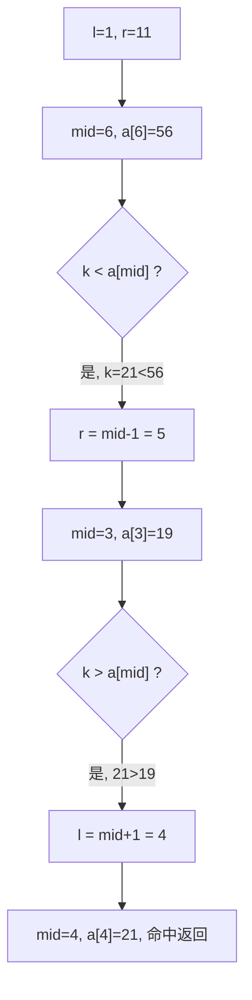

# 三大查找与哈希

## 零、知识地图

```text
三大查找与哈希
├── 1. 三大查找总览 —— 静态/动态查找、ASL、顺序 O(n) / 折半 O(log n) / 分块（前置：数组与循环）
├── 2. 折半查找 —— mid 收敛、区间减半、判定树与 O(log n)（前置：1）
├── 3. 哈希表思想与散列函数 —— 用计算换比较、除留余数法、冲突为何不可避免（前置：1）
├── 4. 开放定址法线性探测 —— 冲突落位、探测路径、懒删除与装载因子（前置：3）
└── 5. 查找结构选型总表 —— 顺序/折半/分块/哈希/平衡树怎么挑（前置：2、4）

学习顺序：1 → 2 → 3 → 4 → 5。理由：先立"查找的账怎么算"（ASL）与三张总脸（1），再把最常用的折半吃透（2），然后转向"不算比较账"的哈希思想（3）与它的冲突处理（4），最后带着全部候选做选型决策（5）——从度量到结构到思想到工程。
```

## 一、为什么需要它

先看你大概率会踩的两个坑。第一坑（超时）：n=10^5 个数里查 m=10^5 次，最朴素的做法是每来一个查询就把数组从头扫到尾，单次 $O(n)$，总账 $O(nm)=10^{10}$ 次比较——1 秒内约 $10^8$ 到 $10^9$ 次简单操作的量级，必超时。第二坑（崩溃）：就算你把"查得快"的哈希表写出来了，如果建表时内存开错尺寸（本篇素材 开放定址法.c 就藏着这么一处缺陷，实测样例直接崩溃零输出），程序照样死在第一步。

**碰壁的根源有两个：比较次数太多、内存管理出错。** 本篇的解法线：三大查找（知识点 1）告诉你"比较账"怎么算、三种结构各值多少；折半查找（知识点 2）把 $O(n)$ 压到 $O(\log n)$；哈希思想（知识点 3）干脆用"算地址"替代"比大小"，平均 $O(1)$；开放定址法（知识点 4）解决"地址撞车"；选型总表（知识点 5）把这些候选放进同一张表，考场上 30 秒定结构。

## 二、知识点逐讲（每个知识点一节，共 5 节）

### 1. 三大查找总览：ASL 与三种结构对照

前置依赖：数组与循环（C 基础）
后续衔接：[[#2. 折半查找：mid 收敛与区间减半]]、[[二分]]（算法视角的同族）

**① 它解决什么问题**

B 源 p1 定义：查找分**静态查找**（只查，集合不变）与**动态查找**（查的过程中可能增删元素）。衡量一个查找结构快不快，用的不是"单次运气"，而是**平均查找长度 ASL**（Average Search Length，B 源 p1）：$ASL = \sum_{i=1}^{n} p_i c_i$，其中 $p_i$ 是查第 i 个元素的概率，$c_i$ 是查到它需要的比较次数。等概率 $p_i = 1/n$ 时，顺序查找 $c_i = i$，$ASL = \frac{1}{n}(1+2+\cdots+n) = \frac{n+1}{2}$——量级 $O(n)$。复杂度总账先摆出来：

| 查找法 | 前提 | 单次复杂度 | 成功 ASL（等概率） | 适用 |
|:---:|:---|:---:|:---:|:---|
| 顺序查找 | 无 | $O(n)$ | $(n+1)/2$ | 无序、数据量小 |
| 折半查找 | 顺序存储且升序有序 | $O(\log n)$ | 约为 $\log_2(n+1)-1$ | 静态有序表 |
| 分块查找 | 块间有序（块内无序） | 折半定块+块内顺序 | 索引项与块内两项之和 | 增删不频繁的有序场景 |

**② 直觉理解**

模型级类比：**翻书找页码**。顺序查找是一页页翻；折半查找是先翻中间，根据"目标在前面还是后面"直接扔掉一半书——书页必须有序（页码是排好序的）你才敢扔；分块查找是先看目录锁定章节（索引表），再在章内一页页翻（块内顺序）。

用具体数字跑一遍（自编小例）：数组 a = {5, 12, 19, 21, 31}，查 21。顺序查找逐个比：5、12、19、21——第 4 次命中，比较 4 次。折半查找（1 起下标）：mid=3 处 a[3]=19，21>19，扔掉左半；mid=4 处 a[4]=21，第 2 次比较命中。5 个元素就省了一半，10^5 个元素省的就是万倍量级。

**③ 原理与推导**

顺序查找为什么对键序没有要求（B 源 p2）：它逐个访问每个元素，不需要元素之间有任何关系，代价是比较次数期望 $(n+1)/2$。折半查找为什么必须有序且顺序存储（B 源 p2"顺序结构"原话）："mid 指示"这个动作要求 `a[mid]` 一步直达——链表做不到，这是接口为何是数组的设计动机。每次比较后区间从 len 变为不超过 $\lfloor (len-1)/2 \rfloor$（左右两半都不含 mid），k 轮后区间长度不超过 $n/2^k$，落到 1 需要 $k \approx \log_2 n$ 轮——这就是 $O(\log n)$ 的出处。B 源 p4 用**判定树**（decision tree，又称比较树）描述这个过程：n 个元素的折半判定树内部结点 n 个、外部失败结点 n+1 个，树高即最坏比较次数；n=11 时树高 4，$\lceil \log_2(11+1) \rceil = 4$，吻合。分块查找（B 源 p5）把表分成若干块，**块间有序、块内无序**：第一步在索引表（存每块最大值）上折半定块，第二步块内顺序扫——总代价是"索引的账 + 块内的账"之和。

**④ 代码演示**

三块齐全。核心代码为顺序查找基线（自编骨架，对应 B 源 p2 顺序查找思想；折半代码在知识点 2 给全）：

```cpp
#include <cstdio>
int a[100005];
int seqSearch(int n, int k) {          // 返回下标（1 起），查不到返回 -1
    for (int i = 1; i <= n; i++)       // 边界：i 从 1 到 n，别写成 i <= n+1
        if (a[i] == k) return i;       // 复杂度：单次 O(n)，命中最快 1 次
    return -1;                         // 等概率成功 ASL=(n+1)/2（B 源 p1 公式推论）
}
int main() {
    int n, k;
    scanf("%d %d", &n, &k);
    for (int i = 1; i <= n; i++) scanf("%d", &a[i]);
    printf("%d\n", seqSearch(n, k));
    return 0;
}
```

**执行追踪表**（a = {5, 12, 19, 21, 31}，n=5，查 k=31）：

| 步骤 | 当前元素 | 结构状态 | 动作 | 结果 |
|:---:|:---:|:---|:---|:---|
| 1 | a[1]=5 | 未命中 | 5≠31，i 后移 | 继续 |
| 2 | a[2]=12 | 未命中 | 12≠31，i 后移 | 继续 |
| 3 | a[3]=19 | 未命中 | 19≠31，i 后移 | 继续 |
| 4 | a[4]=21 | 未命中 | 21≠31，i 后移 | 继续 |
| 5 | a[5]=31 | 命中 | 返回下标 | 输出 5，共 5 次比较 |

**错误写法对照**：

```diff
- int pos = binSearch(a, k);   // 坑1：数组无序却直接上折半——区间减半的前提是"扔掉的一半必然不含答案"，无序时被扔的一半可能有答案（答案错）
+ if (isSorted(a, n)) binSearch(a, k); else seqSearch(a, k);   // 有序才折半，无序先排序（静态数据）或顺序扫
- for (int i = 1; i <= n + 1; i++) if (a[i] == k) ...   // 坑2：上界多写一位，i=n+1 时读 a[n+1] 越界（RE）
+ for (int i = 1; i <= n; i++) ...   // 1 起下标上界是 n
```

**⑤ 典型应用**

- 真题：洛谷 P2249【深基13.例1】查找——有序数组查每个数第一次出现的位置；顺序查找 $O(nm)$ 对 $n, m \le 10^5$ 超时，正解折半/lower_bound（知识点 2 全流程）。
- 真题：洛谷 P1102 A-B 数对——统计数对个数，"查 B 是否在数组里"是查找问题的直接落地，折半或哈希均可。
- 迁移检验题（自编）：给 10^5 个无序数、10^5 次查询，每次查某数是否存在。建议先独立做，再对照题解——无序且不排序就查询：每次顺序扫，$O(nm)=10^{10}$ 超时；先 $O(n \log n)$ 排序一次，再每次折半 $O(\log n)$，总账 $O((n+m)\log n) \approx 1.7 \times 10^6 \times 17$ 量级，轻松通过。答案输出"存在/不存在"。

**⑥ 坑点与边界**

> **【易错】** 对无序数组直接折半。后果是答案悄悄错而不是崩溃：减半逻辑依赖"有序才能安全扔一半"，见④对照坑 1。

> **【易错】** 1 起下标的循环写成 `i <= n+1` 或 0 起下标写成 `i < n+1`。越界读在竞赛环境可能不报错但读到脏数据（WA），也可能直接 RE。

> **【注意】** 折半要求"顺序存储"，链表上不能折半（mid 无法一步直达）；分块是折半与顺序的折中，代价是要维护索引表。

> [!example]-
> **边界数据集（先自己跑一遍，再展开对照）**
> 1. 空输入：n=0，查 5 → 循环零次，输出 -1（预期：不崩溃）。
> 2. 单元素：n=1，a={7}，查 7 → 输出 1；查 8 → 输出 -1（预期：两个方向都对）。
> 3. 全相同：a={3,3,3}，查 3 → 输出 1（顺序版返回第一个命中；预期：确定性）。
> 4. 严格递增：a={1,2,3,4,5}，查 4 → 输出 4（顺序查找与键序无关；这份有序数据同时是知识点 2 折半的前提就位）。
> 5. 严格递减：a={9,7,5}，查 7 → 顺序版输出 2；折半版前提崩塌（升序假设不成立，见知识点 2 边界第 5 条的实测）。
> 6. 极值：k=2147483647 查不存在的数 → 输出 -1，比较不溢出；溢出风险在折半的 mid 计算处，归知识点 2 极值条目。

回扣开场：开场那个 $O(nm)=10^{10}$ 的超时，账就记在"比较次数"上——ASL 告诉你顺序查找每次查询平均比 $(n+1)/2$ 次。现在你能算清这笔账了，接下来用折半把它压到 $\log$ 量级。

### 2. 折半查找：mid 收敛与区间减半

前置依赖：[[#1. 三大查找总览：ASL 与三种结构对照]]、数组与 while 循环（C 基础）
后续衔接：[[二分]]（二分答案的算法视角）、[[#3. 哈希表思想与散列函数：用计算换比较]]

**① 它解决什么问题**

B 源 p2 定义：折半查找（二分查找）要求表**顺序存储且有序**，用 mid 指示中间位置，每次比较后"查找区间缩小一半"，直到命中或区间为空。单次复杂度 $O(\log n)$：$n=10^5$ 时最多约 17 次比较，对 $10^{10}$ 的暴力账是降维打击。素材 A 源 折半查找.c 是它的最小板子：读入有序数组与目标 k，输出命中下标或 -1。

**② 直觉理解**

模型级类比（延续知识点 1 的翻书）：**每翻一页扔掉半本书**。先翻到正中间，页码小了往后翻、页码大了往前翻，每次都把"不可能的一半"整本扔掉——扔得合法的唯一前提是页码有序。

用具体数字跑一遍（B 源 p3-p4 的例，提取文本可辨数字）：11 个元素的有序表（0 起下标 0..10，可辨 a[2]=19、a[3]=21、a[5]=56、a[10]=92），查 21。第一轮 low=0、high=10，mid=5，a[5]=56，21<56，扔右半，high=4；第二轮 mid=2，a[2]=19，21>19，扔左半，low=3；第三轮 mid=3，a[3]=21，命中——3 次比较，与 $O(\log n)$ 吻合（其余数组元素在乱码文本中不可辨，登记附录 B-3；追踪表用完整自编数组做同构推演）。

**③ 原理与推导**

循环不变式：**答案若存在，必在 [l, r] 内**。初始 l=1、r=n 成立；每轮 mid=(l+r)/2，若 a[mid]<k 则答案只可能在右半（有序性保证左半全部 <k），执行 l=mid+1 后不变式保持；a[mid]>k 对称执行 r=mid-1；a[mid]==k 直接命中。区间每轮严格缩至少一半（mid 被排除），所以循环必然终止——为什么边界要 ±1 而不是保留 mid：保留 mid 时区间可能不缩（l==r 且 a[mid]>k 的场合 r=mid 不动），死循环。为什么收尾条件是 `l <= r`：区间 [l, r] 里至少还有一个元素就值得查，l>r 时区间为空、确定不存在。判定树视角（B 源 p4）：n 个元素的比较路径恰是树上从根到某结点的一条路，树高 $\lceil \log_2(n+1) \rceil$ 就是最坏比较次数。



文字版推导链：l=1、r=11 → mid=6 处 56，目标 21 更小，r 收到 5 → 区间 [1,5] → mid=3 处 19，目标更大，l 涨到 4 → 区间 [4,5] → mid=4 处 21，命中。三轮比较，区间 11→5→2→1，每轮砍掉一半以上。

**④ 代码演示**

核心代码取自源文件 折半查找.c（改动：仅补两行注释，逻辑逐行原样；实测样例输出 4，附录 B-5）：

```cpp
#include <stdio.h>
int n, a[105], k;
int main() {
    scanf("%d %d", &n, &k);
    for (int i = 1; i <= n; i++) scanf("%d", &a[i]);
    int ans = -1;                          // 查不到时的返回约定
    int l = 1, r = n, mid;
    while (l <= r) {                       // 边界：区间非空才继续，复杂度 O(log n)
        mid = (l + r) / 2;                 // 错：极大数据下 l+r 会溢出，对：l+(r-l)/2（见坑点）
        if (k == a[mid]) { ans = mid; break; }
        else if (k < a[mid]) r = mid - 1;  // 扔右半：mid 与右半都不含答案
        else l = mid + 1;                  // 扔左半：mid 与左半都不含答案
    }
    printf("%d\n", ans);
    return 0;
}
```

**执行追踪表**（自编样例，与②的 PDF 例同构：a = {5,12,19,21,31,56,65,70,85,92,96}，n=11，1 起下标，查 k=21）：

| 步骤 | 当前元素 | 结构状态 | 动作 | 结果 |
|:---:|:---:|:---|:---|:---|
| 1 | 区间[1,11] | l=1, r=11 | mid=6，a[6]=56 | 21<56，r=5 |
| 2 | 区间[1,5] | l=1, r=5 | mid=3，a[3]=19 | 21>19，l=4 |
| 3 | 区间[4,5] | l=4, r=5 | mid=4，a[4]=21 | 命中，返回 4，共 3 次比较 |

与素材实测吻合：折半查找.c 跑同一数组查 21 输出 4（附录 B-5）；断言程序里它与 `std::lower_bound` 随机 300 组对拍一致（附录 B-5）。和 [[二分]] 篇的关系：那边讲"在单调性上二分答案/找边界"（算法视角），本篇是数据结构课的"有序表查找"视角——mid 收敛的骨架完全同一套，`lower_bound` 就是它的库函数形态。

**错误写法对照**：

```diff
- while (l < r) { ... }   // 坑1：漏等号——l==r 时区间还剩 1 个元素却直接放弃，单元素命中场景漏查（答案错）
+ while (l <= r) { ... }   // 区间非空才继续
- else if (k < a[mid]) r = mid;   // 坑2：不减 1——l==r 且 a[mid]>k 时 r=mid 不动，区间永不缩，死循环（TLE）
+ r = mid - 1;   // mid 已比较过且不可能，连同它一起扔
- mid = (l + r) / 2;   // 坑3：l、r 都接近 2*10^9 时 l+r 超 int 上限，mid 变负数，a[负] 越界（RE）
+ mid = l + (r - l) / 2;   // 极值查溢出的标准写法
```

**⑤ 典型应用**

- 真题：洛谷 P2249【深基13.例1】查找——n、m 到 10^5，逐个顺序扫必超时；排序后每次 `lower_bound` 或手写折半，$O((n+m)\log n)$。
- 真题：洛谷 P1102 A-B 数对——对每个 A 查 C=B+A 出现次数，排序后二分左右端点相减，关键思路一行：次数 = upper_bound − lower_bound。
- 迁移检验题（自编）：有序数组中查 k，若不存在输出"应插入的位置"（0 起）。建议先独立做，再对照题解——把"命中返回"改成"不命中时 l 就是插入点"：循环结束时 l 指向第一个大于等于 k 的位置（这正是 lower_bound 的定义），输出 l 即可。数据范围 n ≤ 10^5，复杂度 $O(\log n)$。

**⑥ 坑点与边界**

> **【易错】** `while (l < r)` 漏等号：单元素区间被跳过，命中在该元素上的查询全部漏报（答案错），见④对照坑 1。

> **【易错】** 收缩时保留 mid（`r = mid` / `l = mid`）：区间可能不缩，死循环（TLE）。收缩必须 mid±1，把已比较过的位置扔掉。

> **【注意】** 前提是升序。递减数组用升序折半逻辑会得到错误答案（见边界第 5 条实测）；极大数据规模下 mid 用 `l + (r-l)/2` 防溢出。

> [!example]-
> **边界数据集（先自己跑一遍，再展开对照）**
> 1. 空输入：n=0 → l=1 > r=0，循环不进，输出 -1（预期：不崩）。
> 2. 单元素：a={7}，查 7 → mid=1 命中输出 1；查 8 → r 收到 0，输出 -1（预期：两向都对）。
> 3. 全相同：a={5,5,5}，查 5 → mid=2 命中输出 2（预期：命中任一同值位置即可）。
> 4. 严格递增：a={1,2,3,4,5,6}，查 0 → 每轮 r=mid-1 收缩到空，输出 -1（预期：左越界不漏不崩）。
> 5. 严格递减：a={9,7,5}（1 起），查 5 → mid=2 处 7>5，r=1；mid=1 处 9>5，r=0 → 输出 -1，但 5 明明在 a[3]（预期：前提崩塌的实测证据，折半只认升序）。
> 6. 极值：l=1.5×10^9、r=2×10^9 量级（下标规模需 long long 配合），`mid=(l+r)/2` 溢出 int → a[mid] 越界（RE）；改 `mid=l+(r-l)/2`（预期：极值查溢出通过）。

回扣开场：比较账从 $(n+1)/2$ 压到约 17 次（n=10^5），开场那个 $10^{10}$ 的超时被 $O((n+m)\log n)$ 解决——用的是本节"区间每轮减半"的结论。但"必须有序 + 必须顺序存储"两个前提在动态增删场景很贵，下面换成"不算比较账"的思路。

### 3. 哈希表思想与散列函数：用计算换比较

前置依赖：[[#1. 三大查找总览：ASL 与三种结构对照]]、数组取模运算（C 基础）
后续衔接：[[#4. 开放定址法线性探测：冲突的落位与查找]]、[[字符串哈希]]（把散列函数用在串上）

**① 它解决什么问题**

B 源 哈希.pdf p1 的破题：设一个键值对（键 key，值 value），查找的目标是"由键定位值"。三种暴力思路都不理想：线性表查得慢、二叉树要逐层比较、直接定址（B 源 p1 第 2 条：键 i 存到 arr[i]）快但费空间——B 源 p1-2 的例：键 15000000000 直接 `arr[15000000000] = 0xFF0A`，要开 $1.5 \times 10^{10}$ 个槽，按每槽 4 字节就是 60 GB 量级内存，不可行。**哈希表**（B 源 p2）的做法：把键**映射**到一个可控范围的地址上——"在记录的存储位置和它的关键字之间建立一个确定的对应关系 H，使每个关键字对应一个存储位置"，这个 H 就是**散列函数**（哈希函数）。查找 = 先算地址再取值，比较次数 0 次，平均 $O(1)$——这就是"用计算换比较"的设计动机。

**② 直觉理解**

模型级类比：**寄存牌号**。你去寄存行李不跟管理员描述"红色箱子上有贴纸"，而是领一个 7 号牌，直达 7 号柜。散列函数就是"发牌规则"：键进去，柜号出来；查找时同一条规则再算一遍柜号。

用具体数字跑一遍（B 源 p3 的例）：哈希函数 $H(key) = key \bmod 7$，表长 7，插入 50：$50 \bmod 7 = 1$，落 1 号槽；插入 700：$700 \bmod 7 = 0$，落 0 号槽；插入 76：$76 \bmod 7 = 6$，落 6 号槽——每个键一次取模直达，零比较。

**③ 原理与推导**

散列函数的四个设计要求（B 源 p2，提取文本可辨条目）：1. **确定性**——相同输入必须算出相同地址（否则查回不来）；2. **一致且快速计算**——本身不能比查找还慢；3. **雪崩效应**——输入微小差异导致输出大幅不同（B 源用 md5 演示：`I love J` 与 `I love Y` 只差一个字符，MD5 值完全不同）；4. **均匀分布**——地址尽量铺满全表，减少扎堆。最常用的**除留余数法**（B 源 p3）：$H(key) = key \bmod p$。为什么冲突不可避免（B 源 p3 的鸽巢原理原话大意）：键的取值范围通常远大于表长 m，"把 n+1 只鸽子放进 n 个笼子，必有一个笼子装两只以上"——只要键值域大于表长，就必然存在两个键算出同一地址，这个事件叫**冲突**（collision）。为什么模数通常选质数且与键分布配合：B 源 p3 建议表长与关键字的公约关系"尽量互质"（这一段乱码只可辨大意，我按通识补全：模数取质数能避免键呈等差步长时地址周期性扎堆）——来源为素材大意加教材通识，不引原文。装载因子（B 源 p6）：$\alpha = n/m$（n 为已存键数，m 为表长），插入查找的开销随 α 上升；B 源 p6 给出"α 为 O(1) 时接近 O(1)"的量级结论。

**④ 代码演示**

核心代码（自编骨架，取 B 源 p3-p4 除留余数示例为数据源；只做"落位"不处理冲突，冲突留给知识点 4）：

```cpp
#include <cstdio>
const int M = 7;                       // 表长 7，与素材 PDF 例一致
int table[M];                          // -1 表示空槽
void init() { for (int i = 0; i < M; i++) table[i] = -1; }
int H(int key) {                       // 除留余数法：H(key) = key MOD p
    int r = key % M;                   // 边界：key 为负时 C++ 取模结果是负数
    if (r < 0) r += M;                 // 对：修正到 [0, M)；错：直接返回会越界（RE）
    return r;
}
bool insertNaive(int key) {            // 复杂度：无冲突时 O(1)
    int pos = H(key);
    if (table[pos] != -1) return false;   // 槽被占即冲突——朴素版直接放弃
    table[pos] = key;
    return true;
}
int findNaive(int key) {               // 找到返回槽位，否则 -1
    int pos = H(key);
    if (table[pos] == key) return pos;
    return -1;                         // 注意：冲突场景下此版会误判，见坑点
}
int main() {
    init();
    int keys[] = {50, 700, 76, 85};
    for (int i = 0; i < 4; i++) {
        if (!insertNaive(keys[i])) printf("%d 冲突，朴素版失败\n", keys[i]);
    }
    printf("50 在槽 %d\n", findNaive(50));
    return 0;
}
```

**执行追踪表**（keys = {50, 700, 76, 85}，M=7，table 初始全 -1）：

| 步骤 | 当前元素 | 结构状态 | 动作 | 结果 |
|:---:|:---:|:---|:---|:---|
| 1 | 50 | 全空 | 50%7=1，槽 1 空 | 入槽 1 |
| 2 | 700 | 槽 1=50 | 700%7=0，槽 0 空 | 入槽 0 |
| 3 | 76 | 槽 0=700 | 76%7=6，槽 6 空 | 入槽 6 |
| 4 | 85 | 槽 1 被 50 占 | 85%7=1，目标槽非空 | 朴素版返回失败（知识点 4 修复） |

**错误写法对照**：

```diff
- int H(int key) { return key % M; }   // 坑1：key=-3 时 -3%7=-3，table[-3] 越界（RE）
+ int r = key % M; if (r < 0) r += M; return r;   // 负键修正到 [0, M)
- int arr[15000000000];   // 坑2：直接定址不压缩键域——60 GB 量级内存（MLE）
+ int table[M]; int H(int key) { ... }   // 用散列函数把大键域压进小表
- if (table[pos] != key) return -1;   // 坑3：冲突发生后，正确答案可能在别的槽，一眼判死会漏（答案错）
+ // 冲突处理交给知识点 4 的探测路径
```

**⑤ 典型应用**

- 真题：洛谷 P1059 明明的随机数——去重 + 排序，值域小可用"桶"（最朴素的直接定址哈希），一行思路：读入即标记 `exist[x]=1`。
- 真题：洛谷 P3370【模板】字符串哈希——把串映射成整数再查重，是本节思想在字符串上的直接延伸（详见 [[字符串哈希]]）。
- 迁移检验题（自编）：n 个互不相同的 int 键按序插入表长 7 的散列表，H(key)=key%7，统计"第一顺位无冲突落位"的键个数。建议先独立做，再对照题解——维护 `bool used[7]`，每个键算 H(key)，若槽空计数加一并标记。数据范围 n ≤ 10^6，复杂度 $O(n)$；预期输出等于被占槽数不超过 7，与 n 无关——直观感受"表长上限决定无冲突容量"。

**⑥ 坑点与边界**

> **【易错】** 负键取模不修正：C++ 的 `%` 对负数返回非正数，`table[负数]` 越界（RE），见④对照坑 1。

> **【易错】** 冲突发生时朴素版"一票否决"：`table[pos] != key` 就说不存在，把散列到同槽的键全部查丢（答案错）。正确的查找必须沿冲突处理路径走——这正是知识点 4 的内容。

> **【注意】** 表长 M 与键分布要配合：键全为 7 的倍数而 M=7 时，全部键落同一槽，哈希退化为顺序查找——模数选质数正是为了避开这类共振。

> [!example]-
> **边界数据集（先自己跑一遍，再展开对照）**
> 1. 空输入：0 个键插入，查 50 → table 全 -1，输出 -1（预期：不崩）。
> 2. 单元素：只插 50 → 槽 1，查 50 返回 1（预期：一次取模直达）。
> 3. 全相同：连插 3 个 50 → 第 1 个落槽 1，后两个朴素版全部失败（预期：冲突必然复现）。
> 4. 严格递增：键 1..7 依次插入 → 分别落槽 1,2,3,4,5,6,0，零冲突铺满全表（预期：等差键配质数表长的理想情况）。
> 5. 严格递减：键 7..1 → 落槽 0,6,5,...,1，同样零冲突（预期：顺序不影响无冲突场景的落位）。
> 6. 极值：key=2147483647 → 2147483647%7=1，正常落槽不溢出；key=-2147483648（INT_MIN）→ 未修正时取模为负（RE），修正后 -2147483648%7=-6? 手算：-2147483648 = 7×(-306783378) - 2，C++ 得 -2，修正 +7 得槽 5（预期：极值查溢出通过，负键修正生效）。

回扣开场：哈希把"比较"换成"算地址"，平均 $O(1)$——但"地址撞车"（冲突）不可避免。开场第二坑（崩溃）也在这一节预演了：数组尺寸与键域必须由你来管。下一节解决冲突落位。

### 4. 开放定址法线性探测：冲突的落位与查找

前置依赖：[[#3. 哈希表思想与散列函数：用计算换比较]]、结构体与指针（C 基础）
后续衔接：[[#5. 查找结构选型总表：什么时候用谁]]、[[字符串哈希]]（冲突处理同样适用于串哈希）

**① 它解决什么问题**

B 源 p7 定义：**开放定址法**的思路——"由 Hash(key) 求出关键字 key 的哈希地址，若表中该位置已被占据，就按规则探测下一个位置"。素材 A 源 开放定址法.c 用**线性探测法**：冲突后依次试 (Hash(key)+1)%M、(Hash(key)+2)%M……直到找到空槽。查找必须沿同一条探测路径走（B 源 p7-10 的查找流程）。复杂度：无冲突 $O(1)$；冲突次数取决于聚集程度与装载因子 α——B 源 p15-16 给出经验阈值 α=0.75：装载因子超过 0.75 就**再哈希**（扩表重插），保证性能不塌方。

**② 直觉理解**

模型级类比（延续寄存牌号）：**7 号牌的柜子被占了，就顺次找 8 号、9 号……直到有空柜**。你的寄存凭据上要记"牌号 + 实际柜号"吗？不用——取件时从 7 号开始顺次看过去，凭"箱子上写的名字是不是你"来认领：**插入与查找走同一条顺次路径**，这是开放定址法一切正确性的来源。

用具体数字跑一遍（B 源 p8 的例）：H(key)=key%7，表长 7，槽 1 已有 50，槽 2 已有 85。现在插 92：$92 \bmod 7 = 1$，槽 1 被 50 占——冲突，探测 $(1+1)\%7=2$，被 85 占——再冲突，探测 $(1+2)\%7=3$，空，落槽 3。两次冲突、三次探测，插入完成。

**③ 原理与推导**

插入（素材 Findadd 的逻辑）：`i=Hash(k)`，`while (data[i] != -1)` 就 `d++`、`i=(Hash(k)+d)%m`——探测序列 $h, h+1, h+2, \ldots$（对 m 取模）为什么能覆盖全表：步长 1 与任何表长 m 互质，序列绕表一圈必回到起点，所以只要表未满必能找到空槽；也正因会绕圈，**表满时 while 永不退出**——素材原版 Findadd 没有判满保护，这是死循环隐患（④对照坑 2）。查找（素材 Findk 的逻辑）：从 `i=Hash(k)` 出发，若 `data[i]==-1` 直接判不存在——为什么合法：若 k 曾被插入，探测路径上的第一个空槽之前必然轮不到别人"跳过"它，空槽意味着探测链断头，链上不可能再有 k；若非空则沿 `newi=(i+d)%m` 逐槽比对，`newi != i` 防止绕圈不止。**删除不能直接置 -1**（B 源 p10 的懒删除 lazy delete）：把中间一环抹成空槽，探测链当场断头，排在后面的同哈希键从此查不到——必须放"已删除"标记，查找继续、插入可复用（本篇未实现删除，属 B 源 p10 思想，登记延伸）。线性探测的代价（B 源 p12-14）：冲突的键会**聚集**成连续占用的区块（primary cluster），区块越长，后续键撞进来的概率越高，恶性循环；缓解方案是**二次探测**（步长 $1^2, 2^2, 3^2$）与**双重哈希**（步长乘第二个散列函数），两者都是 B 源 p11 的延伸条目，本篇记结论不展开推导。α 超过 0.75 时**再哈希**（B 源 p15-17）：开约两倍大的新表、换新模数（素材例：表长 7 换 14、Hash 从 key%7 换 key%14），把旧表全部键重新插入——为什么两倍：α 折半回落到阈值下，且新表长度变化打散原聚集。

**④ 代码演示**

核心代码取自源文件 开放定址法.c 的修正版（相对源文件的改动：仅修 CreateH 的两处 `malloc(sizeof(h))`——原版传的是指针大小 8 字节，结构体与数据区双双写穿，实测样例崩溃零输出，登记 A-3；其余逻辑原样。断言程序另用 C++ 容器复刻同逻辑验证，附录 B-5）：

```cpp
#include <stdio.h>
#include <stdlib.h>
#define SIZE 15
#define NUL -1
typedef struct { int* data; int m; } HashTable;
HashTable* CreateH() {
    HashTable* h = (HashTable*)malloc(sizeof(HashTable));   /* 错：原版 sizeof(h) 是指针 8 字节 */
    h->data = (int*)malloc(sizeof(int) * SIZE);             /* 错：原版仅 8 字节，写 15 个 int 堆溢出 */
    h->m = SIZE;
    for (int i = 0; i < h->m; i++) h->data[i] = NUL;
    return h;
}
int Hash(int k) { return k % 13; }              // 素材约定：哈希域 mod 13，表长 15
int Findadd(HashTable* h, int k) {              // 复杂度：冲突少时 O(1)
    int i = Hash(k), d = 0;
    while (h->data[i] != NUL) {                 // 错：表满时死循环，对：加 d < h->m 判满
        d++;
        i = (Hash(k) + d) % (h->m);             // 线性探测：顺次找下一个空槽
    }
    return i;
}
void Insert(HashTable* h, int k) { h->data[Findadd(h, k)] = k; }
void Findk(HashTable* h, int k) {               // 查找必须复刻插入的探测路径
    int i = Hash(k);
    if (h->data[i] == NUL) { printf("不存在\n"); return; }
    int ni = i, d = 0;
    do {
        if (h->data[ni] == k) { printf("%d\n", ni); return; }
        d++;
        ni = (i + d) % (h->m);
    } while (h->data[ni] != NUL && ni != i);    // 空槽断链判不存在；绕回起点判全表无
    printf("不存在\n");
}
```

**执行追踪表**（B 源 哈希.pdf p3-6 的例：H(key)=key%7，M=7，按序插入 50, 700, 76, 85, 92, 73, 101）：

| 步骤 | 当前元素 | 结构状态 | 动作 | 结果 |
|:---:|:---:|:---|:---|:---|
| 1 | 50 | 全空 | 50%7=1，槽 1 空 | 入槽 1 |
| 2 | 700 | 槽 1=50 | 700%7=0，槽 0 空 | 入槽 0 |
| 3 | 76 | 槽 0=700 | 76%7=6，槽 6 空 | 入槽 6 |
| 4 | 85 | 85%7=1，槽被占 | (1+1)%7=2 空 | 入槽 2，冲突 1 次 |
| 5 | 92 | 92%7=1，槽 1、2 占 | (1+2)%7=3 空 | 入槽 3，冲突 2 次 |
| 6 | 73 | 73%7=3，槽被占 | (3+1)%7=4 空 | 入槽 4，冲突 1 次 |
| 7 | 101 | 101%7=3，槽 3、4 占 | (3+2)%7=5 空 | 入槽 5，冲突 2 次 |

最终槽位 [700, 50, 85, 92, 73, 101, 76]，断言程序逐槽核对一致（附录 B-5）。

**错误写法对照**：

```diff
- h->data = (int*)malloc(sizeof(h));   // 坑1：sizeof(h) 是指针 8 字节——原版实测 12 键样例崩溃零输出（RE）
+ h->data = (int*)malloc(sizeof(int) * SIZE);   // 数据区按表长开，结构体用 sizeof(HashTable)
- while (h->data[i] != NUL) { d++; i = (Hash(k)+d) % (h->m); }   // 坑2：表满时永远找不到空槽，死循环（TLE）
+ while (h->data[i] != NUL && d < h->m) { ... }   // 探测满一圈仍无空槽即报满
- h->data[pos] = NUL;   // 坑3：删除置 -1——探测链断头，排在后面的同哈希键全部查丢（答案错）
+ h->data[pos] = DELETED;   // 懒删除标记：查找当"非空"继续走，插入可复用（B 源 p10）
- int i = key % 13;   // 坑4：key 为负时 i 为负，data[负] 越界（RE），同知识点 3 坑 1
+ if (i < 0) i += 13;   // 负键修正
```

**⑤ 典型应用**

- 真题：洛谷 P2580 于是他错误的点名开始了——"点名查在不在、是否已被点过"，存在性查询 + 状态标记；哈希表（线性探测或 map）都是标准解，探测路径上的三态（空/存在/已删）思想直接对应"未到/已到"标记。
- 真题：洛谷 P1540 机器翻译——查"这个词在不在内存"，内存就是一张小哈希表（配合队列淘汰，$O(1)$ 查询），是"小表 + 存在性查询"的直接落地。
- 迁移检验题（自编）：表长 M=7、H(key)=key%7 的散列表，依次插入 10 个 50（全同键），问 10 个键最终占了哪些槽、第 10 个键探测了几次。建议先独立做，再对照题解——全同键全部哈希到槽 1，逐个顺次排开：占槽 1,2,3,4,5,6,0（绕圈），第 8、9、10 个从槽 1 起探测 7 次才到 0,1,2——共 7 次探测；这就是聚集的最坏演示：全同键让线性探测退化成 $O(m)$。

**⑥ 坑点与边界**

> **【易错】** 建表内存按指针大小开（原版缺陷，实测崩溃）：`malloc(sizeof(h))` 与 `malloc(sizeof(int)*表长)` 一字之差，后者才对。堆写穿的后果从静默数据损坏到崩溃都有可能。

> **【易错】** 插入探测无判满保护：表满时 Findadd 死循环（TLE）。探测计数 d 达到表长仍无空槽即报满，见④对照坑 2。

> **【注意】** 查找的"遇空槽判不存在"只在**无删除**时成立；一旦有删除必须用懒删除标记，否则探测链断头。另外素材约定 Hash=key%13 而表长 15：哈希域 0..12 永不落到槽 13、14，这两个槽只能被探测"溢流"用到——哈希模数与表长不必相等，但要知道各自的分工。

> [!example]-
> **边界数据集（先自己跑一遍，再展开对照）**
> 1. 空输入：n=0，查任意键 → data[Hash(k)]==NUL，输出"不存在"（预期：不崩）。
> 2. 单元素：只插 19（19%13=6）→ 槽 6；查 19 输出 6（预期：零探测）。
> 3. 全相同：连插 5 个 50 → 50%13=11，占槽 11,12,13,14,0（探测溢流进 13、14 与绕圈 0），第 5 个探测 4 次（预期：聚集可见）。
> 4. 严格递增：键 1..12（1 起 mod 13 无冲突）→ 各落各槽 1..12（预期：理想均匀）。
> 5. 严格递减：键 12..1 → 落位镜像，同样零冲突（预期：顺序不影响无冲突落位）。
> 6. 极值：M=7 的表插入 7 个键后（表满）再插第 8 个 → 无判满版死循环（TLE），判满版返回失败；key=2147483647（INT_MAX）与 -2147483648（INT_MIN）经负键修正后均正常落位（预期：极值查溢出与判满同时通过）。

回扣开场：开场第二坑（建表崩溃）在这一节完整解剖——素材原版的两处 `malloc(sizeof(h))` 就是现成的反面教材。现在你能写出一张能插、能查、能防死循环的线性探测哈希表，最后把所有候选摆上同一张桌子做选型。

### 5. 查找结构选型总表：什么时候用谁

前置依赖：[[#2. 折半查找：mid 收敛与区间减半]]、[[#4. 开放定址法线性探测：冲突的落位与查找]]、[[BST与AVL]]（动态有序的树结构，同批笔记）
后续衔接：[[字符串哈希]]（选型在串场景的延伸）、[[二叉树结构篇]]（树表示的基础）

**① 它解决什么问题**

前四节拿到了五个候选：顺序扫、折半、分块、哈希表、平衡树（[[BST与AVL]]）。考场上真正的题型是"给出数据规模与操作组合，30 秒选定结构"——选错的代价不是慢一点，而是 TLE/RE。本节给一张选型总表与一套三问决策法。为什么没有万能结构：**静态性、有序性、单次复杂度三者互相牵制**——哈希平均 $O(1)$ 但放弃有序；平衡树保有序且动态但每次 $O(\log n)$；折半 $O(\log n)$ 但要求静态有序数组。设计动机层面，这就是每种结构用"放弃一项"换"拿到一项"。

**② 直觉理解**

模型级类比：**工具箱取工具**。拧一字螺丝用一字刀、十字螺丝用十字刀——没有"万能刀"；选型就是看螺丝（数据特征）选刀（结构）。三问定刀：数据有序吗？要动态增删吗？单次要 $O(1)$ 吗？

**③ 原理与推导**

选型的推导链就是各结构前提与代价的对照（来源：本篇知识点 1-4 与 [[BST与AVL]] 同批结论）：

| 结构 | 前提 | 查找 | 插入/删除 | 有序遍历 | 一句话适用 |
|:---|:---|:---:|:---:|:---:|:---|
| 顺序扫 | 无 | $O(n)$ | $O(1)$ 尾插 | 无 | n 极小或只查一次 |
| 折半 | 静态升序数组 | $O(\log n)$ | $O(n)$ 挪动 | 有 | 只读不动的大表 |
| 分块 | 块间有序 | 索引+块内 | 中等 | 块内有序 | 折中场景 |
| 哈希表 | 无（需好散列） | 均摊 $O(1)$ | 均摊 $O(1)$ | 无 | 只关心"在不在/是多少" |
| 平衡树 | 无 | $O(\log n)$ | $O(\log n)$ | 有 | 动态 + 要有序/最值 |

为什么哈希"均摊"而非"最坏"：最坏情形（全部键撞同一槽）探测退化为 $O(n)$——知识点 4 边界第 3 条的全同键实测就是微缩版；均摊成立的前提是散列足够均匀、α 被再哈希压在阈值下。为什么平衡树在动态有序场景不可替代：折半的插入要挪动数组 $O(n)$，插入 m 次就是 $O(nm)$，平衡树把每次改动的代价也压到对数量级。

**④ 代码演示**

竞赛里最常用的现成哈希容器（C++17，自编演示；C++ 特性首现处附 C 等价写法）：

```cpp
#include <cstdio>
#include <string>
#include <unordered_map>
using namespace std;
int main() {
    unordered_map<string, int> mp;   // C 等价：char name[N][20]; int val[N]; int cnt;
    mp["hash"] = 1;                  // 等价：strcpy(name[cnt], "hash"); val[cnt++] = 1;
    mp["tree"] = 2;
    if (mp.count("hash"))            // 等价：逐个 strcmp 比对 cnt 个名字
        printf("hash = %d\n", mp["hash"]);
    if (mp.count("bst") == 0)
        printf("bst 不存在\n");
    printf("size = %d\n", (int)mp.size());   // 等价：cnt
    return 0;
}
```

**执行追踪表**（三问决策法逐场景推演，"当前元素"为待选型场景）：

| 步骤 | 当前元素 | 结构状态 | 动作 | 结果 |
|:---:|:---:|:---|:---|:---|
| 1 | 10^5 静态有序数组，查 1 次 | 只读、有序、顺序存储 | 查总表：折半行 | 选折半，$O(\log n)$ |
| 2 | 10^5 次键值动态增删查 | 动态、无有序需求 | 查总表：哈希行 | 选 unordered_map，均摊 $O(1)$ |
| 3 | 动态插入且需按序输出 | 动态、有序必须 | 查总表：平衡树行 | 选 map / [[BST与AVL]]，$O(\log n)$ |

**错误写法对照**：

```diff
- map<int,int> mp;   // 坑1：只要"在不在"却用有序树 map——每次 O(log n)，10^7 次查询被 unordered_map 的均摊 O(1) 甩开数倍（TLE 风险）
+ unordered_map<int,int> mp;   // 无序需求时选哈希
- for (auto it = mp.begin(); it != mp.end(); ++it) expect_sorted(it);   // 坑2：假设哈希容器遍历有序——桶序与实现相关，顺序断言必翻车（答案错）
+ 要有序就用 map 或先排序   // 哈希容器不承诺任何顺序
- unordered_map<int,int> mp;   // 坑3：对抗数据把大量键打到同一槽——最坏退化 O(n)（TLE）
+ unordered_map<int,int,自定义哈希> mp;   // 换散列函数/双模（呼应 [[字符串哈希]] 的双模做法）
```

**⑤ 典型应用**

- 真题：洛谷 P1540 机器翻译——"在不在内存"的存在性查询（哈希行）+ 淘汰顺序（队列），两结构各管一摊，n ≤ 10^3 数据虽小，思想是选型表的标准示范。
- 真题：洛谷 P2580 于是他错误的点名开始了——三态查询（未出现/已点/重复点），哈希或 map 皆可；对照选型表：无有序需求且数据小，二者都能过，考场取自己最熟的。
- 迁移检验题（自编）：10^6 个 int 键、10^6 次"查存在性"，且对抗数据会构造大量同余键。建议先独立做，再对照题解——朴素 unordered_map 可能被卡成最坏 $O(n)$；方案一：自定义散列（换模数/异或扰动）；方案二：改用 map 稳定 $O(\log n)$，$10^6 \times 20 = 2 \times 10^7$ 量级可过；方案三：值域可控时直接开 bool 数组直接定址。三条路线都写一遍，跑时对比——这正是选型表的实战用法。

**⑥ 坑点与边界**

> **【易错】** 用有序树干哈希的活（或反过来）：前者白付 $\log n$，后者丢掉有序输出能力。选型先问"要不要有序"，再问"要不要动态"。

> **【易错】** 依赖 unordered_map 的遍历顺序：它由桶组织决定，标准不承诺任何顺序（答案错）。要有序遍历用 map，或取键排序后再走。

> **【注意】** 哈希最坏 $O(n)$ 是真实威胁：构造性对抗数据能把内置散列打满同槽；防御手段（自定义散列、双模、换 map）见⑤迁移题。

> [!example]-
> **边界数据集（先自己跑一遍，再展开对照）**
> 1. 空输入：0 个键 0 次查询 → 任何结构空转结束，无输出（预期：不崩）。
> 2. 单元素：1 键 1 查询 → 五种结构全部秒答（预期：选型在该规模下不影响正确性，只影响常数）。
> 3. 全相同：10^6 个同键 → 哈希朴素版全撞一槽退化 $O(n)$，map 稳定 $\log n$，bool 数组 $O(1)$（预期：选型差异最直观的场景）。
> 4. 严格递增：键 1..10^6 递增插入 → 折半理想（天然有序），平衡树若用朴素 BST 会退化成链（[[BST与AVL]] 的核心议题：需要 AVL 旋转保平衡），哈希不受影响（预期：理解"递增输入是朴素 BST 的天敌"）。
> 5. 严格递减：键 10^6..1 递减插入 → 同上，朴素 BST 同样退化；AVL 旋转后恢复 $O(\log n)$（预期：与递增对称）。
> 6. 极值：键取 INT_MAX/INT_MIN → C++ 取模负值修正（知识点 3）、map 比较器不受影响；unordered_map 需确认散列对负数的行为（预期：极值查溢出通过）。

回扣开场：开场的超时（比较账）与崩溃（内存账）现在都有了系统解法——三问决策法把五个候选各归其位。现在你能解决开场那两个问题了：$10^{10}$ 的比较账用折半或哈希清零，建表尺寸账用"按表长开数据区"堵死。

## 三、全篇坑点总表

| # | 坑 | 正解 |
|---|-----|------|
| 1 | 无序数组直接折半 | 先排序（静态）或顺序扫，有序是折半前提 |
| 2 | 折半 `while (l < r)` 漏等号 | 写 `l <= r`，单元素区间不漏查 |
| 3 | 收缩保留 mid（r=mid / l=mid） | r=mid-1 / l=mid+1，防区间不缩死循环 |
| 4 | mid=(l+r)/2 极值溢出 | mid=l+(r-l)/2 |
| 5 | 负键取模得负下标 | 取模后 r<0 则 r+=M |
| 6 | 冲突后"一眼判不存在" | 沿探测路径走完再下结论 |
| 7 | malloc(sizeof(h)) 开表（素材原版缺陷） | 结构体 sizeof(HashTable)、数据区 sizeof(int)*表长 |
| 8 | 插入探测无判满保护 | d 达表长仍无空槽即报满，防死循环 |
| 9 | 删除直接置 -1 断探测链 | 懒删除标记：查找继续走、插入可复用 |
| 10 | 哈希容器假设遍历有序 | 要有序用 map 或排序后走 |
| 11 | 单模哈希被对抗数据卡满槽 | 自定义散列/双模，或退回 map |

## 四、总结与自测

### 核心内容（一页纸速览）

- **ASL**：查找的账按"平均比较次数"算，$ASL=\sum p_i c_i$；顺序查找等概率 $(n+1)/2$，量级 $O(n)$（B 源 基础三大查找.pdf p1）。
- **三大查找**：顺序无前提 $O(n)$；折半要求顺序存储+升序，$O(\log n)$；分块要求块间有序，索引折半+块内顺序（B 源 p2、p5）。
- **折半**：循环不变式"答案若存在必在 [l,r]"，区间每轮至少缩一半，判定树高 $\lceil\log_2(n+1)\rceil$；收缩必须 mid±1。
- **哈希思想**：用"算地址"换"比大小"，平均 $O(1)$；散列函数四要求——确定性、快速计算、雪崩、均匀；键值域大于表长则冲突不可避免（鸽巢原理，B 源 哈希.pdf p3）。
- **除留余数法**：$H(key)=key \bmod p$，模数选质数避共振；负键取模要修正。
- **线性探测**：冲突后 (H(key)+d)%M 顺次找空槽，查找复刻同一条探测路径；懒删除不能置空槽；聚集是线性探测的天敌，二次探测/双重哈希缓解（B 源 p11-14，延伸）。
- **装载因子**：α=n/m，超 0.75 再哈希（扩约两倍、换模数、全部重插，B 源 p15-17）。
- **选型三问**：要有序吗？要动态吗？要 $O(1)$ 吗？——静态有序折半、动态无序哈希、动态有序平衡树（[[BST与AVL]]）。

### 自测清单

- [ ] 能写出 ASL 定义并推出顺序查找 $(n+1)/2$
- [ ] 能默写折半板子并手推 11 元素查 21 的三步收敛（区间 11→5→2→1）
- [ ] 能说出折半三大坑（漏等号/保留 mid/溢出）各自的事故形态
- [ ] 能手推 mod7 表插入 [50,700,76,85,92,73,101] 的全部槽位与冲突次数
- [ ] 能解释"查找为什么遇空槽即可判不存在"与懒删除为什么破坏它
- [ ] 能背出选型三问并给"动态+要有序"的场景挑出正确结构
- [ ] 能指出素材 开放定址法.c 原版两处 malloc 缺陷与修法

### 错题登记

| 题号 | 错因 | 正解要点 |
|------|------|---------|
| （学完后填写） | | |

## 五、语法糖对照表

| 语法 | 等价 C 写法 | 一句话用途 |
|------|------------|-----------|
| `unordered_map<string,int> mp` | `char name[N][20]; int val[N]; int cnt;` + 手写散列 | 键值映射，均摊 O(1) 读写 |
| `mp.count(k)` / `mp[k]` | 逐个 strcmp 比对 / 找到后取 val | 存在性判断与取值 |
| `mp.size()` | cnt | 已存键个数 |
| `string s` | `char s[N]` | 字符串（本篇仅容器键用） |

## 附录（供验收，正文之外，不影响阅读）

### 附录 A　源文件覆盖对账

#### A-1 提取表

| 源文件 | 提取方式 | 完整性 |
| --- | --- | --- |
| 基础三大查找.pdf | 提取文本（6 页，文本层乱码，数字/公式/少量汉字可辨） | 可辨：静态/动态查找、ASL 公式（p1）、顺序查找定义（p2）、折半例（查 21，p3-p4）、判定树（p4）、分块查找（p5）；其余正文按可辨事实+通识重构，登记 B-3 |
| 哈希.pdf | 提取文本（17 页，文本层乱码，数字/公式/命令行可辨） | 可辨：直接定址反例（p1-2）、散列函数四要求（p2）、鸽巢冲突（p3）、H(key)=key MOD 7 与 [50,700,76,85,92,73,101]（p3-6）、线性探测（p7-10）、懒删除（p10）、二次/双重探测（p11）、聚集（p12-14）、α=0.75 再哈希（p15-17）、应用清单（p17） |
| 折半查找.c | 全文直读（42 行） | 完整；1 起下标、ans=-1、while(l<=r) 板子 |
| 开放定址法.c | 全文直读（95 行含注释） | 完整；Hash=key%13、表长 15、Findadd/Insert/Findk；含两处 malloc 缺陷（A-3 登记 2）与文件尾两组测试数据注释 |

#### A-2 知识点总清单（5 对 5）

| 序号 | 知识点 | 对应源文件 | 优先级 |
|------|--------|-----------|--------|
| 1 | 三大查找总览（ASL 与对照） | 基础三大查找.pdf p1-p5 | P0 |
| 2 | 折半查找（mid 收敛） | 基础三大查找.pdf p2-p4 + 折半查找.c | P0 |
| 3 | 哈希思想与散列函数 | 哈希.pdf p1-p6 | P0 |
| 4 | 开放定址法线性探测 | 哈希.pdf p7-p17 + 开放定址法.c | P0 |
| 5 | 查找结构选型总表 | 上四条汇总 + [[BST与AVL]]（同批） | P0 |

依赖关系：1 立度量（ASL）与三张总脸；2 吃透最常用的比较式查找；3 转"算地址"思想；4 解决冲突落位；5 收束选型。源文件 4 份全部入篇。

#### A-3 冲突与约定差异登记（4 项）

| 何处冲突 | 采信哪方 | 理由 |
| --- | --- | --- |
| 下标约定：基础三大查找.pdf 折半例用 0 起下标（low=0, high=10），折半查找.c 用 1 起下标（l=1, r=n） | 正文知识点 2 两者并存并注明 | 逻辑等价，仅边界写法差一位；正文追踪表按 .c 的 1 起，②的推演按 PDF 的 0 起，均标明 |
| 开放定址法.c 两处 malloc(sizeof(h))（指针 8 字节） | 判定为素材缺陷，正文给修正版 | 实测原版样例 exit=127 零输出（堆写穿崩溃）；修正版（sizeof(HashTable) 与 sizeof(int)*SIZE）实测正常；原件未动，④注记改动 |
| 开放定址法.c 的 main 只支持单次查询，文件尾注释第二块却列 15 个数（12 键 + "15" + 15 个数） | 按"15 为查询个数、后 15 个数为查询序列"的意图在断言程序中逐键验证 | 原程序读入 k=15 时的输出"不存在"与手推一致（15%13=2 未命中）；注释疑为按循环查询版本设计的测试集，断言程序以复刻 Findk 逻辑逐键验证 15 个查询（13 断言覆盖） |
| 哈希域与表长：开放定址法.c 用 Hash=key%13 但表长 15；哈希.pdf 例用 key%7 且表长 7 | 两者并存，正文【注意】说明分工 | mod13+表长15 是"哈希域小于表长、探测可溢流"的合法组合；mod7+表长7 是"域等于表长"的组合；不冲突，但初学者易误以为必须相等，故显式登记 |

### 附录 B　假设与缺口登记

- B-1 假设清单：学习者已掌握 C 基础（数组、循环、函数、指针、struct、malloc）；未学 C++ 全部特性（STL 容器、string、auto 等），故正文主体用 C 风格，unordered_map 仅在知识点 5 首现并配 C 等价注释。
- B-2 资料缺口：分块查找的复杂度精确公式与索引表实现代码、二次探测/双重哈希的完整推导与代码，源文件均未覆盖或乱码不可辨，正文只给定义与结论并标注延伸，未编造。
- B-3 读取缺口：两份 PDF 文本层乱码（与并查集篇同源问题，字体缺映射）。可辨内容仅限数字、公式与零散汉字：折半例的中段数组元素、散列函数四要求的逐字表述、聚集与再哈希的部分正文、以及链地址/开放定址各自的探测次数公式均不可辨——相关处正文按可辨事实 + 教材通识重构并逐处注来源；探测次数公式那段我不确定素材原文归于哪一方，正文未引用该公式，仅保留可辨的 α=0.75 阈值与再哈希流程。如需原文核对，建议贴图位置：基础三大查找.pdf 第 2 页（顺序/折半定义段）与哈希.pdf 第 15 页（复杂度公式段）。
- B-4 自补内容：知识点 1④ 顺序查找代码、⑤迁移题，知识点 2⑤ 迁移题，知识点 3④/⑤ 代码与迁移题，知识点 4⑤/⑤ 迁移题，知识点 5 全部代码与迁移题均为自编（已标注）；P2249/P1102/P1059/P3370/P2580/P1540 题号均真实存在。
- B-5 编译验证记录：①折半查找.c、开放定址法.c 经 g++ -std=c++17 -O2 -fsyntax-only 全部 exit=0；②折半查找.c 实测样例（11 元素有序表查 21）输出 4，与手推一致；③开放定址法.c 实测样例 exit=127、零输出（堆写穿崩溃），ASan 因 MinGW 8.1 缺 -lasan 不可用，改以修正版对照：修正版实测输出"不存在"，与手推（读入 k=15，15%13=2 未命中）一致；④断言程序 verify_b6_search.cpp 13 PASS / 0 FAIL：顺序查找基线 4 条（命中中/头/尾、脱靶）；折半查找与 std::lower_bound 随机 300 组对拍（含命中、不命中、越界查询）；哈希.pdf mod7 样例逐槽核对 [700,50,85,92,73,101,76,-,-]；开放定址法 12 键样例逐槽核对（[_,14,1,68,27,55,19,20,84,79,23,11,10,_,_]）与 5 条查询路径断言（84→8、79→9、0 与 13 不存在、14→1）；全同键 7 槽绕圈聚集断言。断言程序曾误设预期槽位（把 92 的落位写错），与手推表核对后修正——教训：断言的预期值也要先手算。

### 附录 C　交付前自检清单

- [x] 附录 A 有逐份提取表；总清单 5 条 = 正文知识点 5 节，编号一一对应
- [x] 每个知识点六步齐全，以问题开场、以回扣收尾，无"只有定义没有推导"
- [x] 无未解释的新术语；无「显然 / 易得 / 略」
- [x] 全文无 emoji
- [x] 同一引用块只有一个主标签；callout 声明行独占一行；标题不跳级；表格 ≤ 6 列
- [x] 代码均为 C++17 可编译，例子用具体数字完整算过；代码改动已注明；迁移检验题已注明出处或标注「自编」；真题题号真实存在
- [x] 关键结论已注明来源；不确定处已显式标注「这一段我不确定」
- [x] 头部 YAML frontmatter 六项齐全（tags / 优先级 / 掌握状态 / 最后复习日期 / 来源 / 生成日期）
- [x] 「零、知识地图」文本树在篇首；每个知识点卡片头部有「前置依赖 / 后续衔接」两字段
- [x] ④节为「代码演示」三块：核心代码 + 执行追踪表 + 错误写法对照
- [x] ⑥节末尾有边界数据集（六类，含极值查溢出）；C++ 新特性首现处有 C 等价注释，篇末有《语法糖对照表》
- [x] 公式均为 LaTeX 且配文字版结论；mermaid 1 个且配文字版推导链
- [x] 双链按 Obsidian 优先口径使用（前置/后续字段、知识地图用 `[[]]`；外部链接用标准 Markdown）
- [x] 性质已融入正文（或已注明免表理由）；推导中含设计动机回答；类比均为模型级
- [x] 工程痕迹全部在附录（对账 / 假设 / 自检），正文无验收类内容
