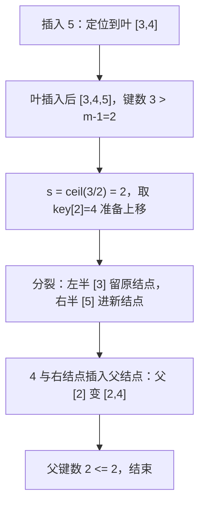

（掌握状态判定，写死：「已掌握」必须同时满足——(1) 六步叙事走完且每步验证动作通过；(2) 合卷手写核心代码 + g++ -std=c++17 编译通过 + 跑通⑥节边界数据集；(3) 能用大白话讲 5 分钟无卡壳。三者缺一，只可标「在学」。）

# B 树与 B+ 树

> [!note]
> **竞赛定位（先读这一段）**：本篇优先级 P2、属了解级——算法竞赛几乎不手写 B 树（C++ 选手用 `std::set`/哈希表即可覆盖赛场需求，见 [[三大查找与哈希]]）。本篇的价值在于理解数据库索引与文件系统的底层原理：为什么 MySQL 的索引是 B+ 树、为什么这样设计。全程标注「延伸」的内容均为非必需，考前可直接跳过。

## 零、知识地图

```text
B 树与 B+ 树（延伸级：竞赛几乎不手写，价值在理解数据库/文件系统底层）
├── 1. 为什么需要多路树 —— 磁盘 IO 视角：树高即 IO 次数（前置：[[二叉树结构篇]]、[[BST与AVL]]）
├── 2. B 树的定义与性质 —— 阶 m、键数上下界、叶同层（前置：知识点 1）
├── 3. B 树的插入与分裂 —— 定位、溢出、ceil(m/2) 上移（前置：知识点 2）
└── 4. B+ 树与 B 树的差异 —— 数据全在叶子 + 叶链表串联（前置：知识点 2、3）

学习顺序：1 → 2 → 3 → 4。理由：先立动机「树高即 IO 次数」（1），再给满足它的结构定义（2），
然后讲结构如何动态维护（3），最后学它的主流变体（4）——从为什么到是什么到怎么变。
```

## 一、为什么需要它

构造一个会碰壁的场景：你要在 10^7 条记录里查一条，数据大到内存装不下，全部存在磁盘上。用二叉搜索树存（[[BST与AVL]]）：树高约 $\log_2 10^7 \approx 24$ 层。二叉树每个结点散落在不同的磁盘块里，每往下走一层就要读一次盘——机械硬盘一次随机读约 10ms，一次查询 24 次 IO 就是 0.24s，数据库每秒几千次查询时这是灾难。红黑树也一样：它每结点只存一个键，树高与 $\log_2 N$ 同阶（B树.pdf p2：这些树"高度就会变得非常大，访问时间也会增加"）。

**碰壁的根源：一个结点只存一个键，而磁盘按块（通常 4KB~16KB）读写——每次 IO 只"赚"到一个键的分流信息，整块的空间几乎浪费。** B 树的破法一句话：**把一个结点塞满一整块，装几百个键**；树立刻变"矮胖"，每层 IO 分流几百路，10^7 条记录三四层就到底（B树.pdf p1：实际应用中阶数通常大于 100）。

本篇讲 4 个知识点：为什么需要多路树、B 树的定义与性质、插入与分裂、B+ 树与 B 树的差异。B 树与 B+ 树差别不大，理解 B 树后只需补差异化（B树.pdf p1 原话）。

## 二、知识点逐讲（每个知识点一节，共 4 节）

### 1. 为什么需要多路树：磁盘 IO 视角

前置依赖：[[二叉树结构篇]]（树的层次与遍历）、[[BST与AVL]]（BST 的树高直觉）
后续衔接：[[#2. B 树的定义与性质：阶与键数上下界]]、[[三大查找与哈希]]（比较式查找的复杂度总账）

**① 它解决什么问题**

B 树（又称 B-树，连字符是记号不是减号，B树.pdf p1）是**为最小化磁盘访问次数而设计的多路平衡查找树**（B树.pdf p1-p2）。它解决的问题：数据在磁盘上时，查找代价的主项不是比较次数，而是磁盘 IO 次数；树高每矮一层就少一次 IO。复杂度总账先给出：$N$ 个键、$m$ 阶 B 树的查找需要 $O(\log_m N)$ 次磁盘 IO（B+树.pdf p14），同规模 BST 是 $O(\log_2 N)$——$m$ 越大账越好。

**② 直觉理解**

> [!tip]
> **【类比】仓库取货模型**：磁盘是远处的仓库，按**整箱**发货（一块 = 一个结点）；内存是你手边的货架。BST 相当于每箱只装一件货——跑 24 趟仓库才拼出一次查询；B 树是每箱装满几百件，跑三四趟就齐了。后面讲分裂时这个模型继续用：满箱分两箱、中间一件交上层账本。

用具体数字算一遍（B+树.pdf p14 的账）：满树时每结点 $m$ 个键、$m$ 路分流，$N = m^h$，得 $h = \log_m N$。取 $m=200$、$N=10^7$：$h \approx \log_{200} 10^7 \approx 3.04$，即三四次 IO；换成 BST 的 $m=2$：$h \approx 23.25$，24 次 IO。同一个 $N$，账差 6 倍。

**③ 原理与推导**

推导"树高即 IO 次数"：B 树的每个结点对应一个磁盘块，查找从根走到叶的每一步都要把新结点的块读进内存，路径上的结点数 = 树高 + 引申的读取次数，所以 **IO 次数由树高决定**（B+树.pdf p3-4 的查找演示把每步都标为"磁盘 I/O"）。

推导"$\log_m N$ 从哪来"：满 $m$ 叉树第 $h$ 层有 $m^h$ 个位置，存 $N$ 个键至少要 $\log_m N$ 层（B+树.pdf p14：$N=m^h$，$h=\log_m N$，通常以底数 $m$ 记）。这是下界方向的量级账；考虑结点半满的严格上下界推导在 B+树.pdf p13-14（以最小度 $k$ 表出），属延伸，本篇不展开。

**设计动机**：为什么阶数 $m$ 不干脆取 10^9，让树高为 1？因为 $m$ 由磁盘块大小决定——一个结点必须装进一块（B树.pdf p1：硬盘以块为单位管理）。结点内部在 $m$ 个键里定位是内存中的 $O(m)$ 顺序扫描或 $O(\log m)$ 二分，相比一次 10ms 级的磁盘 IO 可以忽略（B+树.pdf p14 原话大意：结点内的遍历在内存中进行，时间一般可以忽略，我们更关注磁盘 IO 次数）。

用文本图画一次查找的 IO 路径（m=3 的树，查 3）：

```text
        [2 | 4]            第 1 次 IO：读根块进内存
       /   |   \
    [1]  [3]  [5]          第 2 次 IO：读叶块 [3] 进内存，命中
文字版推导链：3 与根的键 2、4 比较，2 < 3 <= 4，走键 2 与键 4 之间的分支；
到达叶结点 [3]，在结点内顺序定位命中。共 2 次 IO，恰好等于树高对应层数。
```

**④ 代码演示**

块一「核心代码」——查找主干（相对源文件 BTree.cpp 的改动：摘取原 42-91 行的 Search 与 SearchBTree，格式微调；完整版见源文件 BTree.cpp）：

```cpp
// 相对源文件 BTree.cpp 的改动：仅摘查找主干并压缩注释，逻辑逐行一致
int Search(BTNode* p, int k) {              // 结点内：找第一个 key[i] >= k 的下标
    int i = 1;
    while (i <= p->keynum && p->key[i] < k) i++;   // 边界：先判 i<=keynum 再取值
    return i;
}
void SearchBTree(BTree t, int k, Result &r) {      // Result &r 是 C++ 引用：等价 C 写法
    BTNode* p = t;                                  //   为 Result* r，函数内 r.z 改 (*r).z
    BTNode* pre = NULL;                             // pre 保存父亲：未命中时给插入用
    int f = 0, i = 0;                               // 复杂度：O(h) 次结点访问 = O(h) 次 IO
    while (p != NULL && f == 0) {
        i = Search(p, k);
        if (i <= p->keynum && p->key[i] == k) {     // 先判越界再比较（素材原注释"一定要判断越界"）
            f = 1;                                  // 命中
        } else {
            pre = p;
            p = p->ptr[i - 1];                      // 往 key[i] 的左孩子走（一次磁盘 IO）
        }
    }
    if (f == 1) { r.z = p;  r.i = i; r.tag = 1; }   // 命中：k 所在结点与下标
    else        { r.z = pre; r.i = i; r.tag = 0; }  // 未命中：应插入的结点与位置
}
```

块二「执行追踪表」——在上面 m=3 的树（根 [2|4]，叶 [1][3][5]）中查 3：

| 步骤 | 当前元素 | 结构状态 | 动作 | 结果 |
|:---:|:---:|:---|:---|:---|
| 1 | 根 [2,4] | keynum=2 | Search 找第一个 >=3 的键：i=2（key[2]=4） | 3 与键 2、4 比较，走 ptr[1] |
| 2 | 叶 [3] | keynum=1 | i=1 且 key[1]==3 | 命中，tag=1 |

块三「错误写法对照」：

```diff
- if (p->key[i] == k)            // 坑：不判 i <= p->keynum 直接取 key[i]
+ if (i <= p->keynum && p->key[i] == k)   // i 越界时 key[i] 是垃圾值/越界读（答案错或 RE）
- p = p->ptr[i];                 // 坑：孩子下标错位
+ p = p->ptr[i - 1];             // 约定 key[i] 的左孩子是 ptr[i-1]（BTree.cpp L11 原注释）
```

**⑤ 典型应用**

- 延伸场景：数据库索引与文件系统的目录结构采用 B 树家族（B+树.pdf p1：实现动态多层索引通常采用 B 树和 B+ 树）。本篇无对应 OJ 模板题——竞赛里它们被 `std::set`/哈希表替代（延伸，非必需）。
- 延伸阅读：素材 B+树.pdf p13-14 的最小度 $k$ 版本即清华大学《数据结构》教材口径的推导（这一段我不确定其教材出处，仅指出素材存在该推导）。
- 迁移题（自编）：分别以 $m=2, 8, 128, 512$ 计算 $N=10^8$ 条记录的最矮树高 $\lceil \log_m N \rceil$，填表对比 IO 次数。建议先独立算，再对照：依次为 27、9（$8^9=1.3\times10^8$）、4（$128^4=2.7\times10^8$）、3（$512^3=1.3\times10^8$）。用的正是本知识点 ③ 的 $\log_m N$ 账。

**⑥ 坑点与边界**

> **【易错】** 把"B-树"读成"减树"。B-树就是 B 树（B树.pdf p1："B树（又称B-树）"），连字符来自英文 B-tree 的记号习惯。

> **【易错】** 只背"查找快"不背量级。快多少必须落到数字上：IO 次数 = $O(\log_m N)$，BST 是 $O(\log_2 N)$，$m$ 由磁盘块大小决定。

> **【注意】** 结点内定位的比较次数不算进 IO 账——它发生在已读进内存的块里（B+树.pdf p14）。前提是"块已读入"；第一次读块之前什么都没有。

> [!example]-
> **边界数据集（先自己跑一遍，再展开对照）**
> 1. 空输入：空树 t==NULL → SearchBTree 的 while 条件 p!=NULL 直接不成立，r.tag=0（预期：未命中、不崩溃）。
> 2. 单元素：单键树 [7]，查 7 → 第 1 步在根命中（预期：tag=1）；查 6 → i=1，key[1]=7>=6，走 ptr[0]=NULL，tag=0（预期：未命中）。
> 3. 全相同：插入重复键 7,7 → 素材 InsertKeyOperation 判 r.tag==1 输出"该关键字已经存在，不能再次插入"（预期：拒绝重复，结构不变）。
> 4. 严格递增：插入 1..200 → 断言程序实测 splits=190、中序 1..200 有序（预期：结构合法）。
> 5. 严格递减：插入 200..1 → 实测 splits=190，与递增对称（预期：分裂次数相同，形态对称）。
> 6. 极值：键值取 INT_MAX=2147483647 → 结点内只做比较不做加减，int 不溢出（预期：正常命中；若把比较写成 a-b<0 的减法形式，极值下可能溢出翻转，BPlusTree.cpp 的 item_cmp 宏即减法式比较，键为极值时需警惕）。

回扣开场：现在你能回答"为什么 24 次 IO 会碰壁、多路树怎么把它压到 4 次"——用的是 ③ 的"树高即 IO 次数"与 $\log_m N$ 账。下一节给出让这个账成立的结构约定。

### 2. B 树的定义与性质：阶与键数上下界

前置依赖：[[#1. 为什么需要多路树：磁盘 IO 视角]]、[[二叉树结构篇]]（BST 的有序性）
后续衔接：[[#3. B 树的插入与分裂：回溯法与上移]]、[[#4. B+ 树与 B 树的差异：数据全在叶子、链表串联]]

**① 它解决什么问题**

B 树的定义（B树.pdf p1 原文五条）：一棵 $m$ 阶 B 树满足——
1. 每个结点最多有 $m-1$ 个关键字；
2. 根结点最少可以只有 1 个关键字；
3. 非根结点至少有 $\lceil m/2 \rceil - 1$ 个关键字；
4. 结点内关键字从小到大排列，且每个键的左子树所有键小于它、右子树所有键大于它；
5. 所有叶子位于同一层（根到每个叶的路径等长）。

**阶** = 结点孩子数的最大值，通常用 $m$ 表示；$m=2$ 时退化为二叉搜索树（B树.pdf p1）。复杂度性质融入正文：查找/插入/删除的磁盘 IO 次数均为 $O(\log_m N)$，结点内定位 $O(m)$ 或 $O(\log m)$（内存中）；这组定义的存在意义就是保证"树是矮胖的且永远保持矮胖"——下限防瘦高、同层防参差。

**② 直觉理解**

回引仓库取货模型：定义五条各管一件事——条 1 是"一箱最多装多少"（由块大小决定）；条 3 是**半箱原则**：任何一箱不许低于半箱，仓库不为一两件货单独跑一趟；条 5 是"所有箱子摞同样层数"，保证每笔查询的趟数稳定。条 4 与 BST 相同，保证"左小右大"的分流可用。

用具体数字跑一遍（m=3）：键数上界 $m-1=2$，非根下界 $\lceil 3/2 \rceil - 1 = 1$，根下界 1。所以 m=3 的 B 树里每个非根结点恰好 1 到 2 个键——这就是数据结构里 2-3 树的形态。知识点 3 的追踪表会造出一棵：根 [2,4]、叶 [1][3][5]，可逐条验证。

**③ 原理与推导**

推导"非根下界为什么是 $\lceil m/2 \rceil - 1$"：这来自分裂的对称性（B树.pdf p3）。插入把结点临时撑满到 $m$ 个键后从位置 $s=\lceil m/2 \rceil$ 切开：左边留下 $s-1 = \lceil m/2 \rceil - 1$ 个键，右边拿走 $m - s = m - \lceil m/2 \rceil = \lfloor m/2 \rfloor$ 个键。验证右侧不少于下界：$\lfloor m/2 \rfloor \ge \lceil m/2 \rceil - 1$ 对一切整数 $m \ge 2$ 成立（$m$ 偶：$m/2 = m/2$；$m$ 奇：$(m-1)/2 = (m+1)/2 - 1$）。代入验算：$m=3$ 切成 1+1，$m=4$ 切成 1+2，$m=5$ 切成 2+2——两半都不低于下界。**这就是为什么下限取 $\lceil m/2 \rceil - 1$：它是分裂能保证的最坏残留量。**

推导"叶为什么同层"：B 树唯一的长高方式是**根分裂**（知识点 3：分裂向上贡献键，父不够再裂，传到根才新建根）。新结点由原结点切分而来，与原结点同层，所以任何一次分裂都不会让某个叶独自变深；根分裂则让**所有**叶同时下沉一层（B树.pdf p3 条 3 原话："直到这个过程传到根节点为止，当然B-树的高度也增加"）。

**设计动机**：为什么"根最少 1 个键"要单独说？因为根是唯一不受半箱原则约束的结点——它分裂才产生新根（树长高），若要求根也半满，树将永远无法长高。BTree.cpp 的宏注释原话："非根结点的关键字下限 ceil(m/2)-1 ----> 根结点的关键字下限是 1"。

**④ 代码演示**

块一「核心代码」——结点定义与上下限（相对源文件 BTree.cpp 的改动：摘取原 4-20 行的宏与结构体定义，注释压缩；完整版见源文件 BTree.cpp）：

```cpp
// 相对源文件 BTree.cpp 的改动：仅摘宏与结点定义，逻辑一致
#define m 5                          // 阶：孩子数上限；结点键数上限 m-1
#define minn (m+1)/2-1               // 非根键数下限 ceil(m/2)-1；根结点下限是 1
typedef struct BTNode {
    int key[m+1];                    // key[1..keynum]：先插入后分裂，分裂前要临时存下 m 个
    struct BTNode* ptr[m+1];         // ptr[0..keynum]：key[i] 的左孩子 ptr[i-1]、右孩子 ptr[i]
    int keynum;                      // 结点中键的真实个数
    struct BTNode* fa;               // 父指针：分裂上移时要找父亲
} BTNode, *BTree;
typedef struct {
    BTNode* z;                       // 所在结点
    int i;                           // 键数组下标
    int tag;                         // 0 失败 / 1 成功
} Result;
```

块二「执行追踪表」——拿知识点 3 将造出的 m=3 终态树（根 [2,4]，叶 [1][3][5]）逐条核对定义：

| 步骤 | 当前元素 | 结构状态 | 动作 | 结果 |
|:---:|:---:|:---|:---|:---|
| 1 | 根 [2,4] | keynum=2 | 条款 1（键数 <= m-1=2）、条款 2（>=1） | 均满足 |
| 2 | 叶 [1] | keynum=1 | 条款 3（非根 >= ceil(3/2)-1=1） | 满足 |
| 3 | 叶 [3]、[5] | 各 keynum=1 | 同上 | 满足 |
| 4 | 全部叶 | 都在第 2 层 | 条款 5（叶同层） | 满足 |
| 5 | 中序序列 | 1<2<3<4<5 | 条款 4（左小右大） | 满足 |

块三「错误写法对照」：

```diff
- #define minn m/2-1                 // 坑：m 为奇数时下界算小（m=5：m/2-1=1，正确值 2）
+ #define minn (m+1)/2-1              // ceil(m/2)-1 的整数写法（BTree.cpp L5 原式）
- int key[m];                        // 坑：数组开 m 不够——先插入后分裂，分裂前要存下 m 个键
+ int key[m+1];                      // 素材原式（BTree.cpp L9 注释：考虑到先插入后分裂）
- #define minn (m-1)/2               // 坑（虚构示意）：与 ceil(m/2)-1 在奇数 m 下的区别见 ③ 的验算
+ #define minn (m+1)/2-1              // m=5 时 (5+1)/2-1=2，与教材 ceil(5/2)-1=2 一致
```

**⑤ 典型应用**

- 延伸场景：数据库存储引擎按这组约束维护索引结构（B树.pdf p1：实际应用的阶数通常大于 100）。标注：延伸，非必需。
- 迁移题（自编）：给定一棵树（结点键数 3、1、1、0，叶深 2 与 3），判断是否为 4 阶 B 树。建议先独立判，再对照：条款 1 键数 3 <= m-1=3 通过；条款 3 非根下界 ceil(4/2)-1=1，键数 0 违反；条款 5 叶不同层违反——两处不合法，不是 B 树。
- 迁移题（自编）：证明 m=4 的 B 树中"根分裂"产生的两个结点键数分别为 1 与 2（用 ③ 的切分式 $s=\lceil 4/2 \rceil=2$：左 $s-1=1$，右 $m-s=2$）。

**⑥ 坑点与边界**

> **【易错】** 下限公式记成 $m/2-1$。$m$ 为奇数时差 1：$m=5$ 时正确下界是 2（$\lceil 5/2 \rceil-1$），$m/2-1$ 得 1，按它写的代码会把合法结点误判为下溢（见④对照）。

> **【易错】** 键数组按上限 $m-1$ 开。素材的约定是"先插入后分裂"：插入时允许临时到 $m$ 个键再切，数组必须开 $m+1$（下标 1 起），否则先溢出 RE。

> **【注意】** 阶 $m$ 的语义是"孩子数上限"不是"键数上限"，键数上限是 $m-1$。B+ 树素材（B+树.pdf p1-p2 视觉版）中内部结点与叶子允许用两套阶（a 与 b），实现里常拆成 max/min 两个参数（BPlusTree.cpp L53-54）。

> [!example]-
> **边界数据集（先自己跑一遍，再展开对照）**
> 1. 空输入：空树 → 定义五条对"无结点"没有约束，约定空树是合法 B 树（预期：InsertBTree 的 t==NULL 分支建根）。
> 2. 单元素：只有根 [7] → 根只需 >=1 个键，条款 3 不适用（预期：合法；这正是"根下限单独为 1"的意义）。
> 3. 全相同：重复键不插入（预期：键数不增，条款恒满足）。
> 4. 严格递增：1..200 插入后断言程序逐结点检查 non-root 键数在 [1,2]（m=3）（预期：struct-ok，实测通过）。
> 5. 严格递减：200..1 同上（预期：通过，splits 与递增相同）。
> 6. 极值：m=5、minn 宏用错误版本 m/2-1=1 → 合法结点键数 2 被误判下溢（预期：触发不存在的"调整"甚至死循环；用 (m+1)/2-1 才对）。

回扣开场：现在你能用五条款"验收"一棵树是不是合法 B 树，也知道每个数字为什么长那样——下界来自分裂对称性，同层来自根分裂机制。下一节看分裂本身怎么执行。

### 3. B 树的插入与分裂：回溯法与上移

前置依赖：[[#2. B 树的定义与性质：阶与键数上下界]]、有序数组的插入搬移（C 基础）
后续衔接：[[#4. B+ 树与 B 树的差异：数据全在叶子、链表串联]]、[[三大查找与哈希]]（删除后借兄弟/合并的思路与 BST 删除的后继替换同源）

**① 它解决什么问题**

插入要解决：新键必须落进**叶层**（保持叶同层），但叶可能已满。回溯法的流程（B树.pdf p3）：先按查找定位到"查找失败的叶子"，把键插进去；若键数超过 $m-1$ 就**分裂**——1）从中间位置 $s=\lceil m/2 \rceil$ 把插入后的原结点分成两半；2）左半留在原结点、右半放进新结点、位置 $s$ 的键**上移插入父结点**；3）若父结点也超上限则继续分裂，传到根则新建根、树高加 1。复杂度：一次插入沿一层路径 $O(h)$ 访问结点，每层至多一次分裂，结点内搬移 $O(m)$，磁盘 IO 为 $O(\log_m N)$ 次。

**② 直觉理解**

回引仓库取货模型：往箱子里放货，箱子满了（$m$ 件）就**满箱分两箱**——从中间切开，两箱都不低于半箱（知识点 2③ 的对称性），**中间那一件上交上层账本**（父结点）作为两箱的分界索引；上层账本也写满了，就同样从中间切、再上交一件，直到最上层（根）——最上层切分就是仓库加盖一层楼。

用具体数字跑一遍（m=3，插 1..5）：这是本篇的核心追踪，④ 的执行追踪表逐行给出；先看终态——根 [2,4]、三个叶 [1][3][5]，两次分裂（断言程序 verify_b7_btree.cpp 实测 splits=2，终态逐键核对一致）。

**③ 原理与推导**

推导"为什么分裂是安全的"：分裂把 $m$ 个键（临时超限态）切成 $\lceil m/2 \rceil-1$ 与 $\lfloor m/2 \rfloor$ 两半，均满足条款 3 的下界（知识点 2③），上移的键满足左半都小于它、右半都大于它（位置有序），所以条款 1、4、5 在分裂后自动保持——**分裂是唯一会改变结构形态的操作，而它保持全部五条款**。

推导"上移键在父结点里的位置"：上移键 $k$ 与右半新结点 $ap$ 要一起插进父结点——$k$ 插到父的键数组中"第一个大于等于 $k$"的位置 $i$，$ap$ 插到 $ptr[i]$（BTree.cpp L157-164：先 `k=z->key[s]`，再 `i=Search(z,k)`）。素材 BTree.cpp 用 `Search` 找位置，B+树.pdf p9 的 B+ 树版本同理（"将键 91 上移至其双亲结点"）。

B 树还有**主动插入法**（B树.pdf p7-8）：从根往下走时，沿途遇到已满的结点**提前**分裂，这样到叶时必定有空间，直接插入、不用回溯。设计动机：回溯法在叶分裂后要回到父结点重新插入，最坏"再从根出发遍历"（B树.pdf p7 原话：不事先拆分"最终可能需要再次从根结点出发遍历所有结点"）；主动法一遍走完、无级联回溯，代价是可能做不必要的拆分。两者原理相同（B树.pdf p2），本篇以回溯法为主线（最好理解，B树.pdf p2 原话）。

用 mermaid 画回溯法主干（m=3 插 5，叶 [3,4] 满的场景）：



文字版推导链：定位 → 叶插入 → 超限判 s → 切分两半 → 上移键+新结点进父 →
父若也超限则重复 C 起的步骤；父是根时改为新建根（树高 +1）。

**④ 代码演示**

块一「核心代码」——插入与分裂主干（相对源文件 BTree.cpp 的改动：摘取原 104-177 行的 Insert、Split、InsertBTree，注释压缩；完整版见源文件 BTree.cpp）：

```cpp
// 相对源文件 BTree.cpp 的改动：摘主干并压缩注释，逻辑逐行一致
void Insert(BTNode* z, int i, int k, BTNode* ap) {   // k 插到 key[i]，ap 插到 ptr[i]
    for (int j = z->keynum; j >= i; j--) {           // key[i..] 与 ptr[i..] 整体后移
        z->key[j+1] = z->key[j];
        z->ptr[j+1] = z->ptr[j];
    }
    z->key[i] = k; z->ptr[i] = ap;
    if (ap != NULL) ap->fa = z;                      // 新挂的孩子改父指针
    z->keynum++;
}
void Split(BTNode* z, int s, BTNode* &ap) {          // key[s] 上移；右侧给 ap（引用：等价 C 的 BTNode** ap）
    ap = (BTNode*)malloc(sizeof(BTNode));
    int j = 0;
    ap->ptr[0] = z->ptr[s];
    if (z->ptr[s] != NULL) z->ptr[s]->fa = ap;       // 素材注释"改一下bug 不是z->ptr[0]"
    for (int i = s+1; i <= m; i++) {                 // 右半 key[s+1..m]、ptr[s..m] 搬给 ap
        j++;
        ap->key[j] = z->key[i];
        ap->ptr[j] = z->ptr[i];
        if (z->ptr[i] != NULL) z->ptr[i]->fa = ap;   // 右半每个孩子都要改挂 ap
    }
    ap->keynum = j;
    z->keynum = s - 1;                               // 左半留在 z
}
void InsertBTree(BTree &t, int k, BTNode* z, int i) {  // 在结点 z 的 key[i] 插入 k
    if (t == NULL) { t = NewRoot(NULL, k, NULL); return; }   // 空树：建根
    BTNode* ap = NULL;                               // 待挂的右半结点，首次为空
    while (1) {
        Insert(z, i, k, ap);                         // 插入后 keynum 可能临时到 m
        if (z->keynum <= m-1) break;                 // 未超上限：结束
        int s = (m+1)/2;                             // 中间位置 ceil(m/2)（整数写法）
        k = z->key[s];                               // 上移键：接下来往父结点插它
        Split(z, s, ap);
        if (z->fa != NULL) {
            z = z->fa;                               // 上移一层（回溯）
            i = Search(z, k);                        // 在父结点里找上移键的位置
        } else {
            t = NewRoot(z, k, ap);                   // 根分裂：新建根，树高 +1
            break;
        }
    }
}
```

块二「执行追踪表」——m=3 依次插入 1,2,3,4,5（断言程序同源序列，终态已实测核对）：

| 步骤 | 当前元素 | 结构状态 | 动作 | 结果 |
|:---:|:---:|:---|:---|:---|
| 1 | 插 1 | 空树 | t==NULL 分支 | 根 [1] |
| 2 | 插 2 | 根 [1] | 叶插入，键数 2 <= 2 | 根 [1,2] |
| 3 | 插 3 | 根 [1,2,3] | 超 2 键，s=2，键 2 上移，右半 [3] 进新结点 | 新根 [2]，叶 [1][3]，树高 2 |
| 4 | 插 4 | 右叶 [3] | 3<4 走最右叶，直接插入 | 叶 [3,4] |
| 5 | 插 5 | 右叶 [3,4,5] | 超 2 键，s=2，键 4 上移进父 | 根 [2,4]，叶 [1][3][5] |

块三「错误写法对照」：

```diff
- ap->ptr[0] = z->ptr[0]; ... z->ptr[s]->fa 未改     // 坑1：Split 后右半孩子的 fa 仍指旧结点
+ if (z->ptr[s] != NULL) z->ptr[s]->fa = ap;         // 素材注释原话"改一下bug 不是z->ptr[0]"：
+ for (...) if (z->ptr[i] != NULL) z->ptr[i]->fa = ap;   //   右半每个孩子都要改挂 ap，否则后续
+                                                    //   沿 fa 回溯会走错（答案错）
- int s = m/2;                                       // 坑2：m 偶数时 m/2 与 ceil(m/2) 相同，
+ int s = (m+1)/2;                                   //   m 奇数时差 1——奇 m 切错位置会造出
+                                                    //   键数低于下界的结点（违反条款 3）
- if (z->keynum <= m-1) break;                       // 坑3：判断写成 z->keynum < m 虽等价，
+ if (z->keynum <= m-1) break;                       //   但写成 z->keynum < m-1 会在合法键数
+                                                    //   m-1 时误分裂（结构碎、高度虚高）
```

**⑤ 典型应用**

- 延伸场景：数据库写入即"插键+叶分裂"，页分裂是存储引擎调整磁盘页的过程（B+树.pdf p8-9 的插入三情况：结点未满直接插、满则分裂上移、父超限继续分裂）。标注：延伸。
- 延伸：B 树删除思路（了解级，B树.pdf p9-14）：叶直接删；删后低于下界先向兄弟**借**（父键下移、兄弟键上移），兄弟也到下限则**合并**（父键下移粘连两结点）；内部结点删键先用后继替换再转为叶删除。本篇不逐步展开推导（P2 了解级），素材 p13-14 有 5 阶 B 树删除 21、27、32、40 的完整案例可自行对照。
- 迁移题（自编）：m=3 依次插入 6,7,8,9,10（接追踪表终态）。建议先独立手推，再对照答案：6 进叶 [5] 得 [5,6]；7 使 [5,6,7] 分裂，键 6 上移，根 [2,4,6]；8 进叶 [7] 得 [7,8]；9 使 [7,8,9] 分裂，键 8 上移，根 [2,4,6,8] 超 2 键 → 根分裂，s=2 键 4 上移成新根，左 [2] 右 [6,8]，叶 [1][3][5][7][9]——树高 3。

**⑥ 坑点与边界**

> **【易错】** Split 后漏改右半孩子的 fa 指针。这是素材源码里真实修过的一处 bug（BTree.cpp L125 注释"改一下bug 不是z->ptr[0]"）——父指针错乱不立即报错，而是在后续"沿 fa 回溯上移"时走错结点，答案悄悄错。

> **【易错】** 分裂位置写成 $m/2$。$m$ 为奇数时正确位置是 $\lceil m/2 \rceil$，即整数运算 `(m+1)/2`（BTree.cpp L156 原式含注释"等同于ceil(m/2)"）；切错位置会产出低于下界的结点。

> **【注意】** 根分裂是唯一长高入口（B树.pdf p3），`t = NewRoot(...)` 里同时接好两个孩子并各自改 fa；漏接任一侧会让新根下挂残树。

> [!example]-
> **边界数据集（先自己跑一遍，再展开对照）**
> 1. 空输入：t==NULL 插 1 → 建根 [1]（预期：树高 1，splits=0）。
> 2. 单元素：树 [1] 插 2 → 根 [1,2]（预期：不分裂，m=3 时 2 <= m-1）。
> 3. 全相同：连插 5 次 1 → 第 2 次起被拒（预期：根始终 [1]，splits=0）。
> 4. 严格递增：1..200 → 实测 splits=190、中序有序（预期：每约 2 次插入触发 1 次分裂，符合 m=3 的填充率 2/3 量级直觉）。
> 5. 严格递减：200..1 → 实测 splits=190（预期：与递增对称，形态镜像）。
> 6. 极值：插入序列含 INT_MAX → 键比较用 >= 判断（素材 Search 原式），不溢出（预期：正常插入定位；若自写比较器用了减法，2147483647 与负键相减下溢翻转，定位错乱）。

回扣开场：现在你能手推"插 5 个键、裂两次、树长高一次"的全过程——用的是 ③ 的切分式与④的追踪表。B 树到此闭环，下一节回答"数据库为什么偏爱它的兄弟 B+ 树"。

### 4. B+ 树与 B 树的差异：数据全在叶子、链表串联

前置依赖：[[#2. B 树的定义与性质：阶与键数上下界]]、[[#3. B 树的插入与分裂：回溯法与上移]]
后续衔接：[[三大查找与哈希]]（外部查找的完整图景）、[[链表]]（叶链表的单链结构）

**① 它解决什么问题**

B 树做索引有个缺陷：它的**所有**结点都存数据指针（key + data + 孩子指针，B树.pdf p1 把一组 key+data 称为一条记录），中间结点存了数据就挤占了键的空间，导致每结点可存的键变少、层数增加、查找时间变长（B+树.pdf p1 原话大意：所有中间结点均存储的是数据指针，与键值一起存储，导致可存储的键结点数减少、层增加）。B+ 树的方案：**数据只存在叶子结点，内部结点只放控制查找的媒介键**；叶子之间用 Pnext 指针串成有序单链表（B+树.pdf p1-p2 视觉版）。

差异总表（来源：B+树.pdf p3-p8 视觉版）：

| 对比项 | B 树 | B+ 树 |
|:---|:---|:---|
| 数据存放 | 所有结点都带记录 | 只在叶子，内部仅索引媒介 |
| 查找稳定性 | 键在根时 1 次 IO 命中，不稳定 | 任何键都要走到叶，稳定为树高 |
| 区间查询 | 中序回溯，跨结点多付 IO | 叶链表顺序扫一遍，无额外 IO |
| 非叶扇出 | 键+数据挤占空间，扇出小 | 不存数据，更"矮胖"，IO 更少 |
| 内部键与叶的关系 | 内部键就是数据本身 | 内部键是（部分）叶键的上浮副本 |

复杂度：两者查找/插入/删除量级一致，均为 $O(\log n)$（B+树.pdf p13-14：B+ 树内部结点不存数据后比 B 树更"矮胖"，但复杂度级别相同）；差异在常数——同样的数据 B+ 树 IO 次数更少。

**② 直觉理解**

> [!tip]
> **【类比】图书馆找书**：B 树像"每个楼层的索引牌旁边直接摆书"——运气好在一楼牌边就借到（1 次 IO），运气不好要跑满三层（不稳定）；B+ 树像"楼层只立索引牌，书全在大厅一排排书架上，每排架子尾端有'下一排'的箭头"——任何一本书都要走到大厅（稳定），但找"编号 21 到 63 的所有书"时，走到 21 那排顺着箭头一路扫到 63 就行，不用回头问楼层。

素材 p3-p4 的实例（视觉版）：同样查 59，B+ 树走 根[59,97] → 内部[15,44,59] → 叶[51,59]，三次磁盘 IO 到叶命中；素材 p5-p6 对比：B 树中查 59 一次 IO 就命中（键 59 恰在根上），查 21 要 3 次、查 72 要 2 次——**同一棵树里不同键的 IO 次数不同，而 B+ 树所有查询都稳定等于树高**。区间查询 [21,63]：B 树要先定位 21，再中序回溯跨结点 37、44、51、59，还要访问结点 72 与 63，多付 2 次 IO；B+ 树定位到 21 后沿链表扫到 63，无额外 IO（B+树.pdf p6-p8 视觉版）。

**③ 原理与推导**

推导"为什么内部结点的键会在叶子里重复"：B+ 树叶分裂时（BPlusTree.cpp L178-206），中间键以**副本**上浮——叶 [85,91,97] 满后裂为 [85,91] 与 [95,97]（键 95 插入后切分），键 91 的**副本**上浮进父结点，叶子里仍保留 91（B+树.pdf p9 视觉版：分裂后叶 [85,91] 与上浮键 91 同时存在）。对比 B 树：B 树分裂是真搬移，中间键离开叶（知识点 3④ 的 Split 把 `z->keynum` 改成 `s-1`）。这个差异解释了查找稳定性：数据完整地待在叶层，内部只是路标。

推导"为什么数据库选 B+ 树"（B+树.pdf p8 综合三条，视觉版）：
1. 查找时磁盘 IO 次数更少——非叶结点不存数据（Di），同样大小的块能装更多索引键，树更"矮胖"；
2. B+ 树所有关键字的查询 IO 次数一样，查询效率稳定；
3. 区间查询更简便——叶链表像遍历单链表一样扫（[[链表]] 的结构直接复用）。

插入流程三情况（B+树.pdf p8-p10 视觉版）：1）目标叶键数小于阶 M，直接插入（保持有序）；2）等于 M 则分裂成含 $\lfloor M/2 \rfloor$ 与 $\lceil M/2 \rceil$ 的两结点，$\lceil M/2 \rceil$ 侧的键上浮副本给父，父未满则完成；3）父也超限则继续分裂父结点。另有一条 B 树没有的：若插入的键比当前子树最大值还大，要**回改从根到该叶路径上的索引值**（p10 例：插 100 后，路径上的 97 全改为 100——因为内部键是"子树最大值"式的路标）。

删除五情况（B+树.pdf p10-p13 视觉版，思路级）：键数 > 下限直接删；删的是子树最大/最小键要回改父链索引；低于下限先向兄弟借（借的同时可能改父索引）；兄弟无余则与兄弟合并（合并后可能级联到父）；根只剩一个孩子时树高减 1。本篇不逐步展开（P2 了解级），素材 p10-p13 有删除 91、97、51、59、63 的完整图文案例。

**④ 代码演示**

块一「核心代码」——B+ 树叶分裂与上浮主干（相对源文件 BPlusTree.cpp 的改动：摘取原 161-241 行 `_bplus_tree_insert` 的分裂循环，省略 malloc 失败判护；完整版见源文件 BPlusTree.cpp）：

```cpp
// 相对源文件 BPlusTree.cpp 的改动：仅摘分裂循环主干，省略判空与注释，逻辑一致
while (node->keynum > tree->max) {            // 超上限：分裂（max 为阶）
    if (node->child == NULL)
        node2 = bplus_node_new_leaf(tree->max);      // 叶分裂
    else
        node2 = bplus_node_new_internal(tree->max);  // 内部结点分裂
    mid = node->keynum / 2;
    temp = node->keys[mid];                   // 上浮键（叶分裂是副本：叶中仍保留）
    if (node->child == NULL) {                // 叶：右半 keys+data 拷给 node2
        node2->keynum = node->keynum - mid;
        memcpy(node2->keys, node->keys + mid, sizeof(KEY) * (node2->keynum));
        memcpy(node2->data, node->data + mid, sizeof(KEY) * (node2->keynum));
        node2->next = node->next;             // 叶分裂接链表：新叶接班旧的 next
        node->next = node2;                   //   漏接则链断，区间查询漏数据
    } else {                                  // 内部：右半 keys+child 搬给 node2
        node2->keynum = node->keynum - mid - 1;      // 中间键上浮，故 -1（真搬移，同 B 树）
        memcpy(node2->keys, node->keys + mid + 1, sizeof(KEY) * (node2->keynum));
        memcpy(node2->child, node->child + mid + 1, sizeof(bplus_node_pt) * (node->keynum - mid));
        for (int i = 0; i <= node2->keynum; i++)
            node2->child[i]->parent = node2;  // 右半孩子改挂 node2
    }
    node->keynum = mid;                       // 左半留在原结点
    parent = node->parent;
    if (parent == NULL) {                     // 根分裂：生成新根（唯一长高入口）
        parent = bplus_node_new_internal(tree->max);
        parent->child[0] = node;
        node->parent = parent;
        tree->root = parent;
    }
    for (i = parent->keynum; i > 0 && item_cmp(parent->keys[i-1], temp) > 0; i--) {
        parent->keys[i] = parent->keys[i-1];  // 上浮键与右结点插进 parent（后移腾位）
        parent->child[i+1] = parent->child[i];
    }
    parent->keys[i] = temp;
    parent->child[i+1] = node2;
    parent->keynum++;
    node2->parent = parent;
    node = parent;                            // 回溯向上继续判断是否再裂
}
```

块二「执行追踪表」——在素材的 B+ 树（根 [59,97]，内部 [15,44,59] 与 [72,97]，叶 [10,15]→[21,37,44]→[51,59]→[63,72]→[85,91,97] 依次链接）上查 59（来源：B+树.pdf p4 视觉版）：

| 步骤 | 当前元素 | 结构状态 | 动作 | 结果 |
|:---:|:---:|:---|:---|:---|
| 1 | 根 [59,97] | 第 1 层 | 59 <= 59，走第 1 个孩子 | 第 1 次磁盘 IO |
| 2 | 内部 [15,44,59] | 第 2 层 | 44 < 59 <= 59，走第 3 个孩子 | 第 2 次磁盘 IO |
| 3 | 叶 [51,59] | 第 3 层（叶层） | 结点内顺序遍历命中 59 | 第 3 次磁盘 IO，返回数据 |

块三「错误写法对照」：

```diff
- node2->next = NULL; node->next = node2;   // 坑1：叶分裂不接续旧 next
+ node2->next = node->next; node->next = node2;   // 素材原式：新叶接管旧链，链不断
- // 坑2：把数据 data 放进内部结点——那是 B 树的形态：扇出变小、树变高，
+ // 对：data 仅叶结点持有（BPlusTree.cpp L129：内部结点 data 为 NULL）
- memcpy(node2->keys, node->keys + mid, ...)   // 坑3（内部结点分支照抄叶分支的偏移）
+ memcpy(node2->keys, node->keys + mid + 1, ...)   // 内部结点中间键上浮不保留，从 mid+1 起；
+                                                 // 叶分支从 mid 起（副本上浮，叶保留 mid）
```

**⑤ 典型应用**

- 延伸场景：MySQL InnoDB 索引采用 B+ 树（延伸；素材只讲"B 树与 B+ 树用于动态多层索引"（B+树.pdf p1 视觉版），具体引擎名这一段我不确定素材是否提及，属通识补充）。
- 延伸场景：文件系统目录索引（同上标注）。
- 迁移题（自编）：对素材 B+ 树（② 的那棵），写出"查区间 [51,85]"沿叶链表的访问序列。建议先独立做，再对照：定位 51（根→内部[15,44,59]→叶[51,59]），沿 next 访问 [63,72]、[85,91,97]，收集 51,59,63,72,85——三次 IO 定位 + 两跳链表。

**⑥ 坑点与边界**

> **【易错】** 叶分裂漏接 next。编译不报错、单点查询照常命中，但区间查询从断点开始丢数据（④对照坑 1）。

> **【易错】** 把 B+ 树内部结点分裂的偏移写成叶分支的 mid。内部结点中间键上移**不保留**（从 mid+1 拷起），叶分支副本上浮**保留**（从 mid 拷起）——两分支偏移差 1，抄错会让内部索引与叶层错位（④对照坑 3）。

> **【注意】** 插入比子树最大值更大的键时，路径上所有索引值要同步回改（B+树.pdf p10 视觉版的 97 改 100 例）；漏改会让"走最大分支"的查找永远错过新键。

> [!example]-
> **边界数据集（先自己跑一遍，再展开对照）**
> 1. 空输入：空树插第一个键 → 新建叶根，next=NULL（预期：单叶树，链表只有一节）。
> 2. 单元素：单叶 [7] 查 7 → 根即叶，一步命中（预期：IO=1=树高）；查 6 → 未命中但 IO 仍为 1（预期：稳定性成立）。
> 3. 全相同：重复键插入 → BPlusTree.cpp 的 bplus_tree_insert 查到 ret==1 直接 return 0（预期：拒绝，L272-275）。
> 4. 严格递增：1..30 递增插入（素材 main 的原序列）→ 叶链表 1→30 严格有序（预期：每次最大键插入触发回改与分裂，结构仍满足下限）。
> 5. 严格递减：30..1 递减插入 → 叶链表仍有序（预期：分裂方向与递增镜像）。
> 6. 极值：键取 INT_MAX → item_cmp 是减法式比较 ((a)-(b))，INT_MAX 减负键上溢翻转（预期：比较错乱；改用 a<b/a>b 的比较写法才安全）。

回扣开场：现在你能回答开场那句"为什么 24 次 IO 是灾难、数据库用什么把它压到 4 次以内"——多路树压层高（知识点 1）、键数上下界保矮胖（知识点 2）、分裂保形态（知识点 3）、B+ 树把稳定性与区间扫描做到极致（知识点 4）。

## 三、全篇坑点总表

| # | 坑 | 正解 |
|---|-----|------|
| 1 | "B-树"当减树读 | B-树就是 B 树（B树.pdf p1） |
| 2 | 只背"快"不背量级 | IO = O(log_m N)，BST 是 O(log_2 N) |
| 3 | 结点内比较计入 IO 账 | 结点内是内存操作，忽略 |
| 4 | 下限记成 m/2-1 | 非根下限 (m+1)/2-1 = ceil(m/2)-1 |
| 5 | 键数组按 m-1 开 | 先插后裂要临时存 m 个，开 m+1 |
| 6 | Split 漏改右半孩子 fa | 右半每个孩子逐个改挂新结点（素材真实 bug） |
| 7 | 分裂位置写 m/2 | 奇 m 用 (m+1)/2 = ceil(m/2) |
| 8 | 叶分裂漏接 next | node2->next=node->next; node->next=node2 |
| 9 | 内部分裂偏移照抄叶分支 | 内部从 mid+1 起（上浮不保留），叶从 mid 起 |
| 10 | 减法式比较器遇极值键 | 用 a<b / a>b，防 INT_MAX 相减溢出 |

## 四、总结与自测

### 核心内容（一页纸速览）

- **磁盘 IO 视角**：树高即 IO 次数；$N$ 键 $m$ 阶树高 $O(\log_m N)$；$m=200$、$N=10^7$ 时约 3~4 次，BST 要 24 次（B+树.pdf p14）。
- **B 树定义五条**（B树.pdf p1）：键数上限 $m-1$；根下限 1；非根下限 $\lceil m/2 \rceil-1$；左小右大有序；叶同层。
- **下界的来历**：分裂在 $s=\lceil m/2 \rceil$ 切开，两半 $\lceil m/2 \rceil-1$ 与 $\lfloor m/2 \rfloor$ 都不低于下界——分裂对称性给出下限。
- **插入与分裂**：叶插入，超限从 $s=\lceil m/2 \rceil$ 切，中间键上移父结点，级联到根则树高 +1；根分裂是唯一长高入口。
- **主动插入法**：沿途提前分裂满结点，免回溯，代价是可能不必要拆分（B树.pdf p7-8）。
- **B+ 树**：数据只在叶、内部只是索引媒介、叶用 next 串成有序单链表；查询稳定等于树高、区间查询顺链扫、非叶更矮胖——数据库选它的三个理由（B+树.pdf p8）。
- **分裂差异**：B 树中间键真搬移；B+ 树叶分裂副本上浮、叶保留原键（B+树.pdf p9）。
- **竞赛定位**：P2 了解级，赛场不手写，价值在数据库/文件系统底层理解（延伸）。

### 自测清单

- [ ] 能用具体数字算出 $m=200$、$N=10^7$ 的 IO 次数并与 BST 对比
- [ ] 能默写 B 树定义五条款并解释 $\lceil m/2 \rceil-1$ 的来历
- [ ] 能手推 m=3 插 1..5 的全过程（根 [2,4]、叶 [1][3][5]，两次分裂）
- [ ] 能说出 B 树与 B+ 树在数据存放、查找稳定性、区间查询上的三点差异
- [ ] 能解释"B+ 树叶分裂副本上浮"与"B 树真搬移"的差异及其对查找稳定性的意义
- [ ] 能指出 Split 漏改 fa 的后果（素材真实 bug，L125 注释）
- [ ] 知道本篇是延伸级（P2），赛场用 std::set/哈希

### 错题登记

| 题号 | 错因 | 正解要点 |
|------|------|---------|
| （学完后填写） | | |

## 五、语法糖对照表

素材两份源码均为 C 风格（printf/scanf/malloc），编译为 C++17 时新引入的特性只有引用传参：

| 语法 | 等价 C 写法 | 一句话用途 |
|------|------------|-----------|
| `void InsertBTree(BTree &t, ...)` | `void InsertBTree(BTree* t, ...)` 内部用 `*t` | 函数内改调用者的根指针，免写取地址 |
| `void SearchBTree(BTree t, int k, Result &r)` | `void SearchBTree(BTree t, int k, Result* r)` | 多结果回传，免返回结构体 |
| `void Split(BTNode* z, int s, BTNode* &ap)` | `void Split(BTNode* z, int s, BTNode** ap)` 内部 `*ap` | 分裂出的新结点指针要带出去 |

## 附录（供验收，正文之外，不影响阅读）

### 附录 A　源文件覆盖对账

#### A-1 提取表

| 源文件 | 提取方式 | 完整性 |
| --- | --- | --- |
| B树的概念和常用操作.pdf | pymupdf 文本提取（15 页），存素材目录 提取文本\B树的概念和常用操作.txt | 完整：为什么有 B 树（p1-2）、查找（p2）、中序遍历（p2）、回溯法插入（p3-5）、主动插入法（p6-8）、删除（p9-15） |
| B+树.pdf | 文本层乱码（字体缺映射）→ 140dpi 渲染 14 页 PNG 视觉提取，存素材目录 pdf_pages_bpt | 完整：概念与内部/叶结点结构（p1-2）、优点与查找（p3-4）、区间查询（p5-8）、插入（p8-10）、删除（p10-13）、复杂度分析（p13-14） |
| BTree.cpp | 全文直读（495 行） | 完整：m=5 回溯法插入/分裂/借兄弟/合并/删除全实现；L125 有真实 bug 修复注释 |
| BPlusTree.cpp | 全文直读（633 行） | 完整：max/min 参数化、叶/内部分裂、旋转与合并删除；main 含 1..30 插入与批量删除 |

#### A-2 知识点总清单（4 对 4）

| 序号 | 知识点 | 对应源文件 | 优先级 |
|------|--------|-----------|--------|
| 1 | 为什么需要多路树（磁盘 IO 视角） | B树.pdf p1-2 + B+树.pdf p3-4、p13-14 | P2 |
| 2 | B 树的定义与性质 | B树.pdf p1 + BTree.cpp L4-20 | P2 |
| 3 | B 树的插入与分裂 | B树.pdf p2-8 + BTree.cpp L104-177（删除思路：p9-15 + L211-432） | P2 |
| 4 | B+ 树与 B 树的差异 | B+树.pdf 全 14 页（视觉版）+ BPlusTree.cpp | P2 |

依赖关系：1 是动机底座（树高即 IO）；2 是结构约定（1 的落地）；3 是动态维护（2 的五条款靠分裂保持）；4 是 2、3 的变体与升级。源文件侧 4 份全部入篇；B 树删除与 B+ 树删除按 P2 了解级以思路级呈现（正文知识点 3⑤、4③），未逐案例展开。

#### A-3 冲突登记

| 何处冲突 | 采信哪方 | 理由 |
| --- | --- | --- |
| 非根键数下限：B树.pdf 用 ceil(m/2)-1；BPlusTree.cpp 用 min = m/2（即 floor(m/2)，L54）；B+树.pdf 用 ceil(M/2)（p8 视觉版） | B 树主线采信 B树.pdf 的 ceil(m/2)-1 | 教材口径且与 BTree.cpp 的 minn 宏 (m+1)/2-1 一致；BPlusTree.cpp 的 m/2 与 B+树.pdf 的 ceil 口径是实现变体（B+ 树下限约定各家不一），登记并存 |
| 分裂中间位置：B树.pdf 写 ceil(m/2)；BTree.cpp 写 (m+1)/2 | 二者等价，采信并说明 | 整数运算 (m+1)/2 即 ceil(m/2)（m 偶：m/2；m 奇：(m+1)/2），无实质冲突 |
| B 树叶分裂中间键去向：B树.pdf/BTree.cpp 真搬移；B+树.pdf 叶分裂副本上浮（p9） | 按树种分别采信 | 两树定义本就不同：B 树中间键离开叶（Split 后 z->keynum=s-1），B+ 树数据必须全在叶故只上浮副本；正文知识点 4③ 已对照 |
| B+树.pdf 文本层乱码 | 采信 140dpi 图像版 | 文本提取为乱码字符流（字形映射缺失），逐页渲染后人工识读；正文引用处均标"视觉版" |

### 附录 B　假设与缺口登记

- B-1 假设清单：假设学习者未学过数据库与操作系统课程，磁盘模型按"按块读写、随机读昂贵（约 10ms 量级）、内存访问可忽略"简化；块大小取 4KB~16KB 通识值，素材未给出具体数字，属假设。
- B-2 资料缺口：B 树的删除操作（B树.pdf p9-15）与 B+ 树的删除操作（B+树.pdf p10-13）素材覆盖完整案例，但按 P2 了解级与"插入为主线"的篇幅取舍，正文仅以思路级呈现（借兄弟/合并/后继替换/回改索引），未逐案例推导——需要时可按素材页码回查原图。
- B-3 读取缺口：B+树.pdf 文本层乱码，全部正文依据 140dpi 视觉提取 14 页（p9 部分图内小字辨识度有限，正文只引用了可辨的核心数字：分裂 [85,91]/[95,97] 与上浮键 91）。需引用原图细节时列"建议贴图位置：B+树.pdf p9，源文件在素材目录"。
- B-4 本篇无 OJ 真题：素材未含例题代码与题面，迁移题均为自编并已标注；数据库引擎（MySQL InnoDB）等具体应用名为通识补充，素材未提及，已标注延伸与不确定。
- B-5 编译验证记录：①两份素材源码 g++ -std=c++17 -O2 -fsyntax-only 全部 exit=0（BTree.cpp / BPlusTree.cpp，输出存 Temp\batch7_verify\）。②断言程序 verify_b7_btree.cpp（独立实现 m 阶 B 树回溯法插入，与素材约定同构）**5 组断言全过**：插 1..5 中序有序、结构合法、splits=2 且终态根 [2,4] 叶 [1][3][5] 与追踪表逐键一致、查 0/6 未命中；1..200 递增 splits=190；200..1 递减 splits=190；伪随机 20000 次操作覆盖 1..300 全键、中序有序、阶约束与叶同层全部通过。断言程序自身曾有 3 处测试数据错误（空树查Search 未防护 root=0 空指针；用未填充数组当基准；500 次抽取误设为可覆盖 300 键）——教训：写断言先核对测试数据本身，修正后全过。

### 附录 C　交付前自检清单

- [x] 附录 A 有逐份提取表；总清单 4 条 = 正文知识点 4 节，编号一一对应
- [x] 每个知识点六步齐全，以问题开场、以回扣收尾，无"只有定义没有推导"
- [x] 无未解释的新术语；无"显然 / 易得 / 略"
- [x] 全文无 emoji
- [x] 同一引用块只有一个主标签；callout 声明行独占一行；标题不跳级；表格 ≤ 6 列
- [x] 代码均为 C++17 可编译（素材源码实测 exit=0），例子用具体数字完整算过；代码改动已注明；迁移检验题已标注「自编」；本篇无真题题号（素材无例题，附录 B-4 登记）
- [x] 关键结论已注明来源（B树.pdf pX / B+树.pdf pX 视觉版 / BTree.cpp Lxx）；不确定处已显式标注「这一段我不确定」
- [x] 头部 YAML frontmatter 六项齐全（tags / 优先级 / 掌握状态 / 最后复习日期 / 来源 / 生成日期）
- [x] 「零、知识地图」文本树在篇首；每个知识点卡片头部有「前置依赖 / 后续衔接」两字段
- [x] ④节为「代码演示」三块：核心代码 + 执行追踪表（4 张）+ 错误写法对照（4 组）
- [x] ⑥节末尾有边界数据集（六类，含极值查溢出；不适用类已标理由）；C++ 新特性首现处有 C 等价注释，篇末有《语法糖对照表》
- [x] 公式均为 LaTeX 且配文字版结论；mermaid 1 个（≤3）且配文字版推导链
- [x] 双链按 Obsidian 优先口径使用（前置/后续字段、知识地图用 `[[]]`；本篇无外部链接需求）
- [x] 性质已融入正文；推导中含设计动机回答；类比均为模型级（仓库取货模型贯穿 1-3，图书馆模型对应 4）
- [x] 工程痕迹全部在附录（对账 / 假设 / 自检），正文无验收类内容
