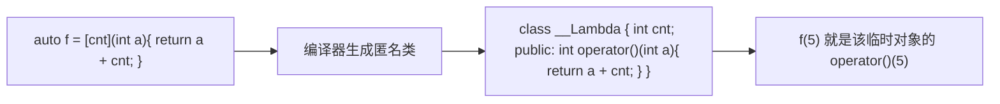

# C++常用新特性

## 零、知识地图

```text
C++常用新特性
├── 1. auto 与类型推导 —— 占位符推导、const 两条规则、decltype、四条限制（前置：类型系统）
├── 2. 范围 for 与结构化绑定 —— 迭代器循环一行化、pair/tuple/结构体拆包（前置：1）
├── 3. lambda 表达式（比较器实战）—— 捕获五式、匿名类本质、sort 比较器进化版（前置：1）
└── 4. 初始化列表与 constexpr（点到）—— {} 统一初始化、编译期常量、版本定位（前置：1）

学习顺序：1 → 2 → 3 → 4。理由：auto 是后面所有语法糖的接收器（1），范围 for 与结构化绑定是最日常的遍历改写（2），lambda 是竞赛价值最高的实战件（3），初始化列表与 constexpr 收口编译期话题并交代版本基线（4）。
```

## 一、为什么需要它

先做一道你会写但写得很痛的题：给一组商品（[[结构体]]：名称 + 价格），按价格排序后输出。用 [[排序]] 里的 sort，C 风格要专门写一个比较类或比较函数，离调用点十几行；遍历输出还要写 `for (vector<Goods>::iterator it = g.begin(); ...)`——类型名长、改容器类型就得跟着改（素材 C++11 pdf p4）。这些成本不改变算法，只决定考场手误的概率。

本篇讲 4 个知识点：auto 类型推导、范围 for 与结构化绑定、lambda 表达式、初始化列表与 constexpr——它们不改变复杂度，改的是"把算法写对所需的字符数"。**版本定位（竞赛基线）**：CCF-CSP / 蓝桥杯 / 洛谷主流编译器均支持 C++17，本篇以 **C++17 够用**为口径；C++20 的概念（concepts）与协程对竞赛非必需，仅在知识点 4 末尾一句话标注延伸。

## 二、知识点逐讲（每个知识点一节，共 4 节）

### 1. auto 与类型推导

前置依赖：[[数据类型与内存表示]]（类型与字面量的底层含义）、[[函数]]（返回类型声明）
后续衔接：[[#2. 范围 for 与结构化绑定]]、[[#3. lambda 表达式（比较器实战）]]（auto 接收匿名对象）

**① 它解决什么问题**

auto 在 C++11 后是**类型占位符**：声明变量时写 auto，编译器根据初始化表达式推出真实类型（素材 C++11 pdf p3）。它解决"类型名长"与"类型名难写"两个问题：`vector<int>::iterator` 换成 auto 一个词；泛型场景下类型由模板参数决定、手写不出来，只能靠推导。成本为**零**：推导发生在编译期，生成代码与手写类型完全一致。C 等价写法：`auto x = 3;` 就是 `int x = 3;`。

**② 直觉理解**

模型级类比：**快递代签**——auto 是收件人栏写"代签"，包裹上印着谁（初始化表达式是什么类型），签收单上就是谁，你不必提前知道包裹内容。小数据推演（素材 p6-8 四连）：`int x = 0; const auto n = x;` 得 const int；`auto f = n;` 得普通 int；`const auto& r1 = x;` 得 const int&；`auto& r2 = r1;` 仍是 const int&——四条结论在④追踪表逐行对账。

**③ 原理与推导**

两条核心规则（素材 p7 总结）：**不用引用时，auto 丢掉表达式的 const；用引用时，auto 保留 const**。为什么这样设计（动机）：拷贝产生全新对象，原对象"只读"的约束没有理由搬进新家——`auto f = n` 的 f 与 n 是两块内存；而引用是别名，若允许别名丢 const，等于开了改常量的后门。decltype（素材 p14-15）：与 sizeof 同款的"问类型不求值"操作符，`decltype(num1 + num2) num3;` 得到表达式结果的类型（int + long 得 long），不真正执行加法——auto 只能"按初始化值推"，decltype 能"按任意表达式推"，这是它存在的理由。auto 的四条限制（素材 p9-13）：不能作函数参数（C++11）、类非静态成员、模板实参、数组类型——`auto a2 = arr` 推出 int* 而非数组（退化为指针，见④对照）。

**④ 代码演示**　块一核心代码（素材 p4-p5 迭代器进化版，自编整理；关键行标 C 等价）：

```cpp
#include <iostream>
#include <vector>
using namespace std;
int main() {
    vector<int> vc = {1, 2, 3, 4, 5, 6};
    for (auto it = vc.begin(); it != vc.end(); it++)  // auto 等价 vector<int>::iterator
        cout << *it << " ";
    cout << endl;  // 输出 1 2 3 4 5 6
    int x = 0;
    const auto n = x;    // const int：显式要求才带 const
    auto f = n;          // int：拷贝丢 const（对：f 可写，不影响 x）
    const auto& r1 = x;  // const int&：别名保留只读
    auto& r2 = r1;       // const int&：引用链上 const 传染
    cout << f << " " << n << " " << r2 << endl;  // 输出 0 0 0（实测附录 B-5）
    return 0;
}
```

| 步骤 | 当前元素 | 结构状态 | 动作 | 结果 |
|:---:|:---:|:---|:---|:---|
| 1 | const auto n = x | x 为 int(0) | 拷贝推导 auto=int，外层 const 保留 | n: const int |
| 2 | auto f = n | n 为 const int | 值拷贝，丢弃 const | f: int |
| 3 | const auto& r1 = x | x 为 int | 引用 + const 修饰 | r1: const int& |
| 4 | auto& r2 = r1 | r1 为 const int& | 引用推导保留 const | r2: const int& |

```diff
- int arr[100] = {0}; auto auto_arr = arr;  // 坑1：推出 int* 而非数组，sizeof 400 变 8，长度信息丢失（WA 隐患）
+ auto& arr_ref = arr;                      // 引用绑定数组：仍视为 int[100]，sizeof 保持 400
- auto auto_arr2[1] = arr;                  // 坑2：auto 不能推导数组类型，编译错（素材 p13）
+ int auto_arr2[1] = {0};                   // 数组长度必须显式写
- auto funcName(int v1, int v2) { return v1 + v2; }  // 坑3：C++11 下返回值推导非法（素材 p10）
+ // C++14 起合法；C++11 过渡写法：显式写返回类型 int funcName(int, int)
```

**⑤ 典型应用**
- 真题：素材 p4 到 p5 是同一段遍历代码的前后对照——迭代器声明从 `vector<int>::iterator` 缩为 auto；竞赛中所有 STL 迭代器声明一律 auto，接收 lambda 也靠它（知识点 3 全篇依赖此条）。
- 迁移题（自编示例）：把 `for (map<string,int>::iterator it = mp.begin(); it != mp.end(); ++it) cout << it->first;` 改为 auto 版。建议先独立做，再对照题解：it 的类型整体替换为 auto，其余一个字符不动——auto 只负责抄写类型，循环逻辑零改动。

**⑥ 坑点与边界**
> **【易错】** 拷贝丢 const 后误以为还有只读保护：`const int c = 5; auto a = c; a = 6;` 合法，改的是副本；要只读别名必须 `const auto&`。

> **【易错】** auto 推导数组得指针（④坑 1），对"数组长度"的一切假设失效；C++11 下函数参数也不能写 auto（C++14 起返回值推导才放开，A-3 登记 1）。

> [!example]-
> **边界数据集（先自己跑一遍，再展开对照）**
> 1. 空输入：auto 仅在声明处生效；`auto x;` 无初始化直接编译错（预期：报错，推导无依据）。
> 2. 单元素：`auto x = 42;` 得 int（字面量默认 int，预期：is_same_v<decltype(x), int> 为真）。
> 3. 全相同：`auto a = 3, b = 4;` 同一声明列表推导一致，均 int（预期：编译通过）。
> 4. 严格递增：`auto s = 1 + 2L;` 表达式类型取更宽的 long（预期：long）。
> 5. 严格递减：`const auto& r = 42;` 临时量的 const 引用延长生命周期（预期：合法，r==42）。
> 6. 极值：`auto big = 2147483647LL;` 得 long long（预期：8 字节，避免 int 溢出）。

回扣开场：迭代器的长类型名被 auto 一词收编。现在你能解决开场"写起来费手"的问题了——用的是③的两条推导规则与④的核心代码。

### 2. 范围 for 与结构化绑定

前置依赖：[[#1. auto 与类型推导]]、[[STL]]（vector 与 pair 基本用法）、[[结构体]]（成员访问）
后续衔接：[[#3. lambda 表达式（比较器实战）]]、[[图的概念存储与遍历]]（邻接表遍历的惯用写法）

**① 它解决什么问题**

范围 for（C++11，素材 p28）把"从头到尾过一遍容器"压成一行；结构化绑定（C++17，素材 p10-11）把"取出 pair/tuple/结构体的每个成员"再压一步。两者解决同一个问题：手写下标或迭代器循环有三个出错点——上界差一、迭代器推进漏写、解引用忘写，字符数与出错面成正比。C 等价：`for (auto v : a)` 就是 `for (i = 0; i < n; i++) v = a[i];`。复杂度不变：仍线性扫一遍 O(n)。

**② 直觉理解**

模型级类比：**发考卷**——手写下标循环是自己喊"第几份"边喊边发，范围 for 是按顺序人手一份自动发，不存在喊错号；结构化绑定是**拆信封**，每张考卷（pair）里两页（姓名、分数），绑定一次两页各有名字。小数据推演（自编示例，n=3）：stu = {("A",90),("B",75),("C",88)}，`for (auto& [name, sc] : stu)` 依次拆出 A/90、B/75、C/88，累加得 253——④追踪表逐行对账。

**③ 原理与推导**

范围 for 是纯语法糖，编译期展开为等价的迭代器循环：

```text
for (声明 : 容器)
    编译器展开为：{ auto __b = begin(容器), __e = end(容器);
      for (; __b != __e; ++__b) { 声明 = *__b; 循环体 } }
```

文字版推导链：先取 begin/end 两个迭代器；每轮比较是否到尾；解引用交给声明（auto 或 auto&）；++__b 推进——生成代码与手写迭代器循环一致，性能无差。

结构化绑定规则：绑 pair/tuple 按元素个数，绑结构体按成员，个数必须一致（多一个少一个都编译错，且不能声明为类成员）；**auto& 引用绑定可改原值，auto 拷贝绑定改的是副本**（实测附录 B-5：引用版 +5 生效，拷贝版清零无效）。为什么 C++17 要加它（动机）：C++11 取 tuple 要先声明变量再 `tie(name, age, gender) = student`（素材 p10），三行变一行，"就地命名"让每个变量的来源一眼可见。

**④ 代码演示**　块一核心代码（素材案例代码 mycode.cpp test06 的 tuple 版 + 自编 pair 版；改动：pair 部分为自编示例）：

```cpp
#include <iostream>
#include <vector>
#include <tuple>
using namespace std;
int main() {
    auto student = make_tuple(string{"Zhangsan"}, 19, string{"man"});
    auto [name, age, gender] = student;   // C++17 一行拆三；C 等价：tie 三行
    cout << name << " " << age << " " << gender << "\n";
    vector<pair<string,int>> stu = {{"A",90},{"B",75},{"C",88}};
    int sum = 0;
    for (auto& [sname, sc] : stu) sum += sc;   // 引用绑定：可读可写
    stu[1].second += 5;
    for (auto [sname, sc] : stu)               // 拷贝绑定：只读视角
        cout << sname << ":" << sc << " ";
    cout << "| sum=" << sum << endl;           // 输出 Zhangsan 19 man 与 A:90 B:80 C:88 | sum=253
    return 0;
}
```

| 步骤 | 当前元素 | 结构状态 | 动作 | 结果 |
|:---:|:---:|:---|:---|:---|
| 1 | ("A",90) | sum=0 | *__b 解引用，绑定 name="A"、sc=90 | sum=90 |
| 2 | ("B",75) | sum=90 | 绑定 B/75 | sum=165 |
| 3 | ("C",88) | sum=165 | 绑定 C/88，到尾退出 | sum=253，输出 |

```diff
- for (auto& x : stu) stu.push_back({x.first, 0});  // 坑1：循环中扩容致迭代器失效（UB/RE）
+ vector<pair<string,int>> add;                      // 收集到别处，循环外再合并
- for (auto [name, sc] : stu) sc += 5;               // 坑2：拷贝绑定改副本，原容器不动（答案错）
+ for (auto& [name, sc] : stu) sc += 5;              // 引用绑定才写回
```

**⑤ 典型应用**
- 真题：素材 p28"像 Python 一样简洁"的容器/数组遍历（`for (auto x : arr)` 对 `int arr[10]` 同样成立）；图论邻接表 `for (auto& [v, w] : g[u])` 一行拆出邻居与边权（与 [[图的概念存储与遍历]] 配合；标注：资料未覆盖，属补充）。
- 迁移题（自编示例）：n 名学生 (姓名, 分数)，输出最高分学生姓名与分数（n ≤ 10^5）。建议先独立做，再对照题解：`auto& [name, sc]` 扫描一遍维护 best，单次线性 O(n)，与手写下标循环同复杂度，代码量约省一半。

**⑥ 坑点与边界**
> **【易错】** 循环体内 push_back / erase 容器本身：迭代器失效，轻则乱序重则 RE；增删要么循环外做，要么换下标循环。

> **【易错】** 拷贝绑定以为能写回（④坑 2）：要修改原容器必须 auto&。

> [!example]-
> **边界数据集（先自己跑一遍，再展开对照）**
> 1. 空输入：空 vector 范围 for，begin==end 零次执行（预期：无输出不崩）。
> 2. 单元素：1 个 pair，绑定一次即退出（预期：sum 等于该分数）。
> 3. 全相同：三个 ("A",5) 拆包三次同值（预期：sum=15）。
> 4. 严格递增：分数 1..n（预期：累加得 n(n+1)/2）。
> 5. 严格递减：分数 n..1，顺序无关（预期：与 4 同和）。
> 6. 极值：10^5 个 (i, 10^9) 累加，int 溢出，sum 必须 long long（预期：改后约 10^14，正确）。

回扣开场：三处出错点的手写循环被一行收编。现在你能一行遍历任何容器、一行拆开任何 pair——下一节让排序的比较规则也变得一样短。

### 3. lambda 表达式（比较器实战）

前置依赖：[[#1. auto 与类型推导]]（auto 接收匿名对象）、[[函数]]（函数指针与参数传递）、[[排序]]（sort 与比较器）
后续衔接：[[#4. 初始化列表与 constexpr（点到）]]、[[STL]]（所有带自定义比较的算法通用此法）

**① 它解决什么问题**

sort 给自定义类型排序需要比较规则。C++98 的做法是写一个仿函数类（重载 operator()，素材 p38 的 Compare 类），规则与调用点分离十几行。lambda（C++11，素材 p29）把规则**就地写进 sort 的参数**：`[](const Goods& a, const Goods& b){ return a.price < b.price; }`。C 等价：一个匿名函数，等于"另写比较函数 + 把函数指针传给 qsort"的 C++ 化。调用开销与普通函数同量级（可被内联），比较本身 O(1)。

**② 直觉理解**

模型级类比：**临时工**——仿函数是"为公司正式设岗"（定义类、起名、再调用），lambda 是"现场喊一个临时工干这一次活"，干完即走不留编制，要用的外部工具揣在自己口袋里（捕获列表）。小数据推演（素材 p34 的 mutable 例）：`int x = 10; auto add_x = [x](int a) mutable { x *= 2; return a + x; };` 调 add_x(10)：口袋里的副本 x 翻倍成 20，返回 30；外部 x 仍是 10——捕获是"复印一份揣兜里"。

**③ 原理与推导**

语法五部件（素材 p30）：`[捕获列表](参数列表) mutable -> 返回类型 { 函数体 }`，参数、返回类型、mutable 均可省，**[] 与 {} 不能省**——为什么 [] 不能省（设计动机）：编译器靠 [] 识别"这是 lambda"，正如字符串字面量靠引号识别。捕获列表五式（素材 p31）：`[a,&b]` 指定捕获（a 复制、b 引用）；`[=]` 全部按值；`[&]` 全部按引用；`[this]`（C++17 另有 `[*this]` 捕副本）；`[]` 不捕获；按值捕获默认不可改（lambda 默认是 const 函数），要改加 mutable。lambda 的本质（素材 p29、p35-36）：编译器把 lambda 翻译成一个**匿名类对象**——捕获的变量成为它的成员，函数体成为 operator()，与仿函数"从使用方式上完全一样"（素材原话），这正是它能取代 Compare 类的原因。



文字版推导链：[] 里的捕获变成匿名类的成员变量（[&] 即引用成员）；() 与 {} 原样成为 operator() 的参数与体；auto f 接收的就是这个对象——"捕获"是成员变量、"调用"是运算符重载，[[面向对象编程]] 的 operator() 在此兑现。

**④ 代码演示**　块一核心代码（素材 C++11 pdf p39 Goods 排序 lambda 版 + p74-75 统计字符练习，逻辑原样，自编整理）：

```cpp
#include <iostream>
#include <algorithm>
#include <string>
using namespace std;
struct Goods { string name; double price; };
int main() {
    Goods gds[] = {{"apple",5.1},{"orange",9.2},{"banana",3.6}};
    // C 等价：qsort 传比较函数指针；此处比较器就地写
    sort(gds, gds + 3, [](const Goods& l, const Goods& r) { return l.price < r.price; });
    for (auto& g : gds) cout << g.name << " ";   // 输出 banana apple orange
    cout << endl;
    string s = "abcstringabc"; char c = 'a'; int cnt = 0;
    for_each(s.begin(), s.end(), [&](char ch) { if (ch == c) cnt++; });  // [&] 才能回写
    cout << cnt << endl;                         // 输出 2
    return 0;
}
```

| 步骤 | 当前元素 | 结构状态 | 动作 | 结果 |
|:---:|:---:|:---|:---|:---|
| 1 | 'a'(下标0) | cnt=0 | ch==c 成立 | cnt=1 |
| 2 | 'b' 至中段 9 字符 | cnt=1 | 均不等 | cnt=1 |
| 3 | 'a'(下标9)，随后扫完 11 字符 | cnt=1 到 2 | 相等；for_each 结束 | cnt=2，输出 2 |

```diff
- for_each(s.begin(), s.end(), [cnt, c](char ch) { if (ch == c) cnt++; });
+ // 坑1：值捕获 cnt 改的是副本——默认 const 函数直接编译错；加 mutable 能编译但外部 cnt 仍为 0（WA）
+ for_each(s.begin(), s.end(), [&](char ch) { if (ch == c) cnt++; });   // 引用捕获回写（实测 cnt==2）
- sort(g, g+3, [](const Goods& a, const Goods& b){ return a.price <= b.price; });
+ // 坑2：<= 破坏严格弱序——相等元素互认"都更小"，sort 内部可能越界（RE）；严格弱序要求相等双 false
+ sort(g, g+3, [](const Goods& a, const Goods& b){ return a.price < b.price; });
```

**⑤ 典型应用**
- 真题：洛谷 P1177【模板】快速排序——sort + lambda 升序比较器即可（题号真实）；洛谷 P1525 关押罪犯——cmp 按矛盾值降序 `return x.c > y.c`，与 [[并查集与种类并查集]] 知识点 4 的比较器同型，是"lambda 版 cmp"的标准竞赛用法。
- 迁移题（自编示例）：n 个 (编号, 收益) 元组，按收益降序、收益同则编号升序输出前 k 个（n ≤ 10^5）。建议先独立做，再对照题解：双关键字比较器 `return a.y != b.y ? a.y > b.y : a.id < b.id;`，总复杂度 O(n log n) 全在 sort，比较器本身 O(1)。

**⑥ 坑点与边界**
> **【易错】** 值捕获以为能回写（④坑 1）：计数、累加类一律 [&]；跨作用域存活的回调才考虑 [=]。

> **【易错】** 比较器用 <= 或 >=（④坑 2）：违反严格弱序，轻则 WA 重则 RE；另注意 lambda 赋给函数指针仅当无捕获（[] 开头）才可行（素材 p33-34），有捕获的只能用 auto 接收。

> [!example]-
> **边界数据集（先自己跑一遍，再展开对照）**
> 1. 空输入：空容器 sort，区间为空，比较器零次调用（预期：不崩）。
> 2. 单元素：1 个 Goods，零次比较（预期：顺序不变）。
> 3. 全相同：价格全 5.0，比较器恒 false（预期：不崩不乱序）。
> 4. 严格递增：价格 1..n，升序比较器零交换（预期：原序输出）。
> 5. 严格递减：价格 n..1，满交换（预期：翻转为升序）。
> 6. 极值：价格 1e308 与 -1e308（double 极值）（预期：比较正确，不溢出不崩）。

回扣开场：Compare 类十几行的"正式编制"被一行临时工取代。现在你能解决开场商品排序的写法问题了——用的是③的匿名类本质与④的就地比较器。

### 4. 初始化列表与 constexpr（点到）

前置依赖：[[#1. auto 与类型推导]]、[[结构体]]（构造与成员）、[[一维数组与字符串]]（C 数组的 {} 初始化）
后续衔接：[[STL]]（容器初始化惯用法）、[[模板]]（编译期常量作模板参数）

**① 它解决什么问题**

C++98 只允许 {} 初始化数组；vector、自定义类只能"先构造再逐个塞"（素材 C++11 pdf p26）。C++11 的**列表初始化**把 {} 推广到一切类型；**constexpr**（点到）把"编译期就能算出"的量显式声明出来，供数组长度与模板参数使用。C 等价：`vector<int> v{1,2,3};` 给你 C 里 `int a[3] = {1,2,3};` 的"一次成型"体验。初始化仍 O(n) 逐元素；constexpr 求值发生在编译期，运行期零开销。

**② 直觉理解**

模型级类比：**填表一次成型 vs 反复涂改**——列表初始化是"申请表一次填完交上去"（构造即成型），老写法是"先领空白表，再一栏一栏补"（构造后 push_back）；constexpr 是"开考前就印好的标准答案"，编译期算好，运行期直接抄。小数据推演（素材 p27）：`vector<int> v{12, 2};` 两个元素一次到位；`map<int,int> mp{{1,2},{3,4}};` 两对键值直接进表；`ClassNum p{1, 2};` 走 (int,int) 构造函数得 x=1、y=2。

**③ 原理与推导**

{} 的三条规则：可加 = 也可不加（`int num2{3}` 合法，素材 p27）；对自定义类型走匹配的构造函数；**带窄化检查**——`int x{3.14}` 编译错，而 `int x = 3.14` 只是警告。为什么要有窄化检查（动机）：{} 的定位是"精确初始化"，浮点悄悄截断成 int 这种信息丢失必须在编译期拦下。constexpr：变量即编译期常量，可作数组长度与模板实参；C++17 的 if constexpr（素材 p8）把"编译期选分支"升级为"编译期裁剪代码"——条件不成立的分支连汇编都不生成（案例代码 mycode.cpp test04 实测）。`array<int, len>` 的 len 若是运行期变量则编译错（素材 p63-64）：模板参数在**实例化时**就要确定，而实例化发生在编译期——这就是 constexpr 存在的舞台。

**④ 代码演示**　块一核心代码（素材 p27 列表初始化全谱缩编 + C++17 if constexpr；改动：缩编并补注释）：

```cpp
#include <iostream>
#include <vector>
#include <map>
using namespace std;
class ClassNum {
public:
    ClassNum(int n1 = 0, int n2 = 0) : x(n1), y(n2) {}
    int x, y;
};
int main() {
    int num1 = {100}, num2{3};      // 内置类型：带 = 与不带 = 均可
    int arr1[5] = {1,3,4,5,6};      // C++98 就有的数组版
    vector<int> v{12, 2};           // C++11 起容器同权
    map<int,int> mp{{1,2},{3,4}};
    ClassNum p{1, 2};               // 自定义类型走构造函数
    constexpr int N = 5;            // 编译期常量，可作数组长度
    int buf[N] = {};                // 长度来自编译期常量
    auto describe = [](auto val) { if constexpr (sizeof(val) == 4) return 4; else return 8; };
    cout << describe(1) << describe(1.0) << " " << v[1] << " " << p.x << endl;  // 输出 48 2 1
    return 0;
}
```

| 步骤 | 当前元素 | 结构状态 | 动作 | 结果 |
|:---:|:---:|:---|:---|:---|
| 1 | constexpr int N = 5 | 编译期 | 常量折叠进符号表 | N 即 5，无内存读取 |
| 2 | int buf[N] = {} | 编译期 | 按 N=5 定长 | 栈上 20 字节 |
| 3 | vector<int> v{12,2} | 运行期 | initializer_list 构造 | v 有两个元素 |
| 4 | describe(1.0) | 编译期选分支 | 保留 sizeof==8 分支 | 只编译 return 8 |

```diff
- int len = 3; array<int, len> arr2 = {4,5,6};  // 坑1：运行期变量作模板参数，编译错（素材 p63-64）
+ constexpr int len = 3; array<int, len> arr2 = {4,5,6};  // 提为编译期常量即合法
- int x{3.14};                                  // 坑2：{} 窄化检查，浮点转 int 编译错
+ int x = 3.14;                                 // 显式接受截断用赋值写法
- if (sizeof(val) == 4) return 4; else return 8;  // 坑3：泛型里普通 if 两分支都编译，非法分支报错
+ if constexpr (sizeof(val) == 4) return 4; else return 8;  // 编译期裁剪
```

**⑤ 典型应用**
- 竞赛惯用法：棋盘/矩阵题 `constexpr int N = 105;` 配 `array<array<int,N>,N> g{};`——constexpr 定长 + 列表初始化清零；if constexpr 在泛型代码里按编译期信息裁剪分支（素材 p8）。前者的"运行期变量当长度会编译错"正是③的实例化时机推论（标注：资料未覆盖，属补充）。
- 竞赛版本定位收口（**延伸，非必需**）：C++20 的概念（concepts，给模板参数加类型要求）与协程（co_await / co_yield / co_return 三关键字，可挂起再恢复的函数，素材 C++20 pdf p10）面向异步与泛型工程，竞赛数据规模下用不到，一句话存档即可；本机 g++ 8.1.0 无法编译协程（需 GCC 10+），协程案例.cpp 仅作阅读材料登记（附录 B-5）。

**⑥ 坑点与边界**
> **【易错】** 运行期变量当数组长度或模板参数（④坑 1）：VLA 不是标准 C++；一律 constexpr。

> **【易错】** {} 窄化被编译错拦下，误判"编译器坏了"（④坑 2）：列表初始化比赋值严格，这是特性不是缺陷；另注意 constexpr 函数传运行期变量会退化为普通函数调用（要强保证用 consteval，C++20，延伸一句话）。

> [!example]-
> **边界数据集（先自己跑一遍，再展开对照）**
> 1. 空输入：`vector<int> v{};` 空容器合法（预期：size()==0）。
> 2. 单元素：`int num2{3};` 精确初始化一个（预期：值 3）。
> 3. 全相同：`int a[5]{7,7,7,7,7};`（预期：逐位为 7）。
> 4. 严格递增：`vector<int> v{1,2,3,4,5};`（预期：v[i]==i+1）。
> 5. 严格递减：`vector<int> v{5,4,3,2,1};`（预期：v[0]==5）。
> 6. 极值：`long long big{9223372036854775807LL};` 保留极值（预期：不溢出；写成 int{...} 则编译错被拦）。

回扣开场："先构造再塞"的啰嗦初始化与"长度靠猜"的数组声明都有了编译期答案。现在你能用 {} 一次成型、用 constexpr 把常量钉死在编译期——四个知识点合起来，C++17 的日常写法工具箱已经齐了。

## 三、全篇坑点总表

| # | 坑 | 正解 |
|---|-----|------|
| 1 | auto 拷贝丢 const / 推导数组得指针 | 只读别名 const auto&；数组用 auto& 绑定（知识点 1） |
| 2 | 范围 for 内 push_back/erase | 增删移出循环，或改下标循环（知识点 2） |
| 3 | 拷贝绑定以为能写回 | auto& 引用绑定 |
| 4 | lambda 值捕获想回写计数 | [&] 引用捕获（知识点 3） |
| 5 | 比较器写 <= 破坏严格弱序 | 严格 < 或 >，相等双 false |
| 6 | 运行期变量作模板参数/数组长度 | constexpr 常量（知识点 4） |
| 7 | {} 窄化报错、泛型内普通 if 编译两分支 | 显式赋值；if constexpr 编译期裁剪 |

## 四、总结与自测

### 核心内容（一页纸速览）

- **auto**：类型占位符，编译期推导零开销；不用引用丢 const、用引用保留 const；decltype 按表达式问类型不求值；不能推数组（退化为指针）。
- **范围 for**：编译期展开为 begin/end 迭代器循环，性能与手写一致；循环内增删容器即失效。
- **结构化绑定**：pair/tuple/结构体一行拆包；auto& 可写回，auto 改副本。
- **lambda**：编译器翻译为匿名类，捕获即成员、调用即 operator()；比较器就地写是竞赛主用法；值捕获默认只读，mutable 解锁副本可写。
- **初始化列表**：{} 全类型通吃，带窄化检查；自定义类型走匹配构造函数。
- **constexpr / if constexpr**：编译期常量与编译期分支裁剪；模板参数必须编译期确定。**版本口径**：竞赛 C++17 够用，C++20 概念与协程标延伸。

### 自测清单

- [ ] 能默写 auto 的 const 两条规则并用素材 p6-8 四连语句逐条推演
- [ ] 能手写范围 for 的编译期展开等价代码
- [ ] 能解释 lambda 与仿函数的对应关系（成员变量 / operator()），并写出双关键字比较器、说明为何不能用 <=
- [ ] 能指出 array<int, len> 编译错的根因并给出 constexpr 修复
- [ ] 能说出 {} 与 = 初始化的差异（构造匹配、窄化检查、无 = 亦可）

### 错题登记

| 题号 | 错因 | 正解要点 |
|------|------|---------|
| （学完后填写） | | |

## 五、语法糖对照表

| 语法 | 等价 C 写法 | 一句话用途 |
|------|------------|-----------|
| `auto x = e;` / `decltype(e) v;` | 显式写出 e 的类型 | 免写长类型名；decltype 求类型不求值 |
| `for (auto v : a)` | `for(i=0;i<n;i++) v=a[i];` | 线性遍历一行 |
| `auto& [a, b] = p;` | `a=p.first; b=p.second;` | pair/tuple/结构体拆包 |
| `[cap](参数){体}` | 另定义函数 + 传函数指针 | 就地匿名函数带上下文 |
| `vector<int> v{1,2};` | `int a[2]={1,2};` 后逐个复制 | 容器一次成型初始化 |
| `constexpr int N = 5;` / `if constexpr (c)` | `#define N 5` / 宏裁剪（类型安全替代） | 编译期常量；编译期裁剪分支 |

## 附录（供验收，正文之外，不影响阅读）

### 附录 A　源文件覆盖对账

#### A-1 提取表

| 源文件 | 提取方式 | 完整性 |
| --- | --- | --- |
| C++11 常用新特性.pdf（77 页） | 提取文本直读 | 完整：auto/decltype（p3-19）、右值引用与移动语义（p20-25）、列表初始化（p26-27）、范围 for（p28）、lambda（p29-39）、智能指针（p40-52）、可变参数模板（p53-57）、默认成员函数控制（p58-59）、新增容器（p60-73）、练习（p74-75） |
| C++17 常用新特性.pdf（52 页） | 提取文本直读 | 完整：折叠表达式（p3-4）、类模板推导（p6）、constexpr if（p8）、结构化绑定（p10-11）、if/switch 初始化（p12）、charconv/variant/optional/any/string_view/filesystem（p23-50） |
| C++20 常用新特性.pdf（28 页） | 提取文本直读 | 完整（目录级）：模块（p3-9）、协程（p10）、三向比较（p11-12）、ranges（p13-14）、日期时区/格式化/span/并发（p15-25） |
| mycode.cpp + mycode.h + Test002.cpp（C++11/17/20 三版）；C++11 hw.cpp / C++ 17 hw.cpp / 协程案例.cpp | 全文直读 | 完整：test01-test21 覆盖 C++17 语言与库特性；hw 为 unique_ptr 右移位、filesystem 遍历；协程案例为 Generator 斐波那契 |

#### A-2 知识点总清单（4 对 4）

| 序号 | 知识点 | 对应源文件 | 优先级 |
|------|--------|-----------|--------|
| 1 | auto 与类型推导 | C++11 pdf p3-19 + 案例代码迭代器用法 | P0 |
| 2 | 范围 for 与结构化绑定 | C++11 pdf p28 + C++17 pdf p10-11 + mycode.cpp test05/test06 | P0 |
| 3 | lambda 表达式（比较器实战） | C++11 pdf p29-39 + p74-75 练习 | P0 |
| 4 | 初始化列表与 constexpr（点到） | C++11 pdf p26-27 + C++17 pdf p8 + mycode.cpp test04 | P0 |

依赖关系：auto 是 lambda 接收与范围 for 声明的载体（1 到 2、1 到 3）；结构化绑定需 C++17 且常与范围 for 连用（2 到 3）；初始化列表与 constexpr 收口编译期话题（1 到 4）。右值引用、移动语义、智能指针、可变参数模板、默认成员函数控制、新增容器、charconv、variant、optional、any、string_view、filesystem 与 C++20 全部特性属工程向，竞赛非必需，处理决策登记于附录 B-2。

#### A-3 冲突与约定差异登记（3 项）

| 何处冲突 | 采信哪方 | 理由 |
| --- | --- | --- |
| 函数返回推导：C++11 pdf p9-10 把 auto 列入"限制"，又自注 C++14 起返回值推导可用 | 采信标准口径：C++14 起函数返回类型推导合法，泛型 lambda 参数 auto 亦自 C++14 起 | 同页自注即标准答案，"限制"条目按版本分界理解 |
| C++11 pdf p23 注释把 returnNum() = 111 归入编译失败讨论 | 采信标准语义：返回引用可作左值，该行合法 | 真正编译失败的是 num3 + 2 = 200（临时量），两行相邻易混，注释归属按语法判定 |
| 断言阈值：比较器计数初写 cmpCnt >= 3，实测 3 元素 sort 仅比较 2 次 | 采信实测（附录 B-5），断言修正为 >= 2 | 3 元素走插入排序路径，比较次数不固定；教训：比较器调用次数不可假设 |

### 附录 B　假设与缺口登记

- B-1 假设清单：学习者 C 基线（[[数据类型与内存表示]]、[[函数]]、[[结构体]] 已掌握）；vector/pair/sort 已随 [[STL]]、[[排序]] 同批掌握。
- B-2 资料缺口（已决策）：C++20 pdf 为目录级介绍，本篇仅在知识点 4⑤ 一句话定位（概念/协程标延伸）；折叠表达式在断言程序中顺带实测（`(... + args)`），正文不设节；C++17 的 if/switch 带初始化、variant/optional/any/string_view 等库特性与右值引用/智能指针等工程向内容竞赛非必需，未入知识点清单（总清单 4 条为必要充分集）。读取缺口：三份 pdf 提取文本完整无乱码，无渲染缺口。
- B-3 自编内容：知识点 1⑤ 迁移题、知识点 2② 小数据与 ④ pair 版与 ⑤ 迁移题、知识点 3⑤ 迁移题、知识点 4⑤ 邻接矩阵应用，均标注"自编示例"。
- B-4 编译验证记录：断言程序 verify_features.cpp（自编，覆盖四知识点 14 断言），g++ 8.1.0 `-std=c++17 -O2 -Wall` 编译 exit=0，运行输出 ALL 14 ASSERTS PASS：auto 的 const 两规则与数组退化（static_assert 5 条）、引用/拷贝绑定写回对比、lambda 升降序比较器（实测 3 元素仅 2 次比较，见 A-3 登记 3）、[&] 计数回写（cnt==2）、折叠表达式 `(... + args)`、列表初始化与 if constexpr 分支裁剪。素材侧：C++11 hw.cpp 含 stdafx.h（VS 工程头）本机不可直编，其算法逻辑（下标循环右移）已人工核读；协程案例.cpp 需 GCC 10+ 启用协程，本机 g++ 8.1.0 编译缺口如实登记（延伸材料，不影响正文结论）。

### 附录 C　交付前自检清单

- [x] 六步叙事：4 个知识点全部按 ①-⑥ 展开，无跳步
- [x] 源文件对账（A-1 全列）；知识点总清单 4 条 = 正文 4 节（A-2）；代码均 C++17 可编译（B-4 实测），自编处已标注、素材改动已注明
- [x] 全文无 emoji；无"显然 / 易得 / 略"类措辞；表格均 ≤6 列；标题不跳级
- [x] 知识地图文本树在篇首；每知识点有前置依赖/后续衔接双链字段
- [x] 代码演示三块齐全：核心代码 + 五列执行追踪表 4 张 + diff 错误对照 4 组
- [x] 每知识点末尾边界数据集折叠 callout（[!example]- 独占一行，六类含极值）
- [x] C++ 特性首现处有 C 等价注释；篇末语法糖对照表 6 条；mermaid 1 个且配文字版推导链
- [x] 双链只用库内真实笔记；frontmatter 六项齐全；编译验证留痕（B-4）；假设与缺口全部登记在附录，正文零工程痕迹
